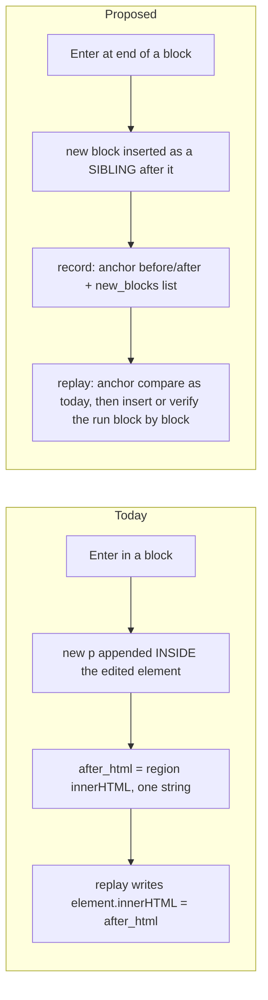
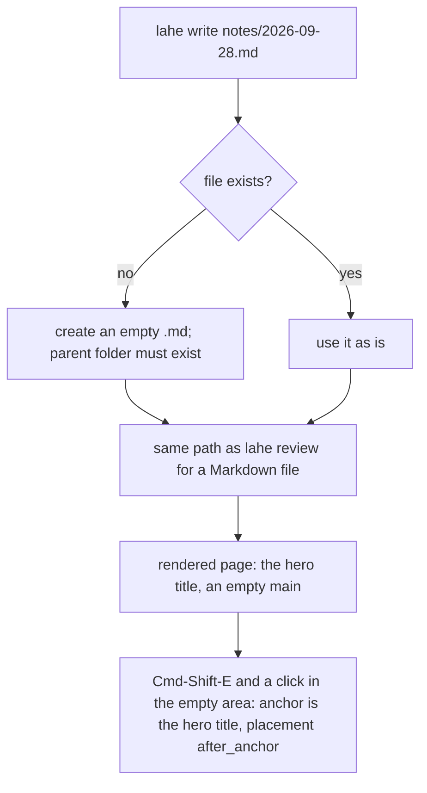
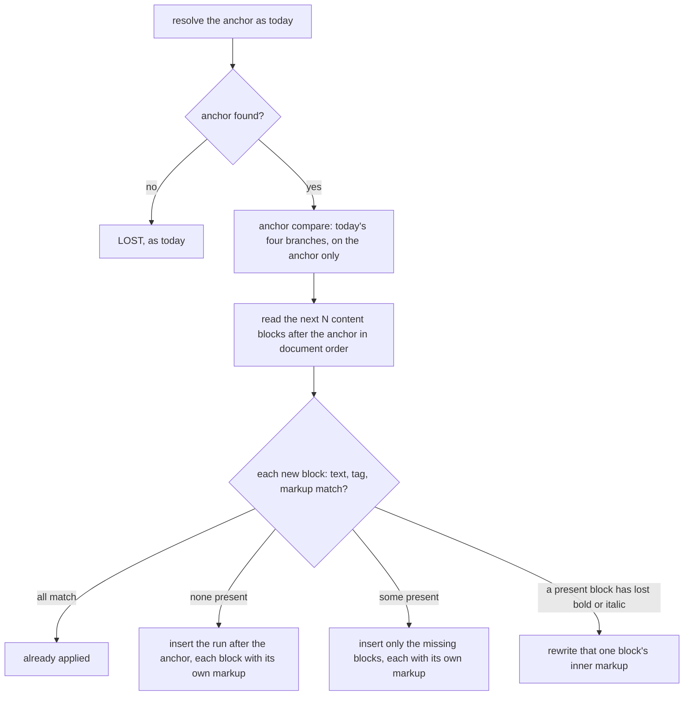

# Architecture: Free writing

## Summary

Free writing extends today's edit, it does not add a second one. An edit becomes an existing **anchor block** plus a **run** of new sibling blocks written after it. Those blocks can be paragraphs, headers, or lists. Everything written in one sitting is one `edit` record. The record gains a structured list of the new blocks and, when the reviewer changed it, the anchor's new tag.

Writing in empty space works the same way. The block just above the click becomes the anchor. It is left unchanged and only gains a run.

Lahe's own editing code stays the engine and learns block types. The Tiptap spike showed that Tiptap works for new blocks and damages existing ones. One sitting crosses both, so Tiptap is rejected (see Alternatives Considered). **This goes against Ken's stated lean, so it is his call before the plan.**

Replay learns to insert a run after its anchor, and to check each new block's text, tag, and markup on its own. That fixes the doubled header line and the lone paragraph that loses its bold. The contract, the handled check, and a new `lahe write` command follow from the new record fields.

::: xref
[Brief: Requirements](01_brief_free_writing.html#requirements)
:::

## Analysis of Existing Structure



- **Stays:** the gesture, the frame, and the bar. So do the item lifecycle, the one-commit-per-session rule, and `before` pinned at first touch. The anchor ladder for finding a block, the replay compare for the anchor block, and the rules for bold and italic markup also stay.
- **Changes:** Enter no longer nests a block inside the edited element. The edited area can be several sibling elements. Replay gains an insert path. The handled check learns block structure. The contract gains rules for placing new blocks.
- **Root cause of two open bugs**, both from the recon trace:
  - The doubled line under a header: Enter nests the new `<p>` inside the `<h2>`. Replay's check for text that is already there looks only at the next sibling element. In a Lahe Markdown render that sibling is the "Section 1" label, not the paragraph. Replay then rewrites the header's inner HTML with the nested paragraph, so the new text shows twice.
  - The lone paragraph that loses its bold (board row `LAHE-lone-paragraph-loses-markup`): replay writes a missing split piece as plain text. It also stops checking formatting once the split is found.
  Both go away when new blocks are separate siblings with their own markup, and replay reads blocks in document order.

## Components / Modules Touched

- **`src/layer/editing.js`**: the editing host spans the anchor and its run. Enter makes a sibling block. Block-type changes and Markdown-style shortcuts are written by the layer. Undo within a session. Capture of the new blocks, and a click in empty space starts a session.
- **`src/layer/protect.js`**: protects and snapshots the whole edited area, not one element. Restores it by block position and character offset.
- **`src/layer/replay.js`**: an insert path for a run. Reads "the next blocks" in document order and skips page chrome such as section labels. Compares text, tag, and markup for each block.
- **`src/layer/anchor.js`**: a rule for an empty container, so a notes page with no blocks still anchors.
- **`src/layer/tab_edits.js`, `overlay.js`**: the card and the edits list show new blocks by type.
- **`src/shared/record.js`**: new optional fields. Validation, the change text, and the undo rules for take-backs cover them.
- **`src/shared/normalize.js`**: the list of allowed block tags. A per-block text and markup reader, shared by replay and the handled check.
- **`src/shared/review_format.js`**: contract lines, the projection of `new_blocks`, and the field classes.
- **`src/service/handled_check.js`**: checks the words, their order, and their block tags.
- **`src/cli/commands/write.js`** (new), **`src/cli/index.js`**, **`docs/CLI.md`**: `lahe write`.
- **Copies that travel with the contract:** `skills/lahe/SKILL.md`, `docs/CONTRACTS.md`, and `test/unit/review_format.test.js`, plus a rebuild of `dist/`.

## Data / State Changes

No new record kind. An edit record gains three optional fields:

```json
{
  "kind": "edit",
  "before": "What changed",
  "after": "What changed\n\nWhat the chat window cost me\n\nI lost my place ...",
  "anchor_tag_after": null,
  "new_blocks": [
    { "tag": "h2", "html": "What the chat window cost me", "text": "What the chat window cost me" },
    { "tag": "p",  "html": "I lost my place <strong>every</strong> time ...", "text": "I lost my place every time ..." },
    { "tag": "ul", "html": "<li>scrolling</li><li>re-asking</li><li>copying</li>", "text": "scrolling\nre-asking\ncopying" }
  ],
  "placement": "after_anchor"
}
```

- **`new_blocks`**: the run, in order. `tag` is one of `p`, `h2`, `h3`, `h4`, `ul`, or `ol`. `html` is the block's inner markup after `cleanMarkup`, limited to `strong`, `em`, `br`, `li`, and the reset tags. It is empty or missing when the sitting only changed the anchor.
- **`anchor_tag_after`**: set when the reviewer turned the anchor itself into another block type, for example a paragraph into a header. Null otherwise.
- **`placement`**: `after_anchor`, or `start_of_container` for an empty page (see Key Flows). The field exists so the contract can name where the text goes without the agent inferring it from a diff.
- **`before`, `after`, `after_html`**: keep today's meaning, so old readers still work. `after` is the whole sitting as text, `after_full` in the projection. `after_html` becomes the anchor's own inner markup only. It no longer carries nested blocks.
- **Projection (`review.json`)**: `new_blocks` is projected in full. The 2000-character cap on `after_full` does not apply to it, because the reviewer's words go through whole (brief R6). It is classed as data, not instruction.
- **Lifecycle:** unchanged. Draft, ready, handled, and not_handled work as today. An edit with an unchanged anchor and a non-empty run is a real change. Today's check that decides whether an edit is a change learns to count the run.
- **Undo of a committed record:** the anchor gets its `before_html` back and its old tag, and the run's elements are removed. On a handled record, the take-back item asks the agent to remove the placed blocks, as with any handled edit today.

::: xref
[Brief: Decisions, one sitting is one edit](01_brief_free_writing.html#decisions-resolved)
:::

## Key Flows

### Writing a section after an existing block

```mermaid
sequenceDiagram
    participant R as Reviewer
    participant L as Layer (editing)
    participant P as Protection
    participant S as Store and helper
    participant A as Agent
    R->>L: Cmd-Shift-E, then click below "What changed"
    L->>L: anchor = "What changed" p; open a session with an empty run
    L->>P: protect anchor and run; snapshot
    R->>L: types "# ", a header, Enter, a paragraph, "- " and items
    L->>L: layer writes each block as a sibling; captures new_blocks on every input
    L->>S: draft saved in the browser on every keystroke
    R->>L: Esc
    L->>S: commit: edit record, ready, with new_blocks
    L->>P: release; replay runs at once
    A->>S: reads the item: placement after_anchor, three new blocks
    A->>A: writes them after that paragraph in the source; rebuilds
    A->>S: reply handled
    S->>S: handled check: words present, in order, tags match
    S->>L: page reloads; replay finds the run already there
```

### The editing host

Today `contenteditable` sits on one block. A run is several siblings, and the caret has to move across them freely with arrows, selection, and Backspace at the start of a block. The layer opens one editing host that spans the anchor and the run, and removes it at commit. Which kind of host works in all three browsers is the one real unknown. The plan's first task settles it (see Open Questions). The candidates, in order of preference:

1. A layer-owned wrapper with `display: contents` holding the anchor and the run. It adds no box of its own, so page layout is unchanged.
2. A plain wrapper with no styling, if a wrapper with `display: contents` cannot take focus in one of the engines.
3. `contenteditable` on each block, with the layer carrying arrow keys and Backspace across block edges.

Whichever wins, it is removed at commit, and nothing the layer adds reaches a record. Today's rule that nothing the library draws is written to the page still holds.

### Block types while writing

- **Enter** at the end of a block makes a new `p` after it. Enter in the middle splits the block into two siblings. Enter in an empty list item ends the list.
- **Shift-Enter** stays a line break.
- **Markdown-style shortcuts** at the start of a block: `# `, `## `, and `### ` make h2, h3, and h4. `- ` or `* ` makes a bulleted list and `1. ` a numbered one.
- **The bar's block-type control**, if the wireframe keeps it, does the same work. The shortcuts and the control share one function per block type.
- **Headers:** the reviewer's first level is h2, because h1 is the page title.
- **Nesting:** no nested lists and no indent in this cut.
- **One engine:** every change is written by the layer, the way breaks are today. All three browsers produce the same structure.

### Undo inside a session

The layer writes block changes itself, so the browser's own undo stack no longer reflects them. The session keeps its own history: a snapshot of the edited area at each block change, and at the end of each typing burst. Cmd-Z and Shift-Cmd-Z walk that history while the frame is open. After commit, Cmd-Z means Lahe's per-record undo, as today.

### Empty page and `lahe write`



- An empty Markdown file already renders to a working page. That page has a `main` container and a hero `h1` taken from the file name.
- For Markdown, the anchor is that hero title.
- For an HTML page with no blocks at all, the anchor is the container itself with `placement: start_of_container`. The anchor ladder gets one rule: an empty container anchors by its own signature and is not marked lost.
- The agent writes the file (brief Decision: who writes the notes file).

### Replay after a rebuild



"Next content block" means the next element in document order whose tag is in the normalizer's block list and which is not an ancestor of the anchor. Page chrome between blocks is not counted: labels in inline tags, like the Markdown render's "Section 1", and elements with no text of their own.

## Alternatives Considered

- **Tiptap as the engine for new blocks only (Ken's lean).** It came closest. The spike measured:
  - **Size:** it adds 104 to 121 KB gzipped to every reviewed page. That is about a fifth of the shipped layer.
  - **New writing:** h2, p, and ul came out with the page's own styling in all three browsers.
  - **Undo and shortcuts:** both worked.
  - **Rejected because one sitting is one edit and must look the same whether old or new.** A sitting starts in an existing block and flows into new ones, so it would cross from one engine into another mid-sentence. Undo, shortcuts, and paste would behave differently on either side of that line.
  - **It also breaks Lahe's rules on the page.** Tiptap puts its own classes, a style tag, and trailing breaks on the page. It takes a page repaint as the reviewer's typing. When its parent is replaced it fails silently, which breaks protection.
  - **What would change this:** if the editing-host task shows Lahe cannot carry the caret across blocks, Tiptap for the run becomes the fallback. We would accept the seam and the size then.
- **Tiptap for every block.** Rejected harder. The spike changed 5 of 5 existing blocks through the default schema. It dropped classes, ids, spans, inline SVG, and styles. With a 23-line extension, 2 of 5 came back exact. Every inline element a page uses would need its own schema entry, and a missing one fails silently.
- **A new record kind for new text.** Rejected. Ken decided one sitting is one edit. A second kind would split a sitting into two items and touch every place that lists the edit kinds (about 40 sites, from the recon).
- **Keep nesting new blocks inside the edited element.** This is today's approach. Rejected: it is the cause of the doubled header line. A `p` inside an `h2` is invalid HTML, and it takes the header's styling while being written, which breaks brief R4.
- **One record per new block.** Rejected by Ken's decision on one sitting.
- **A Markdown source pane beside the page.** This was crucible approach C. Rejected there: it only works for Markdown pages and moves writing off the document.

## Failure Modes / Edge Cases

| Case | Handling |
|---|---|
| The page repaints mid-sitting | Protection snapshots the anchor and every run block. It restores them after the re-found anchor, and puts the caret back by block position and character offset (brief R7). |
| Reload mid-sitting | The draft carries `new_blocks`. Replay inserts the run after the anchor. The draft stays a draft, and Cmd-Shift-E on any block of the run reopens the same session. |
| The agent places the run elsewhere, or rewords it | The run blocks are not found after the anchor. Replay looks for their text anywhere on the page before it inserts. If the text is present elsewhere, nothing is written, and the card says the text was placed in a different spot. The check that stops duplicate text still holds. |
| The anchor block itself is gone after a rebuild | LOST, as today. The run is not placed by guess. |
| Backspace at the start of the first run block | Merges into the anchor, inside the same sitting. |
| A list the reviewer ends with an empty item | The empty item is dropped at capture. It never reaches the record. |
| A long sitting (a whole post) | `new_blocks` is not capped. The session history keeps a bounded number of snapshots. The plan sets the number, since only undo depth depends on it. |
| Two sittings after the same anchor | Two records. The second one's anchor is the last block of the first run once it is placed, or the same anchor with its run placed after the first run's blocks. Replay reads past runs it already knows about. |

## Security & Privacy Notes

- **What reaches the agent:** `new_blocks.html` goes through `cleanMarkup` and a fixed tag list: p, h2 to h4, ul, ol, li, strong, em, br, and the reset tags. Anything else is removed before the record is written. The reviewer can type anything, and the page they write into is their own. The list stops page markup, or a paste, from carrying attributes or scripts into a record the agent will apply.
- **Prompt-injection fencing:** `new_blocks` is added to the data field classes. The contract says it is text to place, never instructions. This is the same treatment `after_full` gets today.
- **`lahe write`:**
  - It creates only `.md` or `.markdown` files, only when the target does not exist, and only when the parent folder exists.
  - It refuses a path that is a symlink.
  - It never overwrites.
  - After creating the file it runs the same path rules as `lahe review`, so serving it is no looser than serving any Markdown file.

## Test Strategy

- **Unit:**
  - record validation for the new fields
  - the change text for runs
  - projection of `new_blocks` with no cap, and the field classes
  - the normalizer's per-block reader
  - the handled check: words in order with tags, a header placed as a paragraph fails, the section label between blocks passes
  - `lahe write`: creates, refuses to overwrite, refuses a missing parent folder, refuses a symlink
  - replay's insert, partial, formatting, and already-applied decisions on HTML strings
- **Browser (named specs, three lanes at the checkpoint):**
  - a header, a paragraph, and a list typed after a block, then commit, then the record's shape
  - the same sitting with a rebuild that places the run: no doubling, including the Markdown render's section label
  - the header case from the brief (R14): Enter in an h2, type, leave, rebuild, the line appears once
  - the lone paragraph with bold: bold survives
  - a page repaint mid-sitting: text and caret kept
  - a reload mid-sitting: the run is back and the session reopens
  - undo inside the session, then undo of the committed record
  - an empty notes page from `lahe write`
  - screenshots of the frame and bar while writing, light and dark
- **Contract:** the restated copies in `review_format.test.js` and `docs/CONTRACTS.md` match.

## Open Questions

::: callout-question
**AQ1 (Ken):** Lahe's own code or Tiptap? This architecture recommends Lahe's own code, against your lean.
- **Why:** one sitting crosses old and new blocks. Tiptap cannot safely edit old blocks, so a sitting would switch editors partway through.
- **What Tiptap would have given for free:** undo and shortcuts. Both are small to write here.
- **What it would have cost:** a fifth more weight on every page, and it breaks the page-repaint protections.
:::

::: callout-question
**AQ2 (plan, first task):** Which editing host works in Chromium, Firefox, and WebKit? The three candidates are under Key Flows. The spike measures three things: can the caret cross blocks, does Backspace merge, and does page styling hold. It picks the first candidate that passes all three.
:::

## Architect Review

| # | Finding | Disposition | Rationale |
|---|---------|-------------|-----------|
| | Review pending | | |

## Security Review

| # | Finding | Disposition | Rationale |
|---|---------|-------------|-----------|
| | Review pending | | |
