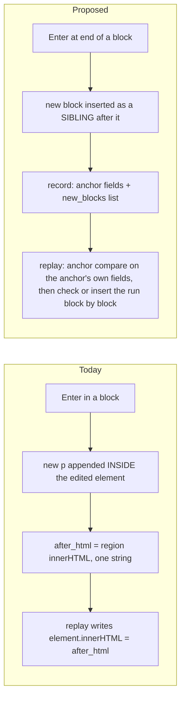
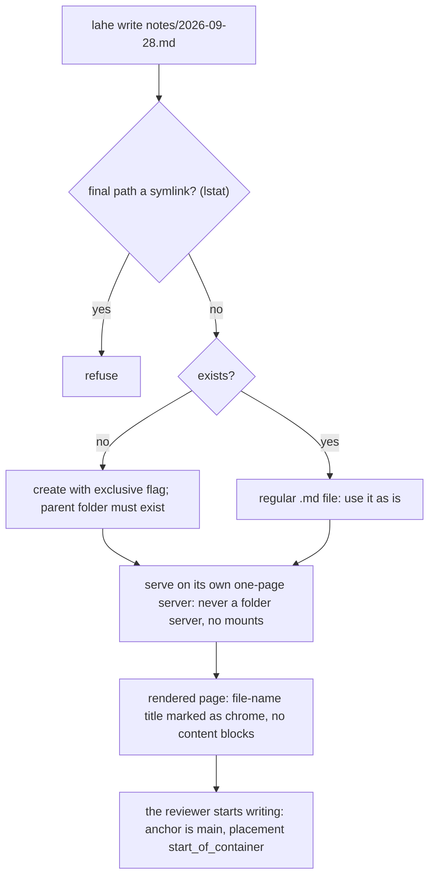
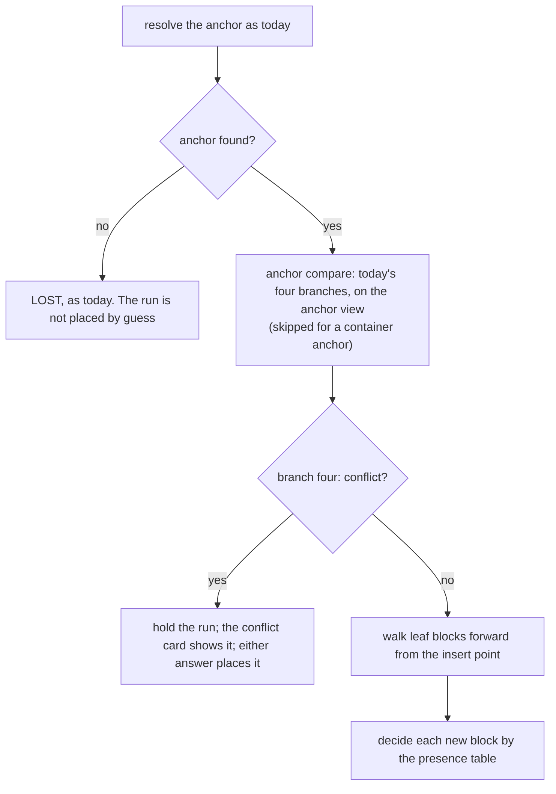

# Architecture: Free writing

## Summary

Free writing extends today's edit. It does not add a second one.

- An edit becomes an existing **anchor block** plus a **run** of new sibling blocks written after it: paragraphs, headers, or lists.
- A sitting is everything the reviewer writes between opening an edit and leaving it. The code calls an open edit a session. One sitting is one `edit` record.
- The record gains:
  - a structured list of the new blocks
  - the anchor's own new markup
  - the anchor's new tag, when the reviewer changed it
- Writing in empty space works the same way. The block above the click is the anchor, unchanged, and gains a run. On a page with no blocks, the page's container is the anchor.

Lahe's own editing code stays the engine and learns block types. The editing-host spike ran, and Lahe's own host passed every check. Tiptap works for new blocks, but it cannot share one sitting with an existing block. So this architecture recommends Lahe's own code. **Ken leans toward Tiptap, so the engine is his call (AQ1, Lahe's code or Tiptap).**

Replay, which re-applies the reviewer's edits after each reload, learns to insert new blocks after the anchor. It also checks each block's words, tag, and bold on its own. That fixes the doubled header line, and the left-out bold paragraph that main still loses when it is not the edit's first. One shared list of safe tags checks every new block three times: when the layer captures it, when the helper stores it, and before any write to the page. The agent's instructions gain rules for placing new blocks. A new `lahe write` command starts a blank notes page.

::: xref
[Brief: Requirements](01_brief_free_writing.html#requirements)
:::

## Analysis of Existing Structure



- **Stays:**
  - the gesture, the frame, and the bar
  - the item lifecycle, one commit per session, and `before` pinned at first touch
  - the anchor ladder, and the four-branch replay compare for the anchor block
  - the bold and italic markup rules
  - today's replay path for every record without `new_blocks`
- **Changes:** Enter makes a sibling, not a nested block. Replay gains an insert path. The page check and the handled check learn block structure.
- **Root cause of the open bugs**, found by tracing the code and re-checked on main after piece-keeps-formatting:
  - **The doubled line under a header.** Enter nests the new `<p>` inside the `<h2>`. Replay's "already there" check looks only at the next sibling, which on a Lahe Markdown render is the "Section 1" label. So replay rewrites the header with the nested paragraph, and the text shows twice. Still open on main.
  - **The lone paragraph that lost its bold** (board row `LAHE-lone-paragraph-loses-markup`). Fixed on main. Replay now writes a missing first paragraph with its own markup: `normalize.topLevelBlocks` cuts `after_html` at the top level, and `pieceMarkup` in `replay.js` uses the cut when it lines up with the text. When it does not line up, the paragraph still goes in as plain text. This feature keeps a regression test under the new record shape and no longer owns the fix.
  - **What is still open from that case.** Replay still skips the formatting check once it finds the split on the page. And when the left-out bold paragraph is a later one, the anchor cannot be found, the record goes lost, and nothing is flagged (see Failure Modes).
  - Both open cases go away when new blocks are separate siblings with their own markup, read in document order.
- **The third brief R14 case** (bold two words on a Markdown page, commit, rebuild) was reproduced. It works when the agent does the work. When the agent changes nothing and replies handled, the bold is lost, because the handled check only accepts `edit` records. See Failure Modes, and AQ3 (should the handled check always run for new blocks).

## Components / Modules Touched

- **`src/shared/normalize.js`**: `cleanBlock(tag, html)`, a new allowlist (see Security). `WRITABLE_BLOCK_TAGS`, the six tags a record may carry (p, h2, h3, h4, ul, ol); `BLOCK_TAGS` stays the text reader's list. A per-block reader and a run matcher shared by replay, the page check, and the handled check. `topLevelBlocks` (from the first-paragraph fix) stays as it is for old records; the per-block reader is a different cut, down to leaf blocks and with tags.
- **`src/layer/blocks.js`** (new): the DOM block rules in one copy. The leaf-block walk, the insert point after an anchor or at a container's start, the editing host, the element swap, and `runElementsFor`, the one way to find a record's run on the page.
- **`src/layer/editing.js`**:
  - the host spanning anchor and run, and its guard
  - Enter, block types, Markdown shortcuts, and plain-text paste
  - undo within a session
  - capture through `cleanBlock`
  - the "+ Write here" line
  - `kindFor` compares the tag; `itemFor` maps run blocks back to their record
  - a polite live region for session start, type change, and send
- **`src/layer/highlight.js`**: one rule that hides the host's focus ring.
- **`src/layer/protect.js`**: protects the whole edited area, restores by block position and character offset, and rebinds after a tag swap.
- **`src/layer/replay.js`**: the insert path, the take-back removal path, the anchor view, the per-block page check (`pageCheckReasonFor`, `formattingMissingFromPage`), and the held run on the conflict card.
- **`src/layer/anchor.js`**: the empty-container rung for `start_of_container` records. The tag tie-breaker accepts the saved tag or `anchor_tag_after`.
- **`src/layer/sync.js`**: a longer draft floor for run records, and no re-post of a refused run event.
- **`src/layer/tab_edits.js`, `tab_done.js`, `overlay.js`**: the anchor change and new blocks by type; two answers on a proofreading reply.
- **`src/shared/record.js`**: the new fields and their validation, run change text, `after_history` fields, the take-back's `remove_blocks`, and accepted proofreading fixes as a new revision.
- **`src/shared/merge.js`**: `CONTENT_FIELDS` gains `new_blocks`, `anchor_after_html`, `anchor_tag_after`, and `placement`.
- **`src/shared/review_format.js`**: contract lines, projection, field classes, and `PROOFREAD_MIN_WORDS`.
- **`src/shared/protocol.js`**: `SERVICE_CONTRACT` 13 to 14; a reply can be marked a proofread with suggestions.
- **`src/service/log.js`**: `cleanBlock` over every block on append, refusing the event on failure; the size ceiling.
- **`src/service/handled_check.js`**: per-block word checks (see The handled check).
- **`src/service/markdown.js`**: marks a hero title taken from the file name as chrome.
- **`src/service/static_servers.js`**, **`src/cli/commands/review.js`**: the one-page server for `lahe write`.
- **`src/cli/commands/write.js`** (new), **`src/cli/index.js`**, **`docs/CLI.md`**: `lahe write`.
- **`src/cli/commands/reply.js`**: the proofread flag and its suggestions.
- **Contract copies:** `skills/lahe/SKILL.md`, `docs/CONTRACTS.md`, `test/unit/review_format.test.js`, and a `dist/` rebuild.

## Data / State Changes

No new record kind. An edit record gains four optional fields:

```json
{
  "kind": "edit",
  "before": "What changed",
  "before_html": "What changed",
  "after": "What changed\n\nWhat the chat window cost me\n\nI lost my place every time ...\n\nscrolling\n\nre-asking",
  "after_html": "What changed<h2>What the chat window cost me</h2><p>I lost my place <strong>every</strong> time ...</p><ul><li>scrolling</li><li>re-asking</li></ul>",
  "anchor_after_html": "What changed",
  "anchor_tag_after": null,
  "new_blocks": [
    { "tag": "h2", "html": "What the chat window cost me" },
    { "tag": "p",  "html": "I lost my place <strong>every</strong> time ..." },
    { "tag": "ul", "html": "<li>scrolling</li><li>re-asking</li>" }
  ],
  "placement": "after_anchor",
  "change": "Added 3 blocks after this paragraph: h2, p, ul. Their words are in new_blocks."
}
```

- **A run record** has a non-empty `new_blocks`. Every reader tells it apart that way. Any other record takes today's paths.
- **`new_blocks`**: the run, in order. Each block has a `tag` from `WRITABLE_BLOCK_TAGS` and an `html` that passed `cleanBlock`. No `text` is stored; every reader derives words from the cleaned html. The projection adds the derived text for the agent.
  - `from_anchor: true` marks the tail of an anchor split with Enter. Those words moved; they are not new.
- **`anchor_after_html`**: the anchor's own inner markup after the sitting. Run records only.
- **`anchor_tag_after`**: the anchor's new block type, or null. Both tags must be in `WRITABLE_BLOCK_TAGS`, so a div or table cell cannot be retagged.
- **`placement`**: `after_anchor`, or `start_of_container` when the page has no content blocks.
- **`remove_blocks`**: take-back records only. Each block to remove, with its `tag` and `html`. A take-back never carries `new_blocks`.
- **`before`, `after`, and `after_html` still mean the whole sitting.** `after_html` is the anchor's inner markup followed by each new block as its own tagged element. `after` is read from it by the shared text reader, so `markupSaysAfter` keeps holding. An agent that only knows "apply after_html" still gets every block with its tag.
- **What each reader of `after` and `after_html` does with a run record:**

  | Reader | Run record |
  |---|---|
  | `replay.js` anchor compare (`compare`, `reflowMatch`, `splitPieces`, `wouldDuplicate`, `splitWritePlan`, `pieceMarkup`, `mayFold`, `formattingLost`) | Reads an anchor view, with `anchor_after_html` in place of `after_html` and its text in place of `after`. `writeRegion` never sees the whole sitting, so it cannot write the run into the anchor. |
  | `replay.js` page check | Checks the anchor and each block on its own. |
  | `record.js` change text, take-back, history | Change text gives structure only. A take-back names the run in `remove_blocks`. `after_history` entries carry the new fields. |
  | `handled_check.js` | Each block's words, in order, each on its own. A run never takes the several-paragraph path main added (`splitStarts`), because a section label between blocks would fail it. |
  | `status.js` drain line | The three text fields sit under `page`, like `after_html` (see Projection). |
  | `merge.js` | Browser wins on the new fields, as on `after`. |
  | `tab_edits.js`, `tab_done.js`, `review_format.js` text formatter | Show the anchor change, then the new blocks by type. |
  | `export.js` | Goes through the `review_format.js` text formatter. |

- **Change text** for a run describes structure only and never quotes a block's words. It restates no rule: "place them as written" lives in the contract, read once, not on every item. The anchor is named paragraph, heading, list, or block.
  - A run: "Added 3 blocks after this paragraph: h2, p, ul. Their words are in new_blocks."
  - At the start of a page: "Added 2 blocks at the start of the page: h2, p. Their words are in new_blocks."
  - The anchor reworded: "Reworded this paragraph; its new markup is in anchor_after_html."
  - The anchor retagged: "Changed this paragraph to h2."
  - A split tail: "Split this paragraph in two after the anchor's new end. The second part is new_blocks[0], marked from_anchor." A split with no typing adds no "Added" sentence.
- **Projection (`review.json`):**
  - All five new fields are projected. `new_blocks`, `anchor_after_html`, and `remove_blocks` are data fields, not instructions.
  - For a run record, `new_blocks`, `after_full`, and `after_html` skip the 2000-character data bound (brief R6, the words stay as typed). The helper's ceiling bounds them.
  - `run_words` is the run's word count without `from_anchor` blocks, from one function in `normalize.js`.
  - `proofread: true` when `run_words` is over `PROOFREAD_MIN_WORDS` and the review is not a notes review. The agent never counts.
  - A `lahe write` review carries `notes: true`.
  - The 2000-character bound is still `BEFORE_MAX` on main. Projected `after_history` entries stay bounded as today and carry no `new_blocks`.
- **On a drain line** (`lahe status --session ... --json --quiet`), main now groups every page-text field under the item's `page` key, driven by `review_format.DATA_FIELDS`, and repeats no rule text.
  - `new_blocks`, `anchor_after_html`, and `remove_blocks` join `DATA_FIELDS`, so they sit under `page` beside `after_html`. The drain code needs no change.
  - `anchor_tag_after`, `placement`, `run_words`, and `proofread` stay at the top level as markers, and each gets a class in the field-class table.
  - `notes` is review-level and is not repeated on item lines. The one behavior it changes reaches each item as `proofread`.
- **Size ceiling:** the helper refuses an event whose `new_blocks` is over a per-record ceiling in blocks and in UTF-8 bytes. The plan sets both, far above any real post.
  - The bar warns before the reviewer reaches it, and at the ceiling refuses input that would grow the run.
  - A refused event is not re-posted. The card says the agent has not seen it, and the words stay in the browser.
- **History size:** `after_history` keeps `new_blocks` only for the last few revisions (the plan sets how many). Replay's check for an earlier revision that already landed (branch three of the anchor compare) needs only recent ones.
  - Every older entry still keeps the whole sitting's `after` and `after_html`, because `bumpRev` never trims history. So a run at the byte ceiling crosses the helper's 8 MiB body limit at its 18th history entry. That is a lower bound from a script, ignoring JSON escaping.
  - The record also stores the run's markup twice (`after_html` and `new_blocks`). Main's rule since oversized-records is to store what identifies a thing once.
  - How to bound it is Ken's call (see Open Questions, AQ4).
- **Draft growth:** each draft carries the whole run, so a run record gets a longer draft floor than today's 10 seconds (the plan sets it). Capture rebuilds only the caret's block.
- **Lifecycle:** unchanged. An unchanged anchor with a non-empty run is a real change; `kindFor` counts the run and the tag.
- **Undo of a committed record:** the anchor gets its `before_html` and old tag back, and the run's elements are removed.
  - An unhandled record is withdrawn, as today, so replay never runs it again.
  - A handled record raises a take-back naming the placed blocks in `remove_blocks`. Replay removes them where they still are and never replays the original run.
  - A later sitting on a run joins the same record (see Two sittings in the same place), so undo never orphans a later run.

::: xref
[Brief: Decisions, one sitting is one edit](01_brief_free_writing.html#decisions-resolved)
:::

## Key Flows

### Writing a section after an existing block

```mermaid
sequenceDiagram
    participant R as Reviewer
    participant L as Layer (editing)
    participant P as Protection
    participant S as Store and helper
    participant A as Agent
    R->>L: Cmd-Shift-E, then click below "What changed"
    L->>L: anchor = "What changed" p; open a session with an empty run
    L->>P: protect anchor and run; snapshot
    R->>L: types "# ", a header, Enter, a paragraph, "- " and items
    L->>L: layer writes each block as a sibling; captures new_blocks through cleanBlock
    L->>S: draft saved in the browser on every keystroke
    R->>L: Esc
    L->>S: commit: edit record, ready, with new_blocks
    S->>S: helper runs cleanBlock and the ceiling; refuses a bad event
    L->>P: release; replay runs at once
    A->>S: reads the item: placement after_anchor, three new blocks
    A->>A: writes them after that paragraph in the source, as literal text; rebuilds
    A->>S: reply handled
    S->>L: page reloads; replay finds the run already there
    L->>L: page check: anchor and each block present, tags and bold match
```

### The editing host

The session makes a **host** element `contenteditable`. The host is the nearest ancestor that holds both the anchor and its run. That is the parent of the element the "after the anchor" rule climbs to (see Where "after the anchor" is). On the Markdown render, an `h2`'s host is its section, not its `sheet-head`. For a container anchor, the host is the container itself.

- **The guard.** A `beforeinput` guard refuses every edit outside the anchor and its run. That covers:
  - select-all, then typing
  - formatting commands and the browser's own undo
  - drop and cut
  - a composition that starts outside the session
- **The focus ring.** The frame is the focus indicator. The host's own ring is hidden by one rule in `highlight.js`. It goes in the one stylesheet Lahe is allowed to add to a reviewed page (decision D8 from the original architecture, whose rule is that Lahe's styles never match the page's own markup). This rule keeps to that: it matches only the attribute the layer sets on the host, and it goes away with that attribute.
- **Where a run is offered.** Only where the host can hold flow content. In a `td`, `th`, `dt`, `dd`, or `figcaption`, Enter keeps today's break rule.
- The layer removes the attribute at commit. Nothing the layer adds reaches a record.

The spike tested five hosts in Chromium, Firefox, and WebKit, on a styled blog page and a real Lahe Markdown render:

| Host | Caret, arrows, selection, Backspace merge | Page styling holds | Result |
|---|---|---|---|
| Wrapper with `display: contents` | Cannot even take focus in Chromium and Firefox | No | Fail |
| Plain wrapper div | Pass | No: child and sibling selectors stop matching. Spacing between blocks changed from 53px to 31px, and the anchor's font from 21px to 16px | Fail |
| `contenteditable` on each block | Selection cannot span blocks | Yes | Fail |
| Lahe anchor, then a Tiptap run | Caret cannot cross, no merge, undo runs out of order | No | Fail |
| **Editable parent plus guard** | **Pass** | **Pass** | **Chosen** |

What the layer owns with this host:

- **Edits across a block edge.** The layer cancels and writes these itself, because native merges add style spans:
  - Backspace at a block start
  - Delete at a block end
  - typing over a selection that spans blocks
- **The caret leaving the session** ends the session, as a click outside does today.
- **A repaint that replaces the parent.** Protection re-finds the anchor, puts the held run back, and sets the attribute again.
- **IME composition.** It cannot be cancelled through `beforeinput`, so composition inside a session block is allowed.

### Where "after the anchor" is

A new block goes after the anchor as a DOM sibling. Starting at the anchor, climb while the parent holds only the anchor plus inline chrome, then insert after that parent. On Lahe's Markdown render an `h2` sits in `div.sheet-head` beside its "Section N" label, so a block written after a header goes after the `sheet-head`. Enter, replay's inserts, and a missing block's insert point all use this rule. In the spike, a paragraph inside `sheet-head` became a 256px flex item. After it, the paragraph matched a normal one in all three browsers.

A new `h2` typed mid-section has the page's `h2` styling but no section rule or number until the rebuild. Ken sees that look in the wireframe, because it is a small exception to brief R4 (new blocks use the page's styling).

### Block types while writing

- **Enter** at the end of a block makes a new `p` after it. Enter in the middle splits the block into two siblings, and the tail is marked `from_anchor`. Enter in an empty list item ends the list.
- **Shift-Enter** stays a line break.
- **Markdown-style shortcuts** at the start of a block:
  - `# `, `## `, and `### ` make h2, h3, and h4
  - `- ` or `* ` makes a bulleted list
  - `1. ` makes a numbered list
- **The bar's block-type menu** (wireframe direction A) sits before B and I. It names the caret's block: Paragraph, Heading, Subheading, Small heading, Bulleted list, Numbered list. Each type also gets a hotkey (the plan picks the keys). Menu, hotkeys, and shortcuts share one function per type.
- **Starting in empty space** (direction A):
  - While any edit is open, hovering between blocks or below the last one shows a thin "+ Write here" line.
  - Clicking it commits any open session and opens a new one anchored on the block above, with an empty first block.
  - Cmd-Shift-E stays caret-based. With the caret in no block, it enters edit state with no block open: the lines show and the bar shows a hint. Esc leaves.
  - From the keyboard, new text starts with Enter at the end of the block above.
- **Headers** start at h2, because h1 is the page title.
- **No nested lists** and no indent in this cut.
- **One engine:** the layer writes every block change, so all three browsers produce the same structure.
- **Paste:** the layer takes over `insertFromPaste` and inserts plain text. A blank line starts a new paragraph; a single newline is a line break. Rich paste needs its own mapping layer and waits on board row `LAHE-rich-paste`.

### Adding to an existing list

When the caret is in a list item, the anchor is the whole list. Enter at the end of an item adds an `li` inside that list, which is a change to `anchor_after_html`, not a new block. Enter in an empty last item ends the list, and what follows is a new `p` in the run.

Changing the type inside an existing list:

- Bulleted list and Numbered list swap the whole list.
- Paragraph on the last item ends the list and moves that item's words into a new `p` in the run.
- Every other type is unavailable on a list item in this cut, because splitting a list in three is outside the record shape.

### Changing an existing block's type

- **Record:** `anchor_tag_after` holds the new tag. A tag-only change is `format_only`; a tag change with new words is `edit`. A paragraph turned into a list wraps its content in one `li`, which also edits `anchor_after_html`.
- **Change check:** `kindFor` compares the tag, so a tag-only change commits.
- **Replay:** the anchor compare gains a tag leg. The anchor counts as applied only when its tag equals `anchor_tag_after`. When words and markup match but the tag differs, replay swaps the tag.
- **Element swap:** one function in `blocks.js`, used by editing, replay, and undo. It checks the tag against `WRITABLE_BLOCK_TAGS`, makes the new element, and moves every attribute (`data-lahe-id` included) and child across. Protection rebinds to it. A framework that repaints its own element back is treated like any repaint.
- **Finding it again:** the ladder's tag tie-breaker accepts the saved tag or `anchor_tag_after`.

### Undo inside a session

The layer writes block changes itself, so the browser's undo stack no longer reflects them. The session keeps its own history of changed-block snapshots, taken at each block change and at the end of each typing burst (the plan sets the pause). A Markdown shortcut is its own step, so Cmd-Z right after "1. " becomes a list gives back the typed characters (brief R6, the words stay as typed). Cmd-Z and Shift-Cmd-Z walk that history while the frame is open. After commit, Cmd-Z is Lahe's per-record undo, as today.

### Two sittings in the same place

One rule: **a block that belongs to an outstanding record reopens that record.** This is today's `itemFor` rule, extended to run blocks.

- Before the agent places a run, a sitting that starts on or below its anchor or run blocks continues the same record at a new revision. The caret goes where the reviewer clicked.
  - The first keystroke that changes it takes the record off the agent's drain until the sitting commits, and later drafts wait for the draft floor. Main does this for a `ready` record and, since refused-reword-floor, for a `not_handled` one too. So the agent never places a half-written run.
- Once the record is handled, its blocks are the page's own, and a new sitting anchors on the block above the click.
- This rule means:
  - replay never has to order records
  - no record's anchor is another record's unplaced block
  - undoing one record never orphans another
- `new_blocks` is always the whole run at the current revision. The contract tells the agent to place only blocks not already in the source.

### Empty page and `lahe write`



- An empty Markdown file renders to a `main` container and a hero `h1` from the file name. That title is not in the file, so `markdown.js` marks it as chrome.
- A page with no content blocks, Markdown or HTML, uses the empty-container rung. The anchor is the page's one `main` (or `body`), found by tag, with `placement` `start_of_container`.
- **A container anchor is found by its tag alone.** Replay never compares its text. After the notes are placed, `main`'s text is the whole page, and a text compare would call that a conflict. The anchor always counts as applied. Only the run goes through the presence table.
- The rung serves `start_of_container` records only. An `after_anchor` record whose anchor is gone is LOST, even on a page the agent emptied.
- The run goes at the start of the container, after any leading chrome (`startPointIn`). Once the first record is placed and handled, later sittings use `after_anchor`.
- For the agent, `start_of_container` means the top of the file, below any front matter, or for HTML the start of the container the region names. The agent writes the file (brief Decision: who writes the notes file).
- **Who runs it:** the agent or the reviewer, with the same session rules as `lahe review`. It takes `--session` and `--name` and prints the URL and the wake, monitor, drain, and close commands.

### Replay after a rebuild



**Finding a record's run.** Editing, undo, protection, and replay all find a run with `blocks.runElementsFor`, which walks from the insert point with the shared matcher.

**The walk.** Replay reads leaf blocks forward from the anchor's insert point (or the container's start), in document order.

- A leaf block has a tag in `BLOCK_TAGS` and no `BLOCK_TAGS` element inside it.
- `ul` and `ol` are leaves. Their `li` children are lines.
- The "Section N" label is inline text in a `div` that holds an `h2`, so it is never a leaf.
- Elements with no text, and the marked file-name title, are skipped.

**Where the walk stops.** At the first leaf that matches no remaining block after at least one match, or after the run's length plus a small slack the plan sets. Without a stop, a short block such as "Notes" would count as present wherever the word appears lower down.

**The presence table.** Words are compared with typography folded.

| Case | Rule |
|---|---|
| When a block counts as present | Its words are found in the walk, in run order: as a whole leaf block, inside one leaf block that holds several new blocks (joined), or spread over consecutive leaf blocks (split). Tag and markup never decide presence. |
| Present, one-to-one, wrong tag or lost bold or italic | Rewrite that block in place: swap the tag, or rewrite its inner markup. A wrong tag is also flagged on the card. Never insert. |
| Present, but joined or split | Leave it. Tags and markup are not rewritten when blocks do not map one to one. |
| Missing from the walk, words found elsewhere | A block of five or more words (`SHORT_BLOCK_WORDS`) is searched for across the page, by whole leaf block, never by substring. If found, nothing is written, and the card says the text was placed in a different spot. |
| Missing from the walk, short block | A block under five words ("Yes", "Notes") is inserted without a page-wide search, because such words appear on pages for other reasons. |
| Where a missing block goes | After the last present block that comes before it in run order, or at the anchor's insert point if none is present. Each block gets its own tag and markup, through `cleanBlock`. |
| Anchor in branch four (conflict) | Hold the run until the reviewer answers. The conflict card shows the run and the anchor's two versions. "Keep mine" applies the anchor and places the run. "Take the page's" discards only the anchor change and still places the run, and its button says so. |
| Branch three (an earlier revision landed) | `after_history` entries carry `new_blocks`, so an earlier revision's run is checked the same way. A block found one-to-one with an earlier revision's words is rewritten in place to the current revision. So accepted proofreading fixes reach the page without showing twice. |
| A take-back (`remove_blocks`) | Remove each listed block found one-to-one after the anchor. Never insert. The original record's run is never replayed again. |

**The no-duplicate guarantee:** replay never writes a block of five or more words that the page already shows as a whole block. A run made only of short blocks that the agent moved elsewhere can show twice. That is rare and visible, and the page check still compares every block. The plan may tune the five-word line.

**Old records** keep today's replay path, guarded by the `no_duplicate_text` and `split_not_conflict` specs.

### The page check on a run

After an item is handled, the browser checks it once per load (`pageCheckReasonFor`). Today it looks for the whole `after` as one string, so the "Section N" label between a header and its paragraph would reopen a correct run. For a run record, the check reads the anchor and each new block on its own, with replay's reader and walk:

- A missing block reopens the item with today's "undone" note.
- Lost bold or italic reopens it with the formatting note.
- A one-to-one block with the wrong tag reopens it with its own note, which says the tag is wrong.
- The section label between blocks does not count against it.

This is where the tag test lives, because it runs after the agent's write.

### The handled check

**How it works on main now.** Main judges each edit on its own passage (handled-check-per-edit, `verdictFor` in `handled_check.js`). An item is held only when its `after` is not on the built page and one of two things says the agent left its passage alone:

- **Nothing was written.** No file behind the review changed since the reviewer committed (`touchedSince`, review-wide).
- **The passage is still there.** The item's `before` is on the page as whole blocks, exactly once.

An agent that changed the passage, in any words, is not second-guessed. A several-paragraph `after` is looked for paragraph by paragraph, so a split nobody made is held.

**What that means for new text.** The per-item rule needs a `before` the agent would have to change. New text has none:

- A run whose anchor is unchanged has an `after` that holds the whole `before`. Main treats that as "only added words" and skips the passage test (`passageOf`). So the run is judged only when nothing in the whole review was written.
- A `format_only` record's `before` and `after` have the same words, so the same skip applies.
- So an agent that places one run and answers handled on two is not caught: it wrote something, so the run it skipped is never judged. AQ3 (should the handled check always run for new blocks) asks whether to close that.

The check does not test tags. The page check covers placement after a real write.

The helper cannot find a region in a built page, so it matches by words:

- **A run.** The anchor's own words follow main's per-item rule, unless the anchor is a container or has fewer than `SHORT_BLOCK_WORDS` (five) words. The run is found by locating the first run block's leaf, page-wide, then matching the rest in order with the shared matcher. A section label between blocks does not fail it. A run never takes main's several-paragraph path, which would fail on that label.
- **Bold or italic on a `format_only` record.** Take each span whose bold or italic changed, using the reader inside `record.formattingChangeText`. Require its words inside a `strong` or `b` (or `em` or `i`) in the built page's leaf blocks. Bold words elsewhere on the page give a false pass, which is accepted because the page check runs on the next load.

### The proofreading reply

Brief R11 (proofreading after a long hand-written block) lives in the contract.

- **The reply.** When the item carries `proofread: true`, the agent places the run, rebuilds, and replies `question`, marked as a proofread, with a list of `{block, from, to}` suggestions (`block` is the index in `new_blocks`). The reply says the words were placed as written. `lahe reply` refuses a suggestion whose `from` is not found exactly once in that block's words.
- **The card.** Only a proofread reply shows two buttons. A placement question ("Should this go under Intro?") shows today's question card.
- **"Use the fixes"** applies the suggestions as the reviewer's own reword of the same record, at a new revision. Every check then looks for the fixed words, and replay rewrites the placed blocks in place (branch three). The button also posts a thread reply, and the agent puts the fixes into the source.
- **"Keep mine"** posts a thread reply. The agent changes nothing and replies handled.

The button names wait on Ken (plan PQ5, renaming the wireframe's "Yes" and "Keep mine"). The plan pins both button texts and the text each posts.

## Rollout and old agents

- **Helper version.** The helper writes the contract into `review.json` (`projectReview`). `SERVICE_CONTRACT` goes to 14. An old helper would store run records without the allowlist or ceiling, and would not project `new_blocks`. So a new layer or CLI refuses an old helper until it restarts.
- **An agent on the old contract** keeps acting on `after_html`, which now carries every block with its tag, uncut. It places every word, possibly with the wrong structure. The page check reopens the item if a block is missing, lost its bold, or has the wrong tag. Nothing is dropped silently. It is not told to update.
- **Old records** keep today's replay path. Reopening one keeps today's single-element session and break rule.

### Contract changes

New lines, in the contract and every copy of it:

- **new_blocks:** the blocks go after the anchor, in order, with their tags and their bold and italic. It is the whole run at this revision: place only the blocks not already in the source after the anchor.
- **remove_blocks:** on a take-back, remove these blocks from after the anchor in the source.
- **Literal text:** the words in new_blocks are literal text. Escape them for the source.
  - In Markdown, backslash-escape characters Markdown reads as syntax, and write `<` as `&lt;`.
  - In a template (ERB, Jinja, Liquid, JSX), write them so the template prints them and never evaluates them.
- **from_anchor:** a block marked from_anchor is the anchor's own tail. Split the anchor there; do not add those words again.
- **anchor_tag_after:** change the anchor's element to that tag in the source.
- **placement:** after_anchor means right after the anchor block. start_of_container means the top of the file, below any front matter, or the start of the container the region names.
- **Proofreading:** the reply under The proofreading reply, keyed on `proofread: true`, with the exact text each button posts.
- **The brief's AI Behavior rules:**
  - On a notes review, place the text and stop. Organize only when the reviewer asks.
  - Never write prose into a region the reviewer wrote. Suggestions go in the reply.
  - When you cannot tell where new text belongs, ask with a `question` reply.
- **Data fields:** the data-fields line adds new_blocks, anchor_after_html, and remove_blocks. The drain clause needs no new sentence: it already says every page-text field sits under page with its review.json name.
- **The after_html line** stays true. A new sentence says that for a run record, anchor_after_html is the anchor's own change and new_blocks is the run.
- **The handled-check line** on main says an agent that changed the passage is not second-guessed. If Ken says yes to AQ3, a new sentence says new_blocks has no old passage, so each block's words are checked on every handled reply. The skill's "A handled reply is checked" section says the same.
- **Said once.** Each rule above is a contract line, read once. No rule text rides on an item: the change text points at new_blocks and stops, and the per-item signals are fields (`proofread`, `placement`, `from_anchor`).

## Alternatives Considered

- **Tiptap as the engine for new blocks only (Ken's lean).** It came closest. AQ1 (Lahe's code or Tiptap) has the size and the join test that decided it. The spike also measured:
  - h2, p, and ul took the page's styling (p, strong, and ul spacing in Chromium; one h2 font size in Firefox and WebKit)
  - undo, shortcuts, and rich paste worked out of the box
  - its `<li><p>` lists space differently, because the Markdown style gives `li > p` its own margin
  - it adds its own classes and trailing breaks, and takes a page repaint as the reviewer's typing
  - **If Ken picks Tiptap anyway (AQ1, Lahe's code or Tiptap):** it comes back for its own security pass before anything is built on it. Its paste parser, style tag, and schema are not covered here, and its paste output would go through `cleanBlock` like everything else.
- **Tiptap for every block.** Rejected harder. It changed 5 of 5 existing blocks through the default schema, dropping classes, ids, spans, inline SVG, and styles. With a 23-line extension, 2 of 5 came back exact. Every inline element a page uses would need a schema entry, and a missing one fails silently.
- **A new record kind for new text.** Rejected. One sitting is one edit, and a second kind would touch every place that lists the edit kinds (about 40 places in the code).
- **Keep nesting new blocks inside the edited element.** Rejected. It causes the doubled header line, a `p` inside an `h2` is invalid HTML, and it breaks brief R4 (new blocks use the page's styling).
- **One record per new block.** Rejected by Ken's decision on one sitting.
- **`after` and `after_html` narrowed to the anchor.** Simpler for replay. Rejected: an agent that only knows "apply after_html" would drop every new block.
- **A Markdown source pane beside the page** (crucible approach C). Rejected there: Markdown only, and it moves writing off the document.

## Failure Modes / Edge Cases

Cases the sections above already handle are not repeated here.

| Case | Handling |
|---|---|
| The page repaints mid-sitting | Protection snapshots the anchor and every run block, restores them after the re-found anchor, and puts the caret back by block position and character offset (brief R7, a reload does not move the cursor or hide text). |
| The agent's rebuild lands mid-sitting | Lahe's rebuild reload waits while an edit is open (`isBusy` in `src/layer/index.js`, used by the reload in `sync.js`). The page reloads after the sitting commits. |
| The reviewer reloads or leaves mid-sitting | Leaving commits the open edit (`commitOnUnload` in `sync.js`). After the reload, replay inserts the run. Cmd-Shift-E on the anchor or any run block reopens the same record (brief R5, still there to keep writing). |
| The browser crashes mid-sitting | The draft is in browser storage. The next page load commits it, as today. |
| Backspace at the start of the first run block | Merges into the anchor, inside the same sitting. |
| A list ended with an empty item | The empty item is dropped at capture. |
| An edit whose bold paragraph is the one the agent left out, and it is not the first paragraph | Found while reproducing the lone-paragraph case, and still true on main after the first-paragraph fix (re-run 2026-09-28). The bold paragraph never appears, replay counts the record as lost, and no flag is raised. The insert path's per-block matching covers it: a missing block is inserted with its own markup. |

## Security & Privacy Notes

- **One allowlist, three places.** `cleanBlock(tag, html)` in `src/shared/normalize.js`:
  - `tag` must be one of `WRITABLE_BLOCK_TAGS`, or the block is refused.
  - The html is parsed and rebuilt from an allowlist: `strong`, `em`, `br`, and the two reset tags. `li` only as a direct child of a `ul` or `ol` block.
  - Every attribute is dropped, and text is escaped again on output.
  - Elements are made only from the allowlist's constants, never from a string in the record.
  - It runs at capture, in the helper on append, and in replay and undo right before every page write. The helper refuses a failing event rather than cleaning it, so a forgery shows up. The write paths include insert, partial, formatting, `anchor_tag_after`, and the undo tag restore.
- **Who can forge a record:** any script holding the review token, and any same-origin script through the browser store.
- **The anchor's own markup** is page markup with the page's own links and spans, so it keeps today's `cleanMarkup` path.
- **What reaches the agent:** `new_blocks` and `anchor_after_html` are data fields, text to place, never instructions. `change` is an intent field, so it never quotes run words. A split tail is marked as moved page text.
- **Words stay words in the source.** The contract tells the agent to escape the reviewer's words for Markdown, raw HTML, and templates. An always-on handled check would catch words that became markup; see AQ3 (should the handled check always run for new blocks).
- **Size:** the helper's ceiling keeps a runaway or forged record out of `review.json`.
- **`lahe write`:**
  - It creates only `.md` or `.markdown` files, and only when the parent folder exists.
  - It checks the final path with `lstat` before either branch, and refuses any symlink, dangling or not.
  - It creates with the exclusive-create flag (`wx`). On "already exists" it checks again with `lstat` and uses the file only if it is a regular file.
  - It never overwrites.
  - It prints the parent folder's real path.
  - Every page it creates or opens gets its own one-page server:
    - It serves the rendered page and the Lahe style and font files that page names. Any other request gets a 404.
    - It never joins an existing folder server, even with `--session`.
    - It registers no folder mount and no linked-document mounts.
  - Why not `--only`: today `--only` only limits which pages get the rail. A single page's server still serves its whole folder, and servers are shared by root folder. Notes files often sit in a home, Desktop, or Documents folder, and serving that folder would serve all of it. Since hidden-files-plain, that includes dotfiles such as `.env` or `.ssh`, which a folder server now serves like any other file. A notes page has no images, so it loses nothing.
- **Follow-ups for the board, older than this feature:**
  - The static server has no Host header check. The helper has one.
  - The Markdown renderer lets through link schemes other than http, https, mailto, and tel. It should reuse `normalize.isSafeUrlValue`.
  - `cleanMarkup`, used for anchor markup, is a deny-list that keeps `svg`, `img`, `a`, and similar tags.

## Test Strategy

The plan's Test List holds every test. At this level:

- **Unit:**
  - `cleanBlock` refusals at the helper, with replay writing nothing: `script` and `iframe` tags, the SVG animate href case, ``, `<a href>`, and `li` inside a `p`
  - record validation, the size ceiling, and change text that quotes no run words
  - `after` agrees with `after_html`; projection with no 2000-character cut
  - merge on load in both directions (the browser's run wins whether longer or shorter)
  - the reader, the leaf walk, and one test per presence-table row
  - the handled check across a section label, and a run the agent skipped while it placed another item
  - a drain line puts the three text fields under `page`
  - every `lahe write` path: create, no overwrite, missing parent, and the three symlink cases
- **Browser (named specs, three lanes at the checkpoint):**
  - typing a header, paragraph, and list; the record's shape; a rebuild with no doubling; a repaint that leaves the anchor clean
  - the first two brief R14 cases (header line, lone bold paragraph) on a real `lahe review post.md` page, with screenshots
  - the page check: a correct h2 run stays closed; lost bold and a wrong tag reopen
  - a paragraph turned into a header; Enter at the end of an existing bullet
  - repaint and reload mid-sitting
  - three sittings on an empty `lahe write` page
  - undo inside the session and of the committed record; plain-text paste
  - screenshots of the frame and bar, light and dark
- **Contract:** the copies in `review_format.test.js` and `docs/CONTRACTS.md` match.

## Open Questions

**Ken's decisions at the review gate (2026-09-29):**
- **AQ1 (Lahe's code or Tiptap):** Lahe's own code for now. Tiptap integration is discussed after this ships (board row `LAHE-tiptap-later`).
- **AQ3 (always check new blocks on a handled reply):** yes.
- **AQ4 (bounding a run record's size):** yes, the recommendation: old revisions keep words only, and the bar warns before a sitting is too big to send.
- **PQ1 (blank notes page opens ready to type):** yes.
- **PQ2 (the bar says "Editing"):** yes.
- **PQ3 (no proofreading on notes):** yes, try it.
- **PQ4 (what a reload does mid-writing):** the default stands.
- **PQ5 (button names):** "Use the fixes" and "Keep mine". Keep mine matches the conflict card on purpose; the shared word is fine.


::: callout-question
**AQ1 (Ken):** Lahe's own code or Tiptap? **Recommendation: Lahe's own code.**

- **The deciding test:** a sitting starts in an existing block and flows into new ones. The spike built exactly that join, a Lahe-edited block with a Tiptap run after it. In all three browsers:
  - the caret cannot cross between them with the arrow keys
  - a selection cannot span both
  - Backspace at the start of the Tiptap run does not merge into the block above
  - undo runs out of order, because each side keeps its own history
  - the Tiptap paragraphs lose the page's own spacing
- **Tiptap on every block avoids the join but changes the page.** It dropped markup on 5 of 5 existing blocks.
- **Lahe's own host passes everything** (see The editing host).
- **What Tiptap would have given for free:** shortcuts, undo, and rich paste. Undo is real work here, and the plan budgets it. Rich paste stays on board row `LAHE-rich-paste`.
- **What Tiptap would cost:** 104 to 121 KB gzipped, loadable only when a sitting opens.
:::

::: callout-question
**AQ3 (Ken):** Should the handled check always run for new blocks? (AQ2, which editing host to use, was resolved by the editing-host spike.)

- **Today, on main:** the check judges each edit on its own passage. It holds an item only when the agent left that passage alone: its `before` is still on the page, or nothing in the review was written. New text has no `before` to change, so a run is judged only when nothing at all was written. An agent that places one run and answers handled on two gets the skipped one through.
- **The proposal:** for `new_blocks`, run it every time and compare each block's visible words on the built page. Brief R6 (the words stay as typed) allows no rewording of new text, so the reason for skipping does not apply.
- **What it would catch:** a run the agent skipped while it worked on something else. Words that turned into markup or template code, which vanish from the visible page; this is the one check that sees that. A header placed as a paragraph at reply time.
- **Why it is your call:** it goes past the standing rule that an agent that changed the passage is not second-guessed on its wording. The step is smaller than it was: main already judges each edit on its own, and new text has no old wording for the agent to have changed.
- **Related:** formatting-only records get checked in this feature either way, because brief R14 (bold and italic survive the rebuild) requires it. Like a run, a bold edit has no changed words for the per-edit rule to find, so it is judged only when nothing was written. The same answer can cover it.

**Recommendation: yes**, still. The per-edit check makes the case stronger: it closed "fix one, answer five" for reworded text, and new text is now the main shape it misses.
:::

::: callout-question
**AQ4 (Ken):** How should a run record's size be bounded?

- **The problem.** Every revision adds a history entry that keeps the whole sitting's words and markup, and history is never trimmed. A run at the byte ceiling (200,000 bytes of markup) crosses the helper's 8 MiB request limit at its 18th entry. A notes page the agent has not placed yet gains a revision with every sitting. Past the limit the helper refuses the whole post as a bad request, and the plan's refused-event path knows only its own run codes.
- **Store once.** Main's rule since oversized-records is to store what identifies a thing once. A run record stores its markup twice (`after_html` and `new_blocks`), and every draft line in the log repeats the whole record.
- **Options, each measured by the same script:**
  - Older history entries keep the words and drop the markup. The limit moves to the 33rd entry. The agent still reads the chain of wordings. Replay needs markup only for recent entries.
  - Also store the run once, rebuilding `after_html` and `after` when read, the way main rebuilds an image tag. The limit moves to the 41st entry. Every reader of those two fields goes through one function, which touches many files.
  - Count the whole record against the ceiling the bar already warns on, so the reviewer is told to send before the limit. Bounded, and no words are cut.
- **Recommendation:** the first and the third together. The second is the fuller fix and can follow on its own.
:::


## Architect Review

| # | Finding | Disposition | Rationale |
|---|---------|-------------|-----------|
| AR1 | Splitting `after` and `after_html` makes replay write the whole sitting into the anchor, and old agents drop the run | Accepted | Both fields stay the whole sitting; `anchor_after_html` feeds an anchor view; reader table added |
| AR2 | The browser page check reopens every placed header on Lahe Markdown pages | Accepted | Page check reads each block on its own and ignores the section label |
| AR3 | The insert path's "already there" rule is undefined | Accepted | Presence table and no-duplicate guarantee added |
| AR4 | A header's next sibling is inside the `sheet-head` flex row | Accepted | "After the anchor" climbs out of chrome wrappers; confirmed by the spike |
| AR5 | Merge on load drops the new fields | Accepted | New fields join `CONTENT_FIELDS`; unit test added |
| AR6 | The editing host is deferred to the plan | Accepted | Settled by the editing-host spike: editable parent plus guard |
| AR7 | The helper's tag test cannot fire behind its gate | Accepted | Tag test moved to the page check; "always run it" is AQ3 |
| AR8 | The reload row describes mechanisms that do not exist | Accepted | Rows rewritten around `isBusy`, commit on unload, and `itemFor` |
| AR9 | The Tiptap comparison is uneven | Accepted | AQ1 rewritten, then decided on the editing-host spike |
| AR10 | Old agents and old records have no home | Accepted | Rollout section added |
| AR11 | Turning the anchor into a header is under-specified | Accepted | Changing an existing block's type section added |
| AR12 | Adding an item to an existing list has no shape | Accepted | The anchor is the whole list; browser test added |
| AR13 | Two sittings after the same anchor gives two answers | Accepted | One rule: a block of an outstanding record reopens that record |
| AR14 | Paste has no design | Accepted | Plain-text paste; rich paste to `LAHE-rich-paste` |
| AR15 | Proofreading has no home | Accepted | Contract line, `question` reply, `PROOFREAD_MIN_WORDS` |
| AR16 | The Markdown notes anchor is a title not in the file | Accepted | File-name title is chrome; empty-container rung with `start_of_container` |
| AR17 | "Next content block" matches wrappers | Accepted | Walk defined over leaf blocks; `WRITABLE_BLOCK_TAGS` named |
| AR18 | A Markdown shortcut should be its own undo step | Accepted | Done; test added |
| AR19 | The third R14 case has no analysis | Accepted | Reproduced; the handled check covers formatting-only records |
| AR20 | Who runs `lahe write`, and which session owns it | Accepted | Agent or reviewer, same rules as `lahe review` |
| AR21 | Cut `placement` and the empty-container rule | Rejected | The empty Markdown notes page needs it (AR16) |

## Security Review

| # | Finding | Disposition | Rationale |
|---|---------|-------------|-----------|
| SR1 | The block allowlist runs only at capture | Accepted | `cleanBlock` at capture, at the helper (refuse), and before every page write |
| SR2 | The reviewer's words can become live markup or template code | Accepted | Escaping contract line; "always check new blocks" is AQ3; link schemes to the board |
| SR3 | `lahe write` can follow a symlink in both branches | Accepted | `lstat` first, exclusive create, recheck, never overwrite; tests added |
| SR4 | A notes file in a broad folder serves that folder | Accepted | Every page `lahe write` creates or opens gets its own one-page server, with no folder or linked-document mounts; static server Host check to the board |
| SR5 | The change text must not quote the run; a split moves page text | Accepted | Structure-only change text; `from_anchor`; tests added |
| SR6 | `new_blocks` needs a ceiling | Accepted | Helper ceiling set by the plan; longer draft floor |
| SR7 | Cut "the page they write into is their own" | Accepted | Removed |
| SR8 | A Tiptap fallback needs its own security pass | Accepted | Stated under Alternatives |

## Plan Review Back-patches

Changes made here while folding in the four plan reviews (`03_plan_free_writing_reviews.md`).

| # | Finding | Disposition | Rationale |
|---|---------|-------------|-----------|
| EM1, CL4 | `lahe write` relied on `--only`, which does not stop a folder being served | Accepted | One-page server per page; `static_servers.js` and `review.js` added to Components |
| EM2, CL3 | A container anchor compares as a conflict once the notes are placed | Accepted | Container found by tag alone; anchor compare skipped |
| CL1, T14 | A take-back carrying the run would make replay put it back | Accepted | New `remove_blocks`; removal row in the presence table |
| CL2 | No shared way to find a record's run on the page | Accepted | `blocks.js` and `runElementsFor` |
| CL5 | The editing host was "the anchor's parent", which misses a run after `sheet-head` | Accepted | Host redefined; the container itself for a container anchor |
| T2 | The guard's coverage was stated for the session's edges only | Accepted | Every refused input path listed |
| DR13 | A shadow-root style cannot hide a page element's focus ring | Accepted | One scoped rule in `highlight.js` |
| CL28 | Nothing said where a run can go | Accepted | Only where the host holds flow content |
| DR2, DR3, CL16 | "+ Write here" was unreachable once the caret sat in any block | Accepted | Lines show whenever an edit is open; Cmd-Shift-E with no block |
| DR8, CL21 | "Small heading" was missing from the menu | Accepted | Six types |
| DR10 | Changing type inside an existing list was undefined | Accepted | Rule added |
| CL7, T16 | The replay walk had no end | Accepted | Where the walk stops |
| CL25 | The leaf rule made each `li` a block | Accepted | `ul` and `ol` are leaves |
| DR14 | A conflict on the anchor could drop the whole run | Accepted | Run held and shown; both answers place it |
| T1, DR15, DR16, DR17, CL13, CL14 | Accepting proofreading fixes would reopen the item; buttons showed on any question; the agent counted words | Accepted | Proofreading reply rewritten; `run_words` and `proofread` projected |
| CL8 | A wrong tag reused the bold-and-italic note | Accepted | Own note |
| CL9, T13, DR22 | The ceiling had no behavior at 100 percent, and a refused event looped silently | Accepted | Input refused at the ceiling; refused events not re-posted |
| CL10 | Run records' `after_html` was still cut at 2000 characters | Accepted | Exempt for run records |
| CL11 | `after_history` had no cap and the ceiling counted characters | Accepted | History size; blocks and UTF-8 bytes |
| CL12 | The handled check had no rule the helper can run | Accepted | Both matching rules spelled out |
| CL15 | An agent could place revision 1's blocks twice | Accepted | Place only what is not in the source |
| CL20 | Capture rebuilt the whole run on every keystroke | Accepted | Only the caret's block |
| CL24 | Change text had three undefined cases | Accepted | Sentences added |
| CL26 | Architecture and plan disagreed about `export.js` | Accepted | Export goes through the text formatter |
| CL29 | Session history memory and burst end were unnamed | Accepted | Changed blocks only; the plan names the pause |
| EM11 | Three of the brief's agent rules had no contract line | Accepted | Added |
| T10 | The merge test would pass a "longer wins" rule | Accepted | Both directions tested |
| DR7 | A screen reader heard nothing useful | Accepted | Live region added |

## Main Drift, 2026-09-28

Checked against main after the architecture was written: piece-keeps-formatting, handled-check-per-edit, oversized-records, trim-the-drain, refused-reword-floor, hidden-files-plain, and quiet-tab-polling, up to the 2b6eb96 bundle rebuild. compact-draft-history was already in the base. The R14 reproduction was re-run on main, and the size figures come from a script. Both paths are in the plan's spike evidence list.

| # | Finding | Disposition | Rationale |
|---|---------|-------------|-----------|
| MD1 | The lone-paragraph bug is fixed on main (`topLevelBlocks`, `pieceMarkup`) | Accepted | Root cause rewritten; the feature keeps a regression test and no longer owns the fix |
| MD2 | A left-out bold paragraph that is not the first still loses the edit with no flag, and the split branch still skips the formatting check | Accepted | Kept as this feature's; Failure Modes row says it was re-checked |
| MD3 | `pieceMarkup` reads the whole `after_html` and would cut a run record's sitting | Accepted | Added to the anchor-view list in the reader table |
| MD4 | The handled check now judges each edit on its own passage, not only when nothing was written | Accepted | The handled check section describes `verdictFor`; a run skips main's several-paragraph path |
| MD5 | Under the per-edit rule a run, and a bold-only edit, is judged only when nothing in the review was written | Accepted | AQ3 restated; recommendation stands and is stronger. Bold-only edits named under Related |
| MD6 | The drain now groups page text under `page` by `DATA_FIELDS` and repeats no rule text | Accepted | Projection says which new fields join `DATA_FIELDS` and which stay top-level; `notes` not repeated per item |
| MD7 | The run change text repeated a rule ("place them as written") on every item | Accepted | Dropped from the change text; the contract line carries it once |
| MD8 | History is never trimmed, so a ceiling-size run crosses the 8 MiB body limit at its 18th entry; the run's markup is stored twice | Open, to Ken | AQ4 added with measured options |
| MD9 | Rewording a ready or `not_handled` record now takes it off the drain at the first changing keystroke | Accepted | Two sittings section says a half-written run never reaches the agent |
| MD10 | Folder servers now serve dotfiles | Accepted | Added to the `lahe write` reason for its own one-page server |
| MD11 | The 2000-character bound, `MAX_BODY_BYTES`, and the draft floor are unchanged; oversized-records' paint guard and stamp rule apply to comments only | No change | Checked; nothing in the design depends on them changing |
