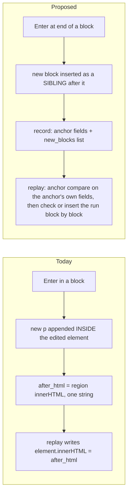
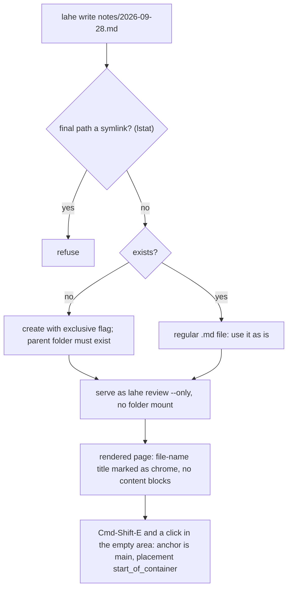
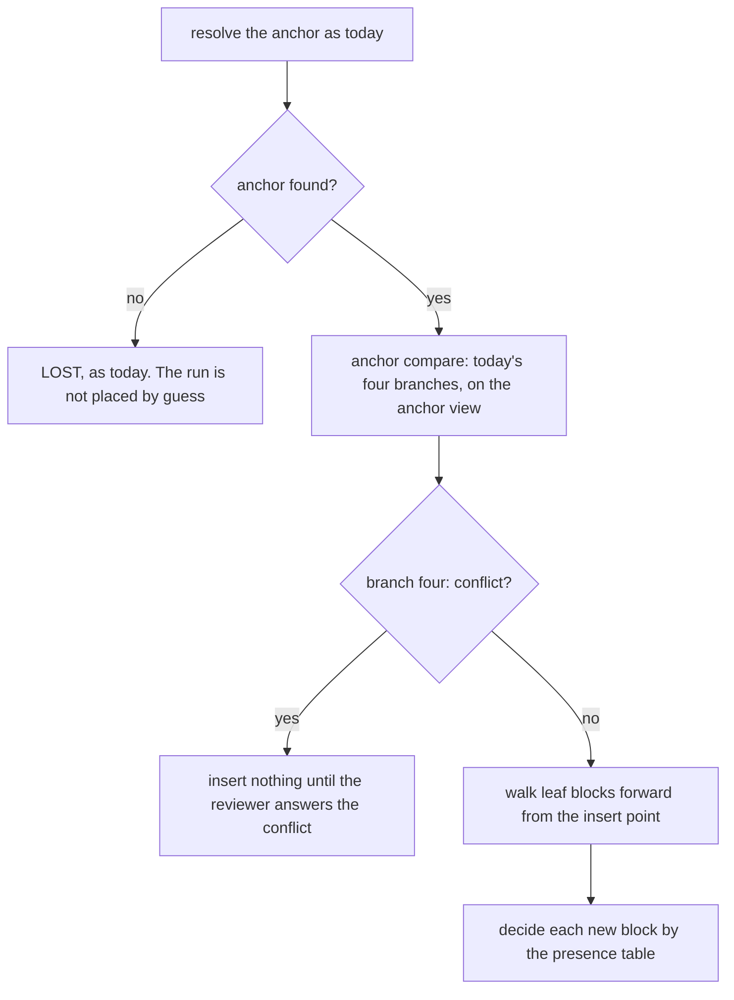

# Architecture: Free writing

## Summary

Free writing extends today's edit. It does not add a second one. An edit becomes an existing **anchor block** plus a **run** of new sibling blocks written after it. Those blocks can be paragraphs, headers, or lists. Everything written in one sitting is one `edit` record. The record gains a structured list of the new blocks. It also gains the anchor's own new markup and, when the reviewer changed it, the anchor's new tag.

Writing in empty space works the same way. The block just above the click becomes the anchor. It is left unchanged and only gains a run. On a page with no blocks at all, the page's container is the anchor and the run goes at its start.

Lahe's own editing code stays the engine and learns block types. The Tiptap spike showed that Tiptap works for new blocks and damages existing ones. One sitting crosses both, so this architecture recommends against Tiptap (see Alternatives Considered). **This goes against Ken's stated lean. It is his call, after the editing-host spike reports.**

Replay learns to insert a run after its anchor, and to check each new block's words, tag, and markup on its own. That fixes the doubled header line and the lone paragraph that loses its bold. Every block a record carries passes one shared allowlist at capture, at the helper, and before every write to the page. The contract, the page check, and a new `lahe write` command follow from the new record fields.

::: xref
[Brief: Requirements](01_brief_free_writing.html#requirements)
:::

## Analysis of Existing Structure



- **Stays:**
  - the gesture, the frame, and the bar
  - the item lifecycle, the one-commit-per-session rule, and `before` pinned at first touch
  - the anchor ladder for finding a block, and the four-branch replay compare for the anchor block
  - the rules for bold and italic markup
  - today's replay path for every record without `new_blocks`
- **Changes:** Enter no longer nests a block inside the edited element. The edited area can be several sibling elements. Replay gains an insert path. The page check and the handled check learn block structure. The contract gains rules for placing new blocks.
- **Root cause of two open bugs**, both from the recon trace:
  - The doubled line under a header: Enter nests the new `<p>` inside the `<h2>`. Replay's check for text that is already there looks only at the next sibling element. In a Lahe Markdown render that sibling is the "Section 1" label, not the paragraph. Replay then rewrites the header's inner HTML with the nested paragraph, so the new text shows twice.
  - The lone paragraph that loses its bold (board row `LAHE-lone-paragraph-loses-markup`): replay writes a missing split piece as plain text. It also stops checking formatting once the split is found.
  - Both go away when new blocks are separate siblings with their own markup, and replay reads blocks in document order.
- **The third brief R14 case** (bold two words on a Markdown page, commit, rebuild): reproduced on the real tool. It works when the agent does the work. When the agent changes nothing and replies handled, the reply is accepted and the bold is lost. The cause is that the handled check only accepts `edit` records, so a formatting-only record is never checked. See Failure Modes and AQ3.

## Components / Modules Touched

- **`src/shared/normalize.js`**:
  - `cleanBlock(tag, html)`, new code and an allowlist (see Security). It is not `cleanMarkup`, which is a deny-list.
  - `WRITABLE_BLOCK_TAGS`: the six block tags a record may carry (p, h2, h3, h4, ul, ol). This is a separate, smaller list from `BLOCK_TAGS`, which stays the text reader's list.
  - A per-block reader for text and markup, shared by replay, the page check, and the handled check.
- **`src/layer/editing.js`**:
  - the editing host spans the anchor and its run
  - Enter makes a sibling block; the layer writes block-type changes and Markdown-style shortcuts
  - undo within a session
  - capture of the new blocks, through `cleanBlock`
  - a click in empty space starts a session
  - `kindFor` compares the block tag as well as text and markup
  - `itemFor` maps a run block, as well as the anchor, back to its outstanding record
  - paste is taken over as plain text
- **`src/layer/protect.js`**: protects and snapshots the whole edited area, not one element. Restores it by block position and character offset. Rebinds to a new element after a tag swap.
- **`src/layer/replay.js`**:
  - the insert path for a run, with the presence rules below
  - one function that swaps an element's tag, used by editing, replay, and undo
  - the anchor compare reads the anchor's own fields for a run record
  - the page check (`pageCheckReasonFor`, `formattingMissingFromPage`) checks the anchor and each new block on its own
- **`src/layer/anchor.js`**: a rung for an empty container, so a page with no blocks still anchors. The tag tie-breaker accepts either the saved tag or `anchor_tag_after`.
- **`src/layer/sync.js`**: a longer draft floor for run records (see Data / State Changes).
- **`src/layer/tab_edits.js`, `tab_done.js`, `overlay.js`**: the card and the edits list show the anchor's change and the new blocks by type.
- **`src/shared/record.js`**: new optional fields and their validation. The change text for a run. `after_history` entries carry the new fields. The take-back rules cover them.
- **`src/shared/merge.js`**: `CONTENT_FIELDS` gains `new_blocks`, `anchor_after_html`, `anchor_tag_after`, and `placement`, so the browser wins on them while its work is unacknowledged.
- **`src/shared/review_format.js`**: the contract lines, the projection of the new fields, the field classes, and the `PROOFREAD_MIN_WORDS` constant beside the other named limits.
- **`src/shared/protocol.js`**: `SERVICE_CONTRACT` goes from 13 to 14 (see Rollout).
- **`src/service/log.js`**: on append, runs `cleanBlock` over every block and refuses the event if anything fails. Enforces the `new_blocks` size ceiling.
- **`src/service/handled_check.js`**: checks the anchor's words and each block's words in order, each on its own.
- **`src/service/markdown.js`**: marks a hero title that came from the file name, so the layer treats it as page chrome.
- **`src/cli/commands/write.js`** (new), **`src/cli/index.js`**, **`docs/CLI.md`**: `lahe write`.
- **Copies that travel with the contract:** `skills/lahe/SKILL.md`, `docs/CONTRACTS.md`, and `test/unit/review_format.test.js`, plus a rebuild of `dist/`.

## Data / State Changes

No new record kind. An edit record gains four optional fields:

```json
{
  "kind": "edit",
  "before": "What changed",
  "before_html": "What changed",
  "after": "What changed\n\nWhat the chat window cost me\n\nI lost my place every time ...\n\nscrolling\n\nre-asking",
  "after_html": "What changed<h2>What the chat window cost me</h2><p>I lost my place <strong>every</strong> time ...</p><ul><li>scrolling</li><li>re-asking</li></ul>",
  "anchor_after_html": "What changed",
  "anchor_tag_after": null,
  "new_blocks": [
    { "tag": "h2", "html": "What the chat window cost me" },
    { "tag": "p",  "html": "I lost my place <strong>every</strong> time ..." },
    { "tag": "ul", "html": "<li>scrolling</li><li>re-asking</li>" }
  ],
  "placement": "after_anchor",
  "change": "Added 3 blocks after this paragraph: h2, p, ul. Their words are in new_blocks; place them as written."
}
```

- **A run record** is one whose `new_blocks` is a non-empty list. That is how every reader tells it apart. A record without `new_blocks` is today's record and takes today's paths.
- **`new_blocks`**: the run, in order. Each block has a `tag` from `WRITABLE_BLOCK_TAGS` and an `html` that has passed `cleanBlock`. There is no stored `text`: every reader derives a block's words from its cleaned html, so the handled check and the agent read the same thing. The projection adds the derived text for the agent's convenience.
  - A block may carry `from_anchor: true`. That marks the tail of an anchor the reviewer split with Enter. Its words are page text that moved, not new words.
- **`anchor_after_html`**: the anchor's own inner markup after the sitting. Run records only. Replay's anchor compare and its formatting checks read this field, and its text comes from the shared reader.
- **`anchor_tag_after`**: set when the reviewer turned the anchor into another block type, for example a paragraph into a header. Null otherwise. Both the old and new tag must be in `WRITABLE_BLOCK_TAGS`. A div or a table cell cannot be retagged.
- **`placement`**: `after_anchor`, or `start_of_container` when the page has no content blocks (see Key Flows). The contract names where the text goes, so the agent does not infer it from a diff.
- **`before`, `after`, `after_html` keep one meaning: the whole sitting.**
  - `before` and `before_html` are the anchor before the sitting, as today.
  - `after_html` is the anchor's inner markup followed by each new block as its own tagged element.
  - `after` is read from `after_html` by the shared text reader, so the two always agree. Today's `markupSaysAfter` guard keeps holding.
  - An agent that only knows "apply after_html" therefore still gets every block with its tag. It cannot silently drop the run.
- **What each reader of `after` and `after_html` does with a run record:**

  | Reader | Run record |
  |---|---|
  | `replay.js` anchor compare (`compare`, `reflowMatch`, `splitPieces`, `wouldDuplicate`, `splitWritePlan`, `mayFold`, `formattingLost`) | Reads an anchor view of the record, with `anchor_after_html` in place of `after_html` and its text in place of `after`. `writeRegion` never sees the whole sitting, so it can never write the run into the anchor. |
  | `replay.js` page check | Checks the anchor and each block on its own (see Key Flows). |
  | `record.js` change text, take-back, history | Change text gives structure only. A take-back carries the run. `after_history` entries carry the new fields. |
  | `handled_check.js` | Anchor words, then each block's words, in order, each on its own. |
  | `merge.js` | Browser wins on the new fields, as on `after`. |
  | `tab_edits.js`, `tab_done.js`, `review_format.js` text formatter | Show the anchor change, then the new blocks by type. |
  | `export.js` | Writes the whole-sitting `after`, as today. |

- **Change text:** for a run, `change` describes structure only and never quotes a block's words. For example: "Added 3 blocks after this paragraph: h2, p, ul." A split tail reads as moved: "Split this paragraph in two after the anchor's new end. The second part is new_blocks[0], marked from_anchor." A split with no typing produces no "Added" sentence.
- **Projection (`review.json`):** `new_blocks`, `anchor_after_html`, `anchor_tag_after`, and `placement` are projected. `new_blocks` and `anchor_after_html` are data fields, not instructions. `new_blocks` is not cut at the 2000-character data bound, because the reviewer's words go through whole (brief R6, the words stay as typed). The helper's ceiling is its bound.
- **Size ceiling:** the helper refuses an event whose `new_blocks` is over a per-record ceiling. The plan sets the number, far above any real post. The layer shows the limit on the bar before the reviewer reaches it.
- **Draft growth:** each draft carries the whole run, so posting often makes the event log grow with the square of the post's length. Drafts already reach the helper at most once per 10 seconds (the draft floor). The browser holds every keystroke, and the helper copy is only a crash backup. So a run record gets a longer draft floor, which the plan sets. Posting only the changed blocks was considered. It adds a new event shape for a crash backup, so it is not worth it.
- **Lifecycle:** unchanged. Draft, ready, handled, and not_handled work as today. An edit with an unchanged anchor and a non-empty run is a real change. `kindFor` counts the run and the tag.
- **Undo of a committed record:** the anchor gets its `before_html` and its old tag back, and the run's elements are removed. On a handled record, the take-back item asks the agent to remove the placed blocks, as with any handled edit today. A sitting that follows a run belongs to the same record (see the two-sittings rule), so an undo never leaves a later run without its anchor.

::: xref
[Brief: Decisions, one sitting is one edit](01_brief_free_writing.html#decisions-resolved)
:::

## Key Flows

### Writing a section after an existing block

```mermaid
sequenceDiagram
    participant R as Reviewer
    participant L as Layer (editing)
    participant P as Protection
    participant S as Store and helper
    participant A as Agent
    R->>L: Cmd-Shift-E, then click below "What changed"
    L->>L: anchor = "What changed" p; open a session with an empty run
    L->>P: protect anchor and run; snapshot
    R->>L: types "# ", a header, Enter, a paragraph, "- " and items
    L->>L: layer writes each block as a sibling; captures new_blocks through cleanBlock
    L->>S: draft saved in the browser on every keystroke
    R->>L: Esc
    L->>S: commit: edit record, ready, with new_blocks
    S->>S: helper runs cleanBlock and the ceiling; refuses a bad event
    L->>P: release; replay runs at once
    A->>S: reads the item: placement after_anchor, three new blocks
    A->>A: writes them after that paragraph in the source, as literal text; rebuilds
    A->>S: reply handled
    S->>L: page reloads; replay finds the run already there
    L->>L: page check: anchor and each block present, tags and bold match
```

### The editing host

The session makes the anchor's **parent** `contenteditable`. A guard on `beforeinput` refuses every edit that falls outside the session's blocks, which are the anchor and its run. The layer removes the attribute at commit. It hides the parent's focus ring with its own shadow-root style, never a page style. Nothing the layer adds reaches a record.

A spike tested five hosts in Chromium, Firefox, and WebKit, on a styled blog page and on a real Lahe Markdown render. Only this one passed every check in all three:

| Host | Caret, arrows, selection, Backspace merge | Page styling holds | Result |
|---|---|---|---|
| Wrapper with `display: contents` | Cannot even take focus in Chromium and Firefox | No | Fail |
| Plain wrapper div | Pass | No: child and sibling selectors stop matching. Spacing between blocks changed from 53px to 31px, and the anchor's font from 21px to 16px | Fail |
| `contenteditable` on each block | Selection cannot span blocks | Yes | Fail |
| Lahe anchor, then a Tiptap run | Caret cannot cross, no merge, undo runs out of order | No | Fail |
| **Editable parent plus guard** | **Pass** | **Pass** | **Chosen** |

What the layer owns with this host:

- **Edits across a block edge.** Backspace at a block start, Delete at a block end, and typing over a selection that spans blocks are cancelled and written by the layer. Native merges add inline style spans in Chromium and WebKit, which the spike measured.
- **The caret leaving the session.** If the caret moves into a page block outside the session, the guard already refuses every edit there, in all three browsers. The layer also ends the session, the same as a click outside does today.
- **A repaint that replaces the parent.** The attribute is lost with the old node. Protection re-finds the anchor, puts the held run back, and sets the attribute again. Restoring the held nodes let typing continue in the spike.
- **IME composition.** It cannot be cancelled through `beforeinput`. Composition inside a session block is allowed; the guard only refuses a composition that starts outside the session.

### Where "after the anchor" is

A new block goes after the anchor as a DOM sibling, with one rule for page chrome. Starting at the anchor, climb while the parent holds only the anchor plus inline chrome, then insert after that parent. On Lahe's Markdown render, an `h2` sits in `div.sheet-head` beside its "Section N" label. So a block written after a header goes after the `sheet-head`, not inside its flex row. The same rule serves Enter while writing, replay's inserts, and the insert point for a missing block. The editing-host spike confirmed it on a real Lahe Markdown render. Inside `sheet-head` a new paragraph became a flex item on the header's row, 256px wide. After `sheet-head` it matched a normal paragraph exactly in all three browsers.

A new `h2` typed mid-section shows with the page's `h2` styling but without the section rule and number until the rebuild. The wireframe shows Ken that look, since brief R4 (new blocks use the page's styling) is his wording.

### Block types while writing

- **Enter** at the end of a block makes a new `p` after it. Enter in the middle splits the block into two siblings; the tail is marked `from_anchor`. Enter in an empty list item ends the list.
- **Shift-Enter** stays a line break.
- **Markdown-style shortcuts** at the start of a block: `# `, `## `, and `### ` make h2, h3, and h4. `- ` or `* ` makes a bulleted list and `1. ` a numbered one.
- **The bar's block-type control**, if the wireframe keeps it, does the same work. The shortcuts and the control share one function per block type.
- **Headers:** the reviewer's first level is h2, because h1 is the page title.
- **Nesting:** no nested lists and no indent in this cut.
- **One engine:** every block change is written by the layer, the way breaks are today. All three browsers produce the same structure.
- **Paste:** the layer takes over `insertFromPaste` and inserts plain text. A blank line in the pasted text starts a new paragraph, and a single newline is a line break. Rich paste would mean reading the clipboard's HTML, mapping foreign blocks and styled spans (a span styled bold, say) onto the six block tags and `strong` and `em`, and passing each through `cleanBlock`. The Tiptap spike showed Tiptap does that mapping out of the box. In Lahe's engine it is a new mapping layer plus its own tests. It waits on board row `LAHE-rich-paste`.

### Adding to an existing list

When the caret is in a list item on the page, the anchor is the whole list. Enter at the end of an item adds a new `li` inside that list. That is a change to the anchor's own markup, in `anchor_after_html`, not a new block. Enter in an empty last item ends the list, and what follows is a new `p` in the run.

### Changing an existing block's type

Turning the anchor into another block type, for example a paragraph into a header:

- **Record:** `anchor_tag_after` holds the new tag. A tag-only change is `format_only`, since the words are the same. A tag change with new words is `edit`. Turning a paragraph into a list wraps its content in one `li`, which is an edit to `anchor_after_html` as well.
- **Change check:** `kindFor` compares the tag as well as text and markup, so a tag-only change commits instead of reading as no change.
- **Replay:** the anchor compare gains a tag leg. The anchor counts as applied only when its tag equals `anchor_tag_after`. When words and markup match but the tag differs, replay swaps the tag.
- **Element swap:** one function, used by editing, replay, and undo. It checks the tag against `WRITABLE_BLOCK_TAGS`, makes the new element, and moves every attribute (the `data-lahe-id` stamp included) and every child across. Protection rebinds to the new element. A framework holding a reference to the old element loses it; if the framework repaints its own element back, replay treats that like any repaint.
- **Finding it again:** the ladder's tag tie-breaker accepts either the saved tag or `anchor_tag_after`, so it finds the block before and after the agent's rebuild.

### Undo inside a session

The layer writes block changes itself, so the browser's own undo stack no longer reflects them. The session keeps its own history: a snapshot of the edited area at each block change, and at the end of each typing burst. A Markdown shortcut is its own history step, so Cmd-Z right after "1. " turns into a list gives back the typed characters (brief R6, the words stay as typed). Cmd-Z and Shift-Cmd-Z walk that history while the frame is open. After commit, Cmd-Z means Lahe's per-record undo, as today.

### Two sittings in the same place

One rule: **a block that belongs to an outstanding record reopens that record.** This is today's `itemFor` rule, extended to run blocks.

- Before the agent places a run, its anchor and its run blocks all belong to that record. A second sitting that starts on or below any of them continues the same record at a new revision. The caret goes where the reviewer clicked.
- Once the record is handled, its blocks are the page's own. A new sitting anchors on whichever block is above the click, as usual.
- So replay never has to order records, no record's anchor is another record's unplaced block, and undoing one record never orphans another.
- On a notes page this means every sitting before the agent catches up grows one record. The agent sees a rewording, as with any ready edit today.

### Empty page and `lahe write`



- An empty Markdown file already renders to a working page: a `main` container and a hero `h1` taken from the file name.
- That title is not in the file, so it cannot be the anchor. `markdown.js` marks a file-name title, and the layer treats it as page chrome.
- A page with no content blocks, Markdown or HTML, uses the empty-container rung. The anchor is the page's one `main` (or `body` when there is no `main`), found by its tag. It is not marked lost. `placement` is `start_of_container`.
- On the page, the run is inserted at the start of the container, after any leading chrome such as the file-name title.
- For the agent, `start_of_container` means the top of the file, below any front matter. For an HTML source it means the start of the container the region names.
- The agent writes the file (brief Decision: who writes the notes file).
- **Who runs it:** the agent or the reviewer, with the same session rules as `lahe review`. It takes `--session` and `--name`, starts or joins an agent session, and prints the URL and the wake, monitor, drain, and close commands. When the reviewer runs it, they hand that output to their agent, as with `lahe review` today.

### Replay after a rebuild



**The walk.** Replay reads leaf blocks forward from the anchor's insert point, in document order. A leaf block is an element whose tag is in `BLOCK_TAGS` and that has no `BLOCK_TAGS` element inside it. A list counts as one block, whose lines are its items. Page chrome falls out on its own: the "Section N" label is inline text in a `div` that holds an `h2`, so it is never a leaf. Elements with no text, and the marked file-name title, are skipped.

**The presence table.** Words are compared with typography folded, as today.

| Case | Rule |
|---|---|
| When a block counts as present | Its words are found in the walk, in run order: as a whole leaf block, as part of one leaf block that holds several new blocks (joined), or spread over consecutive leaf blocks (split). Tag and markup never decide presence. |
| Present, one-to-one, wrong tag or lost bold or italic | Rewrite that block in place: swap the tag, or rewrite its inner markup. A wrong tag is also flagged on the card. Never insert. |
| Present, but joined or split | Leave it. Tags and markup are not rewritten when blocks do not map one to one. |
| Missing from the walk, words found elsewhere | A block of five or more words is searched for across the page, by whole leaf block, never by substring. If found, nothing is written, and the card says the text was placed in a different spot. |
| Missing from the walk, short block | A block under five words ("Yes", "Notes") is not searched elsewhere, because those words exist on pages for other reasons. It is inserted. |
| Where a missing block goes | After the last present block that comes before it in run order, or at the anchor's insert point if none is present. Each block gets its own tag and markup, through `cleanBlock`. |
| Anchor in branch four (conflict) | Insert nothing until the reviewer answers the conflict card. |
| Branch three (an earlier revision landed) | `after_history` entries carry `new_blocks`, so an earlier revision's run is checked the same way. |

**The no-duplicate guarantee this gives:** replay never writes a block of five or more words that the page already shows as a whole block. A run made only of short blocks that the agent moved elsewhere can show twice. That case is rare, visible, and not silent to the agent, because the page check still compares every block. The plan may tune the five-word line.

**Old records.** A record without `new_blocks` keeps today's replay path unchanged. The existing `no_duplicate_text` and `split_not_conflict` specs guard it.

### The page check on a run

After an item is handled, the browser checks it once per load (`pageCheckReasonFor`). Today it looks for the whole `after` as one string, and on a Markdown page the "Section N" label sits between a header and its paragraph. So a correct, handled run with a header would reopen as undone.

For a run record, the check reads the anchor and each new block on its own, with the same per-block reader and walk as replay:

- A missing block reopens the item with today's "undone" note.
- A block present with lost bold or italic, or a one-to-one block with the wrong tag, reopens it with the formatting note.
- The section label between blocks does not count against it.

This is where the tag test lives, because it runs after the agent's write.

### The handled check

The helper's handled check keeps its gate. It judges an item only when nothing the review is built from was written since the reviewer committed. That means it only catches an agent that replied handled and wrote nothing. When the gate is open, it looks for the anchor's words and then each block's words in order, each on its own, so a section label does not fail it. It does not test tags. The page check above covers placement after a real write.

Whether the check should always run for new blocks is Ken's call (AQ3).

### The proofreading reply

Brief R11 (proofreading after a long hand-written block) lives in the contract. After placing a run whose derived words, excluding `from_anchor` blocks, number more than `PROOFREAD_MIN_WORDS`, the agent rebuilds and replies `question`. The reply's text carries the suggestions and says the words were placed as written. The agent changes the words only if the reviewer says yes in the thread. The plan sets the number, which lives in `review_format.js` beside the other named limits.

## Rollout and old agents

- **The helper writes the contract.** `projectReview` puts its own copy of the contract into `review.json` on every projection. An agent reads it once, when it starts on a review.
- **Helper version.** `SERVICE_CONTRACT` goes to 14. An old helper would store run records without the allowlist or the ceiling, and would not project `new_blocks`. So a new layer or CLI refuses an old helper until it restarts. The restarted helper writes the new contract into every `review.json`.
- **An agent that read the old contract.** It keeps acting on `after_html`, which now carries every block with its tag. It places every word, possibly with the wrong structure. The page check reopens the item if a block is missing, lost its bold, or has the wrong tag. So an old agent can still act on new text, and nothing is dropped silently. It is not told to update.
- **Old records.** Multi-paragraph edits made before this feature have nested blocks inside the anchor and no `new_blocks`. They keep today's replay path.
- **Reopening an old record.** The session is that one element, as today, and Enter keeps today's break rule for that session. The record stays without `new_blocks`.

### Contract changes

New lines, in the contract and every copy of it:

- **new_blocks:** what the run is, and that the blocks go after the anchor, in order, with their tags and their bold and italic.
- **Literal text:** the words in new_blocks are literal text. Escape them for the source. In Markdown, backslash-escape characters Markdown reads as syntax and write `<` as `&lt;`. In a template (ERB, Jinja, Liquid, JSX), write them so the template prints them and never evaluates them.
- **from_anchor:** a block marked from_anchor is the anchor's own tail. Split the anchor there; do not add those words again.
- **anchor_tag_after:** change the anchor's element to that tag in the source.
- **placement:** after_anchor means right after the anchor block. start_of_container means the top of the file, below any front matter, or the start of the container the region names.
- **Proofreading:** the reply described under "The proofreading reply" above (brief R11, proofreading after a long hand-written block).
- **Data fields:** the data-fields line adds new_blocks and anchor_after_html.
- **The after_html line:** it stays true. A new sentence says that for a run record, anchor_after_html is the anchor's own change and new_blocks is the run.

## Alternatives Considered

- **Tiptap as the engine for new blocks only (Ken's lean).** It came closest. The spike measured:
  - **Size:** it adds 104 to 121 KB gzipped, about a fifth of the shipped layer. It comes from a local server and could load only when a sitting opens, so it need not cost every page.
  - **New writing:** h2, p, and ul came out with the page's own styling. That was measured for p, strong, and ul spacing in Chromium, and for one h2 font size in Firefox and WebKit.
  - **Undo, shortcuts, and rich paste:** all three worked. Bold spans and italics became `strong` and `em`, and headers survived a paste.
  - **Lists:** Tiptap writes `<li><p>`, and the Markdown style gives `li > p` its own margin. So its lists would space differently from the page's own.
  - **On the page:** Tiptap adds its own classes and trailing breaks. Its style tag can be turned off with an option. It takes a page repaint as the reviewer's typing. When its parent is replaced it stops silently, but putting its own node back reconnected it in the spike, so that is a different restore path, not a broken one.
  - **Recommended against because one sitting is one edit and must look the same whether old or new.** A sitting starts in an existing block and flows into new ones, so it would cross from one engine into another mid-sentence. Undo, shortcuts, and paste would behave differently on either side of that line. Neither that seam nor Lahe's own multi-block host has been measured yet; the editing-host spike measures both.
  - **What would change this:** if the spike shows Lahe cannot carry the caret across blocks, Tiptap for the run becomes the fallback. That choice comes back for its own security pass before anything is built on it: its paste parser, style tag, and schema are not covered here, and its paste output would have to go through `cleanBlock` like everything else.
- **Tiptap for every block.** Rejected harder. The spike changed 5 of 5 existing blocks through the default schema. It dropped classes, ids, spans, inline SVG, and styles. With a 23-line extension, 2 of 5 came back exact. Every inline element a page uses would need its own schema entry, and a missing one fails silently.
- **A new record kind for new text.** Rejected. Ken decided one sitting is one edit. A second kind would split a sitting into two items and touch every place that lists the edit kinds (about 40 sites, from the recon).
- **Keep nesting new blocks inside the edited element.** This is today's approach. Rejected: it is the cause of the doubled header line. A `p` inside an `h2` is invalid HTML, and it takes the header's styling while being written, which breaks brief R4 (new blocks use the page's styling).
- **One record per new block.** Rejected by Ken's decision on one sitting.
- **`after` and `after_html` narrowed to the anchor, with the whole sitting only in `new_blocks`.** Simpler for replay. Rejected: an agent that only knows "apply after_html" would place the anchor and drop every new block.
- **A Markdown source pane beside the page.** This was crucible approach C. Rejected there: it only works for Markdown pages and moves writing off the document.

## Failure Modes / Edge Cases

| Case | Handling |
|---|---|
| The page repaints mid-sitting | Protection snapshots the anchor and every run block. It restores them after the re-found anchor, and puts the caret back by block position and character offset (brief R7, a reload does not move the cursor or hide text). |
| The agent's rebuild lands mid-sitting | Lahe's rebuild reload waits while an edit is open (`isBusy` in `src/layer/index.js`, used by the reload in `sync.js`). The page reloads after the sitting commits. This is what covers brief R7 (a reload does not move the cursor or hide text) for Lahe-served pages. |
| The reviewer reloads or leaves mid-sitting | Leaving the page commits the open edit (`commitOnUnload` in `sync.js`). The record is ready, and after the reload replay inserts the run after the anchor. Cmd-Shift-E on the anchor or any run block reopens the same record, with the caret where the reviewer clicks (brief R5, still there to keep writing). |
| The browser crashes mid-sitting | The draft is in browser storage. The next page load commits it, as today. |
| The agent places the run elsewhere, or rewords it | The presence table decides. Long blocks found elsewhere are not written again, and the card says so. |
| The anchor block itself is gone after a rebuild | LOST, as today. The run is not placed by guess. |
| Backspace at the start of the first run block | Merges into the anchor, inside the same sitting. |
| A list the reviewer ends with an empty item | The empty item is dropped at capture. It never reaches the record. |
| A long sitting (a whole post) | `new_blocks` is bounded only by the helper's ceiling, far above a real post. The session history keeps a bounded number of snapshots; the plan sets the number. |
| Two sittings in the same place | The second continues the first record while it is outstanding (see Key Flows). |
| A paste from another page | Plain text only. Its blocks, styles, and hidden text do not reach the page structure or the record's tags. |
| A forged or hand-written record | The helper refuses it if any block fails `cleanBlock` or it is over the ceiling. Replay and undo run `cleanBlock` again before writing, so a record that reached browser storage some other way still writes nothing unsafe. |
| An old multi-paragraph record | Today's replay path, unchanged. |
| Bold two words on a Markdown page, commit, rebuild (third brief R14 case) | Reproduced end to end. With a correct agent the bold reaches the source and survives the rebuild. With an agent that changes nothing, `handled` is accepted, replay stops re-applying, and the bold disappears while the card says handled. Fix: the handled check also covers formatting-only records, comparing the block's markup on the built page for the `strong` and `em` the record asked for. |
| An edit whose bold paragraph is the one the agent left out | Found alongside case 1. The bold paragraph never appears, replay counts the record as lost, and no flag is raised. The insert path's per-block matching covers it: a missing block is inserted with its own markup. |

## Security & Privacy Notes

- **One allowlist, three places.** `cleanBlock(tag, html)` in `src/shared/normalize.js` is new code:
  - `tag` must be exactly one of `WRITABLE_BLOCK_TAGS`, or the block is refused.
  - The html is parsed and rebuilt from an allowlist: `strong`, `em`, `br`, and the two reset tags. `li` is allowed only as a direct child of a `ul` or `ol` block.
  - Every attribute is dropped, and text is escaped again on output.
  - Elements are made only from the allowlist's own constants, never from a string in the record.
  - It runs at capture in the layer, in the helper when an event is appended (refusing the event rather than cleaning it quietly, so a forgery shows up as a rejected event), and in replay and undo immediately before every write to the page. That covers the insert, partial, and formatting paths, `anchor_tag_after`, and the undo tag restore.
- **Who can forge a record:** any script holding the review token, and any script on the same origin, through the browser store. That is why the helper and the write paths check, not only capture.
- **The anchor's own markup** (`before_html`, `after_html`'s anchor part, `anchor_after_html`) is page markup with the page's own links and spans. It cannot be cut to six tags, so it keeps today's `cleanMarkup` path.
- **What reaches the agent:** `new_blocks` and `anchor_after_html` are data fields, and the contract says they are text to place, never instructions. `change` is an intent field, so for a run it describes structure only and never quotes the words. A split tail is marked as moved page text, so page words never ride into an instruction.
- **Words stay words in the source.** The contract tells the agent to escape the reviewer's words for the source format: Markdown syntax and raw HTML, and template syntax. Whether the handled check should always run on new blocks, which would catch words that became markup, is AQ3.
- **Size:** the helper enforces a ceiling on `new_blocks` per record, so a runaway or forged record cannot flood `review.json` and every agent's context.
- **`lahe write`:**
  - It creates only `.md` or `.markdown` files, and only when the parent folder exists.
  - It checks the final path without following links (`lstat`) before either branch, and refuses a symlink whether or not its target exists.
  - It creates the file with the exclusive-create flag (`wx`), which fails if anything is already there, a dangling link included. On "already exists" it checks again without following links and uses the file only if it is a regular file.
  - It never overwrites.
  - It prints the parent folder's real path.
  - Every page it serves runs as `--only` with no folder mount and no linked-document mounts. A notes file is often made in a home, Desktop, or Documents folder, and mounting that folder would serve all of it. A notes page has no images, so it loses nothing.
- **Follow-ups for the board, older than this feature:**
  - The static server has no Host header check. The helper has one.
  - The Markdown renderer lets through link schemes other than http, https, mailto, and tel. It should reuse `normalize.isSafeUrlValue`.
  - `cleanMarkup`, used for anchor markup, is a deny-list that keeps `svg`, `img`, `a`, and similar tags.

## Test Strategy

- **Unit:**
  - `cleanBlock`: `tag: "script"` and `tag: "iframe"`, the SVG animate href case, ``, `<a href>`, and `li` inside a `p` block are each refused by the helper, and replay writes nothing
  - record validation for the new fields, and the size ceiling refused at the helper
  - the change text for a run contains none of the run's words; a split with no typing produces no "Added" sentence
  - `after` read from `after_html` agrees for a run record
  - projection of `new_blocks` with no 2000-character cut, and the field classes
  - merge on load: the browser has a longer run than the store at the same revision, and the merged item keeps the browser's run
  - the per-block reader and the leaf-block walk, including the Markdown section label and the file-name title
  - replay's presence table, one test per row
  - the handled check: anchor and blocks in order pass with a section label between them
  - `lahe write`: creates; refuses to overwrite; refuses a missing parent folder; refuses a dangling symlink and creates nothing at its target; refuses a symlink to an existing `.md`; refuses a symlink to a non-Markdown file
- **Browser (named specs, three lanes at the checkpoint):**
  - a header, a paragraph, and a list typed after a block, then commit, then the record's shape
  - the same sitting with a rebuild that places the run: no doubling, including the Markdown render's section label
  - a Markdown run with a header, placed by the agent, then a repaint: the anchor does not come back holding the run's words
  - the header case from brief R14 on a real `lahe review post.md` page: Enter at the end of an h2, type, leave, rebuild. The line appears once, below the `sheet-head`. Screenshot while writing and after the rebuild
  - the lone paragraph with bold: bold survives
  - the page check: a handled run with an h2 on a Markdown page is not reopened; a handled run whose paragraph lost its bold is reopened with the formatting note; a header placed as a paragraph is reopened
  - turning a paragraph into a header: commits, survives a rebuild, and undo restores the paragraph
  - Enter at the end of an existing bullet, type, commit, rebuild
  - a page repaint mid-sitting: text and caret kept
  - a reload mid-sitting: the record is ready, the run is back, and Cmd-Shift-E on a run block reopens it
  - three sittings on an empty notes page from `lahe write` before the agent places any of them
  - undo inside the session, including Cmd-Z right after a list shortcut, then undo of the committed record
  - a paste of formatted text arrives as plain paragraphs
  - screenshots of the frame and bar while writing, light and dark
- **Contract:** the restated copies in `review_format.test.js` and `docs/CONTRACTS.md` match.

## Open Questions

::: callout-question
**AQ1 (Ken):** Lahe's own code or Tiptap? **Recommendation: Lahe's own code.**

- **The deciding test:** one sitting starts in an existing block and flows into new ones. The spike built exactly that seam, a Lahe-edited block with a Tiptap run after it. In all three browsers:
  - the caret cannot cross between them with the arrow keys
  - a selection cannot span both
  - Backspace at the start of the Tiptap run does not merge into the block above
  - undo runs out of order, because each side keeps its own history
  - the Tiptap paragraphs lose the page's own spacing
- **Tiptap on every block avoids the seam but changes the page.** It dropped markup on 5 of 5 existing blocks in the first spike.
- **Lahe's own host passes everything** (see The editing host).
- **What Tiptap would have given for free:** shortcuts, undo, and rich paste. Undo is real work to write here, and the plan budgets it. Rich paste stays on board row `LAHE-rich-paste`.
- **What Tiptap would cost:** 104 to 121 KB gzipped, loadable only when a sitting opens.
- **Protection:** reattaching Tiptap's node recovered editing after a repaint, so protection alone would not have ruled it out.
:::

::: callout-question
**AQ3 (Ken):** Should the handled check always run for new blocks?

- **Today:** the check runs only when nothing was written since the reviewer committed. So it only catches an agent that replied handled and wrote nothing.
- **The proposal:** for `new_blocks`, run it every time and compare each block's visible words on the built page. Brief R6 allows no rewording of new text, so the reason for skipping the check does not apply.
- **What it would catch:** words that turned into markup or template code in the source vanish from the visible page, and this is the one check that sees that. It would also catch a header placed as a paragraph at reply time, not only at the next page load.
- **Why it is your call:** it changes a standing rule, that an agent that did real work is never second-guessed on its wording.
- **Related, found by reproduction:** a formatting-only edit (bold two words) is never checked today. An agent that changed nothing can reply handled and the bold is lost. Covering formatting-only records is in this feature either way, because brief R14 (bold and italic survive the rebuild) requires it.
:::

## Architect Review

| # | Finding | Disposition | Rationale |
|---|---------|-------------|-----------|
| AR1 | Splitting `after` and `after_html` makes replay write the whole sitting into the anchor, and old agents drop the run | Accepted | Both fields stay the whole sitting; new `anchor_after_html` feeds an anchor view; reader table added; run records told apart by `new_blocks` |
| AR2 | The browser page check reopens every placed header on Lahe Markdown pages | Accepted | Page check reads the anchor and each block on its own; section label ignored; tag and bold tests live here |
| AR3 | The insert path's "already there" rule is undefined | Accepted | Presence table added: joined and split blocks, short blocks, where a missing block goes, conflict, earlier revisions; stated no-duplicate guarantee |
| AR4 | A header's next sibling is inside the `sheet-head` flex row | Accepted | "After the anchor" climbs out of chrome wrappers; new-h2 look goes to the wireframe; spike confirms on a real page |
| AR5 | Merge on load drops the new fields | Accepted | `merge.js` in Components; the new fields join `CONTENT_FIELDS`; unit test added |
| AR6 | The editing host is deferred to the plan | Accepted | Settled before the plan by the editing-host spike: editable parent plus guard, the only host passing in all three browsers |
| AR7 | The helper's tag test cannot fire behind its gate | Accepted | Gate stated plainly; tag test moved to the page check; "always run it" is AQ3 for Ken |
| AR8 | The reload row describes mechanisms that do not exist | Accepted | Rows rewritten around the rebuild-reload wait (`isBusy`), commit on unload, and `itemFor` reopening a run |
| AR9 | The Tiptap comparison is uneven | Accepted | AQ1 rewritten fairly, then decided on the editing-host spike, which measured the Lahe-to-Tiptap seam |
| AR10 | Old agents and old records have no home | Accepted | Rollout section: `SERVICE_CONTRACT` 14, old agents still act through `after_html`, old records keep today's path |
| AR11 | Turning the anchor into a header is under-specified | Accepted | Record kind, `kindFor` tag compare, replay tag leg, one element swap, ladder accepts both tags |
| AR12 | Adding an item to an existing list has no shape | Accepted | The anchor is the whole list; a new item is anchor markup; browser test added |
| AR13 | Two sittings after the same anchor gives two answers | Accepted | One rule: a block of an outstanding record reopens that record |
| AR14 | Paste has no design | Accepted | Plain-text paste taken over by the layer; rich-paste cost noted for `LAHE-rich-paste` |
| AR15 | Proofreading has no home | Accepted | Contract line, `question` reply with suggestions, `PROOFREAD_MIN_WORDS` in `review_format.js`, measured on the run's words |
| AR16 | The Markdown notes anchor is a title not in the file | Accepted | File-name title marked as chrome; empty page uses the empty-container rung with `start_of_container` |
| AR17 | "Next content block" matches wrappers | Accepted | Walk defined over leaf blocks from `BLOCK_TAGS`; separate `WRITABLE_BLOCK_TAGS` named |
| AR18 | A Markdown shortcut should be its own undo step | Accepted | Shortcut is its own history step; test added |
| AR19 | The third R14 case has no analysis | Accepted | Reproduced on the real tool; the handled check now covers formatting-only records (Failure Modes, AQ3) |
| AR20 | Who runs `lahe write`, and which session owns it | Accepted | Agent or reviewer, same session rules and output as `lahe review` |
| AR21 | Cut `placement` and the empty-container rule | Rejected | The empty Markdown notes page needs it (AR16) |

## Security Review

| # | Finding | Disposition | Rationale |
|---|---------|-------------|-----------|
| SR1 | The block allowlist runs only at capture | Accepted | New shared `cleanBlock` allowlist at capture, at the helper (refuse), and before every page write; tags only from constants; text derived from cleaned html |
| SR2 | The reviewer's words can become live markup or template code | Accepted | Contract line on escaping for the source; "always check new blocks" is AQ3 with AR7; renderer link schemes to the board |
| SR3 | `lahe write` can follow a symlink in both branches | Accepted | `lstat` before both branches, exclusive create, recheck on exists, never overwrite; tests added |
| SR4 | A notes file in a broad folder serves that folder | Accepted | Pages served through `lahe write` run as `--only` with no mount; static server Host check to the board |
| SR5 | The change text must not quote the run; a split moves page text | Accepted | Change text is structure only; split tail marked `from_anchor`; tests added |
| SR6 | `new_blocks` needs a ceiling | Accepted | Helper-enforced ceiling set by the plan; longer draft floor for run records |
| SR7 | Cut "the page they write into is their own" | Accepted | Sentence removed |
| SR8 | A Tiptap fallback needs its own security pass | Accepted | Alternatives says the fallback comes back for a security pass, with paste through `cleanBlock` |
