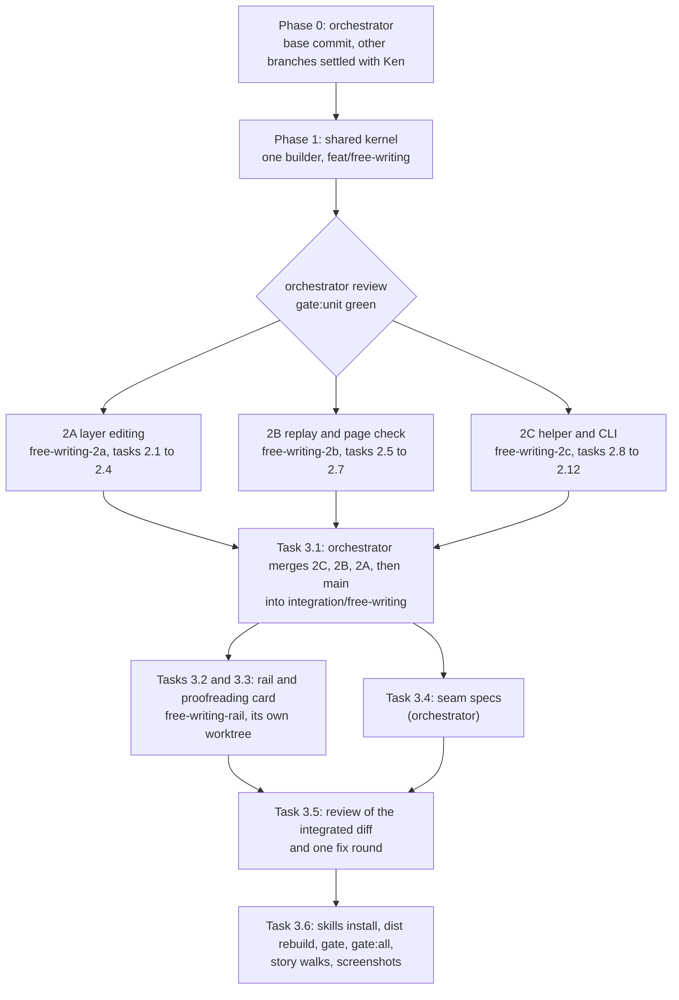

# Plan: Free writing

Four phases:

- **Phase 0** is the orchestrator alone. It records the base commit and settles three other branches that are editing this feature's files, before any builder starts.
- **Phase 1** is one builder alone. It builds the shared kernel: the record shape, the block allowlist, the block reader, the reply shape, and the contract.
- **Phase 2** is three builders in parallel, in their own worktrees, with no file in common: layer editing (2A), replay and the page check (2B), and the helper and CLI (2C).
- **Phase 3** is led by the orchestrator. It merges the three branches, has the rail built in its own worktree, runs the specs that cross the seams, runs one review of the integrated diff with one fix round, and runs the checkpoint gates.

The plan uses the recommended answers to the two architecture questions: Lahe's own editing code (AQ1), and always checking new blocks when an agent replies handled (AQ3). It also uses a default for five design questions that wait on Ken; see [Open Questions](#open-questions). [If Ken decides otherwise](#if-ken-decides-otherwise) names the tasks that change for AQ1 and AQ3.

## How the work is dispatched

**Branches.**

- `feat/free-writing`: Phase 1 builds here. The pull request to `main` opens from it, after Task 3.6 merges `integration/free-writing` back into it.
- `free-writing-2a`, `free-writing-2b`, `free-writing-2c`: the Phase 2 worktrees, each branched from `feat/free-writing` after Phase 1 merges.
- `integration/free-writing`: branched from `feat/free-writing`. Task 3.1 merges the three Phase 2 branches and `main` into it.
- `free-writing-rail`: Tasks 3.2 and 3.3, in its own worktree, branched from `integration/free-writing` after Task 3.1. The orchestrator merges it back before Task 3.5.
- `free-writing-fix-<builder>`: Task 3.5's fix branches, off `integration/free-writing`.

**Who owns what at each seam.** The orchestrator owns every merge and every test that crosses a seam.

- **2A capture feeding 2B replay.** Phase 1's run fixtures in `record_fixtures.js` are the contract between them. 2A's capture spec types every fixture that typing can produce and deep-equals each one, in all three browsers. 2B builds only against the fixtures. Both find a record's run on the page with the one shared `blocks.runElementsFor`. After the merge, Task 3.4 types real runs, rebuilds, and replays them.
- **2C's handled check reading what 2A records.** 2C builds against the same fixtures. Task 3.4 sends real captured records, read back from `review.json`, through the handled check.
- **The Phase 1 contract matching what 2B and 2C do.** Task 3.4's scripted agent is a function whose only inputs are the parsed `review.json` item and the source text. It places runs in Markdown and HTML sources. Its result must pass both the page check (2B) and the handled check (2C).

**Rules every builder follows** (repo `CLAUDE.md`, "Running the gate" and "Running the loop"):

- Run `npm run gate:unit`. Rerun only the one spec file your latest change touched, by name, with `npx playwright test test/browser/<file>.spec.js`. The existing regression specs your task names run once, just before handoff. Never the whole suite.
- 2A also runs each of its own spec files once in Firefox and once in WebKit before handoff, by name, with `--project=firefox` and `--project=webkit`.
- Never commit `dist/`. Rebuild it locally for a browser spec, but do not stage it.
- Never remove a file. List it under "To delete at cleanup" in the task report.
- Each task ends with a commit and a short report to the orchestrator. A builder that hits a limit asks the orchestrator instead of documenting around it. A hotkey that fails in one browser goes to the orchestrator, who edits `gestures.js`.
- Walks and scripts take the checkout path from `LAHE_REPO` or their own location, never a home path. They run `node <checkout>/bin/lahe.js`, never the `lahe` on PATH, with their own state folder and helper port. They never restart or touch Ken's shared helper, and never write into the repo: output goes under `testInfo.outputPath()` or the scratchpad.
- Edit `skills/lahe/SKILL.md`, but never run `npm run install-skills`. It writes the installed skill that every live agent on the machine reads. The orchestrator runs it once, in Task 3.6.
- Read first: the architecture, `docs/CONTRACTS.md`, `docs/diagrams/` (the ones the task names), and `skills/lahe/SKILL.md`.
- **The design standard.** Each new surface says which existing piece it copies:
  - the edit frame and bar in `src/layer/editing.js` (`FRAME_STYLE`, `buildBar`): the accent `#3c56a5` and its dark twin `#93a7ea`, the label and hint constants, the 120ms opacity transition
  - the "More actions" menu in `src/layer/overlay.js`: `role=menu`, `aria-haspopup`, `aria-expanded`, arrow keys, focus returned on close
  - the `cardact` buttons at equal weight on the conflict card in `src/layer/replay.js`
  - the question treatment in `src/layer/tab_done.js`
  - the scheme sampled from the page (`data-lahe-scheme` in `highlight.js`), never new colors
  - `vendor/stclair-doc-style/` for how a Markdown page draws its own headings and lists
- **Screenshots.** Light screenshots are taken on the page the task names. Dark screenshots are taken on Task 1.1's dark fixture page, because the layer takes its scheme from the page's background and the Markdown style has no dark mode.

**Spike evidence builders may reuse.** Task 1.1 copies and cleans these into `test/fixtures/free_writing/`. Until then they live under `/private/tmp/claude-501/-Users-kennethstclair-Documents-workspace-live-agentic-html-editor/e688975e-9b6e-47aa-a105-b07bed66b7d5/scratchpad/`:

- `host_spike/fixtures/blog.html`: a styled blog page.
- `host_spike/fixtures/md_render.html` and `host_spike/fixtures/doc.md`: a real Lahe Markdown render, with `sheet-head` and the "Section N" label, and its source.
- `host_spike/spike_lib.js`: the H5 host (editable parent plus `beforeinput` guard, `h5Guard`), and the code that measured spacing and type. Reference for Tasks 2.1 and 2.2, not code to paste.
- `host_spike/run_host_spike.js` and `host_spike/matrix.txt`: the five-host check list, three browsers.
- `r14_repro/repro.js`, `r14_repro/repro_lib.js`, `r14_repro/probe_reload.js`: the walk that reproduces all three R14 cases on a real `lahe review post.md`.
- `r14_repro/out/results-all.json`: what each case did before the fix.
- `tiptap_spike/fixtures/blog.html`: only needed if AQ1 goes the other way.

### Numbers this plan sets

Each lives as a named constant in the file shown.

| Constant | Value | Where |
|---|---|---|
| `PROOFREAD_MIN_WORDS` (proofreading threshold, brief R11) | 150. A run proofreads when `run_words` is more than this. | `src/shared/review_format.js` |
| `NEW_BLOCKS_MAX` (block count ceiling) | 400 blocks per record | `src/shared/record.js` |
| `NEW_BLOCKS_MAX_BYTES` (size ceiling) | 200000 UTF-8 bytes of cleaned block html per record | `src/shared/record.js` |
| `RUN_HISTORY_KEEP` (history entries that keep their run) | 3 | `src/shared/record.js` |
| Ceiling warning on the bar | at 90 percent of either ceiling; at 100 percent the layer refuses input that grows the run | `src/layer/editing.js` |
| `FLUSH.RUN_DRAFT_FLOOR_MS` (draft floor for run records) | 30000 | `src/shared/protocol.js` |
| `SHORT_BLOCK_WORDS` (the five-word line in the presence table) | 5 | `src/shared/normalize.js` |
| `RUN_WALK_SLACK` (leaves past the run's length where the walk stops) | 2 | `src/shared/normalize.js` |
| `SESSION_HISTORY_MAX` (session undo steps kept, changed blocks only) | 100 | `src/layer/editing.js` |
| `TYPING_BURST_IDLE_MS` (pause that ends a typing burst) | 1000 | `src/layer/editing.js` |

### Block-type hotkeys

Matched on `event.code`, so the characters Option or Shift make on a given layout never matter. No chord uses Ctrl-Alt, because on Windows and Linux AltGr sends Ctrl-Alt, and AltGr with a digit types characters such as `{`, `]`, and `²` on German and Polish layouts. The matcher also never fires while `AltGraph` is on. The chords split by system and skip 1, because Cmd-Shift-1 (Ctrl-Shift-1) opens Lahe's rail and Cmd-Shift-3 and 4 are macOS screenshot keys. The digit is the heading's level on the page.

| Block | Menu label | macOS | Windows and Linux | Markdown shortcut |
|---|---|---|---|---|
| p | Paragraph | Cmd-Option-0 | Ctrl-Shift-0 | none |
| h2 | Heading | Cmd-Option-2 | Ctrl-Shift-2 | `# ` |
| h3 | Subheading | Cmd-Option-3 | Ctrl-Shift-3 | `## ` |
| h4 | Small heading | Cmd-Option-4 | Ctrl-Shift-4 | `### ` |
| ul | Bulleted list | Cmd-Shift-8 | Ctrl-Shift-8 | `- ` or `* ` |
| ol | Numbered list | Cmd-Shift-7 | Ctrl-Shift-7 | `1. ` |

Each menu row shows its chord for the reviewer's system and its Markdown shortcut, read from the one matcher in `gestures.js`, so the hints and the keys cannot disagree.

### Words this plan pins

One spelling each. Builders in every phase use these exactly. Words in braces are filled in by code.

| Where | Text |
|---|---|
| Bar label, every edit (PQ2 default) | "Editing" |
| Bar hint, edit state with no block open | "Click + Write here to add text. Esc to finish." |
| The insertion line | "+ Write here" |
| Placeholder in an empty new block | "Start writing" |
| Bar, at 90 percent of a ceiling | "This edit is getting long. Press Esc to send it. Once the agent places it, you can keep writing." |
| Bar, at the ceiling | "This edit is full. Press Esc to send it. Once the agent places it, you can keep writing." |
| Block menu, caret in a block outside the six types | "Other block" |
| Screen reader, session starts | "Writing after: {first words of the anchor}" or "Writing at the start of the page" |
| Screen reader, block type changes | "{menu label}" |
| Screen reader, commit | "Sent to the agent" |
| Card and edits row, first line | "New text after '{first words of the anchor}'", or "Edit of '{first words}' plus new text" when the anchor changed too, or "New text at the start of the page" |
| Card and edits row, second line | the run's shape by count, for example "A heading, 'What the chat window cost me', then 2 paragraphs and a 3-item list." |
| Conflict card, run record | "Your {n} new blocks after this {type} are waiting on this choice. Either answer keeps them." |
| Conflict card, second button on a run record | "Take the page's, keep my new text" |
| Card note, wrong tag (`REPLAY_RUN_WRONG_TAG`) | "The agent placed '{first words}' as a {type}. You wrote a {type}, so Lahe sent it back." |
| Card note, placed elsewhere (`REPLAY_RUN_PLACED_ELSEWHERE`) | "'{first words}' is already further down the page, so Lahe did not add it again." |
| Card, helper refused the event (`RUN_EVENT_REFUSED`) | "The helper refused this edit, so the agent has not seen it. Your words are still on this page." |
| Agent note, wrong tag (`PAGE_CHECK_TAG_NOTE`) | "Reopened by the page check: a block landed with a different tag from the one in new_blocks. Give it that tag in the source, or reply not_handled saying why." |
| Proofreading buttons (PQ5 default) | "Use the fixes" posts "Use the fixes you listed. Change nothing else." "Keep my words" posts "Keep my words as written. No changes." |
| Card after either answer | "Waiting on the agent" |
| Empty rail, both tabs, page with no content blocks | "Nothing written yet" / "Start typing. Your notes go to {file}." / "Each time you stop writing, everything you wrote in that sitting becomes one card here, and the agent places it in the file." / "The agent only places your words. It organizes the notes when you ask it to." On a page with no marked file-name title, the second line is "Start typing." |

### Where the build differs from the approved wireframe

- The dashed "sent, not yet placed" rule is cut. After commit, new text gets the same changed-text wash as any edit (`highlight.js`). A second mark on the page would compete with "+ Write here".
- The block menu has a sixth row, "Small heading", so every type has all three ways in.
- Four more differences wait on Ken: PQ1, PQ2, PQ4, and PQ5 under Open Questions.

## Phase 0: Before any builder starts

The orchestrator alone.

1. Record the base commit of `main` on the progress page, and create `feat/free-writing` from it.
2. Settle the branches that are editing this feature's files right now:
   - `piece-keeps-formatting`: `replay.js`, `normalize.js`, and `no_duplicate_text.spec.js`. It looks like the fix for board row `LAHE-lone-paragraph-loses-markup`, which this feature absorbs. That row is unclaimed.
   - `refused-reword-floor`: `editing.js`, `projection.js`, `lifecycle.js`.
   - `quiet-tab-polling`: `sync.js` and `protocol.js`.
   - any other open branch whose diff touches a file this plan owns.

   For each, land it on `main` or agree with Ken how it folds in, before any builder starts. Claim `LAHE-lone-paragraph-loses-markup` either way. No builder touches another branch's work.
3. Check the spike seeds are still under `/private/tmp`. Task 1.1 is dispatched first, so they move into the repo before anything else.

**Acceptance:** the progress page names the base commit and what happened to each branch and the board row.

## Phase 1: Shared kernel

One builder, alone, on `feat/free-writing`. Nothing in Phase 2 starts until the orchestrator has reviewed this phase and `gate:unit` is green. `manifest.js` and `review_format.js` are frozen files, so the orchestrator reviews every change to them.

::: xref
[Architecture: Data / State Changes](02_architecture_free_writing.html#data-state-changes) · [Security & Privacy Notes](02_architecture_free_writing.html#security-privacy-notes) · [Contract changes](02_architecture_free_writing.html#contract-changes) · [Rollout and old agents](02_architecture_free_writing.html#rollout-and-old-agents)
:::

### Task 1.1: Markers and test seeds

**Spec:** First, add to `markers.js` the one spelling of the file-name title's chrome marker, and of the attribute the layer sets on the editing host.

Then copy the spike fixtures and the R14 walk into `test/fixtures/free_writing/` as cleaned, deterministic seeds. They follow the walk rules above: no home paths, no sleeps (waits use `test/helpers/poll.js`), no output beside the script, their own helper. Port the walk's steps onto `test/helpers` (`service.js`, `poll.js`). Keep `repro.js` as a reference file only.

Add these fixtures:
- an empty-notes render: an empty `.md` rendered by today's `markdown.js`, with the marker added by hand
- a page with a dark background, for every dark screenshot
- a page whose paragraph is a direct child of `body`
- a malformed HTML corpus: a `p` closed by a `div`, an unclosed `li`, a script body holding `
`, template contents, comments
- an engine markup corpus: `b`, `i`, nbsp, a trailing `br`, nested `strong` and `em`, entities, uppercase tags

Write the three R14 cases as `free_writing_r14.spec.js`, each marked as an expected failure (`test.fail`), asserting what `results-all.json` recorded. Task 3.4 removes the marks.

**Files:** `src/shared/markers.js`, `test/fixtures/free_writing/` (new folder, with a `README.md` naming where each file came from), `test/browser/free_writing_r14.spec.js` (new).
**Acceptance:**
- The fixtures open in Playwright with the layer injected.
- `free_writing_r14.spec.js`, run by name, reproduces all three cases on the Phase 1 base, so the run is green with three expected failures.
- The orchestrator's search finds no home path and no sleep under `test/fixtures/free_writing/`.
- Lint's tracked-file `node --check` passes.

### Task 1.2: Block allowlist, reader, and matcher

**Spec:** In `normalize.js`, add `WRITABLE_BLOCK_TAGS`, `SHORT_BLOCK_WORDS`, `RUN_WALK_SLACK`, and four functions. All are string-based, so the helper and the layer run the same code:

- `cleanBlock(tag, html) -> { html } | { code }`. The code is one of Task 1.4's refusal codes.
- `leafBlocks(html) -> [{ tag, html, words }]`, the string reader. `ul` and `ol` are leaves, and their `li` children are lines.
- `matchRun(blocks, leaves) -> [{ index, status, leaves }]`. `status` is `"whole"`, `"joined"`, `"split"`, or `"missing"`. `leaves` lists the matched leaf indexes. Words are folded for typography. The walk starts at leaf 0 and stops at the first leaf that matches no remaining block after at least one match, or after `blocks.length + RUN_WALK_SLACK` leaves.
- `runWords(blocks) -> number`, the words of the run, skipping `from_anchor` blocks.

Architecture sections: Security & Privacy Notes ("One allowlist, three places"), Replay after a rebuild ("The walk", "Where the walk stops", and the presence table's first row).
**Files:** `src/shared/normalize.js`, `test/unit/clean_block.test.js` (new), `test/unit/leaf_blocks.test.js` (new).
**Acceptance:**
- `clean_block.test.js`:
  - each is refused: `tag: "script"`, `tag: "iframe"`, the SVG animate href case, ``, `<a href>`, `li` inside a `p` block
  - every attribute is dropped, text is escaped again on output, and elements come only from the allowlist's constants
  - `cleanBlock` is a fixed point on its own output, over every sample in Task 1.1's engine markup corpus
- `leaf_blocks.test.js`:
  - on `md_render.html`, the reader skips the "Section N" label, the marked file-name title, and elements with no text
  - a list is one block whose lines are its items
  - the matcher has one test each for whole, joined, split, and missing, and one showing tag and markup never decide presence
  - negative cases, each missing: a short block whose words sit inside a later unrelated block; blocks out of run order; a block that is only a prefix of a longer leaf; a block that sits past the walk's stop
  - `runWords` counts the run and skips `from_anchor` blocks

### Task 1.3: Layer block helpers (new file)

**Spec:** New `src/layer/blocks.js`, loaded right after `selection.js`. It holds the DOM half of the block rules, so editing, replay, undo, and protection share one copy:

- `leafWalk(root, fromPoint) -> [Element]`: the same rule as `leafBlocks`.
- `insertPointAfter(anchor) -> { parent, before }`: climbs out of chrome such as `sheet-head`.
- `startPointIn(container) -> { parent, before }`: the start of a container, after leading chrome such as the marked file-name title.
- `hostFor(anchor) -> Element`: the parent of the element `insertPointAfter` climbed to. For a container anchor, the container itself.
- `canHoldRun(anchor) -> boolean`: false when the host cannot hold flow content (`td`, `th`, `dt`, `dd`, `figcaption`).
- `runElementsFor(record, doc, anchor) -> { start, blocks: [{ index, status, elements }] }`: the one way to find a record's run on the live page, built on `leafWalk` and `matchRun`. The caller passes the anchor it resolved, because `anchor.js` loads after `blocks.js`. For `start_of_container` the anchor is the container, and the walk starts at `startPointIn`. For a take-back it matches `remove_blocks`.
- `writeBlock(tag, html) -> Element | null`: runs `cleanBlock` and builds from constants.
- `swapTag(el, tag) -> Element | null`: checks `WRITABLE_BLOCK_TAGS`, and moves every attribute, the `data-lahe-id` stamp included, and every child.

Architecture sections: Components (`blocks.js`), Where "after the anchor" is, The editing host, Empty page and `lahe write`, Changing an existing block's type ("Element swap").
**Files:** `src/layer/blocks.js` (new), `src/shared/manifest.js` (entry for `blocks.js`, plus a `planned: true` entry for `src/cli/commands/write.js` owned by 2C), `test/browser/blocks_kernel.spec.js` (new), `docs/diagrams/module_map.md`.
**Acceptance:** `blocks_kernel.spec.js`, run by name, passes:
- On `md_render.html`, `insertPointAfter` an `h2` returns the point after its `sheet-head`, and `hostFor` that `h2` is its section.
- On the empty-notes fixture, `startPointIn(main)` is after the marked title.
- The DOM walk and the string reader return the same list on every page under `test/fixtures/` and on the malformed corpus. Where they disagree, the reader is fixed, not the fixture.
- `runElementsFor` finds a placed run one-to-one, reports a missing block, and works for a container anchor.
- `canHoldRun` is false in a `td` and a `figcaption`.
- `swapTag` keeps the stamp and the children. `swapTag` and `writeBlock` refuse `script`.

Lint's manifest completeness passes.

### Task 1.4: The record shape, merge, notes, and fixtures

**Spec:** In `record.js`:
- The four optional fields, `from_anchor`, and `remove_blocks`.
- `validateRun(item) -> null | { code }`, which the helper will call. The codes, in `failures.js`:
  - `RUN_BLOCK_REFUSED`: a block fails `cleanBlock`, or a tag is not writable
  - `RUN_OVER_CEILING`: over `NEW_BLOCKS_MAX` or `NEW_BLOCKS_MAX_BYTES`
  - `RUN_PLACEMENT_REFUSED`: `placement` is not one of the two values
  - `RUN_TAKEBACK_CARRIES_RUN`: a take-back with `new_blocks`
- `NEW_BLOCKS_MAX`, `NEW_BLOCKS_MAX_BYTES`, and `RUN_HISTORY_KEEP`.
- `buildRunAfter(anchorHtml, blocks) -> { after_html, after }`.
- `anchorView(item) -> item`, with `anchor_after_html` as `after_html` and its text as `after`.
- The change text for a run, with the sentences in the architecture's Change text.
- `bumpRev`: `after_history` entries carry the new fields. Entries older than the last `RUN_HISTORY_KEEP` drop `new_blocks`.
- `revertOf` for a run record: the take-back names the placed blocks in `remove_blocks` and never carries `new_blocks`. Its change text adds "Remove the blocks in remove_blocks from after this {type}; the reviewer undid them."
- `applySuggestions(item, suggestions) -> item | { code }`: the reviewer's reword at a new revision, through `bumpRev`. It replaces words inside text only, so each block keeps its markup, and it runs the result through `cleanBlock`. It refuses with `SUGGESTION_NOT_FOUND` when a suggestion's `from` is not found exactly once in its block's words.
- `PAGE_CHECK_TAG_NOTE`, with the text under Words this plan pins, added to `PAGE_CHECK_NOTES`. The agent sees it in `review.json`, as it sees the other page-check notes.

In `failures.js`, also add the card codes `REPLAY_RUN_WRONG_TAG`, `REPLAY_RUN_PLACED_ELSEWHERE`, and `RUN_EVENT_REFUSED`, with the text under Words this plan pins. The placed-elsewhere note is for the reviewer only and never reaches `review.json`.

In `merge.js`, add the four fields to `CONTENT_FIELDS`.

In `record_fixtures.js`, add run fixtures. Each carries the literal `after` string and the exact change sentence it expects, and each run's words hold the token `zqxcanary`:
- the architecture's worked example
- a split tail with no typing, and one with typing
- a tag-only change, and a tag change with new words
- a paragraph turned into a list, and an item added to an existing list
- `start_of_container`
- a record with `after_history` holding an earlier run
- a take-back with `remove_blocks`
- a run whose words hold `<`, `&`, `*`, `_`, backticks, a `#` and a "1." mid-line, straight quotes, and `--`
- one item carrying each new note
- an old-shape record with nested blocks and no `new_blocks`
- a proofread `question` reply with suggestions
- one forged record per refusal code

Architecture sections: Data / State Changes (all of it), The page check on a run, The proofreading reply.
**Files:** `src/shared/record.js`, `src/shared/merge.js`, `src/shared/record_fixtures.js`, `src/shared/failures.js`, `test/unit/run_record.test.js` (new), `test/unit/merge_run.test.js` (new).
**Acceptance:**
- `run_record.test.js`:
  - every valid fixture passes validation, and every forged one is refused with its code
  - `after` equals the literal string written in each fixture
  - `change` equals the exact sentence in each fixture, and never contains `zqxcanary`
  - a split with no typing has no "Added" sentence
  - over either ceiling is refused, including a run of three-byte characters under the block count and over the byte count
  - a take-back of a handled run lists the blocks in `remove_blocks` and has no `new_blocks`
  - the anchor view of a run record carries `anchor_after_html` as its `after_html`
  - history entries older than `RUN_HISTORY_KEEP` have no `new_blocks`
  - `applySuggestions` changes the words, keeps a block's bold, and bumps the revision; it refuses a `from` found twice or not at all
- `merge_run.test.js`, at the same revision while the browser's work is unacknowledged:
  - the browser's longer run wins
  - the browser's shorter run also wins
  - a later helper revision wins over an acknowledged browser copy

### Task 1.5: Wire constants, the reply shape, and gestures

**Spec:** In `protocol.js`:
- `SERVICE_CONTRACT` goes to 14. Add `FLUSH.RUN_DRAFT_FLOOR_MS`.
- `REPLY_FIELD` gains `PROOFREAD` (`"proofread"`) and `SUGGESTIONS` (`"suggestions"`). The reply parser accepts them only on a `question`, and checks each suggestion's shape: `block` a whole number from 0, `from` a non-empty string, `to` a string.
- The create-review body accepts `notes: true`, the same way it accepts `only_recorded_pages`.

In `gestures.js`, add every new decision 2A needs, so Phase 2 never edits this file:
- the block-type chord matcher from the hotkey table, on `event.code`, by system, never firing while `AltGraph` is on
- Enter at the end of a block makes a sibling; Enter mid-block splits; Enter in an empty last item ends the list
- Backspace and Delete across a block edge
- Cmd-Z and Shift-Cmd-Z inside a session
- Cmd-Shift-E with the caret in no block enters edit state with no block open, a new outcome of `gestureFor`
- Esc with the block menu open closes only the menu; otherwise Esc commits any open session and leaves edit state
- the hint row for edit state with no block open, with the text under Words this plan pins

Architecture sections: Rollout and old agents ("Helper version"), Block types while writing, The proofreading reply.
**Files:** `src/shared/protocol.js`, `src/shared/gestures.js`, `test/unit/protocol_wire.test.js`, `test/unit/regions_gestures.test.js`.
**Acceptance:**
- `regions_gestures.test.js`:
  - each chord maps to its tag by `event.code`, on macOS and on the other systems
  - a macOS event with code `Digit2` and key `™` matches
  - an event with `AltGraph` on never matches, and neither does Ctrl-Alt with a digit on Windows
  - no chord collides with Cmd-Shift-E, Cmd-Shift-C, Cmd-Shift-X, Cmd-Shift-1, or Cmd-Shift-3, 4, and 5 on macOS
  - one case per new decision and hint row
- `protocol_wire.test.js`:
  - the version check the CLI and the layer use refuses a 13 helper and accepts a 14 one
  - the reply parser accepts a proofread question with suggestions, and refuses suggestions on `handled` and suggestions of the wrong shape

### Task 1.6: Projection and the contract, with every copy

**Spec:** In `review_format.js`:
- Project the four fields, `remove_blocks`, and each block's derived words. For a run record, `new_blocks`, `after_full`, and `after_html` are not cut at the 2000-character bound.
- Project `run_words` (from `normalize.runWords`) and `proofread`: true when `run_words` is more than `PROOFREAD_MIN_WORDS` and the review is not a notes review. Project the review-level `notes`.
- Class `new_blocks`, `anchor_after_html`, and `remove_blocks` as data. Add `PROOFREAD_MIN_WORDS`.
- In the projection, `after_history` entries do not carry `new_blocks`. The agent needs only the current run, and replay reads history from the browser store.
- The text formatter (`renderText`, which copy and export both use) shows the anchor change and then the new blocks by type.
- Write every line under the architecture's Contract changes, plus one line for AQ3: a handled reply on new blocks is always checked against the built page. The proofreading line names the two button texts and the text each posts, exactly as pinned above.

Then update every copy in this one task, so they cannot drift:
- `skills/lahe/SKILL.md` (edit only; the orchestrator installs it in Task 3.6)
- the restated copy in `test/unit/review_format.test.js`
- the restated copy in `docs/CONTRACTS.md`, plus its record and `review.json` sections

**Files:** `src/shared/review_format.js`, `skills/lahe/SKILL.md`, `test/unit/review_format.test.js`, `test/unit/projection_review_json.test.js`, `docs/CONTRACTS.md`.
**Acceptance:**
- `review_format.test.js`:
  - asserts the new contract lines word for word, and the restated copy matches
  - `renderText` shows a run as "Heading: ...", "Paragraph: ...", "Bulleted list: ..."
- `projection_review_json.test.js`:
  - a run over 2000 characters is projected whole in `new_blocks`, `after_full`, and `after_html`
  - the field classes are right, and a projected history entry has no `new_blocks`
  - `run_words` of 150 gives `proofread: false`, and 151 gives true
  - a run over 150 words only because of `from_anchor` blocks gives false
  - a notes review gives false
- `docs/CONTRACTS.md` and the skill hold the same contract text as `review_format.js`.

**Phase test:** `npm run gate:unit` green. `blocks_kernel.spec.js` green by name. `free_writing_r14.spec.js` green with its three expected failures. The orchestrator reads the contract text against the architecture's Contract changes, line by line. It then merges Phase 1 into `feat/free-writing` and branches the three worktrees from it.

## Phase 2: Three builders in parallel

Each builder works in its own worktree, branched from `feat/free-writing` after Phase 1. File ownership does not overlap:

| Builder | Owns | Creates |
|---|---|---|
| 2A layer editing (`free-writing-2a`) | `src/layer/editing.js`, `src/layer/protect.js`, `src/layer/anchor.js`, `src/layer/highlight.js` (the one focus-ring rule), `scripts/measure_draft_write_cost.js`, `docs/diagrams/protected_region.md`, `docs/diagrams/finding_the_region.md`, `test/unit/anchor_cases.test.js`, `test/unit/anchor_engine.test.js`, `test/unit/protect_vocabulary.test.js`, and the existing specs whose Enter result changes (Task 2.1 lists them) | `test/browser/free_writing_host.spec.js`, `_capture`, `_types`, `_empty`, `_undo`, `_repaint`; `test/unit/editing_run.test.js` |
| 2B replay (`free-writing-2b`) | `src/layer/replay.js`, `docs/diagrams/replay_branches.md` | `test/browser/replay_run_anchor.spec.js`, `_insert`, `_check`; `test/browser/replay_old_records.spec.js`; `test/unit/replay_run.test.js` |
| 2C helper and CLI (`free-writing-2c`) | `src/service/log.js`, `src/service/handled_check.js`, `src/service/markdown.js`, `src/service/static_servers.js`, `src/service/routes.js`, `src/service/reviews.js`, `src/layer/sync.js`, `src/cli/index.js`, `src/cli/commands/review.js`, `src/cli/commands/add.js`, `src/cli/commands/reply.js`, `src/cli/commands/write.js`, `docs/CLI.md`, `docs/diagrams/module_map.md` (the `write` entry), the `lahe write` scenario in `skills/lahe/SKILL.md`, `test/unit/draft_flush_cadence.test.js`, `test/unit/cli_dispatch.test.js`, `test/unit/markdown_render.test.js` | `test/unit/write_command.test.js`, `test/unit/handled_check_run.test.js`, `test/unit/log_run.test.js`, `test/unit/reply_proofread.test.js` |

**Nobody in Phase 2 touches:**
- any `src/shared/` file
- `src/layer/blocks.js`
- `src/layer/tab_*.js`, `src/layer/overlay.js`, `src/layer/index.js`
- `dist/`
- another builder's files, or another branch's work

A builder who needs a change there asks the orchestrator.

::: xref
[Architecture: Key Flows](02_architecture_free_writing.html#key-flows) · [Failure Modes / Edge Cases](02_architecture_free_writing.html#failure-modes-edge-cases) · [Test Strategy](02_architecture_free_writing.html#test-strategy)
:::

### Task 2.1 (2A): The editing host and the session

**Spec:** First, before changing code: find every existing spec that presses Enter or Shift-Enter inside an open edit. `paragraph_break.spec.js`, `no_duplicate_text.spec.js` (its append helpers), and `split_not_conflict.spec.js` are known. List each on the progress page with its new expected result. The rest must pass unchanged. The orchestrator agrees to the list before 2A goes on.

Then build the host and the session:
- The host is `blocks.hostFor(anchor)`, made editable with the attribute from `markers.js`. The `beforeinput` guard refuses every edit outside the session, by every input path the architecture lists.
- The session is the anchor plus its run. A run is offered only where `blocks.canHoldRun` is true; elsewhere Enter keeps today's break rule.
- The layer writes each of these itself:
  - Enter at the end of a block, which makes a sibling `p` at `blocks.insertPointAfter`
  - Enter mid-block, which splits the block and marks the tail `from_anchor`
  - Backspace and Delete across a block edge
  - typing over a selection that spans blocks
  - cut across blocks, handled like a spanning delete
  - plain-text paste; a drop is inserted the same way as a paste
- The caret leaving the session, by a click or an arrow key, ends it. IME composition inside a session block is allowed; one that starts outside is refused.
- The focus ring: one rule in the D8 page stylesheet in `highlight.js`, scoped to the host attribute and removed with it. The frame is the focus indicator, drawn whenever a session is open, including around an empty new block.
- The frame wraps every block the sitting created or changed, plus the caret's block. An anchor the reviewer never touched stays outside it. The frame follows new blocks without animating its size.
- Capture builds the record through `record.js` and `cleanBlock`. It rebuilds only the block the caret is in and reuses the cleaned html of the rest.
- `kindFor` counts the run and the tag. `itemFor` maps any run block back to its outstanding record through `blocks.runElementsFor`. Once the record is handled, a sitting on its blocks starts a new record.
- Reopening a pre-feature record keeps today's session and break rule.
- A polite live region in the layer's shadow root announces the session start, each block type change, and the commit, with the words pinned above. It is a new component: the rail's toasts are for agent replies, not caret events.
- Extend `scripts/measure_draft_write_cost.js` with a session that types a 5,000-word run.

Architecture sections: The editing host, Block types while writing (Enter, Shift-Enter, Paste), Two sittings in the same place, Rollout ("Reopening an old record"), Data / State Changes ("Draft growth").
**Files:** `src/layer/editing.js`, `src/layer/highlight.js`, `scripts/measure_draft_write_cost.js`, `test/unit/editing_run.test.js`, `test/browser/free_writing_host.spec.js`, `test/browser/free_writing_capture.spec.js`, and the existing specs on the agreed list.
**Acceptance:**
- `free_writing_capture.spec.js` types every fixture that typing can produce and deep-equals each fixture's shape: fields, tags, and markup, ignoring ids and times. That is the worked example after a paragraph on `blog.html`, a split tail with and without typing, a tag-only change, a tag change with new words, a paragraph turned into a list, a list append, and `start_of_container`.
- `free_writing_host.spec.js`:
  - Backspace at the start of the first run block merges into the anchor, and Delete at the anchor's end merges the first run block
  - arrow and Shift-arrow cross between the anchor and the run
  - for each of these, every page block outside the session keeps its `outerHTML`: Cmd-A then type; Cmd-A then Backspace; ArrowDown out of the run then type; Cmd-B and Cmd-Z in that block; a drop; a cut across the session's edge; a composition started outside
  - a spanning selection overwritten leaves no inline style spans
  - a paste of formatted HTML arrives as plain paragraphs. Chromium uses a real Meta+V; the spec names what stands in for it in Firefox and WebKit
  - IME composition inside a run block commits its text
  - a click, and an arrow key, into a page block outside the session end it
  - a split with no typing gives a `from_anchor` tail and no "Added" change text
  - an empty last list item is dropped at capture
  - Cmd-Shift-E on a run block of an outstanding record reopens that record; after the record is handled, a sitting there starts a new record
  - Enter at the end of a `td` does not start a run
  - on the page whose paragraph is a direct child of `body`, the rail works and takes no edits
  - the live region says each pinned line
  - reopening a pre-feature multi-paragraph record keeps today's behavior
- The draft-cost script, on the 5,000-word run, shows one browser-storage write per keystroke and capture work limited to the caret's block. Its numbers go on the progress page.
- Screenshot, light and dark, in all three browsers: the frame around an anchor plus a two-block run on `md_render.html`, with no page focus ring.

### Task 2.2 (2A): Block types, the bar menu, hotkeys, lists, and the ceiling

**Spec:**
- **The menu** sits on the bar before B and I (wireframe direction A), built from the "More actions" menu in `overlay.js`. It has six rows, each showing its chord and Markdown shortcut. Esc with the menu open closes only the menu, and focus returns to the caret. The menu opens upward when there is no room below. On a narrow window the bar drops its hint first.
- **One function per block type**, called by the menu, the hotkeys, and the Markdown shortcuts. A shortcut works only at the start of a block; "# " typed mid-line stays text.
- **A block outside the six types** (a blockquote, the page's `h1`, an `h5`, a `pre`, a table cell, a figcaption): the menu button reads "Other block" and is disabled, and the hotkeys and shortcuts do nothing.
- **Changing the anchor's type** uses `blocks.swapTag` and sets `anchor_tag_after`. The anchor ladder's tag tie-breaker accepts either tag.
- **An existing list:** the anchor is the whole list. Enter adds an `li`, and Enter in an empty last item ends the list with a new `p` in the run. Type changes follow the architecture's rule for lists.
- **The ceiling:** the bar shows the pinned warning at 90 percent of either ceiling. At the ceiling, the layer refuses input that would grow the run, and the bar shows the pinned at-the-ceiling line.

Architecture sections: Block types while writing, Adding to an existing list, Changing an existing block's type, Data / State Changes ("Size ceiling").
**Files:** `src/layer/editing.js`, `src/layer/anchor.js`, `test/browser/free_writing_types.spec.js`, `test/unit/anchor_cases.test.js`.
**Acceptance:**
- `free_writing_types.spec.js`:
  - each type can be made by every route the hotkey table gives it, in new text and in an existing block
  - the menu names the caret's block; in a blockquote it reads "Other block", is disabled, and the hotkeys do nothing
  - from the keyboard, the menu rows show their chord and shortcut, arrows move between rows, and Esc closes only the menu with focus back at the caret
  - "# " typed mid-paragraph stays text
  - a paragraph turned into a header commits as `format_only` with `anchor_tag_after: "h2"`
  - Enter at the end of an existing bullet adds an `li` to `anchor_after_html`
  - on an existing list, Numbered list swaps the whole list, Paragraph on the last item ends it, and Heading is disabled on a middle item
  - a run at 90 percent shows the warning; at the ceiling, one more block is refused, the bar says why, and the record is never over the ceiling
  - computed styles on `blog.html` and `md_render.html`: a new block of each tag matches the page's own block of that tag in margin-top, margin-bottom, font-size, line-height, font-weight, and the gap to the next block. The only allowed difference is a new `h2`'s missing section rule. The spike's measuring code is reused.
- `anchor_cases.test.js`: the ladder finds a block by its saved tag and by `anchor_tag_after`.
- Screenshots, light and dark:
  - the bar with the menu closed, and open
  - a new heading while writing on `md_render.html`, showing the page's `h2` style without the section rule
  - the ceiling warning
  - the bar on a narrow window

### Task 2.3 (2A): Starting in empty space and the empty page

**Spec:**
- **The line.** While any edit is open, hovering between two blocks or below the last shows the "+ Write here" line. It stops at the rail's edge, using the berth `highlight.js` publishes. It fades in with the frame's opacity transition, and shows at once under reduced motion.
- **Clicking the line** commits any open session and opens a new one anchored on the block above, with an empty first `p`. The placeholder "Start writing" is drawn in the layer's shadow root over the empty block, never in the page, and goes on the first keystroke.
- **Cmd-Shift-E** stays caret-based. With the caret in no block, it enters edit state with no block open. The bar shows near the top of the viewport with its label and the pinned hint, and hides the menu, B, I, and Delete block. A click on a block opens that block. Esc, or a click on the rail, leaves.
- **The keyboard way into new text** is Enter at the end of the block above.
- **The empty-container rung** in `anchor.js`: `main`, or `body` with no `main`, found by tag, used only by `start_of_container` records, whether or not the page now has content.
- **The empty page** opens with a session ready in an empty paragraph after the title (PQ1 default).
- Update `finding_the_region.md` for the new rung.

Architecture sections: Block types while writing ("Starting in empty space"), Empty page and `lahe write`.
**Files:** `src/layer/editing.js`, `src/layer/anchor.js`, `test/browser/free_writing_empty.spec.js`, `test/unit/anchor_engine.test.js`, `docs/diagrams/finding_the_region.md`.
**Acceptance:**
- `free_writing_empty.spec.js`:
  - with the caret in a paragraph, Cmd-Shift-E, then hover a gap: the line shows and stops at the rail's edge. Clicking it commits that session and starts a new one after the right block
  - Cmd-Shift-E with the caret in no block shows the bar and its hint; Esc leaves
  - the placeholder is never in the page's DOM or in the record
  - the empty-notes fixture opens with a session ready, and the first sitting commits with `placement: start_of_container`, anchored on `main`, not on the marked title
  - a second sitting before the agent places the first continues the same record at a new revision
  - after the first record is handled, the next sitting is `after_anchor` on the last block
- `anchor_engine.test.js`:
  - the rung resolves a `start_of_container` record on an empty page and on a page that now has content, and is not marked lost
  - an `after_anchor` record whose anchor is gone is LOST on a page with content, and on a page the agent emptied
- Screenshots, light and dark: the line between two blocks on `blog.html`, the empty-notes page ready to type, and edit state with no block open.

### Task 2.4 (2A): Undo and protection

**Spec:**
- **Session undo** keeps a snapshot of the changed blocks at each block change and at the end of each typing burst (`TYPING_BURST_IDLE_MS`), up to `SESSION_HISTORY_MAX`. A Markdown shortcut is its own step. Cmd-Z and Shift-Cmd-Z walk it while the frame is open.
- **After commit**, undo of a run record restores the anchor's `before_html` and old tag through `cleanBlock` and `blocks.swapTag`, and removes the run's elements, found with `blocks.runElementsFor`. A record the agent has not handled is withdrawn. On a handled record, it raises the take-back that `record.revertOf` builds, with `remove_blocks`.
- **In `protect.js`:** protect and snapshot the anchor plus the run, found with `runElementsFor`. Restore by block position and character offset after the re-found anchor. Set the host attribute again when a repaint replaces the parent. Rebind after a tag swap.

Architecture sections: Undo inside a session, Undo of a committed record, The editing host ("A repaint that replaces the parent"), Failure Modes (repaint and reload rows).
**Files:** `src/layer/editing.js`, `src/layer/protect.js`, `test/browser/free_writing_undo.spec.js`, `test/browser/free_writing_repaint.spec.js`, `test/unit/protect_vocabulary.test.js`, `docs/diagrams/protected_region.md`.
**Acceptance:**
- `free_writing_undo.spec.js`:
  - Cmd-Z right after "1. " gives back the typed characters
  - Cmd-Z walks block changes in order, redo walks them back, and step 101 drops the oldest
  - undo of a committed run the agent has not handled removes the run and restores the anchor, and after two reloads the run is still gone
  - undo of a tag change restores the paragraph
  - undo of a handled run raises a take-back with `remove_blocks` and no `new_blocks`
- `free_writing_repaint.spec.js` (uses `test/fixtures/repainting.html` and `md_render.html`):
  - a repaint mid-sitting keeps every run block and the caret's block and offset
  - a repaint that replaces the parent keeps typing working
- `protected_region.md` shows the run.

**2A's hand-off.** Each 2A task ends with a commit and a short report. If the first agent runs long, the orchestrator may send Tasks 2.2 to 2.4 to a fresh agent in the same worktree. Before handoff, 2A runs its six spec files once each in Firefox and WebKit, by name.

**Don't touch (2.1 to 2.4):** `replay.js`, `sync.js`, anything in `src/service/` or `src/cli/`.

### Task 2.5 (2B): Anchor view, the tag leg, and old records

**Spec:** For a run record, every anchor-compare function reads `record.anchorView`, so `writeRegion` never sees the whole sitting. Add the tag leg: the anchor is applied only when its tag equals `anchor_tag_after`, and a match on words and markup with the wrong tag swaps the tag through `blocks.swapTag`. Records without `new_blocks` keep today's path unchanged.

After 2A merges, `no_duplicate_text.spec.js` and `split_not_conflict.spec.js` make run records when they press Enter, so today's path loses its browser coverage. So add `replay_old_records.spec.js`: each scenario in those two specs and in `replay_branches.spec.js`, injected as an old-shape fixture record with nested blocks and no `new_blocks`.

Architecture sections: Data / State Changes (the reader table's replay rows), Changing an existing block's type ("Replay").
**Files:** `src/layer/replay.js`, `test/unit/replay_run.test.js`, `test/browser/replay_run_anchor.spec.js`, `test/browser/replay_old_records.spec.js`.
**Acceptance:**
- `replay_run_anchor.spec.js`, using the Phase 1 fixtures injected into the store: a run record whose agent placed the run, then a repaint that brings the old anchor back. The anchor never comes back holding the run's words.
- A tag-only fixture on a page still showing `p` is swapped to `h2`. Tag-swap tests find the anchor by its stamp, so they do not wait on 2A's ladder change.
- `replay_old_records.spec.js` passes.
- `no_duplicate_text.spec.js`, `split_not_conflict.spec.js`, and `replay_branches.spec.js` pass unchanged, run once before handoff.

### Task 2.6 (2B): The insert path, the take-back, and the held run

**Spec:** After the anchor compare, find the run with `blocks.runElementsFor`, resolving fixture anchors by stamp, and decide each new block by the presence table. That covers:
- rewriting a one-to-one block in place for a wrong tag or lost bold
- rewriting in place a block found one-to-one with an earlier revision's words (branch three), which is how accepted proofreading fixes reach the page
- leaving joined or split blocks alone
- the whole-page search for blocks of `SHORT_BLOCK_WORDS` or more
- inserting a missing block after the last present one, through `blocks.writeBlock`
- **a container anchor:** no anchor compare, and the walk starts at `blocks.startPointIn`
- **a take-back:** remove each block in `remove_blocks` found one-to-one; never insert; never replay the original record's run again
- **the anchor in branch four:** hold the run. The conflict card shows the run and the pinned run line. "Keep mine" applies the anchor and places the run. The second button reads "Take the page's, keep my new text", and keeps the page's anchor and places the run after it.

A wrong tag sets `REPLAY_RUN_WRONG_TAG` on the card. A block found elsewhere sets `REPLAY_RUN_PLACED_ELSEWHERE`. Add `PAGE_CHECK_TAG_NOTE`'s line to `CHECK_NOTICES`. The anchor gone means LOST, with nothing placed.

Architecture sections: Replay after a rebuild (the whole section), Empty page and `lahe write`.
**Files:** `src/layer/replay.js`, `test/unit/replay_run.test.js`, `test/browser/replay_run_insert.spec.js`, `docs/diagrams/replay_branches.md`.
**Acceptance:** `replay_run_insert.spec.js`:
- one test per row of the presence table
- a short block whose words appear further down the page, past the walk's stop, is inserted
- a run with an `h2` on `md_render.html` lands after the `sheet-head`, not inside it
- the `start_of_container` fixture on the empty-notes render lands after the marked title. After the notes are placed and the page reloads, there is no conflict card
- a take-back removes the listed blocks and inserts nothing, and after two reloads they are still gone
- an earlier revision placed, then the current revision reworded: the block is rewritten in place and shows once
- an anchor conflict on a run record: the card shows the run and its count. "Take the page's, keep my new text" keeps the page's anchor and places the run. "Keep mine" applies both
- a forged fixture with `tag: "script"` writes nothing; a record with no anchor on the page goes LOST and inserts nothing

`replay_branches.md` shows the insert path after branches one to three, the container anchor, the take-back, and the held run on branch four. Screenshots, light and dark: a placed run with an `h2` on `md_render.html` after replay, and the conflict card holding a run.

### Task 2.7 (2B): The page check and the R14 cases

**Spec:** For a run record, `pageCheckReasonFor` and `formattingMissingFromPage` check the anchor and each new block on their own, with the same walk and matcher:
- A missing block reopens the item with the "undone" note.
- Lost bold or italic reopens it with the formatting note.
- A one-to-one block with the wrong tag reopens it with `PAGE_CHECK_TAG_NOTE`.
- The section label does not count against it.

Then prove the first two R14 cases under the new record shape, with Task 1.1's seeds and fixture records. Architecture sections: The page check on a run, Analysis of Existing Structure ("Root cause of two open bugs"), Failure Modes (last row).
**Files:** `src/layer/replay.js`, `test/browser/replay_run_check.spec.js`.
**Acceptance:** `replay_run_check.spec.js`:
- a handled run with an `h2` on `md_render.html` is not reopened
- a handled run whose paragraph lost its bold is reopened with the formatting note
- a header placed as a paragraph is reopened with the tag note, not the formatting note
- a missing block is reopened as undone
- the header case, as a run record: the line shows once, below the `sheet-head`
- the lone paragraph: bold in the first paragraph and in the second, and the agent leaves out the bold one. The item reopens, and the bold paragraph shows once, with its bold

**Don't touch (2.5 to 2.7):** `editing.js`, `protect.js`, `anchor.js`, `sync.js`, anything in `src/service/` or `src/cli/`.

### Task 2.8 (2C): Helper enforcement, the draft floor, and refused events

**Spec:** On append, `log.js` runs `record.validateRun` and refuses a failing event with its code rather than cleaning it. `sync.js` holds drafts of run records to `FLUSH.RUN_DRAFT_FLOOR_MS`. It also reads `rejected` for the run codes, stops re-posting that event, and raises `RUN_EVENT_REFUSED` on the item; Task 3.2 draws it. Architecture sections: Security & Privacy Notes ("One allowlist, three places", "Size"), Data / State Changes ("Size ceiling", "Draft growth").
**Files:** `src/service/log.js`, `src/layer/sync.js`, `test/unit/log_run.test.js`, `test/unit/draft_flush_cadence.test.js`.
**Acceptance:**
- `log_run.test.js`:
  - every forged fixture from Task 1.4 is refused at the helper with its code, and nothing reaches `events.jsonl` or `review.json`
  - a valid run is stored and projected whole
  - a record at both ceilings, with `RUN_HISTORY_KEEP` full history entries, fits under the helper's `MAX_BODY_BYTES`; the test computes the size and does not assume it
- `draft_flush_cadence.test.js`:
  - a run record's drafts wait for the longer floor, a record without `new_blocks` keeps the 10-second floor, and a commit is never held
  - a refused run event is posted once, not again on each reconnect, and the item carries `RUN_EVENT_REFUSED`

### Task 2.9 (2C): The handled check

**Spec:**
- `checkable` accepts `format_only` records and run records.
- A run record and a `format_only` record are matched by the rules in the architecture's The handled check.
- Per AQ3, a run record's block words are checked even when the source was written since commit. The anchor's words stay behind today's gate.

Architecture sections: The handled check, Failure Modes (the third R14 case), AQ3.
**Files:** `src/service/handled_check.js`, `test/unit/handled_check_run.test.js`.
**Acceptance:** `handled_check_run.test.js`, against built pages rendered from Markdown sources:
- a correct run with an `h2` passes, with a section label between blocks
- a run whose second block is missing is held open, with the source written and not written
- a run whose words became raw HTML in the source is held open even though the source was written
- a run holding "a < b & c", correctly escaped, passes
- straight quotes rendered curly, and `--` rendered as a dash, pass
- a `start_of_container` run skips the anchor and passes
- a `format_only` bold edit where the agent wrote nothing is held open, which is the third R14 case
- the same edit with the bold in the source passes
- a comment and a delete are still not checked

### Task 2.10 (2C): `lahe write`

**Spec:** Add the `lahe write <path>` command:
- It takes `--session` and `--name`, and prints what `lahe review` prints.
- It checks the path with `lstat` before either branch and refuses a symlink.
- It creates `.md` or `.markdown` files only, with the `wx` flag, and only when the parent folder exists.
- On "already exists" it checks again and uses the file only if it is a regular Markdown file. It never overwrites.
- It prints the parent folder's real path.
- **Its own one-page server.** `static_servers.js` gains a one-page mode, keyed by the page, never by the root folder, so it never reuses a folder server. It serves the rendered page and the Lahe style and font files the page names; any other request gets a 404. `review.js` gives `write` a path that starts this server and registers no asset mount and no link mounts. With `--session`, `write` joins the agent session but still starts its own server.
- **The notes marker.** It records `notes: true` on the review, through `add.js`, `routes.js`, and `reviews.js`, the same way `--only` records `only_recorded_pages`.

Register it and document it. Add the `write` entry to `module_map.md`. Add a "Notes on a blank page" scenario to the skill, without installing it. Architecture sections: Empty page and `lahe write`, Security & Privacy Notes (the `lahe write` bullets).
**Files:** `src/cli/commands/write.js` (new; the orchestrator clears its `planned` flag at merge), `src/cli/index.js`, `src/cli/commands/review.js`, `src/cli/commands/add.js`, `src/service/static_servers.js`, `src/service/routes.js`, `src/service/reviews.js`, `docs/CLI.md`, `docs/diagrams/module_map.md`, `skills/lahe/SKILL.md` (the new scenario only), `test/unit/write_command.test.js`, `test/unit/cli_dispatch.test.js`.
**Acceptance:** `write_command.test.js`:
- it creates a new file
- on an existing regular `.md`, it exits 0 and serves it, and the file's bytes are unchanged afterward
- it refuses a directory named `x.md`, a missing parent folder, and a non-Markdown name
- it refuses a dangling symlink and creates nothing at its target
- it refuses a symlink to an existing `.md`, and a symlink to a non-Markdown file
- the printed folder is the real path when the parent is reached through a symlinked folder
- a request for a sibling file in the same folder gets a 404, and so does a request for another review's rendered page in the same session
- with `--session`, on a session whose Markdown review already has a server, `write` starts its own server, and the sibling file is still a 404
- the review carries `notes: true` in `review.json`

`cli_dispatch.test.js` lists `write`. `docs/CLI.md` and `module_map.md` have the command.

### Task 2.11 (2C): The file-name title is chrome

**Spec:** When a Markdown file has no `#` heading, `markdown.js` marks the hero title it takes from the file name with the marker from `markers.js`. Architecture sections: Empty page and `lahe write`.
**Files:** `src/service/markdown.js`, `test/unit/markdown_render.test.js`.
**Acceptance:** `markdown_render.test.js`: an empty file and a file with no heading carry the marker. A file with a `#` heading does not. The rendered empty file matches Task 1.1's empty-notes fixture except for ids.

### Task 2.12 (2C): Proofreading replies

**Spec:** `lahe reply` gains `--proofread` and a repeatable `--suggest <block> <from> <to>`, so the agent never writes JSON by hand. With `--proofread`, `reply` reads the item from `review.json` at that revision and refuses any suggestion `record.applySuggestions` would refuse, naming it. Document both flags in `docs/CLI.md`. Architecture sections: The proofreading reply.
**Files:** `src/cli/commands/reply.js`, `docs/CLI.md`, `test/unit/reply_proofread.test.js` (new).
**Acceptance:** `reply_proofread.test.js`:
- the flags write a reply line with `proofread` and `suggestions`, which the Phase 1 parser accepts
- `--suggest` on a `handled` reply is refused
- a suggestion whose `from` appears twice in its block is refused, and the message names it

**Don't touch (2.8 to 2.12):** `editing.js`, `protect.js`, `anchor.js`, `replay.js`, the contract text in `skills/lahe/SKILL.md`.

**Phase test:** Each builder's branch is green on `gate:unit` and on its own new spec files, run by name. 2A's six spec files are green in all three browsers. The orchestrator checks each branch's diff touches only files its builder owns. There is no full browser suite in this phase.

## Phase 3: Rail, integration, and review

Led by the orchestrator. Tasks 3.2 and 3.3 go to one builder so the rail reads as one hand.

::: xref
[Architecture: Components / Modules Touched](02_architecture_free_writing.html#components-modules-touched) · [The proofreading reply](02_architecture_free_writing.html#the-proofreading-reply) · [Wireframe decision](wireframes/DECISION.md)
:::

### Task 3.1: Merge the three branches

**Spec:** The orchestrator merges 2C, then 2B, then 2A into `integration/free-writing`, using `st-merge`. It then merges `main` in once. It clears the `planned` flag on `write.js` in `manifest.js` and runs `gate:unit`.
**Files:** `src/shared/manifest.js`, merge commits only.
**Acceptance:** `gate:unit` is green on the integration branch. No file shows changes from two builders. Every conflict and its resolution, including those from `main`, is written on the progress page.

### Task 3.2: The edits tab and the card show new blocks

**Spec:** On `free-writing-rail`:
- The edits tab row and the rail card lead with the pinned two-line summary, with counts computed by code. The block-by-block list sits under the card's existing disclosure, using the menu's labels.
- A `from_anchor` block reads as moved, not added.
- The card shows the replay notes (`REPLAY_RUN_WRONG_TAG`, `REPLAY_RUN_PLACED_ELSEWHERE`) and the helper's refusal (`RUN_EVENT_REFUSED`). A refused item is never shown as sent.
- On a page with no content blocks, the Active and Edits tabs both show the pinned empty-page lines. The file name is the text of the marked file-name title from Task 2.11. On a page with no marked title, the file line reads "Start typing."
- After commit, new text gets the changed-text wash, as any edit does.

Architecture sections: Components (`tab_edits.js`, `tab_done.js`, `overlay.js`).
**Files:** `src/layer/tab_edits.js`, `src/layer/tab_done.js`, `src/layer/overlay.js`, `test/browser/edits_tab.spec.js`, `test/unit/block_changes.test.js`.
**Acceptance:** `edits_tab.spec.js` shows:
- a run's two-line summary, and each block's type under the disclosure
- a split tail labelled as moved
- both replay notes, and the refusal, on the card
- the empty-page lines on both tabs, with the file name on a notes page and without it on an HTML page
- the wash on a committed run

Screenshots, light and dark:
- the edits row for a three-block run
- the card waiting on the agent (wireframe `05-waiting`)
- the empty rail on a new notes page

### Task 3.3: The proofreading question on the card

**Spec:** On `free-writing-rail`. Only a `question` reply marked `proofread` shows the two buttons. A question earns buttons here because its answer is always one of two. The card keeps today's question treatment and its follow-up box. The buttons are drawn in the `cardact` register at equal weight, as on the conflict card.
- "Use the fixes" calls `record.applySuggestions`. The record gets a new revision holding the fixed words, the page shows them, and the button posts its pinned text. If `applySuggestions` refuses, the button is not shown, and the reviewer answers in the follow-up box.
- "Keep my words" posts its pinned text.
- The card shows "Waiting on the agent" until the agent replies. It never says the fixes were applied before then.

Architecture sections: The proofreading reply. Brief R11 (proofreading after a long hand-written block).
**Files:** `src/layer/tab_done.js`, `test/browser/agent_replies.spec.js`.
**Acceptance:** `agent_replies.spec.js`:
- a proofread reply shows both buttons; a placement question on a run record shows none
- "Use the fixes" leaves the record at the next revision with the fixed words, the thread shows the pinned text, and the card waits
- "Keep my words" posts its pinned text, and the card waits
- a proofread reply whose suggestion cannot apply shows no "Use the fixes" button

Screenshots, light and dark: the question card (wireframe `06b-question`), and the card after each answer. The orchestrator merges `free-writing-rail` into `integration/free-writing` after this task.

### Task 3.4: Specs across the seams

**Spec:** The orchestrator writes the specs that need all three branches, on real `lahe review` and `lahe write` pages, following the walk rules above.
- **The scripted agent** is a function whose only inputs are the parsed `review.json` item and the source text. It places runs as the contract says, in Markdown and in HTML sources, then rebuilds and replies. An old-contract variant applies only `after_html` (HTML) or pastes `after` as paragraphs (Markdown).
- Every item is read back from `review.json` at its committed revision, never from `window.__lahe.items()`, which proves the helper accepted real capture.
- The ported helpers have no "reloaded by hand" fallback. A missing self-reload fails the test.

**Files:** `test/browser/free_writing_seams.spec.js` (new), `test/browser/free_writing_r14.spec.js` (remove the `test.fail` marks, add the typed cases), `test/browser/support/` (the scripted agent).
**Acceptance:** `free_writing_seams.spec.js`:
- **Placement:** a header, a paragraph, and a list typed after a block; commit; the agent places them; rebuild. The run shows once, tags and bold intact, and the page check does not reopen it.
- **HTML:** the same worked example placed into `blog.html`'s source, including one block with `<` and `&`. Both checks pass.
- **Special characters:** a run holding `<`, `&`, `*`, `_`, backticks, a `#` and a "1." mid-line, straight quotes, and `--`. The page's text equals the typed text with typography folded, the handled check passes, and the page check does not reopen it.
- **Split:** Enter mid-paragraph, type, commit, the agent splits the source, rebuild. The text shows once, with no conflict card.
- **Retag and undo:** paragraph to header, commit, rebuild, undo. The header survives the rebuild, and undo restores the paragraph and raises a take-back.
- **Undo a ready run**, reload twice: the run is gone.
- **Undo a handled run:** the agent removes the blocks and replies handled on the take-back; rebuild. Nothing is reinserted, and neither item reopens.
- **List:** Enter at the end of an existing bullet, type, commit, rebuild. The new item shows once.
- **Reload mid-sitting:** the record is ready and the run is back; Cmd-Shift-E on a run block reopens it. The same with a run over `FLUSH.KEEPALIVE_MAX_BYTES`: the run still reaches the helper.
- **Crash mid-sitting** (Chromium, persistent context): type a multi-block run, close the context with no unload, relaunch. The next load commits the whole run.
- **Rebuild mid-sitting:** `sync.status().reloadPending` is true while the sitting is open, the caret and text stay, and after commit a main-frame navigation brings the rebuilt content.
- **Handled check:** a real captured run where the agent replies handled and writes nothing is held open. A real run whose words the agent wrote as raw HTML is held open.
- **Notes page:** three sittings on an empty `lahe write` page before the agent places any of them become one record, placed at the top of the file, every block shown once. After the agent places revision 1, the reviewer adds a sitting and the agent places revision 2: every block shows once.
- **Proofreading:** a run over 150 words; the agent places it and replies with a proofread. "Use the fixes": the agent puts the fixes in the source and replies handled. The item is not held open, is not reopened after two reloads, and the original sentence is not on the page. The "Keep my words" twin passes too.
- **Old agents:** the old-contract agent, in HTML and in Markdown. No block shows twice, and the item is reopened or flagged, never quietly handled.

`free_writing_r14.spec.js`, typed for real:
- the header case on a real `lahe review post.md`, leaving by click and by Esc: the `h2`'s text is exactly the header, and the line shows once below the `sheet-head`. Screenshots while writing and after the rebuild
- the lone paragraph with bold in the first and second paragraph, where the agent leaves out the bold one: the item reopens, and the bold paragraph shows once with its bold
- bold two words, commit, rebuild: survives with a correct agent, and is held open with an agent that changes nothing

### Task 3.5: Review of the integrated diff, and one fix round

**Spec:** The orchestrator runs the review set that feature-forge's Review phase defines on the diff of `integration/free-writing` against the recorded base. It includes the code lead and security, because serving and paths change (`lahe write`), along with the helper's append path and the page-write allowlist.
- Each finding names its test.
- A fix goes to the original owner, as a `free-writing-fix-<builder>` branch off `integration/free-writing`, with the test written red, then green.
- A seam spec that failed in Task 3.4 follows the same path. The orchestrator owns those failures and sends the fix builder.
- The orchestrator merges each fix and checks its test exists and passes.
- One fix round. A second review only when a fix is itself risky.

**Files:** fix branches only, plus the progress page.
**Acceptance:** every finding has a disposition on the progress page, and every fix's named test exists and passes.

### Task 3.6: Checkpoint

**Spec:**
1. The orchestrator runs `npm run install-skills` once.
2. It rebuilds `dist/` and commits it.
3. It runs `npm run gate` and reads the pass and fail counts.
4. It runs `npm run gate:all` and reads the counts.
5. It walks every brief user story on the running app with a real agent, following the walk rules above, never on Ken's helper. The checklist:
   - HTML and Markdown pages
   - a header, a list, a split, and `start_of_container`
   - the proofreading question, with each answer
   - a notes page from `lahe write`
   - each hotkey in each browser, to find a chord the browser keeps for itself
6. It puts every screenshot from Tasks 2.1 to 3.4 on the progress page, light and dark.
7. It merges `integration/free-writing` into `feat/free-writing`. It pushes only after it has read "0 failed", as its own step. The pull request opens from `feat/free-writing`.

**Files:** `dist/lahe-layer.js`, `docs/features/20260928.01_free_writing/04_progress_free_writing.md`.
**Acceptance:** Both gates show 0 failed in all three lanes. Each user story has a walk note and a screenshot on the progress page. Changes from plan lists every deviation.

**Phase test:** Task 3.6's gates and walks. The Acceptance Criteria below, each marked green by an evaluator who did not build it.

## If Ken decides otherwise

**AQ1, if Ken picks Tiptap for the run.** Before anything is built on it, the choice goes back to the security reviewer, as the architecture's Alternatives section requires.

- Phase 1 is unchanged.
- New task before 2A: vendor Tiptap under `vendor/tiptap/`, with its LICENSE and a README, and a helper route that serves it only when a sitting opens (owned by 2C).
- Task 2.1 changes: the host becomes a Lahe anchor plus a Tiptap run. Capture maps Tiptap's `<li>
` to `<li>` before `cleanBlock`.
- Task 2.2 changes: the menu and hotkeys call Tiptap commands for run blocks. The anchor keeps Lahe's code.
- Task 2.4 changes: session undo on the run comes from Tiptap's history. Protection puts Tiptap's own node back after a repaint.
- Rich paste is kept, since Tiptap brings it. It runs through `cleanBlock`, and the board row `LAHE-rich-paste` closes.
- Test list changes: the caret-crossing, spanning-selection, and Backspace-merge tests between anchor and run are expected to fail. Ken accepts that seam, and those lines leave the Acceptance Criteria.

**AQ3, if Ken says no.**

- Task 1.6 drops the AQ3 contract line from the contract and every copy.
- Task 2.9 keeps today's gate for run records. Coverage of `format_only` records stays, because brief R14 (bold and italic survive the rebuild) needs it.
- Task 3.4 changes: the "words written as raw HTML" spec expects the page check to reopen the item on the next load, not the handled check to hold it open at reply.
- The Test List line for that case changes to match.

## Open Questions

::: callout-question
**PQ1 (Ken, design review DR4):** Does a blank notes page open ready to type? **Default: yes.** The page opens with a session already in an empty paragraph after the title, and the rail says "Start typing." The approved wireframe instead has the reviewer find and click "+ Write here" first. On a blank page there is only one place to write, and a keyboard user has no way to click the line. If Ken keeps the wireframe, Task 2.3 shows the line all the time on an empty page instead, and the rail's line becomes "Click + Write here to start."
:::

::: callout-question
**PQ2 (Ken, DR12):** What does the bar say while writing? **Default: "Editing", for every edit, as one constant.** Today's "Editing this block" reads wrong over an empty new block and over a frame holding five blocks. One word for both keeps writing and editing looking the same.
:::

::: callout-question
**PQ3 (Ken, DR18):** Does the agent proofread notes? **Default: no.** The brief says the agent organizes notes only when asked, and a proofreading question on every long sitting would train the reviewer to ignore question cards. So `proofread` is false on a notes review. The `notes: true` marker in Tasks 1.5, 1.6, and 2.10 exists for this default. If Ken says yes, that marker and its plumbing drop out.
:::

::: callout-question
**PQ4 (Ken, DR19 and T27):** After a reload mid-writing, where is the caret? **Default: the plan as written.** Which reloads keep the caret:

- **Lahe's own rebuild:** the reload waits until the sitting ends, so the caret never moves.
- **A framework repaint:** the session stays open, and the caret is restored.
- **A reload by the reviewer, a dev server's own full reload, or closing the tab:** these commit the sitting. After the reload the run is back once, outside a frame, and reopens where the reviewer presses Cmd-Shift-E.

The approved wireframe (`b3-reloaded`) shows the session still open after a reload, with the caret in place and the bar line "Page reloaded after the agent's rebuild. Your writing is where you left it." Under the default that line never shows. If Ken wants the wireframe, the layer reopens the session on its own after a reviewer reload, with the caret at the end of the run, and shows that line. Tasks 2.4 and 3.4 change.
:::

::: callout-question
**PQ5 (Ken):** Rename the wireframe's "Yes" and "Keep mine" to "Use the fixes" and "Keep my words"? **Default: yes.** "Keep mine" already means something else on the conflict card.
:::

AQ1 and AQ3 stay open as in the [architecture](02_architecture_free_writing.html#open-questions).

## Test List

::: callout-req
**Kernel (Phase 1)**
- [ ] The three R14 cases reproduce on the Phase 1 base, as expected failures.
- [ ] `cleanBlock` refuses `script` and `iframe` tags, the SVG animate href case, a remote `img`, an `a href`, and `li` inside a `p`.
- [ ] `cleanBlock` drops every attribute, escapes text on output, and is a fixed point on its own output over the engine corpus.
- [ ] The string reader and the DOM walk give the same leaf blocks on every fixture page and the malformed corpus.
- [ ] The reader skips the "Section N" label, the marked file-name title, and empty elements. A list is one block.
- [ ] The matcher finds a block whole, joined, and split, ignores tag and markup, and stops at its window.
- [ ] The matcher never counts as present: a short block inside an unrelated later block, blocks out of order, or a prefix of a longer block.
- [ ] `insertPointAfter`, `startPointIn`, `hostFor`, `canHoldRun`, and `runElementsFor` each hold on the named fixtures.
- [ ] `swapTag` keeps the stamp and children and refuses tags outside `WRITABLE_BLOCK_TAGS`.
- [ ] Every run fixture validates. Every forged fixture is refused with its named code.
- [ ] `after` and `change` equal each fixture's literal strings, and `change` never carries the run's words.
- [ ] The ceiling is refused by block count and by UTF-8 bytes. Old history entries drop `new_blocks`.
- [ ] A take-back carries `remove_blocks` and never `new_blocks`.
- [ ] `applySuggestions` rewords at a new revision and refuses a `from` not found exactly once.
- [ ] Merge on load: the browser's run wins at the same revision, longer or shorter, while unacknowledged.
- [ ] Projection keeps a run's `new_blocks`, `after_full`, and `after_html` whole, and projects `run_words` and `proofread` with the right boundary.
- [ ] Contract copies in the skill, `review_format.test.js`, and `docs/CONTRACTS.md` match the source.
- [ ] Hotkeys match on `event.code`, never on AltGr, and collide with no existing or system chord.
- [ ] A 14 CLI and layer refuse a 13 helper. The reply parser takes a proofread with suggestions.

**Writing (2A)**
- [ ] Typing produces every fixture's shape, in all three browsers.
- [ ] Enter at the end makes a sibling. Enter mid-block splits with a `from_anchor` tail. Shift-Enter is a line break.
- [ ] Backspace and Delete merge across the anchor and the run. The caret and Shift-arrow cross between them.
- [ ] No input path changes a page block outside the session: select-all, arrows, formatting, native undo, drop, cut, or IME.
- [ ] Typing over a spanning selection leaves no style spans in any browser.
- [ ] Paste and drop arrive as plain text. A blank line makes a new paragraph.
- [ ] A click or arrow into a page block outside the session ends it.
- [ ] Each type works by every route in the hotkey table, in new and existing text. A block outside the six reads "Other block".
- [ ] The menu works from the keyboard, and Esc closes only the menu.
- [ ] Paragraph to header commits as `format_only` with `anchor_tag_after`.
- [ ] Enter in an existing bullet adds an `li`. Type changes on a list follow the list rule. An empty item never reaches the record.
- [ ] New blocks match the page's computed spacing and type on `blog.html` and the Markdown render.
- [ ] "+ Write here" shows while any edit is open and starts a session after the block above. Cmd-Shift-E with the caret in no block shows the bar and hint.
- [ ] An empty page opens ready to type and anchors on `main` with `start_of_container`. The next record after placement is `after_anchor`.
- [ ] The empty-container rung never catches an `after_anchor` record whose anchor is gone.
- [ ] A second sitting on an outstanding run continues the same record. After it is handled, a sitting there starts a new one.
- [ ] Cmd-Z after a list shortcut gives back the typed characters. Undo and redo walk the session in order, up to 100 steps.
- [ ] Undo of a committed run removes it and stays removed after reloads. On a handled run it raises a take-back with `remove_blocks`.
- [ ] A repaint mid-sitting keeps the run and the caret. A repaint that replaces the parent keeps typing working.
- [ ] The ceiling warning shows at 90 percent, and input that grows the run is refused at the ceiling.
- [ ] The screen reader hears the session start, each type change, and the commit.
- [ ] Reopening a pre-feature multi-paragraph record behaves as today.

**Replay and page check (2B)**
- [ ] One test per presence-table row.
- [ ] A run record's anchor never comes back holding the run's words after a repaint.
- [ ] The tag leg swaps a matching block with the wrong tag.
- [ ] A missing block goes after the last present block, and after the `sheet-head` when that block is an `h2`.
- [ ] A container anchor is never compared, and placed notes never show a conflict card.
- [ ] A take-back removes its blocks and never inserts them.
- [ ] An earlier revision's placed block is rewritten in place to the current revision.
- [ ] A held run shows on the conflict card, and both answers place it.
- [ ] A forged block writes nothing to the page. A lost anchor places nothing.
- [ ] The page check does not reopen a correct run with an `h2`. It reopens a missing block, lost bold, and a wrong tag, each with its own note.
- [ ] Old-shape records keep today's path, and the three old-record specs pass unchanged.

**Helper and CLI (2C)**
- [ ] The helper refuses every forged record and anything over either ceiling. Nothing is stored.
- [ ] A record at both ceilings with full history fits under the body limit, measured in the test.
- [ ] Run drafts wait for the longer floor. Other drafts keep 10 seconds. A commit is never held.
- [ ] A refused run event is posted once and shown on the item.
- [ ] The handled check passes a correct run with a section label between blocks, and escaped special characters.
- [ ] The handled check holds open a missing block, whether or not the source was written.
- [ ] The handled check holds open words written as raw HTML (AQ3).
- [ ] The handled check holds open a bold edit the agent never made (third R14 case).
- [ ] `lahe write` creates a new file, and reopens an existing one without changing it.
- [ ] `lahe write` refuses a missing parent folder, a non-Markdown name, a directory, and every symlink shape the architecture lists.
- [ ] `lahe write` serves one page on its own server. Siblings and other rendered pages are 404, with or without `--session`.
- [ ] The file-name title carries the chrome marker. A file with a `#` heading does not.
- [ ] `lahe reply --proofread` writes suggestions and refuses one that cannot apply.

**Rail (Phase 3)**
- [ ] The edits row and card lead with the two-line summary and list blocks by type under the disclosure. A split tail reads as moved.
- [ ] The card shows both replay notes and the helper's refusal.
- [ ] The empty-page lines show on both tabs, with the file name when the page has one.
- [ ] The proofreading buttons show only on a proofread reply. "Use the fixes" makes a new revision. Each posts its pinned text.

**Across the seams (Phase 3)**
- [ ] Typed run, agent places, rebuild: shows once, tags and bold intact, not reopened. In Markdown and HTML.
- [ ] Special characters survive placement, and both checks pass.
- [ ] A mid-paragraph split survives the rebuild with no conflict.
- [ ] Paragraph to header survives the rebuild. Undo restores it.
- [ ] Undo of a ready run stays undone after reloads. Undo of a handled run: the agent removes it, nothing returns.
- [ ] Bullet appended, rebuild: shows once.
- [ ] Reload mid-sitting: the record is ready, the run is back, and it reopens. This also holds over the keepalive size.
- [ ] A crash mid-sitting: the next load commits the whole run.
- [ ] Agent rebuild mid-sitting: a reload is pending, the caret stays, and the reload happens after commit.
- [ ] Three sittings on a `lahe write` page become one record at the top of the file. A later revision after placement shows every block once.
- [ ] Proofreading: "Use the fixes" ends handled, not reopened, with no duplicate. "Keep my words" ends handled.
- [ ] An old-contract agent never shows a block twice and never quietly closes the item.
- [ ] R14 header case on a real Markdown review: the line shows once, below the `sheet-head`, by click and by Esc.
- [ ] R14 lone paragraph: the bold survives, and a left-out bold paragraph comes back with its bold.
- [ ] R14 bold two words: survives with a correct agent. Held open with an agent that changes nothing.
:::

## Acceptance Criteria

::: callout-metric
- [ ] Full test suite green, not just the new tests.
- [ ] Design and lint gates green (the project's gate command).
- [ ] Every user story in the brief walked end to end in the browser, on the running app.
- [ ] Nothing punted: no TODOs, no stubbed tests, no "out of scope" that was in scope.
- [ ] Implementation matches brief and architecture; any deviation is deliberate and written down under Changes from plan on the progress page.
- [ ] **It looks like a staff designer built it.** Keep the seniority level: "staff" is what sets the quality bar the evaluator judges against. Judge the whole surface at that level, then check that it includes at least:
  - Clear visual hierarchy and information architecture. You know where to look, and the page's organization makes sense.
  - Consistency with the rest of the app, judged against the design standard under "Rules every builder follows". Buttons look like our other buttons, hover states follow the same convention, primary and secondary carry the same color meaning they carry elsewhere.
  - Honest feedback. Toasts and status messages report what actually happened. Never an optimistic "done" for something still in flight, or something that failed.
  - Micro-animations that mean something. Motion signals state or direction; it isn't decoration.
  - Copy in the brand voice (the project's brand or voice doc), matching the words this plan pins.
  - Existing components reused and the style guide followed. Nothing reads as a stock framework default.
- [ ] It reads as one feature, not several agents' work stitched together: consistent components, spacing, and interaction patterns across every surface it touches.

**This feature:**

- [ ] R1 (write where no text exists): a session starts after any block, below the last block, and on an empty page, with no existing block opened first.
- [ ] R2 (feels like today's edit): the same Cmd-Shift-E, frame, and bar. "Edit state, no block open" is the same edit state with nothing selected, not a second editor.
- [ ] R3 (paragraphs, headers, lists by the reviewer): each of the six types can be made in new text and in an existing block, by every route the hotkey table gives it.
- [ ] R4 (page styling): new, split, and retyped blocks match the page's computed spacing, type, and header sizes while writing and after commit, on `blog.html` and a Lahe Markdown render. A new `h2` lacks only the section rule and number until the rebuild. Screenshots show both.
- [ ] R5 (saved as typed): a crash, a reload, and a repaint each leave the run intact, and the reviewer can reopen it and keep writing.
- [ ] R6 (words stay as typed): the words on the page, in the record, and in the source match the typed words exactly, typography aside, including characters the source reads as syntax. A Markdown shortcut can be undone back to its characters.
- [ ] R7 (reload mid-writing): nothing hides and nothing shows twice on any reload. The caret stays for Lahe's own rebuild and for a framework repaint. After other reloads the run is back once and reopens where the reviewer clicks (PQ4).
- [ ] R8 (the agent tells new from changed): `review.json` carries `new_blocks` with tags and bold and italic, `anchor_after_html`, `anchor_tag_after`, and `placement`.
- [ ] R9 (contract says how to place): the contract has every line under Contract changes. The scripted agent, reading only `review.json`, places runs correctly in HTML and Markdown, and a real agent does the same on the checkpoint walk.
- [ ] R10 (handled is checked): a handled reply for a run is checked against the built page and held open when a block's words are missing.
- [ ] R11 (proofreading): after placing a run over 150 words, a real agent replies with a proofread and suggestions, and the source words are unchanged. The card offers both answers, and either one ends with the item handled and nothing shown twice.
- [ ] R12 (blank document from the command line): `lahe write notes/x.md` makes the file and serves it with the rail, ready to type (PQ1).
- [ ] R13 (notes in a named file): the agent writes each sitting into that file, at the top below any front matter, and the reviewer's file is the only file served.
- [ ] R14 (bold and italic survive): each named case passes on a real review:
  - [ ] the lone paragraph keeps its bold and italic after the rebuild
  - [ ] a line typed after a header shows once, below the header block, after the rebuild
  - [ ] bold two words on a Markdown page survives the rebuild, and an agent that changed nothing is held open
- [ ] R15 (undo): undo removes new text from the page, and it stays removed after a reload. On a handled run it raises a take-back that names the placed blocks, and once the agent removes them nothing returns.
- [ ] Decision, the agent writes the notes file: `lahe write` creates an empty file and the agent fills it.
- [ ] Decision, lists in the first cut: bulleted and numbered lists work in new and existing text.
- [ ] Decision, no rich paste: a paste arrives as plain text, and `LAHE-rich-paste` stays on the board.
- [ ] Decision, larger edits covered: splitting and retyping existing blocks meet R3, R4, and R14.
- [ ] Decision, one sitting is one edit: Enter at the end of an existing block and more typing is one record and one card.
- [ ] Decision, wireframe direction A: the block menu sits on the bar before B and I, and "+ Write here" is the only way into empty space by pointer. There is no gutter "+".
- [ ] AQ1 as recommended: one editing engine across anchor and run. The caret crosses, and selection and Backspace merge work across the edge, in all three browsers.
- [ ] AQ3 as recommended: a handled reply on a run is checked even when the source was written.
- [ ] Human has reviewed and approved (single consolidated gate after Plan)
:::

## To delete at cleanup

- `docs/features/20260928.01_free_writing/reviews_tmp/`: the four plan review files, now copied verbatim into `03_plan_free_writing_reviews.md`.

## Engineering Manager Review

| # | Finding | Disposition | Rationale |
|---|---------|-------------|-----------|
| EM1 | `lahe write`'s one-page serving needs server code no task owns | Accepted | 2C owns `static_servers.js` and `review.js`; a one-page server keyed by the page, never joining a folder server; sibling 404 tests (Task 2.10). Architecture back-patched |
| EM2 | Replay and the page check never learn `start_of_container` | Accepted | Container bound by identity with no anchor compare; `startPointIn` in Task 1.3; replay side in 2.6, capture in 2.3; seam test in 3.4. Architecture back-patched |
| EM3 | Phase 3 has no integrated review, fix round, or seam-failure owner | Accepted | New Task 3.5: feature-forge review set including code lead and security, one fix round, orchestrator owns seam failures |
| EM4 | 2A's new key decisions belong in the frozen `gestures.js` | Accepted | Every new decision and hint row moved into Task 1.5 |
| EM5 | The new card notes have no shared spelling | Accepted | Merged with CL8 and DR24: codes and texts in Task 1.4, pinned under Words; fixture items carry each note |
| EM6 | Two workers on one integration branch | Accepted | Rail builder on its own `free-writing-rail` worktree |
| EM7 | Other branches edit this feature's files now | Accepted | Phase 0 gate: base commit, three named branches and the board row settled with Ken before any builder; `main` merged once in 3.1 |
| EM8 | The walks run `main`'s code and may disturb Ken's helper | Accepted | Walk rules under "Rules every builder follows"; applied in Tasks 1.1, 3.4, 3.6 |
| EM9 | `install-skills` from a worktree overwrites Ken's skill | Accepted | Builders edit only; the orchestrator installs once in Task 3.6 |
| EM10 | Cross-browser failures surface only at the checkpoint | Accepted | Merged with T17: 2A runs its specs in Firefox and WebKit before handoff; chord changes go to the orchestrator |
| EM11 | Three of the brief's agent rules have no contract line | Accepted | Added to the architecture's Contract changes, which Task 1.6 writes |
| EM12 | The empty-rail copy needs a file name the layer lacks | Accepted | Read from the marked title (Task 3.2); HTML pages drop the file line |
| EM13 | Task 1.1 uses a marker Task 1.2 defines | Accepted | The marker is Task 1.1's first step |
| EM14 | `export_text.test.js` missing from Files | Accepted | Merged with CL26: the assertion moved to `review_format.test.js`, so that file is no longer touched |
| EM15 | Diagram updates with no task | Accepted | `finding_the_region.md` in Task 2.3; `module_map.md` `write` entry in Task 2.10 |
| EM16 | Branch names not stated | Accepted | Branches list under "How the work is dispatched" |
| EM17 | 2A is one long run with no midway check | Accepted | Each task commits and reports; fresh agent allowed for 2.2 to 2.4 |
| EM18 | Contract wording and button texts written in different phases | Accepted | Texts pinned once under Words; Task 1.6 writes them into the contract, Task 3.3 posts them |
| EM19 | Spec runs by name add up across builders | Accepted | Rerun only the spec your latest change touched; regressions once before handoff |
| EM20 | The spike seeds sit in another session's scratchpad | Accepted | Phase 0 checks they exist; Task 1.1 is dispatched first |

## Code Review Lead Review

| # | Finding | Disposition | Rationale |
|---|---------|-------------|-----------|
| CL1 | A take-back of a run makes replay put the text back | Accepted | `remove_blocks` field, never with `new_blocks`; replay removal row; reload tests (Tasks 1.4, 2.4, 2.6, 3.4). Architecture back-patched |
| CL2 | No shared way to find a record's run after a reload | Accepted | `runElementsFor(record, doc, anchor)` in Task 1.3. The anchor is a third argument because `anchor.js` loads after `blocks.js` |
| CL3 | An anchor on `main` compares as a conflict once notes are placed | Accepted | Merged with EM2: identity-only container anchor, host is the container |
| CL4 | `lahe write` built on a wrong reading of `--only` | Accepted | Merged with EM1 |
| CL5 | The host misses a run placed after `sheet-head` | Accepted | `hostFor` in Task 1.3; architecture back-patched |
| CL6 | Shared function shapes are unpinned | Accepted | Signatures and codes pinned in Tasks 1.2, 1.3, 1.4 |
| CL7 | The replay walk has no end | Accepted | `RUN_WALK_SLACK` and the stop rule in Task 1.2; architecture back-patched |
| CL8 | New notes and flags need shared codes Phase 2 cannot add | Accepted | Merged with EM5; the wrong tag gets its own agent note |
| CL9 | A refused run event loops and the reviewer never sees it | Accepted | Merged with T13 and DR22: input refused at the ceiling (2.2), `sync.js` stops re-posting (2.8), card shows it (3.2) |
| CL10 | `after_html` still cut at 2000 characters for runs | Accepted | Exempted for run records (Task 1.6); architecture back-patched |
| CL11 | `after_history` has no cap; the ceiling is in characters | Accepted | `RUN_HISTORY_KEEP` and `NEW_BLOCKS_MAX_BYTES`; three-byte test (Task 1.4) |
| CL12 | The handled checks have no rule the helper can run | Accepted | Both rules spelled out in the architecture; Task 2.9 follows them |
| CL13 | Any question on a run gets the proofreading buttons | Accepted | Merged with the decided proofread marker (Tasks 1.5, 2.12, 3.3) |
| CL14 | The agent counts 150 words itself | Accepted | `run_words` and `proofread` projected (Task 1.6) |
| CL15 | A later revision repeats blocks already placed | Accepted | Contract line and a 3.4 case |
| CL16 | Write state has no gesture row, and Esc is undefined | Accepted | Caret-based entry and Esc rules in Task 1.5. One Esc commits and leaves, since the line now shows in every open edit |
| CL17 | Mod-Alt digit hotkeys take over AltGr characters | Accepted | No Ctrl-Alt chords; `AltGraph` never matches; unit cases (Task 1.5) |
| CL18 | Placement on an HTML page is never tested | Accepted | Merged with T7: HTML case in Task 3.4 |
| CL19 | The copied R14 scripts test `main`'s code | Accepted | Merged with EM8 and T22: cleaned seeds, before-and-after pair in `free_writing_r14.spec.js` |
| CL20 | Per-keystroke storage cost is unmeasured | Accepted | Capture rebuilds only the caret's block; draft-cost measurement in Task 2.1. The budget is structural (one write per keystroke) because no baseline exists yet |
| CL21 | "All six types by all three routes" contradicts the table | Accepted | h4 added to the menu; lines reworded to "every route the table gives it" |
| CL22 | "No mode switch" against "write state" | Accepted | Renamed "edit state, no block open"; R2 line reworded |
| CL23 | The dashed "not yet placed" rule has no task | Accepted | Merged with DR21: cut, listed under wireframe differences |
| CL24 | Change text leaves three cases undefined | Accepted | Sentences in the architecture; fixtures assert them exactly |
| CL25 | The leaf rule makes each `li` a leaf | Accepted | `ul` and `ol` are leaves (Task 1.2, architecture) |
| CL26 | Architecture and plan disagree about `export.js` | Accepted | Formatter changes; assertion in `review_format.test.js`; architecture row fixed |
| CL27 | The ownership table leaves out edited test files | Accepted | Added to the Phase 2 table |
| CL28 | Nothing says which anchors can take a run | Accepted | `canHoldRun` (Task 1.3), used in Task 2.1 |
| CL29 | Burst end and session memory are unnamed | Accepted | `TYPING_BURST_IDLE_MS`; snapshots keep changed blocks only |

## Testing Review

| # | Finding | Disposition | Rationale |
|---|---------|-------------|-----------|
| T1 | Accepting proofreading fixes is untested and may collide with the checks | Accepted | "Use the fixes" is the reviewer's reword at a new revision; seam spec and twin in Task 3.4 |
| T2 | The guard is tested only at the session's edges | Accepted | Every input path tested in Task 2.1, three browsers; body-child fixture |
| T3 | Old-record specs stop testing old records after 2A | Accepted | `replay_old_records.spec.js` (Task 2.5), a new file so 2A and 2B never edit the same spec. 2A lists the Enter-changed specs at the start of Task 2.1, since that needs reading each spec |
| T4 | Only one fixture is checked against real capture | Accepted | Capture spec types every fixture, three browsers; split seam case in 3.4 |
| T5 | Special characters never typed end to end | Accepted | Seam case (3.4), unit cases (2.9), mid-line shortcut test (2.2) |
| T6 | `cleanBlock` never shown to accept its own output | Accepted | Fixed-point test (1.2); items read from `review.json` in 3.4 |
| T7 | The scripted agent cannot prove R9 | Accepted | Inputs limited to the `review.json` item and source; HTML case; real-agent checklist in 3.6 |
| T8 | The old-agent rollout claim has no test | Accepted | Two old-contract seam cases in 3.4 |
| T9 | The empty-container rung is tested only for success | Accepted | LOST cases in Task 2.3 |
| T10 | The merge test would pass "longer wins" | Accepted | Shorter-run and later-revision cases (Task 1.4) |
| T11 | Page styling has screenshots and no assertion | Accepted | Computed-style assertions in Task 2.2 |
| T12 | "The reload waits" can pass with no reload pending | Accepted | Poll `reloadPending`, assert the navigation, no hand-reload fallback (3.4) |
| T13 | The ceiling itself is untested | Accepted | Merged with CL9; the plan chooses both: input refused at the ceiling, refused events shown |
| T14 | Undo stops before the agent acts | Accepted | Both seam cases in 3.4; reload case in 2.4 and 2.6 |
| T15 | A crash mid-sitting is untested | Accepted | Chromium persistent-context spec in 3.4 |
| T16 | The matcher is never tested for false presence | Accepted | Negative cases and the window test (1.2, 2.6) |
| T17 | Engine-specific editing first runs at the checkpoint | Accepted | Merged with EM10; paste path named per browser in 2.1 |
| T18 | The readers are compared only on clean pages | Accepted | Every fixture page plus a malformed corpus (1.1, 1.3) |
| T19 | The overwrite test can pass a command that breaks day two | Accepted | Split into reopen and refuse cases; symlinked parent (2.10) |
| T20 | Two tests restate the code | Accepted | Literal strings, exact sentences, canary token (1.4) |
| T21 | R14 lines do not say what the agent does | Accepted | Each case spelled out in 2.7 and 3.4 |
| T22 | The R14 walk is not ready as a seed | Accepted | Merged with EM8 and CL19 (Task 1.1) |
| T23 | The version test does not test the bump | Accepted | 13 refused, 14 accepted (Task 1.5) |
| T24 | Hotkey tests cannot see the macOS problem | Accepted | Unit events by code with odd keys (1.5); reserved-chord check in the 3.6 walk |
| T25 | Smaller editing gaps | Accepted | One test each in Tasks 2.1, 2.3, 2.4 |
| T26 | The proofreading threshold has no boundary test | Accepted | 150, 151, and `from_anchor` cases on projected `proofread` (1.6) |
| T27 | "The caret stays" is possible only for some reloads | Accepted | R7 acceptance names which reloads keep the caret; the wireframe question is PQ4 |
| T28 | Engine-neutral specs pay for three lanes | Rejected | Which specs run in which lanes is a repo-wide gate rule in `CLAUDE.md` ("all three lanes on gate:all"), not this feature's to change. It can go to the board |

## Design Review

| # | Finding | Disposition | Rationale |
|---|---------|-------------|-----------|
| DR1 | No named design guide | Accepted | Design standard listed under "Rules every builder follows" |
| DR2 | Write state is not reachable in normal use | Accepted | Lines show while any edit is open; Cmd-Shift-E stays caret-based (1.5, 2.3). Architecture back-patched |
| DR3 | Edit state with no block open looks like nothing happened | Accepted | Bar pinned near the top with its hint; click-a-block and exit rules (2.3) |
| DR4 | The empty notes page still needs a pointer click | Deferred to Ken | PQ1; the plan assumes the page opens ready to type |
| DR5 | The note-taker first sees the wrong empty text | Accepted | Both tabs show the pinned empty-page lines (3.2) |
| DR6 | No keyboard path through the block menu | Accepted | Menu built on "More actions", chords shown, Esc closes only the menu (2.2); gesture rows in 1.5 |
| DR7 | The screen reader hears nothing useful | Accepted | Live region in Task 2.1 with pinned words |
| DR8 | h4 is in the hotkeys but not the menu | Accepted | Six menu rows |
| DR9 | The menu in a block outside the six | Accepted | "Other block", disabled (2.2) |
| DR10 | Changing type inside a page list | Accepted | List rule in the architecture; spec cases in 2.2 |
| DR11 | What the frame covers | Accepted | Frame wraps created and changed blocks plus the caret's block (2.1) |
| DR12 | The bar still says "Editing this block" | Deferred to Ken | PQ2; the plan assumes "Editing" |
| DR13 | How the host's focus ring is hidden | Accepted | One rule in the D8 page stylesheet in `highlight.js`, owned by 2A; the frame is the focus indicator |
| DR14 | An anchor conflict can drop the whole section | Accepted | Run held and shown; both answers keep it; pinned button text (2.6) |
| DR15 | "Use the fixes" likely reopens the item | Accepted | The fixes become the reviewer's reword at a new revision (1.4, 3.3); seam spec in 3.4 |
| DR16 | Quick answers show on any question | Accepted | Only on replies marked proofread; `cardact` at equal weight; follow-up box kept (3.3) |
| DR17 | The words the quick answers post | Accepted | Pinned under Words |
| DR18 | Proofreading questions on notes pages | Deferred to Ken | PQ3; the plan assumes no proofreading on notes |
| DR19 | A reload mid-sitting no longer matches the wireframe | Deferred to Ken | PQ4, with T27 |
| DR20 | The card lists every block | Accepted | Two-line summary first, block list under the disclosure (3.2) |
| DR21 | The dashed "sent, not yet placed" rule | Accepted | Cut; the wash marks new text (wireframe differences) |
| DR22 | The ceiling warning and what happens at the ceiling | Accepted | Merged with CL9; both lines pinned (2.2) |
| DR23 | A placeholder in the empty new block | Accepted | "Start writing", drawn in the shadow root (2.3) |
| DR24 | The words of the replay notes | Accepted | Pinned under Words |
| DR25 | Dark screenshots will not show dark | Accepted | Dark fixture page (1.1); rule under "Rules every builder follows" |
| DR26 | Ctrl-Alt digit hotkeys on Windows | Accepted | Merged with CL17 |
| DR27 | Motion is not specified | Accepted | Line fade and reduced motion (2.3); frame does not animate its size (2.1) |
| DR28 | Narrow windows and the rail | Accepted | Menu opens upward, line stops at the rail's edge, bar drops its hint first (2.2, 2.3) |
