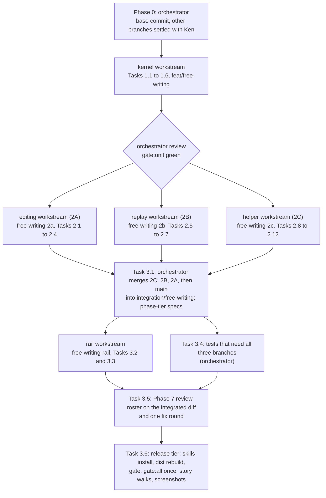

# Plan: Free writing

## Summary

This plan builds free writing in four phases. The work goes to five workstreams, one agent each. The kernel workstream first lays the shared pieces: the record shape, the safe-tag check, and the agent's instructions. Three workstreams then run in parallel: editing, replay, and helper. The orchestrator merges their work, has the rail workstream build the cards, runs one review with one fix round, and runs the full gates once at the end. Five design questions wait on Ken (PQ1 to PQ5 under Open Questions). Until he answers, the plan builds their defaults.

The plan builds the architecture's recommended answers: Lahe's own editing code (AQ1, Lahe's code or Tiptap), always checking new blocks on a handled reply (AQ3), and bounding a run record's size (AQ4). [If Ken decides otherwise](#if-ken-decides-otherwise) names the tasks that change.

## How the work is dispatched

**Branches.**

- `feat/free-writing`: Phase 1 builds here. The pull request to `main` opens from it, after Task 3.6 (checkpoint) merges `integration/free-writing` back in.
- `free-writing-2a`, `free-writing-2b`, `free-writing-2c`: the Phase 2 worktrees, branched from `feat/free-writing` after Phase 1.
- `integration/free-writing`: branched from `feat/free-writing`. Task 3.1 (merge) brings in the three Phase 2 branches and `main`.
- `free-writing-rail`: Tasks 3.2 and 3.3 (the rail), in its own worktree, branched from `integration/free-writing` after Task 3.1. Merged back before Task 3.5 (review).
- `free-writing-fix-<builder>`: Task 3.5's fix branches, off `integration/free-writing`.

**Workstreams.** One agent per workstream, not per task. Tasks that share setup or a module stay together; the only splits are where separate ownership lets work run in parallel. The orchestrator owns Phase 0 and Tasks 3.1, 3.4, 3.5, and 3.6 itself.

| Workstream | Tasks | Owns | Branch | Alerts the orchestrator when |
|---|---|---|---|---|
| kernel | 1.1 to 1.6 | every `src/shared/` file it edits, `src/layer/blocks.js`, the contract and every copy, `test/fixtures/free_writing/` | `feat/free-writing` | a shared shape (function signature, field, code) differs from the architecture; any change to `manifest.js` or `review_format.js` |
| editing (2A) | 2.1 to 2.4 | the 2A row of the Phase 2 ownership table | `free-writing-2a` | it needs a change in `src/shared/`, `blocks.js`, `gestures.js`, or `replay.js`; a hotkey fails in one browser; the list of existing Enter specs whose result changes (before going on) |
| replay (2B) | 2.5 to 2.7 | the 2B row | `free-writing-2b` | a fixture does not match what the architecture says typing produces; it needs `editing.js`, `anchor.js`, `sync.js`, or `src/shared/` |
| helper (2C) | 2.8 to 2.12 | the 2C row | `free-writing-2c` | it needs `replay.js`, `editing.js`, or the contract text; a path rule for `lahe write` cannot be met as written |
| rail | 3.2 and 3.3 | `tab_edits.js`, `tab_done.js`, `overlay.js`, `edits_tab.spec.js`, `agent_replies.spec.js`, `block_changes.test.js` | `free-writing-rail` | it needs a change in any Phase 2 file or `src/shared/`; a pinned word does not fit the card |

If the editing agent runs long, the orchestrator may hand Tasks 2.2 to 2.4 to a fresh agent in the same worktree; that is still one workstream.

**Builder prompts.** Each prompt names the workstream's task numbers and only the brief and architecture sections those tasks list under "Architecture sections", not whole documents. It also names the repo docs a builder reads first (`CLAUDE.md` "Running the loop"). Each agent writes `progress/phaseN_workstream_[shortname].md`, for example `progress/phase2_workstream_editing.md`. The file records what was built, tests added, targeted commands and their results, whether a full suite ran (it should not), duration, deviations, and `## Cleanup needed`.

### Test scope

Repo `CLAUDE.md` rules win where the forge's generic text differs. Here the builder's tests are `npm run gate:unit` plus named Playwright specs.

- **Task tier (each workstream).** `gate:unit`, plus the named browser specs for its own change, by name. No full browser suite. No rerun of a suite whose code did not change just because a new agent or worktree started. Rerun only the spec the latest change touched.
- **Phase tier (orchestrator, after a batch merges).** After Task 3.1, and again after the rail merges, run the affected browser specs once, by name: every new free-writing spec plus the existing specs on 2A's agreed Enter list and the old-record specs. Per `st-merge`, also rerun a file's tests after any merge where both sides changed that file, clean merges included.
- **Release tier (orchestrator, Task 3.6).** Only after implementation and every review fix are integrated: dist rebuild, `npm run gate`, `npm run gate:all`, once each. Readiness reuses that result if no code changed after it. Any code change after it means another full run. Each fix in between gets its targeted regression test.
- **Before a large batch of tests,** the writer maps each test to a behavior or acceptance line and checks for duplicates. There is no raw cap on the test count.

**Who owns the joins between builders.** The orchestrator owns every merge and every test that needs more than one branch.

- **2A capture feeding 2B replay.** Phase 1's run fixtures in `record_fixtures.js` are the agreed shape between them. 2A's capture spec deep-equals every fixture typing can produce; 2B builds only against the fixtures. Both use `blocks.runElementsFor`. Task 3.4 (tests that need all three branches) then types, rebuilds, and replays real runs.
- **2C's handled check reading what 2A records.** 2C builds against the same fixtures. Task 3.4 sends real captured records, read back from `review.json`, through the handled check.
- **The Phase 1 contract matching what 2B and 2C do.** Task 3.4's scripted agent places runs from `review.json` alone, and its result must pass both the page check (2B) and the handled check (2C).

**Rules every builder follows.** Repo `CLAUDE.md` ("Running the gate" and "Running the loop") holds the general rules: `gate:unit` and single named specs only, no `dist/` commits, no file removals, a commit and report per task, and ask instead of documenting around a limit. For this feature also:

- 2A runs each of its own spec files once in Firefox and once in WebKit before handoff, with `--project=firefox` and `--project=webkit`.
- A hotkey that fails in one browser goes to the orchestrator, who edits `gestures.js`.
- Walks and scripts:
  - take the checkout path from `LAHE_REPO` or their own location, never a home path
  - run `node <checkout>/bin/lahe.js`, never the `lahe` on PATH, with their own state folder and helper port
  - never restart or touch Ken's shared helper
  - never write into the repo; output goes under `testInfo.outputPath()` or the scratchpad
- Edit `skills/lahe/SKILL.md`, but never run `npm run install-skills`. The orchestrator runs it once, in Task 3.6 (checkpoint).
- **The design standard.** Each new piece of screen names the existing piece it copies:
  - the edit frame and bar in `src/layer/editing.js` (`FRAME_STYLE`, `buildBar`): the accent `#3c56a5` and its dark twin `#93a7ea`, the label and hint constants, the 120ms opacity transition
  - the "More actions" menu in `src/layer/overlay.js`: `role=menu`, `aria-haspopup`, `aria-expanded`, arrow keys, focus returned on close
  - the `cardact` buttons at equal weight on the conflict card in `src/layer/replay.js`
  - the question treatment in `src/layer/tab_done.js`
  - the scheme sampled from the page (`data-lahe-scheme` in `highlight.js`), never new colors
  - `vendor/stclair-doc-style/` for how a Markdown page draws its own headings and lists
- **Screenshots.** Light on the page the task names. Dark on Task 1.1's dark fixture page, because the layer takes its scheme from the page's background and the Markdown style has no dark mode.

**Spike evidence builders may reuse.** Task 1.1 (markers and test seeds) copies and cleans these into `test/fixtures/free_writing/`. Until then they live under `/private/tmp/claude-501/-Users-kennethstclair-Documents-workspace-live-agentic-html-editor/e688975e-9b6e-47aa-a105-b07bed66b7d5/scratchpad/`:

- `host_spike/fixtures/blog.html`: a styled blog page.
- `host_spike/fixtures/md_render.html` and `host_spike/fixtures/doc.md`: a real Lahe Markdown render, with `sheet-head` and the "Section N" label, and its source.
- `host_spike/spike_lib.js`: the chosen host (editable parent plus `beforeinput` guard, `h5Guard`), and the code that measured spacing and type. Reference for Tasks 2.1 and 2.2 (editing host, block types), not code to paste.
- `host_spike/run_host_spike.js` and `host_spike/matrix.txt`: the five-host check list, three browsers.
- `r14_repro/repro.js`, `r14_repro/repro_lib.js`, `r14_repro/probe_reload.js`: the script that reproduces the three R14 bugs (the lone paragraph, the doubled header line, and bold two words) on a real `lahe review post.md`.
- `r14_repro/out/results-all.json`: what each case did before the fix.
- The same script re-run on main at 2b6eb96, under `/private/tmp/claude-501/-Users-kennethstclair-Documents-workspace-live-agentic-html-editor/234088e7-1201-4ed5-93c2-cee1b5ec5b8c/scratchpad/r14_main/out/` (`results-1.json`, `results-2.json`, `results-3.json`). The lone paragraph with bold in the first paragraph now keeps its bold. Bold in the second paragraph, the doubled header line, and bold two words behave as before. `body_math.py` beside that folder computes the size figures in architecture AQ4.
- `tiptap_spike/fixtures/blog.html`: only needed if AQ1 (Lahe's code or Tiptap) goes the other way.

### Numbers this plan sets

Each lives as a named constant in the file shown.

| Constant | Value | Where |
|---|---|---|
| `PROOFREAD_MIN_WORDS` (proofreading threshold, brief R11) | 150. A run proofreads when `run_words` is more than this. | `src/shared/review_format.js` |
| `NEW_BLOCKS_MAX` (block count ceiling) | 400 blocks per record | `src/shared/record.js` |
| `NEW_BLOCKS_MAX_BYTES` (size ceiling) | 200000 UTF-8 bytes of cleaned block html per record | `src/shared/record.js` |
| `RUN_HISTORY_KEEP` (history entries that keep their run and markup) | 3 | `src/shared/record.js` |
| `RUN_RECORD_MAX_BYTES` (whole run record as JSON, AQ4 default) | 4194304, half the helper's `MAX_BODY_BYTES`, leaving room for the event around the record | `src/shared/record.js` |
| Ceiling warning on the bar | at 90 percent of any of the three ceilings; at 100 percent the layer refuses input that grows the run | `src/layer/editing.js` |
| `FLUSH.RUN_DRAFT_FLOOR_MS` (draft floor for run records) | 30000 | `src/shared/protocol.js` |
| `SHORT_BLOCK_WORDS` (the five-word line in the presence table) | 5 | `src/shared/normalize.js` |
| `RUN_WALK_SLACK` (leaves past the run's length where the walk stops) | 2 | `src/shared/normalize.js` |
| `SESSION_HISTORY_MAX` (session undo steps kept, changed blocks only) | 100 | `src/layer/editing.js` |
| `TYPING_BURST_IDLE_MS` (pause that ends a typing burst) | 1000 | `src/layer/editing.js` |

### Block-type hotkeys

- Chords match on `event.code`, so the characters Option or Shift make on a layout never matter.
- No chord uses Ctrl-Alt. On Windows and Linux AltGr sends Ctrl-Alt, and AltGr with a digit types `{`, `]`, or `²` on German and Polish layouts. The matcher never fires while `AltGraph` is on.
- The chords skip 1, because Cmd-Shift-1 (Ctrl-Shift-1) opens Lahe's rail. Cmd-Shift-3 and 4 are macOS screenshot keys.
- The digit is the heading's level on the page.

| Block | Menu label | macOS | Windows and Linux | Markdown shortcut |
|---|---|---|---|---|
| p | Paragraph | Cmd-Option-0 | Ctrl-Shift-0 | none |
| h2 | Heading | Cmd-Option-2 | Ctrl-Shift-2 | `## ` (and `# `) |
| h3 | Subheading | Cmd-Option-3 | Ctrl-Shift-3 | `### ` |
| h4 | Small heading | Cmd-Option-4 | Ctrl-Shift-4 | `#### ` |
| ul | Bulleted list | Cmd-Shift-8 | Ctrl-Shift-8 | `- ` or `* ` |
| ol | Numbered list | Cmd-Shift-7 | Ctrl-Shift-7 | `1. ` |

Each menu row shows its chord for the reviewer's system and its Markdown shortcut, read from the one matcher in `gestures.js`.

The heading shortcuts use Markdown's own levels, so `## ` makes the h2 that `##` means in the source. `# ` makes h2 too, because the body has no h1: the page title is the h1. The flow walk found the first cut one level off (`## ` made h3).

### Words this plan pins

One spelling each, used exactly in every phase. Words in braces are filled in by code.

| Where | Text |
|---|---|
| Bar label, every edit (PQ2 default: what the bar says) | "Editing" |
| Bar hint, edit state with no block open | "Click + Write here to add text. Esc to finish." |
| The insertion line | "+ Write here" |
| Placeholder in an empty new block | "Start writing" |
| Bar, at 90 percent of a ceiling | "This edit is getting long. Press Esc to send it. Once the agent places it, you can keep writing." |
| Bar, at the ceiling | "This edit is full. Press Esc to send it. Once the agent places it, you can keep writing." |
| Block menu, caret in a block outside the six types | "Other block" |
| Screen reader, session starts | "Writing after: {first words of the anchor}" or "Writing at the start of the page" |
| Screen reader, block type changes | "{menu label}" |
| Screen reader, commit | "Sent to the agent" |
| Card and edits row, first line | "New text after '{first words of the anchor}'", or "Edit of '{first words}' plus new text" when the anchor changed too, or "New text at the start of the page" |
| Card and edits row, second line | the run's shape by count, for example "A heading, 'What the chat window cost me', then 2 paragraphs and a 3-item list." |
| Conflict card, run record | "Your {n} new blocks are on the page after this {type}. Either answer keeps them." While a block clashes with the page's words, the blocks wait: "Your {n} new blocks after this {type} are waiting on this choice. Either answer keeps them." |
| Conflict card note, the anchor changed on the page | "The page's {type} changed after you edited it, so Lahe did not write your version over it. Your new text is kept." |
| Conflict card note, a new block with words the reviewer did not write | "On the page, your new {type} has words you did not write. Lahe changed nothing. Pick the version that stands." |
| Card line, page check found a run block missing or changed | "A block you wrote is not on the page as you wrote it. The item is open again." |
| Agent note, page check found a run block missing or changed (`PAGE_CHECK_RUN_NOTE`) | "Reopened by the page check: a block in new_blocks is not on the page as written. Put it in the source as written, or reply not_handled saying why." |
| Conflict card, second button on a run record | "Take the page's, keep my new text" |
| Card note, wrong tag (`REPLAY_RUN_WRONG_TAG`) | "The agent placed '{first words}' as a {type}. You wrote a {type}, so Lahe sent it back." |
| Card note, placed elsewhere (`REPLAY_RUN_PLACED_ELSEWHERE`) | "'{first words}' is already further down the page, so Lahe did not add it again." |
| Card, helper refused the event (`RUN_EVENT_REFUSED`) | "The helper refused this edit, so the agent has not seen it. Your words are still on this page." |
| Agent note, wrong tag (`PAGE_CHECK_TAG_NOTE`) | "Reopened by the page check: a block landed with a different tag from the one in new_blocks or anchor_tag_after. Give it that tag in the source, or reply not_handled saying why." |
| Proofreading buttons (PQ5 default: the button names) | "Use the fixes" posts "Use the fixes you listed. Change nothing else." "Keep mine" posts "Keep mine as written. No changes." |
| Card after either answer | "Waiting on the agent" |
| Empty rail, both tabs, page with no content blocks | "Nothing written yet" / "Start typing. Your notes go to {file}." / "Each time you stop writing, everything you wrote in that sitting becomes one card here, and the agent places it in the file." / "The agent only places your words. It organizes the notes when you ask it to." On a page with no marked file-name title, the second line is "Start typing." |

### Where the build differs from the approved wireframe

- The dashed "sent, not yet placed" rule is cut. After commit, new text gets the usual changed-text wash (`highlight.js`).
- The block menu has a sixth row, "Small heading", so every type has all three ways in.
- Four more differences wait on Ken, under Open Questions:
  - PQ1: a blank notes page opens ready to type
  - PQ2: the bar says "Editing" for every edit
  - PQ4: after a reviewer's reload, the session does not reopen on its own
  - PQ5: the proofreading buttons read "Use the fixes" and "Keep mine"

## Phase 0: Before any builder starts

The orchestrator alone.

1. Record the base commit of `main` on the progress page, and create `feat/free-writing` from it. The base is 2b6eb96 or later.
2. The branches that edited this feature's files have landed on `main`, and the docs were checked against them (each doc's Main Drift table):
   - `piece-keeps-formatting`: `replay.js`, `normalize.js`. It fixed board row `LAHE-lone-paragraph-loses-markup` for today's record shape. The row is still open on the board; close it, naming the merge (e46c1ec). This feature keeps a regression test and owns the later-paragraph case.
   - `refused-reword-floor`: `editing.js`, `projection.js`, `lifecycle.js`.
   - `quiet-tab-polling`: `sync.js`, `protocol.js`, `reviews.js`, `routes.js`.
   - `handled-check-per-edit`: `handled_check.js`, the contract, the skill.
   - `oversized-records`: `anchor.js`, `highlight.js`, `replay.js`, `normalize.js`, `record.js`, `review_format.js`.
   - `trim-the-drain`: `status.js`, the contract, the skill.
   - `hidden-files-plain`: `static_servers.js`.

   Check for any other open branch whose diff touches a file this plan owns, and land it or agree with Ken how it folds in. No builder touches another branch's work.
3. Check the spike seeds are still under `/private/tmp`. Task 1.1 (markers and test seeds) is dispatched first, so they move into the repo before anything else.

**Acceptance:** the progress page names the base commit and what happened to each branch and the board row.

## Phase 1: Shared kernel

One builder, alone, on `feat/free-writing`. Phase 2 starts only after the orchestrator has reviewed this phase and `gate:unit` is green. After Phase 1, no Phase 2 builder edits any `src/shared/` file. So everything Phase 2 needs there lands now, and the orchestrator reviews every change to `manifest.js` and `review_format.js`.

::: xref
[Architecture: Data / State Changes](02_architecture_free_writing.html#data-state-changes) · [Security & Privacy Notes](02_architecture_free_writing.html#security-privacy-notes) · [Contract changes](02_architecture_free_writing.html#contract-changes) · [Rollout and old agents](02_architecture_free_writing.html#rollout-and-old-agents)
:::

### Task 1.1: Markers and test seeds

**Spec:** First, add to `markers.js` the one spelling of the file-name title's chrome marker, and of the attribute the layer sets on the editing host.

Then copy the spike fixtures and the script that reproduces the three R14 bugs (the lone paragraph, the doubled header line, and bold two words) into `test/fixtures/free_writing/`. Clean them so they run the same way every time: no home paths, no sleeps (waits use `test/helpers/poll.js`), no output beside the script, their own helper. Port the script's steps onto `test/helpers` (`service.js`, `poll.js`). Keep `repro.js` as a reference file only.

Add these fixtures:
- an empty-notes render: an empty `.md` rendered by today's `markdown.js`, with the marker added by hand
- a page with a dark background, for every dark screenshot
- a page whose paragraph is a direct child of `body`
- a malformed HTML corpus: a `p` closed by a `div`, an unclosed `li`, a script body holding `
`, template contents, comments
- an engine markup corpus: `b`, `i`, nbsp, a trailing `br`, nested `strong` and `em`, entities, uppercase tags

Write the R14 cases as `free_writing_r14.spec.js`, asserting what the re-run on main recorded:
- bold in the first paragraph, left out by the agent: passes on main. Write it as an ordinary test, so it guards the fix.
- bold in the second paragraph, left out by the agent: the edit goes lost with no flag. Expected failure (`test.fail`).
- the doubled header line, by click and by Esc: expected failure.
- bold two words with an agent that changes nothing: expected failure.

Task 3.4 (tests that need all three branches) removes the marks.

**Files:** `src/shared/markers.js`, `test/fixtures/free_writing/` (new folder, with a `README.md` naming where each file came from), `test/browser/free_writing_r14.spec.js` (new).
**Acceptance:**
- The fixtures open in Playwright with the layer injected.
- `free_writing_r14.spec.js`, run by name, on the Phase 1 base: green, with the first-paragraph case passing and the other three as expected failures.
- The orchestrator's search finds no home path and no sleep under `test/fixtures/free_writing/`.
- Lint's tracked-file `node --check` passes.

### Task 1.2: Block allowlist, reader, and matcher

**Spec:** In `normalize.js`, add `WRITABLE_BLOCK_TAGS`, `SHORT_BLOCK_WORDS`, `RUN_WALK_SLACK`, and four string-based functions, so the helper and the layer run the same code:

- `cleanBlock(tag, html) -> { html } | { code }`. The code is one of Task 1.4's refusal codes.
- `leafBlocks(html) -> [{ tag, html, words }]`, the string reader. `ul` and `ol` are leaves, and their `li` children are lines.
- `matchRun(blocks, leaves) -> [{ index, status, leaves }]`. `status` is `"whole"`, `"joined"`, `"split"`, or `"missing"`, and `leaves` lists the matched leaf indexes. The walk starts at leaf 0 and stops per the architecture's "Where the walk stops", with `blocks.length + RUN_WALK_SLACK` as the limit.
- `runWords(blocks) -> number`, the run's words, skipping `from_anchor` blocks.

`normalize.topLevelBlocks`, which main added for the first-paragraph fix, stays unchanged: replay uses it for old records. `leafBlocks` is a different cut, down to leaf blocks and with tags, and may share its tag parser.

Architecture sections: Security & Privacy Notes ("One allowlist, three places"), Replay after a rebuild ("The walk", "Where the walk stops", and the presence table's first row).
**Files:** `src/shared/normalize.js`, `test/unit/clean_block.test.js` (new), `test/unit/leaf_blocks.test.js` (new).
**Acceptance:**
- `clean_block.test.js`:
  - each is refused: `tag: "script"`, `tag: "iframe"`, the SVG animate href case, ``, `<a href>`, `li` inside a `p` block
  - every attribute is dropped, text is escaped again on output, and elements come only from the allowlist's constants
  - `cleanBlock` is a fixed point on its own output, over every sample in Task 1.1's engine markup corpus
- `leaf_blocks.test.js`:
  - on `md_render.html`, the reader skips the "Section N" label, the marked file-name title, and elements with no text
  - a list is one block whose lines are its items
  - the matcher has one test each for whole, joined, split, and missing, and one showing tag and markup never decide presence
  - negative cases, each missing: a short block whose words sit inside a later unrelated block; blocks out of run order; a block that is only a prefix of a longer leaf; a block past the walk's stop
  - `runWords` counts the run and skips `from_anchor` blocks

### Task 1.3: Layer block helpers (new file)

**Spec:** New `src/layer/blocks.js`, loaded right after `selection.js`, so editing, replay, undo, and protection share one copy of the DOM block rules:

- `leafWalk(root, fromPoint) -> [Element]`: the same rule as `leafBlocks`.
- `insertPointAfter(anchor) -> { parent, before }`: climbs out of chrome such as `sheet-head`.
- `startPointIn(container) -> { parent, before }`: the start of a container, after leading chrome such as the marked title.
- `hostFor(anchor) -> Element`: the parent of the element `insertPointAfter` climbed to, or the container itself for a container anchor.
- `canHoldRun(anchor) -> boolean`: false when the host cannot hold flow content (`td`, `th`, `dt`, `dd`, `figcaption`).
- `runElementsFor(record, doc, anchor) -> { start, blocks: [{ index, status, elements }] }`: the one way to find a record's run on the live page, built on `leafWalk` and `matchRun`. The caller passes the anchor, because `anchor.js` loads after `blocks.js`. For `start_of_container` the anchor is the container and the walk starts at `startPointIn`. For a take-back it matches `remove_blocks`.
- `writeBlock(tag, html) -> Element | null`: runs `cleanBlock` and builds from constants.
- `swapTag(el, tag) -> Element | null`: checks `WRITABLE_BLOCK_TAGS`, and moves every attribute (the `data-lahe-id` stamp included) and every child.

Architecture sections: Components (`blocks.js`), Where "after the anchor" is, The editing host, Empty page and `lahe write`, Changing an existing block's type ("Element swap").
**Files:** `src/layer/blocks.js` (new), `src/shared/manifest.js` (entry for `blocks.js`, plus a `planned: true` entry for `src/cli/commands/write.js` owned by 2C), `test/browser/blocks_kernel.spec.js` (new), `docs/diagrams/module_map.md`.
**Acceptance:** `blocks_kernel.spec.js`, run by name, passes:
- On `md_render.html`, `insertPointAfter` an `h2` returns the point after its `sheet-head`, and `hostFor` that `h2` is its section.
- On the empty-notes fixture, `startPointIn(main)` is after the marked title.
- The DOM walk and the string reader return the same list on every page under `test/fixtures/` and on the malformed corpus. Where they disagree, the reader is fixed, not the fixture.
- `runElementsFor` finds a placed run one-to-one, reports a missing block, and works for a container anchor.
- `canHoldRun` is false in a `td` and a `figcaption`.
- `swapTag` keeps the stamp and the children. `swapTag` and `writeBlock` refuse `script`.

Lint's manifest completeness passes.

### Task 1.4: The record shape, merge, notes, and fixtures

**Spec:** In `record.js`:
- The four optional fields, `from_anchor`, and `remove_blocks`.
- `validateRun(item) -> null | { code }`, for the helper. The codes, in `failures.js`:
  - `RUN_BLOCK_REFUSED`: a block fails `cleanBlock`, or a tag is not writable
  - `RUN_OVER_CEILING`: over `NEW_BLOCKS_MAX` or `NEW_BLOCKS_MAX_BYTES`
  - `RUN_PLACEMENT_REFUSED`: `placement` is not one of the two values
  - `RUN_TAKEBACK_CARRIES_RUN`: a take-back with `new_blocks`
- `NEW_BLOCKS_MAX`, `NEW_BLOCKS_MAX_BYTES`, and `RUN_HISTORY_KEEP`.
- `buildRunAfter(anchorHtml, blocks) -> { after_html, after }`.
- `anchorView(item) -> item`, with `anchor_after_html` as `after_html` and its text as `after`.
- The run change text, with the sentences in the architecture's Change text.
- `bumpRev`: `after_history` entries carry the new fields. For a run record, entries older than the last `RUN_HISTORY_KEEP` drop `new_blocks` and `after_html` and keep `after` (AQ4 default). Other records keep today's history.
- `RUN_RECORD_MAX_BYTES`, and `recordBytes(item)`: the UTF-8 bytes of the record as JSON. `validateRun` refuses a run record over it with `RUN_OVER_CEILING`, the same code as the block ceilings (AQ4 default).
- `revertOf` for a run record: the take-back names the placed blocks in `remove_blocks` and never carries `new_blocks`. Its change text adds "Remove the blocks in remove_blocks from after this {type}; the reviewer undid them."
- `applySuggestions(item, suggestions) -> item | { code }`: the reviewer's reword at a new revision, through `bumpRev`. It replaces words inside text only, so each block keeps its markup, and runs the result through `cleanBlock`. It refuses with `SUGGESTION_NOT_FOUND` when a `from` is not found exactly once in its block's words.
- `PAGE_CHECK_TAG_NOTE`, with the pinned text, added to `PAGE_CHECK_NOTES`, so the agent sees it in `review.json`.

In `failures.js`, also add the card codes `REPLAY_RUN_WRONG_TAG`, `REPLAY_RUN_PLACED_ELSEWHERE`, and `RUN_EVENT_REFUSED`, with the pinned text. The placed-elsewhere note is for the reviewer only and never reaches `review.json`.

In `merge.js`, add the four fields to `CONTENT_FIELDS`.

In `record_fixtures.js`, add run fixtures. Each carries the literal `after` string and its exact change sentence, and each run's words hold the token `zqxcanary`:
- the architecture's worked example
- a split tail with no typing, and one with typing
- a tag-only change, and a tag change with new words
- a paragraph turned into a list, and an item added to an existing list
- `start_of_container`
- a record with `after_history` holding an earlier run
- a take-back with `remove_blocks`
- a run whose words hold `<`, `&`, `*`, `_`, backticks, a `#` and a "1." mid-line, straight quotes, and `--`
- one item carrying each new note
- an old-shape record with nested blocks and no `new_blocks`
- a proofread `question` reply with suggestions
- one forged record per refusal code

Architecture sections: Data / State Changes (all of it), The page check on a run, The proofreading reply.
**Files:** `src/shared/record.js`, `src/shared/merge.js`, `src/shared/record_fixtures.js`, `src/shared/failures.js`, `test/unit/run_record.test.js` (new), `test/unit/merge_run.test.js` (new).
**Acceptance:**
- `run_record.test.js`:
  - every valid fixture passes validation, and every forged one is refused with its code
  - `after` equals the literal string written in each fixture
  - `change` equals the exact sentence in each fixture, and never contains `zqxcanary`
  - a split with no typing has no "Added" sentence
  - over either ceiling is refused, including a run of three-byte characters under the block count and over the byte count
  - a take-back of a handled run lists the blocks in `remove_blocks` and has no `new_blocks`
  - the anchor view of a run record carries `anchor_after_html` as its `after_html`
  - history entries older than `RUN_HISTORY_KEEP` have no `new_blocks` and no `after_html`, and keep `after`
  - a run record over `RUN_RECORD_MAX_BYTES` is refused with `RUN_OVER_CEILING`, even when its run is under both block ceilings
  - `applySuggestions` changes the words, keeps a block's bold, and bumps the revision; it refuses a `from` found twice or not at all
- `merge_run.test.js`, at the same revision while the browser's work is unacknowledged:
  - the browser's longer run wins
  - the browser's shorter run also wins
  - a later helper revision wins over an acknowledged browser copy

### Task 1.5: Wire constants, the reply shape, and gestures

**Spec:** In `protocol.js`:
- `SERVICE_CONTRACT` goes to 14. Add `FLUSH.RUN_DRAFT_FLOOR_MS`.
- `REPLY_FIELD` gains `PROOFREAD` (`"proofread"`) and `SUGGESTIONS` (`"suggestions"`). The reply parser accepts them only on a `question`, and checks each suggestion: `block` a whole number from 0, `from` a non-empty string, `to` a string.
- The create-review body accepts `notes: true`, the same way it accepts `only_recorded_pages`.

In `gestures.js`, add every new decision 2A needs, so Phase 2 never edits this file:
- the block-type chord matcher from the hotkey table
- Enter at the end of a block makes a sibling; Enter mid-block splits; Enter in an empty last item ends the list
- Backspace and Delete across a block edge
- Cmd-Z and Shift-Cmd-Z inside a session
- Cmd-Shift-E with the caret in no block enters edit state with no block open, a new outcome of `gestureFor`
- Esc with the block menu open closes only the menu; otherwise Esc commits any open session and leaves edit state
- the hint row for edit state with no block open, with the pinned text

Architecture sections: Rollout and old agents ("Helper version"), Block types while writing, The proofreading reply.
**Files:** `src/shared/protocol.js`, `src/shared/gestures.js`, `test/unit/protocol_wire.test.js`, `test/unit/regions_gestures.test.js`.
**Acceptance:**
- `regions_gestures.test.js`:
  - each chord maps to its tag by `event.code`, on macOS and on the other systems
  - a macOS event with code `Digit2` and key `™` matches
  - an event with `AltGraph` on never matches, and neither does Ctrl-Alt with a digit on Windows
  - no chord collides with Cmd-Shift-E, Cmd-Shift-C, Cmd-Shift-X, Cmd-Shift-1, or Cmd-Shift-3, 4, and 5 on macOS
  - one case per new decision and hint row
- `protocol_wire.test.js`:
  - the version check the CLI and the layer use refuses a helper on contract version 13 and accepts 14
  - the reply parser accepts a proofread question with suggestions, and refuses suggestions on `handled` and suggestions of the wrong shape

### Task 1.6: Projection and the contract, with every copy

**Spec:** In `review_format.js`:
- Project the four fields, `remove_blocks`, and each block's derived words. For a run record, `new_blocks`, `after_full`, and `after_html` are not cut at the 2000-character bound.
- Project `run_words` (from `normalize.runWords`), `proofread` (per the architecture's Projection), and the review-level `notes`.
- Add `new_blocks`, `anchor_after_html`, and `remove_blocks` to `DATA_FIELDS` and class them as data. On main, `DATA_FIELDS` also decides what the drain groups under `page` (`status.drainLine`), so this one change moves them there with no change to `status.js`.
- Class `anchor_tag_after`, `placement`, `run_words`, and `proofread` in `PROJECTED_FIELD_CLASS` as data. They stay at the top level of a drain line as markers. `notes` is review-level and is not added to item lines.
- Add `PROOFREAD_MIN_WORDS`.
- Projected `after_history` entries do not carry `new_blocks`. The agent needs only the current run, and replay reads history from the browser store.
- The text formatter (`renderText`, which copy and export both use) shows the anchor change and then the new blocks by type.
- Write every line under the architecture's Contract changes. Each rule is said once, in the contract; no rule text goes on an item (main's drain rule since trim-the-drain).
- Add one sentence for AQ3 (always check new blocks on a handled reply) after main's handled-check line, which says an agent that changed the passage is not second-guessed: new_blocks has no old passage, so each block's words are checked against the built page on every handled reply.
- The proofreading line names the two pinned button texts and what each posts.

Then update every copy in this one task:
- `skills/lahe/SKILL.md` (edit only; the orchestrator installs it in Task 3.6, checkpoint), including its "A handled reply is checked" section for AQ3
- the restated copy in `test/unit/review_format.test.js`
- the restated copy in `docs/CONTRACTS.md`, plus its record and `review.json` sections, and the list of page-text fields in its `lahe status` section

**Files:** `src/shared/review_format.js`, `skills/lahe/SKILL.md`, `test/unit/review_format.test.js`, `test/unit/projection_review_json.test.js`, `test/unit/status_command.test.js`, `docs/CONTRACTS.md`.
**Acceptance:**
- `review_format.test.js`:
  - asserts the new contract lines word for word, and the restated copy matches
  - `renderText` shows a run as "Heading: ...", "Paragraph: ...", "Bulleted list: ..."
- `projection_review_json.test.js`:
  - a run over 2000 characters is projected whole in `new_blocks`, `after_full`, and `after_html`
  - the field classes are right, and a projected history entry has no `new_blocks`
  - `run_words` of 150 gives `proofread: false`, and 151 gives true
  - a run over 150 words only because of `from_anchor` blocks gives false
  - a notes review gives false
- `status_command.test.js`: on a drain line, a run item's `new_blocks`, `anchor_after_html`, and `remove_blocks` sit under `page`; `placement` and `proofread` stay at the top level; no item line carries `notes`.
- `docs/CONTRACTS.md` and the skill hold the same contract text as `review_format.js`.

**Phase test:** `npm run gate:unit` green. `blocks_kernel.spec.js` green by name. `free_writing_r14.spec.js` green with its three expected failures. The orchestrator reads the contract text against the architecture's Contract changes, line by line, then merges Phase 1 into `feat/free-writing` and branches the three worktrees from it.

## Phase 2: Three builders in parallel

Each builder works in its own worktree, branched from `feat/free-writing` after Phase 1. File ownership does not overlap:

| Builder | Owns | Creates |
|---|---|---|
| 2A layer editing (`free-writing-2a`) | `src/layer/editing.js`, `src/layer/protect.js`, `src/layer/anchor.js`, `src/layer/highlight.js` (the one focus-ring rule), `scripts/measure_draft_write_cost.js`, `docs/diagrams/protected_region.md`, `docs/diagrams/finding_the_region.md`, `test/unit/anchor_cases.test.js`, `test/unit/anchor_engine.test.js`, `test/unit/protect_vocabulary.test.js`, and the existing specs whose Enter result changes (Task 2.1 lists them) | `test/browser/free_writing_host.spec.js`, `_capture`, `_types`, `_empty`, `_undo`, `_repaint`; `test/unit/editing_run.test.js` |
| 2B replay (`free-writing-2b`) | `src/layer/replay.js`, `docs/diagrams/replay_branches.md` | `test/browser/replay_run_anchor.spec.js`, `_insert`, `_check`; `test/browser/replay_old_records.spec.js`; `test/unit/replay_run.test.js` |
| 2C helper and CLI (`free-writing-2c`) | `src/service/log.js`, `src/service/handled_check.js`, `src/service/markdown.js`, `src/service/static_servers.js`, `src/service/routes.js`, `src/service/reviews.js`, `src/layer/sync.js`, `src/cli/index.js`, `src/cli/commands/review.js`, `src/cli/commands/add.js`, `src/cli/commands/reply.js`, `src/cli/commands/write.js`, `docs/CLI.md`, `docs/diagrams/module_map.md` (the `write` entry), the `lahe write` scenario in `skills/lahe/SKILL.md`, `test/unit/draft_flush_cadence.test.js`, `test/unit/cli_dispatch.test.js`, `test/unit/markdown_render.test.js` | `test/unit/write_command.test.js`, `test/unit/handled_check_run.test.js`, `test/unit/log_run.test.js`, `test/unit/reply_proofread.test.js` |

**Nobody in Phase 2 touches:**
- any `src/shared/` file
- `src/layer/blocks.js`
- `src/layer/tab_*.js`, `src/layer/overlay.js`, `src/layer/index.js`
- `dist/`
- another builder's files, or another branch's work

A builder who needs a change there asks the orchestrator.

::: xref
[Architecture: Key Flows](02_architecture_free_writing.html#key-flows) · [Failure Modes / Edge Cases](02_architecture_free_writing.html#failure-modes-edge-cases) · [Test Strategy](02_architecture_free_writing.html#test-strategy)
:::

### Task 2.1 (2A): The editing host and the session

**Spec:** First, find every existing spec that presses Enter or Shift-Enter inside an open edit. `paragraph_break.spec.js`, `no_duplicate_text.spec.js` (its append helpers), and `split_not_conflict.spec.js` are known. List each on the progress page with its new expected result; the rest must pass unchanged. The orchestrator agrees to the list before 2A goes on.

Then build the host and the session, per the architecture's The editing host:
- The host is `blocks.hostFor(anchor)`, made editable with the attribute from `markers.js`, with the `beforeinput` guard.
- A run is offered only where `blocks.canHoldRun` is true.
- The layer writes each of these itself:
  - Enter at the end of a block, making a sibling `p` at `blocks.insertPointAfter`
  - Enter mid-block, splitting the block and marking the tail `from_anchor`
  - Backspace and Delete across a block edge
  - typing over a selection that spans blocks
  - cut across blocks, handled like a spanning delete
  - plain-text paste; a drop is inserted the same way
- A click or an arrow key out of the session ends it. IME composition inside a session block is allowed.
- The focus ring: the one rule in `highlight.js`, scoped to the host attribute. The frame is drawn whenever a session is open, including around an empty new block.
- The frame wraps every block the sitting created or changed, plus the caret's block. An untouched anchor stays outside it. The frame follows new blocks without animating its size.
- Capture builds the record through `record.js` and `cleanBlock`, rebuilding only the caret's block.
- `kindFor` counts the run and the tag. `itemFor` maps any run block back to its outstanding record through `blocks.runElementsFor`. Once the record is handled, a sitting on its blocks starts a new record.
- Reopening a pre-feature record keeps today's session and break rule.
- A polite live region in the layer's shadow root announces the session start, each block type change, and the commit, with the pinned words. It is a new component: the rail's toasts are for agent replies.
- Extend `scripts/measure_draft_write_cost.js` with a session that types a 5,000-word run.

Architecture sections: The editing host, Block types while writing (Enter, Shift-Enter, Paste), Two sittings in the same place, Rollout ("Old records"), Data / State Changes ("Draft growth").
**Files:** `src/layer/editing.js`, `src/layer/highlight.js`, `scripts/measure_draft_write_cost.js`, `test/unit/editing_run.test.js`, `test/browser/free_writing_host.spec.js`, `test/browser/free_writing_capture.spec.js`, and the existing specs on the agreed list.
**Acceptance:**
- `free_writing_capture.spec.js` types every fixture that typing can produce and deep-equals its fields, tags, and markup, ignoring ids and times: the worked example after a paragraph on `blog.html`, a split tail with and without typing, a tag-only change, a tag change with new words, a paragraph turned into a list, a list append, and `start_of_container`.
- `free_writing_host.spec.js`:
  - Backspace at the start of the first run block merges into the anchor, and Delete at the anchor's end merges the first run block
  - arrow and Shift-arrow cross between the anchor and the run
  - for each of these, every page block outside the session keeps its `outerHTML`: Cmd-A then type; Cmd-A then Backspace; ArrowDown out of the run then type; Cmd-B and Cmd-Z in that block; a drop; a cut across the session's edge; a composition started outside
  - a spanning selection overwritten leaves no inline style spans
  - a paste of formatted HTML arrives as plain paragraphs. Chromium uses a real Meta+V; the spec names what stands in for it in Firefox and WebKit
  - IME composition inside a run block commits its text
  - a click, and an arrow key, into a page block outside the session end it
  - a split with no typing gives a `from_anchor` tail and no "Added" change text
  - an empty last list item is dropped at capture
  - Cmd-Shift-E on a run block of an outstanding record reopens that record; after the record is handled, a sitting there starts a new record
  - Enter at the end of a `td` does not start a run
  - on the page whose paragraph is a direct child of `body`, the rail works and takes no edits
  - the live region says each pinned line
  - reopening a pre-feature multi-paragraph record keeps today's behavior
- The draft-cost script, on the 5,000-word run, shows one browser-storage write per keystroke and capture limited to the caret's block. Numbers go on the progress page.
- Screenshot, light and dark, in all three browsers: the frame around an anchor plus a two-block run on `md_render.html`, with no page focus ring.

### Task 2.2 (2A): Block types, the bar menu, hotkeys, lists, and the ceiling

**Spec:**
- **The menu** sits on the bar before B and I, built from the "More actions" menu in `overlay.js`. Six rows, each showing its chord and Markdown shortcut. Esc with the menu open closes only the menu, and focus returns to the caret. The menu opens upward when there is no room below. On a narrow window the bar drops its hint first.
- **One function per block type**, called by the menu, the hotkeys, and the Markdown shortcuts. A shortcut works only at the start of a block; "# " typed mid-line stays text.
- **A block outside the six types** (a blockquote, the page's `h1`, an `h5`, a `pre`, a table cell, a figcaption): the menu button reads "Other block" and is disabled, and the hotkeys and shortcuts do nothing.
- **Changing the anchor's type** uses `blocks.swapTag` and sets `anchor_tag_after`. The ladder's tag tie-breaker accepts either tag.
- **An existing list** follows the architecture's Adding to an existing list.
- **The ceiling:** the pinned warning at 90 percent of any of the three ceilings. At the ceiling, input that would grow the run is refused, with the pinned at-the-ceiling line. For `RUN_RECORD_MAX_BYTES`, the record's size apart from the run is measured once when the session opens, since history does not change during a sitting, and the run's bytes are added as they are already counted. Nothing extra runs per keystroke.

Architecture sections: Block types while writing, Adding to an existing list, Changing an existing block's type, Data / State Changes ("Size ceiling").
**Files:** `src/layer/editing.js`, `src/layer/anchor.js`, `test/browser/free_writing_types.spec.js`, `test/unit/anchor_cases.test.js`.
**Acceptance:**
- `free_writing_types.spec.js`:
  - each type can be made by every route the hotkey table gives it, in new text and in an existing block
  - the menu names the caret's block; in a blockquote it reads "Other block", is disabled, and the hotkeys do nothing
  - from the keyboard, the menu rows show their chord and shortcut, arrows move between rows, and Esc closes only the menu with focus back at the caret
  - "# " typed mid-paragraph stays text
  - a paragraph turned into a header commits as `format_only` with `anchor_tag_after: "h2"`
  - Enter at the end of an existing bullet adds an `li` to `anchor_after_html`
  - on an existing list, Numbered list swaps the whole list, Paragraph on the last item ends it, and Heading is disabled on a middle item
  - a run at 90 percent shows the warning; at the ceiling, one more block is refused, the bar says why, and the record is never over the ceiling
  - computed styles on `blog.html` and `md_render.html`: a new block of each tag matches the page's own in margin-top, margin-bottom, font-size, line-height, font-weight, and the gap to the next block, except a new `h2`'s missing section rule. Reuse the spike's measuring code.
- `anchor_cases.test.js`: the ladder finds a block by its saved tag and by `anchor_tag_after`.
- Screenshots, light and dark:
  - the bar with the menu closed, and open
  - a new heading while writing on `md_render.html`, showing the page's `h2` style without the section rule
  - the ceiling warning
  - the bar on a narrow window

### Task 2.3 (2A): Starting in empty space and the empty page

**Spec:**
- **The line.** While any edit is open, hovering between two blocks or below the last shows "+ Write here". It stops at the rail's edge, using the berth `highlight.js` publishes. It fades in with the frame's opacity transition, and shows at once under reduced motion.
- **Clicking the line** commits any open session and opens a new one anchored on the block above, with an empty first `p`. The placeholder "Start writing" is drawn in the layer's shadow root over the empty block, never in the page, and goes on the first keystroke.
- **Cmd-Shift-E with the caret in no block** enters edit state with no block open. The bar shows near the top of the viewport with its label and the pinned hint, and hides the menu, B, I, and Delete block. A click on a block opens that block. Esc, or a click on the rail, leaves.
- **The empty-container rung** in `anchor.js`, per the architecture's Empty page section.
- **The empty page** opens with a session ready in an empty paragraph after the title (PQ1 default: the page opens ready to type).
- Update `finding_the_region.md` for the new rung.

Architecture sections: Block types while writing ("Starting in empty space"), Empty page and `lahe write`.
**Files:** `src/layer/editing.js`, `src/layer/anchor.js`, `test/browser/free_writing_empty.spec.js`, `test/unit/anchor_engine.test.js`, `docs/diagrams/finding_the_region.md`.
**Acceptance:**
- `free_writing_empty.spec.js`:
  - with the caret in a paragraph, Cmd-Shift-E, then hover a gap: the line shows and stops at the rail's edge. Clicking it commits that session and starts a new one after the right block
  - Cmd-Shift-E with the caret in no block shows the bar and its hint; Esc leaves
  - the placeholder is never in the page's DOM or in the record
  - the empty-notes fixture opens with a session ready, and the first sitting commits with `placement: start_of_container`, anchored on `main`, not on the marked title
  - a second sitting before the agent places the first continues the same record at a new revision
  - after the first record is handled, the next sitting is `after_anchor` on the last block
- `anchor_engine.test.js`:
  - the rung resolves a `start_of_container` record on an empty page and on a page that now has content, and is not marked lost
  - an `after_anchor` record whose anchor is gone is LOST on a page with content, and on a page the agent emptied
- Screenshots, light and dark: the line between two blocks on `blog.html`, the empty-notes page ready to type, and edit state with no block open.

### Task 2.4 (2A): Undo and protection

**Spec:**
- **Session undo** per the architecture's Undo inside a session, with `TYPING_BURST_IDLE_MS` and `SESSION_HISTORY_MAX`.
- **After commit**, undo of a run record restores the anchor through `cleanBlock` and `blocks.swapTag`, and removes the run's elements, found with `blocks.runElementsFor`. An unhandled record is withdrawn. A handled record raises the take-back that `record.revertOf` builds.
- **In `protect.js`:** protect and snapshot the anchor plus the run, found with `runElementsFor`. Restore by block position and character offset after the re-found anchor. Set the host attribute again when a repaint replaces the parent. Rebind after a tag swap.

Architecture sections: Undo inside a session, Undo of a committed record, The editing host ("A repaint that replaces the parent"), Failure Modes (repaint and reload rows).
**Files:** `src/layer/editing.js`, `src/layer/protect.js`, `test/browser/free_writing_undo.spec.js`, `test/browser/free_writing_repaint.spec.js`, `test/unit/protect_vocabulary.test.js`, `docs/diagrams/protected_region.md`.
**Acceptance:**
- `free_writing_undo.spec.js`:
  - Cmd-Z right after "1. " gives back the typed characters
  - Cmd-Z walks block changes in order, redo walks them back, and step 101 drops the oldest
  - undo of a committed run the agent has not handled removes the run and restores the anchor, and after two reloads the run is still gone
  - undo of a tag change restores the paragraph
  - undo of a handled run raises a take-back with `remove_blocks` and no `new_blocks`
- `free_writing_repaint.spec.js` (uses `test/fixtures/repainting.html` and `md_render.html`):
  - a repaint mid-sitting keeps every run block and the caret's block and offset
  - a repaint that replaces the parent keeps typing working
- `protected_region.md` shows the run.

**2A's hand-off.** Each 2A task ends with a commit and a short report. If the first agent runs long, the orchestrator may send Tasks 2.2 to 2.4 (block types, empty space, undo) to a fresh agent in the same worktree, still as the editing workstream. Before handoff, 2A runs its six spec files once each in Firefox and WebKit, by name.

**Don't touch (2.1 to 2.4):** `replay.js`, `sync.js`, anything in `src/service/` or `src/cli/`.

### Task 2.5 (2B): Anchor view, the tag leg, and old records

**Spec:** For a run record, every anchor-compare function reads `record.anchorView`, including `pieceMarkup`, which main added and which otherwise cuts the whole sitting's `after_html`. Add the tag leg per the architecture, swapping through `blocks.swapTag`. Records without `new_blocks` keep today's path unchanged.

After 2A merges, `no_duplicate_text.spec.js` and `split_not_conflict.spec.js` make run records when they press Enter, so today's path loses its browser coverage. So add `replay_old_records.spec.js`: each scenario in those two specs and in `replay_branches.spec.js`, injected as an old-shape fixture record with nested blocks and no `new_blocks`. That includes the formatting cases main added to `no_duplicate_text.spec.js`: the missing paragraph keeps its bold, italic, and link, on the ordinary pass and on "Keep mine".

Architecture sections: Data / State Changes (the reader table's replay rows), Changing an existing block's type ("Replay").
**Files:** `src/layer/replay.js`, `test/unit/replay_run.test.js`, `test/browser/replay_run_anchor.spec.js`, `test/browser/replay_old_records.spec.js`.
**Acceptance:**
- `replay_run_anchor.spec.js`, using Phase 1 fixtures injected into the store: after the agent placed the run, a repaint brings the old anchor back. The anchor never comes back holding the run's words.
- A tag-only fixture on a page still showing `p` is swapped to `h2`. Tag-swap tests find the anchor by its stamp, so they do not wait on 2A's ladder change.
- `replay_old_records.spec.js` passes.
- `no_duplicate_text.spec.js`, `split_not_conflict.spec.js`, and `replay_branches.spec.js` pass unchanged, run once before handoff.

### Task 2.6 (2B): The insert path, the take-back, and the held run

**Spec:** After the anchor compare, find the run with `blocks.runElementsFor` (fixture anchors resolved by stamp) and decide each new block by the architecture's presence table, row for row. Inserts go through `blocks.writeBlock`. Also:
- **a container anchor:** no anchor compare, and the walk starts at `blocks.startPointIn`
- **a take-back:** remove each block in `remove_blocks` found one-to-one; never insert; never replay the original run again
- **the anchor in branch four:** hold the run. The conflict card shows the run and the pinned run line. The second button reads "Take the page's, keep my new text".

A wrong tag sets `REPLAY_RUN_WRONG_TAG` on the card. A block found elsewhere sets `REPLAY_RUN_PLACED_ELSEWHERE`. Add `PAGE_CHECK_TAG_NOTE`'s line to `CHECK_NOTICES`. A gone anchor is LOST, with nothing placed.

Architecture sections: Replay after a rebuild (the whole section), Empty page and `lahe write`.
**Files:** `src/layer/replay.js`, `test/unit/replay_run.test.js`, `test/browser/replay_run_insert.spec.js`, `docs/diagrams/replay_branches.md`.
**Acceptance:** `replay_run_insert.spec.js`:
- one test per row of the presence table
- a short block whose words appear further down the page, past the walk's stop, is inserted
- a run with an `h2` on `md_render.html` lands after the `sheet-head`, not inside it
- the `start_of_container` fixture on the empty-notes render lands after the marked title. After the notes are placed and the page reloads, there is no conflict card
- a take-back removes the listed blocks and inserts nothing, and after two reloads they are still gone
- an earlier revision placed, then the current revision reworded: the block is rewritten in place and shows once
- an anchor conflict on a run record: the card shows the run and its count. "Take the page's, keep my new text" keeps the page's anchor and places the run. "Keep mine" applies both
- a forged fixture with `tag: "script"` writes nothing; a record with no anchor on the page goes LOST and inserts nothing

`replay_branches.md` shows the insert path after branches one to three, the container anchor, the take-back, and the held run on branch four. Screenshots, light and dark: a placed run with an `h2` on `md_render.html` after replay, and the conflict card holding a run.

### Task 2.7 (2B): The page check and the R14 cases (bold and italic edits)

**Spec:** For a run record, `pageCheckReasonFor` and `formattingMissingFromPage` follow the architecture's The page check on a run, with the same walk and matcher, and `PAGE_CHECK_TAG_NOTE` for a wrong tag.

Then prove the header case and the lone-paragraph case (the first two R14 bugs) under the new record shape, with Task 1.1's seeds and fixture records. Main already fixed the lone paragraph when the left-out one is the first; here it is a regression test. The left-out later paragraph, which main still loses, is this task's fix.

Architecture sections: The page check on a run, Analysis of Existing Structure ("Root cause of two open bugs"), Failure Modes (last row).
**Files:** `src/layer/replay.js`, `test/browser/replay_run_check.spec.js`.
**Acceptance:** `replay_run_check.spec.js`:
- a handled run with an `h2` on `md_render.html` is not reopened
- a handled run whose paragraph lost its bold is reopened with the formatting note
- a header placed as a paragraph is reopened with the tag note, not the formatting note
- a missing block is reopened as undone
- the header case, as a run record: the line shows once, below the `sheet-head`
- the lone paragraph: bold in the first paragraph and in the second, and the agent leaves out the bold one. The item reopens, and the bold paragraph shows once, with its bold

**Don't touch (2.5 to 2.7):** `editing.js`, `protect.js`, `anchor.js`, `sync.js`, anything in `src/service/` or `src/cli/`.

### Task 2.8 (2C): Helper enforcement, the draft floor, and refused events

**Spec:** On append, `log.js` runs `record.validateRun` and refuses a failing event with its code. `sync.js` holds drafts of run records to `FLUSH.RUN_DRAFT_FLOOR_MS`. The keystroke that withdraws a reopened `ready` or `not_handled` record still posts at once, as main does since refused-reword-floor. `sync.js` also reads `rejected` for the run codes, stops re-posting that event, and raises `RUN_EVENT_REFUSED` on the item; Task 3.2 (edits tab and card) draws it. `sync.js` was reworked on main by quiet-tab-polling; build on that version.

Architecture sections: Security & Privacy Notes ("One allowlist, three places", "Size"), Data / State Changes ("Size ceiling", "Draft growth").
**Files:** `src/service/log.js`, `src/layer/sync.js`, `test/unit/log_run.test.js`, `test/unit/draft_flush_cadence.test.js`.
**Acceptance:**
- `log_run.test.js`:
  - every forged fixture from Task 1.4 is refused at the helper with its code, and nothing reaches `events.jsonl` or `review.json`
  - a valid run is stored and projected whole
  - a record at both block ceilings, with `RUN_HISTORY_KEEP` full history entries, fits under the helper's `MAX_BODY_BYTES`; the test computes the size and does not assume it
  - the same record, with older history entries added until it passes `RUN_RECORD_MAX_BYTES`, is refused with `RUN_OVER_CEILING`, and every record under it fits under `MAX_BODY_BYTES` as a posted event
- `draft_flush_cadence.test.js`:
  - a run record's drafts wait for the longer floor, a record without `new_blocks` keeps the 10-second floor, and a commit is never held
  - reopening a `ready` run record and typing posts the withdrawal at once; later drafts wait for the run floor
  - a refused run event is posted once, not again on each reconnect, and the item carries `RUN_EVENT_REFUSED`

### Task 2.9 (2C): The handled check

**Spec:** Build on main's per-edit check (`verdictFor`, `passageOf`, `splitStarts` in `handled_check.js`).
- `checkable` accepts `format_only` records and run records.
- Both are matched by the rules in the architecture's The handled check.
- A run record never goes through `splitStarts`: its `after` spans anchor and run, and a section label between blocks would fail it.
- Per AQ3 (always check new blocks on a handled reply), a run record's block words are checked on every handled reply, whatever else was written. The anchor's words follow main's per-edit rule: held only when its `before` is still on the page exactly once, or nothing was written.
- A `format_only` record follows main's rule too. Its words do not change, so in practice it is judged only when nothing was written (see AQ3, Related).

Architecture sections: The handled check, Failure Modes, AQ3 (always check new blocks).
**Files:** `src/service/handled_check.js`, `test/unit/handled_check_run.test.js`.
**Acceptance:** `handled_check_run.test.js`, against built pages rendered from Markdown sources:
- a correct run with an `h2` passes, with a section label between blocks
- a run whose second block is missing is held open, with the source written and not written
- two run items: the agent places one, answers handled on both, and the skipped one is held open (red on main's rule, which judges a run only when nothing was written)
- a run whose words became raw HTML in the source is held open even though the source was written
- a run whose anchor was reworded: when the agent changed the anchor and placed the run, it passes; when it left the old anchor words on the page, it is held open
- a run holding "a < b & c", correctly escaped, passes
- straight quotes rendered curly, and `--` rendered as a dash, pass
- a `start_of_container` run skips the anchor and passes
- a `format_only` bold edit where the agent wrote nothing is held open, which is the third R14 case (bold two words)
- the same edit with the bold in the source passes
- a comment and a delete are still not checked

### Task 2.10 (2C): `lahe write`

**Spec:** Add `lahe write <path>`, per the architecture's Security & Privacy Notes (the `lahe write` bullets):
- It takes `--session` and `--name`, and prints what `lahe review` prints.
- It follows every path rule listed there: `lstat` first, `.md` or `.markdown` only, `wx` create, parent must exist, recheck on "already exists", never overwrite, print the real parent path.
- **Its own one-page server.** `static_servers.js` gains a one-page mode, keyed by the page, never by the root folder, so it never reuses a folder server. It serves the rendered page and the Lahe style and font files the page names; any other request gets a 404. `review.js` gives `write` a path that starts this server and registers no asset mount and no link mounts. With `--session`, `write` joins the agent session but still starts its own server.
- **The notes marker.** It records `notes: true` on the review, through `add.js`, `routes.js`, and `reviews.js`, the same way `--only` records `only_recorded_pages`.

Register and document it. Add the `write` entry to `module_map.md`. Add a "Notes on a blank page" scenario to the skill, without installing it.
**Files:** `src/cli/commands/write.js` (new; the orchestrator clears its `planned` flag at merge), `src/cli/index.js`, `src/cli/commands/review.js`, `src/cli/commands/add.js`, `src/service/static_servers.js`, `src/service/routes.js`, `src/service/reviews.js`, `docs/CLI.md`, `docs/diagrams/module_map.md`, `skills/lahe/SKILL.md` (the new scenario only), `test/unit/write_command.test.js`, `test/unit/cli_dispatch.test.js`.
**Acceptance:** `write_command.test.js`:
- it creates a new file
- on an existing regular `.md`, it exits 0 and serves it, and the file's bytes are unchanged afterward
- it refuses a directory named `x.md`, a missing parent folder, and a non-Markdown name
- it refuses a dangling symlink and creates nothing at its target
- it refuses a symlink to an existing `.md`, and a symlink to a non-Markdown file
- the printed folder is the real path when the parent is reached through a symlinked folder
- a request for a sibling file in the same folder gets a 404, and so does a dotfile sibling such as `.env` (main's folder servers now serve dotfiles), and a request for another review's rendered page in the same session
- with `--session`, on a session whose Markdown review already has a server, `write` starts its own server, and the sibling file is still a 404
- the review carries `notes: true` in `review.json`

`cli_dispatch.test.js` lists `write`. `docs/CLI.md` and `module_map.md` have the command.

### Task 2.11 (2C): The file-name title is chrome

**Spec:** When a Markdown file has no `#` heading, `markdown.js` marks the hero title it takes from the file name with the marker from `markers.js`. Architecture sections: Empty page and `lahe write`.
**Files:** `src/service/markdown.js`, `test/unit/markdown_render.test.js`.
**Acceptance:** `markdown_render.test.js`: an empty file and a file with no heading carry the marker. A file with a `#` heading does not. The rendered empty file matches Task 1.1's empty-notes fixture except for ids.

### Task 2.12 (2C): Proofreading replies

**Spec:** `lahe reply` gains `--proofread` and a repeatable `--suggest <block> <from> <to>`, so the agent never writes JSON by hand. With `--proofread`, `reply` reads the item from `review.json` at that revision and refuses, by name, any suggestion `record.applySuggestions` would refuse. Document both flags in `docs/CLI.md`. Architecture sections: The proofreading reply.
**Files:** `src/cli/commands/reply.js`, `docs/CLI.md`, `test/unit/reply_proofread.test.js` (new).
**Acceptance:** `reply_proofread.test.js`:
- the flags write a reply line with `proofread` and `suggestions`, which the Phase 1 parser accepts
- `--suggest` on a `handled` reply is refused
- a suggestion whose `from` appears twice in its block is refused, and the message names it

**Don't touch (2.8 to 2.12):** `editing.js`, `protect.js`, `anchor.js`, `replay.js`, the contract text in `skills/lahe/SKILL.md`.

**Phase test:** Each branch is green on `gate:unit` and on its own new spec files, run by name. 2A's six spec files are green in all three browsers. The orchestrator checks each branch's diff touches only files its builder owns. No full browser suite in this phase.

## Phase 3: Rail, integration, and review

Led by the orchestrator. Tasks 3.2 and 3.3 (the rail) go to one builder so the rail reads as one hand.

::: xref
[Architecture: Components / Modules Touched](02_architecture_free_writing.html#components-modules-touched) · [The proofreading reply](02_architecture_free_writing.html#the-proofreading-reply) · [Wireframe decision](wireframes/DECISION.md)
:::

### Task 3.1: Merge the three branches

**Spec:** The orchestrator merges 2C, then 2B, then 2A into `integration/free-writing`, using `st-merge`, then merges `main` in once. It clears the `planned` flag on `write.js` in `manifest.js` and runs `gate:unit`.
Then it runs the phase-tier specs once (see Test scope).
**Files:** `src/shared/manifest.js`, merge commits only.
**Acceptance:** `gate:unit` is green on the integration branch, and the phase-tier specs pass once. No file shows changes from two builders. Every conflict and its resolution, including those from `main`, is on the progress page.

### Task 3.2: The edits tab and the card show new blocks

**Spec:** On `free-writing-rail`:
- The edits tab row and the rail card lead with the pinned two-line summary, with counts computed by code. The block-by-block list sits under the card's existing disclosure, using the menu's labels.
- A `from_anchor` block reads as moved, not added.
- The card shows the replay notes (`REPLAY_RUN_WRONG_TAG`, `REPLAY_RUN_PLACED_ELSEWHERE`) and the helper's refusal (`RUN_EVENT_REFUSED`). A refused item is never shown as sent.
- On a page with no content blocks, the Active and Edits tabs show the pinned empty-page lines. The file name is the text of the marked title from Task 2.11 (file-name title).
- After commit, new text gets the changed-text wash, as any edit does.

Architecture sections: Components (`tab_edits.js`, `tab_done.js`, `overlay.js`).
**Files:** `src/layer/tab_edits.js`, `src/layer/tab_done.js`, `src/layer/overlay.js`, `test/browser/edits_tab.spec.js`, `test/unit/block_changes.test.js`.
**Acceptance:** `edits_tab.spec.js` shows:
- a run's two-line summary, and each block's type under the disclosure
- a split tail labelled as moved
- both replay notes, and the refusal, on the card
- the empty-page lines on both tabs, with the file name on a notes page and without it on an HTML page
- the wash on a committed run

Screenshots, light and dark:
- the edits row for a three-block run
- the card waiting on the agent (wireframe `05-waiting`)
- the empty rail on a new notes page

### Task 3.3: The proofreading question on the card

**Spec:** On `free-writing-rail`. Only a `question` reply marked `proofread` shows the two buttons, because its answer is always one of two. The card keeps today's question treatment and its follow-up box. The buttons use the `cardact` register at equal weight, as on the conflict card.
- "Use the fixes" calls `record.applySuggestions`. The record gets a new revision with the fixed words, the page shows them, and the button posts its pinned text. If `applySuggestions` refuses, the button is not shown, and the reviewer answers in the follow-up box.
- "Keep mine" posts its pinned text.
- The card shows "Waiting on the agent" until the agent replies. It never says the fixes were applied before then.

Architecture sections: The proofreading reply. Brief R11 (proofreading after a long hand-written block).
**Files:** `src/layer/tab_done.js`, `test/browser/agent_replies.spec.js`.
**Acceptance:** `agent_replies.spec.js`:
- a proofread reply shows both buttons; a placement question on a run record shows none
- "Use the fixes" leaves the record at the next revision with the fixed words, the thread shows the pinned text, and the card waits
- "Keep mine" posts its pinned text, and the card waits
- a proofread reply whose suggestion cannot apply shows no "Use the fixes" button

Screenshots, light and dark: the question card (wireframe `06b-question`), and the card after each answer. The orchestrator merges `free-writing-rail` into `integration/free-writing` after this task and runs the rail's specs plus any spec for a file both sides changed.

### Task 3.4: Tests that need all three branches

**Spec:** The orchestrator writes these specs on real `lahe review` and `lahe write` pages, following the walk rules above.
- **The scripted agent** takes only the parsed `review.json` item and the source text. It places runs as the contract says, in Markdown and HTML sources, then rebuilds and replies. An old-contract variant applies only `after_html` (HTML) or pastes `after` as paragraphs (Markdown).
- Every item is read back from `review.json` at its committed revision, never from `window.__lahe.items()`, which proves the helper accepted real capture.
- The scripted agent also reads the same item from a drain line, where the new text fields sit under `page`, and places it the same way.
- The ported helpers have no "reloaded by hand" fallback. A missing self-reload fails the test.

**Files:** `test/browser/free_writing_seams.spec.js` (new), `test/browser/free_writing_r14.spec.js` (remove the `test.fail` marks, add the typed cases), `test/browser/support/` (the scripted agent).
**Acceptance:** `free_writing_seams.spec.js`:
- **Placement:** a header, paragraph, and list typed after a block, committed, placed, rebuilt. The run shows once, tags and bold intact, not reopened.
- **HTML:** the same worked example placed into `blog.html`'s source, including one block with `<` and `&`. Both checks pass.
- **Special characters:** a run holding `<`, `&`, `*`, `_`, backticks, a `#` and a "1." mid-line, straight quotes, and `--`. The page's text equals the typed text with typography folded, and both checks pass.
- **Split:** Enter mid-paragraph, type, commit; the agent splits the source; rebuild. The text shows once, with no conflict card.
- **Retag and undo:** paragraph to header, commit, rebuild, undo. The header survives the rebuild, and undo restores the paragraph and raises a take-back.
- **Undo a ready run**, reload twice: the run is gone.
- **Undo a handled run:** the agent removes the blocks and replies handled on the take-back; rebuild. Nothing is reinserted, and neither item reopens.
- **List:** Enter at the end of an existing bullet, type, commit, rebuild. The new item shows once.
- **Reload mid-sitting:** the record is ready and the run is back; Cmd-Shift-E on a run block reopens it. The same with a run over `FLUSH.KEEPALIVE_MAX_BYTES`: the run still reaches the helper.
- **Crash mid-sitting** (Chromium, persistent context): type a multi-block run, close the context with no unload, relaunch. The next load commits the whole run.
- **Rebuild mid-sitting:** `sync.status().reloadPending` is true while the sitting is open, the caret and text stay, and after commit a main-frame navigation brings the rebuilt content.
- **Handled check:** a real captured run where the agent replies handled and writes nothing is held open. A real run whose words the agent wrote as raw HTML is held open. Two real runs where the agent places one and answers handled on both: the skipped one is held open.
- **Notes page:** three sittings on an empty `lahe write` page before any placement become one record, placed at the top of the file, every block shown once. A sitting added after revision 1 is placed as revision 2, and every block still shows once.
- **Proofreading:** a run over 150 words, placed, with a proofread reply. After "Use the fixes" the agent puts the fixes in the source and replies handled. The item is not held open or reopened after two reloads, and the original sentence is gone. The "Keep mine" twin passes too.
- **Old agents:** the old-contract agent, in HTML and in Markdown. No block shows twice. Nothing wrong is handled silently: the item is reopened or flagged, or every block is on the page with its tag and bold. (On HTML the old agent's `after_html` parses into correct blocks, so handled is the right result there.)

`free_writing_r14.spec.js`, typed for real:
- the header case on a real `lahe review post.md`, leaving by click and by Esc: the `h2`'s text is exactly the header, and the line shows once below the `sheet-head`. Screenshots while writing and after the rebuild
- the lone paragraph with bold in the first and second paragraph, where the agent leaves out the bold one: the item reopens, and the bold paragraph shows once with its bold
- bold two words, commit, rebuild: survives with a correct agent, and is held open with an agent that changes nothing

### Task 3.5: Review of the integrated diff, and one fix round

**Spec:** The orchestrator runs feature-forge's Phase 7 roster on the diff of `integration/free-writing` against the recorded base, in parallel and in the background:
- `feature-dev:code-reviewer` on the integrated diff
- `review-security`, its second run, because serving and paths change (`lahe write`), along with the helper's append path and the page-write allowlist
- `review-code-lead`, its second run
- `review-testing` on the implemented tests
- `codex review --base <base>`, if codex is available; skipped with a note otherwise
- `review-adversary` last, handed every other finding

Then:
- Each finding names its test.
- A fix goes to the original owner, as a `free-writing-fix-<builder>` branch off `integration/free-writing`, with the test written red, then green.
- A Task 3.4 test that failed follows the same path. The orchestrator owns those failures and sends the fix builder.
- The orchestrator merges each fix and checks its test exists and passes.
- Each fix runs its targeted regression test, not the full suite.
- One fix round, per repo `CLAUDE.md`. A second review only when a fix is itself risky.

**Files:** fix branches only, plus the progress page.
**Acceptance:** every finding has a disposition on the progress page, and every fix's named test exists and passes.

### Task 3.6: Checkpoint

**Spec:**
1. The orchestrator runs `npm run install-skills` once.
2. It rebuilds `dist/` and commits it.
3. It runs `npm run gate` and reads the pass and fail counts.
4. It runs `npm run gate:all` and reads the counts.
5. It walks every brief user story on the running app with a real agent, following the walk rules above, never on Ken's helper. The checklist:
   - HTML and Markdown pages
   - a header, a list, a split, and `start_of_container`
   - the proofreading question, with each answer
   - a notes page from `lahe write`
   - each hotkey in each browser, to find a chord the browser keeps for itself
6. It puts every screenshot from Tasks 2.1 to 3.4 on the progress page, light and dark.
7. It merges `integration/free-writing` into `feat/free-writing`. It pushes only after it has read "0 failed", as its own step. The pull request opens from `feat/free-writing`.

**Files:** `dist/lahe-layer.js`, `docs/features/20260928.01_free_writing/04_progress_free_writing.md`.
If a walk leads to a code change, steps 2 to 4 run again after the fix.

**Acceptance:** Both gates show 0 failed in all three lanes. Each user story has a walk note and a screenshot on the progress page. Changes from plan lists every deviation.

**Phase test:** Task 3.6's gates and walks, and the Acceptance Criteria below, each marked green by an evaluator who did not build it.

## If Ken decides otherwise

**AQ1 (Lahe's code or Tiptap), if Ken picks Tiptap for the run.** The choice first goes back to the security reviewer, as the architecture's Alternatives section requires.

- Phase 1 is unchanged.
- New task before 2A: vendor Tiptap under `vendor/tiptap/`, with its LICENSE and a README, and a helper route that serves it only when a sitting opens (owned by 2C).
- Task 2.1 (editing host): the host becomes a Lahe anchor plus a Tiptap run. Capture maps Tiptap's `<li>
` to `<li>` before `cleanBlock`.
- Task 2.2 (block types): the menu and hotkeys call Tiptap commands for run blocks. The anchor keeps Lahe's code.
- Task 2.4 (undo and protection): session undo on the run comes from Tiptap's history. Protection puts Tiptap's own node back after a repaint.
- Rich paste is kept, since Tiptap brings it. It runs through `cleanBlock`, and board row `LAHE-rich-paste` closes.
- The caret-crossing, spanning-selection, and Backspace-merge tests between anchor and run are expected to fail. Ken accepts that join, and those lines leave the Acceptance Criteria.

**AQ3 (always check new blocks on a handled reply), if Ken keeps main's per-edit rule for new blocks.**

- Task 1.6 (projection and contract) drops the AQ3 sentence from the contract and every copy.
- Task 2.9 (handled check) applies main's per-edit rule to run records, which judges a run only when nothing in the review was written. Coverage of `format_only` records stays, because brief R14 (bold and italic survive the rebuild) needs it.
- The "one run skipped, both answered handled" cases in Tasks 2.9 and 3.4 expect the item to close at reply and the page check to reopen it on the next load.
- Task 3.4 (tests that need all three branches): the "words written as raw HTML" spec expects the page check to reopen the item on the next load, not the handled check to hold it open at reply.
- The Test List lines for those cases change to match.

**AQ4 (bounding a run record's size), if Ken picks another option.**

- Leave it as it is: Task 1.4 drops the history trim and `RUN_RECORD_MAX_BYTES`, Task 2.2 drops the third ceiling, and Task 2.8's size test instead reports the entry count at which the body limit is crossed.
- Store the run once: a new Phase 1 task makes `after_html` and `after` of a run record derived on read through one function in `record.js`, and every reader of those two fields uses it. It needs its own review, because it touches most of the files this plan names.

## Open Questions

**Ken's decisions at the review gate (2026-09-29):**
- **AQ1 (Lahe's code or Tiptap):** Lahe's own code for now. Tiptap integration is discussed after this ships (board row `LAHE-tiptap-later`).
- **AQ3 (always check new blocks on a handled reply):** yes.
- **AQ4 (bounding a run record's size):** yes, the recommendation: old revisions keep words only, and the bar warns before a sitting is too big to send.
- **PQ1 (blank notes page opens ready to type):** yes.
- **PQ2 (the bar says "Editing"):** yes.
- **PQ3 (no proofreading on notes):** yes, try it.
- **PQ4 (what a reload does mid-writing):** the default stands.
- **PQ5 (button names):** "Use the fixes" and "Keep mine". Keep mine matches the conflict card on purpose; the shared word is fine.

::: callout-question
**PQ1 (Ken):** Does a blank notes page open ready to type? **Default: yes.** The page opens with a session in an empty paragraph after the title, and the rail says "Start typing." The approved wireframe has the reviewer click "+ Write here" first, which a keyboard user cannot do. If Ken keeps the wireframe, Task 2.3 (empty space) shows the line all the time on an empty page, and the rail's line becomes "Click + Write here to start."
:::

::: callout-question
**PQ2 (Ken):** What does the bar say while writing? **Default: "Editing", for every edit.** Today's "Editing this block" reads wrong over an empty new block or a frame of five blocks.
:::

::: callout-question
**PQ3 (Ken):** Does the agent proofread notes? **Default: no.** A proofreading question on every long sitting would train the reviewer to ignore question cards. So `proofread` is false on a notes review. The `notes: true` marker (Tasks 1.5, 1.6, and 2.10: wire, projection, `lahe write`) exists for this default. If Ken says yes, that marker and its plumbing drop out.
:::

::: callout-question
**PQ4 (Ken):** After a reload mid-writing, where is the caret? **Default: the caret stays for Lahe's own rebuild and for a framework repaint. Other reloads commit the sitting.**

- **Lahe's own rebuild:** the reload waits until the sitting ends, so the caret never moves.
- **A framework repaint:** the session stays open, and the caret is restored.
- **A reload by the reviewer, a dev server's own full reload, or closing the tab:** these commit the sitting. After the reload the run is back once, outside a frame, and reopens where the reviewer presses Cmd-Shift-E.

The approved wireframe (`b3-reloaded`) shows the session still open after a reload, with the caret in place and the bar line "Page reloaded after the agent's rebuild. Your writing is where you left it." Under the default that line never shows. If Ken wants the wireframe, the layer reopens the session on its own after a reviewer reload, with the caret at the end of the run, and shows that line. Tasks 2.4 (undo and protection) and 3.4 (tests that need all three branches) change.
:::

::: callout-question
**PQ5 (Ken):** Rename the wireframe's "Yes" to "Use the fixes" and keep "Keep mine"? **Decided: yes.**
:::

AQ1 (Lahe's code or Tiptap), AQ3 (always check new blocks on a handled reply), and AQ4 (bounding a run record's size) stay open in the [architecture](02_architecture_free_writing.html#open-questions).

## Test List

Each line below is an index into task Acceptance lines, not an extra test. Where a Phase 2 case and a Task 3.4 case look alike (the skipped run, raw HTML, the R14 cases), they are kept on purpose: Phase 2 tests fixtures, Task 3.4 tests real capture read back from `review.json`.

::: callout-req
**Kernel (Phase 1)**
- [ ] On the Phase 1 base, the first-paragraph lone-paragraph case passes, and the other three R14 cases (bold and italic edits) reproduce as expected failures.
- [ ] `cleanBlock` refuses `script` and `iframe`, the SVG animate href case, a remote `img`, an `a href`, and `li` inside a `p`.
- [ ] `cleanBlock` drops attributes, escapes text, and is a fixed point on its own output over the engine corpus.
- [ ] The string reader and the DOM walk agree on every fixture page and the malformed corpus.
- [ ] The reader skips the "Section N" label, the marked title, and empty elements. A list is one block.
- [ ] The matcher finds a block whole, joined, and split, ignores tag and markup, and stops where the walk stops.
- [ ] The matcher never counts as present: a short block inside a later unrelated block, blocks out of order, or a prefix of a longer block.
- [ ] `insertPointAfter`, `startPointIn`, `hostFor`, `canHoldRun`, and `runElementsFor` hold on the named fixtures.
- [ ] `swapTag` keeps the stamp and children and refuses tags outside `WRITABLE_BLOCK_TAGS`.
- [ ] Every run fixture validates. Every forged fixture is refused with its code.
- [ ] `after` and `change` equal each fixture's literal strings; `change` never carries run words.
- [ ] The ceiling is refused by block count, by UTF-8 bytes, and by the whole record's size. Old history entries of a run record drop `new_blocks` and `after_html` and keep `after`.
- [ ] A take-back carries `remove_blocks` and never `new_blocks`.
- [ ] `applySuggestions` rewords at a new revision and refuses a `from` not found exactly once.
- [ ] Merge on load: the unacknowledged browser run wins at the same revision, longer or shorter.
- [ ] Projection keeps a run's `new_blocks`, `after_full`, and `after_html` whole, with `run_words` and the `proofread` boundary right.
- [ ] Contract copies in the skill, `review_format.test.js`, and `docs/CONTRACTS.md` match the source.
- [ ] On a drain line, the new text fields sit under `page`, the markers stay at the top level, and no item line carries `notes` or rule text.
- [ ] Hotkeys match on `event.code`, never on AltGr, and collide with no existing or system chord.
- [ ] A CLI and layer on contract version 14 refuse a helper on version 13. The reply parser takes a proofread with suggestions.

**Writing (2A)**
- [ ] Typing produces every fixture's shape, in all three browsers.
- [ ] Enter at the end makes a sibling; mid-block it splits with a `from_anchor` tail. Shift-Enter is a line break.
- [ ] Backspace and Delete merge across anchor and run. Caret and Shift-arrow cross between them.
- [ ] No input path changes a page block outside the session: select-all, arrows, formatting, native undo, drop, cut, or IME.
- [ ] Typing over a spanning selection leaves no style spans in any browser.
- [ ] Paste and drop arrive as plain text; a blank line makes a new paragraph.
- [ ] A click or arrow into a page block outside the session ends it.
- [ ] Each type works by every route in the hotkey table, in new and existing text. A block outside the six reads "Other block".
- [ ] The menu works from the keyboard, and Esc closes only the menu.
- [ ] Paragraph to header commits as `format_only` with `anchor_tag_after`.
- [ ] Enter in an existing bullet adds an `li`. List type changes follow the list rule. An empty item never reaches the record.
- [ ] New blocks match the page's computed spacing and type on `blog.html` and the Markdown render.
- [ ] "+ Write here" shows while any edit is open and starts a session after the block above. Cmd-Shift-E with the caret in no block shows the bar and hint.
- [ ] An empty page opens ready to type, anchored on `main` with `start_of_container`. The next record after placement is `after_anchor`.
- [ ] The empty-container rung never catches an `after_anchor` record whose anchor is gone.
- [ ] A second sitting on an outstanding run continues the same record; after it is handled, a new one starts.
- [ ] Cmd-Z after a list shortcut gives back the typed characters. Undo and redo walk the session in order, up to 100 steps.
- [ ] Undo of a committed run stays removed after reloads. On a handled run it raises a take-back with `remove_blocks`.
- [ ] A repaint mid-sitting keeps the run and caret. A repaint that replaces the parent keeps typing working.
- [ ] The ceiling warning shows at 90 percent; at the ceiling, input that grows the run is refused.
- [ ] The screen reader hears the session start, each type change, and the commit.
- [ ] Reopening a pre-feature multi-paragraph record behaves as today.

**Replay and page check (2B)**
- [ ] One test per presence-table row.
- [ ] A run record's anchor never comes back holding the run's words after a repaint.
- [ ] The tag leg swaps a matching block with the wrong tag.
- [ ] A missing block goes after the last present block, and after the `sheet-head` when that block is an `h2`.
- [ ] A container anchor is never compared, and placed notes never show a conflict card.
- [ ] A take-back removes its blocks and never inserts them.
- [ ] An earlier revision's placed block is rewritten in place to the current revision.
- [ ] A held run shows on the conflict card, and both answers place it.
- [ ] A forged block writes nothing. A lost anchor places nothing.
- [ ] The page check leaves a correct `h2` run closed, and reopens a missing block, lost bold, and a wrong tag, each with its own note.
- [ ] Old-shape records keep today's path, and the three old-record specs pass unchanged.

**Helper and CLI (2C)**
- [ ] The helper refuses every forged record and anything over either ceiling, and stores nothing.
- [ ] A record at both block ceilings with full history fits under the body limit, measured in the test. A record past `RUN_RECORD_MAX_BYTES` is refused, and every record under it fits.
- [ ] Run drafts wait for the longer floor; other drafts keep 10 seconds; a commit is never held. The withdrawal keystroke of a reopened run posts at once.
- [ ] A refused run event is posted once and shown on the item.
- [ ] The handled check passes a correct run across a section label, and escaped special characters.
- [ ] The handled check holds open a missing block, whether or not the source was written.
- [ ] The handled check holds open a run the agent skipped while it placed another, and words written as raw HTML (AQ3, always check new blocks on a handled reply).
- [ ] The handled check holds open a bold edit the agent never made (third R14 case, bold two words).
- [ ] `lahe write` creates a new file, and reopens an existing one unchanged.
- [ ] `lahe write` refuses a missing parent, a non-Markdown name, a directory, and every symlink shape the architecture lists.
- [ ] `lahe write` serves one page on its own server. Siblings, dotfile siblings, and other rendered pages are 404, with or without `--session`.
- [ ] The file-name title carries the chrome marker; a file with a `#` heading does not.
- [ ] `lahe reply --proofread` writes suggestions and refuses one that cannot apply.

**Rail (Phase 3)**
- [ ] The edits row and card lead with the two-line summary and list blocks by type under the disclosure. A split tail reads as moved.
- [ ] The card shows both replay notes and the helper's refusal.
- [ ] The empty-page lines show on both tabs, with the file name when the page has one.
- [ ] Proofreading buttons show only on a proofread reply. "Use the fixes" makes a new revision. Each posts its pinned text.

**Tests that need all three branches (Phase 3)**
- [ ] Typed run, placed, rebuilt: shows once, tags and bold intact, not reopened. In Markdown and HTML.
- [ ] Special characters survive placement, and both checks pass.
- [ ] A mid-paragraph split survives the rebuild with no conflict.
- [ ] Paragraph to header survives the rebuild; undo restores it.
- [ ] Undo of a ready run stays undone after reloads. Undo of a handled run: the agent removes it, nothing returns.
- [ ] Bullet appended, rebuilt: shows once.
- [ ] Reload mid-sitting: the record is ready, the run is back, and it reopens. This also holds for a run too large for the browser's unload request (`FLUSH.KEEPALIVE_MAX_BYTES`).
- [ ] A crash mid-sitting: the next load commits the whole run.
- [ ] Agent rebuild mid-sitting: a reload is pending, the caret stays, and the reload happens after commit.
- [ ] Three sittings on a `lahe write` page become one record at the top of the file. A later revision shows every block once.
- [ ] Proofreading: "Use the fixes" ends handled, not reopened, no duplicate. "Keep mine" ends handled.
- [ ] An old-contract agent never shows a block twice. Nothing wrong is handled silently: the item is reopened or flagged, or every block is on the page with its tag and bold. (On HTML the old agent's `after_html` parses into correct blocks, so handled is the right result there.)
- [ ] R14 header case on a real Markdown review: the line shows once, below the `sheet-head`, by click and by Esc.
- [ ] R14 lone paragraph: bold survives, and a left-out bold paragraph comes back with its bold.
- [ ] R14 bold two words: survives with a correct agent; held open with an agent that changes nothing.
:::

## Acceptance Criteria

::: callout-metric
- [ ] Full test suite green, not just the new tests, run once at the release tier (Task 3.6).
- [ ] Design and lint gates green (`npm run gate` and `npm run gate:all`).
- [ ] Every user story in the brief walked end to end in the browser, on the running app.
- [ ] Nothing punted: no TODOs, no stubbed tests, no "out of scope" that was in scope.
- [ ] Implementation matches brief and architecture; any deviation is deliberate and written down under Changes from plan on the progress page.
- [ ] **It looks like a staff designer built it.** Judge the whole feature at that level, and check that it includes at least:
  - Clear visual hierarchy and information architecture. You know where to look, and the organization makes sense.
  - Consistency with the rest of the app, judged against the design standard under "Rules every builder follows". Buttons, hover states, and primary and secondary colors mean what they mean elsewhere.
  - Honest feedback. Status messages report what actually happened, never an optimistic "done" for something still in flight or failed.
  - Micro-animations that mean something. Motion signals state or direction; it isn't decoration.
  - Copy matches the words this plan pins under Words this plan pins.
  - Existing components reused and the style guide followed. Nothing reads as a stock framework default.
- [ ] It reads as one feature, not several agents' work stitched together: consistent components, spacing, and interaction patterns everywhere it touches.

**This feature:**

- [ ] R1 (write where no text exists): a session starts after any block, below the last block, and on an empty page, with no existing block opened first.
- [ ] R2 (feels like today's edit): the same Cmd-Shift-E, frame, and bar. "Edit state, no block open" is the same edit state with nothing selected, not a second editor.
- [ ] R3 (paragraphs, headers, lists by the reviewer): each of the six types can be made in new text and in an existing block, by every route the hotkey table gives it.
- [ ] R4 (page styling): new, split, and retyped blocks match the page's computed spacing, type, and header sizes, while writing and after commit, on `blog.html` and a Lahe Markdown render. Only a new `h2`'s section rule and number wait for the rebuild. Screenshots show both.
- [ ] R5 (saved as typed): a crash, a reload, and a repaint each leave the run intact, and the reviewer can reopen it and keep writing.
- [ ] R6 (words stay as typed): the words on the page, in the record, and in the source match the typed words exactly, typography aside, including characters the source reads as syntax. A Markdown shortcut can be undone back to its characters.
- [ ] R7 (reload mid-writing): nothing hides and nothing shows twice on any reload. The caret stays for Lahe's own rebuild and for a framework repaint. After other reloads the run is back once and reopens where the reviewer clicks (PQ4, where the caret goes after a reload).
- [ ] R8 (the agent tells new from changed): `review.json` carries `new_blocks` with tags and bold and italic, `anchor_after_html`, `anchor_tag_after`, and `placement`.
- [ ] R9 (contract says how to place): the contract has every line under Contract changes. The scripted agent, reading only `review.json`, places runs correctly in HTML and Markdown, and a real agent does the same on the checkpoint walk.
- [ ] R10 (handled is checked): a handled reply for a run is checked against the built page and held open when a block's words are missing.
- [ ] R11 (proofreading): after placing a run over 150 words, a real agent replies with a proofread and suggestions, leaving the source words unchanged. Either card answer ends with the item handled and nothing shown twice.
- [ ] R12 (blank document from the command line): `lahe write notes/x.md` makes the file and serves it with the rail, ready to type (PQ1, the page opens ready to type).
- [ ] R13 (notes in a named file): the agent writes each sitting into that file, at the top below any front matter, and the reviewer's file is the only file served.
- [ ] R14 (bold and italic survive): each named case passes on a real review:
  - [ ] the lone paragraph keeps its bold and italic after the rebuild
  - [ ] a line typed after a header shows once, below the header block, after the rebuild
  - [ ] bold two words on a Markdown page survives the rebuild, and an agent that changed nothing is held open
- [ ] R15 (undo): undo removes new text from the page, and it stays removed after a reload. On a handled run it raises a take-back that names the placed blocks, and once the agent removes them nothing returns.
- [ ] Decision, the agent writes the notes file: `lahe write` creates an empty file and the agent fills it.
- [ ] Decision, lists in the first cut: bulleted and numbered lists work in new and existing text.
- [ ] Decision, no rich paste: a paste arrives as plain text, and `LAHE-rich-paste` stays on the board.
- [ ] Decision, larger edits covered: splitting and retyping existing blocks meet R3 (paragraphs, headers, lists), R4 (page styling), and R14 (bold and italic survive).
- [ ] Decision, one sitting is one edit: Enter at the end of an existing block and more typing is one record and one card.
- [ ] Decision, wireframe direction A: the block menu sits on the bar before B and I, and "+ Write here" is the only way into empty space by pointer. There is no gutter "+".
- [ ] AQ1 as recommended (Lahe's own code): one editing engine across anchor and run. The caret crosses, and selection and Backspace merge work across the edge, in all three browsers.
- [ ] AQ3 as recommended (always check new blocks): a handled reply on a run is checked even when the source was written, so a run the agent skipped is held open.
- [ ] AQ4 as recommended (bounding a run record's size): old history entries keep words only, and no run record reaches the helper's body limit.
- [ ] Human has reviewed and approved (single consolidated gate after Plan)
:::

## To delete at cleanup

- `docs/features/20260928.01_free_writing/reviews_tmp/`: the four plan review files, now copied verbatim into `03_plan_free_writing_reviews.md`.

## Engineering Manager Review

| # | Finding | Disposition | Rationale |
|---|---------|-------------|-----------|
| EM1 | `lahe write`'s one-page serving needs server code no task owns | Accepted | 2C owns `static_servers.js` and `review.js`; one-page server; sibling 404 tests (Task 2.10). Architecture back-patched |
| EM2 | Replay and the page check never learn `start_of_container` | Accepted | Container found by tag alone; `startPointIn` (1.3); replay (2.6), capture (2.3), cross-branch test (3.4). Architecture back-patched |
| EM3 | Phase 3 has no integrated review, fix round, or owner for cross-branch failures | Accepted | New Task 3.5 |
| EM4 | 2A's new key decisions belong in the frozen `gestures.js` | Accepted | Moved into Task 1.5 |
| EM5 | The new card notes have no shared spelling | Accepted | Merged with CL8 and DR24: codes in Task 1.4, texts pinned under Words |
| EM6 | Two workers on one integration branch | Accepted | Rail builder on its own worktree |
| EM7 | Other branches edit this feature's files now | Accepted | Phase 0 settles them with Ken; `main` merged once in 3.1 |
| EM8 | The walks run `main`'s code and may disturb Ken's helper | Accepted | Walk rules under "Rules every builder follows" |
| EM9 | `install-skills` from a worktree overwrites Ken's skill | Accepted | Orchestrator installs once in Task 3.6 |
| EM10 | Cross-browser failures surface only at the checkpoint | Accepted | Merged with T17: 2A runs Firefox and WebKit before handoff |
| EM11 | Three of the brief's agent rules have no contract line | Accepted | Added to the architecture's Contract changes |
| EM12 | The empty-rail copy needs a file name the layer lacks | Accepted | Read from the marked title (Task 3.2) |
| EM13 | Task 1.1 uses a marker Task 1.2 defines | Accepted | The marker is Task 1.1's first step |
| EM14 | `export_text.test.js` missing from Files | Accepted | Merged with CL26: assertion moved to `review_format.test.js` |
| EM15 | Diagram updates with no task | Accepted | Tasks 2.3 and 2.10 |
| EM16 | Branch names not stated | Accepted | Branches list added |
| EM17 | 2A is one long run with no midway check | Accepted | Each task commits and reports; fresh agent allowed for 2.2 to 2.4 |
| EM18 | Contract wording and button texts written in different phases | Accepted | Texts pinned once under Words |
| EM19 | Spec runs by name add up across builders | Accepted | Rerun only the spec your latest change touched |
| EM20 | The spike seeds sit in another session's scratchpad | Accepted | Phase 0 checks them; Task 1.1 goes first |

## Code Review Lead Review

| # | Finding | Disposition | Rationale |
|---|---------|-------------|-----------|
| CL1 | A take-back of a run makes replay put the text back | Accepted | `remove_blocks`; removal row; reload tests. Architecture back-patched |
| CL2 | No shared way to find a record's run after a reload | Accepted | `runElementsFor(record, doc, anchor)` in Task 1.3 |
| CL3 | An anchor on `main` compares as a conflict once notes are placed | Accepted | Merged with EM2 |
| CL4 | `lahe write` built on a wrong reading of `--only` | Accepted | Merged with EM1 |
| CL5 | The host misses a run placed after `sheet-head` | Accepted | `hostFor` in Task 1.3; architecture back-patched |
| CL6 | Shared function shapes are unpinned | Accepted | Pinned in Tasks 1.2, 1.3, 1.4 |
| CL7 | The replay walk has no end | Accepted | `RUN_WALK_SLACK` and the stop rule |
| CL8 | New notes and flags need shared codes Phase 2 cannot add | Accepted | Merged with EM5; wrong tag gets its own note |
| CL9 | A refused run event loops and the reviewer never sees it | Accepted | Merged with T13 and DR22 (2.2, 2.8, 3.2) |
| CL10 | `after_html` still cut at 2000 characters for runs | Accepted | Exempted (Task 1.6) |
| CL11 | `after_history` has no cap; the ceiling is in characters | Accepted | `RUN_HISTORY_KEEP`, `NEW_BLOCKS_MAX_BYTES` |
| CL12 | The handled checks have no rule the helper can run | Accepted | Rules in the architecture; Task 2.9 |
| CL13 | Any question on a run gets the proofreading buttons | Accepted | Proofread marker (1.5, 2.12, 3.3) |
| CL14 | The agent counts 150 words itself | Accepted | `run_words` and `proofread` projected |
| CL15 | A later revision repeats blocks already placed | Accepted | Contract line and a 3.4 case |
| CL16 | Write state has no gesture row, and Esc is undefined | Accepted | Entry and Esc rules in Task 1.5 |
| CL17 | Mod-Alt digit hotkeys take over AltGr characters | Accepted | No Ctrl-Alt chords; `AltGraph` never matches |
| CL18 | Placement on an HTML page is never tested | Accepted | Merged with T7 |
| CL19 | The copied R14 scripts test `main`'s code | Accepted | Merged with EM8 and T22 |
| CL20 | Per-keystroke storage cost is unmeasured | Accepted | Caret block only; draft-cost measurement in 2.1 |
| CL21 | "All six types by all three routes" contradicts the table | Accepted | h4 added to the menu |
| CL22 | "No mode switch" against "write state" | Accepted | Renamed "edit state, no block open" |
| CL23 | The dashed "not yet placed" rule has no task | Accepted | Merged with DR21: cut |
| CL24 | Change text leaves three cases undefined | Accepted | Sentences in the architecture; fixtures assert them |
| CL25 | The leaf rule makes each `li` a leaf | Accepted | `ul` and `ol` are leaves |
| CL26 | Architecture and plan disagree about `export.js` | Accepted | Architecture row fixed |
| CL27 | The ownership table leaves out edited test files | Accepted | Added |
| CL28 | Nothing says which anchors can take a run | Accepted | `canHoldRun` |
| CL29 | Burst end and session memory are unnamed | Accepted | `TYPING_BURST_IDLE_MS`; changed blocks only |

## Testing Review

| # | Finding | Disposition | Rationale |
|---|---------|-------------|-----------|
| T1 | Accepting proofreading fixes is untested and may collide with the checks | Accepted | Reviewer's reword at a new revision; cases in 3.4 |
| T2 | The guard is tested only at the session's edges | Accepted | Every input path in 2.1 |
| T3 | Old-record specs stop testing old records after 2A | Accepted | `replay_old_records.spec.js` (2.5); 2A lists the changed specs (2.1) |
| T4 | Only one fixture is checked against real capture | Accepted | Capture spec types every fixture |
| T5 | Special characters never typed end to end | Accepted | Cases in 3.4, 2.9, 2.2 |
| T6 | `cleanBlock` never shown to accept its own output | Accepted | Fixed-point test (1.2) |
| T7 | The scripted agent cannot prove R9 | Accepted | `review.json` and source only; HTML case; real-agent walk |
| T8 | The old-agent rollout claim has no test | Accepted | Two old-contract cases in 3.4 |
| T9 | The empty-container rung is tested only for success | Accepted | LOST cases in 2.3 |
| T10 | The merge test would pass "longer wins" | Accepted | Shorter-run and later-revision cases |
| T11 | Page styling has screenshots and no assertion | Accepted | Computed-style assertions in 2.2 |
| T12 | "The reload waits" can pass with no reload pending | Accepted | Poll `reloadPending`; no hand-reload fallback |
| T13 | The ceiling itself is untested | Accepted | Merged with CL9 |
| T14 | Undo stops before the agent acts | Accepted | Cases in 3.4, 2.4, 2.6 |
| T15 | A crash mid-sitting is untested | Accepted | Persistent-context spec in 3.4 |
| T16 | The matcher is never tested for false presence | Accepted | Negative cases (1.2, 2.6) |
| T17 | Engine-specific editing first runs at the checkpoint | Accepted | Merged with EM10 |
| T18 | The readers are compared only on clean pages | Accepted | Malformed corpus (1.1, 1.3) |
| T19 | The overwrite test can pass a command that breaks day two | Accepted | Reopen and refuse cases split (2.10) |
| T20 | Two tests restate the code | Accepted | Literal strings, canary token (1.4) |
| T21 | R14 lines do not say what the agent does | Accepted | Spelled out in 2.7 and 3.4 |
| T22 | The R14 walk is not ready as a seed | Accepted | Merged with EM8 and CL19 |
| T23 | The version test does not test the bump | Accepted | 13 refused, 14 accepted |
| T24 | Hotkey tests cannot see the macOS problem | Accepted | Events by code with odd keys; checkpoint walk |
| T25 | Smaller editing gaps | Accepted | Tests in 2.1, 2.3, 2.4 |
| T26 | The proofreading threshold has no boundary test | Accepted | 150, 151, and `from_anchor` cases |
| T27 | "The caret stays" is possible only for some reloads | Accepted | R7 line names which reloads; wireframe question is PQ4 |
| T28 | Engine-neutral specs pay for three lanes | Rejected | A repo-wide gate rule in `CLAUDE.md`, not this feature's to change. It can go to the board |

## Design Review

| # | Finding | Disposition | Rationale |
|---|---------|-------------|-----------|
| DR1 | No named design guide | Accepted | Design standard listed |
| DR2 | Write state is not reachable in normal use | Accepted | Lines show while any edit is open. Architecture back-patched |
| DR3 | Edit state with no block open looks like nothing happened | Accepted | Bar near the top with its hint (2.3) |
| DR4 | The empty notes page still needs a pointer click | Deferred to Ken | PQ1 |
| DR5 | The note-taker first sees the wrong empty text | Accepted | Pinned empty-page lines (3.2) |
| DR6 | No keyboard path through the block menu | Accepted | Menu built on "More actions" (2.2, 1.5) |
| DR7 | The screen reader hears nothing useful | Accepted | Live region (2.1) |
| DR8 | h4 is in the hotkeys but not the menu | Accepted | Six menu rows |
| DR9 | The menu in a block outside the six | Accepted | "Other block", disabled |
| DR10 | Changing type inside a page list | Accepted | List rule; cases in 2.2 |
| DR11 | What the frame covers | Accepted | Created and changed blocks plus the caret's (2.1) |
| DR12 | The bar still says "Editing this block" | Deferred to Ken | PQ2 |
| DR13 | How the host's focus ring is hidden | Accepted | One rule in `highlight.js`, owned by 2A |
| DR14 | An anchor conflict can drop the whole section | Accepted | Run held; both answers keep it (2.6) |
| DR15 | "Use the fixes" likely reopens the item | Accepted | Reviewer's reword at a new revision (1.4, 3.3, 3.4) |
| DR16 | Quick answers show on any question | Accepted | Only on proofread replies (3.3) |
| DR17 | The words the quick answers post | Accepted | Pinned |
| DR18 | Proofreading questions on notes pages | Deferred to Ken | PQ3 |
| DR19 | A reload mid-sitting no longer matches the wireframe | Deferred to Ken | PQ4, with T27 |
| DR20 | The card lists every block | Accepted | Two-line summary first (3.2) |
| DR21 | The dashed "sent, not yet placed" rule | Accepted | Cut |
| DR22 | The ceiling warning and what happens at the ceiling | Accepted | Merged with CL9 |
| DR23 | A placeholder in the empty new block | Accepted | "Start writing" in the shadow root |
| DR24 | The words of the replay notes | Accepted | Pinned |
| DR25 | Dark screenshots will not show dark | Accepted | Dark fixture page (1.1) |
| DR26 | Ctrl-Alt digit hotkeys on Windows | Accepted | Merged with CL17 |
| DR27 | Motion is not specified | Accepted | Line fade, reduced motion, no frame resize animation |
| DR28 | Narrow windows and the rail | Accepted | Menu opens upward; bar drops its hint first |

## Forge rule update, 2026-09-29

| # | Change | Where |
|---|--------|-------|
| FR1 | Tasks grouped into five workstreams (kernel, editing, replay, helper, rail), one agent each, with ownership, branch, and alerts; progress files renamed `phaseN_workstream_[shortname].md` and record tests and runs; builder prompts name only the listed sections; test scope in three tiers (phase-tier specs added after Task 3.1 and the rail merge, full gates only in Task 3.6, rerun after any later code change); Task 3.5 uses the Phase 7 roster with one fix round; the two AQ3 Test List lines merged | How the work is dispatched, Test scope, Tasks 3.1, 3.3, 3.5, 3.6, Test List, Acceptance Criteria |

## Main Drift, 2026-09-28

Checked against main after the plan was written, up to the 2b6eb96 bundle rebuild. The architecture's Main Drift table holds the design side.

| # | Finding | Disposition | Rationale |
|---|---------|-------------|-----------|
| MD1 | The three branches Phase 0 was to settle, and four more touching this plan's files, have merged | Accepted | Phase 0 lists them and sets the base at 2b6eb96 or later |
| MD2 | The lone-paragraph board row is fixed on main but still open on the board | Accepted | Phase 0 closes it, naming e46c1ec |
| MD3 | The first-paragraph R14 case now passes on main, so it cannot be an expected failure | Accepted | Task 1.1 writes it as an ordinary test; Task 2.7 and the Test List call it a regression test. Re-run results added to the spike evidence |
| MD4 | `pieceMarkup` and the new formatting cases in `no_duplicate_text.spec.js` are on main | Accepted | Task 2.5 puts `pieceMarkup` on the anchor view and ports those cases into `replay_old_records.spec.js`; Task 1.2 leaves `topLevelBlocks` alone |
| MD5 | The handled check is per edit now, and judges a run only when nothing was written | Accepted | Task 2.9 builds on `verdictFor`, keeps runs off `splitStarts`, and adds the skipped-run case; the AQ3 sentence is worded against main's line |
| MD6 | The drain groups page text under `page` by `DATA_FIELDS` and repeats no rule text | Accepted | Task 1.6 adds the three text fields to `DATA_FIELDS`, classes the markers, updates the `lahe status` copy in `docs/CONTRACTS.md`, and tests the drain line; Task 3.4's agent reads a drain line |
| MD7 | Rewording a ready or `not_handled` record withdraws it at the first keystroke | Accepted | Task 2.8 tests that the withdrawal still posts at once under the run floor |
| MD8 | A ceiling-size run crosses the 8 MiB body limit at its 18th history entry | Accepted as the AQ4 default, pending Ken | Task 1.4 trims old run history to words and adds `RUN_RECORD_MAX_BYTES`; Task 2.2 adds the third ceiling without per-keystroke cost; Task 2.8 tests it |
| MD9 | Main's folder servers serve dotfiles | Accepted | Task 2.10 tests a dotfile sibling is a 404 |
