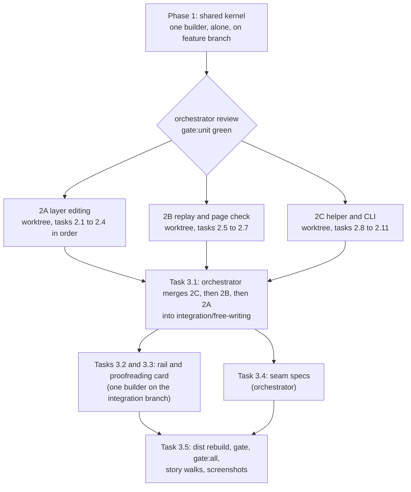

# Plan: Free writing

Three phases. Phase 1 is one builder alone and builds the shared kernel: the record shape, the block allowlist, the block reader, and the contract. Phase 2 is three builders in parallel, in their own worktrees, with no file in common: layer editing (2A), replay and the page check (2B), and the helper and CLI (2C). Phase 3 is led by the orchestrator: it merges the three branches, builds the rail changes, runs the specs that cross the seams, and runs the checkpoint gates.

The plan uses the recommended answers to the two open questions: Lahe's own editing code (AQ1), and always checking new blocks when an agent replies handled (AQ3). [If Ken decides otherwise](#if-ken-decides-otherwise) names the tasks that change.

## How the work is dispatched

**Who owns what at each seam.** The orchestrator owns every merge and every test that crosses a seam.

- **2A capture feeding 2B replay.** Phase 1's run fixtures in `record_fixtures.js` are the contract between them. 2A proves its captured records match those fixtures (Task 2.1's capture test). 2B builds only against the fixtures. After the merge, Task 3.4 types a real run, rebuilds, and replays it.
- **2C's handled check reading what 2A records.** 2C builds against the same fixtures. Task 3.4 sends real captured records through the handled check.
- **The Phase 1 contract matching what 2B and 2C do.** Task 3.4 includes a scripted agent that follows only the contract text to place a run in a Markdown source. Its result must pass both the page check (2B) and the handled check (2C).

**Rules every builder follows** (repo `CLAUDE.md`, "Running the gate" and "Running the loop"):

- Run `npm run gate:unit` only. A builder may run its own new browser spec files by name with `npx playwright test test/browser/<file>.spec.js`. Never the whole suite.
- Never commit `dist/`. Rebuild it locally for a browser spec, but do not stage it.
- Never remove a file. List it under "To delete at cleanup" in the task report.
- A builder that hits a limit asks the orchestrator instead of documenting around it.
- Read first: the architecture, `docs/CONTRACTS.md`, `docs/diagrams/` (the ones the task names), and `skills/lahe/SKILL.md`.

**Spike evidence builders may reuse.** Task 1.1 copies these into the repo, because `/private/tmp` does not last. Until then they live under `/private/tmp/claude-501/-Users-kennethstclair-Documents-workspace-live-agentic-html-editor/e688975e-9b6e-47aa-a105-b07bed66b7d5/scratchpad/`:

- `host_spike/fixtures/blog.html`: a styled blog page.
- `host_spike/fixtures/md_render.html` and `host_spike/fixtures/doc.md`: a real Lahe Markdown render, with `sheet-head` and the "Section N" label, and its source.
- `host_spike/spike_lib.js`: the H5 host (editable parent plus `beforeinput` guard, `h5Guard`). Reference for Task 2.1, not code to paste.
- `host_spike/run_host_spike.js` and `host_spike/matrix.txt`: the five-host check list, three browsers.
- `r14_repro/repro.js`, `r14_repro/repro_lib.js`, `r14_repro/probe_reload.js`: the walk that reproduces all three R14 cases on a real `lahe review post.md`. Seed for Tasks 2.7, 2.9, and 3.4.
- `r14_repro/out/results-all.json`: what each case did before the fix.
- `tiptap_spike/fixtures/blog.html`: only needed if AQ1 goes the other way.

**Numbers this plan sets** (the architecture left them to the plan). Each lives as a named constant in the file shown.

| Constant | Value | Where |
|---|---|---|
| `PROOFREAD_MIN_WORDS` (proofreading threshold, brief R11) | 150 words, counted over the run's blocks, skipping `from_anchor` blocks | `src/shared/review_format.js` |
| `NEW_BLOCKS_MAX` (block count ceiling) | 400 blocks per record | `src/shared/record.js` |
| `NEW_BLOCKS_MAX_CHARS` (size ceiling) | 200000 characters of cleaned block html per record | `src/shared/record.js` |
| Ceiling warning on the bar | shown at 90 percent of either ceiling | `src/layer/editing.js` |
| `FLUSH.RUN_DRAFT_FLOOR_MS` (draft floor for run records) | 30000 | `src/shared/protocol.js` |
| `SHORT_BLOCK_WORDS` (the five-word line in the presence table) | 5 | `src/shared/normalize.js` |
| `SESSION_HISTORY_MAX` (session undo steps kept) | 100 | `src/layer/editing.js` |

**Block-type hotkeys** (the architecture left the keys to the plan). Mod is Cmd on macOS and Ctrl elsewhere, as today. Matched on `event.code`, so Option-digit characters on macOS do not break them.

| Block | Menu label | Hotkey | Markdown shortcut |
|---|---|---|---|
| p | Paragraph | Mod-Alt-0 | none |
| h2 | Heading | Mod-Alt-1 | `# ` |
| h3 | Subheading | Mod-Alt-2 | `## ` |
| h4 | not in the menu; the label reads "Small heading" when the caret is in one | Mod-Alt-3 | `### ` |
| ul | Bulleted list | Mod-Shift-8 | `- ` or `* ` |
| ol | Numbered list | Mod-Shift-7 | `1. ` |

If a key does not reach the page in one of the three browsers, the builder picks another, asks the orchestrator, and records it under Changes from plan.

## Phase 1: Shared kernel

One builder, alone, on the feature branch. Nothing in Phase 2 starts until the orchestrator has reviewed this phase and `gate:unit` is green. `manifest.js` and `review_format.js` are frozen files, so the orchestrator reviews every change to them.

::: xref
[Architecture: Data / State Changes](02_architecture_free_writing.html#data-state-changes) · [Security & Privacy Notes](02_architecture_free_writing.html#security-privacy-notes) · [Contract changes](02_architecture_free_writing.html#contract-changes) · [Rollout and old agents](02_architecture_free_writing.html#rollout-and-old-agents)
:::

### Task 1.1: Test seeds in the repo

**Spec:** Copy the spike fixtures and the R14 walk named above into `test/fixtures/free_writing/`. Add an empty-notes render fixture: an empty `.md` rendered by today's `markdown.js`, with the file-name title carrying the chrome marker from Task 1.2 added by hand.
**Files:** `test/fixtures/free_writing/` (new folder), a `README.md` inside it saying where each file came from.
**Acceptance:** The fixtures open in Playwright with the layer injected. The R14 walk runs from its new home against the current code and reproduces the three cases as `r14_repro/out/results-all.json` recorded them. Lint's tracked-file `node --check` passes over the copied scripts.

### Task 1.2: Block allowlist and the block reader

**Spec:** In `normalize.js`, add `WRITABLE_BLOCK_TAGS`, `cleanBlock(tag, html)`, `SHORT_BLOCK_WORDS`, a string-based leaf-block reader for a page's HTML, and a pure run matcher that says which new blocks are present in a list of leaf blocks (whole, joined, or split, words folded for typography). All string-based, so the helper and the layer run the same code. In `markers.js`, add the one spelling of the file-name title's chrome marker. Architecture sections: Security & Privacy Notes ("One allowlist, three places"), Replay after a rebuild ("The walk" and the first row of the presence table).
**Files:** `src/shared/normalize.js`, `src/shared/markers.js`, `test/unit/clean_block.test.js` (new), `test/unit/leaf_blocks.test.js` (new).
**Acceptance:**
- `clean_block.test.js`: each of these is refused: `tag: "script"`, `tag: "iframe"`, the SVG animate href case, ``, `<a href>`, `li` inside a `p` block. Every attribute is dropped. Text is escaped again on output. Elements come only from the allowlist's constants.
- `leaf_blocks.test.js`: on the copied `md_render.html`, the reader skips the "Section N" label, the marked file-name title, and elements with no text. A list is one block whose lines are its items.
- The matcher has one test each for whole, joined, split, and missing, and one showing tag and markup never decide presence.

### Task 1.3: Layer block helpers (new file)

**Spec:** New `src/layer/blocks.js`, loaded right after `selection.js`. It holds the DOM half of the block rules so 2A and 2B share one copy: the leaf-block walk over live nodes (same rule as Task 1.2's string reader), `insertPointAfter(anchor)` (climb out of chrome such as `sheet-head`), `writeBlock(tag, html)` (runs `cleanBlock`, builds from constants), and `swapTag(el, tag)` (checks `WRITABLE_BLOCK_TAGS`, moves every attribute including the `data-lahe-id` stamp, and every child). Architecture sections: Where "after the anchor" is, Changing an existing block's type ("Element swap"). This moves the swap out of `replay.js`, where the architecture put it, because editing loads before replay and both need it. Record that under Changes from plan.
**Files:** `src/layer/blocks.js` (new), `src/shared/manifest.js` (entry for `blocks.js`, plus a `planned: true` entry for `src/cli/commands/write.js` owned by 2C), `test/browser/blocks_kernel.spec.js` (new), `docs/diagrams/module_map.md`.
**Acceptance:** `blocks_kernel.spec.js`, run by name, passes:
- On `md_render.html`, `insertPointAfter` an `h2` returns the point after its `sheet-head`.
- The DOM walk and the string reader return the same list on every Task 1.1 fixture.
- `swapTag` keeps the stamp and the children.
- `swapTag` and `writeBlock` refuse `script`.

Lint's manifest completeness passes.

### Task 1.4: The record shape, merge, and fixtures

**Spec:** In `record.js`: the four optional fields and `from_anchor`, their validation (one function returning a named refusal reason, which the helper will call), `NEW_BLOCKS_MAX` and `NEW_BLOCKS_MAX_CHARS`, a builder that makes `after_html` and `after` from the anchor markup plus the run, the anchor view replay reads, the change text for a run (structure only), `after_history` entries carrying the new fields, and take-back records carrying the run. In `merge.js`, add the four fields to `CONTENT_FIELDS`. In `record_fixtures.js`, add run fixtures. Architecture sections: Data / State Changes (all of it), Undo of a committed record.
**Files:** `src/shared/record.js`, `src/shared/merge.js`, `src/shared/record_fixtures.js`, `src/shared/failures.js` (refusal codes for a bad block and for over the ceiling), `test/unit/run_record.test.js` (new), `test/unit/merge_run.test.js` (new).
**Acceptance:**
- The fixtures cover:
  - the architecture's worked example
  - a split tail with no typing
  - a split tail plus typing
  - a tag-only change
  - a tag change with new words
  - a paragraph turned into a list
  - an item added to an existing list
  - `start_of_container`
  - a record with `after_history` holding an earlier run
  - one forged record per refusal
- `run_record.test.js`:
  - every valid fixture passes validation, and every forged one is refused with its code
  - `after` read from `after_html` equals the builder's `after`
  - the change text contains none of the run's words
  - a split with no typing has no "Added" sentence
  - over either ceiling is refused
  - a take-back of a handled run lists the run's blocks
  - the anchor view of a run record carries `anchor_after_html` as its `after_html`
- `merge_run.test.js`: when the browser has a longer run than the store at the same revision, the merged item keeps the browser's run.

### Task 1.5: Wire constants

**Spec:** `SERVICE_CONTRACT` goes to 14 and `FLUSH.RUN_DRAFT_FLOOR_MS` is added in `protocol.js`. `gestures.js` gets one matcher for the block-type hotkeys in the table above, so the bar's hint lines and the matcher cannot disagree. Architecture sections: Rollout and old agents ("Helper version"), Block types while writing.
**Files:** `src/shared/protocol.js`, `src/shared/gestures.js`, `test/unit/protocol_wire.test.js`, `test/unit/regions_gestures.test.js`.
**Acceptance:** A unit test names each hotkey chord and its block tag, matched by `event.code`, and shows the chords do not collide with Cmd-Shift-E, Cmd-Shift-C, Cmd-Shift-X, or Cmd-Shift-1. The existing refusal of an older helper by a newer CLI passes at 14.

### Task 1.6: Projection and the contract, with every copy

**Spec:** In `review_format.js`: project the four fields and each block's derived words, with `new_blocks` not cut at the 2000-character bound. Class `new_blocks` and `anchor_after_html` as data. Add `PROOFREAD_MIN_WORDS`. Make the text formatter (copy and export) show the anchor change and then the new blocks by type. Write the contract lines listed under Contract changes, plus one line for AQ3: a handled reply on new blocks is always checked against the built page. Then update every copy in this one task, so they cannot drift:
- `skills/lahe/SKILL.md`, then run `npm run install-skills`
- the restated copy in `test/unit/review_format.test.js`
- the restated copy in `docs/CONTRACTS.md`, plus its record and `review.json` sections

In the projection, `after_history` entries do not carry `new_blocks`. The agent needs only the current run. Replay reads history from the browser store, not from `review.json`.
**Files:** `src/shared/review_format.js`, `skills/lahe/SKILL.md`, `test/unit/review_format.test.js`, `test/unit/projection_review_json.test.js`, `docs/CONTRACTS.md`.
**Acceptance:**
- `review_format.test.js` asserts the new contract lines word for word, and the restated copy matches.
- `projection_review_json.test.js`:
  - a run over 2000 characters is projected whole
  - the field classes are right
  - a projected history entry has no `new_blocks`
- `export_text.test.js` shows a run as "Heading: ...", "Paragraph: ...", "Bulleted list: ...".
- `docs/CONTRACTS.md` and the skill hold the same contract text as `review_format.js`.

**Phase test:** `npm run gate:unit` green. `blocks_kernel.spec.js` green by name. The orchestrator reads the contract text against the architecture's Contract changes list, line by line, and merges Phase 1 before branching the three worktrees from it.

## Phase 2: Three builders in parallel

Each builder works in its own worktree, branched from the merged Phase 1. File ownership does not overlap:

| Builder | Owns | Creates |
|---|---|---|
| 2A layer editing | `src/layer/editing.js`, `src/layer/protect.js`, `src/layer/anchor.js`, `docs/diagrams/protected_region.md`, `docs/diagrams/finding_the_region.md` | `test/browser/free_writing_*.spec.js`, `test/unit/editing_run.test.js` |
| 2B replay | `src/layer/replay.js`, `docs/diagrams/replay_branches.md` | `test/browser/replay_run*.spec.js`, `test/unit/replay_run.test.js` |
| 2C helper and CLI | `src/service/log.js`, `src/service/handled_check.js`, `src/service/markdown.js`, `src/layer/sync.js`, `src/cli/index.js`, `src/cli/commands/write.js`, `docs/CLI.md`, the `lahe write` scenario in `skills/lahe/SKILL.md` | `test/unit/write_command.test.js`, `test/unit/handled_check_run.test.js`, `test/unit/log_run.test.js` |

**Nobody in Phase 2 touches:**
- any `src/shared/` file
- `src/layer/blocks.js`
- `src/layer/tab_*.js`, `src/layer/overlay.js`, `src/layer/index.js`
- `dist/`

A builder who needs a change there asks the orchestrator.

::: xref
[Architecture: Key Flows](02_architecture_free_writing.html#key-flows) · [Failure Modes / Edge Cases](02_architecture_free_writing.html#failure-modes-edge-cases) · [Test Strategy](02_architecture_free_writing.html#test-strategy)
:::

### Task 2.1 (2A): The editing host and the session

**Spec:** Make the anchor's parent the editing host with a `beforeinput` guard. The session is the anchor plus its run. The layer writes each of these itself:
- Enter at the end of a block, which makes a sibling `p` at `blocks.insertPointAfter`
- Enter mid-block, which splits the block and marks the tail `from_anchor`
- Backspace and Delete across a block edge
- typing over a selection that spans blocks
- cut across blocks, handled like a spanning delete
- plain-text paste; a drop is inserted the same way as a paste

The caret leaving the session ends it. IME composition follows the architecture's rule. The focus ring is hidden with the layer's own shadow-root style. Capture builds the record through `record.js` and `cleanBlock`. `kindFor` counts the run and the tag. `itemFor` maps any run block back to its outstanding record. Reopening an old record keeps today's session and break rule. Architecture sections: The editing host, Block types while writing (Enter, Shift-Enter, Paste), Two sittings in the same place, Rollout ("Reopening an old record").
**Files:** `src/layer/editing.js`, `test/unit/editing_run.test.js`, `test/browser/free_writing_host.spec.js`, `test/browser/free_writing_capture.spec.js`.
**Acceptance:**
- `free_writing_capture.spec.js` types the architecture's example after a paragraph on `blog.html`. The committed record deep-equals that fixture's shape: fields, tags, and markup. Ids and times are ignored.
- `free_writing_host.spec.js` covers:
  - Backspace at the start of the first run block merges into the anchor
  - Backspace at the anchor's start and Delete at the run's end do not touch page blocks outside the session
  - a spanning selection overwritten leaves no inline style spans
  - a paste of formatted HTML arrives as plain paragraphs
  - a click into a page block outside the session ends the session
  - a split with no typing gives a `from_anchor` tail and no "Added" change text
  - an empty last list item is dropped at capture
  - Cmd-Shift-E on a run block of an outstanding record reopens that record
  - reopening a pre-feature multi-paragraph record keeps today's behavior
- Screenshot, light and dark: the frame around an anchor plus a two-block run on `md_render.html`, with no page focus ring.

### Task 2.2 (2A): Block types, the bar menu, hotkeys, and lists

**Spec:** Build the block-type menu on the bar before B and I (wireframe direction A), the hotkeys from the table above, and the Markdown shortcuts. All three call one function per block type. Changing the anchor's type uses `blocks.swapTag` and sets `anchor_tag_after`, with the anchor ladder's tag tie-breaker accepting either tag. In an existing list, the anchor is the whole list: Enter adds an `li`, and Enter in an empty last item ends the list with a new `p` in the run. The bar shows the ceiling warning at 90 percent of either ceiling. Architecture sections: Block types while writing, Adding to an existing list, Changing an existing block's type.
**Files:** `src/layer/editing.js`, `src/layer/anchor.js`, `test/browser/free_writing_types.spec.js`, `test/unit/anchor_cases.test.js`.
**Acceptance:**
- `free_writing_types.spec.js`:
  - each of the six types can be made by the menu, the hotkey, and the Markdown shortcut, in both new text and an existing block
  - the menu names the caret's block
  - a paragraph turned into a header commits as `format_only` with `anchor_tag_after: "h2"`
  - Enter at the end of an existing bullet adds an `li` to `anchor_after_html`
  - a run near the ceiling shows the warning
- `anchor_cases.test.js`: the ladder finds a block by its saved tag and by `anchor_tag_after`.
- Screenshots, light and dark:
  - the bar with the menu closed
  - the bar with the menu open
  - a new heading while writing on `md_render.html`, showing the page's h2 style without the section rule
  - the ceiling warning

### Task 2.3 (2A): Starting in empty space and the empty page

**Spec:** Cmd-Shift-E with the pointer over no block enters write state with no block open. In write state, hovering between two blocks or below the last shows the "+ Write here" line. Clicking it opens a session anchored on the block above, with an empty first `p` ready. Esc leaves write state. Cmd-Shift-E over a block still opens that block, as today. Add the empty-container rung to `anchor.js`: `main`, or `body` with no `main`, found by tag, with `placement: start_of_container`. A page with no content blocks opens in write state on load. Architecture sections: Block types while writing ("Starting in empty space"), Empty page and `lahe write`.
**Files:** `src/layer/editing.js`, `src/layer/anchor.js`, `test/browser/free_writing_empty.spec.js`, `test/unit/anchor_engine.test.js`.
**Acceptance:**
- `free_writing_empty.spec.js`:
  - the line appears only under the pointer, in every gap and below the last block
  - clicking it starts a session after the right block
  - on the empty-notes fixture the page opens in write state, and the first sitting commits with `placement: start_of_container`, anchored on `main`, not on the marked title
  - a second sitting before the agent places the first continues the same record at a new revision
- `anchor_engine.test.js`: the empty-container rung resolves and is not marked lost.
- Screenshots, light and dark:
  - the "+ Write here" line between two blocks on `blog.html`
  - the empty-notes page in write state

### Task 2.4 (2A): Undo and protection

**Spec:** Session undo keeps a snapshot at each block change and at the end of each typing burst, up to `SESSION_HISTORY_MAX`. A Markdown shortcut is its own step. Cmd-Z and Shift-Cmd-Z walk it while the frame is open. After commit, undo of a run record restores the anchor's `before_html` and old tag through `cleanBlock` and `blocks.swapTag`, and removes the run's elements. On a handled record it raises the take-back item. In `protect.js`: protect and snapshot the anchor plus the run. Restore by block position and character offset after the re-found anchor. Set the host attribute again when a repaint replaces the parent. Rebind after a tag swap. Architecture sections: Undo inside a session, Undo of a committed record, The editing host ("A repaint that replaces the parent"), Failure Modes (repaint and reload rows).
**Files:** `src/layer/editing.js`, `src/layer/protect.js`, `test/browser/free_writing_undo.spec.js`, `test/browser/free_writing_repaint.spec.js`, `test/unit/protect_vocabulary.test.js`, `docs/diagrams/protected_region.md`.
**Acceptance:**
- `free_writing_undo.spec.js`:
  - Cmd-Z right after "1. " gives back the typed characters
  - Cmd-Z walks block changes in order, and redo walks them back
  - undo of a committed run removes the run and restores the anchor
  - undo of a tag change restores the paragraph
  - undo of a handled run raises a take-back item that lists the blocks
- `free_writing_repaint.spec.js` (uses `test/fixtures/repainting.html` and `md_render.html`):
  - a repaint mid-sitting keeps every run block and the caret's block and offset
  - a repaint that replaces the parent keeps typing working
- `protected_region.md` shows the run.

**Don't touch (2.1 to 2.4):** `replay.js`, `sync.js`, anything in `src/service/` or `src/cli/`.

### Task 2.5 (2B): Anchor view and the tag leg

**Spec:** For a run record, every anchor-compare function reads `record.js`'s anchor view, so `writeRegion` never sees the whole sitting. Add the tag leg: the anchor is applied only when its tag equals `anchor_tag_after`, and a match on words and markup with the wrong tag swaps the tag through `blocks.swapTag`. Records without `new_blocks` keep today's path unchanged. Architecture sections: Data / State Changes (the reader table's replay rows), Changing an existing block's type ("Replay").
**Files:** `src/layer/replay.js`, `test/unit/replay_run.test.js`, `test/browser/replay_run_anchor.spec.js`.
**Acceptance:**
- `replay_run_anchor.spec.js`, using the Phase 1 fixtures injected into the store: a run record whose agent placed the run, then a repaint that brings the old anchor back. The anchor never comes back holding the run's words.
- A tag-only fixture on a page still showing `p` is swapped to `h2`. Tag-swap tests find the anchor by its stamp, so they do not depend on 2A's ladder change.
- `no_duplicate_text.spec.js`, `split_not_conflict.spec.js`, and `replay_branches.spec.js` pass unchanged, run by name.

### Task 2.6 (2B): The insert path

**Spec:** After the anchor compare, walk leaf blocks forward from `blocks.insertPointAfter(anchor)` and decide each new block by the presence table, using Task 1.2's matcher. That covers:
- rewriting a one-to-one block in place for a wrong tag or lost bold
- leaving joined or split blocks alone
- the whole-page search for blocks of `SHORT_BLOCK_WORDS` or more
- inserting a missing block after the last present one, through `blocks.writeBlock`
- holding everything while the anchor is in branch four
- checking earlier revisions' runs from `after_history`

A wrong tag, and a block found elsewhere, each put a note on the item through the card's existing flag path. The anchor gone means LOST, with nothing placed. Architecture sections: Replay after a rebuild (the whole section).
**Files:** `src/layer/replay.js`, `test/unit/replay_run.test.js`, `test/browser/replay_run_insert.spec.js`, `docs/diagrams/replay_branches.md`.
**Acceptance:**
- `replay_run_insert.spec.js` has one test per row of the presence table, plus:
  - a run with an h2 inserted on `md_render.html` lands after the `sheet-head`, not inside it
  - a forged fixture with `tag: "script"` writes nothing
  - a record with no anchor on the page goes LOST and inserts nothing
- `replay_branches.md` shows the insert path after branch one to three, and the hold on branch four.
- Screenshot, light and dark: a placed run with an h2 on `md_render.html` after replay.

### Task 2.7 (2B): The page check and the R14 cases

**Spec:** For a run record, `pageCheckReasonFor` and `formattingMissingFromPage` check the anchor and each new block on their own, with the same walk and matcher:
- A missing block reopens the item with the "undone" note.
- Lost bold or italic, or a one-to-one block with the wrong tag, reopens it with the formatting note.
- The section label does not count against it.

Then prove the first two R14 cases under the new record shape: the doubled line after a header, and the lone paragraph losing its bold. Use the R14 walk's seeds with fixture records. Architecture sections: The page check on a run, Analysis of Existing Structure ("Root cause of two open bugs"), Failure Modes (last row).
**Files:** `src/layer/replay.js`, `test/browser/replay_run_check.spec.js`.
**Acceptance:** `replay_run_check.spec.js`:
- a handled run with an h2 on `md_render.html` is not reopened
- a handled run whose paragraph lost its bold is reopened with the formatting note
- a header placed as a paragraph is reopened with the formatting note
- a missing block is reopened as undone
- the header case, as a run record: the line shows once, below the `sheet-head`
- the lone paragraph: the bold survives, and a bold paragraph the agent left out is inserted with its bold

**Don't touch (2.5 to 2.7):** `editing.js`, `protect.js`, `anchor.js`, `sync.js`, anything in `src/service/` or `src/cli/`.

### Task 2.8 (2C): Helper enforcement and the draft floor

**Spec:** On append, `log.js` runs `record.js`'s run validation, which covers `cleanBlock` over every block, the tags, `placement`, and both ceilings. It refuses a failing event with its named code rather than cleaning it. `sync.js` holds drafts of run records to `FLUSH.RUN_DRAFT_FLOOR_MS`. Architecture sections: Security & Privacy Notes ("One allowlist, three places", "Size"), Data / State Changes ("Draft growth").
**Files:** `src/service/log.js`, `src/layer/sync.js`, `test/unit/log_run.test.js`, `test/unit/draft_flush_cadence.test.js`.
**Acceptance:**
- `log_run.test.js`: every forged fixture from Task 1.4 is refused at the helper with its code, and nothing reaches `events.jsonl` or `review.json`. A valid run is stored and projected whole.
- A record at both ceilings, with `after_history` full, fits under the helper's `MAX_BODY_BYTES`. The test computes the size and does not assume it.
- `draft_flush_cadence.test.js`: a run record's drafts wait for the longer floor, a record without `new_blocks` keeps the 10-second floor, and a commit is never held.

### Task 2.9 (2C): The handled check

**Spec:**
- `checkable` accepts `format_only` records and run records.
- For a run record, the check looks for the anchor's words and then each block's words, in order, each on its own, using Task 1.2's reader and matcher on the built page. A section label between them does not fail it.
- A `format_only` record is checked for the `strong` and `em` it asked for, under today's gate.
- Per AQ3, a run record's block words are checked even when the source was written since commit. The anchor's words stay behind today's gate.

Architecture sections: The handled check, Failure Modes (the third R14 case), AQ3.
**Files:** `src/service/handled_check.js`, `test/unit/handled_check_run.test.js`.
**Acceptance:** `handled_check_run.test.js`, against built pages rendered from Markdown sources:
- a correct run with an h2 passes
- a run whose second block is missing is held open, with the source written and not written
- a run whose words became raw HTML in the source is held open even though the source was written
- a `format_only` bold edit where the agent wrote nothing is held open, which is the third R14 case
- the same edit with the bold in the source passes
- a comment and a delete are still not checked

### Task 2.10 (2C): `lahe write`

**Spec:** Add the `lahe write <path>` command:
- It takes `--session` and `--name`, and prints what `lahe review` prints.
- It checks the path with `lstat` before either branch and refuses a symlink.
- It creates `.md` or `.markdown` files only, with the `wx` flag, and only when the parent folder exists.
- On "already exists" it checks again and uses the file only if it is a regular Markdown file. It never overwrites.
- It prints the parent folder's real path.
- It serves the page as `--only` with no folder mount and no linked-document mounts.

Register it and document it. Add a "Notes on a blank page" scenario to the skill, then run `npm run install-skills`. Architecture sections: Empty page and `lahe write`, Security & Privacy Notes (the `lahe write` bullets).
**Files:** `src/cli/commands/write.js` (new; the `planned` flag in `manifest.js` is cleared by the orchestrator at merge), `src/cli/index.js`, `docs/CLI.md`, `skills/lahe/SKILL.md` (the new scenario only), `test/unit/write_command.test.js`, `test/unit/cli_dispatch.test.js`.
**Acceptance:** `write_command.test.js`:
- it creates a new file
- it refuses to overwrite
- it refuses a missing parent folder
- it refuses a dangling symlink and creates nothing at its target
- it refuses a symlink to an existing `.md`
- it refuses a symlink to a non-Markdown file
- it refuses a non-Markdown name
- the served page has no folder mount; a request for a sibling file in the same folder gets a 404
- `--session` joins an existing session

`cli_dispatch.test.js` lists `write`. `docs/CLI.md` has the command.

### Task 2.11 (2C): The file-name title is chrome

**Spec:** When a Markdown file has no `#` heading, `markdown.js` marks the hero title it takes from the file name with the marker from `markers.js`. Architecture sections: Empty page and `lahe write`.
**Files:** `src/service/markdown.js`, `test/unit/markdown_render.test.js`.
**Acceptance:** `markdown_render.test.js`: an empty file and a file with no heading carry the marker. A file with a `#` heading does not. The rendered empty file matches Task 1.1's empty-notes fixture except for ids.

**Don't touch (2.8 to 2.11):** `editing.js`, `protect.js`, `anchor.js`, `replay.js`, the contract text in `skills/lahe/SKILL.md`.

**Phase test:** Each builder's branch is green on `gate:unit` and on its own new spec files, run by name. The orchestrator checks each branch's diff touches only files its builder owns. There is no full browser suite in this phase.

## Phase 3: Rail and integration

Led by the orchestrator on `integration/free-writing`. Tasks 3.2 and 3.3 go to one builder so the rail reads as one hand.

::: xref
[Architecture: Components / Modules Touched](02_architecture_free_writing.html#components-modules-touched) · [The proofreading reply](02_architecture_free_writing.html#the-proofreading-reply) · [Wireframe decision](wireframes/DECISION.md)
:::

### Task 3.1: Merge the three branches

**Spec:** The orchestrator merges 2C, then 2B, then 2A into `integration/free-writing`, using `st-merge`. It then clears the `planned` flag on `write.js` in `manifest.js` and runs `gate:unit`.
**Files:** `src/shared/manifest.js`, merge commits only.
**Acceptance:** `gate:unit` is green on the integration branch. No file shows changes from two builders. Any conflict and its resolution is written on the progress page.

### Task 3.2: The edits tab and the card show new blocks by type

**Spec:** The edits tab row and the rail card show the anchor's change, then the new blocks by type in plain words ("Heading", "Paragraph", "Bulleted list"), using the same labels as the bar's menu. A `from_anchor` block reads as moved, not added. A wrong-tag note and a "placed in a different spot" note from replay show on the card. On a page with no content blocks, the empty Edits tab says which file the notes go to and how to start (wireframe screen `b4-empty-rail`). Architecture sections: Components (`tab_edits.js`, `tab_done.js`, `overlay.js`).
**Files:** `src/layer/tab_edits.js`, `src/layer/tab_done.js`, `src/layer/overlay.js`, `test/browser/edits_tab.spec.js`, `test/unit/block_changes.test.js`.
**Acceptance:** `edits_tab.spec.js` shows:
- a run's row with each block's type label
- a split tail labelled as moved
- the replay notes on the card
- the empty-notes copy on a page with no content blocks

Screenshots, light and dark:
- the edits row for a three-block run
- the card waiting on the agent (wireframe `05-waiting`)
- the empty rail on a new notes page

### Task 3.3: The proofreading question on the card

**Spec:** A `question` reply on a run record shows with today's question treatment, plus two quick answers, "Use the fixes" and "Keep my words". Each posts a plain thread reply the agent reads. The wireframe's "Yes" and "Keep mine" are renamed because "Keep mine" already means something else on conflict cards. The card never says the fixes were applied until the agent replies. Architecture sections: The proofreading reply. Brief R11 (proofreading after a long hand-written block).
**Files:** `src/layer/tab_done.js`, `test/browser/agent_replies.spec.js`.
**Acceptance:** `agent_replies.spec.js`: a question reply on a run record shows both answers. Each posts its thread reply and moves the card to waiting. A question on a non-run record shows no quick answers. Screenshots, light and dark: the question card (wireframe `06b-question`), and the card after each answer.

### Task 3.4: Specs across the seams

**Spec:** The orchestrator writes the specs that need all three branches, on real `lahe review` and `lahe write` pages, seeded from the R14 walk. A scripted agent stands in for a real one. It follows only the contract text: it places `new_blocks` in the Markdown source, escaping as the contract says, then rebuilds and replies.
**Files:** `test/browser/free_writing_seams.spec.js` (new), `test/browser/free_writing_r14.spec.js` (new), `test/browser/support/` (the scripted agent).
**Acceptance:** `free_writing_seams.spec.js`:
- **2A to 2B:** a header, a paragraph, and a list typed after a block, then commit, then the agent places them, then a rebuild. The run shows once, tags and bold intact, and the page check does not reopen it.
- **2A to 2B:** paragraph to header, then commit, rebuild, and undo. The header survives the rebuild, and undo restores the paragraph and raises a take-back.
- **2A to 2B:** Enter at the end of an existing bullet, type, commit, rebuild. The new item shows once.
- **2A to 2B:** a reload mid-sitting. The record is ready and the run is back. Cmd-Shift-E on a run block reopens it.
- **2A to 2B:** the same reload with a run over `FLUSH.KEEPALIVE_MAX_BYTES`. The run still reaches the helper after the reload.
- **2A to 2B:** the agent's rebuild lands mid-sitting. The reload waits, the caret stays, and the text shows once.
- **2A to 2C:** a real captured run where the agent replies handled and writes nothing is held open. A real run whose words the agent wrote as raw HTML is held open.
- **All three:** three sittings on an empty `lahe write` page before the agent places any of them. The result is one record. The agent writes it at the top of the file, and the rebuilt page shows every block once.
- **The contract:** the scripted agent's placement of the architecture's example passes both the page check and the handled check.

`free_writing_r14.spec.js` covers all three R14 cases, typed for real:
- the header case on a real `lahe review post.md`, with screenshots while writing and after the rebuild
- the lone paragraph with bold
- bold two words, commit, rebuild, for both a correct agent and an agent that changes nothing

### Task 3.5: Checkpoint

**Spec:**
1. The orchestrator rebuilds `dist/` and commits it.
2. It runs `npm run gate` and reads the pass and fail counts.
3. It runs `npm run gate:all` and reads the counts.
4. It walks every brief user story on the running app, with a real agent, including the proofreading question and a notes page from `lahe write`.
5. It puts every screenshot from Tasks 2.1 to 3.4 on the progress page, light and dark.

It pushes only after it has read "0 failed", as its own step.
**Files:** `dist/lahe-layer.js`, `docs/features/20260928.01_free_writing/04_progress_free_writing.md`.
**Acceptance:** Both gates show 0 failed in all three lanes. Each user story has a walk note and a screenshot on the progress page. Changes from plan lists every deviation, including the move of `swapTag` into `blocks.js`.

**Phase test:** Task 3.5's gates and walks. The Acceptance Criteria below, each marked green by an evaluator who did not build it.

## If Ken decides otherwise

**AQ1, if Ken picks Tiptap for the run.** Before anything is built on it, the choice goes back to the security reviewer, as the architecture's Alternatives section requires.

- Phase 1 is unchanged.
- New task before 2A: vendor Tiptap under `vendor/tiptap/`, with its LICENSE and a README, and a helper route that serves it only when a sitting opens (owned by 2C).
- Task 2.1 changes: the host becomes a Lahe anchor plus a Tiptap run. Capture maps Tiptap's `<li>
` to `<li>` before `cleanBlock`.
- Task 2.2 changes: the menu and hotkeys call Tiptap commands for run blocks. The anchor keeps Lahe's code.
- Task 2.4 changes: session undo on the run comes from Tiptap's history. Protection puts Tiptap's own node back after a repaint.
- Rich paste is kept, since Tiptap brings it. It runs through `cleanBlock`, and the board row `LAHE-rich-paste` closes.
- Test list changes: the caret-crossing, spanning-selection, and Backspace-merge tests between anchor and run are expected to fail. Ken accepts that seam, and those lines leave the Acceptance Criteria.

**AQ3, if Ken says no.**

- Task 1.6 drops the AQ3 contract line from the contract and every copy.
- Task 2.9 keeps today's gate for run records. Coverage of `format_only` records stays, because brief R14 (bold and italic survive the rebuild) needs it.
- Task 3.4 changes: the "words written as raw HTML" spec expects the page check to reopen the item on the next load, not the handled check to hold it open at reply.
- The Test List line for that case changes to match.

## Test List

::: callout-req
**Kernel (Phase 1)**
- [ ] `cleanBlock` refuses `script` and `iframe` tags, the SVG animate href case, a remote `img`, an `a href`, and `li` inside a `p`.
- [ ] `cleanBlock` drops every attribute and escapes text on output.
- [ ] The string reader and the DOM walk give the same leaf blocks on every fixture.
- [ ] The reader skips the "Section N" label, the marked file-name title, and empty elements.
- [ ] The matcher finds a block whole, joined, and split, and ignores tag and markup for presence.
- [ ] `insertPointAfter` an h2 in a `sheet-head` is after the `sheet-head`.
- [ ] `swapTag` keeps the stamp and children and refuses tags outside `WRITABLE_BLOCK_TAGS`.
- [ ] Every run fixture validates. Every forged fixture is refused with its named code.
- [ ] `after` read from `after_html` agrees with the builder for every run fixture.
- [ ] Change text for a run holds none of the run's words. A split with no typing has no "Added" sentence.
- [ ] Merge on load keeps the browser's longer run at the same revision.
- [ ] Projection keeps a run over 2000 characters whole, classes the fields right, and leaves `new_blocks` out of history entries.
- [ ] Contract copies in the skill, `review_format.test.js`, and `docs/CONTRACTS.md` match the source.
- [ ] Block-type chords match on `event.code` and collide with no existing chord.

**Writing (2A)**
- [ ] Typing the architecture's example yields a record with that fixture's shape.
- [ ] Enter at the end makes a sibling. Enter mid-block splits with a `from_anchor` tail. Shift-Enter is a line break.
- [ ] Backspace at the first run block's start merges into the anchor. Edits at the session's outer edges never touch page blocks outside it.
- [ ] Typing over a spanning selection leaves no style spans in any browser.
- [ ] Paste and drop arrive as plain text. A blank line makes a new paragraph.
- [ ] The caret moving into a page block outside the session ends it.
- [ ] Each of the six types works by menu, hotkey, and Markdown shortcut, in new and existing text.
- [ ] Paragraph to header commits as `format_only` with `anchor_tag_after`.
- [ ] Enter in an existing bullet adds an `li` to the anchor's markup. Enter in an empty last item ends the list. An empty item never reaches the record.
- [ ] "+ Write here" shows only under the pointer and starts a session after the block above.
- [ ] An empty page opens in write state and anchors on `main` with `start_of_container`.
- [ ] A second sitting on an outstanding run continues the same record.
- [ ] Cmd-Z after a list shortcut gives back the typed characters. Undo and redo walk the session in order.
- [ ] Undo of a committed run removes the run and restores the anchor and its tag. On a handled run it raises a take-back.
- [ ] A repaint mid-sitting keeps the run and the caret. A repaint that replaces the parent keeps typing working.
- [ ] The ceiling warning shows before the ceiling.
- [ ] Reopening a pre-feature multi-paragraph record behaves as today.

**Replay and page check (2B)**
- [ ] One test per presence-table row.
- [ ] A run record's anchor never comes back holding the run's words after a repaint.
- [ ] The tag leg swaps a matching block with the wrong tag.
- [ ] A missing block goes after the last present block, and after the `sheet-head` when that block is an h2.
- [ ] A forged block writes nothing to the page.
- [ ] The anchor in conflict inserts nothing. A lost anchor places nothing.
- [ ] The page check does not reopen a correct run with an h2. It reopens a missing block, lost bold, and a wrong tag.
- [ ] Old-record specs (`no_duplicate_text`, `split_not_conflict`, `replay_branches`) pass unchanged.

**Helper and CLI (2C)**
- [ ] The helper refuses every forged record and anything over either ceiling. Nothing is stored.
- [ ] A record at both ceilings with full history fits under the body limit, measured in the test.
- [ ] Run drafts wait for the longer floor. Other drafts keep 10 seconds. A commit is never held.
- [ ] The handled check passes a correct run with a section label between blocks.
- [ ] The handled check holds open a missing block, whether or not the source was written.
- [ ] The handled check holds open words written as raw HTML (AQ3).
- [ ] The handled check holds open a bold edit the agent never made (third R14 case).
- [ ] `lahe write` creates a new file.
- [ ] `lahe write` refuses to overwrite, and refuses a missing parent folder or a non-Markdown name.
- [ ] `lahe write` refuses every symlink shape the architecture lists.
- [ ] `lahe write` serves with no folder mount.
- [ ] The file-name title carries the chrome marker. A file with a `#` heading does not.

**Across the seams (Phase 3)**
- [ ] Typed run, agent places, rebuild: shows once, tags and bold intact, not reopened.
- [ ] Paragraph to header survives the rebuild. Undo restores it.
- [ ] Bullet appended, rebuild: shows once.
- [ ] Reload mid-sitting: the record is ready, the run is back, and it reopens. This also holds over the keepalive size.
- [ ] Agent rebuild mid-sitting: the reload waits and the caret stays.
- [ ] Three sittings on a `lahe write` page before placement become one record, placed at the top of the file.
- [ ] R14 header case on a real Markdown review: the line shows once, below the `sheet-head`.
- [ ] R14 lone paragraph: the bold survives.
- [ ] R14 bold two words: survives with a correct agent. Held open with an agent that changes nothing.
- [ ] The scripted contract-only agent's placement passes the page check and the handled check.
- [ ] The edits row and card name each block's type. A split tail reads as moved.
- [ ] The proofreading question shows its two answers only on a run record, and each posts a thread reply.
:::

## Acceptance Criteria

::: callout-metric
- [ ] Full test suite green, not just the new tests.
- [ ] Design and lint gates green (the project's gate command).
- [ ] Every user story in the brief walked end to end in the browser, on the running app.
- [ ] Nothing punted: no TODOs, no stubbed tests, no "out of scope" that was in scope.
- [ ] Implementation matches brief and architecture; any deviation is deliberate and written down under Changes from plan on the progress page.
- [ ] **It looks like a staff designer built it.** Keep the seniority level: "staff" is what sets the quality bar the evaluator judges against. Judge the whole surface at that level, then check that it includes at least:
  - Clear visual hierarchy and information architecture. You know where to look, and the page's organization makes sense.
  - Consistency with the rest of the app. Buttons look like our other buttons, hover states follow the same convention, primary and secondary carry the same color meaning they carry elsewhere.
  - Honest feedback. Toasts and status messages report what actually happened. Never an optimistic "done" for something still in flight, or something that failed.
  - Micro-animations that mean something. Motion signals state or direction; it isn't decoration.
  - Copy in the brand voice (the project's brand or voice doc).
  - Existing components reused and the style guide followed. Nothing reads as a stock framework default.
- [ ] It reads as one feature, not several agents' work stitched together: consistent components, spacing, and interaction patterns across every surface it touches.

**This feature:**

- [ ] R1 (write where no text exists): a session starts after any block, below the last block, and on an empty page, with no existing block opened first.
- [ ] R2 (feels like today's edit): the same Cmd-Shift-E, frame, and bar. There is no mode switch and no second editor.
- [ ] R3 (paragraphs, headers, lists by the reviewer): all six types can be made in new text and in an existing block, by menu, hotkey, and Markdown shortcut.
- [ ] R4 (page styling): new, split, and retyped blocks match the page's spacing, type, and header sizes while writing and after commit, on `blog.html` and a Lahe Markdown render. A new h2 lacks only the section rule and number until the rebuild. Screenshots show both.
- [ ] R5 (saved as typed): a crash, a reload, and a repaint each leave the run intact, and the reviewer can reopen it and keep writing.
- [ ] R6 (words stay as typed): the words on the page, in the record, and in the source match the typed words exactly, typography aside. A Markdown shortcut can be undone back to its characters.
- [ ] R7 (reload mid-writing): the caret stays, nothing hides, and nothing shows twice.
- [ ] R8 (the agent tells new from changed): `review.json` carries `new_blocks` with tags and bold and italic, `anchor_after_html`, `anchor_tag_after`, and `placement`.
- [ ] R9 (contract says how to place): the contract has every line under Contract changes, and a contract-only agent places a run correctly in HTML and Markdown.
- [ ] R10 (handled is checked): a handled reply for a run is checked against the built page and held open when a block's words are missing.
- [ ] R11 (proofreading): after placing a run over 150 words, a real agent replies `question` with suggestions and the source words are unchanged. The card offers both answers.
- [ ] R12 (blank document from the command line): `lahe write notes/x.md` makes the file and serves it with the rail, opening in write state.
- [ ] R13 (notes in a named file): the agent writes each sitting into that file, at the top below any front matter, and the reviewer's file is the only file served.
- [ ] R14 (bold and italic survive): each named case passes on a real review:
  - [ ] the lone paragraph keeps its bold and italic after the rebuild
  - [ ] a line typed after a header shows once, below the header block, after the rebuild
  - [ ] bold two words on a Markdown page survives the rebuild, and an agent that changed nothing is held open
- [ ] R15 (undo): undo removes new text from the page. On a handled run it raises a take-back that asks the agent to remove the placed blocks.
- [ ] Decision, the agent writes the notes file: `lahe write` creates an empty file and the agent fills it.
- [ ] Decision, lists in the first cut: bulleted and numbered lists work in new and existing text.
- [ ] Decision, no rich paste: a paste arrives as plain text, and `LAHE-rich-paste` stays on the board.
- [ ] Decision, larger edits covered: splitting and retyping existing blocks meet R3, R4, and R14.
- [ ] Decision, one sitting is one edit: Enter at the end of an existing block and more typing is one record and one card.
- [ ] Decision, wireframe direction A: the block menu sits on the bar before B and I, and "+ Write here" is the only way into empty space. There is no gutter "+".
- [ ] AQ1 as recommended: one editing engine across anchor and run. The caret crosses, and selection and Backspace merge work across the edge, in all three browsers.
- [ ] AQ3 as recommended: a handled reply on a run is checked even when the source was written.
- [ ] Human has reviewed and approved (single consolidated gate after Plan)
:::

## Engineering Manager Review

| # | Finding | Disposition | Rationale |
|---|---------|-------------|-----------|

## Code Review Lead Review

| # | Finding | Disposition | Rationale |
|---|---------|-------------|-----------|

## Testing Review

| # | Finding | Disposition | Rationale |
|---|---------|-------------|-----------|

## Design Review

| # | Finding | Disposition | Rationale |
|---|---------|-------------|-----------|
