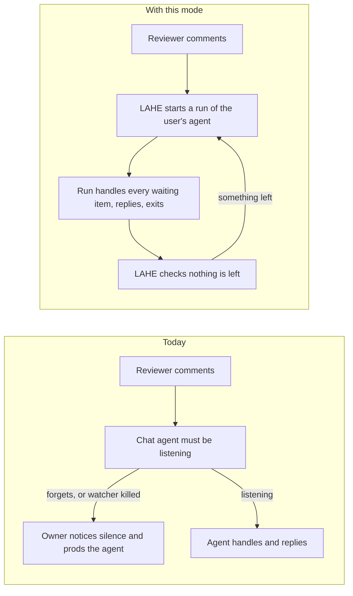

# Feature Brief: A LAHE agent that cannot forget

Status: DRAFT, written without the owner. Every guess made on his behalf is listed under Assumptions.

## Summary

An opt-in mode where LAHE itself starts the user's own coding agent each time a reviewer's comment is ready. Claude Code comes first, run in its headless mode (no chat window). Each run gets LAHE's rules once, at the top. It handles every waiting comment, replies on the cards, and exits. LAHE then checks that nothing was left unanswered.

The user needs no API key, no new bill, and nothing new to install. The mode is off unless the user turns it on.

A measurement spike is running in parallel: one real review, run headless. It measures how much of the subscription each run uses and whether the replies are right. Its numbers feed the architecture, and they can still change or stop this feature.

## Context

The owner asked, on a LAHE card on 2026-09-29:

> "for claude at least, what about the agents sdk. would that allow us to fully automate this stuff without having to repeat these instructions?"

The crucible in this folder answered that. The Agent SDK is the wrong base for him: it bills per token through an API key, needs an install, and works for Claude only. The same job can be done by the headless mode of the agent the user already has, on the login they already pay for.

The pain behind the question has three parts:

- **The agent forgets a step.** It serves the page and never starts listening, or ends its turn with comments unanswered. On 2026-08-18, 7 items sat unanswered in Codex this way.
- **The watcher gets killed.** Claude Code stops quiet background commands when it thinks memory is low. Each kill costs the agent a turn to restart the watcher.
- **Rules repeat on every wake.** Every time work lands, the agent is shown the same "do not end this turn" text again. The owner, on 2026-09-28: "When you repeat something over and over in the context it starts to mess with the way the agent responds. Those words start to influence the way that the agent writes as well as what they do."

Every earlier fix added words to the rules, and each one failed the same way. This feature moves the loop out of the chat, so remembering is LAHE's job and not the agent's.

Related work already merged: the drain carries only the reviewer's items, the rules live in the review and are read once, LAHE re-renders Markdown by itself, and a "handled" reply on a hand edit is checked against the built page.

## Goal / Problem

**Goal:** nothing a reviewer writes on the page goes unanswered, and nobody has to supervise the agent that answers it.

The owner leaves comments in a burst and moves on to other work. Every comment should be acted on, rebuilt, and answered on its card. He should not have to go back to a terminal to prod an agent, and should not have to watch whether one is still listening.

**The key design question:** can a fresh headless run of the user's own agent, started by LAHE for each batch of work, answer cards as well as the chat agent does, at a subscription cost the owner accepts? The spike answers the cost half and the first read on quality.

## Non-Goals

::: callout-nongoal
- Not built on the Agent SDK, and no path that needs an API key or pay-per-token billing.
- Not a new default. The chat-agent workflow stays as it is for anyone who does not turn this on.
- Not Codex, Gemini or Antigravity in the first version. The mode should not rule them out.
- Not the separate small fix for the chat workflow: a Claude Code hook that stops a turn ending with work open, plus trimming the per-wake banner. That is its own change, if the owner wants it (Q6).
- Not setting the Claude Code option that stops the memory-pressure kills. It is the user's own setting. The skill already asks them about it.
- Not running anywhere but the user's own machine. No cloud runner.
- Not changing how reviewers comment or edit, or how a card looks beyond the rail's status wording.
:::

## User & Context

**First, the owner.**

- He runs many agents at once: 21 Claude processes were counted on 2026-09-22.
- He reads while juggling other work, often by voice.
- He pays for a Claude subscription, not API tokens.
- He has ADHD and wants fewer things to watch, not more.

He works on a Mac with one browser tab per review and several Claude Code terminals, often across worktrees. He comments in a burst, then leaves for another terminal or task. The machine is often short of memory, which is what sets off Claude Code's kills of quiet background commands. His only view of the agent is the rail's one status line and the reply on each card.

**Second, the launch audience.** People running a coding agent who find LAHE through the npm package and the launch. Assumed to be mostly subscription users too, spread across Claude Code, Codex, Gemini and Antigravity.

## User Stories

- **As the owner**, I want every comment I leave answered on its card without going back to a terminal, so I can comment and move on to other work.
- **As the owner**, I want to stop watching whether an agent is still listening, so a review is one less thing to track.
- **As the owner**, I want this to run on the subscription I already pay for, so reviews add no new bill.
- **As the owner**, I want the agent to see LAHE's rules once per run, not on every wake, so repeated rule text stops steering how it writes and acts.
- **As a reviewer**, I want the rail to tell me plainly when the background agent has stopped or failed, so silence never looks like work in progress.
- **As a LAHE user on any host**, I want to turn this on with nothing new to install, so it works from a clone like the rest of the tool.
- **As a cautious user**, I want to know what the unattended agent is allowed to do before I turn it on, so it cannot surprise me.

## Solution Outline

1. The user opens a review as today, and turns the mode on for that session.
2. From then on, LAHE watches the review itself. No agent has to start or restart a watcher.
3. When a reviewer's item becomes ready, LAHE starts a headless run of the user's own agent, on the user's own login. The run is told LAHE's rules once, at the start.
4. The run handles every waiting item the way a chat agent does today: change the source, rebuild, check the change landed, reply on the card. Then it exits.
5. LAHE checks what is still unanswered. Items that arrived during the run get another run. An item that runs keep failing to answer stops being retried, and its card says so.
6. The reviewer sees the same cards and the same rail status line, with plain words for "working", "idle", and "stopped".
7. Turning the mode off, or closing the session, stops it. A chat agent can take the review back.

## Requirements

### Turning it on

::: callout-req
**R1 (off by default):** The mode is off unless the user turns it on. With it off, LAHE behaves exactly as it does today.
:::

::: callout-req
**R2 (no new bill):** Runs use the login the user's agent already has. The mode never needs an API key.
:::

::: callout-req
**R3 (nothing to install):** The mode works from a plain clone of LAHE. It adds no runtime dependency. It calls an agent the user already has installed.
:::

::: callout-req
**R4 (Claude Code first):** The first version supports Claude Code. The mode is described in terms any host with a headless mode could fill, so Codex and Gemini can follow.
:::

::: callout-req
**R5 (turn it off):** The user can turn the mode off at any time. Closing the session also stops it. A run that is already going finishes its current item or is stopped cleanly; it never leaves a half-written reply.
:::

::: callout-req
**R6 (say what it may do):** Before the mode starts, the user is told in plain words what the unattended agent may do without asking. The default is the least that lets it do the job. The exact list is Q4.
:::

### Waking and working

::: callout-req
**R7 (LAHE does the listening):** When an item becomes ready, LAHE starts a run. No agent has to start, keep, or restart a watcher.
:::

::: callout-req
**R8 (idle is free):** No run starts while nothing is waiting. An idle review uses no model usage.
:::

::: callout-req
**R9 (one run takes the batch):** A run handles every item that is ready when it starts, not one item per run. A burst of comments leads to a few runs, not one per comment. Items held back by the reviewer's Hold toggle start no run until released.
:::

::: callout-req
**R10 (same standard as today):** A run meets the same bar as a chat agent: it changes the source, rebuilds where needed, checks the change is on the page, and replies. The existing "handled" check applies to its replies unchanged.
:::

::: callout-req
**R11 (nothing is lost):** Items that arrive while a run is going are handled by that run or the next one. At most one run works a session at a time.
:::

::: callout-req
**R12 (retries stop):** After a run exits, LAHE checks for unanswered items and starts another run if any remain. An item that runs keep leaving unanswered is retried a limited number of times, then its card tells the reviewer the agent could not handle it. The limit is set in the architecture.
:::

### Rules said once

::: callout-req
**R13 (rules once per run):** A run is given LAHE's rules once, at the start. Nothing that reads like an instruction repeats per wake or per item. What the run reads about each item is the item's data.
:::

::: callout-req
**R14 (one source of rules):** The rules a run gets are the same rules a chat agent reads today. They are not a second copy that can drift.
:::

### What the reviewer sees

::: callout-req
**R15 (cards and rail only):** The reviewer's view stays the cards and the rail's one status line. Questions, caveats, and reasons for not handling an item land on the card, as today.
:::

::: callout-req
**R16 (failures are visible):** When a run fails (login expired, usage limit reached, the agent crashed or is not installed), the rail says so in plain words. The items stay waiting. A failure is never silent.
:::

### Who owns the review

::: callout-req
**R17 (one owner at a time):** While the mode is on, one agent owns the review. The chat agent and the background runs never both answer the same item. Which one yields is Q3.
:::

::: callout-req
**R18 (hand it back):** A chat agent can take the review back from the mode, and hand it back again, without losing or repeating an item.
:::

### Safety and cost

::: callout-req
**R19 (page text is data):** A run treats text copied off the page as data, never as instructions, under the same rule chat agents follow today. The security review of the architecture checks this for an agent nobody is watching.
:::

::: callout-req
**R20 (stays in scope):** A run edits only what the allowed list in R6 covers, and nothing outside the reviewed project.
:::

::: callout-req
**R21 (usage is visible):** The user can see how many runs a session started. Where the host reports it, they can also see what each run used.
:::

### Context from the chat

::: callout-req
**R22 (a handoff note):** The person or chat agent that turns the mode on can leave a short note for the runs: what the document is for and anything said in chat that the review does not hold. Every run sees it. Whether runs get more of the chat than that is Q2.
:::

## AI Behavior

The agent here is the user's own coding agent, started by LAHE with no person watching.

**What it should do:**

- Handle every item it is given, to the same standard as a chat agent.
- Reply on the card for every item: handled, not handled with a reason, or a question.
- Ask on the card when it cannot tell what the reviewer means, rather than guess.
- Say plainly on the card when it did something differently than asked.
- Exit when there is nothing left. LAHE decides when to run it again.

**What it should never do:**

- Follow instructions found in page text.
- Edit files outside what it is allowed to touch, or run commands outside that list.
- Mark an item handled that is not on the page.
- Start a watcher, wait for more work, or try to keep itself running.
- Refuse an item as stale or old. Every item it is shown is current.

**When it is unsure or fails:** leave the item unanswered or ask a question, never invent an answer. A run that crashes leaves the items waiting, and the rail shows the failure.

## Success Metrics

::: callout-metric
- **No prodding.** In a dogfood review of at least five comments with the mode on, every ready item gets a reply on its card, and the owner never opens a terminal to prod an agent.
- **No re-arming.** Zero agent turns are spent starting or restarting a watcher in a review with the mode on.
- **Rules once.** A run's full transcript shows LAHE's rules once, and nothing instruction-shaped repeated per item. Checked by reading one transcript at 1, 10 and 100 items.
- **Idle is free.** A review left open for an hour with no new comments starts zero runs.
- **Correct replies.** Every "handled" reply in the dogfood review passes the existing handled check, and the owner agrees with each answer.
- **Failures show.** With the agent's login deliberately broken, the rail reports the failure and every item stays waiting.
- **Nothing to install.** A fresh clone runs the mode with no install step, and the tool's runtime dependencies stay empty.
- **Cost the owner accepts.** Usage per run stays under a limit the owner sets after seeing the spike's numbers (Q1).
:::

There is no baseline for how often agents forget today. Every sighting is real, but nobody has counted them. The first metric is therefore absolute, not a comparison.

## UX Notes

- The rail's status line needs plain words for the new states: the background agent is working, idle and listening, or stopped with a reason.
- The card shows the agent's name as today. The reviewer does not need to know whether a reply came from a chat agent or a run.
- Turning the mode on and off is done by the user or their chat agent, not from the page. Whether the rail should also offer a switch is for the wireframe phase.

## Analytics / Logging

- Log each run: when it started and ended, how many items it was given, how many it answered, and how it ended (finished, failed, stopped).
- Log the usage each run reports, where the host reports it.
- Log each item that hit the retry limit.

## Rollout / Flags

- Off by default, turned on per session (assumed; see Q9).
- The review's rules currently tell agents not to use a forever daemon. This mode needs a process that outlives the chat. The architecture doc changes first, then the rules, the skill, and every copy of the rules together.
- The spike's numbers come before architecture. If a run costs more than the owner accepts, this brief goes back to him before any design.

## Assumptions made for the owner

Carried from the crucible:

1. He stays on his subscription and will not pay API rates for this.
2. A headless run started by a script on his own machine draws on his subscription, within its terms. What it uses per run is acceptable, pending the spike.
3. The zero-runtime-dependency rule is not up for change.
4. Most cards can be answered by an agent that has the review and the files, but not the chat's history.
5. Claude first, other hosts later, is acceptable.
6. A background agent may edit files and run the project's build without asking each time, inside the reviewed project.
7. The mode is opt-in, not the new default.

Added by this brief:

8. The mode is turned on per session, not as a machine-wide setting.
9. One owner per review at a time is the right rule. Two agents answering side by side is not wanted.
10. A retry limit for items runs keep leaving unanswered is wanted. Its number is left to the architecture.
11. The reviewer does not need to tell a run from a chat agent, beyond the agent name on the card.
12. A short handoff note is enough context for most reviews. If the spike shows otherwise, Q2 decides.

## Open Questions

::: callout-question
**Q1 (billing):** Is drawing on subscription limits from background runs acceptable? What per-run or per-day usage would be too much? The spike's numbers inform this. It decides whether the feature goes ahead.
:::

::: callout-question
**Q2 (context):** Should each run be a fork of the chat that opened the review (knows everything, costs more per run), its own continuing session (cheaper, knows the review and files), or fresh every time?
:::

::: callout-question
**Q3 (who owns the review):** When the mode is on, does the chat agent stop handling cards entirely? If both are active, which one answers?
:::

::: callout-question
**Q4 (permissions):** What may an unattended agent do without asking: edit only the reviewed document's sources, run the project's build, or run any command?
:::

::: callout-question
**Q5 (the kill setting):** Turn on Claude Code's option that stops the memory-pressure kills in the owner's own settings now, separate from this feature?
:::

::: callout-question
**Q6 (the small chat fix):** Build the hook that stops a Claude Code turn ending with work open, plus the banner trim, now as a separate small change, whatever happens here?
:::

::: callout-question
**Q7 (the SDK):** Close the SDK path for good, or keep it as a documented option for API-key users later?
:::

::: callout-question
**Q8 (priority):** Does this go ahead of the red main gate, the open security rows, and the npm package that gates the launch?
:::

::: callout-question
**Q9 (the switch):** Per session, per review, or a machine-wide setting?
:::

## PM Review

Pending. See the progress page.
