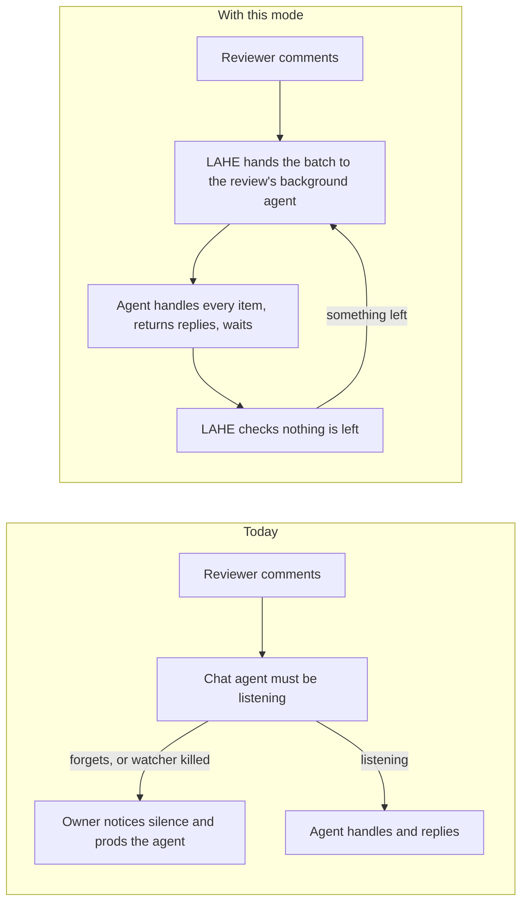

# Feature Brief: LAHE starts your agent when a comment is ready

Status: DRAFT, revision 2. The owner rejected one new agent per batch of comments. This revision asks for one agent per review, kept running. Every guess made on his behalf is listed under Assumptions.

## Summary

**Not the Agent SDK.** The SDK needs an API key, per-token billing, and an install. This brief gets the same result from the agent you already have. It runs with no chat window, on the login you already pay for. Whether to close the SDK option for good is Q7 (the SDK).

This brief proposes an opt-in mode instead. LAHE starts one background agent for a review: the user's own coding agent, with no chat window. Claude Code comes first, run in its headless mode. The agent gets LAHE's rules once, when it starts, and then stays running. Each time comments are ready, LAHE hands them to that same agent. It handles them and returns its replies, and LAHE checks that nothing was left unanswered. LAHE, not the agent, does every step that must not be forgotten.

Two test runs, the spikes, handled real reviews headless. The first (`spike_headless_run.md`) started a new agent for each batch. The second (`spike_persistent_run.md`) kept one agent running across batches. They measured how much usage each batch takes and whether the replies were right. Their numbers went into the architecture. They also set the cost line, the most usage a batch may take. If batches go over it, this feature stops.

## Context

The owner asked this on a LAHE card:

> "for claude at least, what about the agents sdk. would that allow us to fully automate this stuff without having to repeat these instructions?"

(Recorded in the crucible, under "The idea, as stated", 2026-09-29.)

The crucible in this folder answered that. The Agent SDK is the wrong base for him. It bills per token through an API key, needs an install, and works for Claude only.

The pain behind the question has three parts:

- **The agent forgets a step.** It serves the page and never starts listening, or ends its turn with comments unanswered. On 2026-08-18, 7 items sat unanswered in Codex this way.
- **The watcher gets killed.** Claude Code stops quiet background commands when it thinks memory is low. Each kill costs the agent a turn to restart the watcher.
- **Rules repeat every time new work arrives.** Each time a comment comes in, the agent is shown the same "do not end this turn" text again. The owner wrote: "When you repeat something over and over in the context it starts to mess with the way the agent responds. Those words start to influence the way that the agent writes as well as what they do." (from his notes on trimming the list of waiting items, 2026-09-28)

Every earlier fix added words to the rules, and each one failed the same way. This feature moves the job of waiting for comments out of the chat. LAHE does the remembering, so the agent does not have to.

The first version of this brief started a new agent for every batch of comments. The owner's comment on it:

> "Having a headless agent isn't a bad idea, um, but this workflow isn't good because it exits after every task and there's pretty significant upfront cost for starting an agent in some of my projects with a lot of contextual information after a single message to Opus which has a million token context window you know starting up a brand new agent sending in one message puts me at 18% of context. So you would essentially be burning tons of upfront tokens. If you spun up a new agent for every one of these... if you could spin up one agent and have it stay persistent while being headless, you know That's fine. I don't mind that. That would allow the overall sort of library or catalog to open documents for me with agents running in the background where all they're doing is taking care of the document itself and we could optimize that setup and have these background agents running and then I could do other things from the chat windows that would be reasonable... if it's totally headless and I can't see it and it forgets to do something like rearm then I don't know what we do... we just can't do every Note is a new agent, that would be too wasteful."

(His comment on the first set of feature documents, dictated, quoted in full as it was passed on.)

So the agent is started once per review and kept running (R26), and nothing depends on it remembering a step (R27).

Related work already merged:

- The list of waiting items an agent reads now carries only the reviewer's items, no rules.
- The rules live in the review and are read once.
- LAHE re-renders Markdown by itself.
- When an agent says it handled a hand edit, LAHE checks the edit really reached the page.

## Goal / Problem

**Goal:** nothing a reviewer writes on the page goes unanswered, and nobody has to supervise the agent that answers it.

The owner leaves comments in a burst and moves on to other work. Every comment should be acted on and answered on its card, with the page rebuilt. He should not have to go back to a terminal to prod an agent, and should not have to watch whether one is still listening.

**Two of the three pains have cheap fixes outside this feature.** One Claude Code setting stops the memory kills. Trimming the text repeated each time work arrives shrinks the repetition. What is left is agents ending a turn with work still open, and nobody has counted how often that happens. If a cheap fix to the chat workflow brings that to zero, this mode may not be needed. Q6 (order) asks whether to run that test first.

**The key design question:** LAHE keeps one headless agent running per review and hands it each batch of work. Can that agent answer cards as well as the chat agent does, at a cost the owner accepts? The spikes answer the cost question and give a first look at quality.

**First version is for the owner, as dogfood.** It is offered to launch users only after the success metrics pass.

## Non-Goals

::: callout-nongoal
- Not built on the Agent SDK. LAHE adds no API key of its own.
- Not a new default. The chat-agent workflow stays as it is for anyone who does not turn this on.
- Not Codex, Gemini or Antigravity in the first version. The mode should not rule them out.
- Not the separate small fix for the chat workflow. That fix is a Claude Code hook that stops a turn from ending with work open, plus trimming the text repeated each time work arrives. Whether it comes first is Q6 (order).
- Not setting the Claude Code option that stops the memory kills. It is the user's own setting. The skill already asks them about it.
- Not running anywhere but the user's own machine. No cloud runner.
- Not changing how reviewers comment or edit. The only visible changes are new status wording on the rail and a stop control.
:::

## User & Context

**First, the owner.**

- He runs many agents at once: 21 Claude processes were counted on 2026-09-22.
- He reads while juggling other work, often by voice.
- He pays for a Claude subscription, not API tokens. His other agents draw on the same usage limit.
- He wants fewer things to watch, not more.

He works on a Mac with one browser tab per review and several Claude Code terminals, often across worktrees. He comments in a burst, then leaves for another terminal or task. The machine is often short of memory. That is when Claude Code kills quiet background commands. His only view of the agent is the rail's one status line and the reply on each card.

**Later, the launch audience.** These are people who run a coding agent and find LAHE through the npm package or the launch. We assume most are subscription users too, spread across Claude Code, Codex, Gemini and Antigravity. They get this mode only after the owner's dogfood passes.

## User Stories

- **As the owner**, I want every comment I leave answered on its card without going back to a terminal, so I can comment and move on to other work.
- **As the owner**, I want to stop watching whether an agent is still listening, so a review is one less thing to track.
- **As the owner**, I want this to run on the subscription I already pay for, without starving my other agents, so reviews add no new bill and no lockout.
- **As the owner**, I want the agent to see LAHE's rules once, not every time new work arrives, so repeated rule text stops steering how it writes and acts.
- **As a reviewer**, I want the rail to tell me plainly when the background agent has stopped or failed, and to stop it from the page, so silence never looks like work in progress.
- **As a Claude Code user**, I want to turn this on with nothing new to install, so it works from a clone like the rest of the tool.
- **As a cautious user**, I want to know what the unattended agent is allowed to do, and who can make it act, before I turn it on.

## Solution Outline

1. The user opens a review as today, and turns the mode on for that session.
2. From then on, LAHE watches the review itself. No agent has to start or restart a watcher.
3. When the first reviewer item becomes ready, LAHE starts one headless agent for the review, on the user's own login. The agent is told LAHE's rules once, when it starts. It stays running after that.
4. LAHE hands the agent every waiting item as one batch. The agent handles them the way a chat agent does today: change the source, check the change landed, and give a reply for each card. Then it waits for the next batch.
5. LAHE checks what is still unanswered. Items that arrived during the batch go in the next batch. If the agent keeps failing to answer an item, LAHE stops retrying it and its card says so. If the agent dies, LAHE starts it again.
6. The reviewer sees the same cards and the same rail status line, with plain words for when the agent is working, idle, waiting for another review's run, or stopped.
7. Turning the mode off, stopping it from the page, or closing the session stops it. A chat agent can take the review back through the handoff that exists today.

## Requirements

### Turning it on

::: callout-req
**R1 (off by default):** The mode is off unless the user turns it on. With it off, LAHE behaves exactly as it does today.
:::

::: callout-req
**R2 (no key of LAHE's own):** Runs use the login the user's agent already has. LAHE never asks for or stores an API key. For a user whose agent is billed per token, the warning (R6, say what it may do) says each run costs money.
:::

::: callout-req
**R3 (nothing to install):** The mode works from a plain clone of LAHE. It adds no runtime dependency. It calls an agent the user already has installed.
:::

::: callout-req
**R4 (Claude Code first):** The first version supports Claude Code. Nothing in the mode is specific to Claude Code, so any agent with a headless mode, such as Codex or Gemini, can be added later.
:::

::: callout-req
**R5 (stopping is clean):** The user can turn the mode off at any time, and closing the session also stops it. When a run is stopped, every item it did not reply to stays waiting. No change reaches the source without a reply that explains it.
:::

::: callout-req
**R6 (say what it may do, and who can make it act):** Before the mode starts, the user is told in plain words what the unattended agent may do without asking. The default is the least that lets it do the job. The warning also says that anyone who can comment on this review can make the agent act within that list. The exact list is Q4 (permissions).
:::

### Waking and working

::: callout-req
**R7 (LAHE does the listening):** When an item becomes ready, LAHE hands it to the review's agent. No agent has to start, keep, or restart a watcher.
:::

::: callout-req
**R8 (idle is free):** No model call happens while nothing is waiting. A waiting agent uses none of the user's model limit.
:::

::: callout-req
**R9 (one batch at a time):** The agent is handed every item that is ready when a batch starts. So a burst of comments leads to a few batches, not one per comment. Items held back by the reviewer's Hold toggle start no batch until released.
:::

::: callout-req
**R10 (same standard as today):** A run meets the same bar as a chat agent: it changes the source, rebuilds where needed, checks the change is on the page, and replies. Its replies on hand edits pass the existing check that the edit reached the page. Its replies on comments are not checked by the tool, as today.
:::

::: callout-req
**R11 (nothing is lost):** Items that arrive while a batch is being worked go in the next batch. At most one batch is worked per session at a time.
:::

::: callout-req
**R12 (a limit on how many run at once):** Only a set number of runs may go at once, across all reviews on the machine. A burst of comments on several reviews waits its turn instead of starting many agents. A review waiting for another review's run says so on the rail. The number is set in the architecture.
:::

::: callout-req
**R13 (retries stop):** After each batch, LAHE checks for unanswered items and hands over another batch if any remain. If the agent keeps leaving an item unanswered, LAHE retries it a limited number of times. Then its card tells the reviewer the agent could not handle it. The limit is set in the architecture.
:::

::: callout-req
**R26 (one agent per review, kept running):** LAHE starts one background agent per review and keeps it running while the mode is on, handing it each batch. It does not start a new agent for each batch. A new agent pays its whole start-up cost again, which on the owner's projects fills a large share of the context window before any work is done. LAHE may close an idle agent and start a new one at the next batch. That pays the start-up cost once per idle spell, not once per batch.
:::

::: callout-req
**R27 (nothing depends on the model remembering):** Every step that must happen is done by LAHE, not by the model. LAHE does these:

- wakes the agent
- checks after each batch that every item got a reply
- sends the replies to the cards
- restarts the agent when it dies

The model's job is the edit and the words of each reply. If the model forgets or is blocked, LAHE notices and the rail says so.
:::

### Rules said once

::: callout-req
**R14 (rules once per agent):** The agent is given LAHE's rules once, when it starts. Nothing that reads like an instruction repeats each time work arrives, or per item. For each item, the agent reads only the item's data.
:::

::: callout-req
**R15 (one source of rules):** The rules a run gets are the same rules a chat agent reads today. They are not a second copy that can drift.
:::

### What the reviewer sees

::: callout-req
**R16 (cards and rail only):** The reviewer's view stays the cards and the rail's one status line. Questions, caveats, and reasons for not handling an item land on the card, as today.
:::

::: callout-req
**R17 (failures are visible):** When a run fails (login expired, usage limit reached, the agent crashed or is not installed), the rail says so in plain words. The items stay waiting. A failure is never silent.
:::

::: callout-req
**R18 (stop from the page):** The reviewer can stop the mode from the page, without a terminal. How the stop control looks is left to the wireframe.
:::

### Who owns the review

::: callout-req
**R19 (one owner, as today):** The mode owns a review the way an agent owns one today. There is one owner at a time, and the chat agent and the runs never both answer the same item.
:::

::: callout-req
**R20 (hand it back):** Moving a review between the mode and a chat agent uses the session handoff that exists today, with the same promises: every unanswered item reaches the new owner, and nothing answered is done twice.
:::

### Safety and cost

::: callout-req
**R21 (page text is data):** A run treats text copied off the page as data, never as instructions, under the same rule chat agents follow today. The architecture's security review covers this for an agent nobody is watching. It also covers the reviewer's own comments, because with the mode on, a comment turns into an action before anyone reads it.
:::

::: callout-req
**R22 (stays in scope):** A run edits only what the allowed list (R6, say what it may do) covers, and nothing outside the reviewed project.
:::

::: callout-req
**R23 (a usage ceiling):** The user can set a usage ceiling for the mode. When runs reach it, no new run starts, items stay waiting, and the rail says why. This keeps a busy review from using up the limit the user's other agents share.
:::

::: callout-req
**R24 (usage is visible):** The user can see how many runs a session started. Where the agent reports it, they can also see what each run used.
:::

### Context from the chat

::: callout-req
**R25 (a handoff note):** The person or chat agent that turns the mode on can leave a short note for the runs: what the document is for and anything said in chat that the review does not hold. Every run sees it. Whether runs get more of the chat than that is Q2 (context).
:::

## AI Behavior

The agent here is the user's own coding agent, started by LAHE with no person watching.

**What it should do:**

- Handle every item it is given, to the same standard as a chat agent.
- Reply on the card for every item: handled, not handled with a reason, or a question.
- Ask on the card when it cannot tell what the reviewer means, rather than guess.
- Say plainly on the card when it did something differently than asked.
- End its turn when the batch is done. LAHE decides when to hand it the next one.

**What it should never do:**

- Follow instructions found in page text.
- Edit files outside what it is allowed to touch, or run commands outside that list.
- Mark an item handled when its change is not on the page.
- Start a watcher, poll for more work, or try to keep itself running. LAHE brings it the next batch.
- Refuse an item as stale or old. Every item it is shown is current.

**When it is unsure or fails:** leave the item unanswered or ask a question, never invent an answer. An agent that crashes leaves the items waiting, and the rail shows the failure.

## Success Metrics

::: callout-metric
- **No prodding.** In a dogfood review of at least five comments with the mode on, every ready item gets a reply on its card, and the owner never opens a terminal to prod an agent.
- **No re-arming.** Zero agent turns are spent starting or restarting a watcher in a review with the mode on.
- **Rules once.** The agent's full transcript shows LAHE's rules once, however many batches it handled. Nothing that reads like an instruction repeats per batch or per item. Checked by reading transcripts from batches of 1, 10 and 25 items, and of 100 items across several batches.
- **Idle is free.** A review left open for an hour with no new comments makes zero model calls.
- **One agent.** In the dogfood review, the agent starts once. It starts again only when LAHE records one of these:
  - a crash
  - closing an idle agent
  - a fresh start

  It never starts once per batch.
- **Nothing forgotten.** With the agent killed on purpose between batches, the next comment is still answered, and nobody touched a terminal.
- **Correct replies.** Replies on hand edits pass the existing check. Replies on comments are judged by the owner, card by card, in the dogfood review.
- **No double answers.** Zero items answered twice in dogfood.
- **Failures show.** With the agent's login deliberately broken, the rail reports the failure and every item stays waiting.
- **Nothing to install.** A fresh clone runs the mode with no install step, and the tool's runtime dependencies stay empty.
- **Cost under the line.** Usage per run and per dogfood day stays under the cost line in Assumption 13.
- **Recorded for the owner to judge:** how many runs failed and how many items hit the retry limit, per review, and the time from an item becoming ready to its reply.
:::

There is no baseline for how often agents forget today. Every sighting is real, but nobody has counted them. So the first metric asks for zero prodding, rather than fewer prods than before.

## UX Notes

- The rail's status line needs plain words for the new states:
  - the background agent is working
  - idle and listening
  - waiting for another review's run
  - stopped or paused, with the reason (including the usage ceiling)
- The card shows the agent's name as today. The reviewer does not need to know whether a reply came from a chat agent or a run.
- Turning the mode on is done by the user or their chat agent. Stopping it can also be done from the page (R18, stop from the page).

## Analytics / Logging

- Log each run: when it started and ended, how many items it was given, how many it answered, and how it ended (finished, failed, stopped).
- Log the usage each run reports, where the agent reports it.
- Log each item that hit the retry limit, and each time the usage ceiling stopped a run.

## Rollout / Flags

- Off by default, turned on per session (Assumption 8).
- Dogfood with the owner first. Offered to launch users only after the success metrics pass.
- The review's rules today tell agents not to start a process that runs forever. This mode needs one that keeps running after the chat ends, so that rule has to be changed deliberately.

## To verify before architecture

- **Subscription terms.** The brief assumes a headless run started by a script on the user's own machine may draw on a Claude subscription. The spike measures usage, not terms. This has to be checked against Anthropic's published terms, with a link to the source, before the architecture relies on it. The whole feature depends on it. The architecture lists it as open question OQ1 (subscription terms). The plan's Task 0.1 (read Anthropic's current terms page) checks it.

## Assumptions made for the owner

Carried from the crucible:

1. He stays on his subscription and will not pay API rates for this.
2. The usage of each headless run is acceptable. The spike and the cost line in Assumption 13 will confirm it. Whether the subscription terms allow it is checked under "To verify before architecture".
3. The zero-runtime-dependency rule is not up for change.
4. Most cards can be answered by an agent that has the review and the files, but not the chat's history.
5. Claude first, other hosts later, is acceptable.
6. A background agent may edit files and run the project's build without asking each time, inside the reviewed project. The architecture narrows this to one file and no commands. Q4 (permissions) asks the owner to decide.
7. The mode is opt-in, not the new default.

Added by this brief:

8. The mode is turned on per session, not as a machine-wide setting or per review.
9. One owner per review at a time is the right rule, using today's session handoff.
10. A retry limit is wanted for items that runs keep leaving unanswered. Its number is left to the architecture.
11. The reviewer does not need to tell a run from a chat agent, beyond the agent name on the card.
12. A short handoff note is enough context for most reviews. If the spike shows otherwise, Q2 (how much of the chat each run gets) decides.
13. **The cost line comes from the spike.** When the spike reports, its usage per run becomes the cost line. The architecture goes ahead as long as runs stay under it. The spike's numbers go on the owner's page next to Q1. This brief sets no number until the spike measures one.
14. The first version is for the owner as dogfood, not for launch users.

## Open Questions

### Decides this feature

::: callout-question
**Q1 (billing):** Background runs draw on the same subscription limit as all your other agents. A busy review could lock you out of other work until the limit resets. Is that acceptable with a usage ceiling in place? What per-run or per-day usage would be too much? The spike's numbers go beside this question.
:::

::: callout-question
**Q2 (context):** How much of the chat should each run know: all of it (costs more per run), only this review's history, or just the handoff note?
:::

::: callout-question
**Q4 (permissions):** What may an unattended agent do without asking: edit only the reviewed document's sources, run the project's build, or run any command? May it commit its changes? Push? Reach the network?
:::

::: callout-question
**Q6 (order):** Should we ship the small chat fix first, then count forgotten items over a few reviews before building this mode? The small fix is a Claude Code hook that stops a turn from ending with work open, plus trimming the text repeated each time work arrives.
:::

Q3 (telling the chat agent) is answered in the architecture: turning the mode on stops the chat agent's watcher, and the chat agent tells the human and stops.

### Separate decisions

::: callout-question
**Q5 (the kill setting):** Should you turn on the Claude Code setting that stops the memory kills now, in your own settings, separate from this feature?
:::

::: callout-question
**Q7 (the SDK):** Close the SDK path for good, or keep it as a documented option for API-key users later?
:::

::: callout-question
**Q8 (priority):** Does this go ahead of fixing the failing tests on main, the open security items on the board, and the npm package the launch is waiting on?
:::

## PM Review

Full prose in `01_brief_lahe_agent_sdk_reviews.md`.

| # | Finding | Disposition | Rationale |
|---|---------|-------------|-----------|
| RF1 | The cost gate had no number, so it could never trigger | Accepted | Assumption 13: the spike's numbers set the cost line; they go beside Q1 |
| RF2 | Runs share the owner's usage limit with his other agents | Accepted | Added R23 (usage ceiling); Q1 now names the lockout risk |
| RF3 | The crucible's case against building, and the cheaper fix, were dropped | Accepted | Goal / Problem says what is left after cheap fixes; Q6 is now a sequencing question |
| RF4 | Summary never said the SDK was rejected | Accepted | Summary opens with "Not the Agent SDK" |
| RF5 | Subscription terms treated as an assumption | Accepted | New "To verify before architecture" section |
| RF6 | Anyone who can comment can make an unattended agent act | Accepted | R6 warning names it; R21 asks security to cover comments |
| RF7 | No machine-wide limit on runs | Accepted | Added R12, with a "waiting its turn" rail state |
| RF8 | Ownership rules contradicted each other and ignored today's handoff | Accepted | R19 and R20 reuse today's session handoff; Q3 narrowed |
| RF9 | Stopping guarded the wrong partial state | Accepted | R5 now covers an edit made without a reply |
| RF10 | The handled check covers hand edits only | Accepted | R10 and the "Correct replies" metric say so |
| RF11 | Open questions mixed feature-shaping and separate decisions | Accepted | Split into two lists; old Q9 removed, Assumption 8 stands |
| RF12 | Unclear who the first version is for | Accepted | Owner dogfood first; story changed to "a Claude Code user" |
| RF13 | "No new bill" is untrue for per-token users | Accepted | R2 reworded; the warning says runs cost money for them |
| RF14 | Missing metrics for double answers, failures, and wait time | Accepted | Added "No double answers" and a recorded-for-judgment line |
| RF15 | Stopping a misbehaving mode needed a terminal | Accepted | Added R18 (stop from the page) |
| RF16 | Q4 left out commit, push, and network | Accepted | Added to Q4 |
| RF17 | Jargon, process detail, personal detail, unlinked quotes | Partly accepted | Terms explained, ADHD line removed, Q2 reworded, process ordering left for the architecture. Quotes now name where they were recorded; the card itself lives in local review state and has no public link |
