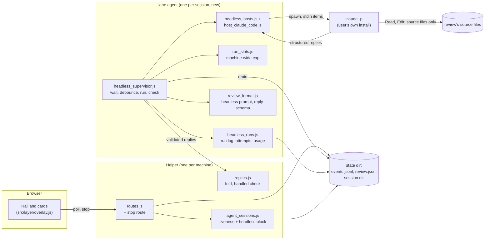
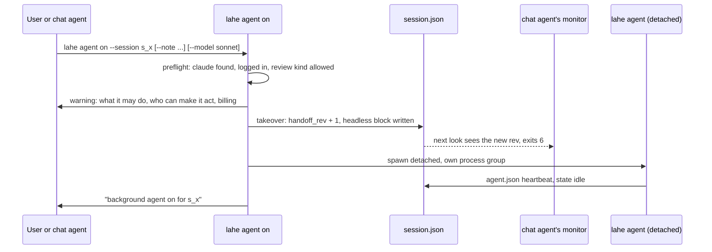
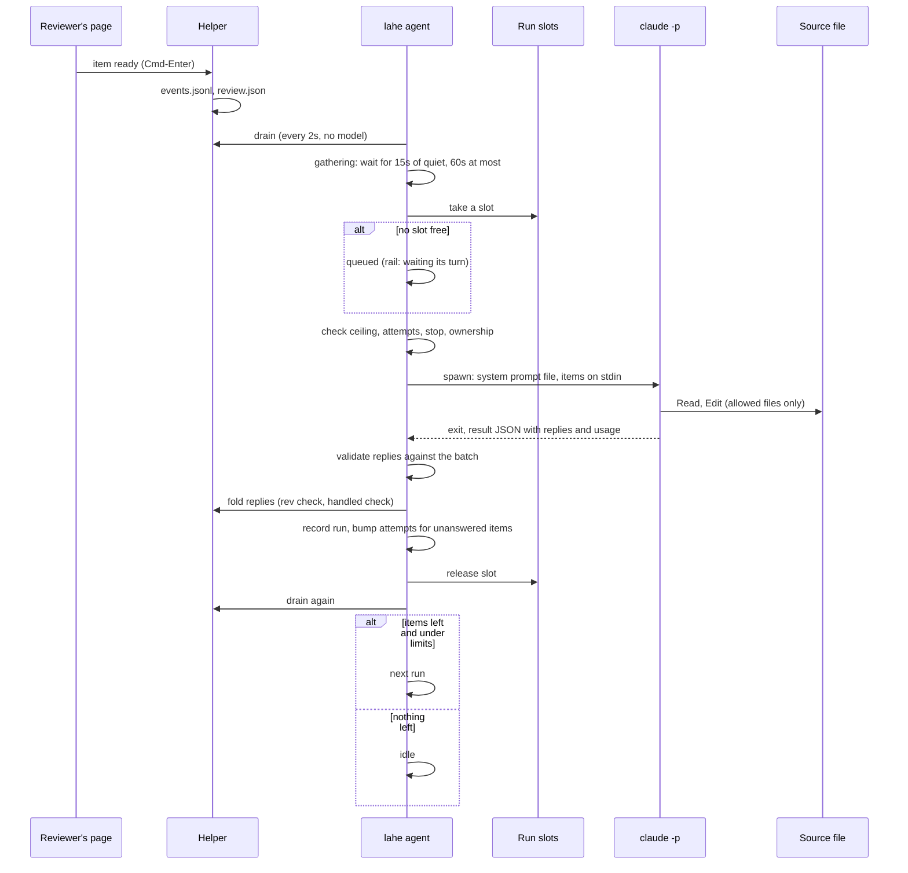
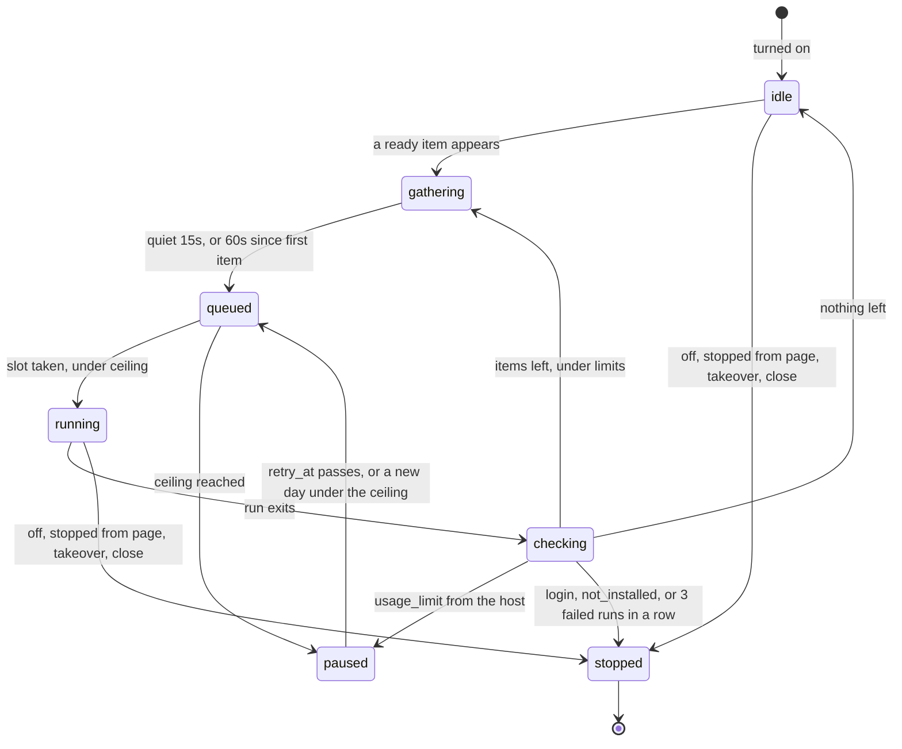
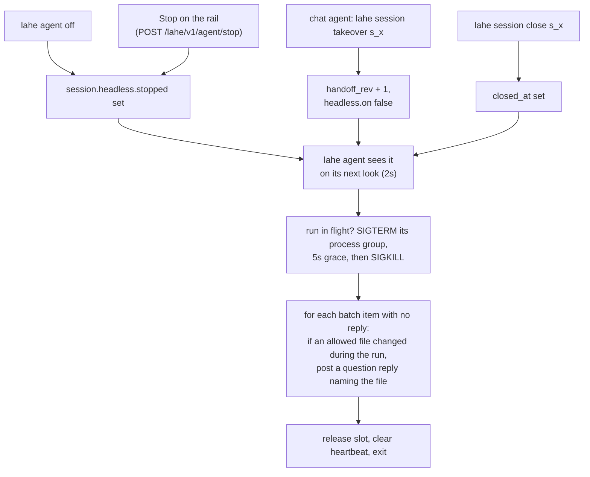
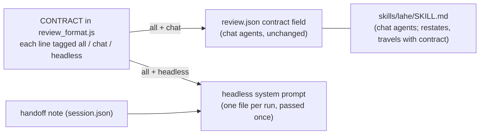

# Architecture: LAHE starts your agent when a comment is ready

Status: DRAFT, written without the owner. Every guess made on his behalf is listed under Assumptions.

## Summary

- **A small process per session does the listening.** Turning the mode on starts `lahe agent`, one Node process for that session. It waits for ready items the same way `lahe monitor` does, spending no model usage while nothing is waiting.
- **When work lands, it starts one headless run of the user's own agent.** For the first version that is `claude -p`, started lean (`--safe-mode`, `--restricted`), on the login the user already has. The run gets LAHE's rules once, in its system prompt, and the waiting items as data.
- **The run gets no shell.** It may read and edit only the review's own source files. It returns its replies as structured output at the end, and `lahe agent` checks them and writes them through the existing reply path.
- **LAHE checks the result, not the model.** After each run, `lahe agent` drains again, counts attempts per item, and stops retrying an item after three runs. A limit of two runs at once holds across the machine. A usage ceiling holds per session.
- **Ownership reuses today's handoff.** Turning the mode on is a session takeover. A chat agent taking the session back is a takeover too, and it stops the background agent.

Nothing here needs an install, an API key of LAHE's own, or a dependency. The wireframe doc is not in the folder yet; the rail section below names the states it has to draw and is marked pending on it.

## Analysis of Existing Structure

What exists and stays:

- **`lahe monitor`** (`src/cli/commands/monitor.js`) polls a session's drain in a Node loop and exits on work (0), close (5) or takeover (6). Its ownership check, heartbeat and duplicate guard are the pattern the new process copies.
- **Session ownership** (`src/service/agent_sessions.js`): one owner per session, a `handoff_rev` fence that every monitor checks, and a liveness object the rail reads.
- **The drain** (`lahe status --session <id> --json --quiet`) prints only item data, with page text under `page` (D12).
- **The reply path** (`src/service/replies.js`) folds reply lines, refuses a stale rev, and runs the handled check for hand edits (`src/service/handled_check.js`).
- **The contract** (`CONTRACT` in `src/shared/review_format.js`) is 50 lines, 3,174 words. It is written for a chat agent: 18 of its lines are about waking, monitors and hosts (count from `contract_split_count.js` in this folder).
- **The helper already starts detached processes** (static servers in `src/service/static_servers.js`, with a pid and a start identity it checks before signalling).

What changes: a new per-session process and its run records, an audience tag on each contract line, a structured-reply entry into the reply path, a stop route, new rail states, and one contract line ("no forever daemon") reworded.

## Components / Modules Touched



New:

- **`src/cli/commands/agent.js`**: `lahe agent on | off | status`, and the internal `lahe agent supervise` entry that the detached process runs.
- **`src/service/headless_supervisor.js`**: the loop. Waits for ready items, debounces a burst, takes a machine slot, starts a run, checks the result, counts attempts, obeys stop and ownership.
- **`src/service/headless_runs.js`**: the session's run log, per-item attempt counts, and the usage window the ceiling is checked against.
- **`src/service/run_slots.js`**: the machine-wide limit on runs at once, as lock files in the state directory.
- **`src/service/headless_hosts.js`** (the adapter registry and interface) and **`src/service/host_claude_code.js`** (the first adapter: builds the `claude` command, reads its result, names the failure).

Changed:

- **`src/shared/review_format.js`**: each contract line gets an audience tag (`all`, `chat`, `headless`). New builders: the headless system prompt, and the reply schema a run returns.
- **`src/shared/protocol.js`**: the headless states, fields, limits and the stop route, spelled once.
- **`src/service/agent_sessions.js`**: the `headless` block on `session.json`, the `agent.json` heartbeat, and a `headless` object inside the liveness answer.
- **`src/service/replies.js`**: an entry that takes replies from `lahe agent` (already parsed and checked) instead of from a reply file line. Same fold, same rev check, same handled check.
- **`src/service/routes.js`**: `POST /lahe/v1/agent/stop`.
- **`src/cli/commands/session.js`**: takeover and close clear the mode.
- **`src/layer/overlay.js`**: the new rail wording and the stop control.
- **`src/shared/manifest.js`**, **`skills/lahe/SKILL.md`**, **`docs/CONTRACTS.md`**, **`docs/CLI.md`**, **`test/unit/review_format.test.js`**: the manifest lists, and every restated copy of the contract (the skill and contract travel together).

Not touched: `lahe monitor`'s behaviour, the drain's output, the lifecycle table, the handled check's rules.

## Data / State Changes

### `session.json` gains a `headless` block

Written by `lahe agent on` and `off`, by takeover and close, and by the stop route (only its `stopped` field).

```json
"headless": {
  "on": true,
  "host": "claude-code",
  "model": "sonnet",
  "turned_on_at": "2026-09-29T15:02:11.204Z",
  "handoff_rev": 4,
  "note": "Short handoff note from whoever turned it on. Max 2,000 characters.",
  "allowed_files": ["/Users/ken/docs/plan.md"],
  "allow_api_key": false,
  "ceiling": { "runs_per_day": 40, "usage_usd_per_day": 3.0 },
  "stopped": null
}
```

`stopped`, when set: `{ "by": "reviewer" | "user" | "lahe", "reason": "<code>", "at": "<iso>" }`. Reason codes: `turned_off`, `stopped_from_page`, `ceiling`, `login`, `not_installed`, `failing`, `taken_over`, `closed`.

`allowed_files` is computed at turn-on and refreshed before each run. It comes only from what the CLI and the helper recorded (the review's `source_path` and target path, and linked files the helper resolved through `static_servers.linkedFileForPage`), never from anything a page posted. See Security.

### New files in the session directory (owner-only, like the rest)

- **`agent.json`**, the heartbeat of `lahe agent`: `{ "pid", "start_id", "handoff_rev", "at", "state", "run_id", "queued_since", "retry_at", "reason" }`. `state` is one of `idle`, `gathering`, `queued`, `running`, `paused`, `stopped`.
- **`runs.jsonl`**, one line per run:

```json
{"run_id":"run_0007","started_at":"...","ended_at":"...","items":[{"id":"c_7fa2","rev":2}],
 "replied":1,"outcome":"finished","failure":null,"exit_code":0,"turns":9,
 "usage":{"cost_usd_list":0.0536,"input":12,"output":1053,"cache_read":36630,"cache_write":8922}}
```

`outcome` is `finished`, `failed`, `stopped` or `timed_out`. `failure` is `null` or one of `login`, `usage_limit`, `not_installed`, `crashed`, `bad_output`.
- **`attempts.json`**: `{ "c_7fa2@2": 1 }`, runs that were given an item at a revision and ended without a reply for it.
- **`runs/<run_id>.jsonl`**: the run's stream, kept for the last 20 runs, for audit and for the "rules once" success metric.

### Machine-wide slots

`<state-dir>/run-slots/<n>.lock`, `n` from 1 to the cap. Each holds `{ "pid", "start_id", "session", "at" }`. Taking a slot is an exclusive create of the file; a slot whose pid is gone, or whose start identity no longer matches, is reclaimed.

### The reply schema a run returns (`--json-schema`)

```json
{
  "replies": [
    { "item": "c_7fa2", "rev": 2, "status": "handled", "text": "Changed \"utilize\" to \"use\".",
      "files": ["/Users/ken/docs/plan.md"], "needs_see": false }
  ],
  "summary": "one line"
}
```

`status` is `handled`, `not_handled` or `question`, as today. `lahe agent` refuses a reply for an item or revision that was not in the batch, a file outside `allowed_files`, or text over the existing bounds.

### The liveness answer gains `headless`

```json
"headless": { "state": "running", "reason": null, "since": "...", "retry_at": null,
              "runs_today": 6, "runs_limit": 40, "usage_today_usd": 0.41, "usage_limit_usd": 3.0 }
```

`null` when the mode is off. The page is never sent a path or the note.

### Contract lines get an audience

Each line in `CONTRACT` is tagged `all`, `chat` or `headless`. `review.json`'s `contract` field keeps carrying `all` and `chat` lines, so a chat agent sees exactly what it sees today. The headless prompt is `headless` plus `all`. A first keyword cut puts 32 lines (2,095 words) in `all` (`contract_split_count.js`); the plan does the real tagging.

## Key Flows

### Turning it on



- **Preflight** runs `claude --version` and `claude auth status`. It refuses when `claude` is missing or not logged in. It reports whether the login is a subscription or an API key, and whether `ANTHROPIC_API_KEY` or `ANTHROPIC_AUTH_TOKEN` is set.
- **Review kinds allowed in the first version:** Markdown that LAHE renders, and a static HTML file that is its own source. A review with a build step or a dev-server origin is refused, with a sentence saying why (Assumption A6).
- **The warning** (R6) is printed every time, in plain words. It says:
  - it will edit only the listed files and run no commands
  - anyone who can comment on this review can make it edit them
  - each run uses the user's Claude usage, or costs money on an API key
- **The takeover** is the existing one. The chat agent's monitor exits with 6, which the skill already reads as "stop, another agent owns this". The skill gains one sentence: if the session's background agent is on, tell the human that, and stop (answers Q3 structurally).

### A wake, one run



- **The batch** is every ready item the drain lists when the run starts, up to 25 (Assumption A4). The run's input on stdin is the drain lines exactly as a chat agent gets them. There is no instruction text in it, per item or per wake (R14).
- **Items that arrive during a run** wait for the next run (R11). A reworded item's old rev is refused on fold, as today, and the new rev goes in the next batch.
- **Verification is structural.** The model is asked to read back its edit, but LAHE does not depend on it. For Markdown the helper re-renders, and the handled check runs on the fold. An item the check holds stays ready and counts an attempt.
- **Replies land at the end of the run**, not one by one. This is the cost of having no shell (see Alternatives, "Replies by `lahe reply`").

### The supervisor's states



`stopped` ends the process. `lahe agent on` again (or `lahe review` re-entry on a session whose mode is still on and not stopped) starts a fresh one.

### Stopping, and handing back



- **R5 (a change made without a reply is named on the card).** `lahe agent` stamps each allowed file before the run (`src/service/source_stamp.js`). If a stopped or crashed run changed one, each unanswered item from that batch gets a `question` reply under the agent's name, such as "The background agent changed plan.md but stopped before answering this." A `question` leaves the item ready, so the next owner still sees it.
- **Handing back (R20)** is the existing takeover, with its existing promises: every unanswered item is on the new owner's catch-up drain, and nothing answered is shown again.
- **The page can only stop.** It can never turn the mode on, change the model, the files or the ceiling.

### Retries and failures

- **Per item: three attempts** at the same revision (Assumption A3). An attempt is a run that was given the item and ended without a reply folding for it, or whose `handled` was held by the check. After the third, `lahe agent` posts a `not_handled` reply under the agent's name: "The background agent tried three times and could not answer this." That takes it off the drain; rewording it on the card makes it ready again at a new revision, with a fresh count.
- **Per session: three failed runs in a row** stop the mode with reason `failing`.
- **Usage limit reported by the host** pauses instead of stopping: the first retry is 15 minutes out, then 30, then 60, and stays at 60. The rail shows the time of the next try.
- **Login expired or `claude` missing** stops the mode. A person has to fix these, so retrying only burns time.

### The system prompt: one source of the rules



- **R15 (one source).** The rules a run gets are the same lines a chat agent gets, from the same array. Only the lines about how to wait and how to wake differ, and those are tagged, not copied. A test asserts the headless prompt is exactly the `all` and `headless` lines in order, plus the note.
- **The `headless` lines** are the short preamble the spike proved. They say:
  - you were started because items are ready; they are on stdin as drain lines
  - handle each one, then return one reply per item in the schema
  - read back each edit before replying
  - do not wait, do not start anything, do not look for more work
- **The note (R25)** is appended under its own heading, "Notes from the person who turned this on". It is the only place for rules the lean start drops, such as the owner's writing rules from his CLAUDE.md (the spike's trade-off).
- **The prompt goes in by file** (`--append-system-prompt-file`), written to the session directory, and the items go on stdin. Neither appears in the process list.
- **The skill** stays the chat agent's guide. It gains a short section on turning the mode on and off. A headless run never reads it (safe mode loads no skills).
- **Size.** The spike's prompt was 377 words. The `all` plus `headless` lines are larger (the first cut is 2,095 words before the preamble). That adds context to every run. The plan's first task measures it against the spike's 9,000 tokens per request (Open Question OQ2).

### The run's command (Claude Code adapter)

The adapter builds this from the run spec. Flags, not code:

| Flag | Why |
| --- | --- |
| `-p`, items on stdin | headless, one batch |
| `--safe-mode` | no CLAUDE.md, hooks, MCP, skills: the lean start the spike measured, and a hostile project's own settings cannot run |
| `--restricted` | removes Bash and other code-running tools, ignores settings files, confines file tools to the working directory |
| `--tools Read,Edit` | the only two tools |
| `--allowedTools` with `Read(<file>)` and `Edit(<file>)` for each allowed file | nothing else is readable or editable |
| `--permission-mode dontAsk`, `--permission-prompts none` | anything else is refused, never asked |
| `--append-system-prompt-file <path>` | the rules, once |
| `--json-schema <reply schema>` | replies as structured output |
| `--output-format stream-json --verbose` | usage, turns, tool calls, for the run log and audit |
| `--max-budget-usd 0.50` | a per-run backstop (Assumption A2) |
| `--no-session-persistence` | no transcript left in the user's Claude history |
| `--model <model>` | `sonnet` by default (Assumption A1) |
| never `--bare` | it drops the subscription login |

- **cwd** is the directory of the first allowed file.
- **Environment:** the parent's `CLAUDE*` variables are removed, as in the spike. `ANTHROPIC_API_KEY` and `ANTHROPIC_AUTH_TOKEN` are removed unless the user passed `--allow-api-key`, which the warning then prices.
- **Wall-clock limit:** 10 minutes per run (Assumption A2). The slowest spike run took 33 seconds.

### Usage ceiling (R23, R24)

- **Two limits per session, over a rolling 24 hours:** 40 runs, and $3.00 of Claude Code's own list-price estimate (`total_cost_usd`). At the spike's lean costs ($0.0338 to $0.1227 per run), $3.00 covers about 24 to 88 runs. The run count is the backstop for a host that reports no usage.
- **When either is reached,** no run starts, items stay ready, and the rail says why and when it resets.
- **Set with** `lahe agent on --ceiling-runs N --ceiling-usd X`. Never from the page.
- **The subscription's own limit** cannot be read (the spike found `/usage` reports whole percentages across the account). The ceiling is LAHE's own count, and it is labelled that way.
- **`lahe agent status`** prints runs and usage per session (R24).

### Machine-wide cap (R12)

Two runs at once across all sessions (Assumption A5). A session that finds no free slot is `queued`, and the rail says "waiting its turn". Slots are taken in no particular order. Fairness beyond that is not needed at two slots.

### What the rail shows (pending the wireframe)

The wireframe doc is not in the folder yet. These are the states it has to draw, from `agent_liveness.headless`. The existing rule holds: none of the words monitor, heartbeat, wake feed, watching, or unattended appear.

| State | Meaning | Loud |
| --- | --- | --- |
| idle | on, nothing waiting | no |
| gathering or running | working on the reviewer's items | no |
| queued | waiting for another review's run to finish | no |
| paused, ceiling | the session hit its usage ceiling; says when it resets | yes |
| paused, usage limit | the account hit its limit; says the next try | yes |
| stopped | says why: turned off, stopped from the page, login expired, not installed, kept failing | yes, except when turned off or stopped from the page |

The stop control (R18) appears only while the mode is on. What it looks like, and whether it confirms, is the wireframe's call. A card that hit the retry limit shows the `not_handled` reply like any other.

## Alternatives Considered

- **The Agent SDK as an add-on package.** Considered because it is the owner's original question and gives full control from code. Rejected: it needs an API key and per-token billing, an install that breaks the zero-dependency rule, and it works for Claude only. Everything this design needs (a system prompt, tool limits, structured output, usage numbers) is available as `claude -p` flags. Whether to keep it as a documented option for API-key users is Q7.
- **A Stop hook in the owner's chat (crucible Approach C).** Keeps the chat's full context and adds no process. Not chosen as this feature, because it still needs the agent to start its watcher, it installs into the user's own settings, and it keeps his chat busy with review work. It is not rejected outright: whether to ship it first is Q6.
- **A background Claude Code session per review (`claude --bg`, joined with `claude attach`).** Considered because it is interactive and on the subscription. Rejected: inside that session the watcher is still a background command, so the memory kills and the forgetting come back. It is also Claude-only and depends on a young feature LAHE does not control.
- **The helper owns the runs.** Considered because the helper is already long-lived, sees every session, and could hold the machine cap in memory. Rejected: `lahe add` restarts the helper when it predates a review, which would kill or orphan a run mid-edit. The helper also stops when the last session closes. A per-session process fails alone, and its stop and handoff checks are the same fence monitors already obey.
- **A hook on `lahe monitor`'s exit (the spike's shape).** A shell loop of "monitor, then `claude -p`, then monitor". Rejected as the product shape: it needs something outside LAHE to own the loop, it has no machine cap, ceiling or retry count, and a chat agent would have to start it, which is the step agents forget.
- **One long-running run per review** (`--input-format stream-json`, or `--resume` of one session). Considered for the prompt cache. Rejected: history piles up in one context, which is the repetition R14 exists to prevent, and one long process holds memory on a machine that is short of it. The spike showed a fresh lean run costs about 9,000 tokens per request, which is small enough.
- **Forking the chat that opened the review.** Would carry everything said in chat. Rejected for the first version: it brings back the 107,000 to 138,000 tokens per request the spike measured with the full setup. The handoff note covers the gap; Q2 can revisit.
- **Replies by `lahe reply` through a shell.** This is what the spike proved, with `Bash(lahe *)`. Kept as the fallback if structured output fails the plan's first check. Not the default, because any shell grant is the widest door a hostile comment can reach. `Bash(lahe *)` also allows `lahe review` of any path, `lahe session close` and takeover of other sessions. Even an exact-prefix rule leaves command-substitution and redirection handling to Claude Code's matcher.
- **Letting the model verify, rather than LAHE.** The spike's runs skipped the read-back twice. So the prompt still asks for it, but the handled check and the next drain are what decide.

## Failure Modes / Edge Cases

| Case | What happens |
| --- | --- |
| `claude` not installed or not logged in at turn-on | `lahe agent on` refuses, saying which. Nothing starts. |
| Login expires mid-session | The run fails with `login`. Mode stops. Rail: "stopped: sign-in expired". Items stay ready. |
| Account usage limit hit | `usage_limit`: paused with backoff (15, 30, 60 minutes). Not counted as an item attempt. |
| Run crashes or its output does not match the schema | `crashed` or `bad_output`. Attempts are counted for every batch item. Three failed runs in a row stop the mode. |
| Run exceeds 10 minutes | Killed as in a stop. `timed_out`. Changed files are named on the unanswered cards. |
| `lahe agent` itself dies (reboot, kill) | Its heartbeat goes stale and its pid is gone. The rail shows "stopped" (the liveness check reads the pid, as it does for monitors). `lahe review` re-entry or `lahe agent on` restarts it. A slot it held is reclaimed. |
| Two `lahe agent` processes on one session | The duplicate guard from `monitor.js`: fresh heartbeat, same handoff rev, live pid. The second exits. |
| Reviewer rewords an item mid-run | The run's reply names the old rev and is refused on fold. The new rev is in the next batch. |
| Reviewer holds comments | Held items are not on the drain, so nothing starts. Release sends them at once, and they gather into one run. |
| A reply names an item not in the batch, or a file not allowed | That reply is dropped and logged; the rest fold. |
| An allowed file is renamed or deleted | Refreshed before each run. A review with no allowed file left stops with reason `failing` and says so. |
| The review is ended from the page | The ended review is on the drain as today. The run handles its items. The end-of-review routine (writing out hand edits) is left to a chat agent in the first version (Assumption A8). |
| `lahe session close` | The process stops any run, exits, and the helper closes as today. |

## Security & Privacy Notes

### Who can make it act

With the mode on, anyone who can post a ready item makes an agent act, with nobody reading first (R6, R21). Under D11, posting needs the review's token. The token is readable by any script on the reviewed page, on any page under the served root, and on linked documents (D11's stated residual). So the honest statement is: **anyone who can run script in a page of this review, or who has the token, can make the background agent act.**

The design does not try to tell a real reviewer from a script. It limits what acting can do:

- **No shell, no network, no other tools.** `--restricted`, `--tools Read,Edit` and `dontAsk` leave only reading and editing.
- **Exact files.** Read and Edit are allowed on `allowed_files` only. This matters for exfiltration. If the run could read other files, a hostile comment could ask it to copy a secret (a `.env`, a key) into the document, which the page's own script could then read. Confined to the review's own sources, a hostile comment can only change text the page could already see.
- **The allowed list comes from trusted places only.** The drain's `source_hint` comes from a `page.visited` event the page posts (`src/service/projection.js`), so a page could name any path. `allowed_files` uses only the CLI-recorded `source_path` and target, and linked files the helper resolved itself. Real paths decide. Nothing in the state directory, no dot-prefixed path, and nothing outside the home directory, under the same rules as linked-file mounts.
- **Replies are checked against the batch.** A run cannot answer an item it was not given, or name a file it may not touch.
- **Denial of usage.** A script that posts a thousand items meets the batch cap (25), the machine cap (2), the per-run budget, and the session ceiling. The worst case is the ceiling's worth of usage, then a loud rail.

### Page text is data (D12)

The run's input is the drain, where page text sits under `page`, and the D12 line is in the `all` group, so every run gets it once. For a run nobody watches, this line is not the guard; the capability limits above are. A page that talks the model into misbehaving can still only edit the review's own files.

### Things the run does not get

- The user's CLAUDE.md, hooks, MCP servers and skills, through `--safe-mode`. This also means a hostile repository's `.claude/settings.json` or CLAUDE.md cannot run or steer anything.
- An API key, unless the user allowed it.
- The review token. It is never in the prompt or the environment.

### Turning on and configuration

Only the CLI (the user's own account) can turn the mode on, and only the CLI can set the files, model, note or ceiling. The page's one control is stop, behind the full D11 checks. Stop is the safe direction, so a script that stops the mode does no harm beyond silence, and the rail says who stopped it.

### Privacy

The run streams in `runs/` hold document text and replies. They sit in the owner-only session directory and only the last 20 are kept. `--no-session-persistence` keeps runs out of the user's Claude history.

### Subscription terms

Anthropic's Consumer Terms, Section 3, bar accessing the Services "through automated or non-human means, whether through a bot, script, or otherwise", except "via an Anthropic API Key or where we otherwise explicitly permit it" ([Consumer Terms](https://www.anthropic.com/legal/consumer-terms), quoted via a fetch today; check the page). Claude Code's docs describe `claude -p` for scripts, and a long-lived token "for CI pipelines, scripts" that "authenticates with your Claude subscription" ([Authentication](https://code.claude.com/docs/en/authentication), cited by the spike). Whether that counts as "explicitly permit" for this use is not settled here. It is Open Question OQ1, and it gates offering the mode to launch users.

## Other hosts later (R4)

The adapter interface, as a shape:

```json
{
  "id": "claude-code",
  "preflight": "-> { ok, login: 'subscription'|'api_key'|'none', version, reason }",
  "invocation": "(runSpec) -> { command, args, env, cwd, stdin }",
  "readResult": "(stdout, stderr, exitCode) -> { replies, usage, turns, failure }",
  "supports": { "structured_output": true, "file_confinement": true, "no_shell": true, "usage_report": true }
}
```

`runSpec` holds the allowed files, prompt file path, items, reply schema, model and budget. The supervisor never names a host's flags.

A host is added when it can do four things:

- run headless on the user's own login
- confine file access to named files, or to a folder
- run without a shell
- return replies as structured output, or through a narrow reply command

Codex (`codex exec`) and Gemini (`gemini -p`) both have headless modes (crucible). Their confinement and structured-output flags are not checked here. A host whose `supports` lacks `no_shell` or `structured_output` falls back to `lahe reply` through its narrowest command rule, and the turn-on warning says it has a shell.

## Test Strategy

- **Unit, no model calls in the gate.** A fake host, a small Node script standing in for `claude`, reads stdin and prints a scripted result. Cases:
  - a clean batch
  - a crash
  - a timeout
  - `login` and `usage_limit` failures
  - bad output
  - a reply for an item not in the batch
  - a reply naming a file outside the list
  - a run that edits a file and is then stopped
- **Supervisor:**
  - debounce: a burst of five items starts one run
  - the three-attempt retry limit
  - three failed runs in a row stop the mode
  - usage-limit backoff times
  - ceiling by runs and by usage
  - takeover, close, off and page-stop each end a run in flight
  - the duplicate guard
- **Slots:** the cap holds across two stores sharing one state directory; a dead holder's slot is reclaimed.
- **Prompt:**
  - the headless prompt is exactly the `all` and `headless` lines plus the note
  - `review.json`'s contract is unchanged for chat agents
  - the stdin payload holds no line from `CONTRACT`
- **Security:**
  - `allowed_files` ignores a page-posted `source_hint` pointing elsewhere
  - dotfiles, the state directory, symlinks out of home, and paths outside home are refused
  - the stop route passes the D11 checks, and only stops
  - the child env has no `CLAUDE*`, and no API key unless allowed
  - the adapter's arguments never contain `--bare` or `Bash`
- **Browser (one named spec):** the rail's new wording for each state, and the stop control, with screenshots in light and dark.
- **Live, outside the gate:** an opt-in script that runs the spike's three-item review through `lahe agent` against real `claude`. It records usage and correctness, and it is the "rules once" transcript check at 1, 10 and 100 items. The dogfood review is the success-metric run.

## Open Questions

New ones only; the brief's Q1 to Q8 still stand.

- **OQ1 (subscription terms).** Does the Consumer Terms exception ("where we otherwise explicitly permit it") cover a script that starts `claude -p` on each comment? The docs support scripted use; the terms do not name it. This does not block the owner's dogfood decision, but it blocks offering the mode to launch users.
- **OQ2 (unmeasured flags).** `--restricted`, `--json-schema`, `--append-system-prompt-file` and per-file `Read(...)` rules were not in the spike. Neither was the larger prompt. The plan's first task is a spike repeat with these flags. If structured output or file-level rules fail, the fallback is `lahe reply` through `Bash(lahe reply --review <id> *)`, and the warning changes.
- **OQ3 (the numbers).** The numbers below are guesses the owner may want to change:
  - two runs at once
  - three attempts per item
  - 40 runs and $3.00 estimated per session per day
  - $0.50 and 10 minutes per run
  - 15 seconds of quiet before a run, 60 seconds at most
  - 25 items per run
- **OQ4 (build-output pages).** The first version refuses them. Supporting them means `lahe agent` runs a build command the user names at turn-on, after the run, outside the model. Should that be in the first version?

## Assumptions made for the owner

- **A1.** Sonnet is the default model. The spike found it as accurate as Opus on this job and faster. `--model` overrides it.
- **A2.** Per-run limits: $0.50 list-price estimate and 10 minutes. The spike's slowest lean run was $0.12 and its slowest run of any kind 33 seconds.
- **A3.** Three attempts per item revision before the card says the agent could not handle it.
- **A4.** A run takes at most 25 items. A bigger burst becomes more runs.
- **A5.** Two runs at once across the machine, given the memory pressure in the brief.
- **A6.** The first version covers Markdown reviews and static HTML that is its own source. That matches the owner's dogfood, which is mostly LAHE's own Markdown docs.
- **A7.** Turning the mode on is a takeover, so the chat agent's monitor stops. The chat agent learns this from exit 6 and one new sentence in the skill (answers Q3).
- **A8.** The end-of-review routine (writing hand edits out beside the document) stays with a chat agent in the first version.
- **A9.** The contract line "Do not use a native model timer, a forever daemon..." becomes: a chat agent never starts a long-lived process of its own, and the background mode is the only one, started by `lahe agent on`. This is the deliberate change the brief's Rollout asked for.
- **A10.** The rail reports LAHE's own usage count, not the subscription's remaining limit, which cannot be read.

## Architect Review

Summary table only. Full review prose lives in `02_architecture_lahe_agent_sdk_reviews.md`.

Pending.

## Security Review

Summary table only. Full review prose lives in `02_architecture_lahe_agent_sdk_reviews.md`.

Pending.
