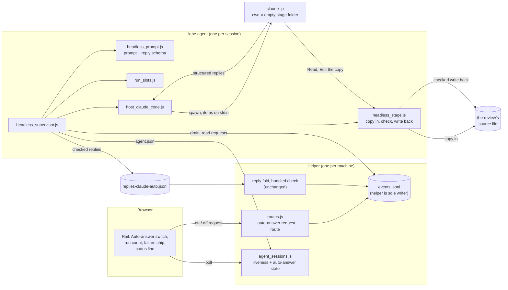
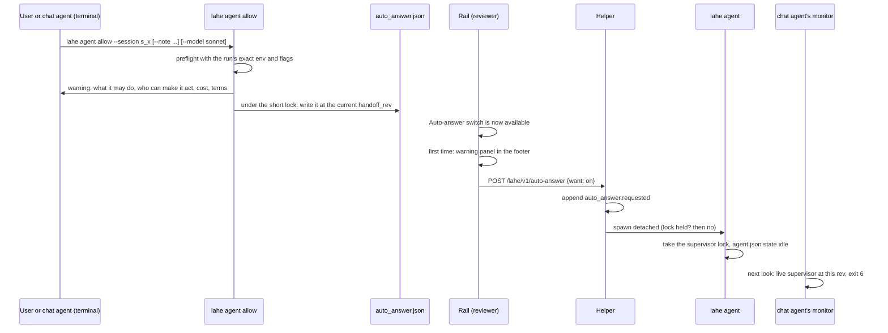
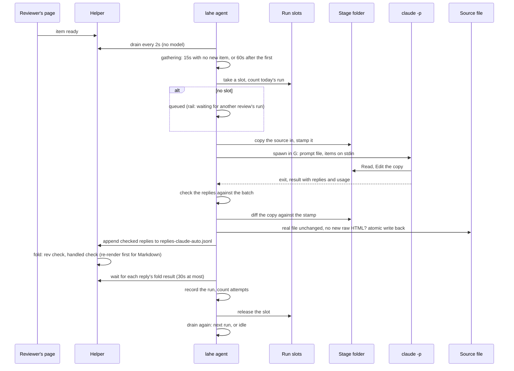
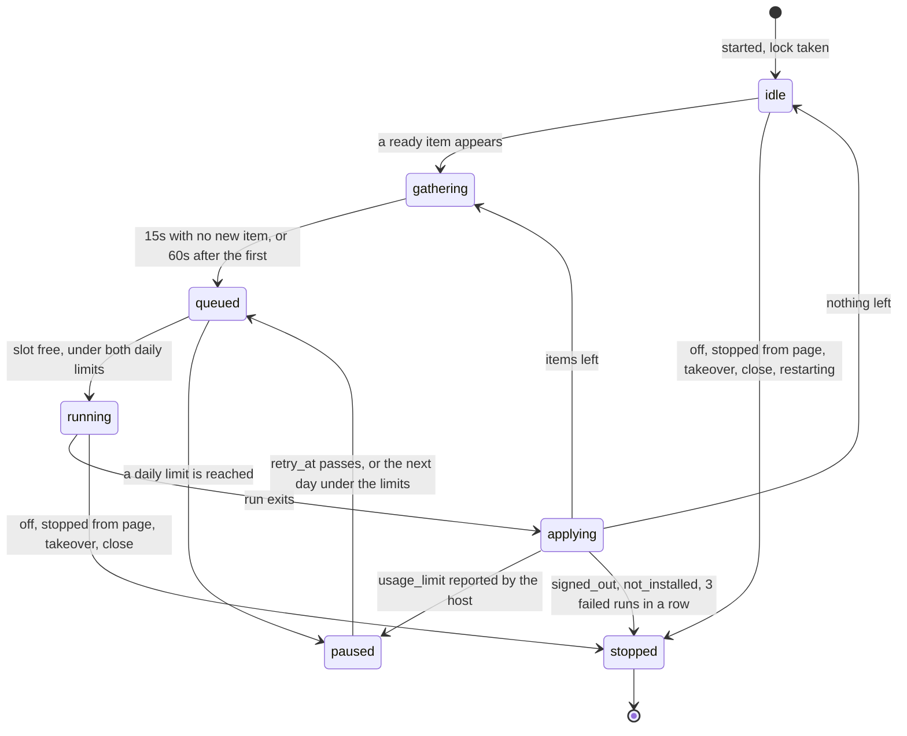
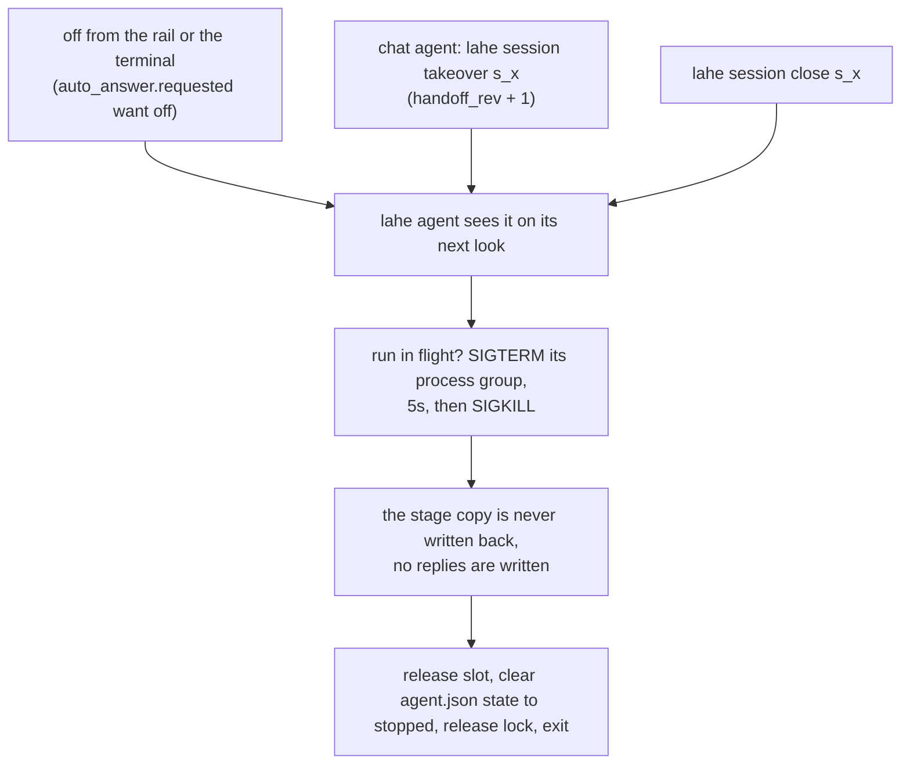
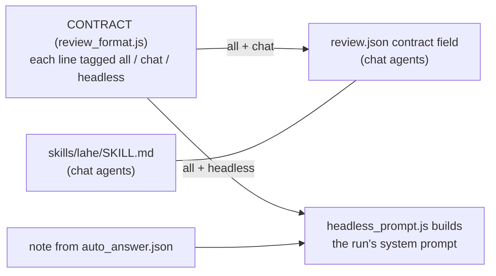

# Architecture: LAHE starts your agent when a comment is ready

Status: DRAFT, written without the owner. The architect and security reviewers have reviewed it, and their tables are at the end. The plan's reviews changed several sections, and the plan's review tables list those changes. Every guess made on the owner's behalf is listed under Assumptions.

## Summary

- **A small process per session does the listening.** When auto-answer is on, `lahe agent` runs for that session. It waits for ready items the way `lahe monitor` does, and spends no model usage while nothing is waiting.
- **When work lands, it starts one headless run of the user's own agent.** For the first version that is `claude -p`, on the login the user already has. It starts lean: no CLAUDE.md, hooks, MCP or skills. The run gets LAHE's rules once, in its system prompt, and the waiting items as data.
- **The run works on copies, in an empty folder.** It gets no shell. It can read and edit only a copy of the review's one source file. LAHE checks the edit and writes it to the real file itself. It then writes the run's replies to a reply file, and the helper folds them in the same way it folds a chat agent's replies.
- **LAHE enforces the limits itself.** It drains again after each run, counts attempts per item, and gives up on an item after three. Two runs at most run at once across the machine, and there is a daily run limit per session and per machine.
- **Permission comes from the terminal. The on and off switch is on the page.** A person or chat agent allows auto-answer for a session once, from the terminal. After that, the rail's Auto-answer switch (wireframe direction B) turns it on and off. Turning it on stops the chat agent's monitor. A chat agent that takes the session back stops auto-answer.
- **First version:** the owner's dogfood, one Markdown review per auto-answer session, macOS and Linux only.
- **One caveat:** Anthropic's Consumer Terms bar scripted access except by API key or where Anthropic "explicitly permit[s] it". Whether a script starting `claude -p` on a subscription counts is not settled (OQ1, subscription terms). Running the dogfood on the owner's subscription is his call.

Nothing here needs an install, an API key of LAHE's own, or a dependency.

## Analysis of Existing Structure

What exists and is reused:

- **`lahe monitor`** (`src/cli/commands/monitor.js`) polls the drain in a Node loop and exits on work (0), close (5) or takeover (6). Its ownership check and heartbeat are the pattern `lahe agent` copies. Its duplicate guard is not atomic, and its own comments say so, so `lahe agent` does not copy it.
- **Session ownership** (`src/service/agent_sessions.js`): one owner per session, the `handoff_rev` fence, and the liveness object the rail reads.
- **The drain** (`lahe status --session <id> --json --quiet`) prints item data only, with page text under `page` (D12).
- **The helper is the only writer of `events.jsonl`** (`src/service/log.js`). Agents append reply lines to their own `replies-<agent>.jsonl`, and the helper folds them, refuses a stale rev, and runs the handled check for hand edits.
- **A lock pattern exists** (`withServerLock` and `takeOverStaleLock` in `src/service/static_servers.js`): an exclusive-create lock file with stale takeover.
- **The contract** (`CONTRACT` in `src/shared/review_format.js`, shipped in the browser bundle) is 50 lines and 3,174 words, written for a chat agent. Sorting its lines by keyword puts 18 of them (1,079 words) in the group about waking and hosts, which only a chat agent needs. `contract_split_count.js` in this folder does the count.

What changes:

- a new per-session process, `lahe agent`, and its records
- a Node-only prompt builder and a staging area
- an audience tag on each contract line, and a few transport lines reworded
- `lahe monitor` and `lahe review` stand down while auto-answer is on
- two page requests (on and off) that go through the event log
- new rail pieces

## Components / Modules Touched



New:

- **`src/cli/commands/agent.js`**: `lahe agent allow | disallow | on | off | status`, and the internal `lahe agent supervise` that the detached process runs. It is registered in `src/cli/index.js`.
- **`src/service/headless_supervisor.js`**: the loop. It waits for ready items, lets a burst settle, takes a machine slot, starts a run, checks and applies the result, counts attempts, and obeys stop requests and the handoff fence.
- **`src/service/headless_stage.js`**: the per-run folder. It copies the source in, diffs and checks the result, and writes it back safely.
- **`src/service/headless_prompt.js`** (Node only, not in the bundle): builds the system prompt from the tagged contract, the reply schema from `REPLY_FIELD` and `REPLY_REQUIRED`, and the run's stdin from the drain.
- **`src/service/run_slots.js`**: the machine-wide limits, both runs at once and runs per day.
- **`src/service/host_claude_code.js`**: the one host adapter. It builds the `claude` command and environment, reads the result, and names the failure.
- **`src/service/locks.js`**: two kinds of lock in one shared module.
  - **A short lock**: `withServerLock` and `takeOverStaleLock`, moved out of `static_servers.js` unchanged. They hold a lock only while a callback runs, and treat it as stale after 20 seconds. Static servers and the daily counts use it.
  - **A lock held for a process's life**: new. It is stale only when its pid and that pid's start time no longer match a live process, however old the file is. The supervisor lock and the run slots use it. `ps` runs with `LC_ALL=C TZ=UTC`, so the start time reads the same from the helper and the CLI.
- **`src/service/file_stamp.js`**: a stamp of a user file (content hash, size, mtime). It is not `source_stamp.js`, which stamps LAHE's own code.

Changed:

- **`src/shared/review_format.js`**: a new `CONTRACT_LINES` list of `{ tag, text }`, with each tag `all`, `chat` or `headless`. `CONTRACT` stays a list of strings, and becomes the `all` and `chat` lines in order, so today's readers of it keep working. A few transport lines are reworded to fit both kinds of agent.
- **`src/shared/protocol.js`**: the auto-answer states, reasons, rail words, limits, event kinds and the route, spelled once, next to `AGENT_LIVENESS`. `SERVICE_CONTRACT` goes from 13 to 14, so an older running helper is restarted instead of refusing the new event and route.
- **`src/service/agent_sessions.js`**: reads `agent.json`, counts a live supervisor at the current rev as listening, and adds the `auto_answer` object to the liveness answer.
- **`src/service/routes.js`**: `POST /lahe/v1/auto-answer`. The generic events route refuses `auto_answer.requested`, so the page cannot skip the new route by posting that event directly.
- **`src/service/projection.js`**: folds `auto_answer.requested` into the latest request for the review.
- **`src/service/replies.js`** (the fold): while auto-answer holds a review, a reply from any other agent is rejected with reason `auto_answer_owns`. The rest of the fold is unchanged.
- **`src/service/index.js`** (the helper): starts `lahe agent supervise` when an "on" request lands for an allowed session, and restarts it when "on" still stands but no live supervisor holds the lock.
- **`src/cli/commands/monitor.js`**: exits with 6 when a live supervisor holds the current rev. Its exit-6 words say auto-answer took the session, and that `lahe session takeover` takes it back.
- **`src/cli/commands/review.js`**: on re-entry into such a session, it says auto-answer owns it and prints no monitor instructions.
- **`src/cli/commands/review.js` and `add.js`**: both refuse to add a second review to a session auto-answer holds.
- **`src/layer/overlay.js`, `sync.js`, `index.js` and `tab_done.js`**:
  - the Auto-answer switch and its post
  - the run count, failure chip and status words
  - the rail repainting when `auto_answer` changes
  - the overdue banner, late rings and overdue toasts switched off while auto-answer is on
- **Docs and copies:**
  - `src/shared/manifest.js`
  - `skills/lahe/SKILL.md`
  - `docs/CONTRACTS.md`
  - `docs/CLI.md`
  - `docs/diagrams/session_ownership.md`
  - `test/unit/review_format.test.js`

  The skill and the contract travel together.

Not touched: the lifecycle table and the handled check's rules.

## Data / State Changes

### One review per auto-answer session

A session can own several reviews, but auto-answer holds exactly one. `lahe agent allow` names the review, and refuses when the session owns more than one. While the allowance holds, `lahe review` and `lahe add` refuse to add a second review to that session. So every auto-answer file below belongs to that one review: the "on" and "off" events go in its `events.jsonl`, the reply file sits in its folder, and the supervisor drains only its items.

### One writer per file

| File | Only writer | Holds |
| --- | --- | --- |
| `auto_answer.json` (session folder) | `lahe agent allow` and `disallow`, under the short lock | what the user allowed |
| `events.jsonl` (the review's) | the helper | on and off requests, as events |
| `agent.json` | `lahe agent` | what it is doing now |
| `runs.jsonl`, `attempts.json`, `runs/` | `lahe agent` | run history |
| `replies-claude-auto.jsonl` | `lahe agent` (append only) | the run's checked replies, for the helper to fold |
| `run-slots/` | whichever `lahe agent` takes a slot (exclusive create) | the machine-wide limits |

### `auto_answer.json`, the allowance (written only by `lahe agent allow` and `disallow`)

It is its own file, not a block in `session.json`, because `session.json` has several whole-file writers (create, takeover, close, name) that take no lock. A race there could write an old `handoff_rev` back over a takeover.

```json
{
  "allowed_at": "2026-09-29T15:02:11.204Z",
  "handoff_rev": 4,
  "review": "r657344998844",
  "host": "claude-code",
  "claude_path": "/Users/ken/.local/bin/claude",
  "model": "sonnet",
  "source_file": "/Users/ken/docs/plan.md",
  "note": "Short note from whoever allowed it. At most 2,000 characters.",
  "env": { "HOME": "...", "PATH": "...", "USER": "...", "LANG": "...", "TMPDIR": "...", "CLAUDE_CONFIG_DIR": "..." },
  "runs_per_day": 40
}
```

- **Allowed means** that this file's `handoff_rev` equals the session's `handoff_rev`. A takeover bumps the session's rev and never touches this file, so a takeover ends the allowance too. Auto-answer can then only come back through `lahe agent allow`, from a terminal.
- **`env`** is the environment allowlist, recorded from the shell that ran `allow`. The helper starts the supervisor, so the supervisor inherits whatever shell started the helper. The run's environment is built only from this record. That way preflight tests the same environment the run will get. No API key is ever recorded or passed (see the run's command).
- **`source_file`** is the review's CLI-recorded `source_path`, resolved to a real path when auto-answer is allowed. It is never the page-posted `source_hint`, and never a linked file.
- **Turn-on is refused** when the file is an instruction file:
  - `CLAUDE.md`, `AGENTS.md`, `GEMINI.md`, `SKILL.md`
  - anything under `skills/`, `.claude/` or `.github/`
  - a dot-prefixed path
  - anything in the state directory, or outside the home directory

### On and off are events, and the page may only ask

`POST /lahe/v1/auto-answer` takes one field, `want`, which is `on` or `off`. It refuses any other value and ignores every other field. It passes the D11 checks, and the helper appends `auto_answer.requested` with `{ "want": "on" | "off", "from": "page" | "terminal" }` to that review's `events.jsonl`. The helper sets `from` itself, from the `x-lahe-client` header (`layer` or `cli`); the body never sets it. `lahe agent on` and `off` post to the same route with the review token from the state folder, the way `lahe add` reaches the helper. The page never writes owner state, and the generic events route refuses this event type.

- **"On" for a session that is not allowed** does nothing but record the request. The rail then shows the switch as not available, with the terminal command to allow it (see the rail section).
- **"On" for an allowed session** makes the helper start `lahe agent supervise --session <id> --state-dir <dir>` (detached, its own process group) unless a live one holds the lock. It runs the same Node binary as the helper, with the clone's `bin/lahe.js`.
- **"On" still stands, but no supervisor is alive** (it was killed, or it exited to restart on new code): the helper starts a new one the next time the page asks for liveness. Until one holds the lock, the rail shows "starting". More than three starts in ten minutes stops auto-answer with reason `failing`.
- **"Off"** is read by the supervisor on its next look.

### `agent.json`, the supervisor's own state

```json
{ "pid": 4121, "started": "Tue Sep 29 15:02:12 2026", "handoff_rev": 4, "at": "...",
  "state": "running", "reason": null, "since": "...", "retry_at": null,
  "run": { "run_id": "run_0007", "pgid": 4188, "started": "Tue Sep 29 15:06:40 2026", "items": 2 },
  "runs_today": 6, "tokens_today": 58210 }
```

- **`started`** is the process start time as `ps -o lstart= -p <pid>` prints it. A pid only counts as the same process when both the pid and that start time match. That is how a reused pid is told apart from the original, since this process has no port to answer a health check.
- **`state`** is one of `starting`, `idle`, `gathering`, `queued`, `running`, `applying`, `paused` or `stopped`.
- **`reason`** is one of `turned_off`, `stopped_from_page`, `taken_over`, `closed`, `limit_session`, `limit_machine`, `usage_limit`, `signed_out`, `not_installed`, `source_missing`, `failing`, `restarting`, or `null`.
- **`tokens_today`** adds up each run's reported input and output tokens. Cache reads and writes are left out.

### Run records

- **`runs.jsonl`**, one line per run:

```json
{"run_id":"run_0007","started_at":"...","ended_at":"...","items":[{"id":"c_7fa2","rev":2}],
 "outcome":"finished","failure":null,"exit_code":0,"turns":9,
 "applied":{"file":"/Users/ken/docs/plan.md","before":"sha256:...","after":"sha256:..."},
 "replies_written":2,"replies_folded":2,
 "usage":{"input":12,"output":1053,"cache_read":36630,"cache_write":8922,"cost_usd_list":0.0536}}
```

  - `outcome` is `finished`, `failed`, `stopped`, `timed_out`, `refused` (the edit failed a check) or `conflict` (the real file changed during the run).
  - `failure` is `null` or one of `signed_out`, `usage_limit`, `not_installed`, `crashed`, `bad_output`.
- **`attempts.json`** counts attempts per item, both per revision and across all revisions: `{ "c_7fa2": { "2": 1, "all": 3 } }`.
- **`runs/<run_id>/`** holds the stage folder `work/` (with the one copy), `result.json`, and a trimmed `log.jsonl`. The log keeps tool names, paths, sizes, usage and the replies, and drops every tool result. The prompt file sits outside `work/` and is removed when the run ends, however it ends. The last 20 run folders are kept. Each applied run also writes its diff to `runs/<run_id>/diff.patch`, so `lahe agent status --diffs` shows the edits of the kept runs, and hashes only for older ones.

### Machine-wide slots

`<state-dir>/run-slots/` holds two slot files at most (`1.lock`, `2.lock`), each `{ "pid", "started", "pgid", "session", "at" }`. It also holds `today.json`, the machine's run count for the local calendar day, updated under the shared lock. A slot is taken by exclusive create. It is reclaimed only when its pid and start time no longer match a live process and its run group is gone.

### The reply schema a run returns

Built from `REPLY_FIELD` and `REPLY_REQUIRED` in `protocol.js`, so the names cannot drift. A test asserts they match.

```json
{
  "replies": [
    { "item": "c_7fa2", "rev": 2, "status": "handled", "text": "Changed \"utilize\" to \"use\".",
      "user_needs_to_see_reply": false },
    { "item": "c_81b0", "rev": 1, "status": "not_handled", "reason": "..." },
    { "item": "c_90d3", "rev": 1, "status": "question", "text": "What is this year's figure?" }
  ]
}
```

- **The run never names files.** `lahe agent` fills `files` from its own before and after stamps. When a run changed the file, every `handled` reply from that run lists it.
- **`text` and `reason` are capped at 500 characters** in the schema, and checked again. A reply over the cap is dropped and logged, not cut short. Its item then has no reply, which counts as an attempt.
- **A reply for an item or revision not in the batch is dropped** and logged.

### The liveness answer gains `auto_answer`

```json
"auto_answer": { "available": true, "on": true, "state": "running", "reason": null,
                 "since": "...", "retry_at": null, "working_on": 2,
                 "runs_today": 6, "runs_limit": 40, "tokens_today": 58210 }
```

- **`null`** when the session has never been allowed.
- **`available`** is false when the session is not allowed at the current rev.
- The page is never sent a path, the note, or a dollar figure.

## Key Flows

### Allowing it, then turning it on



- **Preflight** runs `claude --version` and `claude auth status` at the recorded absolute path, with the environment it then records in `auto_answer.json`. It refuses when `claude` is missing or signed out, when the source file is not allowed, or when the session owns more than one review. It reports whether the login is a subscription or billed by the token.
- **The terminal warning** (R6, say what it may do) is printed every time. It says:
  - it edits only this one file and runs no commands
  - anyone who can comment on this review, or run script in its pages, can make it edit that file, and the file may later be read by agents that do have a shell
  - each run uses the user's Claude usage, and costs money when the Claude login is billed by the token
  - the subscription terms question (OQ1, whether the terms allow this)

  The plan pins its exact words.
- **`lahe agent on --session s_x`** is `allow` followed by an "on" request, for a user who wants it on from the terminal.
- **The chat agent learns from exit 6**, which the skill already reads as "stop, another agent owns this". The skill gains one sentence: when auto-answer is on for your session, tell the human and stop (answers Q3, telling the chat agent). `lahe review` re-entry into such a session says the same and prints no monitor instructions.

### A wake, one run



**The batch**

- Every ready item the drain lists when the run starts goes in, up to 25 items and 100 KB of input in all.
- An item whose reviewer text (note plus change) is over 8,000 characters is not sent. It gets a `not_handled` reply: "Too long for auto-answer; a chat agent can take it." D12 forbids cutting reviewer text, so the item is refused whole.

**The stdin payload** is the drain's item lines, cut to a fixed list of fields. Each item keeps what the reviewer wrote (`note`, `change`), its identity (`review`, `id`, `rev`, `kind`), its thread, and the page text under `page`. The page's `path`, `origin` and `linked_file` are dropped, and so is the drain's summary line. Each item's `source_hint` is replaced by the stage path of the copy. There is no instruction text in it, per item or per wake (R14, rules once per run). The supervisor drains in its own process, through `status.js` with `suppressActivityTouch` set, as `lahe monitor` does, so its looks never make the rail say an agent is working.

**Items that arrive mid-run** wait for the next run (R11, nothing is lost). If the reviewer rewords an item mid-run, the run's reply names the old rev, and the helper refuses it at fold.

**Checks before anything reaches the real file:**

- The run must have ended `finished`, with output that matches the schema.
- The real file's stamp must still match the one taken at copy-in. If it does not, the outcome is `conflict`: nothing is written or replied, and the items go into the next run with a fresh copy. A conflict is not an attempt, but it does count toward the stop after three failed runs in a row. The next copy-in waits until the file has been unchanged for 15 seconds, so an owner typing in the file does not start run after run.
- If the copy changed, every item in the batch must have a reply. A finished run that edited the file but left an item without a reply is `refused`: nothing is written and no reply is sent, so no change reaches the file without a reply beside it. One case gets past this check: the run edits an item's passage and also replies `question` for that item.
- The diff must add no raw HTML tag, no `on…=` attribute and no `javascript:` URL. If it does, the outcome is `refused`: nothing is written, and each `handled` reply in the run becomes `not_handled` with the reason "Auto-answer does not add raw HTML or scripts; a chat agent can do this."
- The write-back re-checks the target at write time. It must be a regular file, not a symlink, at the same real path, owned by the user. The new text goes to a temp file beside it, which is then renamed over the target.

**Replies go through the helper, as any agent's do.** `lahe agent` appends them with `reply.js`'s encoder. It then reads the review's `events.jsonl` for a `reply.folded` or `reply.rejected` matching each reply's item and rev, before it counts attempts or drains. When the handled check holds a reply back, the helper still writes a `reply.folded`, marked to say the change is not on the page. A reply that has been written but not yet folded counts as answered, so the next drain cannot hand the item out twice. If no fold result arrives in 30 seconds (the helper is down), nothing is counted, the timeout is logged, and the loop goes on.

**If `lahe agent` dies between writing the file back and writing the replies,** `runs.jsonl` shows `applied` with `replies_written: 0`. `result.json` is still in the run folder, so the next supervisor finishes the replies before it does anything else.

### The supervisor's states



- **Every look** (every 2 seconds) checks:
  - the session is open
  - the rev still matches
  - the latest request is not "off"
  - its own code is not older than the clone
- **Stale code** restarts it cleanly: it releases its lock and exits with reason `restarting`, and the helper starts a fresh supervisor on the same allowance, as for any dead supervisor. This matters because the owner dogfoods LAHE on LAHE while editing LAHE.
- **Gathering has a ceiling** of 60 seconds after the first item, so a steady trickle of comments still gets answered.

### Stopping, and handing back



- **Stopping is always clean (R5).** A stopped, crashed or timed-out run changed only its copy, so the real file never holds a change that no reply explains. Every item it was given stays ready, on the drain, for the next run or the next owner.
- **Handing back (R20, hand it back)** is the existing takeover. Every unanswered item is on the new owner's catch-up drain, and nothing answered shows again.
- **Leftover runs.** A new supervisor first reads `agent.json`. If a run's process group from before is still alive (pid and start time match), it kills that group before doing anything else. The orphan's edits were only ever to its stage copy.

### Retries, failures and limits

- **Attempts count only on `finished` runs.** An attempt is one of:
  - a finished run was given the item and no reply for it folded
  - its `handled` was held by the check
- **The attempt limits:** three attempts at one revision, or six across all revisions of one item. Then `lahe agent` writes a `not_handled` reply: "Auto-answer could not answer this and stopped trying. Reply here yourself, or hand the review to a chat agent." That takes the item off the drain. Rewording it on the card makes it ready again, until the six-attempt limit.
- **Three failed runs in a row** (crashed, bad output, timed out) stop auto-answer with reason `failing`. No item's attempts are used up by a failing tool.
- **A usage limit reported by the host** pauses auto-answer for a fixed 30 minutes, and the rail shows the time of the next try.
- **Signed out or `claude` missing** stops auto-answer. A person has to fix these.
- **Daily limits** count runs per local calendar day: 40 per session (set with `--runs-per-day` at allow time) and 120 across the machine. Reaching either pauses until the next day. `--max-budget-usd 0.50` caps each run.
- **The account's own limit cannot be read.** The spike found that `/usage` gives only a whole percentage for the whole account. The rail shows LAHE's own run count against LAHE's own limit, and says so in hover text.

### The system prompt: one source of the rules



- **R15 (one source of rules).** Every rule about the work lives on one line, in one array. A line only a chat agent can use (waking, monitors, hosts, `lahe reply`, "this file") is tagged `chat`. A line only a run can use is tagged `headless`. Neither kind is a copy of the other: they say different things about different transports.
- **The chat contract changes once, on purpose.** The few `all` lines that say "append a reply line" are reworded to name the reply's fields without naming the transport. The `chat` lines say how a chat agent sends one (`lahe reply`), and the `headless` lines say a run returns them in its result. `test/unit/review_format.test.js`, `docs/CONTRACTS.md` and the skill change with it.
- **The `headless` lines** are the short preamble the spike proved. They say:
  - you were started because items are ready; they are on stdin as drain lines
  - the only file you may read or edit is the one each item's `source_hint` names
  - read back each edit before replying
  - return one reply per item
  - do not wait, start anything, or look for more work
- **The note (R25, a handoff note)** goes last, under its own heading. The lean start skips the user's CLAUDE.md, so any rule from it that a run needs goes in the note. The owner's writing rules are the main example (the spike's trade-off). Only the terminal can set it.
- **A test asserts** that the prompt is exactly the `all` and `headless` lines in order, plus the note, and that the stdin payload contains no `CONTRACT` line.
- **Size.** The spike's prompt was 377 words. The first cut of the `all` group alone is 2,095 words. The flags spike (OQ2) measures what that adds per request against the first spike's 9,000 tokens.

### The run's command (Claude Code adapter)

The adapter passes these flags, each with its reason:

| Flag | Why |
| --- | --- |
| `-p`, items on stdin, cwd = the empty stage `work/` folder | headless, one batch; the copy is the only file in reach |
| `--safe-mode` | no CLAUDE.md, hooks, MCP, skills: the lean start the spike measured |
| `--restricted` | no Bash or other code-running tools, no settings files, file tools confined to the working folder |
| `--strict-mcp-config`, `--setting-sources ""` | a second guard on top of the two above |
| `--tools Read,Edit` | the only two tools |
| `--permission-mode dontAsk`, `--permission-prompts none` | anything else is refused, never asked |
| `--append-system-prompt-file <path>` | the rules, once, kept out of the process list |
| `--json-schema <reply schema>` | replies as structured output |
| `--output-format stream-json --verbose` | usage, turns, tool calls; trimmed before it is kept |
| `--max-budget-usd 0.50` | per-run backstop |
| `--no-session-persistence` | nothing left in the user's Claude history |
| `--model <model>` | `sonnet` by default |
| never `--bare`, never `Bash` | `--bare` drops the subscription login |

- **Environment: an allowlist, not a blocklist.**
  - `HOME`, `PATH`, `USER`, `LANG` and `TMPDIR` pass through.
  - So does `CLAUDE_CONFIG_DIR`, if it was set at allow time.
  - `ANTHROPIC_API_KEY` never passes, and is never recorded. A user whose Claude login itself is billed by the token (preflight says so) is warned that each run costs money.
  - Nothing else passes, whatever shell started it.
- **`claude` is run by the absolute path recorded at allow time.**
- **Wall-clock limit:** 10 minutes per run. The slowest spike run took 33 seconds.

### What the rail shows (wireframe direction B)

The wireframe doc is `02_wireframe_lahe_agent_sdk.md`, with screens in `wireframes/index.html`. It recommends direction B, and this design follows it.

- **The Auto-answer switch** is a pill beside Hold sending, in the footer.
  - When the session is not allowed, the pill is present but inert. It explains that auto-answer is allowed from the terminal, and shows the `lahe agent allow --session <id>` command to copy. The session id is already sent to the page, so this adds no path.
  - When allowed, the first "on" in a session opens the warning panel in the footer, where End review's confirm opens today. The panel says what it may do, who can make it act, and what it uses.
  - Turning it off takes one click while idle. It asks for one confirm while a run is working, because it cuts the run off.
- **The run count** sits beside the pill, like Hold's queued count, as "6 runs". Opening it shows today's runs against the limit, and tokens where Claude reports them. No dollar figure: on a subscription the list price is not a charge.
- **The failure chip** sits under the switch while a failure stands. It holds one plain sentence and one remedy per reason, from a fixed list in `protocol.js`, plus a catch-all.
- **The status line stays the one agent line.** While auto-answer is on, its words come from `auto_answer.state`, which LAHE knows rather than guesses. `livenessFrom` also counts a live supervisor at the current rev as listening, so the two cannot disagree.

The table below shows which states make the status line loud and which show the chip. The exact words for every state, chip and panel are pinned in the plan ("Words this plan pins").

| State | Loud | Chip |
| --- | --- | --- |
| starting, idle, gathering, running, queued | no | no |
| one failed run, retrying | no | yes |
| paused, a daily limit or the usage limit | yes | yes |
| stopped: signed out, not installed, file gone, failing | yes | yes, with the reason and remedy (the status line says only "stopped") |
| off (turned off, from page or terminal) | as today | no |

**The overdue banner stands down while auto-answer is on.** Today, after a wait with nothing listening, a banner says "Check your agent's window first" and offers the handoff button. With auto-answer on there is no window to check, and LAHE knows what is running. So:

- **While on and healthy** (idle, gathering, running, queued), nothing counts as overdue:
  - no banner
  - no late ring on a card
  - no overdue toast
  - no "nothing back yet" escalation

  A long run stays calm and shows its age ("working on 2, 6m") until the 10-minute limit ends it. At that point it becomes a failed run, and the chip says so.
- **While paused or stopped by a failure,** the status line goes loud, and the chip gives the reason and the remedy. The banner does not say "check your agent's window". Its hand-off button stays, since a chat agent taking over is a real remedy. Copy review and Export review stay in the head menu, as always.
- **A card the runs gave up on** wears the amber ring a late card wears today, with its "Not handled" pill and the reply's reason. Both mean "this needs you".
- **After auto-answer is turned off,** or a chat agent takes over, the rail goes back to today's rules exactly.

Rail words never include monitor, heartbeat, wake feed, watching, or unattended (the existing rule). The wireframe doc says why directions A and C were not taken.

## Alternatives Considered

- **The Agent SDK as an add-on package.** It is the owner's original question, and it gives full control from code. Rejected:
  - it needs an API key and per-token billing
  - it needs an install, which breaks the zero-dependency rule
  - it works for Claude only

  Everything this design needs is a `claude -p` flag. Whether to keep the SDK as a documented option for API-key users is Q7 (the SDK).
- **A Stop hook in the owner's chat (crucible Approach C).** Not chosen as this feature:
  - it still needs the agent to start its watcher
  - it installs into the user's own settings
  - it keeps his chat busy with review work

  It is not rejected outright; whether to ship it first is Q6 (order).
- **A background Claude Code session per review (`claude --bg`).** Rejected:
  - inside it, the watcher is still a background command, so both old problems return: the watcher gets killed for memory, and the agent forgets to restart it
  - it is Claude-only
  - it depends on a young feature LAHE does not control
- **The helper owns the runs.** The helper is long-lived and sees every session. Rejected because:
  - the helper restarts whenever `lahe add` finds it older than the clone's code, or when it refuses a write
  - a run inside it would die or be orphaned then
  - separate processes keep a run's memory and failures away from page serving

  The helper still does two jobs: it folds the replies, and it starts the supervisor when the page asks.
- **A hook on `lahe monitor`'s exit (the spike's shape).** Rejected as the product: something outside LAHE would own the loop, with no limits or retries, and a chat agent would have to start it, which is the step agents forget.
- **One long-running run per review** (`--input-format stream-json`, or `--resume`). Rejected:
  - history piles up in one context, which R14 (rules once per run) exists to prevent
  - it holds memory on a machine that is short of it
  - a fresh lean run was measured at about 9,000 tokens per request
- **Forking the chat.** It brings back the 107,000 to 138,000 tokens per request the spike measured. The note covers the gap. Q2 (how much of the chat a run gets) can revisit this.
- **Replies by `lahe reply` through a shell.** The spike proved it with `Bash(lahe *)`. Rejected, including as a fallback:
  - any shell grant is the widest door a hostile comment can reach
  - `Bash(lahe *)` also allows `lahe review` of any path and closing or taking over other sessions

  If structured output fails the flags spike (OQ2), the design stops and comes back, rather than granting a shell.
- **Per-file `Read(...)` and `Edit(...)` rules in the real folder.** The security reviewer's live test showed that Read rules grant access and never restrict it. The run read a `.env` beside the source. Replaced by the empty stage folder.
- **Linked files and static HTML in the first version.** Dropped:
  - linked files would let a page add files the run can edit, just by visiting links
  - HTML reviews make a planted script easy
  - both come back only with their own checks
- **A reply marker on stopped items.** Rejected. The marker would be a `question` reply, which takes the item off the drain. With copy-in, copy-out, a stopped run never touches the real file, so no marker is needed.
- **Letting the page allow auto-answer.** The wireframe's step 2 turns it on from the page. The switch does that here too, but only after the terminal has allowed the session. Otherwise any script holding the review token could start an agent. See OQ5 (who may switch it on).

## Failure Modes / Edge Cases

Only cases the flows above do not already settle.

| Case | What happens |
| --- | --- |
| Two supervisors start at once (page "on" and `lahe agent on`) | The supervisor lock is an exclusive create. The second exits before it does anything. |
| A supervisor is running and `lahe agent allow` runs again | It rewrites `auto_answer.json` under the short lock at the same rev. The running supervisor picks up model, note and limit changes before its next run and does not restart. |
| The source file is renamed or deleted | The next copy-in fails. Auto-answer stops with reason `source_missing`, and the chip says the file is gone. |
| A branch switch swaps the file for a symlink mid-run | The write-back check refuses it. The outcome is `conflict`. |
| The Markdown already contained raw HTML, and the run keeps it | Only additions are refused. HTML that was already there is left alone. |
| A reviewer's reply to a run's question | The item goes back to ready as today, and the next run takes it. The thread field carries the question as history. |
| The review is ended from the page | Its items are drained and answered as usual. The end-of-review routine (writing hand edits out beside the document) stays with a chat agent in the first version. |
| Hold is on | Held items are not on the drain, so no run starts. Release sends them at once, and they settle into one run. |
| Windows | `lahe agent allow` refuses there in the first version: process groups and `ps -o lstart` are POSIX. |
| The machine sleeps mid-run | On wake, the 10-minute limit usually has passed. The run is killed as `timed_out`, which counts toward the three-in-a-row stop, not toward attempts. |

## Security & Privacy Notes

### Who can make it act

With auto-answer on, anyone who can post a ready item makes an agent act, with nobody reading first (R6, say who can make it act; R21, page text is data). Under D11, posting needs the review token. The token is readable by any script on the reviewed page and on any page under the served root. So, plainly: **anyone who has the token, or can run script in a page of this review, can make auto-answer edit the review's source file.**

The design does not try to tell a real reviewer from a script. It limits what acting can do:

- **One file, as a copy, in an empty folder.** The run cannot see anything else on disk. The security reviewer's live test showed that this matters: permission rules alone let a run read a `.env` beside the source.
- **No shell, network, MCP, hooks or settings.** `--restricted`, `--safe-mode`, `--strict-mcp-config`, `--setting-sources ""` and `--tools Read,Edit`. A hostile repository's `.claude/settings.json` or CLAUDE.md cannot run or steer anything.
- **No planted script.** Edits that add raw HTML, event attributes or `javascript:` URLs are refused, and the first version reviews Markdown only. Separately from this feature, rendered Markdown passes raw HTML through today with no CSP. That goes on the board as its own security row.
- **LAHE writes the file, not the model.** It writes after checks, with no-symlink, same-path, owner and atomic rules.
- **Replies are checked.** Each reply must be for its own batch, is capped at 500 characters, and carries a file list that LAHE computed itself. Reply text is the easiest way to leak something to the page, so it is kept short. The run can only see the copy, so there is little to leak.
- **The allowance lives in the terminal.** The page can only ask for on or off, as an event through D11's checks, with every other body field ignored. A takeover ends the allowance.
- **Limits:**
  - 25 items and 100 KB per run
  - 8,000 characters of reviewer text per item
  - two runs at once
  - 40 runs per session and 120 per machine each day
  - $0.50 per run
  - attempt counts that do not reset forever on rewording

  A script that floods items gets, at worst, a day's runs on one file, then a loud rail.

### The residual that stays

**The edited file may be instructions for a later agent.** The owner dogfoods on LAHE's own feature docs, which builder agents later read and act on with a shell. An auto-answer edit could plant an instruction there, and a later full-permission session could follow it. The first version narrows this and says it out loud:

- instruction files and dot paths are refused
- the terminal warning names the risk
- `lahe agent status --diffs` shows the edits of the last 20 runs, and the before and after hashes of older ones

A diff on the card itself is deferred to after dogfood (it would change what the wireframe settled on for cards). The owner commits these docs by hand, which is a second look.

### Page text is data (D12)

The run's input is the drain, with page text under `page`, and the D12 line is in the `all` group, so every run gets it once. The page-posted `source_hint` is replaced before the run sees it. For a run nobody watches, the D12 line is not the guard. The capability limits above are. The source file's own text is also untrusted input, and the same limits contain it.

### Credentials and environment

- The child environment is an allowlist.
- No API key passes to a run. A login billed by the token is named in the warning.
- Preflight runs with the run's exact environment and binary, so what it reports is what the run uses.
- The review token is never in the prompt, the stdin or the environment.

### Privacy

- Run logs keep tool names, paths, sizes, usage and replies, never tool results.
- The prompt file is removed when a run ends.
- The last 20 run folders are kept, in the owner-only session directory. Session folders stay after close, as they do today.
- `--no-session-persistence` keeps runs out of the user's Claude history.

### Subscription terms

Anthropic's Consumer Terms, Section 3, bar accessing the Services "through automated or non-human means, whether through a bot, script, or otherwise", except "via an Anthropic API Key or where we otherwise explicitly permit it" ([Consumer Terms](https://www.anthropic.com/legal/consumer-terms)). The quote was read by a web fetch today and still needs a person to check it against the page. Claude Code's docs describe `claude -p` for scripts, and a token "for CI pipelines, scripts" that "authenticates with your Claude subscription" ([Authentication](https://code.claude.com/docs/en/authentication), cited by the spike). Whether that is the explicit permission the terms mean, for this use, is OQ1 (subscription terms). Running the dogfood on the owner's subscription is his decision, recorded when he makes it.

## Other hosts later (R4, Claude Code first)

`host_claude_code.js` is the only file that knows about Claude Code. The supervisor passes it a run spec and gets back a result. The supervisor never names a host's flags. The shapes:

```json
{ "run_spec": { "stage_dir": "...", "prompt_file": "...", "stdin": "...", "reply_schema": {},
                "model": "sonnet", "budget_usd": 0.5, "timeout_ms": 600000, "env": {} },
  "result":   { "replies": [], "usage": {}, "turns": 9, "failure": null } }
```

A second host gets its own adapter file, beside this one, when it arrives. It must be able to do four things:

- run headless on the user's own login
- confine files to a working folder
- run without a shell
- return structured output

Codex (`codex exec`) and Gemini (`gemini -p`) have headless modes (crucible). Their confinement and output flags are not checked here. A host that cannot run without a shell is not added.

## Test Strategy

The plan's Test List holds every case. The strategy behind it:

- **No model calls in the gate.** A fake host, a small Node script standing in for `claude`, reads stdin and prints a scripted result. Its output is copied from real runs.
- **Time and crashes are injected.** Every timed step takes an injected clock, and the engine has hooks that crash it at an exact step.
- **Races run in separate processes.** Lock and slot tests race real child processes.
- **Integration tests use the real pieces.** After the branches merge, tests run the real helper, the real `lahe agent` and the fake `claude` together.
- **The rail gets one named browser spec,** with screenshots in light and dark.
- **Live, outside the gate: the flags spike (OQ2) and a live check with the real `claude`.** They cover what a fake cannot:
  - the exact flag set
  - a planted `.env` beside the stage's original that must not be readable
  - a hostile comment asking for a `<script>` that must be refused
  - the structured output and the prompt size
  - how a usage limit is reported
  - whether `--max-budget-usd` applies on a subscription
  - the "rules once" transcript check at 1, 10 and 100 items

The dogfood review is the success-metric run.

## To verify before the build

**OQ2 (the flags spike).** The first spike did not run these, and they have to be checked before the build:

- `--restricted`
- `--json-schema`
- `--append-system-prompt-file`
- `--strict-mcp-config`
- `--setting-sources ""`
- the larger prompt

The plan's Task 0.2 runs it. If structured output does not work, this design comes back for a decision instead of granting a shell.

## Open Questions

New ones only. The brief's questions still stand, except Q3 (telling the chat agent), which Assumption A7 answers. The plan gathers every question in one list, each with a default.

- **OQ1 (subscription terms).** Does the Consumer Terms exception cover a script that starts `claude -p` on each comment? The docs support scripted use; the terms do not name it. The owner decides the dogfood. Offering auto-answer to launch users waits on this.
- **OQ3 (the numbers).** Every limit and wait in this design is a guess. Are they right? The plan's "Numbers this plan sets" lists each one.
- **OQ4 (beyond Markdown).** Is Markdown only acceptable for the first version? Static HTML, linked files and build-output pages each need their own checks first:
  - added-script checks for HTML
  - a fixed file list for links
  - a build that LAHE runs after the run, outside the model
- **OQ5 (who may switch it on).** The wireframe has the reviewer turn auto-answer on from the page. Here the page can do that only after the terminal has allowed the session. Is that extra first step acceptable?
- **OQ6 (instruction residual).** Is auto-answer on LAHE's own feature docs acceptable for dogfood, given the residual above? Or should the first dogfood use documents no agent reads as instructions?

## Assumptions made for the owner

- **A1.** Sonnet is the default model. The spike found it as accurate as Opus on this job, and faster.
- **A2.** Per-run limits are $0.50 (Claude Code's list-price estimate) and 10 minutes.
- **A3.** Three attempts per revision, six per item, then the card says auto-answer could not handle it.
- **A4.** A run takes at most 25 items and 100 KB. A bigger burst becomes more runs.
- **A5.** Two runs at once across the machine, and 120 runs a day, given the memory pressure in the brief.
- **A6.** The first version covers Markdown reviews of one source file, on macOS and Linux.
- **A7.** Turning auto-answer on stops the chat agent's monitor (exit 6). A chat agent's takeover ends auto-answer and its allowance. This answers Q3 (telling the chat agent).
- **A8.** The end-of-review routine stays with a chat agent in the first version.
- **A9.** The contract line "Do not use a native model timer, a forever daemon..." becomes: a chat agent never starts a long-lived process of its own, and auto-answer is the only one, started by LAHE. This is the deliberate change the brief's Rollout asked for.
- **A10.** The rail shows LAHE's own run count and tokens, not the subscription's remaining limit (which cannot be read) and not dollars.
- **A11.** The reply agent name is `claude-auto`, so a run's replies land in their own file and never share one with a chat agent's. The card shows that name like any agent's.
- **A12.** The wireframe's direction B is the rail design, with "Auto-answer" as a working name.

## Architect Review

Summary table only. Full review prose lives in `02_architecture_lahe_agent_sdk_reviews.md`.

| # | Finding | Disposition | Rationale |
|---|---------|-------------|-----------|
| RF1 | The supervisor would be a second writer of `events.jsonl` | Accepted | Replies go to `replies-claude-auto.jsonl` for the helper to fold; the supervisor waits for fold results before counting or draining |
| RF2 | A `question` reply takes an item off the drain, so the stop marker lost items | Accepted | No marker reply; copy-in, copy-out means a stopped run never changes the real file |
| RF3 | Five writers share `session.json` with no lock | Accepted | One writer per file (table in Data); "allowed" derived from the rev; page requests are events |
| RF4 | Duplicate guard not atomic; a chat monitor can run beside the mode | Accepted | Exclusive-create supervisor lock in a shared `locks.js`; monitor exits 6 and `lahe review` stands down while it is on |
| RF5 | A killed supervisor leaves an orphan run; start identity claim was false | Accepted | Run group and `ps -o lstart` start time recorded; a new supervisor kills leftovers; POSIX only in v1 |
| RF6 | Failed runs would use up every item's attempts | Accepted | Attempts count only on finished runs |
| RF7 | Tagging is not one source; schema missing `reason`, renamed field | Accepted | Transport lines reworded once for both agents; schema built from `REPLY_FIELD` and `REPLY_REQUIRED`, with a test |
| RF8 | `source_stamp.js` is the wrong module; long-lived process can go stale | Accepted | New `file_stamp.js`; supervisor checks its own code each look and restarts when stale |
| RF9 | Today's liveness would read "no agent" while a run works | Accepted | A live supervisor at the rev counts as listening; the rail's words come from `auto_answer.state` |
| RF10 | Allow rules grant, not restrict | Accepted | Empty per-run stage folder with a copy; LAHE writes back |
| RF11 | Wrong reason given against the helper owning runs | Accepted | Reason reworded; the helper starts supervisors on the page's request |
| RF12 | Over-built: registry, dollar ceiling, backoff ladder, two timers | Accepted | One adapter file, run-count limits only, fixed 30-minute pause, one 15-second window |
| RF13 | `review_format.js` ships in the browser bundle | Accepted | Only the tags go there; prompt and schema live in `src/service/headless_prompt.js`; two behaviours added to OQ2 |

## Security Review

Summary table only. Full review prose lives in `02_architecture_lahe_agent_sdk_reviews.md`.

| # | Finding | Disposition | Rationale |
|---|---------|-------------|-----------|
| RF1 | Live test: the run read `.env` beside the source despite Read rules | Accepted | Empty stage folder with one copy; a planted-`.env` test in the OQ2 spike |
| RF2 | The agent can plant script; Markdown passes raw HTML | Accepted | Added raw HTML, `on…` attributes and `javascript:` URLs refused; v1 is Markdown only; the Markdown raw-HTML issue goes on the board as its own row |
| RF3 | Edited files may be instructions for later agents; page can grow linked files | Partly accepted | One source file, no linked files; instruction files refused; risk in the warning; `lahe agent status --diffs`. A diff on the card is deferred; OQ6 asks the owner |
| RF4 | The run's input carries a page-set `source_hint` | Accepted | Replaced with the stage path; test that the page's hint never appears |
| RF5 | Stop route would write `session.json` from the page | Accepted | On and off are events through the D11 path; the route reads only `want` |
| RF6 | Child environment was a blocklist | Accepted | Allowlist; preflight with the same env; absolute `claude` path |
| RF7 | Caps counted items, not bytes; attempts reset on rewording; ceilings per session only | Accepted | Byte caps per run and per item; 120-run machine limit; six attempts per item across revisions |
| RF8 | Model's `files` and long reply text trusted | Accepted | Files from LAHE's stamps; 500-character cap; no shell fallback |
| RF9 | Symlink swap mid-run is followed | Accepted | LAHE's own write-back with no-symlink, same-path, atomic checks; test |
| RF10 | Run streams keep every Read result | Accepted | Logs trimmed; prompt file removed after the run; retention stated |
| RF11 | Terms risk only in Security | Accepted | Summary line and warning line added; the quote still needs a person to check it; dogfood choice is the owner's |
| RF12 | `--safe-mode` plus `--restricted` never measured | Accepted | `--strict-mcp-config` and `--setting-sources ""` added; OQ2 runs the `.env` and script tests |
