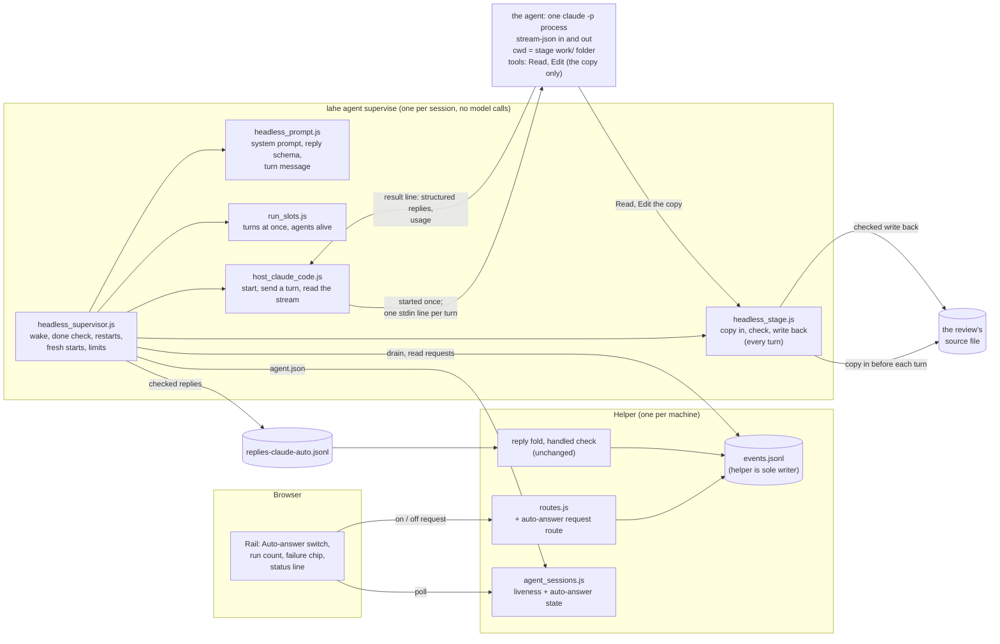
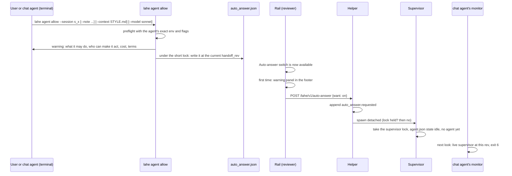
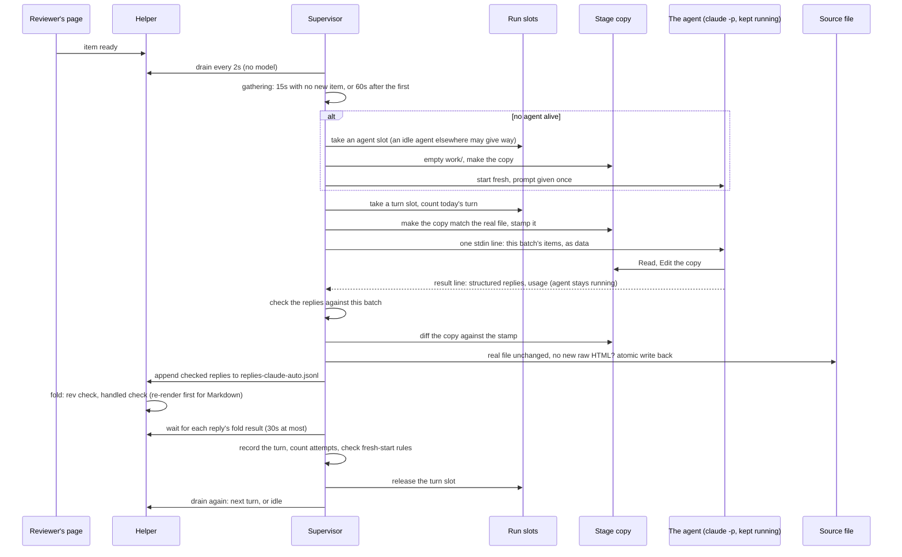
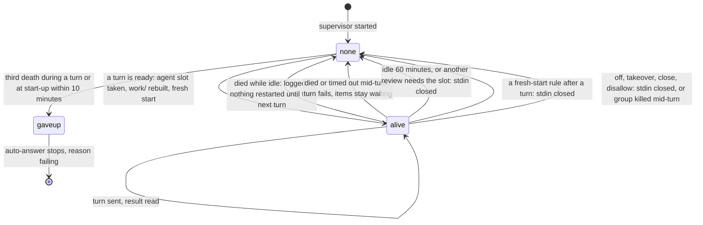
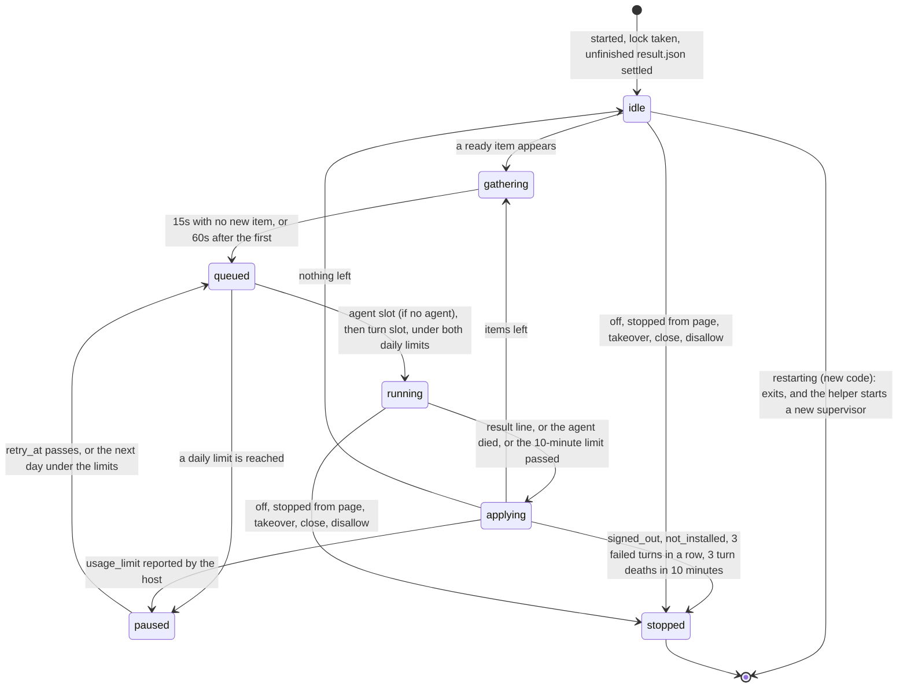
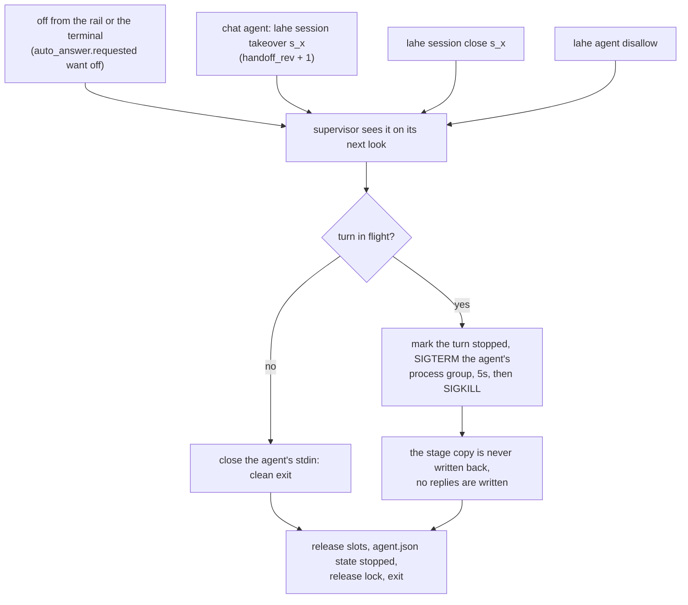
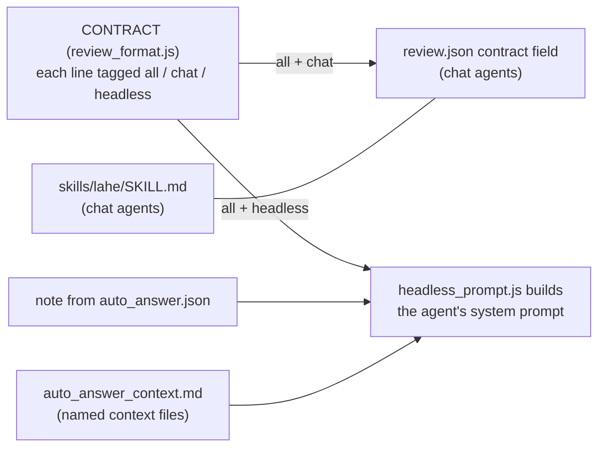

# Architecture: LAHE starts your agent when a comment is ready

Status: DRAFT, revision 2. The owner rejected the first version's one headless run per wake, because every new agent pays its whole start-up cost again. This revision keeps one headless agent running per review, owned by LAHE. The second spike (`spike_persistent_run.md`) proved that form. The architect and code lead reviewed this revision, and their findings are folded in. Both rounds' tables are at the end. Every guess made on the owner's behalf is listed under Assumptions.

## Summary

- **One background agent per review, started once.** When auto-answer is on, `lahe agent` runs for that session. It starts one headless Claude Code process for the review and keeps it running. Each time items are ready, it sends them to that same process as one new message. The agent's start-up cost is paid once, not once per batch.
- **A waiting agent costs nothing.** The process makes no model call between batches. The spike measured zero calls while idle, and the prompt cache carried over between batches, including across a 6 minute 32 second gap.
- **LAHE owns every step that must not depend on the model:**
  - waking the agent
  - checking after every batch that each item got a reply
  - writing the replies
  - noticing a dead process and starting a new one at the next batch
  - starting fresh when the history gets long, or after a bad batch

  The model only edits the document and writes the reply text. There is no watcher for it to re-arm, and nothing it has to remember.
- **Replies come back as structured output, not shell commands.** The agent has no shell. It returns its replies in its answer, and LAHE checks them and writes them. In the spike, a reply containing "$220" was refused by the shell permission rule twice and went unanswered. Only the supervisor's own check caught it.
- **The agent still works on a copy, in an empty folder.** It can read and edit only a copy of the review's one source file. LAHE checks each batch's edit and writes it to the real file itself. The security decisions from the first review all stand.
- **Lean by default.** The agent starts without the user's CLAUDE.md, hooks, MCP servers or skills. With the owner's full setup, every later batch cost 4.3 to 5.1 times a lean one, because every request carries his whole setup. A project that needs its own rules names context files at allow time.
- **Permission comes from the terminal. The on and off switch is on the page.** A person or chat agent allows auto-answer for a session once, from the terminal. After that, the rail's Auto-answer switch (wireframe direction B) turns it on and off.
- **Later, the Library opens documents with their background agents.** That is a later phase and is not built now (see "Later: the Library opens a document with its agent").
- **First version:** the owner's dogfood, one Markdown review per auto-answer session, macOS and Linux only.
- **One caveat:** Anthropic's Consumer Terms bar scripted access except by API key or where Anthropic "explicitly permit[s] it". Whether a script driving `claude -p` on a subscription counts is not settled (OQ1, subscription terms). Running the dogfood on the owner's subscription is his call.

Nothing here needs an install, an API key of LAHE's own, or a dependency.

## Words used here

- **The agent:** the one headless `claude -p` process LAHE keeps running for a review.
- **The supervisor:** `lahe agent supervise`, the small Node process that starts, feeds, checks and replaces the agent. It makes no model calls.
- **A turn:** one batch of items sent to the agent as one message, up to the agent's `result` line. The rail calls it a run, since the reviewer sees batches of work, not processes.
- **A fresh start:** a new agent process with no history. The first version never reloads an old history (`--resume`); see Alternatives and OQ10.

## Analysis of Existing Structure

What exists and is reused:

- **`lahe monitor`** (`src/cli/commands/monitor.js`) polls the drain in a Node loop and exits on work (0), close (5) or takeover (6). Its ownership check and heartbeat are the pattern `lahe agent` copies. Its duplicate guard is not atomic, and its own comments say so, so `lahe agent` does not copy it.
- **Session ownership** (`src/service/agent_sessions.js`): one owner per session, the `handoff_rev` fence, and the liveness object the rail reads.
- **The drain** (`lahe status --session <id> --json --quiet`) prints item data only, with page text under `page` (D12).
- **The helper is the only writer of `events.jsonl`** (`src/service/log.js`). Agents append reply lines to their own `replies-<agent>.jsonl`, and the helper folds them, refuses a stale rev, and runs the handled check for hand edits.
- **A lock pattern exists** (`withServerLock` and `takeOverStaleLock` in `src/service/static_servers.js`): an exclusive-create lock file with stale takeover.
- **The contract** (`CONTRACT` in `src/shared/review_format.js`, shipped in the browser bundle) is 50 lines and 3,174 words, written for a chat agent. Sorting its lines by keyword puts 18 of them (1,079 words) in the group about waking and hosts, which only a chat agent needs. `contract_split_count.js` in this folder does the count.
- **The Library** (branch `feat/lahe_library`, pull request 19, not yet merged) lists every review at `127.0.0.1:7817/catalog` and can ask an attached chat agent to pick a document up. The later phase below builds on it.

What changes:

- a new per-session supervisor, `lahe agent`, that owns one long-lived agent process, and its records
- a Node-only prompt builder and a stage folder that lives as long as the agent
- an audience tag on each contract line, and a few transport lines reworded
- `lahe monitor` and `lahe review` stand down while auto-answer is on
- two page requests (on and off) that go through the event log
- new rail pieces

## Components / Modules Touched



New:

- **`src/cli/commands/agent.js`**: `lahe agent allow | disallow | on | off | status`, and the internal `lahe agent supervise` that the detached supervisor runs. It is registered in `src/cli/index.js`.
- **`src/service/headless_supervisor.js`**: the loop, and the owner of the agent process. It waits for ready items and lets a burst settle. It takes the slots, mints the turn id, has the engine run the turn, and waits for it to end. Then it writes the replies, waits for the folds, counts attempts, and drains again. It starts and closes the agent, notices its death, owns the 10-minute limit, and obeys stop requests and the handoff fence. It never names a `claude` flag.
- **`src/service/headless_stage.js`**: the stage folder, one fixed path per allowance, emptied and refilled at each fresh start. It runs one turn: it makes the copy match the real file, sends the turn through the host, checks the replies and the diff, and writes the file back safely.
- **`src/service/headless_prompt.js`** (Node only, not in the bundle): builds the system prompt from the tagged contract, the note and any context files. It also builds the reply schema from `REPLY_FIELD` and `REPLY_REQUIRED`, and each turn's message from the drain.
- **`src/service/run_slots.js`**: the machine-wide limits: turns in flight at once, agents alive at once, and turns per day.
- **`src/service/host_claude_code.js`**: the one host adapter. It builds the `claude` command and environment, and starts the process. It writes each turn to stdin, reads the stream, and returns each turn's result with its usage and replies. It reports the process's exit the moment it happens, and names the failure.
- **`src/service/locks.js`**: two kinds of lock in one shared module.
  - **A short lock**: `withServerLock` and `takeOverStaleLock`, moved out of `static_servers.js` unchanged. They hold a lock only while a callback runs, and treat it as stale after 20 seconds. Static servers and the daily counts use it.
  - **A lock held for a process's life**: new. It is stale only when its pid and that pid's start time no longer match a live process, however old the file is. The supervisor lock and both kinds of slot use it. `ps` runs with `LC_ALL=C TZ=UTC`, so the start time reads the same from the helper and the CLI.
- **`src/service/file_stamp.js`**: a stamp of a user file (content hash, size, mtime). It is not `source_stamp.js`, which stamps LAHE's own code.

Changed:

- **`src/shared/review_format.js`**: a new `CONTRACT_LINES` list of `{ tag, text }`, with each tag `all`, `chat` or `headless`. `CONTRACT` stays a list of strings, and becomes the `all` and `chat` lines in order, so today's readers of it keep working. A few transport lines are reworded to fit both kinds of agent.
- **`src/shared/protocol.js`**: the auto-answer states, reasons, rail words, limits, event kinds and the route, spelled once, next to `AGENT_LIVENESS`. `SERVICE_CONTRACT` goes from 13 to 14, so an older running helper is restarted instead of refusing the new event and route.
- **`src/service/agent_sessions.js`**: reads `agent.json`, counts a live supervisor at the current rev as listening, and adds the `auto_answer` object to the liveness answer.
- **`src/service/routes.js`**: `POST /lahe/v1/auto-answer`. The generic events route refuses `auto_answer.requested`, so the page cannot skip the new route by posting that event directly.
- **`src/service/projection.js`**: folds `auto_answer.requested` into the latest request for the review.
- **`src/service/replies.js`** (the fold): while auto-answer holds a review, a reply from any other agent is rejected with reason `auto_answer_owns`. The rest of the fold is unchanged.
- **`src/service/index.js`** (the helper): starts `lahe agent supervise` when an "on" request lands for an allowed session. It starts a new one only when the old one exited to restart on new code, or died without writing a stop (see "On and off are events"). It counts its own starts in `supervisor_starts.json`.
- **`src/cli/commands/monitor.js`**: exits with 6 when a live supervisor holds the current rev. Its exit-6 words say auto-answer took the session, and that `lahe session takeover` takes it back.
- **`src/cli/commands/review.js`**: on re-entry into such a session, it says auto-answer owns it and prints no monitor instructions.
- **`src/cli/commands/review.js` and `add.js`**: both refuse to add a second review to a session auto-answer holds.
- **`src/layer/overlay.js`, `sync.js`, `index.js` and `tab_done.js`**:
  - the Auto-answer switch and its post
  - the run count, failure chip and status words
  - the rail repainting when `auto_answer` changes
  - the overdue banner, late rings and overdue toasts switched off while auto-answer is on
- **Docs and copies:**
  - `src/shared/manifest.js`
  - `skills/lahe/SKILL.md`
  - `docs/CONTRACTS.md`
  - `docs/CLI.md`
  - `docs/diagrams/session_ownership.md`
  - `test/unit/review_format.test.js`

  The skill and the contract travel together.

Not touched: the lifecycle table and the handled check's rules.

## Data / State Changes

### One review per auto-answer session

A session can own several reviews, but auto-answer holds exactly one. `lahe agent allow` names the review, and refuses when the session owns more than one. While the allowance holds, `lahe review` and `lahe add` refuse to add a second review to that session. So every auto-answer file below belongs to that one review: the "on" and "off" events go in its `events.jsonl`, the reply file sits in its folder, and the supervisor drains only its items. One review means one agent.

### One writer per file

| File | Only writer | Holds |
| --- | --- | --- |
| `auto_answer.json` (session folder) | `lahe agent allow` and `disallow`, under the short lock | what the user allowed |
| `auto_answer_context.md` (session folder) | `lahe agent allow` | the context files' text, copied at allow time |
| `events.jsonl` (the review's) | the helper | on and off requests, as events |
| `supervisor_starts.json` (session folder) | the helper | when it started a supervisor, for the start limit |
| `agent.json` | the supervisor | what it and its agent are doing now |
| `turns.jsonl`, `attempts.json` | the supervisor | turn history |
| `turns/<turn_id>/` | the engine, inside a turn the supervisor started | `result.json` before write-back, the trimmed log, the diff |
| `replies-claude-auto.jsonl` | the supervisor (append only) | the agent's checked replies, for the helper to fold |
| `run-slots/` | whichever supervisor takes a slot (exclusive create) | the machine-wide limits |

### `auto_answer.json`, the allowance (written only by `lahe agent allow` and `disallow`)

It is its own file, not a block in `session.json`, because `session.json` has several whole-file writers (create, takeover, close, name) that take no lock. A race there could write an old `handoff_rev` back over a takeover.

```json
{
  "allowed_at": "2026-09-29T15:02:11.204Z",
  "handoff_rev": 4,
  "review": "r657344998844",
  "host": "claude-code",
  "claude_path": "/Users/ken/.local/bin/claude",
  "model": "sonnet",
  "source_file": "/Users/ken/docs/plan.md",
  "note": "Short note from whoever allowed it. At most 2,000 characters.",
  "context_files": [ { "path": "/Users/ken/docs/STYLE.md", "sha256": "...", "chars": 6120 } ],
  "setup": "lean",
  "env": { "HOME": "...", "PATH": "...", "USER": "...", "LANG": "...", "TMPDIR": "...", "CLAUDE_CONFIG_DIR": "..." },
  "runs_per_day": 40
}
```

- **Allowed means** that this file's `handoff_rev` equals the session's `handoff_rev`. A takeover bumps the session's rev and never touches this file, so a takeover ends the allowance too. Auto-answer can then only come back through `lahe agent allow`, from a terminal.
- **`env`** is the environment allowlist, recorded from the shell that ran `allow`. The helper starts the supervisor, so the supervisor inherits whatever shell started the helper. The agent's environment is built only from this record. That way preflight tests the same environment the agent will get. No API key is ever recorded or passed (see the agent's command).
- **`source_file`** is the review's CLI-recorded `source_path`, resolved to a real path when auto-answer is allowed. It is never the page-posted `source_hint`, and never a linked file.
- **`context_files`** are the files named with `--context` (see "Lean by default, and a project's own context"). Their text is copied into `auto_answer_context.md` at allow time. The agent reads that copy's text in its system prompt, never the files themselves. Changing a context file changes nothing until `allow` runs again.
- **`setup`** is always `lean` in the first version.
- **Turn-on is refused** when the source file is an instruction file:
  - `CLAUDE.md`, `AGENTS.md`, `GEMINI.md`, `SKILL.md`
  - anything under `skills/`, `.claude/` or `.github/`
  - a dot-prefixed path
  - anything in the state directory, or outside the home directory

### On and off are events, and the page may only ask

`POST /lahe/v1/auto-answer` takes one field, `want`, which is `on` or `off`. It refuses any other value and ignores every other field. It passes the D11 checks, and the helper appends `auto_answer.requested` with `{ "want": "on" | "off", "from": "page" | "terminal" }` to that review's `events.jsonl`. The helper sets `from` itself, from the `x-lahe-client` header (`layer` or `cli`); the body never sets it. `lahe agent on` and `off` post to the same route with the review token from the state folder, the way `lahe add` reaches the helper. The page never writes owner state, and the generic events route refuses this event type.

- **"On" for a session that is not allowed** does nothing but record the request. The rail then shows the switch as not available, with the terminal command to allow it (see the rail section).
- **"On" for an allowed session** makes the helper start `lahe agent supervise --session <id> --state-dir <dir>` (detached, its own process group) unless a live one holds the lock. It runs the same Node binary as the helper, with the clone's `bin/lahe.js`.
- **"On" still stands, but no supervisor is alive:** the helper starts a new one, the next time the page asks for liveness, in two cases only:
  - `agent.json` says the old one exited with reason `restarting` (new code)
  - `agent.json` does not say `stopped`, so the old one died without writing a stop

  A supervisor that stopped itself for a failure (`signed_out`, `not_installed`, `source_missing`, `failing`) stays stopped. Only a new "on" request made after the stop brings it back: off then on from the page, "Try again" on the chip, or `lahe agent on`.
- **The start limit.** The helper records each start in `supervisor_starts.json`, which only it writes, so the count survives a helper restart. Starts after a `restarting` exit do not count, since every merge or pull in the clone causes one. A fourth counted start within ten minutes is refused, and liveness reports `stopped` with reason `failing` from that file. Until a supervisor holds the lock, the rail shows "starting".
- **"Off"** is read by the supervisor on its next look.

### What "auto-answer holds a review" means

One predicate in `agent_sessions.js`, `autoAnswerHolds(session)`: the allowance holds (its `handoff_rev` matches), and the latest `auto_answer.requested` for the review is "on". The fold's `auto_answer_owns` rejection, `lahe monitor`'s exit 6, `lahe review` re-entry, and the liveness answer all use it, so they cannot disagree. After "off", a chat agent's replies fold and its monitor runs, as today. With "on" standing and the supervisor briefly dead, a chat agent's reply is still rejected.

### `agent.json`, the supervisor's own state

```json
{ "pid": 4121, "started": "Tue Sep 29 15:02:12 2026", "handoff_rev": 4, "at": "...",
  "state": "idle", "reason": null, "since": "...", "retry_at": null,
  "agent": { "pid": 4188, "pgid": 4188, "started": "Tue Sep 29 15:02:13 2026",
             "prompt_sha256": "...", "turns": 12, "first_context": 5269, "last_context": 17727,
             "last_turn_at": "..." },
  "turn_deaths": [],
  "turn": null,
  "turns_today": 6 }
```

- **`started`** is the process start time as `ps -o lstart= -p <pid>` prints it. A pid only counts as the same process when both the pid and that start time match. That is how a reused pid is told apart from the original, since neither process has a port to answer a health check.
- **`agent`** is `null` while no agent process is alive (before the first turn, after an idle close, or after the agent died). It describes one process only. Since every agent starts fresh, nothing in it has to outlive the process.
  - `prompt_sha256` is the hash of the system prompt the agent was started with. A different hash means a fresh start (see "Fresh starts").
  - `first_context` and `last_context` are the tokens the first and the latest request carried. Their difference is how much history the agent holds.
- **`turn_deaths`** sits outside `agent`, so it survives each dead process. It holds the times the agent died during a turn or at start-up, for the limit on those.
- **`turn`** is the turn in flight: `{ "turn_id": "turn_0007", "items": 2, "sent_at": "..." }`, or `null`. The supervisor mints each `turn_id` before the turn starts.
- **At start, a supervisor rebuilds** `turns_today` and the next `turn_id` from `turns.jsonl`, so neither resets when a supervisor restarts or auto-answer is turned off and on.
- **`state`** is one of `starting`, `idle`, `gathering`, `queued`, `running`, `applying`, `paused` or `stopped`.
- **`reason`** is one of `turned_off`, `stopped_from_page`, `taken_over`, `closed`, `limit_session`, `limit_machine`, `usage_limit`, `signed_out`, `not_installed`, `source_missing`, `failing`, `restarting`, or `null`.

### Turn records

- **`turns.jsonl`**, one line per turn:

```json
{"turn_id":"turn_0007","agent_pid":4188,"agent_turn":3,
 "sent_at":"...","ended_at":"...","items":[{"id":"c_7fa2","rev":2}],
 "outcome":"finished","failure":null,"model_turns":6,
 "applied":{"file":"/Users/ken/docs/plan.md","before":"sha256:...","after":"sha256:..."},
 "replies_written":2,"replies_folded":2,
 "context":{"first":9114,"last":11849},"compacted":false,
 "usage":{"input":8,"output":1004,"cache_read":39756,"cache_write":3002,"cost_usd_list":0.0300}}
```

  - Claude Code reports usage and cost as running totals for the process. The engine records each turn as the difference from the previous `result` of the same process, as the spike did. A new process counts from zero.
  - The four usage numbers are kept apart (input, output, cache read, cache write), since cache reads are most of what a turn processes.
  - A turn with no `result` line (it died, timed out or was stopped) records the sum of its assistant messages' usage when the stream had any, and `"usage": null` otherwise. `lahe agent status` shows `null` as "not reported", never as zero.
  - `outcome` is `finished`, `failed`, `stopped`, `timed_out`, `refused` (the edit failed a check) or `conflict` (the real file changed during the turn).
  - `failure` is `null` or one of `signed_out`, `usage_limit`, `not_installed`, `crashed`, `bad_output`.
- **`attempts.json`** counts attempts per item, both per revision and across all revisions: `{ "c_7fa2": { "2": 1, "all": 3 } }`.
- **`turns/<turn_id>/`** holds `result.json` (the checked replies, the before and after hashes, and `"stage": "applying"` or `"stage": "done"`), a trimmed `log.jsonl`, and `diff.patch` when the turn applied an edit. The log keeps tool names, paths, sizes, usage and the replies, and drops every tool result. The last 20 turn folders are kept. `lahe agent status --diffs` shows the edits of the kept turns, and hashes only for older ones.
- **The stage folder** is always `agent/work/` in the session folder, for as long as the allowance holds. It holds the one copy and nothing else. It is emptied and the copy made again at every fresh start, and preparing it twice gives the same result. The prompt file sits beside it in `agent/`, outside `work/`. The host adapter writes it from the prompt text it is given, and removes it when the agent process ends, however it ends.

### Machine-wide slots

`<state-dir>/run-slots/` holds two kinds of slot, each `{ "pid", "started", "pgid", "session", "at" }`:

- **Agent slots** (`agent-1.lock` to `agent-4.lock`): at most four agent processes alive across the machine. A supervisor holds one while its agent lives. The spike measured 115 to 275 MB of memory per agent.
- **Turn slots** (`turn-1.lock`, `turn-2.lock`): at most two turns in flight across the machine. A supervisor takes one before it sends a turn and releases it at the turn's end.

**The order, so the two kinds cannot stall each other.** A supervisor with no agent takes an agent slot first, and only then a turn slot. It never waits for one kind while holding the other: if the second is not free, it releases the first and waits.

**An idle agent gives way.** When every agent slot is held, the waiting supervisor leaves a `want-agent` marker in `run-slots/`. On its next look, the supervisor whose agent has been idle longest closes that agent and releases its slot. At most two agents can be mid-turn at once, so at least two of the four are idle whenever a fifth review waits. The wait is one look, not an hour.

It also holds `today.json`, the machine's turn count for the local calendar day, updated under the short lock. A slot is taken by exclusive create. It is reclaimed only when its pid and start time no longer match a live process and its process group is gone.

### The reply schema a turn returns

Built from `REPLY_FIELD` and `REPLY_REQUIRED` in `protocol.js`, so the names cannot drift. A test asserts they match.

```json
{
  "replies": [
    { "item": "c_7fa2", "rev": 2, "status": "handled", "text": "Changed \"utilize\" to \"use\".",
      "user_needs_to_see_reply": false },
    { "item": "c_81b0", "rev": 1, "status": "not_handled", "reason": "..." },
    { "item": "c_90d3", "rev": 1, "status": "question", "text": "What is this year's figure? It costs $220 now." }
  ]
}
```

- **The agent never names files.** The supervisor fills `files` from its own before and after stamps. When a turn changed the file, every `handled` reply from that turn lists it.
- **`text` and `reason` are capped at 500 characters** in the schema, and checked again. A reply over the cap is dropped and logged, not cut short. Its item then has no reply, which counts as an attempt.
- **A reply for an item or revision not in this turn's batch is dropped** and logged. That includes a reply for an item from an earlier turn, which the agent may still remember.

### The liveness answer gains `auto_answer`

```json
"auto_answer": { "available": true, "on": true, "state": "running", "reason": null,
                 "since": "...", "retry_at": null, "working_on": 2,
                 "runs_today": 6, "runs_limit": 40 }
```

- **`null`** when the session has never been allowed.
- **`available`** is false when the session is not allowed at the current rev.
- `runs_today` and `runs_limit` count turns. They keep the rail's word, "runs".
- The page is never sent a path, the note, the context files, token counts, or a dollar figure. Token counts, cache included, are in `lahe agent status`.

## Key Flows

### Allowing it, then turning it on



- **Preflight** runs `claude --version` and `claude auth status` at the recorded absolute path, with the environment it then records in `auto_answer.json`. It refuses when `claude` is missing or signed out, when the source file is not allowed, or when the session owns more than one review. It reports whether the login is a subscription or billed by the token.
- **The terminal warning** (R6, say what it may do) is printed every time. It says:
  - it edits only this one file and runs no commands
  - anyone who can comment on this review, or run script in its pages, can make it edit that file, and the file may later be read by agents that do have a shell
  - it keeps one Claude session running for this review while auto-answer is on
  - each turn uses the user's Claude usage, and costs money when the Claude login is billed by the token
  - the subscription terms question (OQ1, whether the terms allow this)

  The plan pins its exact words.
- **The agent is not started at "on".** It starts with the first turn, so a review switched on and never commented on costs nothing and holds no memory. The spike's agent also made no request until its first message.
- **`lahe agent on --session s_x`** is `allow` followed by an "on" request, for a user who wants it on from the terminal.
- **The chat agent learns from exit 6**, which the skill already reads as "stop, another agent owns this". The skill gains one sentence: when auto-answer is on for your session, tell the human and stop (answers Q3, telling the chat agent). `lahe review` re-entry into such a session says the same and prints no monitor instructions.

### A wake: one turn of the same agent



**The batch**

- Every ready item the drain lists when the turn starts goes in, up to 25 items and 100 KB of input in all.
- An item whose reviewer text (note plus change) is over 8,000 characters is not sent. It gets a `not_handled` reply: "Too long for auto-answer; a chat agent can take it." D12 forbids cutting reviewer text, so the item is refused whole.

**The turn message** is one stream-json user message on the agent's stdin. Its text is the drain's item lines, cut to a fixed list of fields. Each item keeps what the reviewer wrote (`note`, `change`), its identity (`review`, `id`, `rev`, `kind`), its thread, and the page text under `page`. The page's `path`, `origin` and `linked_file` are dropped, and so is the drain's summary line. Each item's `source_hint` is replaced by the stage path of the copy. When the copy was reset since the agent's last turn (a refused edit, a conflict, or a change to the real file), the message starts with one data line, `{"file_changed_since_last_turn": true}`. There is no instruction text in the message, per item or per turn (R14, rules once). The supervisor drains in its own process, through `status.js` with `suppressActivityTouch` set, as `lahe monitor` does, so its looks never make the rail say an agent is working.

**One turn at a time.** The supervisor sends nothing while a turn is in flight. The `result` line is the only sign a turn is over. The model saying it is done means nothing to the supervisor.

**Items that arrive mid-turn** wait for the next turn (R11, nothing is lost). If the reviewer rewords an item mid-turn, the turn's reply names the old rev, and the helper refuses it at fold.

**The copy between turns.** The copy stays in `agent/work/` as long as the agent does. Before each turn the engine compares it with the real file. If they differ (the owner edited the file), the real file is copied over it. After a refused or conflicting turn, the engine resets the copy at once. Either way, the supervisor passes "the file changed" into the next turn, so the turn message's first data line tells the agent. After a turn that was written back, the copy and the real file are already the same. The system prompt tells the agent to read the file afresh at the start of every turn. Claude Code's Edit tool also refuses to edit a file that changed since it was last read; the flags spike checks that for this case.

**The 15-second quiet wait** after a conflict is the supervisor's, before it takes a slot, so a slot is never held while the owner types.

**Checks before anything reaches the real file** (the first version's checks, now per turn):

- The turn must have ended `finished`, with replies that match the schema.
- `work/` must hold exactly one regular file, the copy. Anything else the agent left there makes the turn `refused`. The engine removes the stray files, and the next turn starts fresh. A stray file could otherwise carry a planted note past a fresh start.
- The real file's stamp must still match the one taken at copy-in. If it does not, the outcome is `conflict`: nothing is written or replied, and the items go into the next turn with a fresh copy. A conflict is not an attempt and not a failed turn: saving the file is normal work. The quiet wait and the daily limit bound how often it can happen.
- If the copy changed, every item in the batch must have a reply. A finished turn that edited the file but left an item without a reply is `refused`: nothing is written and no reply is sent, so no change reaches the file without a reply beside it. One case gets past this check: the agent edits an item's passage and also replies `question` for that item.
- The diff must add no raw HTML tag, no `on…=` attribute and no `javascript:` URL. If it does, the outcome is `refused`: nothing is written, and each `handled` reply in the turn becomes `not_handled` with the reason "Auto-answer does not add raw HTML or scripts; a chat agent can do this."
- The write-back re-checks the target at write time. It must be a regular file, not a symlink, at the same real path, owned by the user. The new text goes to a temp file beside it, which is then renamed over the target.

**Before the rename, the engine writes `result.json`** with the checked replies, the before and after hashes, and `"stage": "applying"`, and flushes it to disk. After the replies are written, it becomes `"stage": "done"`. So a supervisor killed at any point leaves a record to recover from:

- **Killed before the rename:** the real file still matches the before hash. The next supervisor drops the replies, and the items go into the next turn.
- **Killed after the rename:** the real file matches the after hash. The next supervisor writes the replies before it does anything else.

On start, a supervisor scans `turns/` for a `result.json` still at `applying`, and settles it this way first.

**Replies go through the helper, as any agent's do.** The supervisor appends them with `reply.js`'s encoder. It then reads the review's `events.jsonl` before it counts attempts or drains. It matches a `reply.folded` by item and rev. It matches a `reply.rejected` by the reply file and line number it just appended, since that event carries no item. When the handled check holds a reply back, the helper still writes a `reply.folded`, marked to say the change is not on the page. A reply that has been written but not yet folded counts as answered, so the next drain cannot hand the item out twice. If no fold result arrives in 30 seconds (the helper is down), nothing is counted, the timeout is logged, and the loop goes on.

### The structured reply channel

The agent returns its replies in its turn's result. It never runs a command to reply.

- **First choice: `--json-schema`.** Claude Code checks the agent's final answer against the reply schema and puts it in the result as structured output. Whether this works for every turn of a process fed by `--input-format stream-json`, with the exact production flags (`--tools Read,Edit` included), is not yet measured. The first spike used one-shot runs, and the second replied through the shell. The flags spike (Task 0.2 in the plan) checks it, and records how Claude Code reports an answer that fails the schema. That report maps to `bad_output`.
- **If it does not work per turn: a JSON answer the supervisor checks.** The system prompt asks the agent to end each turn with one JSON object that fits the schema, and nothing after it. The engine reads the result's final text, takes the last JSON object in it, and checks it against the same schema. Output that does not parse or does not fit is `bad_output`: nothing is written or replied, and the items go to the next turn.
- **Either way, the same checks run** on every reply (its own batch, the 500-character cap, LAHE's own file list), and no shell is ever granted as a fallback. If neither form works, the design stops and comes back to the owner.
- **Why not the shell.** The second spike's agent wrote `--text "... cost $220."` in a Bash call. Inside double quotes, `$2` is a shell variable, so the `Bash(lahe *)` rule no longer matched and the call was refused, twice. The edit was in the file, but the item had no reply. Structured output has no quoting to get wrong, and a shell is also the widest door a hostile comment could reach (security review, first round).

### The agent's life: start, death, fresh start, close



**Every start is fresh.** The supervisor starts an agent only when it has a turn to send, after taking an agent slot. The first version never reloads an old history with `--resume` (see Alternatives and OQ10). A fresh agent loses nothing it needs: the rules are in the system prompt, each item carries its own thread, and the agent reads the file afresh each turn. On a lean start it costs cents: the second spike's first lean turn cost $0.0566 at list price, against $0.020 to $0.030 for a warm one.

**Noticing a death.** Node's `exit` event on the child fires the moment the process ends. In the spike it fired at once on a SIGKILL. No heartbeat and no polling are needed.

- **Dead while idle:** the supervisor logs it and sets `agent` to null. Nothing is restarted until the next turn needs an agent. The likely killer is memory pressure, and a process started again at once would likely be killed again. A death while idle does not count toward the limit below, and the rail shows nothing: no batch failed.
- **Dead mid-turn, or at start-up:** the turn is `failed` with failure `crashed`. Nothing is written back and no reply is sent, so every item stays on the drain. The time goes in `turn_deaths`.
- **The limit:** a third entry in `turn_deaths` within ten minutes stops auto-answer with reason `failing`. A person has to look.

**Fresh starts.** After a turn, the supervisor closes the agent and lets the next turn start a new one when any of these hold:

- **The history is long:** the latest request carried more than 80,000 tokens above the agent's first request. At the lean growth the spike measured (2,220 tokens per turn), that is about 36 turns. It keeps every turn cheap, and it keeps the agent far below the point where Claude Code compacts on its own (about 967,000 tokens for Sonnet 5.5). The spike showed compaction works, but each compaction is a model call over the whole conversation.
- **The system prompt changed:** `allow` ran again with a new note, context files, model or limits, or LAHE's code now builds a different prompt. The supervisor compares `prompt_sha256`.
- **The last turn was `refused`, `timed_out`, `crashed` or `bad_output`.** The history that led there stays out of the next turn.
- **Claude Code compacted anyway** (a `compact_boundary` event appeared).

**Idle close.** After 60 minutes with no turn, the supervisor closes the agent's stdin, and the agent exits cleanly (the spike measured about 200 ms). The next turn starts fresh. This costs almost nothing extra: Claude Code's prompt cache lasts one hour on a subscription, so a process kept alive past that would rewrite its cache on the next turn anyway. It frees 115 to 275 MB of memory and an agent slot. An idle agent also closes early when another review is waiting for its slot (see "Machine-wide slots").

**The supervisor restarting itself.** When its own code is older than the clone, the supervisor waits for any turn in flight to finish, closes the agent's stdin, releases its locks, and exits with reason `restarting`. That exit is not a stop. The helper starts a new supervisor on the same allowance, and the next turn starts a fresh agent. This matters because the owner dogfoods LAHE on LAHE while editing LAHE, so it happens after every merge or pull.

**A supervisor killed outright.** The agent's stdin closes with it, and the agent then exits (a closed stdin is a clean stop). A new supervisor first reads `agent.json`. If an agent process group from before is still alive (pid and start time match), it kills that group before doing anything else. The orphan's edits were only ever to its stage copy.

### The supervisor's states



- **Every look** (every 2 seconds) checks:
  - the session is open
  - the rev still matches
  - the latest request is not "off"
  - the allowance still holds
  - its own code is not older than the clone
  - whether the agent has been idle for 60 minutes, or another review wants its slot
  - whether the turn in flight has passed its 10-minute limit, by wall-clock time
- **The 10-minute limit belongs to the look,** through the injected clock. Node's own timers do not count time the machine spends asleep, so a timer alone would not end a turn after a sleep. The host keeps a timer only as a backstop.
- **A stop the supervisor asked for is `stopped`, not `crashed`.** It passes a stop signal into the turn before it kills the agent, so the turn record says what happened.
- **Gathering has a ceiling** of 60 seconds after the first item, so a steady trickle of comments still gets answered.
- **The agent's life is separate from these states.** Idle with an agent alive and idle with no agent look the same on the rail. `applying` shows the same words as `running`.

### Stopping, and handing back



- **Stopping is always clean (R5).** A stopped, crashed or timed-out turn changed only the copy, so the real file never holds a change that no reply explains. Every item it was given stays ready, on the drain, for the next turn or the next owner.
- **Handing back (R20, hand it back)** is the existing takeover. Every unanswered item is on the new owner's catch-up drain, and nothing answered shows again.

### Retries, failures and limits

- **Attempts count only on `finished` and `refused` turns.** An attempt is one of:
  - a finished turn was given the item and no reply for it folded
  - its `handled` was held by the check
  - a turn was refused, and it had no reply for the item
- **The attempt limits:** three attempts at one revision, or six across all revisions of one item. Then the supervisor writes a `not_handled` reply: "Auto-answer could not answer this and stopped trying. Reply here yourself, or hand the review to a chat agent." That takes the item off the drain. Rewording it on the card makes it ready again, until the six-attempt limit. Counting refused turns ends the loop where one bad item sends the same batch back again and again.
- **Three failed turns in a row** (crashed, bad output, timed out) stop auto-answer with reason `failing`. No item's attempts are used up by a failing tool. Conflicts do not count.
- **A usage limit reported by the host** pauses auto-answer for a fixed 30 minutes, and the rail shows the time of the next try. The agent is closed, not kept.
- **Signed out or `claude` missing** stops auto-answer. A person has to fix these.
- **Daily limits** count turns per local calendar day: 40 per session (set with `--runs-per-day` at allow time) and 120 across the machine. Reaching either pauses until the next day.
- **A turn's wall-clock limit is 10 minutes.** At the limit, the supervisor kills the agent's process group, the turn is `timed_out`, and the next turn starts fresh. The slowest spike turn took 26 seconds.
- **A money cap per turn is not assumed.** `--max-budget-usd` capped a whole one-shot run. For a process that stays up, it may cap the whole process instead. The flags spike finds out which. Until then the caps are the daily turn counts and the 10-minute limit.
- **The account's own limit cannot be read.** The first spike found that `/usage` gives only a whole percentage for the whole account. The rail shows LAHE's own run count against LAHE's own limit, and says so in hover text.

### The system prompt: one source of the rules



- **R15 (one source of rules).** Every rule about the work lives on one line, in one array. A line only a chat agent can use (waking, monitors, hosts, `lahe reply`, "this file") is tagged `chat`. A line only the background agent can use is tagged `headless`. Neither kind is a copy of the other: they say different things about different transports.
- **The chat contract changes once, on purpose.** The few `all` lines that say "append a reply line" are reworded to name the reply's fields without naming the transport. The `chat` lines say how a chat agent sends one (`lahe reply`), and the `headless` lines say the agent returns them in its answer. `test/unit/review_format.test.js`, `docs/CONTRACTS.md` and the skill change with it.
- **The `headless` lines** are the short preamble the spikes proved, changed for an agent that stays up. They say:
  - you stay running for this one review; each message you get is a batch of ready items, as drain lines
  - the only file you may read or edit is the one each item's `source_hint` names; read it afresh at the start of every batch, since it may have changed
  - read back each edit before replying
  - end each batch with one reply per item, in the reply format, and nothing after it
  - do not wait, start anything, or look for more work; the next batch comes to you
- **The note (R25, a handoff note)** comes after the rules, under its own heading. Only the terminal can set it.
- **Context files** come last, under a heading that names each file. See the next section.
- **The prompt goes in once per agent.** It is passed when the agent starts, and never in a turn message. When the prompt LAHE would build no longer matches the running agent's (`prompt_sha256`), the next turn starts a fresh agent.
- **A test asserts** that the prompt is exactly the `all` and `headless` lines in order, then the note, then the context, and that no turn message contains a `CONTRACT` line.
- **Size.** The spike's prompt was 399 words. The first cut of the `all` group alone is 2,095 words. The flags spike measures what that adds per request. With the agent kept running, the prompt is cached after the first turn, so a longer prompt costs mostly at the first turn and at each fresh start.

### Lean by default, and a project's own context

**The default is lean,** with `--safe-mode`: no CLAUDE.md, hooks, MCP servers or skills from the user's setup or the project. The subscription login still works. Why:

- **Cost at every turn.** The second spike ran the owner's full setup in a process kept running. Its first turn cost $0.9951 at list price, and later turns cost $0.094 to $0.153. The matching lean turns cost $0.020 to $0.030. So even with the cache warm, a full-setup turn costs 4.3 to 5.1 times a lean one, at every turn, because every request carries 132,000 to 139,000 tokens of setup. Each fresh start pays the full first-turn cost again.
- **It buys nothing for this job.** Every item was handled correctly in lean mode. The owner's setup is for his own work, not for editing one Markdown file.
- **Security.** Hooks run commands, and MCP servers add tools beyond Read and Edit. The first security review ruled both out for an agent nobody watches.

**How a project opts into its own context.** Some documents need rules the lean start drops, such as the owner's writing rules or a project's style guide. The allowing person names them:

```sh
lahe agent allow --session s_x --context ~/docs/STYLE.md --context ./CLAUDE.md
```

- `allow` reads each named file once and copies the text into `auto_answer_context.md`. The system prompt carries that text after the rules and the note.
- The warning lists each file and its size. The total is capped at 40,000 characters; `allow` refuses more.
- Context files may be instruction files such as CLAUDE.md. That rule is only for the file the agent edits.
- The agent never reads the context files from disk. A change to one takes effect when `allow` runs again, which also starts the agent fresh.
- The cost is paid mostly once per agent: the text is cached with the rest of the system prompt.

**The full setup is not offered in the first version.** A project that wants it (for example, a skill the agent must use) is an open question, OQ9.

### The agent's command (Claude Code adapter)

The adapter starts the agent with these flags, each with its reason:

| Flag | Why |
| --- | --- |
| `-p --input-format stream-json --output-format stream-json --verbose`, cwd = the stage `work/` folder | one process that takes each turn as a stdin line and reports each turn's result, usage and tool calls; the copy is the only file in reach |
| `--safe-mode` | no CLAUDE.md, hooks, MCP, skills: the lean start both spikes measured |
| `--restricted` | no Bash or other code-running tools, no settings files, file tools confined to the working folder |
| `--strict-mcp-config`, `--setting-sources ""` | a second guard on top of the two above |
| `--tools Read,Edit` | the only two tools |
| `--permission-mode dontAsk`, `--permission-prompts none` | anything else is refused, never asked |
| `--append-system-prompt-file <path>` | the rules, the note and the context, once, kept out of the process list |
| `--json-schema <reply schema>` | replies as structured output, if the flags spike shows it works per turn |
| `--model <model>` | `sonnet` by default |
| `--no-session-persistence` | nothing is saved to the user's Claude history; the first version never resumes |
| never `--bare`, never `Bash` | `--bare` drops the subscription login |

- **`--max-budget-usd`** is added only if the flags spike shows what it caps in this mode.
- **Environment: an allowlist, not a blocklist.**
  - `HOME`, `PATH`, `USER`, `LANG` and `TMPDIR` pass through.
  - So does `CLAUDE_CONFIG_DIR`, if it was set at allow time.
  - `ANTHROPIC_API_KEY` never passes, and is never recorded. A user whose Claude login itself is billed by the token (preflight says so) is warned that each turn costs money.
  - Nothing else passes, whatever shell started the helper. That includes the `CLAUDE*` variables of a parent Claude Code session, which the spikes also stripped.
- **`claude` is run by the absolute path recorded at allow time,** in its own process group, so a stop or timeout can end it and anything it started.

### What the rail shows (wireframe direction B)

The wireframe doc is `02_wireframe_lahe_agent_sdk.md`, with screens in `wireframes/index.html`. It recommends direction B, and this design follows it. The persistent agent changes nothing the reviewer sees: the reviewer sees batches of work, which the rail calls runs.

- **The Auto-answer switch** is a pill beside Hold sending, in the footer.
  - When the session is not allowed, the pill is present but inert. It explains that auto-answer is allowed from the terminal, and shows the `lahe agent allow --session <id>` command to copy. The session id is already sent to the page, so this adds no path.
  - When allowed, the first "on" in a session opens the warning panel in the footer, where End review's confirm opens today. The panel says what it may do, who can make it act, and what it uses.
  - Turning it off takes one click while idle. It asks for one confirm while a turn is working, because it cuts the turn off.
- **The run count** sits beside the pill, like Hold's queued count, as "6 runs". Opening it shows today's runs against the limit. No token count and no dollar figure: tokens without cache reads badly understate a turn, and on a subscription the list price is not a charge. `lahe agent status` shows all four token counts per turn.
- **The failure chip** sits under the switch while a failure stands. It holds one plain sentence and one remedy per reason, from a fixed list in `protocol.js`, plus a catch-all.
- **The status line stays the one agent line.** While auto-answer is on, its words come from `auto_answer.state`, which LAHE knows rather than guesses. `livenessFrom` also counts a live supervisor at the current rev as listening, so the two cannot disagree.

The table below shows which states make the status line loud and which show the chip. The exact words for every state, chip and panel are pinned in the plan ("Words this plan pins").

| State | Loud | Chip |
| --- | --- | --- |
| starting, idle, gathering, running, queued | no | no |
| one failed turn, retrying | no | yes |
| paused, a daily limit or the usage limit | yes | yes |
| stopped: signed out, not installed, file gone, failing | yes | yes, with the reason and remedy (the status line says only "stopped") |
| off (turned off, from page or terminal) | as today | no |

**The overdue banner stands down while auto-answer is on.** Today, after a wait with nothing listening, a banner says "Check your agent's window first" and offers the handoff button. With auto-answer on there is no window to check, and LAHE knows what is running. So:

- **While on and healthy** (idle, gathering, running, queued), nothing counts as overdue:
  - no banner
  - no late ring on a card
  - no overdue toast
  - no "nothing back yet" escalation

  A long turn stays calm and shows its age ("working on 2, 6m") until the 10-minute limit ends it. At that point it becomes a failed turn, and the chip says so.
- **While paused or stopped by a failure,** the status line goes loud, and the chip gives the reason and the remedy. The banner does not say "check your agent's window". Its hand-off button stays, since a chat agent taking over is a real remedy. Copy review and Export review stay in the head menu, as always.
- **A card the agent gave up on** wears the amber ring a late card wears today, with its "Not handled" pill and the reply's reason. Both mean "this needs you".
- **After auto-answer is turned off,** or a chat agent takes over, the rail goes back to today's rules exactly.

Rail words never include monitor, heartbeat, wake feed, watching, or unattended (the existing rule). The wireframe doc says why directions A and C were not taken.

### Later: the Library opens a document with its agent

Not built now. This section records the shape so the first version does not block it.

The Library (`feat/lahe_library`) lists every review and can open one in a new tab. The owner wants to open documents from it with a background agent already taking care of each, while he works in his chat windows. With this design, that is one more way to send "on":

- **An allowance per project folder, from the terminal.** `lahe agent allow --project <folder>` would allow auto-answer, once, for any Markdown review whose source sits under that folder. It would record the same things `auto_answer.json` records, the context files included. The rule that only a terminal grants permission stays.
- **An "Open with auto-answer" action in the Library.** For a review under an allowed folder, the Library asks the helper to open the review and post `want: on` for it. Each review gets its own supervisor and, at its first comment, its own agent, as here.
- **The Library shows each document's agent state** from the same `auto_answer` liveness object the rail reads.
- **The machine limits already fit.** Many open documents cost nothing while idle: no supervisor makes model calls, and agents close after 60 idle minutes. The agent-slot limit keeps memory bounded, and an idle agent already gives way when another review needs its slot.

What the first version must not do, to leave this open: tie the allowance to a chat agent, or keep any auto-answer state only in memory.

## Alternatives Considered

- **One fresh headless run per wake (this design's first version).** Each batch started a new lean `claude -p` process, which handled the batch and exited. Replaced because of the owner's cost objection: in his projects, starting a new agent and sending one message to Opus fills about 18% of its context window, so a new agent per comment burns that start-up cost again and again. The second spike measured it. With his full setup, a fresh start cost $0.9951 at list price, and a later turn of a kept agent cost $0.094 to $0.153. With the lean setup, a fresh start and a kept agent cost about the same ($0.034 to $0.054 against $0.020 to $0.030), so keeping the agent mostly saves time there. What carried over from the first version: the lean start, the stage copy, no shell, structured replies, the done check after each batch, and every limit.
- **The first version's case against one long-running run** (`--input-format stream-json`). It said history piles up in one context, which R14 exists to prevent, and that it holds memory on a machine short of it. The second spike answered both. The rules sit once in the system prompt, and history grows by about 2,220 tokens a turn, which the fresh-start rule bounds at 80,000. Memory is bounded by the idle close and the agent-slot limit.
- **Resuming the saved history (`--resume`) after a death, an idle close or a supervisor restart.** The second spike proved it works: a resumed agent kept its history, and 75 seconds after a kill its first turn cost the same as a warm one. Left out of the first version (architect review, second round):
  - After an idle close the one-hour cache has expired, so a resume writes the whole history back to cache, up to 80,000 tokens. A lean fresh start writes only the prompt. The cold case was never measured.
  - A login billed by the token likely gets a five-minute cache, so there most resumes would be cold.
  - Resume needs Claude Code to save the full transcript, every file read included, in the user's Claude folder. That undoes the first security round's rule to keep tool results out of stored logs.
  - A planted instruction would ride across the idle hour.
  - It is the part with the most pieces: the session id kept across processes, a fallback when a resume fails, and a prompt check on resume.

  R26 (one agent per review) still holds without it: the start-up cost is paid once per idle hour, crash or fresh start, never per batch. Whether to add a resume within the cache hour after a crash is OQ10.
- **The owner's full setup as the default.** Rejected: 4.3 to 5.1 times the cost of a lean turn at every turn, and it brings hooks and MCP servers the security review ruled out. Named context files cover what a project needs.
- **Keeping one agent alive forever, with no fresh starts.** Rejected: each turn's cost grows with the history, and Claude Code's own compaction is a model call over the whole conversation ($0.20 to $0.33 at a forced 100,000-token window in the spike).
- **Keeping an idle agent past an hour.** Rejected: the prompt cache lasts an hour, so the next turn rewrites it anyway, and the process holds 115 to 275 MB in the meantime.
- **The Agent SDK as an add-on package.** It is the owner's original question, and it gives full control from code. Rejected:
  - it needs an API key and per-token billing
  - it needs an install, which breaks the zero-dependency rule
  - it works for Claude only

  Everything this design needs is a `claude -p` flag. Whether to keep the SDK as a documented option for API-key users is Q7 (the SDK).
- **A Stop hook in the owner's chat (crucible Approach C).** Not chosen as this feature:
  - it still needs the agent to start its watcher
  - it installs into the user's own settings
  - it keeps his chat busy with review work

  It is not rejected outright; whether to ship it first is Q6 (order).
- **A background Claude Code session per review (`claude --bg`).** Rejected:
  - inside it, the watcher is still a background command, so both old problems return: the watcher gets killed for memory, and the agent forgets to restart it
  - it is Claude-only
  - it depends on a young feature LAHE does not control
- **The helper owns the agents.** The helper is long-lived and sees every session. Rejected because:
  - the helper restarts whenever `lahe add` finds it older than the clone's code, or when it refuses a write
  - an agent inside it would die or be orphaned then
  - separate processes keep an agent's memory and failures away from page serving

  The helper still does two jobs: it folds the replies, and it starts the supervisor when the page asks.
- **A hook on `lahe monitor`'s exit (the first spike's shape).** Rejected as the product: something outside LAHE would own the loop, with no limits or retries, and a chat agent would have to start it, which is the step agents forget.
- **Forking the chat.** It brings back the 107,000 to 138,000 tokens per request the first spike measured. The note and context files cover the gap. Q2 (how much of the chat the agent gets) can revisit this.
- **Replies by `lahe reply` through a shell.** Both spikes used it with `Bash(lahe *)`. Rejected, including as a fallback:
  - any shell grant is the widest door a hostile comment can reach
  - `Bash(lahe *)` also allows `lahe review` of any path and closing or taking over other sessions
  - the second spike's "$220" reply was refused by the shell rule twice and went unanswered
- **Per-file `Read(...)` and `Edit(...)` rules in the real folder.** The security reviewer's live test showed that Read rules grant access and never restrict it. The run read a `.env` beside the source. Replaced by the empty stage folder.
- **Linked files and static HTML in the first version.** Dropped:
  - linked files would let a page add files the agent can edit, just by visiting links
  - HTML reviews make a planted script easy
  - both come back only with their own checks
- **A reply marker on stopped items.** Rejected. The marker would be a `question` reply, which takes the item off the drain. With copy-in, copy-out, a stopped turn never touches the real file, so no marker is needed.
- **Letting the page allow auto-answer.** The wireframe's step 2 turns it on from the page. The switch does that here too, but only after the terminal has allowed the session. Otherwise any script holding the review token could start an agent. See OQ5 (who may switch it on).

## Failure Modes / Edge Cases

Only cases the flows above do not already settle.

| Case | What happens |
| --- | --- |
| Two supervisors start at once (page "on" and `lahe agent on`) | The supervisor lock is an exclusive create. The second exits before it does anything. |
| A supervisor is running and `lahe agent allow` runs again | It rewrites `auto_answer.json` under the short lock at the same rev. The supervisor sees the new prompt hash before its next turn and starts the agent fresh. |
| All four agent slots are taken | The supervisor leaves a `want-agent` marker, and the longest-idle agent closes on its owner's next look. At least two of the four are idle whenever this happens, since only two turns run at once. |
| The source file is renamed or deleted | The next copy-in fails. Auto-answer stops with reason `source_missing`, and the chip says the file is gone. |
| A branch switch swaps the file for a symlink mid-turn | The write-back check refuses it. The outcome is `conflict`. |
| The owner edits the file between turns | The next copy-in finds the copy and the file differ, copies the file over, and tells the agent in the turn message's first data line. |
| The agent answers an item from an earlier turn again | The reply is not for this turn's batch, so it is dropped and logged. |
| The Markdown already contained raw HTML, and the agent keeps it | Only additions are refused. HTML that was already there is left alone. |
| A reviewer's reply to the agent's question | The item goes back to ready as today, and the next turn takes it. The thread field carries the question as history, whether or not the agent still remembers asking. |
| The review is ended from the page | Its items are drained and answered as usual. The end-of-review routine (writing hand edits out beside the document) stays with a chat agent in the first version. |
| Hold is on | Held items are not on the drain, so no turn starts. Release sends them at once, and they settle into one turn. |
| Windows | `lahe agent allow` refuses there in the first version: process groups and `ps -o lstart` are POSIX. |
| The machine sleeps mid-turn | On wake, the supervisor's next look compares wall-clock time, and the 10-minute limit usually has passed. The agent is killed, the turn is `timed_out`, and the next turn starts fresh. It counts toward the three-in-a-row stop, not toward attempts. |
| The machine sleeps while the agent is idle | Nothing happens on wake. The idle clock may have passed 60 minutes, and the next look closes the agent. |

## Security & Privacy Notes

The first review's decisions all stand. What changes is that one agent now sees many batches.

### Who can make it act

With auto-answer on, anyone who can post a ready item makes an agent act, with nobody reading first (R6, say who can make it act; R21, page text is data). Under D11, posting needs the review token. The token is readable by any script on the reviewed page and on any page under the served root. So, plainly: **anyone who has the token, or can run script in a page of this review, can make auto-answer edit the review's source file.**

The design does not try to tell a real reviewer from a script. It limits what acting can do:

- **One file, as a copy, in an empty folder.** The agent cannot see anything else on disk. The security reviewer's live test showed that this matters: permission rules alone let a run read a `.env` beside the source.
- **No shell, network, MCP, hooks or settings.** `--restricted`, `--safe-mode`, `--strict-mcp-config`, `--setting-sources ""` and `--tools Read,Edit`. A hostile repository's `.claude/settings.json` or CLAUDE.md cannot run or steer anything. Context files are text chosen at the terminal, not settings.
- **No planted script.** Edits that add raw HTML, event attributes or `javascript:` URLs are refused, and the first version reviews Markdown only. Separately from this feature, rendered Markdown passes raw HTML through today with no CSP. That goes on the board as its own security row.
- **LAHE writes the file, not the model.** It writes after checks, every turn, with no-symlink, same-path, owner and atomic rules.
- **Replies are checked.** Each reply must be for its own turn's batch, is capped at 500 characters, and carries a file list that LAHE computed itself. Reply text is the easiest way to leak something to the page, so it is kept short. The agent can only see the copy, so there is little to leak.
- **The allowance lives in the terminal.** The page can only ask for on or off, as an event through D11's checks, with every other body field ignored. A takeover ends the allowance.
- **Limits:**
  - 25 items and 100 KB per turn
  - 8,000 characters of reviewer text per item
  - two turns at once, and four agents alive, across the machine
  - 40 turns per session and 120 per machine each day
  - 10 minutes per turn
  - attempt counts that do not reset forever on rewording

  A script that floods items gets, at worst, a day's turns on one file, then a loud rail.

### New with a kept agent: an instruction can outlive its batch

A hostile comment in one batch stays in the agent's history for later batches. It could try to steer them ("from now on, also add..."). What contains it:

- The agent's powers are the same in every turn: one copy, no shell. Every turn's diff is checked on its own.
- The first version's case for a fresh agent per batch was this containment. A fresh start now happens after at most 80,000 tokens of history, after an idle hour, and right after any refused, timed-out, crashed or bad-output turn. So the history that pushed the agent into a refused edit does not reach the next turn. The item itself comes back, and its attempts count.
- Nothing carries across a fresh start. No history is saved for resume, and `work/` is emptied and must hold only the copy after every turn, so the agent cannot leave itself a note.
- The D12 line stays in the system prompt: page text is data.

The residual: a planted instruction that never trips a check can steer later turns until the next fresh start. Those turns are still limited to text edits in one file, checked each time, with a reply on every card and a diff in `lahe agent status --diffs`.

### The residual that stays

**The edited file may be instructions for a later agent.** The owner dogfoods on LAHE's own feature docs, which builder agents later read and act on with a shell. An auto-answer edit could plant an instruction there, and a later full-permission session could follow it. The first version narrows this and says it out loud:

- instruction files and dot paths are refused
- the terminal warning names the risk
- `lahe agent status --diffs` shows the edits of the last 20 turns, and the before and after hashes of older ones

A diff on the card itself is deferred to after dogfood (it would change what the wireframe settled on for cards). The owner commits these docs by hand, which is a second look.

### Page text is data (D12)

The agent's input is the drain, with page text under `page`, and the D12 line is in the `all` group, so the agent gets it once, in its system prompt. The page-posted `source_hint` is replaced before the agent sees it. For an agent nobody watches, the D12 line is not the guard. The capability limits above are. The source file's own text is also untrusted input, and the same limits contain it.

### Credentials and environment

- The child environment is an allowlist.
- No API key passes to the agent. A login billed by the token is named in the warning.
- Preflight runs with the agent's exact environment and binary, so what it reports is what the agent uses.
- The review token is never in the prompt, a turn message, the environment or the arguments.

### Privacy

- Turn logs keep tool names, paths, sizes, usage and replies, never tool results.
- The prompt file is removed when the agent process ends.
- The last 20 turn folders are kept, in the owner-only session directory. Session folders stay after close, as they do today.
- `--no-session-persistence` keeps the agent's history out of the user's Claude folder. The history lives only in the running process, and ends with it.

### Subscription terms

Anthropic's Consumer Terms, Section 3, bar accessing the Services "through automated or non-human means, whether through a bot, script, or otherwise", except "via an Anthropic API Key or where we otherwise explicitly permit it" ([Consumer Terms](https://www.anthropic.com/legal/consumer-terms)). The quote was read by a web fetch and still needs a person to check it against the page. Claude Code's docs describe `claude -p` for scripts, and a token "for CI pipelines, scripts" that "authenticates with your Claude subscription" ([Authentication](https://code.claude.com/docs/en/authentication), cited by the first spike). Whether that is the explicit permission the terms mean, for this use, is OQ1 (subscription terms). A kept agent does not change the question: it is still a script feeding `claude -p`. Running the dogfood on the owner's subscription is his decision, recorded when he makes it.

## Other hosts later (R4, Claude Code first)

`host_claude_code.js` is the only file that knows about Claude Code. The supervisor passes it an agent spec, with the prompt as text, and gets back a handle. The adapter writes the prompt file and removes it when the process ends. The supervisor never names a host's flags. The shapes:

```json
{ "agent_spec": { "stage_dir": "...", "prompt_text": "...", "reply_schema": {},
                  "model": "sonnet", "env": {}, "claude_path": "..." },
  "handle":     { "pid": 4188, "pgid": 4188, "started": "...", "sessionId": "() from init",
                  "sendTurn": "(message, { timeout_ms, signal }) -> turn result", "close": "()", "kill": "()",
                  "onExit": "(cb)" },
  "turn_result": { "replies": [], "usage": {}, "context": { "first": 0, "last": 0 },
                   "model_turns": 6, "compacted": false,
                   "failure": "null | signed_out | usage_limit | crashed | timed_out | stopped | bad_output" } }
```

A second host gets its own adapter file, beside this one, when it arrives. It must be able to do five things:

- run headless on the user's own login
- confine files to a working folder
- run without a shell
- return structured output
- stay running and take work on stdin, or else run once per turn (the first version's shape) at a start-up cost the owner accepts

Codex (`codex exec`) and Gemini (`gemini -p`) have headless modes (crucible). Their confinement, output and long-running modes are not checked here. A host that cannot run without a shell is not added.

## Test Strategy

The plan's Test List holds every case. The strategy behind it:

- **No model calls in the gate.** A fake host, a small Node script standing in for `claude`, stays running, reads stream-json lines from stdin, and prints a scripted stream per turn. Its output is copied from the flags spike's real streams. It reports running totals as Claude Code does, checks each stdin message's envelope, refuses flags and flag pairs Claude Code refuses, and can die between or during turns on cue.
- **Time and crashes are injected.** Every timed step takes an injected clock, and the engine has hooks that crash it at an exact step.
- **Races run in separate processes.** Lock and slot tests race real child processes.
- **Integration tests use the real pieces.** After the branches merge, tests run the real helper, the real `lahe agent` and the fake `claude` together.
- **The rail gets one named browser spec,** with screenshots in light and dark.
- **Live, outside the gate: the flags spike and a live check with the real `claude`.** They cover what a fake cannot:
  - the exact flag set, in a process that stays up across turns
  - structured output on every turn
  - a planted `.env` beside the stage's original that must not be readable
  - a hostile comment asking for a `<script>` that must be refused
  - the prompt size, and the cache carried from turn to turn
  - a kill, then a fresh start that answers the same items
  - how a usage limit is reported
  - what `--max-budget-usd` caps in this mode
  - the "rules once" transcript check at 1, 10 and 25 items, and 100 items across turns

The dogfood review is the success-metric run.

## To verify before the build

**The flags spike (plan Task 0.2).** Neither spike ran these together, in a process that stays up:

- the exact production flag set together, with stream-json input: `--restricted`, `--strict-mcp-config`, `--setting-sources ""`, `--tools Read,Edit` and `--no-session-persistence` included
- `--json-schema` on every turn with that set, or the JSON-answer fallback, and how an answer that fails the schema is reported
- `--append-system-prompt-file`
- the Edit tool's refusal when the copy changed since the agent last read it, and whether Edit can create a new file in `work/`
- what `work/` holds after several turns
- a kill mid-turn, then a fresh start
- the failures (signed out, missing, killed) in the kept-running mode, at the first turn
- the error for a missing `--verbose` and for a malformed stdin line
- what `--max-budget-usd` caps
- the larger prompt

If neither form of structured output works, this design comes back for a decision instead of granting a shell.

## Open Questions

New ones only. The brief's questions still stand, except Q3 (telling the chat agent), which Assumption A7 answers. The plan gathers every question in one list, each with a default.

- **OQ1 (subscription terms).** Does the Consumer Terms exception cover a script that keeps `claude -p` running and feeds it each comment? The docs support scripted use; the terms do not name it. The owner decides the dogfood. Offering auto-answer to launch users waits on this.
- **OQ3 (the numbers).** Every limit and wait in this design is a guess. Are they right? The plan's "Numbers this plan sets" lists each one. New in this revision: four agents alive, a 60-minute idle close, and a fresh start at 80,000 tokens of history.
- **OQ4 (beyond Markdown).** Is Markdown only acceptable for the first version? Static HTML, linked files and build-output pages each need their own checks first:
  - added-script checks for HTML
  - a fixed file list for links
  - a build that LAHE runs after each turn, outside the model
- **OQ5 (who may switch it on).** The wireframe has the reviewer turn auto-answer on from the page. Here the page can do that only after the terminal has allowed the session. Is that extra first step acceptable?
- **OQ6 (instruction residual).** Is auto-answer on LAHE's own feature docs acceptable for dogfood, given the residual above? Or should the first dogfood use documents no agent reads as instructions?
- **OQ9 (full setup).** Should a project be able to run its agent with its full Claude Code setup (its CLAUDE.md, skills, MCP servers and hooks), at 4 to 5 times the cost of every turn and with hooks and MCP back in reach? Or are named context files enough?
- **OQ10 (resume after a crash).** Should a later version reload the agent's history after it dies, within the cache hour? It saves the first-turn cost again, but Claude would then save the whole transcript, file reads included, in the user's Claude folder. The first version always starts fresh.
- **OQ11 (the Library phase).** When the Library opens documents with their agents, is a one-time terminal allowance per project folder the right permission?

## Assumptions made for the owner

- **A1.** Sonnet is the default model. The first spike found it as accurate as Opus on this job, and faster.
- **A2.** A turn's limit is 10 minutes. No money cap per turn is assumed until the flags spike shows what `--max-budget-usd` caps.
- **A3.** Three attempts per revision, six per item, then the card says auto-answer could not handle it.
- **A4.** A turn takes at most 25 items and 100 KB. A bigger burst becomes more turns.
- **A5.** Two turns at once and four agents alive across the machine, and 120 turns a day, given the memory pressure in the brief.
- **A6.** The first version covers Markdown reviews of one source file, on macOS and Linux.
- **A7.** Turning auto-answer on stops the chat agent's monitor (exit 6). A chat agent's takeover ends auto-answer and its allowance. This answers Q3 (telling the chat agent).
- **A8.** The end-of-review routine stays with a chat agent in the first version.
- **A9.** The contract line "Do not use a native model timer, a forever daemon..." becomes: a chat agent never starts a long-lived process of its own, and auto-answer is the only one, started by LAHE. This is the deliberate change the brief's Rollout asked for.
- **A10.** The rail shows LAHE's own run count, not tokens, not the subscription's remaining limit (which cannot be read) and not dollars. `lahe agent status` shows each turn's four token counts.
- **A11.** The reply agent name is `claude-auto`, so the agent's replies land in their own file and never share one with a chat agent's. The card shows that name like any agent's.
- **A12.** The wireframe's direction B is the rail design, with "Auto-answer" as a working name.
- **A13.** Lean is the default, and named context files are how a project adds its own rules. The full setup is not offered in the first version.
- **A14.** An agent idle for 60 minutes is closed, or sooner when another review needs its slot. Every start is fresh: at the first turn, after a close or a death, at 80,000 tokens of history, when the prompt changes, and after a bad turn.
- **A15.** No history is saved and nothing is resumed in the first version. A lean fresh start costs cents, so resume is not worth its privacy and build cost yet.

## Architect Review

Summary table only. Full review prose lives in `02_architecture_lahe_agent_sdk_reviews.md`.

| # | Finding | Disposition | Rationale |
|---|---------|-------------|-----------|
| RF1 | The supervisor would be a second writer of `events.jsonl` | Accepted | Replies go to `replies-claude-auto.jsonl` for the helper to fold; the supervisor waits for fold results before counting or draining |
| RF2 | A `question` reply takes an item off the drain, so the stop marker lost items | Accepted | No marker reply; copy-in, copy-out means a stopped run never changes the real file |
| RF3 | Five writers share `session.json` with no lock | Accepted | One writer per file (table in Data); "allowed" derived from the rev; page requests are events |
| RF4 | Duplicate guard not atomic; a chat monitor can run beside the mode | Accepted | Exclusive-create supervisor lock in a shared `locks.js`; monitor exits 6 and `lahe review` stands down while it is on |
| RF5 | A killed supervisor leaves an orphan run; start identity claim was false | Accepted | Run group and `ps -o lstart` start time recorded; a new supervisor kills leftovers; POSIX only in v1 |
| RF6 | Failed runs would use up every item's attempts | Accepted | Attempts count only on finished runs |
| RF7 | Tagging is not one source; schema missing `reason`, renamed field | Accepted | Transport lines reworded once for both agents; schema built from `REPLY_FIELD` and `REPLY_REQUIRED`, with a test |
| RF8 | `source_stamp.js` is the wrong module; long-lived process can go stale | Accepted | New `file_stamp.js`; supervisor checks its own code each look and restarts when stale |
| RF9 | Today's liveness would read "no agent" while a run works | Accepted | A live supervisor at the rev counts as listening; the rail's words come from `auto_answer.state` |
| RF10 | Allow rules grant, not restrict | Accepted | Empty per-run stage folder with a copy; LAHE writes back |
| RF11 | Wrong reason given against the helper owning runs | Accepted | Reason reworded; the helper starts supervisors on the page's request |
| RF12 | Over-built: registry, dollar ceiling, backoff ladder, two timers | Accepted | One adapter file, run-count limits only, fixed 30-minute pause, one 15-second window |
| RF13 | `review_format.js` ships in the browser bundle | Accepted | Only the tags go there; prompt and schema live in `src/service/headless_prompt.js`; two behaviours added to OQ2 |

## Architect Review (Round 2)

Summary table only. Full review prose lives in `02_architecture_lahe_agent_sdk_reviews.md`. The code lead's second round also changed this document; its table is in the plan.

| # | Finding | Disposition | Rationale |
|---|---------|-------------|-----------|
| RF14 | A supervisor that stopped itself gets started again; the start counter had no file | Accepted | The helper restarts only after a `restarting` exit or a death with no stop written; a failure stop needs a new "on"; starts counted in helper-written `supervisor_starts.json`, `restarting` exits not counted; `restarting` no longer passes through `stopped` |
| RF15 | The two kinds of slot can stall every review | Accepted | Agent slot first, never wait holding the other; an idle agent gives way to a `want-agent` marker on its next look, so no new rail words are needed |
| RF16 | Refused turns loop; saving the file can stop auto-answer | Accepted | A refused turn counts an attempt for each item it left without a reply; conflicts no longer count toward the three-in-a-row stop |
| RF17 | Resume costs more than it saves once the cache is cold, and forces saved transcripts | Accepted | Every start is fresh; `--no-session-persistence` is back; resume moves to Alternatives; OQ10 asks the owner about resume within the cache hour |
| RF18 | A death while idle is restarted at once | Accepted | Logged, agent set to null, started at the next turn; only deaths during a turn or at start-up count toward the limit |
| RF19 | Usage numbers mislead; the session limit resets | Accepted | Four usage fields kept apart; totals from zero per process; no-result turns sum stream usage or say "not reported"; the rail shows runs only; counts and turn ids rebuilt from `turns.jsonl` |
| RF20 | The long-lived stage folder is never checked for stray files | Accepted | `work/` must hold exactly the copy after each turn, or the turn is refused and strays removed; emptied at each fresh start; flags spike row |
| RF21 | Write-back crash recovery had no record | Accepted | `result.json` at `applying`, flushed before the rename; settled by hashes on the next start |
| RF22 | The flags spike skipped `--json-schema` with `--tools Read,Edit` | Accepted | Task 0.2 runs the exact production flag set and records how a schema failure is reported |

## Security Review

Summary table only. Full review prose lives in `02_architecture_lahe_agent_sdk_reviews.md`.

| # | Finding | Disposition | Rationale |
|---|---------|-------------|-----------|
| RF1 | Live test: the run read `.env` beside the source despite Read rules | Accepted | Empty stage folder with one copy; a planted-`.env` test in the OQ2 spike |
| RF2 | The agent can plant script; Markdown passes raw HTML | Accepted | Added raw HTML, `on…` attributes and `javascript:` URLs refused; v1 is Markdown only; the Markdown raw-HTML issue goes on the board as its own row |
| RF3 | Edited files may be instructions for later agents; page can grow linked files | Partly accepted | One source file, no linked files; instruction files refused; risk in the warning; `lahe agent status --diffs`. A diff on the card is deferred; OQ6 asks the owner |
| RF4 | The run's input carries a page-set `source_hint` | Accepted | Replaced with the stage path; test that the page's hint never appears |
| RF5 | Stop route would write `session.json` from the page | Accepted | On and off are events through the D11 path; the route reads only `want` |
| RF6 | Child environment was a blocklist | Accepted | Allowlist; preflight with the same env; absolute `claude` path |
| RF7 | Caps counted items, not bytes; attempts reset on rewording; ceilings per session only | Accepted | Byte caps per run and per item; 120-run machine limit; six attempts per item across revisions |
| RF8 | Model's `files` and long reply text trusted | Accepted | Files from LAHE's stamps; 500-character cap; no shell fallback |
| RF9 | Symlink swap mid-run is followed | Accepted | LAHE's own write-back with no-symlink, same-path, atomic checks; test |
| RF10 | Run streams keep every Read result | Accepted | Logs trimmed; prompt file removed after the run; retention stated |
| RF11 | Terms risk only in Security | Accepted | Summary line and warning line added; the quote still needs a person to check it; dogfood choice is the owner's |
| RF12 | `--safe-mode` plus `--restricted` never measured | Accepted | `--strict-mcp-config` and `--setting-sources ""` added; OQ2 runs the `.env` and script tests |
