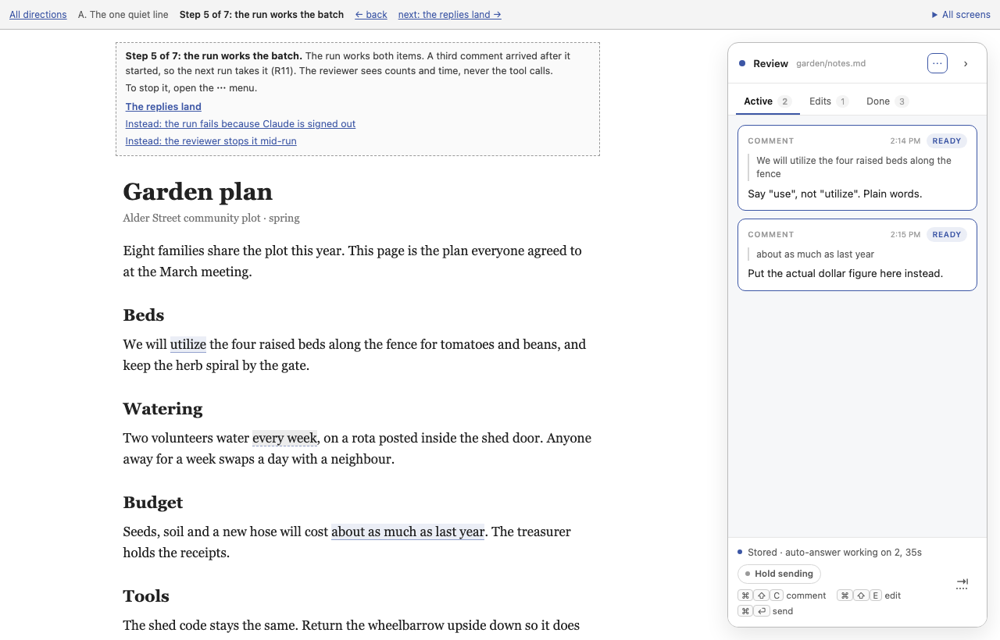
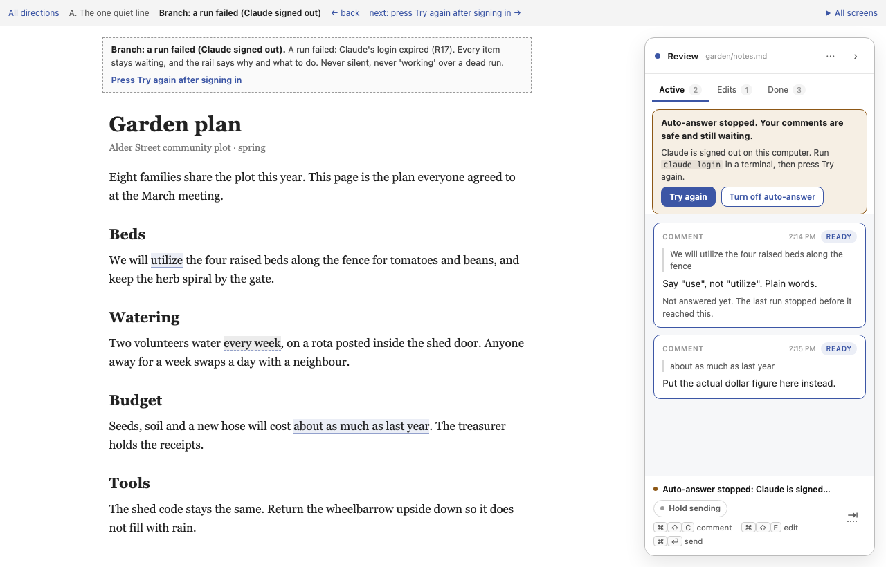
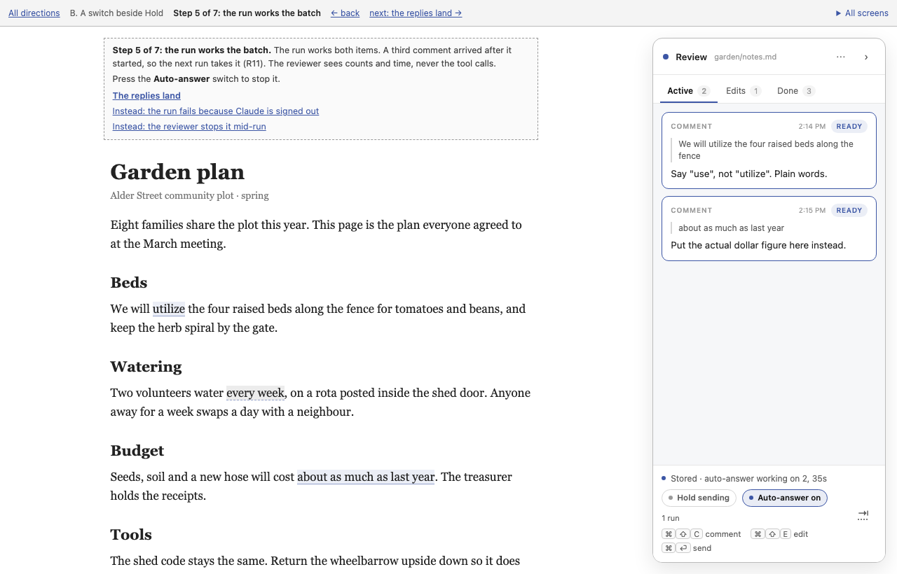
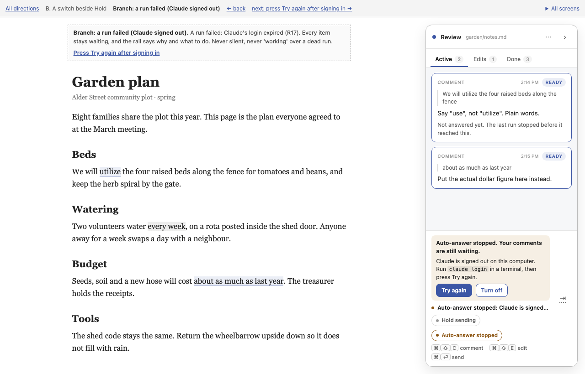
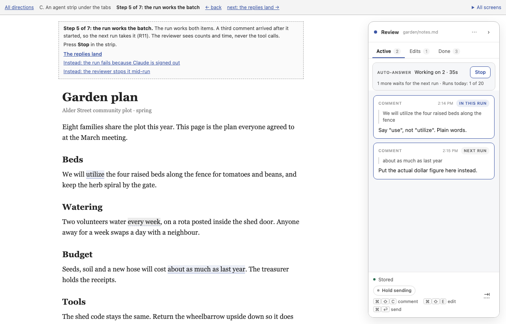
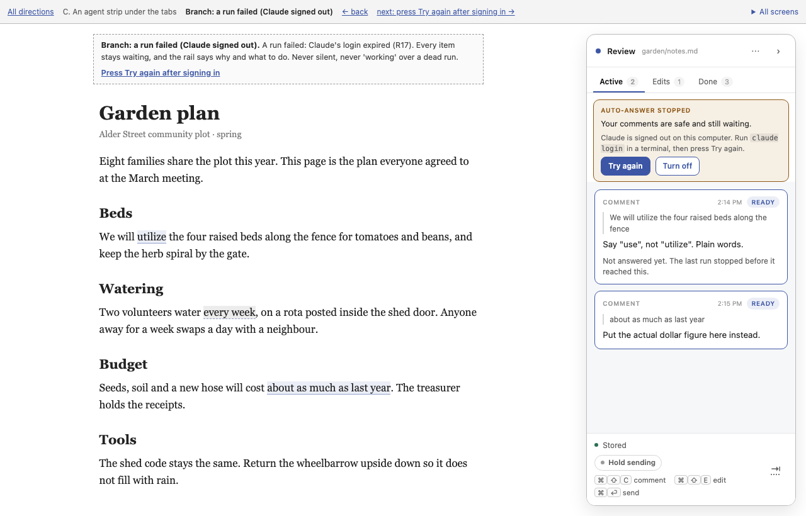

# Wireframe: LAHE starts your agent when a comment is ready

Date: 2026-09-29
Status: DRAFT. Drawn and clicked through without the owner, as he asked. His reaction is recorded here once he gives it.

## Summary

- **Recommendation: B, a switch beside Hold.** Auto-answer is a pill in the footer, next to Hold sending. One click turns it on (after a warning panel), one click turns it off. The run count sits beside it. A failed run shows as a chip under the switch, and the status line goes loud.
- **Why B:** stopping is one click where the reviewer already looks. The status line stays the one place that says what the agent is doing. A run looks the same as a chat agent on the cards.
- **Three decisions the wireframes surfaced** go to the architecture:
  - the overdue banner has to stand down while auto-answer owns the review
  - the status line needs new states, spelled once in `protocol.js`
  - the name "Auto-answer" is a placeholder for the owner to accept or change
- **Wireframes:** [index](wireframes/index.html). 48 screens across three directions, all linked. Controls with a dotted underline are not wired.

## What the reviewer sees

The owner decided the reviewer sees only cards and the rail, with no tool mechanics. So every surface lives in the existing rail.

Surfaces this feature adds or changes:

- a control to turn auto-answer on, and a panel that says what it may do before it starts (R6 and R25 in the brief: the warning, and the optional note for the runs)
- the status line's words while it is on, working, waiting its turn, failed, or paused (R12, a cap on runs at once; R17, failures are visible; R23, a usage ceiling)
- a control to turn it off from the page (R18, stop from the page)
- where usage shows: run count, and tokens where Claude reports them (R24, usage is visible)
- a card whose run failed, a card the runs gave up on, and a card left with a change but no reply after a stop (R5, stopping is clean; R13, retries stop; R17, failures are visible)

The core workflow, one line per step:

1. The reviewer has a review open. Auto-answer is off.
2. They turn it on and read what it may do, who can make it act, and what it costs.
3. It is on, and nothing is waiting, so nothing runs.
4. They send a comment and a hand edit. LAHE starts one run for both.
5. The run works them. A comment sent meanwhile waits for the next run.
6. The replies land on the cards. One comes back as a question.
7. They turn it off from the page.

Branches drawn: usage, waiting its turn behind other reviews, a failed run, a comment the runs gave up on, the daily usage limit, stopping mid-run, and the card left after that stop.

Every direction uses the same document (a garden plan), the same four cards and the same words. The three cards come from the spike's real run: "use, not utilize", "every week" to "each Monday", and a dollar figure that exists nowhere, which comes back as a question.

## The three directions

### A. The one quiet line

[Start](wireframes/a-quiet-line/01-off.html)

- **Argues:** auto-answer is one more answer to the question the status line already answers ("has anything come back?"). So A adds words to that line and one item to the head's menu, and nothing else. A failure borrows today's overdue banner at the top of the rail.
- **Gives up:** stopping takes two clicks through a menu, which is the wrong place for stopping an agent that is misbehaving. Usage is hidden in hover text. Nothing on screen says the mode exists unless you read the line.
- **Signature:** the status line itself, "Stored · auto-answer working on 2, 35s".

| Working | Failed |
| --- | --- |
|  |  |

### B. A switch beside Hold

[Start](wireframes/b-switch-by-hold/01-off.html)

- **Argues:** auto-answer controls the conversation with the agent, like Hold sending does, and the code already names that row as the place for it. So it is a second pill there. The warning panel opens in the footer, where End review's confirm opens today. The run count sits beside the pill, like Hold's queued count, and opens usage.
- **Gives up:** one more pill in the footer, and at the narrowest rail the run count wraps to its own line. A failure shows at the foot of the rail, not the top.
- **Signature:** the Auto-answer switch beside Hold sending.

| Working | Failed |
| --- | --- |
|  |  |

### C. An agent strip under the tabs

[Start](wireframes/c-agent-strip/01-off.html)

- **Argues:** an agent acting on your comments with nobody watching deserves a visible seat. While auto-answer is on, a strip under the tabs says what it is doing and how many runs it has used, with a Stop button always one click away. The same strip turns amber for a failure or the usage limit. Cards say "In this run" or "Next run".
- **Gives up:** vertical space on every screen while it is on. A run now looks different from a chat agent, which goes against Assumption 11 in the brief (the reviewer does not need to tell them apart). To avoid two lines disagreeing about the agent, C has to move the agent half out of the status line, undoing work the calm-liveness change got right.
- **Signature:** the strip, with its always-visible Stop.

| Working | Failed |
| --- | --- |
|  |  |

## Recommendation: B

- **Stop is one click where the eye already is.** The brief added stopping from the page because a misbehaving mode needed a terminal. A buries it in a menu. B and C both make it one click; B does it without new space.
- **The status line stays one line.** The rail had two agent lines once, they contradicted each other in front of the owner, and the fix was to merge them. C brings a second agent surface back and has to gut the status line to stay consistent. B leaves the line's job alone and only adds words.
- **Hold and Auto-answer explain each other.** With Hold on, nothing sends, so no run starts. Side by side, the two pills show that without a sentence.
- **Cards stay as they are.** A reply from a run reads exactly like a reply from a chat agent, which is what the brief asks for.
- **Smallest change after A,** and A's cost (the hidden stop) is the one R18 (stop from the page) exists to prevent.

Worth taking from the others:

- **From C, the "Next run" note, maybe.** Step 5 shows two Ready cards under a line that says "working on 2", and one of them is really waiting for the next run. If dogfood shows the owner wondering which is which, add C's "Next run" pill. Not in the first build.
- **From A, nothing extra.** B already uses A's status-line words, which all three share.

## Decisions for the architecture

These came out of drawing the screens. None needs the owner today; each has a default.

- **The overdue banner must stand down while auto-answer owns the review.** Today, after two minutes with nothing listening, a banner says "Nobody has picked up your comments. Check your agent's window first." With auto-answer on, that is wrong: LAHE knows exactly what is running. Default: while auto-answer is on, the banner and the late-card ring use auto-answer's own words (waiting its turn, failed, paused), and never "check your agent's window".
- **New status-line states, spelled once.** "auto-answer on", "starting on N", "working on N, {age}", "waiting its turn", "stopped: {reason}", "paused: today's runs are used". Default: they join `AGENT_LIVENESS` in `src/shared/protocol.js`, next to today's words, so the rail and the helper cannot drift.
- **"Working" is known, not guessed.** Today the rail infers a chat agent is working from recent commands. With auto-answer, LAHE started the process, so it knows. Default: auto-answer's state overrides the guess while it is on.
- **Failure reasons are a short fixed list.** The screens use "Claude is signed out". The brief also names the usage limit being reached, a crash, and Claude not being installed. Default: one plain sentence and one remedy per reason, and a catch-all for anything else.
- **A card the runs gave up on** wears the amber ring a late card wears today, the "Not handled" pill, and a warning note. Default: reuse the ring, since both mean "this needs you".
- **Usage shows no dollar figure.** Claude's own output reports a list-price estimate, but on a subscription it is not a charge. Default: run count always, tokens where reported, and today's runs against the limit.
- **The warning panel is long.** In the footer at a short window it pushes the cards out of view (see [B's step 2](wireframes/img/b-switch-by-hold__02-turn-on.png)). It shows once per session, so the default is to keep the full text. The list of what it may do is a placeholder until Q4 (permissions) is decided.
- **Turning it on from a chat or terminal** shows the same "on" state on the rail. The warning then shows where the command was run. Not drawn.
- **Stopping asks only when a run is working.** Idle: one click, off. Working: one confirm, because it cuts the run off.

## What the plan changed

The plan pins the rail's words, and where they differ from these screens, the plan wins. The main changes:

- The warning panel has no note field; only the terminal sets the note. Its list of what it may do matches the architecture: one file, no commands.
- The limit buttons are cut, since the page may only ask for on or off. A stopped chip offers one "Try again".
- Screen b7 (a change with no reply after a stop) and the per-card run notes are not built. A stopped run never changes the file, and the rail has no per-item run state.
- "Waiting its turn" becomes "waiting for another review's run".
- A stopped status line says only "auto-answer stopped"; the reason and remedy are said once, in the chip. A daily limit reads "auto-answer paused for today", and the usage limit "auto-answer paused until {time}".
- The overdue banner, the late ring and the overdue toast do not show at all while auto-answer is on and healthy. They do not switch to auto-answer's own words.
- A card the runs gave up on says "Auto-answer could not answer this and stopped trying. Reply here yourself, or hand the review to a chat agent."

## Style rules held

- Failures and the usage limit use a full amber border on all four sides, never a stripe down one edge.
- The one single-side rule on the rail is the existing one on a question from the agent, which means "you have not seen this yet".
- Only the rail's own tokens: the accent blue, the warn amber, the handled green.
- The rail is drawn at its real size: 16px in from the edge, `clamp(320px, 26vw, 392px)` wide.

## How this was checked

- A script walked every link on every screen. None is broken.
- Every screen in each direction can be reached from step 1 by clicking controls and step links, without the "All screens" list.
- Screens were rendered headless at 1280 by 820 and read by eye. The fixes made from that pass:
  - hand edits moved to the Edits tab, where the real rail puts them
  - the tab counts corrected
  - a stray highlight removed from the document

## The owner's reaction

Not given yet. He asked for the full doc set with no stops, and reacts with every doc in front of him. Record here:

- which direction, and what he said about it, including what he rejected
- his reaction to the workflow itself (the order of the steps, anything missing or extra), kept separate from the layouts
