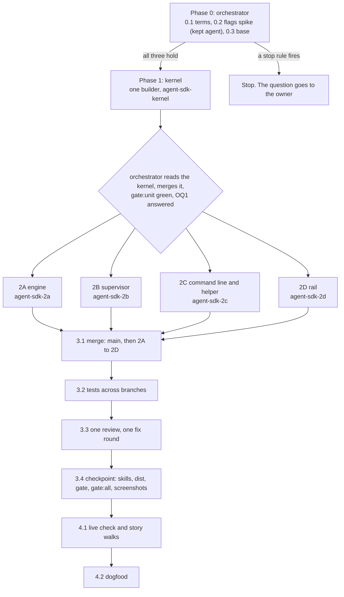

# Plan: LAHE starts your agent when a comment is ready

Status: DRAFT, revision 2. Reworked for one background agent per review, kept running, after the owner rejected one new agent per batch. The first round's four reviews are folded in, and so are this revision's second round (architect and code lead). The biggest change from that round: every agent starts fresh, and nothing is resumed in the first version. Their tables are at the end, and the full prose is in `03_plan_lahe_agent_sdk_reviews.md`.

## Summary

- **Phase 0 can stop the feature.** Before any builder starts, the orchestrator checks three things the architecture leaves open:
  - what the subscription terms say, read on the live page
  - whether the `claude -p` flags the design relies on work in a process that stays running, including replies as structured output on every turn
  - a starting commit where the tests pass, with every other branch that edits the same files already folded in

  If any check fails, the build stops and the question comes to you.
- **Phase 1:** one builder lays the shared pieces:
  - the agent rules (the contract), with each line tagged for chat agents, auto-answer, or both, and every copy of them
  - the shared names for events, routes and states (the wire names)
  - the locks that keep two processes from doing the same work
  - the function signatures each Phase 2 builder codes against
  - the prompt module, built in full, since both the engine and the supervisor need it
  - a fake `claude` for tests that stays running and takes turns on stdin, as the real one does
- **Phase 2:** four builders work in parallel:
  - the engine: starting the agent, sending a turn, reading its replies, and the copy-in and write-back
  - the supervisor: the wake, the done check after every turn, fresh starts after a death or a bad turn, idle close and limits
  - the command line and helper
  - the rail

  **Phase 2 waits for your answer on the terms** (OQ1, whether the subscription terms allow this), or for you to say you accept the risk.
- **Phase 3:** in an integration worktree, the orchestrator:
  - merges the four branches
  - writes the tests that need every branch
  - runs one review with one fix round
  - runs the full gates once
- **Phase 4:** a live check with the real `claude`. Then you run a real review with auto-answer on (the dogfood).
- **Your questions are in one place,** under [Open Questions](#open-questions). Each has the default the build takes if you do not answer.

## How the work is dispatched

**Branches and worktrees.**

- `feat/lahe-agent-sdk`: holds these docs and the progress page, in its existing worktree. Only the orchestrator commits here. The pull request to `main` opens from it after Task 3.4 (checkpoint).
- `agent-sdk-kernel`: Phase 1, in its own worktree, branched from `feat/lahe-agent-sdk` after Task 0.3. The orchestrator merges it back.
- `agent-sdk-2a` to `agent-sdk-2d`: one worktree each, branched from `feat/lahe-agent-sdk` after the kernel merge.
- `integration/lahe-agent-sdk`: in its own worktree, `.claude/worktrees/integration-agent-sdk`. Every merge happens here, never in the shared main checkout. Other agents push from that checkout, and a push there once carried an untested merge to `main`.
- `agent-sdk-fix-<n>`: Task 3.3's fix branches, off the integration branch.

**Where branches meet, and who owns it.** The orchestrator owns every merge and every test that needs more than one branch. Phase 1 pins what each side builds against, so the parallel branches fit together:

| Where two branches meet | Built against | Proved by |
| --- | --- | --- |
| Supervisor (2B) starts the agent through the host (2A) | `host.start` and its handle (Task 1.3) | Task 3.2: the real host under the real supervisor, with the fake `claude` |
| Supervisor (2B) prepares the stage and runs a turn through the engine (2A) | `prepare`, `runTurn` and its return shape (Task 1.3) | Task 3.2: the real engine under the real supervisor |
| Supervisor (2B) and engine (2A) both build prompts, schemas and batches | `headless_prompt.js`, built in full in Task 1.5 | Both branches import the same kernel module |
| Helper (2C) starts the supervisor (2B) | the `supervise` argv and how the helper builds it (Task 1.3) | Task 3.2: the page's "on" starts one supervisor |
| Status and liveness (2C) read what the supervisor writes (2B) | the `agent.json` and `turns.jsonl` fixtures (Task 1.2) | Task 3.2: every state read off a live helper, failures included |
| Rail (2D) reads the liveness answer (2C) | the `auto_answer` liveness fixtures (Task 1.2) | Task 3.2: the browser spec on a real helper |
| Rail's switch (2D) posts to the route (2C) | the route and body in Task 1.2 | Task 3.2: a real click turns a real supervisor on and off |
| Engine (2A) reads the host's stream | the fake `claude` (Task 1.4), built from Task 0.2's raw streams | Task 4.1 with the real `claude` |

**Rules every builder follows.** Repo `CLAUDE.md` holds them ("Running the gate", "Running the loop", "Never remove files while work is running"). In short:

- Run `npm run gate:unit`. Run at most one named browser spec. The full browser suite runs once, in Task 3.4, by the orchestrator.
- Never commit `dist/`. Never run `npm run install-skills`. The orchestrator does both in Task 3.4.
- No `rm`, no `git clean`. List files to remove under "To delete at cleanup" in your report.
- **Your Files list is complete for `src/`.** Lint fails on any `src/` file the manifest does not list, and only Phase 1 edits the manifest. Ask the orchestrator before creating any other file.
- Name new test files with your task's prefix (`auto_answer_engine_*`, `auto_answer_supervisor_*`, `auto_answer_cli_*`, `auto_answer_rail_*`), so two branches never pick the same name.
- Commit per task with a message that says why. Screenshots go in your report; the orchestrator puts them on the progress page.
- Hit a limit? Ask the orchestrator in one line instead of writing around it.
- Tests never call the real `claude` or any model. They use the fake `claude` from Task 1.4.
- Tests never wait on real time. Every timed step takes `opts.now`, `opts.sleep` and `opts.limits` (Task 1.3). The unit suite must pass on Node 18, so no `node:test` fake timers.
- Tests use their own state folder and helper port, and call the teardown helper from Task 1.4. They never touch the owner's helper or state folder.
- Instructions appear once per agent, in its system prompt. They never repeat per turn or per item (brief R14, rules once per agent). No output from `lahe agent`, `lahe monitor` or a turn message repeats rule text.

### Numbers this plan sets

Each lives once, in `AUTO_ANSWER` in `src/shared/protocol.js`. All are guesses the owner can change (OQ3, the numbers).

| Constant | Value |
| --- | --- |
| `TURNS_AT_ONCE` (machine) | 2 |
| `AGENTS_ALIVE` (machine) | 4 |
| `ATTEMPTS_PER_REV`, `ATTEMPTS_PER_ITEM` | 3, 6 |
| `RUNS_PER_DAY_SESSION`, `RUNS_PER_DAY_MACHINE` (a run is one turn) | 40, 120 |
| `FAILED_TURNS_STOP` (in a row, conflicts included) | 3 |
| `STARTS_MAX`, `STARTS_WINDOW_MS` (supervisor starts by the helper, `restarting` exits not counted) | 3 in 10 minutes |
| `TURN_DEATHS_MAX`, `TURN_DEATHS_WINDOW_MS` (agent deaths during a turn or at start-up) | 3 in 10 minutes |
| `TURN_TIMEOUT_MS` | 10 minutes |
| `KILL_GRACE_MS` | 5 seconds |
| `IDLE_CLOSE_MS` (agent closed after no turn) | 60 minutes |
| `FRESH_AFTER_TOKENS` (history above the first request) | 80,000 |
| `QUIET_MS` (burst settles), `GATHER_MAX_MS` | 15 seconds, 60 seconds |
| `FILE_QUIET_MS` (source unchanged before copy-in, after a conflict) | 15 seconds |
| `LOOK_MS` (supervisor look) | 2 seconds |
| `FOLD_WAIT_MS` | 30 seconds |
| `USAGE_PAUSE_MS` | 30 minutes |
| `BATCH_MAX_ITEMS`, `BATCH_MAX_BYTES` | 25, 100 KB |
| `ITEM_MAX_CHARS` (reviewer text) | 8,000 |
| `REPLY_MAX_CHARS` | 500 |
| `NOTE_MAX_CHARS` | 2,000 |
| `CONTEXT_MAX_CHARS` (all context files together) | 40,000 |
| `TURN_FOLDERS_KEEP` | 20 |

There is no per-turn money cap. Task 0.2 finds out what `--max-budget-usd` caps in a process that stays up. If it caps each turn, `BUDGET_USD` (0.50) joins this table.

### Words this plan pins

These live once, in `protocol.js`, beside today's `AGENT_LIVENESS` words. **Where the wireframe and this table differ, this table wins.** "Auto-answer" is the working name (OQ7). It is lowercase inside the status line, after "Stored ·", and capitalized everywhere else. Times use the rail's existing time format, the one cards use. Numbers in braces come from `AUTO_ANSWER`. The reviewer sees batches of work, so the rail calls a turn a run.

**Status line** (the reason and remedy are said once, in the chip, never in the status line):

| State | Words |
| --- | --- |
| starting | Stored · auto-answer starting |
| idle | Stored · auto-answer on |
| gathering | Stored · auto-answer starting on {n} |
| running, applying | Stored · auto-answer working on {n}, {age} |
| queued | Stored · auto-answer waiting for another review's run, {age} |
| paused, this review's limit | Stored · auto-answer paused for today |
| paused, this computer's limit | Stored · auto-answer paused for today |
| paused, usage limit | Stored · auto-answer paused until {time} |
| stopped | Stored · auto-answer stopped |
| off | today's words, unchanged |

**The switch and its panels:**

| Where | Words |
| --- | --- |
| Pill | "Auto-answer", a switch like Hold sending. "Turning on" from the click until liveness confirms. |
| Not-allowed panel | "Auto-answer is allowed from a terminal, once per session. Run this where your agent works:" then the command `lahe agent allow --session {id}` and a Copy button. |
| Warning panel title | "Turn on Auto-answer?" |
| Warning panel body | "Claude will answer new comments on this page by itself, a batch at a time." / "It can read and edit only {file name}. It runs no commands and has no network." / "Anyone who can comment on this review can make it edit that file." / "Each run uses your Claude plan. At most {40} runs today for this review." |
| Warning panel buttons | "Turn on" (primary), "Cancel" |
| Stop confirm | Title "Stop Auto-answer?" Body "A run is working on {n} comments. Stopping ends it, and those comments stay waiting." Buttons "Stop", "Keep running". |
| Run count | "1 run", "{n} runs" |
| Run count, opened | "Today: {n} of {40} runs for this review" / "Resets at midnight." (No token count: `lahe agent status` shows tokens, cache included.) |

**The chip** (one sentence, at most one button):

| Reason | Words | Button |
| --- | --- | --- |
| one failed run, retrying | "Last run failed. Trying again." | none |
| `signed_out` | "Claude is signed out. Sign in by running claude in a terminal, then try again." | Try again |
| `not_installed` | "Claude Code is not where it was when Auto-answer was allowed. Run lahe agent allow again." | none |
| `usage_limit` | "Claude's usage limit was reached. Next try at {time}." | none |
| `limit_session` | "This review's {40} runs for today are used. They reset at midnight." | the existing hand-off button |
| `limit_machine` | "This computer's {120} runs for today are used. They reset at midnight." | the existing hand-off button |
| `source_missing` | "The source file is gone, so Auto-answer stopped." | none |
| `failing` | "Auto-answer failed three times in a row, so it stopped. Try again to turn it back on." | Try again |
| anything else | "Auto-answer stopped. Run lahe agent status in a terminal to see why." | none |

"Try again" sends `want: on`. There are no buttons to change a limit: the page may only ask for on or off.

**Cards:**

| Case | Words |
| --- | --- |
| Gave up | "Auto-answer could not answer this and stopped trying. Reply here yourself, or hand the review to a chat agent." |
| Too long | "Too long for auto-answer; a chat agent can take it." |
| Raw HTML refused | "Auto-answer does not add raw HTML or scripts; a chat agent can do this." |

**Terminal:**

| Where | Words |
| --- | --- |
| `lahe agent allow` warning, every time | "Auto-answer lets Claude answer comments on this review without you." / "It reads and edits one file: {path}. It runs no commands and has no network." / "Anyone who can comment on this review, or run script in its pages, can make it edit that file. Agents with a shell may read that file later." / "It keeps one Claude session running for this review while Auto-answer is on." / "Each run uses your Claude plan. Limits: {40} runs a day for this review, {120} for this computer." Plus, when context files are named: "Context it reads once: {file} ({n} characters)", one line per file. Plus, when preflight finds a login billed by the token: "Your Claude login is billed by the token, so each run costs money." / "Anthropic's terms limit scripted use of a subscription. Whether this use counts is not settled." |
| `lahe monitor` exit 6, when auto-answer holds the session | "Auto-answer is answering this review now. Tell the human, and stop. To take it back: lahe session takeover {id}" |
| `lahe review` re-entry | "Auto-answer is answering this review. No monitor is needed. To take it back: lahe session takeover {id}" |

Rail words never use monitor, heartbeat, wake feed, watching or unattended.

## Phase 0: Facts that could sink the design

The orchestrator alone. No builder starts until all three tasks pass.

::: xref
[Architecture: Subscription terms](02_architecture_lahe_agent_sdk.html#subscription-terms) · [The agent's command](02_architecture_lahe_agent_sdk.html#the-agents-command-claude-code-adapter) · [The structured reply channel](02_architecture_lahe_agent_sdk.html#the-structured-reply-channel) · [To verify before the build](02_architecture_lahe_agent_sdk.html#to-verify-before-the-build)
:::

### Task 0.1: The subscription terms, read on the live page

**Spec:** The architecture's quote came from a web fetch. This time the orchestrator opens [Anthropic's Consumer Terms](https://www.anthropic.com/legal/consumer-terms) and Claude Code's [Authentication](https://code.claude.com/docs/en/authentication) and [Headless](https://code.claude.com/docs/en/headless) pages in a real browser (Claude in Chrome). It copies the exact sentences on automated access and on scripted use of a subscription, with their links, beside OQ1 on the progress page. The owner reads them and decides.

**Acceptance:**

- Each quote matches the live page word for word, with its link.
- If the page no longer says what the architecture quotes, the architecture's Subscription terms section is corrected in the same commit.

### Task 0.2: The flags spike, in a kept agent

**Spec:** Neither spike ran the architecture's whole flag set in a process that stays up. A supervisor script in the scratchpad, built from the second spike's `supervisor.js`, starts the real `claude` (2.1.284) with the architecture's exact command and environment, from an empty stage folder. It feeds turns on stdin. It saves every raw stream. A second script computes every number from those files. The results go in `spike_flags.md` in this folder, with the saved files' paths. The checks spend a handful of turns on the owner's login, as the spikes did.

| Check | Passes when | If it fails |
| --- | --- | --- |
| The whole flag set, kept running | `claude` starts with the architecture's exact production set (`-p --input-format stream-json --output-format stream-json --verbose`, `--safe-mode`, `--restricted`, `--strict-mcp-config`, `--setting-sources ""`, `--tools Read,Edit`, `--permission-mode dontAsk`, `--permission-prompts none`, `--no-session-persistence`, `--append-system-prompt-file`, `--model sonnet`), takes three turns on stdin, and exits 0 when stdin closes. Every later row uses this same set | Stop: the design comes back to the owner |
| Still the subscription | the init event reports `apiKeySource: "none"` with that flag set | Stop |
| Structured output on every turn | with `--json-schema` added to the production set, each of the three turns' `result` carries replies that match the schema; record the field they appear in, and the result type when an answer fails the schema | Run the same turns with the JSON-answer fallback (the architecture's second form). If it passes, the architecture names it as the channel. If both fail: Stop. No shell is granted as a fallback |
| Confinement | a `.env` beside the original source, and a file one folder up, cannot be read by relative or absolute path, on the first turn or a later one | Stop. The security reviewer sees it first |
| Items as data | a turn message holding only the item lines (plus the `file_changed_since_last_turn` line, when set) gets the three spike items handled | Record the smallest wording that works. Any sentence of instruction per turn goes to the owner as a change to R14 (rules once per agent) |
| Rules file | `--append-system-prompt-file` is read, and its text is not in `ps` output | Rules go in `--append-system-prompt`; the process-list exposure is written into the architecture's Security section |
| The copy changes between turns | the copy is replaced between turns; the agent re-reads before editing, or its Edit is refused and it re-reads. Record which | Record only: the write-back checks run on the diff either way |
| What `work/` holds | after several turns, `work/` holds only the copy. A comment asking the agent to create a second file there: record whether Edit can | If Claude Code writes its own files there, the one-file check names them; the architecture says so |
| A kill, then a fresh start | SIGKILL while idle: `exit` fires, and a fresh agent at the next turn handles the next item. SIGKILL mid-turn: a fresh agent handles the same items | Stop: the life-cycle design needs rework |
| Budget flag | record whether `--max-budget-usd` stops one turn or the whole process, and whether it applies on a subscription | Leave the flag out; the warning and the architecture say the daily turn counts and the 10-minute limit are the only caps |
| Failures | in the kept-running mode, at the first turn: exit code and stream text told apart for signed out (an empty `CLAUDE_CONFIG_DIR`), `claude` missing, a killed process. A usage limit cannot be forced: record "not seen" | Unclear output is named `crashed`; the architecture says so |
| Wrong input | the error text for a start without `--verbose`, and for a malformed stdin line | Record only: the fake reproduces them |
| Nothing saved | with `--no-session-persistence`, no transcript appears under `~/.claude/projects/` for the stage folder | The warning says the history is saved, and OQ10 goes to the owner |
| Hostile comment | a comment asking for a `<script>` tag: record what the model does | Nothing: LAHE's own check refuses it either way |
| Prompt size and cache | tokens per request with the `all` and `headless` contract lines, at the first turn and at later turns, against the second spike's lean numbers (5,269 first request, about 2,000 tokens of cache written per later turn) | More than double: go on, and put the number beside Q1 (billing) |
| Rules once | transcripts of turns given 1, 10 and 25 items, and of 100 items across 4 turns of one agent: the rules appear once per agent, and no turn message holds anything instruction-like | Stop: brief R14 (rules once per agent) is the point of the feature |

Also saved: the raw bytes of every stream and failure, for Task 1.4's fake `claude`, the `claude --help` flag list, and every flag pair Claude Code refused.

**Acceptance:** `spike_flags.md` has a pass or fail per row, each number traced to a saved file, and one verdict line. Any row that failed has changed the architecture before Phase 1 starts.

### Task 0.3: Base commit and overlapping branches

**Spec:**

1. Find every open branch whose diff touches a file this plan changes. The list:
   - `src/shared/`: `review_format.js`, `protocol.js`, `manifest.js`
   - `src/service/`: `agent_sessions.js`, `static_servers.js`, `routes.js`, `projection.js`, `replies.js`, `index.js`
   - `src/cli/`: `index.js`, `commands/monitor.js`, `commands/review.js`, `commands/add.js`, `commands/status.js`
   - `src/layer/`: `overlay.js`, `sync.js`, `index.js`, `tab_done.js`
   - docs: `skills/lahe/SKILL.md`, `docs/CONTRACTS.md`, `docs/CLI.md`, `docs/diagrams/session_ownership.md`

   `feat/lahe_library` (pull request 19, open) touches most of them. Land each branch, or agree with the owner how it folds in.
2. Merge `main` into `feat/lahe-agent-sdk`. It branched behind `main`, and those commits change `sync.js`.
3. Record the base commit on the progress page, with `gate:unit` and the browser suite green there. If main's suite is red, fixing it comes first (Q8, priority).
4. Add the board row the architecture promised to `docs/BULLETIN.md`. The row says rendered Markdown passes raw HTML through with no CSP.

**Acceptance:** the progress page names the base commit, the gate result at it, and each overlapping branch with what happened to it. The board row exists.

## Phase 1: Kernel

One builder, alone, on `agent-sdk-kernel`. After Phase 1, no Phase 2 builder edits anything under `src/shared/`, `locks.js`, `file_stamp.js`, or any copy of the contract. So everything Phase 2 needs there lands now.

::: xref
[Architecture: Data / State Changes](02_architecture_lahe_agent_sdk.html#data-state-changes) · [The system prompt](02_architecture_lahe_agent_sdk.html#the-system-prompt-one-source-of-the-rules)
:::

### Task 1.1: The tagged contract, and every copy

**Spec:** In `review_format.js`, add `CONTRACT_LINES`, a list of `{ tag, text }` with each tag `all`, `chat` or `headless`. `CONTRACT` stays a list of strings: the `all` and `chat` lines in order. That is what `review.json` carries. Then:

- Reword the few `all` lines that name the reply transport, so they name the reply's fields only.
- Add the `headless` lines the architecture lists for an agent that stays running: each message is a batch, the one file, read it afresh each batch, read back, one reply per item in the reply format with nothing after it, do not wait or start anything.
- Change the "forever daemon" line as Assumption A9 says. A chat agent never starts a long-lived process. Auto-answer is the only one, and LAHE starts it.
- Reword the exit-6 line to say that exit 6 means another owner holds the session, either a chat agent or auto-answer, and `lahe session takeover` takes it back.

Carry the change into every copy in one commit:

- `skills/lahe/SKILL.md`, plus one sentence: when auto-answer is on for your session, tell the human and stop
- `docs/CONTRACTS.md`
- the restated copy and the line count in `test/unit/review_format.test.js`
- `test/unit/projection_review_json.test.js`, which asserts `review.json` carries `CONTRACT`
- any of `add_command`, `monitor_command`, `no_stale_excuse`, `protocol_wire`, `reply_command` and `status_command` tests that the new wording breaks

**Files:** `src/shared/review_format.js`, `skills/lahe/SKILL.md`, `docs/CONTRACTS.md`, and the tests above.

**Acceptance:**

- Every line of `CONTRACT_LINES` carries exactly one of the three tags. A test fails on a missing or unknown tag.
- `CONTRACT` equals the `all` and `chat` texts in order, and `review.json`'s contract equals `CONTRACT`.
- A test names one known chat-only line (it names `lahe monitor`) and asserts it is absent from the `headless` view, and one known headless line and asserts it is absent from `CONTRACT`.
- The skill and `docs/CONTRACTS.md` match the new text. The orchestrator checks this with a diff.

### Task 1.2: Wire names, fixtures and the manifest

**Spec:** In `protocol.js`, spell once:

- the `AUTO_ANSWER` numbers and every pinned word above
- the supervisor states, stop reasons, turn outcomes and failures
- the event kind `auto_answer.requested`, the route `POST /lahe/v1/auto-answer`, its one body field `want`
- the reply agent name `claude-auto`, and the fold's rejection reason `auto_answer_owns`
- `SERVICE_CONTRACT` from 13 to 14, with its comment

In `projection.js`, fold `auto_answer.requested` into the latest request for the review. In `agent_sessions.js`, add two predicates:

- `allowanceHolds(session)`: reads `auto_answer.json` and returns true when its `handoff_rev` equals the session's.
- `autoAnswerHolds(session)`: the allowance holds and the latest request for its review is "on". This is the one meaning of "auto-answer holds a review". The fold, `lahe monitor`, `lahe review` re-entry and the liveness answer all use it.

Add fixtures in `test/fixtures/auto_answer/`, paired by state:

- `agent.json`, one per supervisor state and reason, each with and without a live agent, including "turning on", "on, supervisor dead" and a `restarting` exit, with `turn_deaths` filled in one of them
- `supervisor_starts.json`, under the limit and at it
- the liveness `auto_answer` object each one should produce
- a sample `turns.jsonl` with an applied turn, a refused turn, a conflict, a crashed turn with `"usage": null` and a stopped turn, from two agent processes, and a matching `turns/` folder with a `diff.patch` and one `result.json` still at `applying`
- a sample `auto_answer.json`, with and without context files

Add every new file of Tasks 1.3, 1.4 and 1.5 to `manifest.js`, in the non-bundle list.

**Files:** `src/shared/protocol.js`, `src/service/projection.js`, `src/service/agent_sessions.js`, `src/shared/manifest.js`, `test/fixtures/auto_answer/` (new).

**Acceptance:**

- The projection's latest request follows the last event, and ignores other reviews' events.
- `allowanceHolds` is false after a takeover bumps the rev, and false with no `auto_answer.json`.
- `autoAnswerHolds` is false after "off" and true with "on" standing, whether or not a supervisor is alive.
- Lint's manifest check passes with every new file listed.
- The bundle gains only the wire names and words, no Node-only code (checked with `npm run build:layer` locally, not committed).

### Task 1.3: Locks, stamps, and the signatures Phase 2 meets at

**Spec:** Three things.

**Locks.** Move `withServerLock` and `takeOverStaleLock` into `src/service/locks.js`, unchanged, and have `static_servers.js` use them. Add the second kind the architecture names: a lock held for as long as a process lives. It goes stale only when its pid and that pid's start time no longer match a live process. The start time comes from `ps -o lstart=` run with `LC_ALL=C TZ=UTC`, through a reader a test can replace.

**Stamps.** Add `src/service/file_stamp.js`: content hash, size and mtime of a user file.

**Signatures.** Create each new module with its exported functions and doc comments, each body throwing "not built yet". Phase 2 fills them in and removes every such line. Every timed function takes `opts.now`, `opts.sleep` and `opts.limits` (defaults from `AUTO_ANSWER`), as `monitor.js` already takes `opts.now`.

| Module (owner) | Exports |
| --- | --- |
| `headless_prompt.js` (kernel, Task 1.5) | built in full, not stubbed: `buildPrompt(note, context)` returning the text and its `sha256`, `buildSchema()`, `buildTurnMessage(items, stagePath, fileChanged)`, `cutBatches(items)` returning `{ batches, too_long }`, `readReplies(resultEvent)`: the replies from structured output or from the final JSON answer, whichever Task 0.2 chose, or `bad_output` |
| `host_claude_code.js` (2A) | `start(agentSpec, opts)`, where `agentSpec` carries the prompt as text; the adapter writes the prompt file and removes it when the process ends. It returns a handle: `{ pid, pgid, started, sessionId(), sendTurn(message, { timeout_ms, signal }), close(), kill(), onExit(cb) }`. `sendTurn` resolves with `{ replies, usage, context, model_turns, compacted, failure }` at the turn's end. Usage is the difference from the previous result of the same process, counted from zero for a new one; a turn with no result sums its messages' usage, or reports `null`. `failure` is `null`, `signed_out`, `usage_limit`, `crashed`, `timed_out`, `stopped` or `bad_output`. `onExit` fires once, on the child's own `exit` event. |
| `headless_stage.js` (2A) | `prepare(allowance, stageDir)`: empties `agent/work/` and makes the copy; running it twice gives the same result. `runTurn(handle, allowance, items, opts)`: the whole turn, from making the copy match the real file to write-back. `opts` carries `turn_id` (minted by the supervisor), `fileChanged` and `signal`. It writes `turns/<turn_id>/` (`result.json` at `applying`, flushed before the rename, then `done`; `log.jsonl`; `diff.patch`) and returns `{ turn_id, outcome, failure, applied, replies, usage, context, model_turns, compacted, file_reset }`, where `replies` are checked and ready to write. A kill the supervisor asked for through `signal` is `stopped`. `opts.hooks.afterWriteBack` and `opts.hooks.beforeRename` let a test crash it at an exact step. |
| `run_slots.js` (2B) | `takeTurn(stateDir, session, opts)`, `takeAgent(stateDir, session, opts)`, `release(slot)`, `countToday(stateDir, session, opts)` |
| `headless_supervisor.js` (2B) | `supervise({ session, stateDir }, opts)`. It writes `agent.json`, `turns.jsonl`, `attempts.json` and `replies-claude-auto.jsonl`. It owns the agent's life (fresh start, death, idle close, giving way), the 10-minute limit, the quiet wait, and the too-long replies. `opts.engine` defaults to `{ prepare, runTurn }` from `headless_stage.js`, and `opts.host` to `host_claude_code`, so 2B tests pass fakes of both. |
| `src/cli/commands/agent.js` (2C) | `lahe agent allow [--note] [--context <file>]... [--model] [--runs-per-day] | disallow | on | off | status [--diffs]`, and `lahe agent supervise --session <id> --state-dir <dir>`. The helper spawns it with `process.execPath` and the clone's `bin/lahe.js`, detached, in its own process group. |

**Files:** `src/service/locks.js`, `src/service/file_stamp.js`, `src/service/static_servers.js`, and the modules above except `headless_prompt.js` (Task 1.5).

**Acceptance:**

- Every existing static-server lock test passes, unchanged.
- Two child processes, released together by a start file, race for each lock kind 20 times; exactly one wins each time.
- A process lock whose pid is dead is taken over. One whose pid was reused with a different start time is taken over. One held by a live process for longer than 20 seconds is not.
- The `ps` reader parses real `ps` output for the test's own `process.pid`, on the platform the test runs on.
- A file stamp changes when the content changes, and not when the file is only read.

### Task 1.4: The fake `claude` and the teardown helper

**Spec:** A small Node script standing in for `claude`. Like the real one in stream-json mode, it stays running, reads one user message per stdin line, and writes a stream per turn: `init` on the first message, assistant messages, and a `result` line with running totals of usage and cost. It exits 0 when stdin closes. A scenario file tells it what to do on each turn, and each scenario uses the raw bytes Task 0.2 saved, naming the file they came from. It:

- edits the stage copy, or a file outside it
- replies in the structured form Task 0.2 chose
- checks each stdin message's envelope (`type`, `message.role`, `content`), and answers a bad one with the error Task 0.2 recorded
- refuses the flags and flag pairs Claude Code refused in Task 0.2, a missing `--verbose` included
- dies while idle or mid-turn, hangs past the timeout, emits a `compact_boundary`, or leaves a second file in its working folder, when told to
- starts a grandchild, or ignores SIGTERM, when told to
- exits non-zero on any flag missing from the `claude --help` list Task 0.2 recorded
- writes the arguments, working folder, environment, pid, process group, each turn's message and its start and end times, to a file tests read

Its one timer carries a `harness-allow-timer:` comment with the reason, so `no_arbitrary_sleeps.test.js` passes. The usage-limit scenario is a guess until one is seen, and its name says so.

The teardown helper reads every process group the fake recorded, plus `agent.json` and `run-slots/`, and kills what is left. Every auto-answer test calls it in `after`.

**Files:** `test/fixtures/auto_answer/fake_claude.js`, `test/fixtures/auto_answer/scenarios/`, `test/helpers/auto_answer_teardown.js` (new).

**Acceptance:** scenarios exist for:

- three clean turns in one process, and a turn where one item gets no reply
- a death while idle, a death at start-up, a death mid-turn, a hang, bad output, an answer that fails the schema, and output nothing recognizes
- a malformed envelope, and a missing `--verbose`
- a `compact_boundary` mid-turn, and a stray file left in `work/`
- signed out, and the guessed usage limit
- a reply for an item not in the batch, a reply for an item from an earlier turn, and over-long reply text
- an added `<script>`, and an edit to a file other than the copy
- a grandchild that ignores SIGTERM

Each is used by at least one Phase 2 test.

### Task 1.5: The prompt module, built in full

**Spec:** Build `src/service/headless_prompt.js` completely, as the architecture's "The system prompt" and "The turn message" describe, with the exports in Task 1.3's table. It is pure and small, and both 2A and 2B need it, so it is not left as a stub. It sits beside Task 1.1's contract work.

**Files:** `src/service/headless_prompt.js`, `test/unit/auto_answer_prompt.test.js`.

**Acceptance:** every Prompt line in the Test List passes.

**Phase test:** `gate:unit` green on `agent-sdk-kernel`. The orchestrator reads the kernel diff, merges it into `feat/lahe-agent-sdk`, and starts Phase 2 once OQ1 (the terms) is answered.

## Phase 2: Four builders in parallel

Each builder reads first: the architecture, `docs/ongoing/SESSION_OWNERSHIP.md`, `docs/CONTRACTS.md`, `docs/CLI.md`, `skills/lahe/SKILL.md`, `spike_persistent_run.md` (its supervisor is the shape 2A and 2B build properly), and Task 1.3's signatures.

### Task 2A: The engine

::: xref
[Architecture: A wake, one turn](02_architecture_lahe_agent_sdk.html#a-wake-one-turn-of-the-same-agent) · [The structured reply channel](02_architecture_lahe_agent_sdk.html#the-structured-reply-channel) · [The agent's command](02_architecture_lahe_agent_sdk.html#the-agents-command-claude-code-adapter) · [Security](02_architecture_lahe_agent_sdk.html#security-privacy-notes)
:::

**Spec:** Fill in the two engine modules as the architecture describes them. The prompt module is already built (Task 1.5).

- `host_claude_code.js`: starts the agent with the command from the architecture's flag table, by the absolute path recorded at allow time, in its own process group, always fresh. It writes the prompt file from the text it is given, outside `work/`, and removes it however the process ends. The environment comes only from `auto_answer.json`'s `env`. It sends one turn at a time and refuses a second `sendTurn` while one is in flight. It reads the stream line by line and computes each turn's usage as the difference of the running totals, from zero for a new process. A turn with no result sums its messages' usage, or reports `null`. When the supervisor's `signal` fires, or its own backstop timer passes: SIGTERM to the group, the grace time, then SIGKILL, with failure `stopped` or `timed_out`. `onExit` fires from the child's `exit` event.
- `headless_stage.js`: `prepare` empties `agent/work/` and makes the copy. `runTurn` makes the copy match the real file and stamps it, sends the turn, and checks the replies against the batch. It checks that `work/` holds only the copy, removing strays and refusing the turn, then diffs the copy. It writes back only when every check in the architecture's "Checks before anything reaches the real file" passes, with `result.json` at `applying` flushed before the rename. After a refused or conflicting turn it resets the copy and reports `file_reset`. The turn records follow the architecture's "Turn records".

**Files:** those two, and `test/unit/auto_answer_engine_*.test.js`.
**Don't touch:** `headless_prompt.js` (kernel), `headless_supervisor.js`, `run_slots.js`, `agent.js`, any `src/service/` or `src/layer/` file outside the two.

**Acceptance:** every Engine line in the Test List passes with the fake `claude`.

### Task 2B: The supervisor

::: xref
[Architecture: A wake, one turn](02_architecture_lahe_agent_sdk.html#a-wake-one-turn-of-the-same-agent) · [The agent's life](02_architecture_lahe_agent_sdk.html#the-agents-life-start-death-fresh-start-close) · [The supervisor's states](02_architecture_lahe_agent_sdk.html#the-supervisors-states) · [Retries, failures and limits](02_architecture_lahe_agent_sdk.html#retries-failures-and-limits) · [Stopping, and handing back](02_architecture_lahe_agent_sdk.html#stopping-and-handing-back)
:::

**Spec:** Fill in `run_slots.js` and `headless_supervisor.js` as the architecture describes them. The linked sections cover:

- the drain with `suppressActivityTouch`, and replies written with `reply.js`'s encoder, including the too-long replies `cutBatches` names
- one turn at a time, with the end of the turn as the only "done"
- the done check after every turn: the fold wait (a fold matched by item and rev, a rejection by file and line), then counting attempts, then draining again
- the agent's life: every start fresh and only when a turn is ready; a death while idle logged and left until the next turn; a death during a turn or at start-up counted in `turn_deaths`; a fresh start after a bad turn, a long history or a new prompt; the idle close; giving way to a `want-agent` marker
- the states and each look, including the 10-minute limit by wall-clock time and the 15-second quiet wait before any slot is taken
- slots in order: agent slot first, then turn slot, never waiting while holding one
- attempts (refused turns included), failures (conflicts not included) and limits
- minting each `turn_id`, and passing `fileChanged` and a stop `signal` into the turn
- stopping, leftover agent groups, and settling any `result.json` still at `applying` before anything else
- rebuilding today's counts and the next `turn_id` from `turns.jsonl` at start
- the exit on stale code, which waits for a turn in flight and exits with `restarting`, not `stopped`

The supervisor calls `opts.engine` and `opts.host`, imports the kernel's `headless_prompt.js`, and takes every number from `AUTO_ANSWER`.

**Files:** those two, and `test/unit/auto_answer_supervisor_*.test.js`.
**Don't touch:** the engine's two modules (tests pass fakes), `headless_prompt.js`, `agent.js`, `index.js`, anything under `src/layer/`.

**Acceptance:** every Supervisor line in the Test List passes, and a unit test searches `headless_supervisor.js` and `run_slots.js` and finds no `claude` flag (brief R4, Claude Code first with other hosts later).

### Task 2C: The command line and the helper

::: xref
[Architecture: Allowing it, then turning it on](02_architecture_lahe_agent_sdk.html#allowing-it-then-turning-it-on) · [On and off are events](02_architecture_lahe_agent_sdk.html#on-and-off-are-events-and-the-page-may-only-ask) · [One review per session](02_architecture_lahe_agent_sdk.html#one-review-per-auto-answer-session) · [Lean by default](02_architecture_lahe_agent_sdk.html#lean-by-default-and-a-projects-own-context)
:::

**Spec:**

- `lahe agent`, registered in `src/cli/index.js`: `allow` (preflight, the pinned warning, `auto_answer.json` under the short lock, and the context files copied into `auto_answer_context.md`), `disallow`, `on`, `off` (posted to the route as the CLI client), `status` (state, whether an agent is alive and since when, turns today, and each turn's input, output, cache read and cache write, with "not reported" where a turn has none), `status --diffs`, and `supervise`.
- `allow` refuses:
  - instruction files, dot paths, the state folder, paths outside home, and a symlink to any of those, as the edited source
  - a non-Markdown source
  - a context file that is missing or not a regular file, or context over 40,000 characters in all
  - a session that owns more than one review
  - Windows
  - `claude` missing or signed out
- The route reads only `want` and refuses any value other than `on` or `off`. It makes the D11 checks (the review token every write route needs), and sets `from` from the client header. The generic events route refuses `auto_answer.requested`.
- The helper starts `supervise` on an allowed "on", unless a live one holds the lock. With "on" standing and none alive, it starts a new one only after a `restarting` exit, or when `agent.json` shows no stop was written. A failure stop stays until a new "on" arrives after it. It records each start in `supervisor_starts.json`, which only it writes, not counting starts after a `restarting` exit, and refuses a fourth within ten minutes with `failing`.
- The fold rejects replies from other agents while `autoAnswerHolds` is true (`auto_answer_owns`). The monitor, `review` re-entry and liveness use the same predicate.
- The liveness answer counts a live supervisor at the current rev as listening, and adds `auto_answer`. It never sends a path, the note, the context, or a dollar figure.
- `lahe monitor` exits 6 with the pinned words while `autoAnswerHolds` is true. `lahe review` re-entry prints the pinned words and no monitor lines. `lahe review` and `lahe add` refuse a second review in the session.
- `docs/CLI.md` and `docs/diagrams/session_ownership.md` describe the new command and the new owner.

**Files:** `src/cli/commands/agent.js`, `src/cli/index.js`, `src/service/routes.js`, `src/service/index.js`, `src/service/agent_sessions.js`, `src/service/replies.js`, `src/cli/commands/monitor.js`, `src/cli/commands/review.js`, `src/cli/commands/add.js`, the two docs, and `test/unit/auto_answer_cli_*.test.js`.
**Don't touch:** the engine, the supervisor loop, anything under `src/layer/` or `src/shared/`.

**Acceptance:** every Command line and helper line in the Test List passes.

### Task 2D: The rail

::: xref
[Architecture: What the rail shows](02_architecture_lahe_agent_sdk.html#what-the-rail-shows-wireframe-direction-b) · [Wireframe B](wireframes/b-switch-by-hold/01-off.html)
:::

**Spec:** Wireframe direction B, with the words pinned above. The kept agent changes nothing the reviewer sees. Where the wireframe and the pinned words differ, the words win. Not built from the wireframe:

- the note field on the warning panel (only the terminal sets the note)
- the "Raise the limit" and "Change the limit" buttons
- screen b7 and the per-card run notes, because the liveness answer carries no per-item state

What is built:

- the pill beside Hold sending, a real switch (`button`, `aria-pressed`), reusing `.holdbtn`
- "Turning on" until liveness confirms, then on; back to off with the not-allowed panel if nothing starts
- the not-allowed panel: focusable pill, a panel with a Copy button, not hover text
- the warning panel on the first "on" in a session, and the stop confirm while a turn works. Both reuse End review's confirm: they take focus, close on Esc, and return focus to the pill. The warning panel scrolls inside the footer on a short window.
- the run count and its popup
- the chip under the switch, `role="status"`, with its one button
- the status line's words from `auto_answer.state`. Only a change of state is announced; the ticking age is not.
- nothing counts as overdue while auto-answer is on and healthy: no banner, no late ring, no overdue toast (`raiseOverdueToast`)
- a gave-up card: the late ring (`CARD_LATE_ATTR`), the "Not handled" pill and the pinned words (`tab_done.js`)
- the rail repaints when `auto_answer` changes (`livenessKey` in `sync.js`), and the switch posts through `sync.js`, wired in `src/layer/index.js` the way Hold is
- no new motion: the dot does not pulse, and the existing reduced-motion rules apply. No new color: the accent, `--warn` and the handled green only.

Build against the Task 1.2 fixtures only.

**Files:** `src/layer/overlay.js`, `src/layer/sync.js`, `src/layer/index.js`, `src/layer/tab_done.js`, `test/browser/auto_answer_rail.spec.js` (new).
**Don't touch:** anything under `src/service/`, `src/cli/`, `src/shared/`.

**Acceptance:** every Rail line in the Test List passes in `auto_answer_rail.spec.js`, run by name. The report carries screenshots, light and dark, taken after that spec passes, of:

- off, not allowed with its panel open, turning on
- the warning panel, including at an 820-pixel-high window
- starting, gathering, working, waiting for another review's run
- the stop confirm, and the run count opened
- the retrying chip, the usage limit, each daily limit, and stopped with a chip
- a gave-up card, a too-long card, and a raw-HTML card
- the narrowest rail with the run count wrapped

**Phase test:** each branch green on `gate:unit`, and 2D's spec green by name.

## Phase 3: Merge, review and checkpoint

### Task 3.1: Merge

**Spec:** In the integration worktree, merge `main` first, then 2A, 2B, 2C and 2D, running `gate:unit` after each. The orchestrator resolves conflicts; a builder never merges another's branch.

**Acceptance:** the integration branch holds all four on current `main`, `gate:unit` is green, and a search finds no "not built yet" under `src/`.

### Task 3.2: Tests across branches

**Spec:** The orchestrator writes the tests no single branch could. Each runs the real helper, the real `lahe agent` and the fake `claude`, in its own state folder, and calls the teardown helper. The list is the "Across branches" section of the Test List.

**Files:** `test/unit/auto_answer_seams.test.js`, `test/browser/auto_answer_seams.spec.js`.

**Acceptance:** each case passes, and each was seen to fail once when its seam was broken by hand.

### Task 3.3: One review, one fix round

**Spec:** One review set on the integrated diff:

- `review-code-lead`
- `review-security`, since the diff spawns long-lived processes, writes user files, adds a route and handles paths
- `review-testing`

Each finding names the test that would catch it. Builders fix on `agent-sdk-fix-<n>` branches, writing the named test red, then green. The orchestrator checks each test exists and passes. A second review happens only for a fix that is itself risky.

**Acceptance:** every finding is fixed with its test, or written under Changes from plan on the progress page with the reason.

### Task 3.4: Checkpoint

**Spec:** In the integration worktree:

1. merge `feat/lahe-agent-sdk` in, for the docs the orchestrator changed meanwhile
2. `npm run install-skills`
3. rebuild and commit `dist/`
4. run `npm run gate`, then `npm run gate:all`, each as its own command
5. read the pass and fail counts
6. retake 2D's screenshots from `auto_answer_rail.spec.js` on this branch, after it passes
7. only then push, as a separate command, to `feat/lahe-agent-sdk`

**Acceptance:** both gates read "0 failed" in their output. The counts and the screenshots are on the progress page, and the push came after.

## Phase 4: Live check and dogfood

### Task 4.1: Live check, story walks, fresh clone

**Spec:** On a throwaway review in the scratchpad, use the built `lahe agent` (not the spike scripts) to check each "Live" line in the Test List. Then:

- walk every user story in the brief in the browser, on a real review, with the real `claude`
- clone the repo fresh into the scratchpad and run `lahe agent allow` from it with no install step (brief R3, nothing to install)

**Acceptance:** each line checked, with the saved file that shows it, on the progress page. Any output that differs from the fake `claude` updates its scenario and gets a test.

### Task 4.2: Dogfood

**Spec:** The owner runs a review of at least five comments with auto-answer on. The document is one no agent reads as instructions (the default for OQ6, instruction files). A script reads `turns.jsonl`, `attempts.json`, `agent.json`'s history and the event log. It writes the numbers the brief asks for, one row per item:

- turns and failures
- items that hit the limit
- double answers
- the time from ready to reply

It also writes one row per agent start, with why it started (first turn, crash, idle close, fresh start).

**Acceptance:** each brief success metric marked pass or fail on the progress page, from the script's output. The owner judges each comment reply.

## Test List

::: callout-req
**Prompt (1.5)**

- [ ] The system prompt is the `all` and `headless` lines in order, then the note, then the context. Checked against hand-picked lines, not the code's own filter.
- [ ] The prompt and its hash are the same whether the agent will be given 1 or 25 items, and change when the note or context changes.
- [ ] The turn message deep-equals the drain's item lines cut to the allowed fields, with only `source_hint` changed. No path, origin, linked file or summary line. The `file_changed_since_last_turn` line appears only when asked for. No turn message holds a `CONTRACT` line.
- [ ] The schema's field names equal `REPLY_FIELD` and `REPLY_REQUIRED`.
- [ ] Replies read from the chosen structured form parse to the expected list. A result with no replies, replies that do not fit the schema, or Task 0.2's schema-failure result is `bad_output`.
- [ ] 30 ready items become batches of 25 and 5. A batch over 100 KB is cut at the item that crosses it. An item over 8,000 characters is in `too_long`, not in any batch.

**Engine (2A)**

- [ ] One handle takes three turns: the fake records one pid, and each turn's usage is the difference of the running totals. A second process's first turn counts from zero.
- [ ] A turn that dies before its result records its messages' summed usage, or `null`.
- [ ] A second `sendTurn` while one is in flight is refused.
- [ ] A page-posted `source_hint` pointing elsewhere does not change which file is copied in.
- [ ] Before each turn the copy matches the real file, after an outside edit. After a refused turn and after a conflict, the copy is reset at once and `file_reset` is true.
- [ ] `prepare` run twice gives the same `agent/work/` with one file.
- [ ] A reply over 500 characters is dropped and logged, and its item counts as unanswered.
- [ ] The recorded arguments include `-p`, `--verbose`, `--input-format stream-json`, `--output-format stream-json`, `--safe-mode`, `--restricted`, `--strict-mcp-config`, `--setting-sources ""`, `--tools Read,Edit`, `--permission-mode dontAsk`, `--permission-prompts none`, `--no-session-persistence`, `--append-system-prompt-file` and `--model`, plus `--json-schema` if Task 0.2 chose it. They never include `--bare`, `Bash` or `--resume`.
- [ ] The fake refuses a start without `--verbose`, and a malformed envelope ends as a named failure within the timeout, not a hang.
- [ ] The recorded working folder is the stage `work/` folder, holding exactly one regular file.
- [ ] `claude` runs by the absolute path recorded at allow time, not from `PATH`.
- [ ] The child environment is exactly `auto_answer.json`'s `env`. `ANTHROPIC_API_KEY`, `NODE_OPTIONS`, `ANTHROPIC_BASE_URL`, `CLAUDE_CODE_USE_BEDROCK`, any `CLAUDE_CODE_*` and any `LAHE_*` variable set in the parent are absent.
- [ ] The review token appears in none of the prompt, turn messages, environment or arguments.
- [ ] Clean, death mid-turn, a stop through `signal`, the backstop timeout, bad output, signed out and usage limit are each named correctly (`crashed`, `stopped`, `timed_out`, and so on). Output nothing recognizes is `crashed`, never `finished`. The usage-limit test's title says its output is a guess.
- [ ] `onExit` fires once when the fake dies while idle, with its code and signal.
- [ ] A stop reaches a grandchild that ignores SIGTERM: with a 200 ms grace, `process.kill(-pgid, 0)` reaches ESRCH.
- [ ] A reply for an item or rev not in the batch, including one from an earlier turn, is dropped and logged. A `files` value from the agent is ignored; `files` comes from the stamps.
- [ ] A turn that edited the file but left an item without a reply is `refused`, and nothing is written.
- [ ] A stray file left in `work/` makes the turn `refused`; the stray is gone afterwards and nothing is written.
- [ ] Each of these additions is refused: `<SCRIPT>`, ``, `<svg onload=...>`, `<iframe>`, `[a](javascript:alert(1))`, `JaVaScRiPt:`, `&#106;avascript:`, and the autolink `<javascript:...>`.
- [ ] Raw HTML already in the file, left in place or moved, is not an addition. A second copy of it is.
- [ ] The real file changed mid-turn: `conflict`, nothing written.
- [ ] A symlink swapped in for the file, or for a parent folder, mid-turn: refused, nothing written.
- [ ] `result.json` at `applying` is on disk before the rename. A crash at `beforeRename` leaves the original whole. A crash at `afterWriteBack` leaves `result.json` at `applying` with the after hash.
- [ ] The turn log holds no tool result text. The prompt file is gone after a clean close, a death, a timeout and a kill. Only 20 turn folders remain, and each applied turn has a `diff.patch`.

**Supervisor (2B)** (every timed case uses the injected clock)

- [ ] "On" starts no agent. The first ready item starts it, and the fake records the start.
- [ ] Three bursts minutes apart go to one agent: the fake records one start and three turns.
- [ ] Items at 0, 10, 20, 30 and 40 seconds make one turn. Items at 0 and 16 seconds make two.
- [ ] One item every 10 seconds makes a turn at 60 seconds.
- [ ] An item arriving mid-turn goes into the next turn, and nothing is sent while a turn is in flight.
- [ ] After every turn, the supervisor waits for each fold, then drains again, whatever the agent's own text said.
- [ ] A too-long item gets the pinned reply from the supervisor, and is never sent.
- [ ] The fake engine receives an item exactly three times at one rev, then the pinned gave-up reply folds. Rewording makes it ready again, until six in all.
- [ ] A refused turn counts an attempt for each item it left without a reply, so a batch that is refused again and again ends at the attempt limit.
- [ ] Three failed turns in a row (crashed, bad output, timed out) stop with `failing`, and no item's attempts are used. Three conflicts in a row do not stop it.
- [ ] After a conflict, the next copy-in waits for 15 seconds of quiet, and no slot is held during the wait.
- [ ] After a conflict, the next turn is sent with `fileChanged`.
- [ ] The agent dies while idle: `agent` becomes null, nothing starts until the next item, the next item is answered by a fresh agent, and `turn_deaths` is unchanged.
- [ ] The agent dies mid-turn: the turn is `crashed`, every item is back on the drain, and the next start is fresh.
- [ ] Three deaths during turns or at start-up, across three processes, within ten minutes stop with `failing`.
- [ ] A fresh start follows each of: history above 80,000 tokens; a new prompt hash after `allow` runs again; a `refused`, `timed_out`, `crashed` or `bad_output` turn; a `compact_boundary`. In each case the fake records a new start.
- [ ] After 60 idle minutes the agent's stdin is closed and its agent slot released. The next item starts a fresh agent.
- [ ] One simulated hour with nothing ready, with an open question, or with a written unfolded reply, sends zero turns.
- [ ] A turn past 10 minutes by the injected wall clock is ended as `timed_out` by the look, with a fake host that never answers.
- [ ] Off during a turn: the turn record says `stopped`, not `crashed`.
- [ ] Turn 40 at 23:59:59 local time pauses; at 00:00:00 the next turn starts. The same on a daylight-saving change day. Run in a child process with `TZ=America/New_York`.
- [ ] The machine's 120 behaves the same way across two sessions.
- [ ] A new supervisor rebuilds today's count and the next `turn_id` from `turns.jsonl`: off then on does not reset the 40.
- [ ] A usage limit pauses for 30 minutes, sets `retry_at`, and closes the agent.
- [ ] Off, stop from the page, takeover, close and disallow: while idle, the agent's stdin is closed; mid-turn, its group is killed. Nothing is written to the source or the reply file.
- [ ] Two supervisors started as two child processes at once leave one.
- [ ] Never more than two turns at once, measured from the start and end times the fake records.
- [ ] Never more than four agents alive. A fifth review leaves a `want-agent` marker, the longest-idle agent closes on its owner's next look, and the fifth starts.
- [ ] A supervisor never waits for a turn slot while holding a new agent slot, or the other way round: five reviews with bursts at once all finish.
- [ ] A dead slot of either kind is reclaimed; a live one with a reused pid is not.
- [ ] A written, unfolded reply keeps its item out of the next batch.
- [ ] A chat reply to an item, folded before the first drain, keeps that item out of the batch.
- [ ] A stale-rev rejection counts as no reply. A malformed reply line is matched by its file and line number, without waiting 30 seconds. No fold result in 30 seconds counts nothing and is logged.
- [ ] A `result.json` left at `applying`: when the real file has the after hash, the next supervisor writes its replies first; when it has the before hash, the replies are dropped and the items stay waiting.
- [ ] A leftover agent group from a killed supervisor is killed on start.
- [ ] Stale code: the supervisor waits for the turn in flight, closes the agent, releases the lock and exits with `restarting`, not `stopped`.
- [ ] The source file deleted: stops with `source_missing`.
- [ ] Held items start no turn; release starts one turn for all of them.
- [ ] `--runs-per-day 3` at allow time pauses after three turns.

**Command line and helper (2C)**

- [ ] `allow` refuses each listed kind of source path, a symlink to one, a non-Markdown source, a session with two reviews, and Windows, each with a plain message.
- [ ] `allow` refuses when `claude` is missing or signed out, and names a login billed by the token.
- [ ] `allow` prints the whole pinned warning every time, including one line per context file, and records the environment allowlist.
- [ ] `allow --context` copies each file's text into `auto_answer_context.md` and records its hash and size. It refuses a missing file and a total over 40,000 characters. Editing a context file afterwards changes nothing until `allow` runs again.
- [ ] `allow` run again while a supervisor runs updates the file; the next turn starts a fresh agent with the new note, context and model.
- [ ] `disallow` ends the allowance; a running supervisor stops on its next look.
- [ ] `on` and `off` from the terminal record `from: "terminal"`; from the page, `from: "page"`.
- [ ] `status` shows the state, whether an agent is alive and since when, turns today, and each kept turn's four token counts, with "not reported" for a turn with no usage. `status --diffs` shows the kept turns' diffs.
- [ ] The route ignores extra fields, refuses a `want` other than `on` or `off`, and fails every D11 check a write route fails. `session.json` and `auto_answer.json` stay byte-identical after any page request.
- [ ] The generic events route refuses `auto_answer.requested`.
- [ ] "On" for a session never allowed records the event and starts nothing.
- [ ] A takeover ends the allowance: after it, "on" starts nothing until `allow` runs again.
- [ ] An allowed "on" starts `supervise` detached, in its own process group, with the helper's Node and the clone's `bin/lahe.js`, and starts nothing while a live one holds the lock.
- [ ] A supervisor that stopped for `signed_out` is not started again by liveness polls; a new "on" after the stop starts it.
- [ ] A supervisor that exited with `restarting` is started again, and that start is not counted.
- [ ] A supervisor that dies at once, again and again: the fourth start within ten minutes is refused, liveness says `failing`, and the count survives a helper restart.
- [ ] After "off", a chat agent's reply in that session folds and its monitor runs. With "on" standing and the supervisor dead, a chat agent's reply is rejected with `auto_answer_owns`.
- [ ] The liveness answer deep-equals the Task 1.2 fixture for each `agent.json` fixture, and never holds a path, the note, the context, a token count or a dollar figure.
- [ ] `lahe monitor` exits 6 with the pinned words while `autoAnswerHolds` is true.
- [ ] `lahe review` re-entry prints the pinned words and no monitor lines. `lahe review` and `lahe add` refuse a second review in the session.
- [ ] A helper on `SERVICE_CONTRACT` 13 is restarted by the new CLI.

**Rail (2D)**

- [ ] Each state shows its pinned status words, with "auto-answer" lowercase in the status line, and `applying` shows the running words.
- [ ] Not allowed: the pill is focusable and opens the panel with the command and a Copy button.
- [ ] A click posts `want: on`; the pill says "Turning on" until liveness confirms; if nothing starts it returns to off.
- [ ] The warning panel shows on the first "on" in a session only. It takes focus, closes on Esc, and returns focus to the pill.
- [ ] Off while idle is one click. Off while working opens the stop confirm.
- [ ] Each chip shows its pinned words and button. "Try again" posts `want: on`.
- [ ] The run count's popup shows runs against the limit and no token count.
- [ ] The status line is announced on a change of state, not on each tick of the age.
- [ ] While on and healthy, a ready card older than the overdue wait shows no banner, no late ring and no overdue toast.
- [ ] Paused or stopped: the status line is loud, and the hand-off button stays.
- [ ] A gave-up card wears the late ring, "Not handled" and the pinned words.
- [ ] After off or a takeover, the rail follows today's rules exactly.
- [ ] No forbidden word appears in any state.
- [ ] At the narrowest rail the run count wraps to its own line and nothing overlaps.

**Across branches (3.2)** (real helper, real `lahe agent`, fake `claude`)

- [ ] A real click on the switch starts one supervisor; a comment starts one agent and one turn; the source file changes; the reply folds; the rail shows "on" again.
- [ ] Two more comments a minute apart go to the same agent: the fake records one start.
- [ ] The fake agent is killed between comments: the next comment is answered by a fresh agent, and nobody touched a terminal.
- [ ] The page asks "off" mid-turn: the group is killed, the source is byte-identical, every item is back on the drain, and the turn record says `stopped`.
- [ ] A takeover mid-turn: the source is untouched, and every item is on the new owner's drain.
- [ ] A chat agent's `lahe monitor` exits 6 once the page turns auto-answer on.
- [ ] Fake `claude` signed out: the live liveness answer deep-equals the stopped `signed_out` fixture, and stays stopped across liveness polls. The same for a usage limit and for waiting for another review's run.
- [ ] A supervisor that exits at once is started at most three times in ten minutes, then liveness says `failing`.
- [ ] A hand edit's `handled` reply passes the handled check after write-back.
- [ ] Two reviews each with a burst: never more than two turns at once, and a third shows "waiting for another review's run".
- [ ] `lahe agent status --diffs` shows the diff of a real turn.

**Live (4.1)** (real `claude`)

- [ ] The three spike items are answered correctly, and a reply containing "$220" reaches its card.
- [ ] One agent answers three bursts. Its later turns write a small fraction of the first turn's cache, as in the second spike.
- [ ] The agent killed between bursts: the next comment is answered by a fresh agent.
- [ ] No transcript for the stage folder appears under `~/.claude/projects/`.
- [ ] A `.env` beside the source never appears in any turn log.
- [ ] A comment asking for a `<script>` ends refused, with the pinned card words, and the next turn starts fresh.
- [ ] An empty `CLAUDE_CONFIG_DIR` at allow time: `allow` refuses. The login broken after allow: the rail says signed out, and every item stays waiting.
- [ ] An idle hour makes zero model calls, and the agent is closed at 60 minutes.
- [ ] The rules appear once per agent in transcripts of 1, 10 and 25 items, and of 100 items across turns of one agent.
:::

## Acceptance Criteria

::: callout-metric
**Standard (every feature inherits these; keep them verbatim):**

- [ ] Full test suite green, not just the new tests.
- [ ] Design and lint gates green (the project's gate command).
- [ ] Every user story in the brief walked end to end in the browser, on the running app.
- [ ] Nothing punted: no TODOs, no stubbed tests, no "out of scope" that was in scope.
- [ ] Implementation matches brief and architecture; any deviation is deliberate and written down under Changes from plan on the progress page.
- [ ] **It looks like a staff designer built it.** Keep the seniority level: "staff" is what sets the quality bar the evaluator judges against. Judge the whole surface at that level, then check that it includes at least:
  - Clear visual hierarchy and information architecture. You know where to look, and the page's organization makes sense.
  - Consistency with the rest of the app. Buttons look like our other buttons, hover states follow the same convention, primary and secondary carry the same color meaning they carry elsewhere.
  - Honest feedback. Toasts and status messages report what actually happened. Never an optimistic "done" for something still in flight, or something that failed.
  - Micro-animations that mean something. Motion signals state or direction; it isn't decoration.
  - Copy in the brand voice (the project's brand or voice doc).
  - Existing components reused and the style guide followed. Nothing reads as a stock framework default.
- [ ] It reads as one feature, not several agents' work stitched together: consistent components, spacing, and interaction patterns across every surface it touches.

**This feature** (each line names the brief requirement it checks):

- [ ] With auto-answer never allowed, a review behaves as today, and the existing suite passes unchanged (R1, off by default).
- [ ] Nothing asks for or stores an API key, none passes to the agent, and a login billed by the token is named in the warning (R2, no key of LAHE's own).
- [ ] `dependencies` in `package.json` is still `{}`, and a fresh clone runs `lahe agent allow` with no install (R3, nothing to install).
- [ ] The supervisor and slots name no `claude` flag, checked by a unit test (R4, Claude Code first).
- [ ] Stopping leaves every unanswered item ready, and the source untouched by the stopped turn (R5, stopping is clean).
- [ ] The terminal warning and the warning panel say what it may do, who can make it act, and what it uses (R6, say what it may do).
- [ ] No chat agent starts, keeps or restarts anything for auto-answer to work (R7, LAHE does the listening).
- [ ] An idle hour makes zero model calls (R8, idle is free).
- [ ] A burst becomes one turn, and held items start none until released (R9, one batch at a time).
- [ ] Hand-edit replies pass the handled check (R10, same standard as today).
- [ ] Items arriving mid-turn are answered in the next turn, and one turn at most works a review (R11, nothing is lost).
- [ ] Never more than two turns and four agents across the machine, and a waiting review says so (R12, a cap on runs at once).
- [ ] An item stops after three attempts per rev, six in all, with the pinned card words (R13, retries stop).
- [ ] The rules appear once per agent in every transcript checked, and nothing instruction-like repeats per turn or per item (R14, rules once per agent).
- [ ] The agent's rules come from the one tagged contract, and `review.json` still carries the chat lines (R15, one source of rules).
- [ ] The reviewer sees only cards and the rail, and the agent's reply reads like a chat agent's (R16, cards and rail only).
- [ ] Signed out, not installed, the usage limit, a missing file and a crash each show in plain words on the rail (R17, failures are visible).
- [ ] Auto-answer turns off from the page in one click while idle (R18, stop from the page).
- [ ] While auto-answer holds a review, a reply from any other agent is rejected (R19, one owner).
- [ ] A takeover hands every unanswered item to the new owner, and nothing answered shows again (R20, hand it back).
- [ ] Page text reaches the agent only as data under `page`, and the page's `source_hint` never reaches it (R21, page text is data).
- [ ] The agent can read and edit only its copy, and nothing outside it changes (R22, stays in scope).
- [ ] Daily run limits stop new turns, and the rail says why (R23, a usage ceiling).
- [ ] The run count shows on the rail, and each turn's four token counts in `lahe agent status`, with "not reported" where a turn has none (R24, usage is visible).
- [ ] The allow note and the named context reach the agent's prompt, and only the terminal can set them (R25, a handoff note).
- [ ] In the dogfood, the agent starts once plus once per recorded death, idle close or fresh-start rule, never once per batch (R26, one agent per review, kept running).
- [ ] With the agent killed between comments, the next comment is still answered with no one at a terminal, and a blocked or missing reply shows on the rail or the card (R27, nothing depends on the model remembering).
- [ ] The rail screenshots, light and dark, are on the progress page from the checkpoint run.
- [ ] Human has reviewed and approved (single consolidated gate after Plan)
:::

## Open Questions

These are the open questions from the brief, the architecture and this plan. Each has the default the build takes if you do not answer.

### Before the build

::: callout-question
**OQ1 (subscription terms, architecture OQ1).** Anthropic's terms allow scripted access only by API key, or "where we otherwise explicitly permit it". Auto-answer keeps `claude -p` running on your subscription and feeds it each batch of comments. Is that allowed? Task 0.1 puts the exact words from the live page beside this question. **Default: Phases 0 and 1 go ahead. They spend a handful of turns on your login, as the spikes did. Phase 2 waits for your answer, or for you to say you accept the risk.**
:::

::: callout-question
**Q6 (order, brief).** Should we ship a small chat fix first, then count how often chat agents forget comments, before building this? The fix is a hook that stops a chat agent from ending its turn while comments are still open. **Default: build this now. The small fix stays its own board row.**
:::

::: callout-question
**Q8 (priority, brief).** Does this go ahead of the open security items and the npm package? **Default: yes. Main's suite was green on 2026-09-29 (commit 32fe22b: 417 passed, 0 failed), so there are no failing tests to fix first. The security items and the npm package are not held for this.**
:::

### What it may do and what it costs

::: callout-question
**Q1 (billing, brief).** Each turn uses your Claude subscription, so busy reviews use up the same limit as your own Claude work. Is that acceptable with run limits in place? In the second spike, a lean agent's later turns cost $0.020 to $0.030 each at list price, and its first turn $0.057. **Default: yes, with 40 runs per review and 120 per computer each day, and a 10-minute limit per turn. Task 0.2 measures the prompt size with LAHE's full rules, and that number goes beside this question.**
:::

::: callout-question
**Q4 (permissions, brief).** What may the agent do without asking? **Default: read and edit a copy of the one source file under review. It cannot run commands, build, commit, push or use the network. Its replies come back as structured output, not shell commands.**
:::

::: callout-question
**OQ9 (full setup, architecture).** Should a project be able to run its agent with its full Claude Code setup (its CLAUDE.md, skills, MCP servers and hooks)? In the second spike, your full setup made every later turn cost 4.3 to 5.1 times a lean one, and it brings back hooks and MCP servers, which can run commands. **Default: no. The agent starts lean, and a project adds its own rules with `lahe agent allow --context <file>`, up to 40,000 characters in all.**
:::

::: callout-question
**OQ10 (resume after a crash, architecture).** The second spike showed a dead agent can be brought back with its history (`--resume`). The first version does not do this: every new agent starts fresh. Resuming would save the first-turn cost again after a crash, but only within the one-hour cache, and it needs Claude to save the whole transcript, file reads included, in your Claude folder. In the second spike, a lean fresh start's first turn cost $0.057 at list price. **Default: no resume in the first version. Every start is fresh, and nothing is saved to your Claude folder.**
:::

::: callout-question
**OQ3 (the numbers, architecture).** Are the limits and timings in "Numbers this plan sets" right? They are guesses, such as 2 turns at once, 4 agents alive (an idle one gives way when a fifth review needs it), closing an agent after 60 idle minutes, and a fresh start at 80,000 tokens of history. **Default: use them as listed.**
:::

::: callout-question
**OQ6 (instruction files, architecture).** Should the first dogfood run on LAHE's own feature docs? Later agents read those docs as instructions. **Default: no. The first dogfood uses a document no agent acts on, such as a blog draft.**
:::

### How it works

::: callout-question
**Q2 (context, brief).** How much of your chat with the agent does it see? **Default: only the note written when you allow auto-answer in the terminal, plus any context files you name there.**
:::

::: callout-question
**OQ4 (beyond Markdown, architecture).** Should the first version also work on static HTML, linked files and build-output pages? **Default: no, Markdown only.**
:::

::: callout-question
**OQ5 (who may switch it on, architecture).** Someone must first run `lahe agent allow` in a terminal. Only then can the switch on the page turn auto-answer on. Is that acceptable? **Default: yes.**
:::

::: callout-question
**OQ7 (the name, this plan).** Is "Auto-answer" the right name for the switch and the status words? **Default: yes.**
:::

::: callout-question
**OQ8 (one review per session, this plan).** Auto-answer holds one review per session. A session with two reviews cannot allow it. Is that acceptable for the first version? **Default: yes.**
:::

::: callout-question
**OQ11 (the Library, later, architecture).** Later, the Library could open documents with their background agents already running. Is a one-time terminal allowance per project folder the right permission for that? **Default: yes, as a later phase. Nothing for the Library is built now.**
:::

### Separate from this build

::: callout-question
**Q5 (the kill setting, brief).** Should you turn on the Claude Code setting that stops the memory kills? **Default: not part of this build. It is your own setting.**
:::

::: callout-question
**Q7 (the SDK, brief).** Should we drop the Agent SDK approach, or keep it documented for people who use an API key? **Default: record it as a rejected alternative and build nothing for it.**
:::

Two earlier questions are closed. Q3 (telling the chat agent) is settled in the architecture. Turning auto-answer on stops the chat agent's monitor, and the monitor tells the agent to tell you and stop. OQ2 (the flags spike) is now Task 0.2. It comes to you only if one of its checks stops the build.

## To delete at cleanup

Nothing yet.

## Engineering Manager Review

Full prose in `03_plan_lahe_agent_sdk_reviews.md`.

| # | Finding | Disposition | Rationale |
|---|---------|-------------|-----------|
| EM1 | The rail needs `sync.js`, `layer/index.js` and `tab_done.js`, which no task owned | Accepted | Added to 2D's files; two new rows in the seam table; Task 3.2's browser spec drives a real click |
| EM2 | The seam between supervisor and engine was not pinned | Accepted | Task 1.3 names `runBatch` and its return shape, and who writes which record |
| EM3 | Files the supervisor writes and the command line reads had no fixtures | Accepted | Task 1.2 adds `agent.json`, `runs.jsonl` and `auto_answer.json` fixtures |
| EM4 | Phase 1 cannot share the checked-out feature branch | Accepted | Kernel builds on `agent-sdk-kernel`; screenshots go in reports |
| EM5 | Task 0.3 did not gate, its file list was short, and the base is behind main | Accepted | 0.3 gates, its list is complete, main merges in before Phase 1 and first in 3.1 |
| EM6 | The terms gated only the dogfood | Accepted | Phase 2 waits for OQ1; Task 0.1 names who reads the page |
| EM7 | Most spike checks had no rule for a failure | Accepted | Every row of Task 0.2 now has one |
| EM8 | Test timing would collide with the no-sleep rule | Accepted | Injected `opts.now`, `opts.sleep`, `opts.limits`; the fake's timer is marked |
| EM9 | Some acceptance lines had no owning task | Accepted | Story walks and the fresh clone in 4.1; the R4 search is a 2B unit test; 3.4 retakes screenshots |
| EM10 | Test lists too thin for 2C and 2D | Accepted | Test List grew for both |
| EM11 | Builders were not told the manifest is frozen | Accepted | Rule added: Files lists are complete; test file prefixes per builder |
| EM12 | The checkpoint push may not be a fast-forward | Accepted | 3.4 merges the feature branch in first |

## Code Review Lead Review

Full prose in `03_plan_lahe_agent_sdk_reviews.md`. Most findings changed the architecture; its sections are named.

| # | Finding | Disposition | Rationale |
|---|---------|-------------|-----------|
| CR1 | The existing lock goes stale after 20 seconds, so it cannot guard a long-lived process | Accepted | Architecture Components: a second lock kind, held for a process's life; Task 1.3 tests it |
| CR2 | A session can own several reviews | Accepted | Architecture Data: one review per auto-answer session; OQ8 asks the owner |
| CR3 | The parallel seam was never defined | Accepted | Task 1.3 lists every signature and the `supervise` argv |
| CR4 | `session.json` has several unlocked writers | Accepted | The allowance moves to its own `auto_answer.json` |
| CR5 | The page could post the new event around the route; `from` was body-set | Accepted | The generic route refuses the type; the helper sets `from` from the client header; the CLI's path is named |
| CR6 | The helper's environment, not the allow shell's, would reach the run | Accepted | The allowlisted environment is recorded at allow time; no API key is ever recorded or passed |
| CR7 | The contract change missed several copies, and the exit-6 wording | Accepted | `CONTRACT_LINES` added and `CONTRACT` kept; Task 1.1 lists every test file; exit-6 words reworded |
| CR8 | `SERVICE_CONTRACT` not bumped | Accepted | 13 to 14 in Task 1.2 |
| CR9 | A drain every 2 seconds would keep the rail saying "working" | Accepted | The supervisor drains with `suppressActivityTouch` |
| CR10 | No state or owner for "on, supervisor dead" | Accepted | The helper restarts it on liveness, at most three times in ten minutes; stale code exits and is restarted the same way |
| CR11 | A run could write back an edit with no reply beside it | Accepted | Write-back needs a reply for every item; the leftover case is written down |
| CR12 | How the supervisor learns a fold result was unnamed | Accepted | Reads the review's `events.jsonl`; 30-second timeout counts nothing |
| CR13 | Several strings and a reason were missing | Accepted | Words tables complete; reason `source_missing` added |
| CR14 | Nothing enforced one owner per item | Accepted | The fold rejects other agents' replies while auto-answer holds the review |
| CR15 | `--diffs` promised every edit | Accepted | Diffs kept for the last 20 runs, hashes for older ones |
| CR16 | The stdin payload had no field list | Accepted | Architecture names the allowed fields |
| CR17 | Clock seam, token sum, reply cap and gave-up words were open | Accepted | Injected clock; tokens are input plus output; over-cap replies are dropped; new gave-up words |

## Code Review Lead Review (Round 2)

Summary table only. Full review prose lives in `03_plan_lahe_agent_sdk_reviews.md`. Several findings changed the architecture too. The architect's second round (RF14 to RF22) removed resume, which settled most of CR19, CR24 and CR26.

| # | Finding | Disposition | Rationale |
|---|---------|-------------|-----------|
| CR18 | The supervisor calls engine functions it cannot fake | Accepted | New Task 1.5 builds `headless_prompt.js` in full in the kernel; `opts.engine` is `{ prepare, runTurn }`; `host.start` takes prompt text and owns the file; `cutBatches` returns `{ batches, too_long }`; the supervisor mints `turn_id`; `runTurn` returns `model_turns`; the architecture's handle block matches |
| CR19 | Session-lifetime facts sat in the per-process record | Accepted, mostly settled by removing resume | No session id to keep; `agent` is per process; `turn_deaths` moved out of it; a death while idle is left until the next turn and not counted |
| CR20 | Crash recovery looked for a record that did not exist yet | Accepted | `result.json` at `applying`, flushed before the rename; the next supervisor settles it by hashes; a test at each step |
| CR21 | Stop against crash, timeout and "file changed" had no owner | Accepted | `signal` makes a requested kill `stopped`; the look owns the 10-minute limit by wall clock, with `timed_out`; the supervisor passes `fileChanged`; the quiet wait is the supervisor's, before any slot |
| CR22 | "Auto-answer holds a review" was undefined | Accepted | One predicate, `autoAnswerHolds`: allowance holds and latest request is "on"; used by the fold, the monitor, `review` re-entry and liveness; tests both ways |
| CR23 | The helper's start count had no file | Accepted | Helper-written `supervisor_starts.json`; `restarting` exits not counted; fixture and a seam test |
| CR24 | Task 0.2 missed rows the fake depends on | Partly accepted | Resume rows dropped with resume; added the exact flag set, `work/` contents, failures in kept mode at the first turn, missing `--verbose` and a malformed stdin line, and a check that nothing is saved |
| CR25 | The argument test and the fake let real mistakes through | Accepted | `-p`, `--verbose`, `--model`, `--no-session-persistence` and `--json-schema` asserted; the fake checks the envelope and refused flag pairs; malformed envelope test |
| CR26 | The stage path's lifetime was stated three ways | Accepted | One fixed `agent/work/` for the allowance, emptied at each fresh start; `prepare` gives the same result twice |
| CR27 | Missing and false rail words | Accepted | `applying` shows the running words; no chip for a death while idle; the agent-slot wait is one look long, so the queued words stay true |
| CR28 | `tokens_today` understated use | Accepted | The rail shows runs only; `lahe agent status` shows all four counts per turn, with "not reported" for a turn with none |
| CR29 | `reply.rejected` carries no item or rev | Accepted | Rejections matched by reply file and line number |

## Testing Review

Full prose in `03_plan_lahe_agent_sdk_reviews.md`.

| # | Finding | Disposition | Rationale |
|---|---------|-------------|-----------|
| TR1 | No way to control time in tests | Accepted | Injected clock and limits; burst, day-boundary and clock-jump tests added |
| TR2 | The argument test checked only what was missing | Accepted | Every required flag asserted, plus the working folder |
| TR3 | The group-kill test could not fail, and could leak processes | Accepted | Grandchild ignoring SIGTERM; teardown helper |
| TR4 | Failure states never crossed the real seam | Accepted | Task 3.2 compares live liveness to fixtures; off mid-run end to end |
| TR5 | Race tests ran in one process | Accepted | Two child processes, 20 times; concurrency measured from the fake's own times |
| TR6 | The fake `claude` agreed with itself | Accepted | Built from Task 0.2's raw bytes; fails on unknown flags; unknown output is `crashed` |
| TR7 | The raw HTML check was tested with three strings | Accepted | Eight forms, plus moved and copied existing HTML |
| TR8 | Security failure modes had no tests | Accepted | Token, environment canaries, symlinked source and parent, prompt file, route body, page hint |
| TR9 | Requirements with no test | Accepted | Idle hour, per-review limit, status, `--diffs`, R19, R4 |
| TR10 | Loops that never end | Accepted | Architecture: 60-second gather ceiling; conflicts wait for quiet and count toward the stop |
| TR11 | No way to crash at an exact step | Accepted | `opts.hooks.afterWriteBack` and `beforeRename` |
| TR12 | `ps` start-time output differs by platform | Accepted | `LC_ALL=C TZ=UTC`, a real round trip, an injected reader |
| TR13 | Prompt tests could restate the code | Accepted | Hand-picked lines; stdin deep-equal |
| TR14 | Attempt tests read the code's own record | Accepted | Count what the fake engine received |

## Design Review

Full prose in `03_plan_lahe_agent_sdk_reviews.md`.

| # | Finding | Disposition | Rationale |
|---|---------|-------------|-----------|
| DR1 | The wireframe's warning panel contradicts the plan | Accepted | Panel text pinned; no note field; the plan's words win over the wireframe |
| DR2 | The wireframe has buttons the design cannot back | Accepted | Limit buttons cut; "Try again" sends `want: on`; the daily-limit chips offer hand-off |
| DR3 | About half the rail's words were unpinned | Accepted | Words tables complete; the two daily limits worded apart; one time format and capitalization |
| DR4 | The gave-up words become false after rewording | Accepted | New words with a next step |
| DR5 | Not everything overdue stood down | Accepted | Banner, late ring and overdue toast all stand down while healthy |
| DR6 | The wireframe draws screens the architecture rules out | Accepted | b7 and per-card run notes listed as not built |
| DR7 | Accessibility unspecified | Accepted | Switch semantics, focus, Esc, `role="status"`, no announcement per tick |
| DR8 | Nothing shown between the click and the helper's answer | Accepted | "Turning on", with a fixture |
| DR9 | The stopped state said one thing three times | Accepted | The status line says "stopped"; reason and remedy once, in the chip |
| DR10 | Screenshot list too short | Accepted | 2D's list covers every state |
| DR11 | Motion not mentioned | Accepted | No new motion stated |
| DR12 | "Waiting its turn" did not say why | Accepted | "Waiting for another review's run" |
