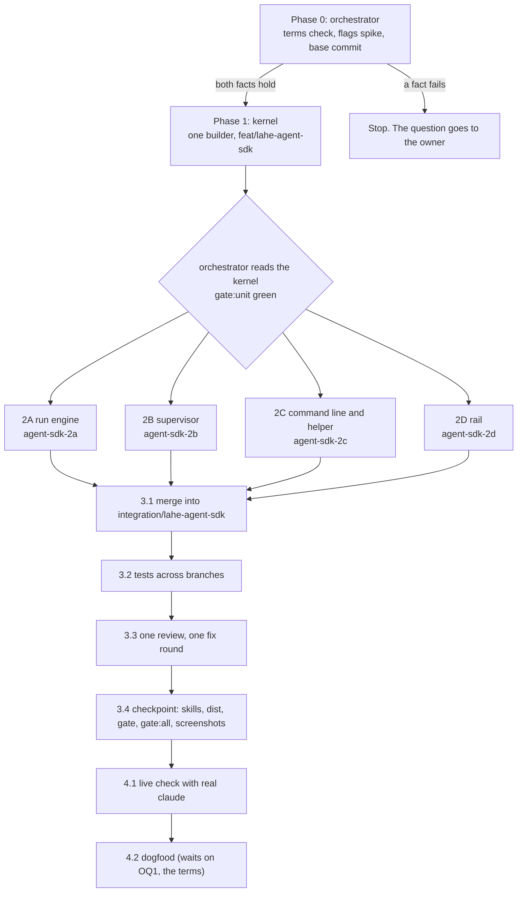

# Plan: LAHE starts your agent when a comment is ready

Status: DRAFT, written without the owner. Reviews and their tables are at the end.

## Summary

- **Phase 0 can stop the feature.** Before any builder starts, the orchestrator settles two facts the architecture leaves open: whether the subscription terms allow this, and whether the `claude -p` flags the design relies on do what they say. If either fails, the build stops and the question comes to you.
- **Phase 1:** one builder lays the shared pieces: the tagged contract and every copy of it, the wire names, the shared lock code, and a fake `claude` for tests.
- **Phase 2:** four builders work in parallel:
  - the run engine
  - the supervisor
  - the command line and the helper
  - the rail
- **Phase 3:** the orchestrator merges in an integration worktree, writes the tests that need every branch, runs one review with one fix round, and runs the full gates once.
- **Phase 4:** a live check with the real `claude`, then your dogfood review. The dogfood waits on your answer to the terms question.
- **Your questions are in one place,** under [Open Questions](#open-questions). Each has the default the build takes if you do not answer.

## How the work is dispatched

**Branches and worktrees.**

- `feat/lahe-agent-sdk`: holds these docs. Phase 1 builds here, in its own worktree. The pull request to `main` opens from it after Task 3.4 (checkpoint).
- `agent-sdk-2a` to `agent-sdk-2d`: one worktree each, branched from `feat/lahe-agent-sdk` after Phase 1.
- `integration/lahe-agent-sdk`: in its own worktree, `.claude/worktrees/integration-agent-sdk`. All merges happen here, never in the shared main checkout. Other agents push from that checkout, and a push there once carried an untested merge to `main`.
- `agent-sdk-fix-<n>`: Task 3.3's fix branches, off the integration branch.

**Who owns each seam.** The orchestrator owns every merge and every test that needs more than one branch. Phase 1 fixes the shapes each seam is built against:

| Seam | Built against | Proved by |
| --- | --- | --- |
| Supervisor (2B) calls the engine (2A) | the `run_spec` and `result` shapes, and the stub signatures, from Task 1.3 | Task 3.2 runs the real engine under the real supervisor |
| Helper (2C) starts the supervisor (2B) | the `lahe agent supervise` entry named in Task 1.3 | Task 3.2: the page's "on" starts one supervisor |
| Rail (2D) reads the liveness answer (2C) | the `auto_answer` fixtures in Task 1.2 | Task 3.2: each state read off a live helper |
| Engine (2A) reads the host's output | the fake `claude` in Task 1.4, built from what Task 0.2 recorded | Task 4.1 with the real `claude` |

**Rules every builder follows.** Repo `CLAUDE.md` ("Running the gate", "Running the loop", "Never remove files while work is running") holds them. In short:

- Run `npm run gate:unit`. Run at most one named browser spec. The full browser suite runs once, in Task 3.4, by the orchestrator.
- Never commit `dist/`. Never run `npm run install-skills`. The orchestrator does both in Task 3.4.
- No `rm`, no `git clean`. List files to remove under "To delete at cleanup" in your report.
- Commit per task with a message that says why.
- Hit a limit? Ask the orchestrator in one line instead of writing around it.
- Tests never call the real `claude` or any model. They use the fake `claude` from Task 1.4.
- Tests use their own state folder and helper port. They never touch the owner's helper or state folder.
- Nothing instruction-like repeats per wake or per item (brief R14, rules once per run). No new output from `lahe agent`, `lahe monitor` or the stdin payload may carry rule text.

### Numbers this plan sets

All from the architecture (OQ3, every number is a guess the owner can change). Each lives once, in `AUTO_ANSWER` in `src/shared/protocol.js`.

| Constant | Value |
| --- | --- |
| `RUNS_AT_ONCE` (machine) | 2 |
| `ATTEMPTS_PER_REV`, `ATTEMPTS_PER_ITEM` | 3, 6 |
| `RUNS_PER_DAY_SESSION`, `RUNS_PER_DAY_MACHINE` | 40, 120 |
| `FAILED_RUNS_STOP` (in a row) | 3 |
| `BUDGET_USD` per run | 0.50 |
| `RUN_TIMEOUT_MS` | 10 minutes |
| `KILL_GRACE_MS` | 5 seconds |
| `QUIET_MS` (burst settles) | 15 seconds |
| `LOOK_MS` (supervisor look) | 2 seconds |
| `FOLD_WAIT_MS` | 30 seconds |
| `USAGE_PAUSE_MS` | 30 minutes |
| `BATCH_MAX_ITEMS`, `BATCH_MAX_BYTES` | 25, 100 KB |
| `ITEM_MAX_CHARS` (reviewer text) | 8,000 |
| `REPLY_MAX_CHARS` | 500 |
| `NOTE_MAX_CHARS` | 2,000 |
| `RUN_FOLDERS_KEEP` | 20 |

### Words this plan pins

The architecture's rail table has placeholder words ([What the rail shows](02_architecture_lahe_agent_sdk.html#what-the-rail-shows-wireframe-direction-b)). The plan takes them as written, with "Auto-answer" as the name (OQ7). They live once, in `protocol.js`, beside today's `AGENT_LIVENESS` words. Added here:

| Where | Words |
| --- | --- |
| Switch, not allowed (hover and panel) | "Auto-answer is allowed from a terminal. Run: lahe agent allow --session {id}" |
| Chip, signed out | "Claude is signed out. Sign in with `claude` in a terminal, then turn Auto-answer on." |
| Chip, not installed | "Claude Code was not found. Install it, then run lahe agent allow again." |
| Chip, usage limit | "Claude's usage limit was reached. Next try at {time}." |
| Chip, failing | "The last three runs failed. Turn Auto-answer off and on to try again." |
| Chip, file gone | "The source file is gone. Auto-answer stopped." |
| Chip, catch-all | "Auto-answer stopped. Run lahe agent status in a terminal to see why." |
| Card, gave up | "Auto-answer tried three times and could not answer this." |
| Card, too long | "Too long for auto-answer; a chat agent can take it." |
| Card, raw HTML refused | "Auto-answer does not add raw HTML or scripts; a chat agent can do this." |

Rail words never use monitor, heartbeat, wake feed, watching or unattended.

## Phase 0: Facts that could sink the design

The orchestrator alone. No builder starts until Task 0.2 is green.

::: xref
[Architecture: Subscription terms](02_architecture_lahe_agent_sdk.html#subscription-terms) · [The run's command](02_architecture_lahe_agent_sdk.html#the-runs-command-claude-code-adapter) · [Open Questions](02_architecture_lahe_agent_sdk.html#open-questions)
:::

### Task 0.1: The subscription terms, read by a person

**Spec:** Open [Anthropic's Consumer Terms](https://www.anthropic.com/legal/consumer-terms) and Claude Code's [Authentication](https://code.claude.com/docs/en/authentication) and [Headless](https://code.claude.com/docs/en/headless) pages in a browser. Copy the exact sentences on automated access, and on scripted use of a subscription, with their links. A web fetch is not enough; the architecture's quote came from one. Put the sentences beside OQ1 (the terms) on the progress page.

**Acceptance:**

- Each quote on the progress page matches the live page word for word, with its link.
- If the page no longer says what the architecture quotes, the architecture's Subscription terms section is corrected in the same commit.

**What it gates:** only Task 4.2 (dogfood). The build uses a fake `claude` and spends no usage. Task 0.2 and Task 4.1 use a handful of runs on the owner's login, as the spike did (OQ1's default).

### Task 0.2: The flags spike

**Spec:** One script in the scratchpad runs real `claude` (2.1.284) with the architecture's exact command, from an empty stage folder, with the architecture's environment allowlist. It saves every raw output, and a second script computes every number from those files. `claude --help` lists every flag below; none has been run by this project. The results go in `spike_flags.md` in this folder.

| Check | Passes when |
| --- | --- |
| The whole flag set together | `claude` starts and exits 0 with `--safe-mode`, `--restricted`, `--strict-mcp-config`, `--setting-sources ""`, `--tools Read,Edit`, `--permission-mode dontAsk`, `--permission-prompts none` |
| Still the subscription | the init event reports `apiKeySource: "none"` with that flag set |
| Structured output | `--json-schema` with the reply schema returns replies that match it; record exactly where they appear in the result |
| Items on stdin | `-p` with the drain lines on stdin, no prompt argument, handles the three spike items |
| Rules file | `--append-system-prompt-file` is read, and its text is not in `ps` output |
| Confinement | a `.env` beside the original source, and a file one folder up, cannot be read, by relative or absolute path |
| Hostile comment | a comment asking for a `<script>` tag: record what the model does. LAHE's own check refuses it either way |
| Prompt size | tokens per request with the `all` and `headless` contract lines, against the spike's 9,000 |
| Budget flag | whether `--max-budget-usd` stops a run on a subscription, and what the result says |
| Failures | exit code and result text for signed out (an empty `CLAUDE_CONFIG_DIR`), `claude` missing, and a killed run. A usage limit cannot be forced; record "not seen" |
| Rules once | transcripts of runs given 1, 10 and 25 items, and 100 items split across 4 runs: the rules appear once per run and nothing instruction-like repeats per item |

**Files:** `docs/features/20260929.01_lahe_agent_sdk/spike_flags.md` (new). Scripts and raw output stay in the scratchpad; the doc names their paths.

**Acceptance:** `spike_flags.md` has a pass or fail per row, each number traced to a saved file, and one verdict line.

**Stop rules:**

- Structured output does not work: stop. The design comes back to the owner. No shell is granted as a fallback.
- Confinement fails (the `.env` is readable): stop. The security reviewer sees it before anything else.
- The flag set loses the subscription login: stop.
- Prompt size more than doubles the spike's 9,000 tokens: go on, and put the number beside Q1 (billing).

### Task 0.3: Base commit and open branches

**Spec:** Record `main`'s commit on the progress page as the base, and confirm its `gate:unit` and browser suite are green there. List every open branch whose diff touches a file this plan changes (`review_format.js`, `protocol.js`, `overlay.js`, `monitor.js`, `agent_sessions.js`, `static_servers.js`, `SKILL.md`), and land it or agree with the owner how it folds in. Add the board row the architecture promised: rendered Markdown passes raw HTML through with no CSP, as its own security row in `docs/BULLETIN.md`.

**Acceptance:** the progress page names the base commit, the gate result at it, and each overlapping branch with what happened to it. The board row exists.

## Phase 1: Kernel

One builder, alone, on `feat/lahe-agent-sdk`. After Phase 1 no Phase 2 builder edits a file under `src/shared/`, `src/shared/manifest.js`, the contract's copies, or `locks.js`. So everything they need there lands now.

::: xref
[Architecture: Data / State Changes](02_architecture_lahe_agent_sdk.html#data-state-changes) · [The system prompt](02_architecture_lahe_agent_sdk.html#the-system-prompt-one-source-of-the-rules)
:::

### Task 1.1: The tagged contract, and every copy

**Spec:** Tag each `CONTRACT` line in `review_format.js` `all`, `chat` or `headless`. Reword the few `all` lines that name the reply transport, so they name the reply's fields only. Add the `headless` lines the architecture lists (items on stdin, the one file, read back, one reply each, do not wait or start anything). Change the "forever daemon" line as Assumption A9 says (a chat agent never starts a long-lived process; auto-answer is the only one, started by LAHE). `review.json`'s `contract` becomes the `all` and `chat` lines, in order. Carry the change into every copy in one commit:

- `skills/lahe/SKILL.md`, plus one sentence: when auto-answer is on for your session, tell the human and stop
- the restated copy in `test/unit/review_format.test.js`
- `docs/CONTRACTS.md`

**Files:** those four.

**Acceptance:**

- Every line carries exactly one of the three tags. A test fails on a missing or unknown tag.
- `review.json`'s contract equals the `all` and `chat` lines in order, and the test's restated copy equals it.
- No line is tagged both `chat` and `headless`, and no `headless` line repeats an `all` line's words.
- The skill and `docs/CONTRACTS.md` match the new text (the orchestrator diffs them).

### Task 1.2: Wire names, fixtures and the manifest

**Spec:** In `protocol.js`, spell once:

- the `AUTO_ANSWER` numbers above
- the supervisor states and stop reasons
- the run outcomes and failures
- the rail words and chip remedies
- the event kind `auto_answer.requested`
- the route `POST /lahe/v1/auto-answer`
- the reply agent name `claude-auto`

Fold `auto_answer.requested` in `projection.js` into the latest request per session. Add to `agent_sessions.js` the read of `session.json`'s `auto_answer` block and one `allowanceHolds(session)` answer (allowed means the block's `handoff_rev` equals the session's). Add a fixture file of `auto_answer` liveness objects, one per rail state, for 2C to produce and 2D to draw. Add every new file of Tasks 1.3 and 1.4 to `manifest.js`, in the non-bundle list.

**Files:** `src/shared/protocol.js`, `src/service/projection.js`, `src/service/agent_sessions.js`, `src/shared/manifest.js`, `test/fixtures/auto_answer/liveness_states.js` (new).

**Acceptance:**

- A test: the projection's latest request follows the last event, per session, and ignores other sessions.
- A test: `allowanceHolds` is false after a takeover bumps the rev.
- Lint's manifest check passes with every new file listed.
- The bundle does not grow by any Node-only code (`npm run build:layer` locally, not committed).

### Task 1.3: Shared locks, file stamps, and the new files' shapes

**Spec:** Move `withServerLock` and `takeOverStaleLock` out of `static_servers.js` into `src/service/locks.js`, unchanged, and have static servers use it. Add there a process identity check: a pid counts as the same process only when the pid and its `ps -o lstart=` start time both match. Add `src/service/file_stamp.js` (content hash, size, mtime of a user file). Create each new module named in the architecture with its exported functions and their doc comments, each body throwing "not built yet", plus the `run_spec` and `result` shapes as a shared fixture. Phase 2 fills them in.

**Files:** `src/service/locks.js`, `src/service/file_stamp.js`, `src/service/static_servers.js`, and the shapes of `headless_supervisor.js`, `headless_stage.js`, `headless_prompt.js`, `run_slots.js`, `host_claude_code.js`, `src/cli/commands/agent.js`.

**Acceptance:**

- Every existing static-server lock test passes, unchanged.
- New tests: two exclusive creates race and one wins; a stale lock whose pid is dead is taken over; a reused pid with a different start time counts as dead.
- A file stamp changes when content changes and not when only a read happens.

### Task 1.4: The fake `claude`

**Spec:** A small Node script standing in for `claude`. A scenario file tells it what to do: edit the stage copy, print the result the way Task 0.2 recorded (structured output in the same place), exit with a code, sleep past the timeout, or print a failure the way Task 0.2 recorded it. It writes the arguments and environment it was given to a file, so tests can check them. The usage-limit output is a guess until one is seen; its scenario says so.

**Files:** `test/fixtures/auto_answer/fake_claude.js`, `test/fixtures/auto_answer/scenarios/` (new).

**Acceptance:** scenarios exist for a clean batch, crash, timeout, bad output, signed out, usage limit, a reply for an item not in the batch, over-long text, an added `<script>`, and editing a file other than the copy. Each is used by at least one test in Phase 2.

**Phase test:** `gate:unit` green, and the orchestrator reads the kernel diff before Phase 2 is dispatched.

## Phase 2: Four builders in parallel

Each builder reads first: the architecture, `docs/ongoing/SESSION_OWNERSHIP.md`, `docs/CONTRACTS.md`, `docs/CLI.md`, and `skills/lahe/SKILL.md`.

### Task 2A: The run engine

::: xref
[Architecture: A wake, one run](02_architecture_lahe_agent_sdk.html#a-wake-one-run) · [The run's command](02_architecture_lahe_agent_sdk.html#the-runs-command-claude-code-adapter) · [Security](02_architecture_lahe_agent_sdk.html#security-privacy-notes)
:::

**Spec:** Fill in three modules.

- `headless_prompt.js` builds the system prompt (the `all` and `headless` lines, then the note under its own heading), the reply schema from `REPLY_FIELD` and `REPLY_REQUIRED` with the 500-character caps, and the stdin payload. The payload is the drain lines with each `source_hint` replaced by the stage path. It cuts batches at 25 items or 100 KB, and turns an item over 8,000 characters into a `not_handled` reply instead of sending it.
- `host_claude_code.js` builds the command from the architecture's flag table, runs `claude` by the absolute path in its own process group, passes only the environment allowlist, writes the prompt to a file it removes after the run, reads the result, and names the failure. On timeout it sends SIGTERM to the group, waits 5 seconds, then SIGKILL.
- `headless_stage.js` makes the per-run folder, copies the source in and stamps it, checks the replies against the batch, diffs the copy, and refuses added raw HTML, `on…=` attributes and `javascript:` URLs. It writes back only when the real file's stamp still matches, and only through a temp file renamed over a regular, non-symlink file at the same real path, owned by the user. It trims the run log to tool names, paths, sizes, usage and replies, and keeps the last 20 run folders.

**Files:** those three, and their unit tests.
**Don't touch:** `headless_supervisor.js`, `run_slots.js`, `agent.js`, `src/service/index.js`, `overlay.js`.

**Acceptance:**

- The prompt is exactly the `all` and `headless` lines in order, plus the note. The stdin has no `CONTRACT` line and no page-posted `source_hint`.
- The schema's field names equal `REPLY_FIELD` and `REPLY_REQUIRED`.
- The argument list never holds `--bare` or `Bash`. The child environment holds only the allowlist, even when the parent has `ANTHROPIC_API_KEY` and other variables set, unless the key is explicitly allowed.
- With the fake `claude`: each failure scenario is named correctly; a timeout kills the whole group and leaves no child running.
- A reply for an item or rev not in the batch is dropped and logged. A `files` field from the run is ignored; `files` comes from the stamps.
- An added `<script>`, `onclick=` or `javascript:` is refused, and each `handled` reply becomes `not_handled` with the pinned words. Raw HTML that was already in the file is left alone.
- The real file changed during the run: `conflict`, nothing written. A symlink swapped in: refused, nothing written.

### Task 2B: The supervisor

::: xref
[Architecture: The supervisor's states](02_architecture_lahe_agent_sdk.html#the-supervisors-states) · [Retries, failures and limits](02_architecture_lahe_agent_sdk.html#retries-failures-and-limits) · [Stopping, and handing back](02_architecture_lahe_agent_sdk.html#stopping-and-handing-back)
:::

**Spec:** Fill in `run_slots.js` (two slots by exclusive create, the machine's daily count under the shared lock, reclaim only a dead slot) and `headless_supervisor.js` (the loop and the state diagram). The loop takes the supervisor lock, writes `agent.json`, looks every 2 seconds, gathers until 15 seconds pass with no new item, takes a slot, and calls the engine through the Task 1.3 shapes. It writes checked replies to `replies-claude-auto.jsonl` with `reply.js`'s encoder, then waits for each fold result before it counts attempts or drains again. It kills a leftover run group on start, finishes the replies of a run that was applied but not replied, and restarts cleanly when its own code is older than the clone.

**Files:** those two, their tests, and `agent.json`, `runs.jsonl`, `attempts.json` records.
**Don't touch:** the engine's three modules (use a fake engine in tests), `agent.js`, `index.js`, `overlay.js`.

**Acceptance:**

- A burst of five items, with gaps under 15 seconds, starts one run.
- Attempts count only on finished runs: three per rev, six per item across revs, then the pinned "tried three times" reply.
- Three failed runs in a row stop with reason `failing`, and no item's attempts are used.
- Each daily limit pauses the mode until the next local day; a usage limit pauses it for 30 minutes and sets `retry_at`.
- Off, stop from the page, takeover and close each kill a run in flight within the grace time and write nothing to the source or the reply file.
- Two supervisors started at once leave one. A third run never starts while two slots are held.
- A written but unfolded reply keeps its item off the next batch.
- Killed after the write-back and before the replies: the next supervisor writes the replies first.
- A leftover run group from a dead supervisor is killed before anything else happens.

### Task 2C: The command line and the helper

::: xref
[Architecture: Allowing it, then turning it on](02_architecture_lahe_agent_sdk.html#allowing-it-then-turning-it-on) · [On and off are events](02_architecture_lahe_agent_sdk.html#on-and-off-are-events-and-the-page-may-only-ask)
:::

**Spec:**

- `lahe agent allow | disallow | on | off | status [--diffs]`, and the internal `supervise` entry, registered in `src/cli/index.js`.
- `allow` runs the preflight (`claude --version` and `claude auth status` at the absolute path, with the run's own environment), prints the full warning every time, and writes the `auto_answer` block under the lock at the current rev. It refuses:
  - instruction files, dot paths, the state folder, and paths outside the home folder
  - any source that is not a Markdown review
  - Windows
- The route `POST /lahe/v1/auto-answer` reads only `want`, passes the D11 checks, and appends the event. An "on" for an allowed session makes the helper start `lahe agent supervise` detached, unless a live one holds the lock.
- `agent_sessions.js` counts a live supervisor at the current rev as listening, and adds the `auto_answer` object to the liveness answer. It never sends a path, the note, or a dollar figure.
- `lahe monitor` exits 6 while a live supervisor holds the rev. `lahe review` re-entry into such a session says auto-answer owns it and prints no monitor lines.
- `docs/CLI.md` and `docs/diagrams/session_ownership.md` describe the new command and the new owner.

**Files:** `src/cli/commands/agent.js`, `src/cli/index.js`, `src/service/routes.js`, `src/service/index.js`, `src/service/agent_sessions.js`, `src/cli/commands/monitor.js`, `src/cli/commands/review.js`, the two docs.
**Don't touch:** the engine, the supervisor loop, `overlay.js`, anything under `src/shared/`.

**Acceptance:**

- `allow` refuses each listed path kind with a plain message, and refuses when `claude` is missing or signed out (fake `claude` on the recorded path).
- The route ignores every body field but `want`, and fails the same D11 checks every write route fails.
- An "on" for a session never allowed records the event and starts nothing.
- A takeover ends the allowance: after it, "on" from the page starts nothing until `allow` runs again.
- The liveness answer matches each Task 1.2 fixture for the matching supervisor state.
- Monitor exit 6 and the `lahe review` re-entry message each have a test.

### Task 2D: The rail

::: xref
[Architecture: What the rail shows](02_architecture_lahe_agent_sdk.html#what-the-rail-shows-wireframe-direction-b) · [Wireframe B](wireframes/b-switch-by-hold/01-off.html)
:::

**Spec:** In `overlay.js`, following wireframe direction B:

- the Auto-answer pill beside Hold sending; inert with the allow command when not allowed
- the warning panel on the first "on" in a session, in the footer where End review's confirm opens
- one click off while idle, one confirm while a run is working
- the run count beside the pill, opening today's runs against the limit and tokens where reported
- the failure chip under the switch
- the status line's words from `auto_answer.state`
- the overdue banner and "nothing back yet" standing down while on and healthy; its hand-off button kept while paused or stopped
- the amber ring and "Not handled" pill on a card the runs gave up on

Build only against the Task 1.2 fixtures. Reuse the Hold pill, the End review confirm, the late-card ring and the rail's own tokens; add no new color.

**Files:** `src/layer/overlay.js`, `test/browser/auto_answer_rail.spec.js` (new).
**Don't touch:** anything under `src/service/`, `src/cli/`, `src/shared/`.

**Acceptance:**

- One browser spec, run by name, covers every row of the architecture's rail table, the switch when not allowed, the warning panel, the confirm while working, the banner standing down, and the gave-up card.
- Screenshots, light and dark, of: off, not allowed, the warning panel, working, waiting its turn, paused, stopped with a chip, and a gave-up card. Taken after the spec that proves them, and put on the progress page.
- No rail word from the forbidden list appears in any state.
- At the narrowest rail the run count wraps to its own line and nothing overlaps.

**Phase test:** each branch green on `gate:unit`, and 2D's spec green by name.

## Phase 3: Merge, review and checkpoint

### Task 3.1: Merge

**Spec:** In the integration worktree, merge in this order: 2A, 2B, 2C, 2D, then `main`. The orchestrator resolves conflicts; a builder never merges another's branch. Run `gate:unit` after each merge.

**Acceptance:** the integration branch holds all four, `gate:unit` green, and no "not built yet" left in `src/` (a search finds none).

### Task 3.2: Tests across branches

**Spec:** The orchestrator writes the tests no single branch could. Each runs the real helper, the real `lahe agent` and the fake `claude`, in its own state folder:

- the page asks "on" for an allowed session; one supervisor starts; a comment arrives; one run edits the copy; the source file changes; the reply folds; the rail shows "on" again
- a takeover mid-run: the run is killed, the source is untouched, the new owner's drain lists every item
- a chat agent's `lahe monitor` exits 6 once the page turns auto-answer on
- a hand edit replied `handled` passes the handled check after write-back
- two reviews each with a burst: never more than two runs at once, and the third review shows "waiting its turn"

**Files:** `test/unit/auto_answer_seams.test.js`, and one browser spec if the rail step needs a page.

**Acceptance:** each case above has a test that passes, and fails when its seam is broken (checked once by breaking it by hand).

### Task 3.3: One review, one fix round

**Spec:** One review set on the integrated diff: `review-code-lead`, `review-security` (the diff spawns processes, writes user files, adds a route and handles paths) and `review-testing`. Each finding names the test that would catch it. Builders fix on `agent-sdk-fix-<n>` branches, writing the named test red then green. The orchestrator checks each test exists and passes. A second review only for a fix that is itself risky.

**Acceptance:** every finding is fixed with its test, or written under Changes from plan on the progress page with the reason.

### Task 3.4: Checkpoint

**Spec:** In the integration worktree:

1. `npm run install-skills`
2. rebuild and commit `dist/`
3. `npm run gate`, then `npm run gate:all`, each as its own command
4. read the pass and fail counts
5. only then push, as a separate command, to `feat/lahe-agent-sdk`

Put the Task 2D screenshots on the progress page from this run. Update `docs/CLI.md`, `docs/CONTRACTS.md` and the skill if review changed them.

**Acceptance:** both gates read "0 failed" in their output, the counts are on the progress page, and the push happened after.

## Phase 4: Live check and dogfood

### Task 4.1: Live check with real `claude`

**Spec:** Through the built `lahe agent`, not spike scripts, on a throwaway review in the scratchpad:

- the three spike items answered correctly
- a planted `.env` beside the source never shows in any run log
- a comment asking for a `<script>` ends refused, with the pinned card words
- an empty `CLAUDE_CONFIG_DIR` at allow time: `allow` refuses. The same broken after allow: the rail says signed out, every item stays waiting
- the review left open for an hour with no comments: zero runs in `runs.jsonl`
- the rules-once transcripts, as in Task 0.2, through the product

**Acceptance:** each line checked, with the saved file that shows it, on the progress page. Any mismatch with the fake `claude` updates its scenario and gets a test.

### Task 4.2: Dogfood

**Spec:** Waits on the owner's answer to OQ1 (the terms). The owner runs a review of at least five comments with auto-answer on, on a document no agent reads as instructions (OQ6's default). A script reads `runs.jsonl`, `attempts.json` and the event log and writes the numbers the brief asks for: runs, failures, items that hit the limit, double answers, and the time from ready to reply for each item.

**Acceptance:** the brief's success metrics each marked pass or fail on the progress page, from the script's output. The owner judges each comment reply.

## Test List

::: callout-req
**Engine (2A)**

- [ ] The system prompt is exactly the `all` and `headless` lines, in order, then the note.
- [ ] The stdin payload has no `CONTRACT` line, no rule text, and no page-posted `source_hint`.
- [ ] The same prompt text for a run of 1 item and of 25 items; only the stdin grows.
- [ ] The reply schema's names equal `REPLY_FIELD` and `REPLY_REQUIRED`.
- [ ] A batch of 30 items becomes a run of 25 and a run of 5. A batch over 100 KB is cut at the item that crosses it.
- [ ] An item over 8,000 characters gets the pinned `not_handled` reply and is not sent.
- [ ] A reply over 500 characters is refused.
- [ ] The argument list never holds `--bare` or `Bash`.
- [ ] The child environment holds only the allowlist; `ANTHROPIC_API_KEY` passes only when allowed.
- [ ] `claude` runs by the absolute path recorded at allow time, not from `PATH`.
- [ ] Clean batch, crash, timeout, bad output, signed out and usage limit are each named correctly.
- [ ] A timeout kills the whole process group.
- [ ] A reply for an item or rev not in the batch is dropped and logged.
- [ ] `files` comes from LAHE's stamps; a `files` value from the run is ignored.
- [ ] Added `<script>`, `on…=` and `javascript:` are refused; existing raw HTML is left alone.
- [ ] Real file changed mid-run: `conflict`, nothing written, not counted as an attempt.
- [ ] A symlink swapped in mid-run: refused, nothing written.
- [ ] The write-back goes through a temp file and a rename; a crash between them leaves the original whole.
- [ ] The run log holds no tool result text. The prompt file is gone after the run. Only 20 run folders remain.

**Supervisor (2B)**

- [ ] Five items with gaps under 15 seconds start one run.
- [ ] An item arriving mid-run goes into the next run.
- [ ] Attempts count only on finished runs; three per rev, six per item, then the pinned reply.
- [ ] Rewording an item after three attempts makes it ready again, until six.
- [ ] Three failed runs in a row stop with `failing`; no attempts used.
- [ ] Session and machine daily limits pause until the next local day.
- [ ] A usage limit pauses for 30 minutes and sets `retry_at`.
- [ ] Off, stop from the page, takeover and close each kill a run in flight and write nothing.
- [ ] Two supervisors started at once leave one.
- [ ] Never more than two runs at once across the machine.
- [ ] A dead slot is reclaimed; a live one with a reused pid is not.
- [ ] A written, unfolded reply keeps its item out of the next batch.
- [ ] The supervisor waits for each fold result before draining again.
- [ ] A reply refused at fold (stale rev) is counted as no reply for that attempt.
- [ ] Killed between write-back and replies: the next supervisor writes the replies first.
- [ ] A leftover run group is killed on start.
- [ ] Stale code: the supervisor restarts with the same allowance.
- [ ] Source file deleted: stops with the "file gone" chip.
- [ ] Held items start no run; release starts one run for all of them.

**Command line and helper (2C)**

- [ ] `allow` refuses instruction files, dot paths, the state folder, paths outside home, non-Markdown sources, and Windows.
- [ ] `allow` refuses when `claude` is missing or signed out, and reports subscription or API key.
- [ ] `allow` prints the whole warning every time.
- [ ] `allow` run again while a supervisor runs updates the block; the next run picks up the new note and model.
- [ ] The route reads only `want` and passes the D11 checks.
- [ ] "On" for a session never allowed starts nothing.
- [ ] A takeover ends the allowance.
- [ ] The liveness answer never holds a path, the note, or a dollar figure.
- [ ] `lahe monitor` exits 6 while a live supervisor holds the rev.
- [ ] `lahe review` re-entry prints no monitor lines while auto-answer owns the session.
- [ ] `review.json`'s contract equals the `all` and `chat` lines.

**Rail (2D)**

- [ ] Each rail state shows its pinned words.
- [ ] Not allowed: the pill is inert and shows the allow command.
- [ ] The warning panel shows on the first "on" in a session, not after.
- [ ] Off while idle is one click; off while working asks once.
- [ ] The overdue banner does not show while on and healthy, even after its usual wait.
- [ ] Paused or stopped: the status line is loud, the chip names the remedy, the hand-off button stays.
- [ ] A gave-up card wears the amber ring and "Not handled".
- [ ] After off or a takeover the rail follows today's rules exactly.
- [ ] No forbidden word appears in any state.

**Across branches (3.2) and live (4.1)**

- [ ] Page "on" to reply folded, end to end, with the fake `claude`.
- [ ] Takeover mid-run: source untouched, every item on the new owner's drain.
- [ ] A chat monitor exits 6 when the page turns auto-answer on.
- [ ] A hand edit's `handled` reply passes the handled check after write-back.
- [ ] Two reviews in a burst: the second waits its turn and says so.
- [ ] Live: the `.env` beside the source is never read.
- [ ] Live: a hostile `<script>` comment ends refused.
- [ ] Live: a broken login shows on the rail and every item stays waiting.
- [ ] Live: an idle hour starts zero runs.
- [ ] Live: rules once in transcripts at 1, 10 and 25 items, and 100 items across runs.
:::

## Acceptance Criteria

::: callout-metric
**Standard (every feature inherits these; keep them verbatim):**

- [ ] Full test suite green, not just the new tests.
- [ ] Design and lint gates green (the project's gate command).
- [ ] Every user story in the brief walked end to end in the browser, on the running app.
- [ ] Nothing punted: no TODOs, no stubbed tests, no "out of scope" that was in scope.
- [ ] Implementation matches brief and architecture; any deviation is deliberate and written down under Changes from plan on the progress page.
- [ ] **It looks like a staff designer built it.** Keep the seniority level: "staff" is what sets the quality bar the evaluator judges against. Judge the whole surface at that level, then check that it includes at least:
  - Clear visual hierarchy and information architecture. You know where to look, and the page's organization makes sense.
  - Consistency with the rest of the app. Buttons look like our other buttons, hover states follow the same convention, primary and secondary carry the same color meaning they carry elsewhere.
  - Honest feedback. Toasts and status messages report what actually happened. Never an optimistic "done" for something still in flight, or something that failed.
  - Micro-animations that mean something. Motion signals state or direction; it isn't decoration.
  - Copy in the brand voice (the project's brand or voice doc).
  - Existing components reused and the style guide followed. Nothing reads as a stock framework default.
- [ ] It reads as one feature, not several agents' work stitched together: consistent components, spacing, and interaction patterns across every surface it touches.

**This feature:**

- [ ] Off by default: with auto-answer never allowed, a review behaves as today, and the full existing suite passes unchanged (R1, off by default).
- [ ] No API key of LAHE's own: nothing asks for or stores one; a key passes only with `--allow-api-key`, and the warning says it costs money (R2).
- [ ] `dependencies` in `package.json` is still `{}`, and a fresh clone runs `lahe agent allow` with no install (R3).
- [ ] A second host needs only a new adapter file: the supervisor names no `claude` flag (R4). Checked by search.
- [ ] Stopping leaves every unanswered item ready and the source untouched by the stopped run (R5).
- [ ] The terminal warning names what it may do, who can make it act, what it uses, and the terms question (R6).
- [ ] No chat agent starts, keeps or restarts anything for auto-answer to work (R7).
- [ ] An idle hour starts zero runs (R8).
- [ ] A burst becomes one run; held items start none until released (R9).
- [ ] Hand-edit replies pass the handled check (R10).
- [ ] Items arriving mid-run are answered by the next run, and one run at most works a session (R11).
- [ ] Never more than two runs across the machine; a waiting review says "waiting its turn" (R12).
- [ ] An item stops after three attempts per rev, six in all, with the pinned card words (R13).
- [ ] The rules appear once per run in every transcript checked, and nothing instruction-like repeats per item (R14).
- [ ] The run's rules are built from the one tagged `CONTRACT`, and `review.json` still carries the chat lines (R15).
- [ ] The reviewer sees only cards and the rail; a run's reply reads like a chat agent's (R16).
- [ ] Signed out, not installed, usage limit and a crash each show in plain words on the rail (R17).
- [ ] Auto-answer can be turned off from the page, in one click while idle (R18).
- [ ] No item is answered by both a run and a chat agent (R19).
- [ ] A takeover hands every unanswered item to the new owner, and nothing answered shows again (R20).
- [ ] Page text reaches the run only as data under `page`, and the page's `source_hint` never reaches it (R21).
- [ ] A run can read and edit only its copy; nothing outside it changes (R22).
- [ ] Daily run limits stop new runs and the rail says why (R23).
- [ ] The run count and tokens show on the rail and in `lahe agent status` (R24).
- [ ] The allow note reaches every run's prompt, and only the terminal can set it (R25).
- [ ] `lahe agent status --diffs` shows every edit a run applied.
- [ ] The rail screenshots, light and dark, are on the progress page from the checkpoint run.
- [ ] Human has reviewed and approved (single consolidated gate after Plan)
:::

## Open Questions

Every question for the owner, from the brief, the architecture and this plan. Each has the default the build takes if he does not answer.

### Before the build

::: callout-question
**OQ1 (subscription terms, architecture OQ1).** Does Anthropic's exception for scripted access cover a script starting `claude -p` on each comment, on your subscription? **Default: the build goes ahead, since tests use a fake `claude` and spend nothing. Task 0.2 and Task 4.1 use a few runs on your login, as the spike did. The dogfood (Task 4.2) waits for your answer.**
:::

::: callout-question
**Q6 (order, brief).** Ship the small chat fix first (a hook that stops a turn ending with work open), and count forgotten items before building this? **Default: build this now. The small fix stays its own board row.**
:::

::: callout-question
**Q8 (priority, brief).** Does this go ahead of the failing tests on main, the open security items, and the npm package? **Default: fixing main's failing tests comes first, because Task 0.3 needs a green base. The security items and the npm package are not held for this.**
:::

### What it may do and what it costs

::: callout-question
**Q1 (billing, brief).** Is a busy review using your shared subscription limit acceptable with run limits in place? **Default: yes, with 40 runs per session and 120 per machine each day, and $0.50 per run. Task 0.2's prompt size goes beside this.**
:::

::: callout-question
**Q4 (permissions, brief).** What may a run do without asking? **Default: read and edit one copy of the one source file. No commands, no build, no commit, no push, no network.**
:::

::: callout-question
**OQ3 (the numbers, architecture).** Every number in "Numbers this plan sets". **Default: as listed.**
:::

::: callout-question
**OQ6 (instruction files, architecture).** Dogfood on LAHE's own feature docs, which later agents read as instructions? **Default: no. The first dogfood uses a document no agent acts on, such as a blog draft.**
:::

### How it works

::: callout-question
**Q2 (context, brief).** How much of the chat does each run know? **Default: only the note given at allow time.**
:::

::: callout-question
**Q3 (telling the chat agent, brief).** **Answered by the architecture:** turning auto-answer on stops the chat agent's monitor, and the skill tells it to tell you and stop.
:::

::: callout-question
**OQ4 (beyond Markdown, architecture).** Static HTML, linked files and build-output pages? **Default: Markdown only in the first version.**
:::

::: callout-question
**OQ5 (who may switch it on, architecture).** The page can turn it on only after a terminal has allowed the session. Acceptable? **Default: yes.**
:::

::: callout-question
**OQ7 (the name, this plan).** "Auto-answer" for the switch and the status words? **Default: yes.**
:::

### Separate from this build

::: callout-question
**Q5 (the kill setting, brief).** Turn on Claude Code's option that stops the memory kills? **Default: not part of this build. It is your own setting.**
:::

::: callout-question
**Q7 (the SDK, brief).** Close the Agent SDK path, or keep it documented for API-key users? **Default: recorded as a rejected alternative; nothing built.**
:::

OQ2 (the flags spike) is not a question for you. It is Task 0.2, and it only comes to you if a stop rule fires.

## To delete at cleanup

Nothing yet.
