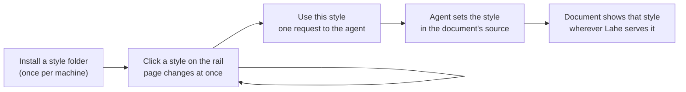

# Feature Brief: Style switcher

## Problem, User, and Context

A reviewer in Lahe cannot see their document in another style without asking the agent to restyle it, one round trip per look. Lahe ships one house style (the International Style). Ken has built six paid Lahe Styles (Textbook, Folio, Poster, Ledger, Field Guide, Schematic) and the store page already promises: "One click and the entire document style system changes", and "swap a style into an existing Lahe document in one step". Today there is no click and no step.

**Who.** First Ken, who reviews agent-written documents in Lahe daily and owns all six styles. Then a Lahe Styles buyer: someone who runs a coding agent with Lahe, downloaded a style folder, and wants it on their own document now.

**Where.** Desktop browser, the document and the rail open beside a terminal running the agent, mid-review. Switching is a short aside that must not disturb open comment boxes or an edit in progress.

**Outcome.** The reviewer tries every installed style on the real document with one click each, keeps the one they want, and the document carries that style from then on.

Prior work: the crucible (`00_crucible_style_switcher.md`), the house style build (`docs/ongoing/DOC_STYLE_BUILD.md`), and the style folders in Ken's personal repo (`lib/templates/styles/`).

## Non-Goals

::: callout-nongoal
- Not restyling pages that carry their own CSS. The switcher only acts on pages that use the Lahe document style.
- Not a style editor. Nobody tunes colours or fonts from the rail.
- Not selling, licensing or checking a purchase. A style on the machine is a style the reviewer may use.
- Not shipping any paid style in the Lahe repo.
- Not a dark mode. Every style today is light.
- Not recolouring Mermaid diagrams per style. They keep the house palette.
- Not a style for a whole folder review in one action. Each page is kept one at a time.
:::

## Solution Outline

1. **Install.** The reviewer (or their agent) runs one Lahe command on a downloaded style folder. Lahe copies it into its own storage on the machine. The International Style is always there with nothing installed.
2. **Try.** On a page that uses the Lahe document style, the rail offers a style control. It lists the International Style and every installed style. One click restyles the whole page at once. The reviewer can flip through all of them. Nothing goes to the agent.
3. **Keep.** One more deliberate action, "use this style", sends the agent one ordinary request on the Active tab. The agent adds one line to the document's source. The page reloads in that style, and the preview is no longer needed.
4. **Share.** The document now carries its style. Anywhere Lahe serves it, and in a rendered Markdown file saved to disk, it shows that style.

## Requirements

### Trying a style

::: callout-req
**R1. The control appears only where it works.** The rail offers the style control on every page that uses the Lahe document style, rendered Markdown and agent-written HTML alike. On any other page it is absent.
:::

::: callout-req
**R2. It lists what is available.** The International Style first, then every installed style by its own name, with the one the page shows now marked.
:::

::: callout-req
**R3. One click restyles the whole page.** No reload, no agent, no waiting. Open comment boxes, an edit in progress, highlights and anything being typed are untouched.
:::

::: callout-req
**R4. A preview survives a reload.** The agent's rebuilds reload the page, so a preview holds on that page in that browser until the reviewer picks another style, or the document itself carries the style being previewed.
:::

::: callout-req
**R5. The rail is honest about a preview.** When the page shows a style the document does not carry yet, the rail says so in plain words.
:::

### Keeping a style

::: callout-req
**R6. Keeping is one deliberate action.** "Use this style" sends the agent exactly one request, shown as an ordinary item on the Active tab. Flipping through previews sends nothing.
:::

::: callout-req
**R7. The agent can apply it without guessing.** The agent's instructions say exactly what to write for an HTML page and for a Markdown file, how to replace a style the page already has, and how to go back to the International Style. These instructions reach an agent that only reads the review file.
:::

::: callout-req
**R8. A kept style stays with the document.** Once applied, the document shows its style wherever Lahe serves it. A rendered Markdown file saved to disk still shows it with no Lahe running, as the house style does today.
:::

### Installing styles

::: callout-req
**R9. One command installs a style folder.** The reviewer or their agent points one Lahe command at a downloaded style folder, and the style appears on the rail the next time the control is opened. Installing the same style again replaces it. A companion listing shows what is installed.
:::

::: callout-req
**R10. A bad folder is refused with a reason.** A folder that is not a valid style is refused, and the message says what is wrong and what a style folder needs.
:::

::: callout-req
**R11. The International Style needs nothing.** It is always offered, on a machine with no styles installed.
:::

::: callout-req
**R12. No paid styles still shows the control.** With nothing installed, the control offers the International Style and one line saying how to add a style.
:::

::: callout-req
**R13. A missing style falls back and says so.** A document that names a style this machine does not have shows in the International Style, and the rail names the style the document asked for.
:::

### Safety

::: callout-req
**R14. A style reaches only its own files.** Installing a style makes its stylesheet and its fonts servable, and nothing else on disk. A style cannot load anything from the network.
:::

::: callout-req
**R15. Nothing new to install and nothing paid in the repo.** Lahe still runs from a clone with no dependencies, and its tests use a made-up style rather than a paid one.
:::

::: callout-metric
With Ken's six styles installed, one of his own documents can be shown in all seven styles in seven clicks, with no reload and no agent involved. One further action keeps the chosen style, and after the agent answers, reloading the page shows the kept style with no preview active.
:::

## UX Notes

- The control follows the rail's existing patterns: reached from the rail's head menu, drawn as a panel in the rail like the end-review panel, in the rail's own type and tokens. No new visual language.
- Each style row shows the style's name and a small strip of its own colours, so a reviewer recognises it before clicking.
- The rail keeps its current look under every style. Only the document changes.
- Keyboard: the panel is reachable and usable from the keyboard, as the head menu is today.

## Analytics / Logging

No analytics: Lahe is a local tool with no telemetry, and this feature adds none. Logging is what a person needs to diagnose "my style does not show":

- the install command prints what it installed or exactly why it refused
- the page server writes one helper-log line, once per server, when it refuses a style file request, naming the style and the reason

## Rollout / Flags

No flag. The feature is additive: a page that names no style looks exactly as it does today, and nothing changes until a style is installed and chosen. The agent instructions change, and they travel together as the repo's rules require (the skill, the contract in the review file, and the restated copies). An agent on an older contract that receives a style request still sees a plain-language note and can ask.

## Questions and Decisions

### Resolved

- **Preview or persist? Both, in sequence.** A click previews in the browser only. "Use this style" asks the agent to write it into the source. Rejected alternatives: preview only (the document never changes, so the store's promise is half true), and the helper applying a remembered style as it serves the page (the file on disk never carries it, so every copy outside Lahe differs). Full reasoning in the crucible.
- **Per page, not per review.** A style belongs to a document, and a folder review can hold documents meant for different places. The preview is kept per page in the browser; the kept style lives in each page's own source.
- **Pages with their own styles are left alone.** A paid style is written against the house style's tokens and components, and would half-apply over someone else's CSS.
- **The request to the agent is an ordinary note, not a new kind of item.** The agent already handles notes, and the review file's contract says intent lives in a note's words.
- **No paid style installed: show the control anyway**, with the International Style and a line on adding a style, so the feature can be found.
- **International Style is the name on the rail** for the free house style, matching the store.

### Open

::: callout-question
**Should the "how to add a style" line link to the Lahe Styles store page?** The design includes one quiet link. Ken may prefer the tool carry no sales text. Decide at implementation review.
:::

## PM Review

| # | Finding | Disposition | Rationale |
|---|---------|-------------|-----------|
