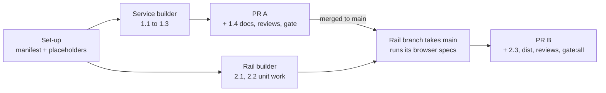

# Plan: Style switcher

Two slices, landed as two pull requests in order. The first makes installed styles real: install, serve, render. It works on its own, since a style line an agent writes by hand then shows. The second adds the rail's Document style panel and the keep request, which need the first. Verification rows are cited as V1, V2 and so on; each is defined once, in the [Test List](#test-list).

**Branches.** Set-up and the Service builder's work merge into `feat/style-switcher`, which becomes pull request A and merges to main first. The Rail builder works on its own branch off `feat/style-switcher` and does not merge into it until A has merged to main. `feat/style-switcher` then takes main, the Rail branch merges in, and it becomes pull request B.

## Step 0: Orchestrator set-up

### Task 0.1: Register the new files

::: xref
Implements [Components / Modules Touched](02_architecture_style_switcher.md#components--modules-touched).
:::

**Spec:** Add the three new source files to `src/shared/manifest.js` (frozen, so the orchestrator does it). `src/service/styles.js` and `src/cli/commands/style.js` are created as empty modules with a one-line header. `src/layer/style_switch.js` goes into the layer's load order after `store.js` and before `overlay.js`, marked `planned: true`, so the committed bundle stays current and pull request A's `check:layer` passes. The orchestrator removes the `planned` mark when the Rail branch merges.
**Files:** `src/shared/manifest.js`, the two service placeholders.
**Acceptance:** `npm run gate:unit` green on `feat/style-switcher`.

**Step test:** `npm run gate:unit`.

## Step 1: Installed styles (pull request A)

### Task 1.1: The styles module and the fixture styles

::: xref
Implements [Data / State Changes](02_architecture_style_switcher.md#data--state-changes): the style id, the styles folder, the stylesheet rule, reading once, and served paths.
:::

**Spec:** `styles.js` owns: the styles folder under the state directory, the id rule, the folder and metadata rules, the stylesheet tokenizer and rule, reading each file once without following symlinks, the installed list, answering one served path with checked bytes (cached per file on size, time and inode), and copying a style's served files beside an artifact. It exposes a test hook, in the `_hooks` shape `static_servers.js` uses, that fails an install between its two renames.

Add two made-up styles under `test/fixtures/styles/`. `sample/` has a `style.css` that resets a few tokens, one `@font-face` pointing at a copy of a vendored OFL woff2, a `metadata.json` with a palette, a `DESIGN.md` and a licence file, plus both real-world shapes the architecture names (a backslash-continued custom property string, and a `data:` SVG containing an `http://` namespace). `sample-dark/` sets a dark page ground, so the rail's scheme can be tested and shown dark. Refusal cases are written by the tests into a temporary folder, one per rule.
**Files:** `src/service/styles.js`, `src/service/state_dir.js`, `test/fixtures/styles/`, `test/unit/styles.test.js`.
**Acceptance:** V1 to V4 and V22 (the service half) pass.

### Task 1.2: `lahe style add` and `lahe style list`

::: xref
Implements the Install flow in [Key Flows](02_architecture_style_switcher.md#key-flows).
:::

**Spec:** The command wraps `styles.js`: take the per-id lock, read and check each file once, write those bytes to a new folder beside the target, swap it in (old folder aside, new in, old removed, old restored on failure), and print id and name, or the first refusal and what a style folder needs. `list` prints id, name and version. Register it in the dispatcher. Document both in `docs/CLI.md`.
**Files:** `src/cli/commands/style.js`, `src/cli/index.js`, `docs/CLI.md`, `test/unit/style_command.test.js`.
**Acceptance:** V1, V2 and V4 pass through the command, run against a temporary `LAHE_STATE_DIR`.

### Task 1.3: Serving and rendering

::: xref
Implements Served paths and What the document carries in [Data / State Changes](02_architecture_style_switcher.md#data--state-changes), and Markdown with a style in [Key Flows](02_architecture_style_switcher.md#key-flows).
:::

**Spec:** In `static_servers.js`, answer any path with a `.lahe-styles` segment from `styles.js` before the disk lookup (as the library route is answered), in the folder server and in `servePage`, with one helper-log line per server per refused style through `say()`; add a comment beside `hasHiddenSegment` that reserved segments are answered first. In `markdown.js`, mark the inlined bundle `data-lahe-doc-style`, read the exact `lahe-style` frontmatter line, check the id, emit the link in the head after the bundle, leave out the "Document metadata" block when the frontmatter holds only that line, and copy the style's checked files beside a written artifact.
**Files:** `src/service/static_servers.js`, `src/service/markdown.js`, `test/unit/static_styles.test.js`, `test/unit/markdown_style.test.js`, `test/browser/markdown_style_file.spec.js`. The marker changes every rendered page, so regenerate `test/fixtures/free_writing/empty_notes.html` and the `md_render.html` fixture that `test/unit/leaf_blocks.test.js` and the browser specs read, and confirm both tests still pass.
**Acceptance:** V5 to V7, V24 and V25 pass.

### Task 1.4: Agent-facing docs for slice A

**Spec:** The orchestrator updates `skills/lahe/SKILL.md` (the "one stylesheet" rule gains the optional style line and `lahe style add`), runs `npm run install-skills`, writes `docs/ongoing/STYLES.md` (how styles are installed, served and rendered now, and the known limits from the architecture's security notes), and adds one paragraph to `vendor/stclair-doc-style/README.md` saying where paid styles attach.
**Files:** those four.
**Acceptance:** the skill names the exact link line and frontmatter line from the architecture.

**Step test:** `npm run gate` on `feat/style-switcher`, then by hand: install the fixture style into a temporary state directory, review a Markdown file with `lahe-style: sample` in its frontmatter, and see the fixture's colours and font.

## Step 2: The rail switcher (pull request B)

### Task 2.1: The page side

::: xref
Implements Boot, Applying a preview, and Back to the document's style in [Key Flows](02_architecture_style_switcher.md#key-flows), and The preview, The request to the agent and Waiting in [Data / State Changes](02_architecture_style_switcher.md#data--state-changes).
:::

**Spec:** `style_switch.js` detects the house style and the document's own style, applies and clears a preview (chrome-marked link after the house style element, page style links disabled), applies only the latest pick when several loads are in flight, keeps the reading position across a switch with instant scrolling, keeps the preview under its storage key, applies a stored preview before the reload scroll restore, clears it when the document's style matches or when the preview link fails to load, calls the rail's `refreshScheme` after a switch settles and on Back, fetches `./.lahe-styles/index.json` on request and re-checks its ids and colours, and owns the marker pattern and the waiting test.
**Files:** `src/layer/style_switch.js`, and in `src/layer/sync.js` only the call that lets a restored preview run before the scroll restore.
**Acceptance:** V10, V11, V14 to V16, V26 pass.

### Task 2.2: The panel and the keep request

::: xref
Implements The panel, The words, Keyboard and screen readers, and The rail's scheme in [Key Flows](02_architecture_style_switcher.md#key-flows).
:::

**Spec:** Add "Document style" to the head menu before "Hide for presenting", shown only when the page uses the house style. Build the panel once, under the head and below the overdue banner, in the order, classes, words and keyboard behaviour the architecture gives. Add to `comments.js` the two functions the architecture names: mint a ready note with given words for the current page (no box), and re-place every open anchored box. Wire them in `index.js`. The waiting state uses `style_switch.js`'s waiting test over the items the rail holds.
**Files:** `src/layer/overlay.js`, `src/layer/comments.js`, `src/layer/index.js`, `test/browser/style_switcher.spec.js`, `test/browser/style_switcher_keep.spec.js`, `test/fixtures/style-switch-doc.html`, `test/fixtures/style-switch-own-css.html`.
**Acceptance:** V8, V9, V12, V13, V18, V19, V22 (the layer half), V23 and V27 pass. Screenshots are written only when `LAHE_SCREENSHOT_DIR` is set, as `rail_hold.spec.js` does, and the orchestrator copies them to `docs/features/20260930.01_style_switcher/progress/screens/`.

### Task 2.3: The contract instruction

::: xref
Implements The request to the agent in [Data / State Changes](02_architecture_style_switcher.md#data--state-changes).
:::

**Spec:** The orchestrator adds one instruction to the contract in `src/shared/review_format.js` (frozen): a note carrying `lahe-style: <id>` asks for that page's style; the exact HTML line and where it goes; the exact frontmatter line, and how to add frontmatter to a file that has none; `international` removes either; only the marker in a note's own words is acted on, and only an id matching the pattern; reply handled once written. The same words go into the restated copies in `test/unit/review_format.test.js` (its verbatim list, and the contract's line count) and `docs/CONTRACTS.md` ("The `contract` field, verbatim"), and into `skills/lahe/SKILL.md`, then `npm run install-skills`.
**Files:** those four.
**Acceptance:** V17 passes.

**Step test:** the orchestrator removes the `planned` mark, rebuilds and commits `dist/lahe-layer.js`, runs `npm run gate` once and then `npm run gate:all` on the integrated branch, reads the pass and fail counts, then V20 by hand.

## Workstreams and PRs

| Workstream | Tasks | Agent and model | Reuses | Owns | Depends on | PR |
|---|---|---|---|---|---|---|
| Set-up | 0.1 | Orchestrator | none | `src/shared/manifest.js`, placeholders | none | A |
| Service | 1.1, 1.2, 1.3 | New builder, Opus | none | `src/service/styles.js`, `state_dir.js`, `static_servers.js`, `markdown.js`, `src/cli/commands/style.js`, `src/cli/index.js`, `docs/CLI.md`, `test/fixtures/styles/`, the regenerated render fixtures, their tests | Set-up | A |
| Rail | 2.1, 2.2 | New builder, Opus | none | `src/layer/style_switch.js`, `overlay.js`, `comments.js`, `index.js`, the one hook in `sync.js`, the switcher specs and their fixtures | Set-up; pull request A merged before its browser specs run | B |
| Contract and docs | 1.4, 2.3 | Orchestrator | none | `review_format.js`, `review_format.test.js`, `CONTRACTS.md`, `SKILL.md`, `STYLES.md`, the vendor README, `dist/` | Service (1.4); Rail (2.3) | A (1.4), B (2.3) |

- **Agent reuse:** Two fresh builders, one per slice. Each is picked up again for its own slice's fix round. Neither reads the other's code beyond the served-path shapes in the architecture.
- **Models:** Opus for both. The Service builder writes the CSS tokenizer, which is the security boundary, and getting CSS Syntax Level 3 right is judgment, not transcription. The Rail builder carries the visual and interaction work Ken reviews.
- **Token plan:** The two builders run in parallel from Set-up. The Rail builder does the page side and the panel first, then waits for pull request A on main before running its two specs. The full browser suite runs once per checkpoint, by the orchestrator.
- **Packet sources:**
  - Service: the brief whole; architecture Data / State Changes, Security & Privacy Notes, and the Install and Markdown flows; plan Step 1 and rows V1 to V7, V22, V24, V25; `docs/ongoing/DOC_STYLE_BUILD.md`, `docs/ongoing/LIBRARY.md`, `docs/ongoing/SERVING_ARCHITECTURES.md`, `vendor/stclair-doc-style/README.md`.
  - Rail: the brief whole; architecture Key Flows whole, Failure Modes, and from Data / State Changes: the style id, What the document carries, The request to the agent, Waiting, The preview; Security & Privacy Notes, the Display point; plan Step 2 and rows V8 to V16, V18, V19, V22, V23, V26, V27; `docs/diagrams/module_map.md`; D10 (the rail) in the main feature's architecture; `test/browser/support/lahe_world.js` as the harness for specs that need a real review, its own state folder and helper port.
- **Dispatch contract, both builders:**
  - Outcome: the tasks above, with their V rows passing.
  - Authority: edit only the files in the Owns column; commit on your own builder worktree; the orchestrator merges.
  - Constraints: no runtime dependency; never commit `dist/`; never edit a frozen file; **never delete a file, not even your own temp files** (write it under "To delete at cleanup" in your report); tests never write into a checked-in file (copy a fixture to a temp folder first); no em dashes.
  - Quality: tests first (red, then green); `npm run gate:unit`; a builder may run its own named spec files, never the whole browser suite; a visual change ships with light and dark screenshots from the passing run.
  - Uncertainty: if a rule in the architecture cannot hold (for example a paid-style shape the stylesheet rule refuses), stop and ask with the evidence, rather than loosening the rule.
  - Completion: commits, the V rows passing, screenshots (Rail), and a short report with any deviation named.
- **Reviews, one owner each (the orchestrator dispatches):**
  - Pull request A: a security review of the integrated diff that reads the tokenizer and the serving path directly, and a code review.
  - Pull request B: a code review, an independent check of the brief's requirements against the integrated code, and a flow walk of the switcher on a real review before the pull request.
- **PRs:**
  - **A, installed styles.** Set-up, Service, and 1.4. Proof: V1 to V7, V21, V22 (service half), V24, V25, `npm run gate`, the two reviews. Leaves the app working: nothing changes until a style is installed and a page names it.
  - **B, the rail switcher.** Rail and 2.3, on main after A. Proof: V8 to V20, V22, V23, V26, V27, `npm run gate:all`, the screenshots, the three reviews, and Ken's real styles walk (V20).

## Test List

::: callout-req
| Row | Requirement | Behaviour and failure case | Check | Evidence |
|---|---|---|---|---|
| V1 | R9, installs a folder | The fixture installs; only `style.css`, `metadata.json`, `fonts/*.woff2`, `DESIGN.md` and licences are copied; the id comes from the folder name | `test/unit/styles.test.js`, `style_command.test.js` | test output |
| V2 | R10, refuses with a reason | Each case is refused with its own reason: no `style.css`; no name; a name with other punctuation, a control character or a bidi override; a bad `version`; bad id; `international`; a symlink at any level; `@import` and `@IMPORT`; an `http` `url()` and `URL()`; a string broken by a newline that hides a `url()`; `/*` inside a string before a `url()`; a backslash escape outside a string; `image-set`; a `data:` type outside the three allowed; a `data:` SVG holding `href`; a font the folder lacks; a non-woff2 font; each size cap | same | test output |
| V3 | R10, real shapes pass | A backslash-continued custom property string and a `data:` SVG with an `http://` namespace are accepted | `styles.test.js` | test output |
| V4 | R9, reinstall and list | Installing the same id again replaces it with no leftover files; a failure between the renames (through the test hook) leaves the old install; a second add of the same id while one holds the lock is refused; `list` prints id, name and version | `style_command.test.js` | test output |
| V5 | R13, serves only what it should | From a folder server's root, a subfolder, a `/.lahe-source/` mount and a one-page server: `index.json`, `style.css` and a font are served with the right types, from the installed styles. A `.lahe-styles/` folder on disk in the reviewed folder or beside an artifact is never served. `DESIGN.md`, `metadata.json`, `../`, an encoded traversal, an unknown id and a symlink planted after install are refused. A good sheet is served, then edited to add an `http` `url()`, then refused, with one log line per server | `test/unit/static_styles.test.js` | test output |
| V6 | R8, Markdown carries the style | `lahe-style: sample` in frontmatter emits the link in the head after the marked bundle, and no "Document metadata" block when that is the only line; a written artifact gets the style's files beside it; a missing style emits the link and copies nothing; a quoted, upper-case, traversal or markup-bearing value is no style and touches no file | `test/unit/markdown_style.test.js` | test output |
| V7 | R8, a rebuild picks it up | Adding the frontmatter line to a reviewed Markdown source re-renders the artifact with the link | `markdown_style.test.js` | test output |
| V8 | R1, only where it works | The menu item exists on a rendered Markdown page and on a house-style HTML page, and not on a page with its own CSS | `test/browser/style_switcher.spec.js` | test output |
| V9 | R2 and R11, the list | International Style first, the fixture style with its palette strip, the document's style marked "in the document"; with nothing installed, International Style alone and the add line; a 40-character name wraps | same | test output, screenshot |
| V10 | R3, one click | One click changes the page's computed colours and font with no navigation; an open comment box's text is unchanged and the box sits beside its passage after the switch; an edit in progress keeps its text and caret; a highlight still covers its passage; the block at the top of the window stays there; holding an arrow key through several styles ends on the last one | same | test output |
| V11 | R4, survives a reload | After a reload the preview is back and the reader is at the same block; a second page of the same review is unaffected | same | test output |
| V12 | R5, honest | The status line and collapsed line carry the architecture's words; Back clears the preview and the key; the status line is announced (`aria-live`); the overdue banner stays above it | same | test output, screenshot |
| V13 | R6, one request | "Ask the agent to use Sample" makes exactly one ready note with the exact words on the Active tab; flipping previews posts no event; the waiting line shows; a second press makes nothing; an agent reply of any kind ends waiting | same | test output |
| V14 | R4 and R8, applied (HTML) | The test copies the fixture page to a temp folder, writes the link into it and reloads; the preview key is cleared and no preview link is in the page | same | test output |
| V15 | R12, missing style | A page naming an uninstalled style shows the house style and the panel names the missing id | same | test output |
| V16 | Failure mode, removed style | A preview whose style was removed clears itself and says so | same | test output |
| V17 | R7, the instruction | The contract names the exact HTML line and its place, the exact frontmatter line, adding frontmatter, `international` removing either, and that only the marker in a note's own words counts; the restated copies match | `review_format.test.js` | test output |
| V18 | UX, keyboard | Opening focuses the checked radio; arrow keys move and preview; Esc and Close return focus to the menu button | `style_switcher.spec.js` | test output |
| V19 | UX, looks right | Screenshots with the page visible: panel open while previewing, collapsed line, waiting, missing style, nothing installed, a 40-character name, keyboard focus on a radio, the overdue banner with the status line. Light on `sample`; dark on `sample-dark`, where the rail follows the page to dark | same, with `LAHE_SCREENSHOT_DIR` | PNGs on the progress page |
| V20 | Metric, real styles | Ken's six styles installed into a copied state directory; one of his documents shown in all seven; one kept through a live agent | by hand, orchestrator | screenshots on the progress page |
| V21 | Standing rules | Lint (manifest completeness, no jsdom), `dependencies` is `{}` | `npm run gate:unit` | test output |
| V22 | R13, display | A style folder copied in by hand with bad metadata is left out of `index.json`; a list served from anywhere with a bad id or a bad colour has those entries or values dropped by the layer; a name reaches the rail as text | `styles.test.js`, `style_switcher.spec.js` | test output |
| V23 | Metric, the whole keep flow | Through a real review (`lahe_world.js`) of a Markdown source: preview, keep, the note is in `review.json` with the marker, a scripted reply lands, the test adds the frontmatter line, the rebuild reloads the page on its own, and the kept style shows with the preview key cleared | `test/browser/style_switcher_keep.spec.js` | test output |
| V24 | R8, a saved file | The written artifact opened over `file://` shows the fixture's colours and font through its relative paths | `test/browser/markdown_style_file.spec.js` | test output |
| V25 | Failure mode, two style links | In a source with two style links the last is the document's style (layer), and the render emits one link (service) | `markdown_style.test.js`, `style_switcher.spec.js` | test output |
| V26 | Failure mode, no Lahe page server | A house-style page served by something other than a Lahe page server shows International Style alone and the add line; a stored preview clears itself | `style_switcher.spec.js` | test output |
| V27 | The rail's scheme | Previewing `sample-dark` turns the rail dark; Back turns it light again | `style_switcher.spec.js` | test output |
:::

## Acceptance Criteria

::: callout-metric
**Standard (every feature inherits these; keep them verbatim):**

- [ ] Full test suite green, not just the new tests.
- [ ] Design and lint gates green (the project's gate command).
- [ ] Every requirement in the brief walked end to end in the browser, on the running app.
- [ ] Nothing punted: no TODOs, no stubbed tests, no "out of scope" that was in scope.
- [ ] Implementation matches brief and architecture; any deviation is deliberate and written down under Changes from plan on the progress page.
- [ ] **It looks like a staff designer built it.** The whole surface holds up at that level, and includes at least:
  - Clear visual hierarchy and information architecture. You know where to look, and the page's organization makes sense.
  - Consistency with the rest of the app. Buttons look like our other buttons, hover states follow the same convention, primary and secondary carry the same color meaning they carry elsewhere.
  - Honest feedback. Toasts and status messages report what actually happened. Never an optimistic "done" for something still in flight, or something that failed.
  - Micro-animations that mean something. Motion signals state or direction; it isn't decoration.
  - Copy in the brand voice (the project's brand or voice doc).
  - Existing components reused and the style guide followed. Nothing reads as a stock framework default.
- [ ] It reads as one feature, not several agents' work stitched together: consistent components, spacing, and interaction patterns across every surface it touches.

**This feature:**

- [ ] Installing and refusing styles: V1 to V4 green.
- [ ] Serving and rendering: V5 to V7, V22, V24, V25 green.
- [ ] Trying a style on the rail: V8 to V12, V15, V16, V18, V26, V27 green.
- [ ] Keeping a style: V13, V14, V17, V23 green.
- [ ] Screenshots light and dark on the progress page (V19).
- [ ] Ken's six styles walked on his own document (V20).
- [ ] Both pull requests carry their named reviews, each finding answered.
- [ ] Human has reviewed and approved. Ken waived the document gate; this line is his review of the implementation.
:::

## Plan Review

| # | Finding | Disposition | Rationale |
|---|---------|-------------|-----------|
| RF1 | The Rail packet left out the note words, waiting rule, storage key, id pattern and display rule | Accepted | Those sections are named in the Rail packet sources |
| RF2 | The branch layout between the two pull requests was unstated | Accepted | Branches paragraph at the top: A merges to main before any Rail merge |
| RF3 | An empty layer file in the manifest makes the bundle stale for pull request A | Accepted | The layer file is `planned: true` until the Rail merge |
| RF4 | The dark screenshot showed a state no user sees, and the rail's scheme after a preview was untested | Accepted, changed | A made-up dark-ground style (`sample-dark`) gives a real dark rail; V27 tests the scheme |
| RF5 | Nothing proved the whole keep flow through a real review and a Markdown rebuild | Accepted | V23 |
| RF6 | A cached sheet could skip the serve-time re-check | Accepted | V5 serves a good sheet, edits it, then expects a refusal |
| RF7 | Three failure modes had no row | Accepted | V22 (hand-copied bad metadata), V25 (two links), V26 (no Lahe page server) |
| RF8 | A saved Markdown file was never opened from disk | Accepted | V24 |
| RF9 | No reviews named per pull request | Accepted | Reviews bullet, one owner each |
| RF10 | Screenshots written on every run would dirty the tree | Accepted | `LAHE_SCREENSHOT_DIR`, copied by the orchestrator |
| RF11 | The contract check could not fail on content | Accepted | V17 checks the instruction names each line |
| RF12 | No harness named, and V14 would edit a checked-in file | Accepted | `lahe_world.js` named; V14 copies to a temp folder; rule in the dispatch contract |
| RF13 | Fixture regeneration was conditional and missed `md_render.html` | Accepted | Task 1.3 regenerates both and reruns their tests |
| RF14 | The Service packet missed the Library and serving docs | Accepted | Added |
| RF15 | The tokenizer is judgment work on Sonnet | Accepted | Service builder on Opus; the security review reads the tokenizer |
| RF16 | Task 2.1 listed rows that need the panel | Accepted | V8 and V22's layer half moved to 2.2 |
| RF17 | V7's file and V4's failure path were left open | Accepted | `markdown_style.test.js`; a test hook fails the swap |

## Design Review

| # | Finding | Disposition | Rationale |
|---|---------|-------------|-----------|
| DR1 | No primary button style in the end-review panel to borrow | Accepted | Architecture names `.refusal__btn` for the primary, `.endpanel__no` for Back and Close |
| DR2 | The status line would jump when the panel collapses | Accepted | Order is title, status and actions, then the list |
| DR3 | Mixed names and unwritten strings | Accepted | The words table in the architecture; V12, V13, V15 check them |
| DR4 | The rail stays light over a dark-ground style | Accepted | `refreshScheme` after a switch and on Back; V27 |
| DR5 | No screen-reader announcement or focus rule | Accepted | Focus, `aria-live` and return rules in the architecture; V12, V18 |
| DR6 | Holding an arrow key races stylesheet loads | Accepted | Latest pick wins; V10 |
| DR7 | Order of the overdue banner and the status line | Accepted | Banner first; V12 |
| DR8 | Palette strip unspecified | Accepted | Six 10px squares, border, empty when no palette |
| DR9 | Long names and long lists | Accepted | Names wrap, list scrolls past eight rows; V9 |
| DR10 | "Use this style" hides that the agent does the work | Accepted | The button reads "Ask the agent to use Textbook"; brief R6 updated |
