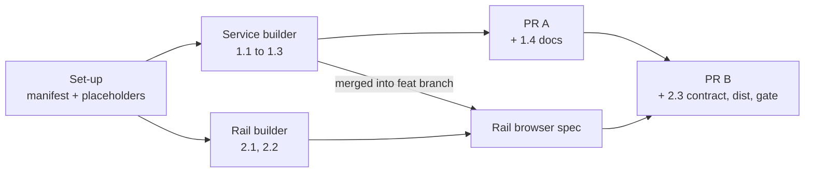

# Plan: Style switcher

Two slices, landed as two pull requests in order. The first makes installed styles real: install, serve, render. It works on its own, since a style line an agent writes by hand then shows. The second adds the rail's Document style panel and the keep request, which need the first. Verification rows are cited as V1, V2 and so on; each is defined once, in the [Test List](#test-list).

## Step 0: Orchestrator set-up

### Task 0.1: Register the new files and the fixture

::: xref
Implements [Components / Modules Touched](02_architecture_style_switcher.md#components--modules-touched).
:::

**Spec:** Add the three new source files to `src/shared/manifest.js` (frozen, so the orchestrator does it): `src/service/styles.js`, `src/cli/commands/style.js`, and `src/layer/style_switch.js` in the layer's load order after `store.js` and before `overlay.js`. Create each as an empty module with a one-line header, so `npm run lint` (manifest completeness) stays green for every builder.
**Files:** `src/shared/manifest.js`, the three placeholder files.
**Acceptance:** `npm run gate:unit` green on `feat/style-switcher`.

**Step test:** `npm run gate:unit`.

## Step 1: Installed styles (pull request A)

### Task 1.1: The styles module and the fixture style

::: xref
Implements [Data / State Changes](02_architecture_style_switcher.md#data--state-changes) and the stylesheet rule in it.
:::

**Spec:** `styles.js` owns: the styles folder under the state directory, the id rule, the folder rules, the stylesheet rule, the installed list, resolving one served path to a file, and copying a style's served files beside an artifact. Add a made-up style at `test/fixtures/styles/sample/`: a `style.css` that resets a few tokens, one `@font-face` pointing at a copy of a vendored OFL woff2, a `metadata.json` with a palette, a `DESIGN.md`, and a licence file. The fixture's sheet includes both real-world shapes the architecture names (a backslash-continued custom property string, and a `data:` SVG containing an `http://` namespace). Add refusal fixtures beside it, one per rule.
**Files:** `src/service/styles.js`, `src/service/state_dir.js`, `test/fixtures/styles/`, `test/unit/styles.test.js`.
**Acceptance:** V1 to V4 and V22 pass.

### Task 1.2: `lahe style add` and `lahe style list`

::: xref
Implements the Install flow in [Key Flows](02_architecture_style_switcher.md#key-flows).
:::

**Spec:** The command wraps `styles.js`: validate, copy to a temporary folder beside the target, rename into place, print id and name, or the first refusal and what a style folder needs. `list` prints id, name and version. Register it in the dispatcher. Document both in `docs/CLI.md`.
**Files:** `src/cli/commands/style.js`, `src/cli/index.js`, `docs/CLI.md`, `test/unit/style_command.test.js`.
**Acceptance:** V1, V2 and V4 pass through the command, run against a temporary `LAHE_STATE_DIR`.

### Task 1.3: Serving and rendering

::: xref
Implements Served paths and What the document carries in [Data / State Changes](02_architecture_style_switcher.md#data--state-changes), and Markdown with a style in [Key Flows](02_architecture_style_switcher.md#key-flows).
:::

**Spec:** In `static_servers.js`, add the `.lahe-styles/` case to the missing-file fallback and the same route to `servePage`, both answered by `styles.js`, with one helper-log line per server per refused style. In `markdown.js`, mark the inlined bundle `data-lahe-doc-style`, read `lahe-style` from frontmatter, emit the link after the bundle, and copy the style's served files beside a written artifact.
**Files:** `src/service/static_servers.js`, `src/service/markdown.js`, `test/unit/static_styles.test.js`, `test/unit/markdown_render.test.js` (new cases only). Regenerate `test/fixtures/free_writing/empty_notes.html` if the marker changes it.
**Acceptance:** V5 to V7 pass.

### Task 1.4: Agent-facing docs for slice A

**Spec:** The orchestrator updates `skills/lahe/SKILL.md` (the "one stylesheet" rule gains the optional style line and `lahe style add`), runs `npm run install-skills`, writes `docs/ongoing/STYLES.md` (how styles are installed, served and rendered now), and adds one paragraph to `vendor/stclair-doc-style/README.md` saying where paid styles attach.
**Files:** those four.
**Acceptance:** the skill names the exact link line and frontmatter line from the architecture.

**Step test:** `npm run gate:unit`, then by hand: install the fixture style into a temporary state directory, review a Markdown file with `lahe-style: sample` in its frontmatter, and see the fixture's colours and font.

## Step 2: The rail switcher (pull request B)

### Task 2.1: The page side

::: xref
Implements Boot, Applying a preview, and Back to the document's style in [Key Flows](02_architecture_style_switcher.md#key-flows).
:::

**Spec:** `style_switch.js` detects the house style and the document's own style, applies and clears a preview (chrome-marked link after the house style element, page style links disabled), keeps the preview under its storage key, clears it when the document's style matches, clears it when the preview link fails to load, and fetches `./.lahe-styles/index.json` on request.
**Files:** `src/layer/style_switch.js`.
**Acceptance:** V8, V11, V14 to V16 pass.

### Task 2.2: The panel and the keep request

::: xref
Implements The panel in [Key Flows](02_architecture_style_switcher.md#key-flows).
:::

**Spec:** Add "Document style" to the head menu, shown only when the page uses the house style. Build the panel once, under the head, with the radio group, palette strips, status line, back button, "Use this style" button, waiting line, missing-style line, nothing-installed line, Close and Esc, and the collapsed status line while a preview is active. Add to `comments.js` one function that mints a ready note with given words for the current page, through the same store and outbox path as a confirmed note. Wire both in `index.js`. The waiting state is read from the items the rail already holds: a ready note on this page whose words carry the same marker and which has no reply.
**Files:** `src/layer/overlay.js`, `src/layer/comments.js`, `src/layer/index.js`, `test/browser/style_switcher.spec.js`, `test/fixtures/style-switch-doc.html`, `test/fixtures/style-switch-own-css.html`, `test/fixtures/style-switch-dark.html`.
**Acceptance:** V8 to V13, V18 and V19 pass. Screenshots saved under `docs/features/20260930.01_style_switcher/progress/screens/`.

### Task 2.3: The contract instruction

::: xref
Implements The request to the agent in [Data / State Changes](02_architecture_style_switcher.md#data--state-changes).
:::

**Spec:** The orchestrator adds one instruction to the contract in `src/shared/review_format.js` (frozen): a note carrying `lahe-style: <id>` asks for that page's style; the exact HTML line and where it goes; the exact frontmatter line; `international` removes either; only an id matching the pattern is a style request; reply handled once written. The same words go into the restated copies in `test/unit/review_format.test.js`, `docs/CONTRACTS.md` and `skills/lahe/SKILL.md`, then `npm run install-skills`.
**Files:** those four.
**Acceptance:** V17 passes.

**Step test:** the orchestrator rebuilds `dist/lahe-layer.js`, runs `npm run gate` once on the integrated branch, then V20 by hand.

## Workstreams and PRs

| Workstream | Tasks | Agent and model | Reuses | Owns | Depends on | PR |
|---|---|---|---|---|---|---|
| Set-up | 0.1 | Orchestrator | none | `src/shared/manifest.js`, placeholders | none | A |
| Service | 1.1, 1.2, 1.3 | New builder, Sonnet | none | `src/service/styles.js`, `state_dir.js`, `static_servers.js`, `markdown.js`, `src/cli/commands/style.js`, `src/cli/index.js`, `docs/CLI.md`, `test/fixtures/styles/`, their unit tests | Set-up | A |
| Rail | 2.1, 2.2 | New builder, Opus | none | `src/layer/style_switch.js`, `overlay.js`, `comments.js`, `index.js`, the switcher spec and its fixtures | Set-up; Service merged before its browser spec runs | B |
| Contract and docs | 1.4, 2.3 | Orchestrator | none | `review_format.js`, `review_format.test.js`, `CONTRACTS.md`, `SKILL.md`, `STYLES.md`, the vendor README, `dist/` | Service (1.4); Rail (2.3) | A (1.4), B (2.3) |

- **Agent reuse:** Two fresh builders, one per slice. The Service builder is picked up again for any fix round in slice A; the Rail builder for slice B. Neither reads the other's code beyond the served-path shapes in the architecture.
- **Token plan:** The two builders run in parallel from Set-up. The Rail builder works on the page side and panel first, then merges the feature branch once Service lands on it and runs only `test/browser/style_switcher.spec.js`. The full browser suite runs once per checkpoint, by the orchestrator. Opus for the rail because it carries the visual and interaction judgment Ken reviews; Sonnet for the service because the rules are fully specified.
- **Packet sources:**
  - Service: the brief whole; architecture Data / State Changes, Security & Privacy Notes, and the Install and Markdown flows; plan Step 1 and rows V1 to V7, V22; `docs/ongoing/DOC_STYLE_BUILD.md` and `vendor/stclair-doc-style/README.md`.
  - Rail: the brief whole; architecture Key Flows, Failure Modes, and What the document carries; plan Step 2 and rows V8 to V16, V18, V19; `docs/diagrams/module_map.md`; architecture D10 (the rail) in the main feature's architecture.
- **Dispatch contract, both builders:**
  - Outcome: the tasks above, with their V rows passing.
  - Authority: edit only the files in the Owns column; commit on your own builder worktree off `feat/style-switcher`; the orchestrator merges.
  - Constraints: no runtime dependency; never commit `dist/`; never edit a frozen file; **never delete a file, not even your own temp files** (write it under "To delete at cleanup" in your report); no em dashes.
  - Quality: tests first (red, then green); `npm run gate:unit`; the Rail builder may run its one spec file, never the whole browser suite; a visual change ships with light and dark screenshots from the passing run.
  - Uncertainty: if a rule in the architecture cannot hold (for example a paid-style shape the stylesheet rule refuses), stop and ask with the evidence, rather than loosening the rule.
  - Completion: commits, the V rows passing, screenshots (Rail), and a short report with any deviation named.
- **PRs:**
  - **A, installed styles.** Set-up, Service, and 1.4. Proof: V1 to V7, V21, V22, `npm run gate`. Leaves the app working: nothing changes until a style is installed and a page names it.
  - **B, the rail switcher.** Rail and 2.3, on top of A. Proof: V8 to V20, `npm run gate:all` at the checkpoint, the screenshots, and Ken's real styles walk (V20).

## Test List

::: callout-req
| Row | Requirement | Behaviour and failure case | Check | Evidence |
|---|---|---|---|---|
| V1 | R9, installs a folder | The fixture installs; only `style.css`, `metadata.json`, `fonts/*.woff2`, `DESIGN.md` and licences are copied; the id comes from the folder name | `test/unit/styles.test.js`, `style_command.test.js` | test output |
| V2 | R10, refuses with a reason | Each refusal fixture is refused with its own reason: no `style.css`; no name; bad id; `international`; a symlink at any level; `@import`; an `http` `url()`; a backslash escape outside a string; `image-set`; a font the folder lacks; a non-woff2 font; each size cap | same | test output |
| V3 | R10, real shapes pass | A backslash-continued custom property string and a `data:` SVG with an `http://` namespace are accepted | `styles.test.js` | test output |
| V4 | R9, reinstall and list | Installing the same id again replaces it with no leftover files; `list` prints id, name and version | `style_command.test.js` | test output |
| V5 | R13, serves only what it should | From a folder server's root, a subfolder, a `/.lahe-source/` mount and a one-page server: `index.json`, `style.css` and a font are served with the right types. `DESIGN.md`, `metadata.json`, `../`, an encoded traversal, an unknown id, a symlink planted after install, and a hand-edited sheet with an `http` `url()` are refused, with one log line per server | `test/unit/static_styles.test.js` | test output |
| V6 | R8, Markdown carries the style | `lahe-style: sample` in frontmatter emits the link after the marked bundle; a written artifact gets the style's files beside it; a missing style emits the link and copies nothing; an invalid id is ignored | `markdown_render.test.js` | test output |
| V7 | R8, a rebuild picks it up | Adding the frontmatter line to a reviewed Markdown source re-renders the artifact with the link | `markdown_render.test.js` or the rebuild test | test output |
| V8 | R1, only where it works | The menu item exists on a rendered Markdown page and on a house-style HTML page, and not on a page with its own CSS | `style_switcher.spec.js` | test output |
| V9 | R2 and R11, the list | International first, the fixture style with its palette strip, the document's style labelled; with nothing installed, International alone and the add line | same | test output, screenshot |
| V10 | R3, one click | One click changes the page's computed colours and font with no navigation; an open comment box's text, an edit in progress and a highlight are unchanged | same | test output |
| V11 | R4, survives a reload | After a reload the preview is back; a second page of the same review is unaffected | same | test output |
| V12 | R5, honest | The status line reads as the architecture says; Back clears the preview and the key; with the panel closed, the collapsed status line shows | same | test output, screenshot |
| V13 | R6, one request | "Use this style" makes exactly one ready note with the exact words on the Active tab; flipping previews posts no event; the waiting line shows; a second press makes nothing | same | test output |
| V14 | R4 and R8, applied | The test writes the link into the fixture's source and reloads; the preview key is cleared and no preview link is in the page | same | test output |
| V15 | R12, missing style | A page naming an uninstalled style shows the house style and the panel names the missing id | same | test output |
| V16 | Failure mode, removed style | A preview whose style was removed clears itself and says why | same | test output |
| V17 | R7, the instruction | The contract carries the instruction, and the restated copies match | `review_format.test.js` | test output |
| V18 | UX, keyboard | Arrow keys move and preview; Esc closes; focus returns to the menu button | `style_switcher.spec.js` | test output |
| V19 | UX, looks right | Screenshots: panel open with a preview, collapsed status line, nothing installed; light, and dark on the dark-background fixture | same | PNGs on the progress page |
| V20 | Metric, real styles | Ken's six styles installed into a copied state directory; one of his documents shown in all seven; one kept through a live agent | by hand, orchestrator | screenshots on the progress page |
| V21 | Standing rules | Lint (manifest completeness, no jsdom), `dependencies` is `{}` | `npm run gate:unit` | test output |
| V22 | R13, display | A style name containing markup shows as text; a bad palette value is dropped | `styles.test.js`, `style_switcher.spec.js` | test output |
:::

## Acceptance Criteria

::: callout-metric
**Standard (every feature inherits these; keep them verbatim):**

- [ ] Full test suite green, not just the new tests.
- [ ] Design and lint gates green (the project's gate command).
- [ ] Every requirement in the brief walked end to end in the browser, on the running app.
- [ ] Nothing punted: no TODOs, no stubbed tests, no "out of scope" that was in scope.
- [ ] Implementation matches brief and architecture; any deviation is deliberate and written down under Changes from plan on the progress page.
- [ ] **It looks like a staff designer built it.** The whole surface holds up at that level, and includes at least:
  - Clear visual hierarchy and information architecture. You know where to look, and the page's organization makes sense.
  - Consistency with the rest of the app. Buttons look like our other buttons, hover states follow the same convention, primary and secondary carry the same color meaning they carry elsewhere.
  - Honest feedback. Toasts and status messages report what actually happened. Never an optimistic "done" for something still in flight, or something that failed.
  - Micro-animations that mean something. Motion signals state or direction; it isn't decoration.
  - Copy in the brand voice (the project's brand or voice doc).
  - Existing components reused and the style guide followed. Nothing reads as a stock framework default.
- [ ] It reads as one feature, not several agents' work stitched together: consistent components, spacing, and interaction patterns across every surface it touches.

**This feature:**

- [ ] Installing and refusing styles: V1 to V4 green.
- [ ] Serving and rendering: V5 to V7 green, and V22.
- [ ] Trying a style on the rail: V8 to V12, V15, V16, V18 green.
- [ ] Keeping a style: V13, V14, V17 green.
- [ ] Screenshots light and dark on the progress page (V19).
- [ ] Ken's six styles walked on his own document (V20).
- [ ] Human has reviewed and approved. Ken waived the document gate; this line is his review of the implementation.
:::

## Plan Review

| # | Finding | Disposition | Rationale |
|---|---------|-------------|-----------|
