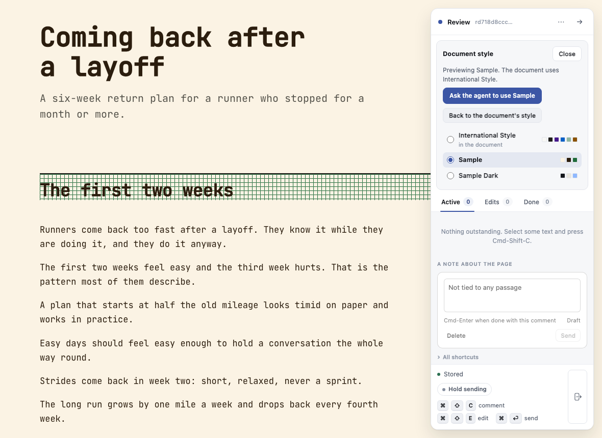
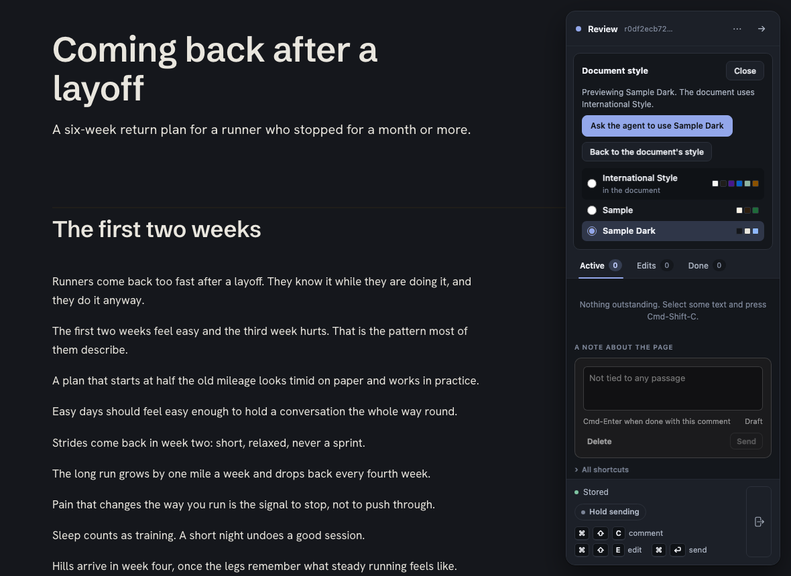

# Progress: Style switcher

**Phase 7, Verify.** The switcher is fully built and integrated (gate:unit 2389 pass, 0 fail). The full three-browser suite is running. The final code review and the independent spec check are back; the rail builder is fixing what they found, including one honesty bug. Nothing is waiting on you. Last updated 2026-09-30 20:35.

**Docs:** [Crucible](00_crucible_style_switcher.md) · [Brief](01_brief_style_switcher.md) · [Architecture](02_architecture_style_switcher.md) · [Plan](03_plan_style_switcher.md)

## Needs your attention

Nothing is waiting on you. Ken asked to review the implementation rather than the documents, so the human document review (Phase 5) is waived.

## Currently working on

| Agent or task | Doing | Started | Branch |
| --- | --- | --- | --- |
| Full suite (`npm run gate:all`) | Chromium, Firefox, WebKit on `9af2c71` | 2026-09-30 20:35 | `feat/style-switcher` |
| Rail builder (Opus) | Fix round 1: a style removed mid-preview, the flash between picks, latest-pick test, boot order, waiting-end tests, font proof, wording | 2026-09-30 20:35 | `rail-fix1` |

## Phases

| Phase | Status | Changed |
| --- | --- | --- |
| 0 Setup | done | 2026-09-30 19:20 |
| 1 Crucible | done | 2026-09-30 19:51 |
| 2 Brief | done | 2026-09-30 19:51 |
| 3 Architecture | done | 2026-09-30 19:51 |
| 4 Plan | done | 2026-09-30 19:51 |
| 5 Human review | waived, Ken reviews the implementation | 2026-09-30 19:20 |
| 6 Implement | done | 2026-09-30 20:35 |
| 7 Verify | in progress | 2026-09-30 20:35 |
| 8 Ship and land | not started | 2026-09-30 19:20 |
| 9 Cleanup | not started | 2026-09-30 19:20 |

## The record

### Task index

- Task 0.1, register the new files: done by the orchestrator, 2026-09-30 19:51. Unit gate 2275 pass, 0 fail.
- Service (Tasks 1.1 to 1.3): returned and merged 2026-09-30 20:10. 69 new tests, gate:unit 2344 pass, 0 fail. All six paid styles pass the stylesheet check. Detail: [service](progress/phase6_workstream_service.md). Dispatched 2026-09-30 19:51.
- Docs (Task 1.4): returned and merged 2026-09-30 20:21. Skill line, `docs/ongoing/STYLES.md`, vendor README.
- Rail (Tasks 2.1, 2.2): returned and merged 2026-09-30 20:21. 16 of 16 Chromium specs; the Markdown end-to-end spec runs after the service fixes. Screenshots in `progress/screens/`. Detail: [rail](progress/phase6_workstream_rail.md). Dispatched 2026-09-30 19:51.

### Passes

- Pass 4, 2026-09-30 20:35: Task 2.3 (the contract instruction) and the integration round merged; the rail uses the shared rules; specs run against the real server (style_switcher 16/16, keep 1/1, comments and rail menu 16/16, Chromium); gate:unit 2389 pass, 0 fail; bundle rebuilt.
- Pass 3, 2026-09-30 20:35: service fix round 1 merged (the UTF-16 blocker and the data: SVG check fixed, 24 new tests); planned marks removed; gate:unit 2387 pass, 0 fail.
- Pass 2, 2026-09-30 20:21: docs and rail merged into `feat/style-switcher`; gate:unit 2363 pass, 0 fail.
- Pass 1, 2026-09-30 20:10: service merged into `feat/style-switcher`; gate:unit 2344 pass, 0 fail.

### Changes from plan

- The rail branch merged into the feature branch before pull request A reached main. Main's gate is red on an unrelated free-writing test, so A could not land first. The feature may ship as one pull request.
- `style_switch.js` restore runs from `index.js`, not `sync.js` (the scroll restore lives there).
- The style id, colour and name rules move to `src/shared/style_rules.js`, a new planned file, so the service and the rail spell them once.

### Follow-ups

- PR 22 (comment boxes open in the corner since 2026-08-23), found by the rail builder, shipped on its own.

### Cleanup queue

Nothing queued.

### Test results

- 2026-09-30 20:35: `npm run gate:unit` on `9af2c71`: 2391 tests, 2389 pass, 0 fail, 2 todo.
- 2026-09-30 20:35: `npm run gate:all` on `9af2c71`: running.

### Ship

Not shipped yet.

## Log

- 2026-09-30 20:35. Final code review: no bugs in the layer; two test gaps (latest pick wins, waiting ends on every reply kind) and a one-frame flash of the house style between picks. Independent spec check: all 13 requirements met in code; one honesty gap (a style removed during a live preview still reads as previewing and offers Ask), V20 (the real-styles walk) not done yet, the progress page was stale. All sent to the rail builder as one round; V20 goes to the flow walker.

  What the panel looks like now, light and dark:

  

  

- 2026-09-30 20:21. Security review: one blocker (a UTF-16 stylesheet hides an outside fetch from the check; reproduced in all three browsers) and a weaker data: SVG check. Code review: the same encoding hole, plus smaller fixes. All sent back to the service builder as one round. Rail returned with 12 screenshots; light and dark previews look right.
- 2026-09-30 19:51. Documents done: crucible, brief, architecture, plan, with PM, security, architect, plan and design reviews integrated. Main calls: a click previews only; a second button asks the agent to keep the style in the page's source. Styles install with `lahe style add` into Lahe's state folder. The switcher shows only on pages that use the house style. PR 21 (the component catalog) is merged into this branch, since its own merge to main waits on an unrelated failing test on main.
- 2026-09-30 19:20. Ken asked for the style switcher in the document rail, designed in without stopping for his approval. He will review the implementation.
