# One reply box per thread

Every card now shows one reply box, at the bottom, under the newest message.

- **The newest reviewer message is waiting on the agent:** "Add another message" with Send. It adds to that message.
- **The agent answered the newest message:** "Follow up". It keeps the answered exchange and starts a new round.

What each box writes and how the agent sees it did not change.

## What caused two boxes

The rail already hid "Add another message" once the agent replied, by setting `hidden` on it. The box's own stylesheet rule (`display:flex`) overrode `hidden`, so the box stayed on screen under the reviewer's note while "Follow up" sat under the agent's reply. A handled card hid it by accident, because the rail hides the whole Active row on a handled card. A question reply and a not-handled reply leave the card open, so those showed both boxes, in short threads and long ones.

A second problem showed up in long threads. When the agent asked a question right after the reviewer sent a follow-up, the question never appeared: the reviewer's focus was still in the card, and the rail refused to add anything to a card holding focus. The box then sat under the reviewer's message instead of under the agent's question.

## The fix

- `src/layer/tab_active.js`: `.lahe-rail-add[hidden]{display:none}`, so `hidden` means hidden.
- `src/layer/overlay.js`: `attachCardNode` refuses only a node that itself holds the focus. A new node, such as a question block, is added to a focused card. Adding it does not move the focused field.
- `test/browser/page_hotkeys_fenced.spec.js` and `test/browser/reveal_deck.spec.js`: focus "Add another message" before typing in the card note. Typing in the note turns the comment back into a draft, and a draft has no add box. These two tests only passed because the bug left the box on screen.

## Tests

`test/browser/one_reply_box.spec.js`, 9 cases. It checks what is drawn on screen, not the `hidden` attribute.

- Short thread: waiting on the agent, a question reply, a not-handled reply, a handled reply, and a follow-up after an answer.
- Long thread (three back-and-forths): ending on the reviewer's message (and adding to it), ending on a question, a not-handled reply, and a handled reply.
- Each case checks: one visible text box, the right button, and the box below every message on the card.

Before the fix, 5 of the 9 failed (question and not-handled in short and long threads, and the follow-up case). After, all 9 pass.

## Screenshots

From the passing run, light and dark, in `screenshots/`:

| State | Light | Dark |
| --- | --- | --- |
| Waiting on the agent | 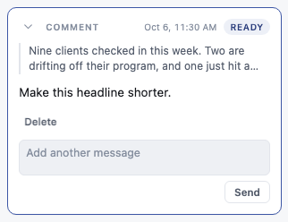 | 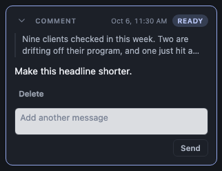 |
| Question reply | 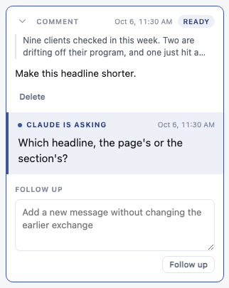 | 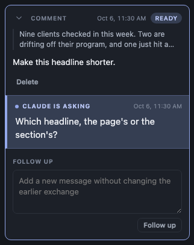 |
| Not-handled reply | 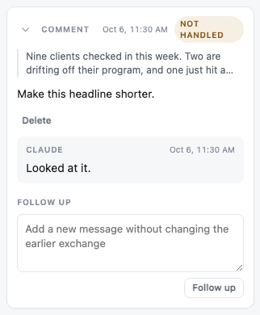 | 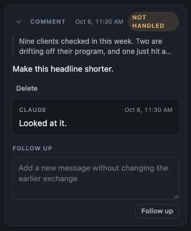 |
| Handled reply | 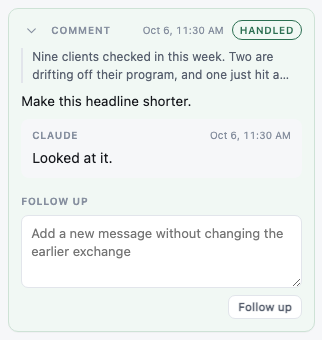 | 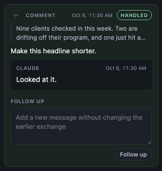 |
| Follow-up sent, waiting again | 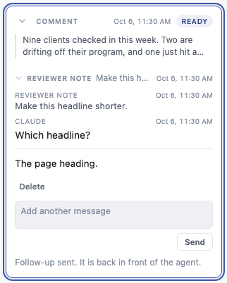 | 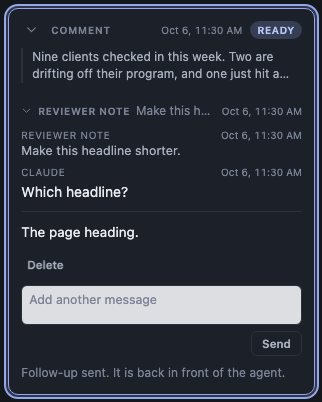 |
| Long thread, waiting on the agent | 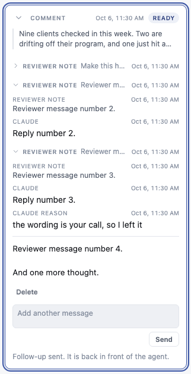 | 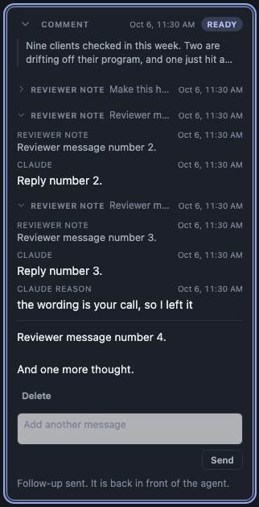 |
| Long thread, question | 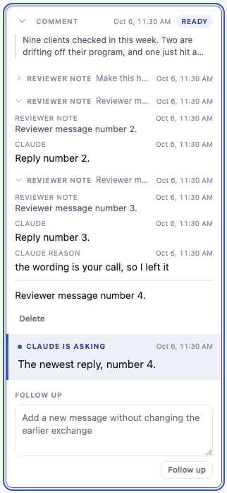 | 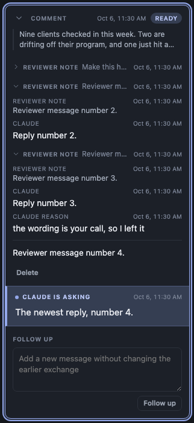 |
| Long thread, not handled | 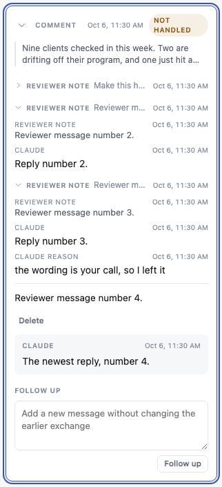 | 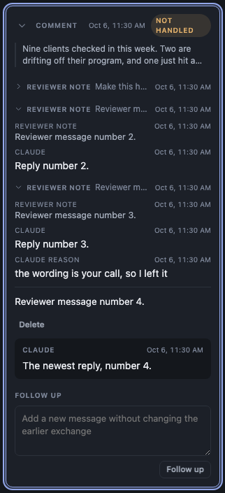 |
| Long thread, handled | 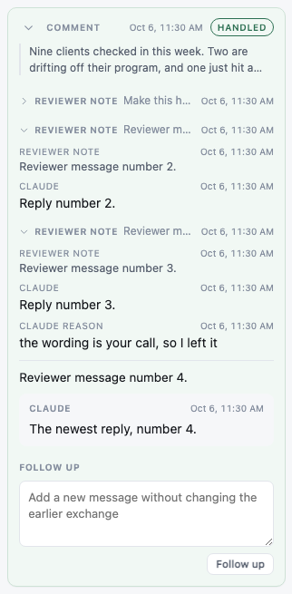 | 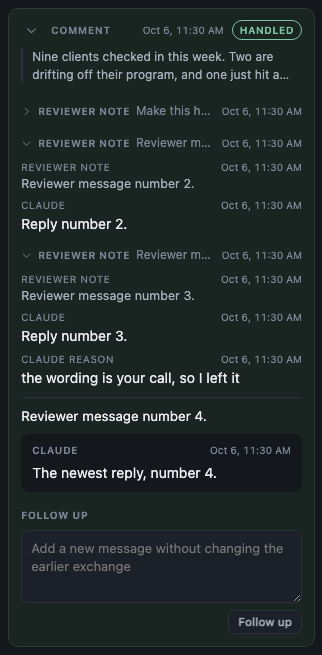 |

To regenerate: `LAHE_SHOT_DIR=docs/features/20261006.01_one_reply_box/screenshots npx playwright test test/browser/one_reply_box.spec.js`

## Noticed, not changed

- In dark mode the "Add another message" field is a light grey block on a dark card. It was like this before this change.
- The "Follow-up sent" status line sits below the box. It is a status line, not a message.
