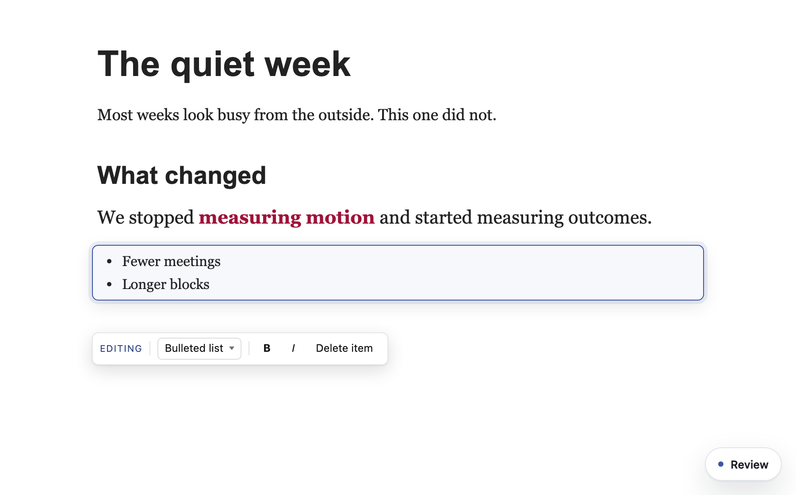
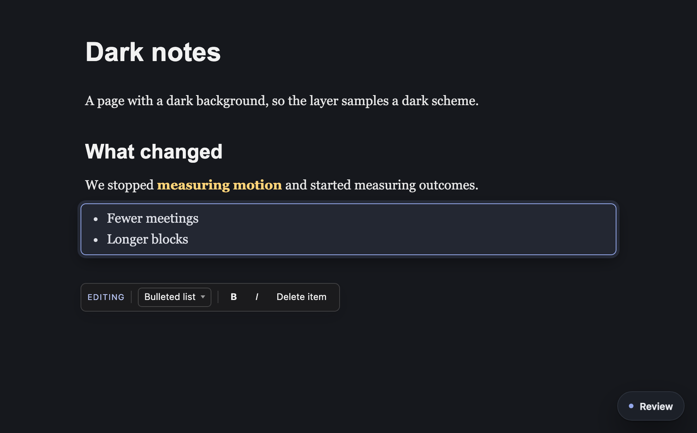

# Delete block on a bullet

## Decided

- **The button says "Delete item" while the caret is in a bullet**, and "Delete block" everywhere else. Ken approved this on the spec.

## Problem

When you edit a page and put the caret in one bullet of a list, the edit bar's "Delete block" button removes every bullet in the list, not the one you are on.

The cause: the editor treats a whole list as one block. The `<ul>` is the block it is editing, and each bullet is a smaller unit inside it. "Delete block" acts on the block, so it takes the `<ul>` and everything in it. A test on the blog fixture reproduces it: caret in the second of two bullets, press Delete block, and the list is gone.

## Requirements

1. **One bullet goes, the rest stay.** With the caret in a bullet and other bullets in the same list, Delete block removes only that bullet.
2. **You keep editing.** Edit mode stays open on the list. The caret moves to the end of the bullet above, or to the start of the bullet below when you deleted the first one.
3. **It is recorded as an edit to the list.** When you commit, the agent gets one edit record whose after-text is the list without that bullet. It is not a "delete" record, because the list is still there.
4. **The last bullet still takes the list.** When the bullet is the only one left, Delete block removes the whole list as it does today, recorded as a delete.
5. **Undo still works.** The editor's own undo inside the session brings the bullet back, the same as any other change to the list.

## Approach

No design call. The change is in one place: `deleteBlock` in `src/layer/editing.js`. Before it decides what block to delete, it checks whether the caret is in a bullet whose list has other bullets. If so, it removes that bullet as an in-session change (the same path Enter uses when it ends a list), saves an undo step, and moves the caret. Otherwise it does what it does today.

This works the same whether the list is the block you opened or a list you typed during the session.

## Tasks

1. Red test: `test/browser/delete_list_item.spec.js`, written and failing today.
2. Fix `deleteBlock`, and swap the button label to "Delete item" while the caret is in a bullet.
3. Run the new spec, the existing delete and undo spec (`editing_undo.spec.js`), and `npm run gate:unit`.

| Behavior | Proof | Fails today? |
|---|---|---|
| Second of two bullets: only it goes, edit mode stays open | spec test 1 | yes, whole list gone |
| Commit records an edit, after-text without that bullet | spec test 1 | yes |
| First bullet: it goes, caret lands in the next bullet | spec test 2 | yes |
| Only bullet left: whole list goes, recorded as a delete | spec test 3 | no, passes today and must keep passing |
| Button reads "Delete item" in a bullet, "Delete block" in a paragraph | spec test 4 | yes |
| Undo inside the session brings the bullet back | spec test 5 | no |
| Deleting a paragraph is unchanged | `editing_undo.spec.js` | no |

## Acceptance

Every row in the table passes. No analytics or flag: this is a fix to existing behavior.

## Built

The bar with the caret in a bullet, from the built layer on the test fixture. The new spec's five tests pass, and so does the existing delete and undo spec.

