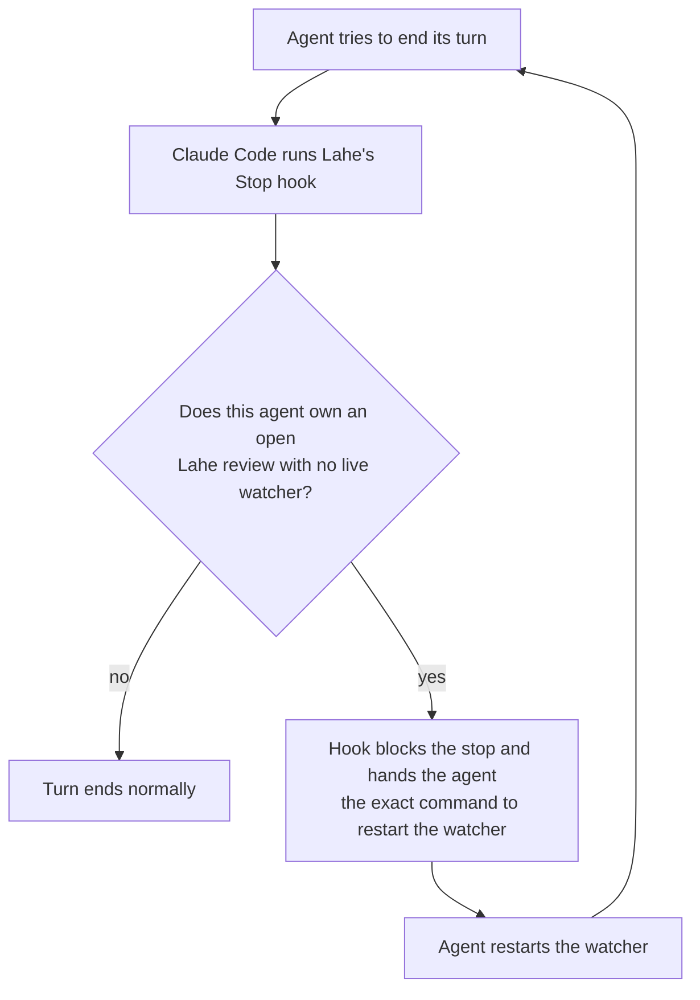

# Re-arm guard: agents keep watching without having to remember

**Short version.** Agents stopped re-arming because Claude Code took away the one tool that made watching automatic. The fix is to put the guarantee back in Claude Code itself: a small hook that won't let an agent finish its turn while one of its Lahe reviews has nobody watching. One decision is at the end.

## What broke

- Until September 14, a Claude agent armed one persistent watch. It woke the agent whenever work arrived and never expired. The agent never had to remember anything.
- Claude Code 2.1.271 removed the persistent option. Every watch now expires, at most 30 minutes for the Monitor tool and at most 2 hours for a background command.
- Lahe's fallback is its own command, `lahe monitor`, run in the background. It ends every time work arrives, it times out, or Claude Code reaps it to free memory. Each time, the agent has to start it again. That is the step agents forget, so we are back to depending on agent memory, the thing Lahe was built to avoid.

## The fix: a Stop hook that Lahe installs

A hook is a script Claude Code runs on its own, not something the agent decides to do. A **Stop** hook runs each time an agent tries to end its turn, and it can refuse.

- **Which reviews are the agent's.** The hook reads the agent's own session log and finds the Lahe session IDs it started. It ignores other sessions' reviews.
- **Whether a watcher is alive.** Lahe already knows: each watcher leaves a fresh heartbeat from a process that still exists. The hook asks Lahe; it doesn't guess.
- **The block message.** It names the exact `lahe monitor` command, ready to run, so the agent has nothing to look up.
- **No endless loop.** Claude Code tells the hook when it is already inside a blocked stop. The hook blocks at most once per turn, so an agent that genuinely can't restart the watcher is never trapped.
- **Closed or handed-over sessions are left alone.** A session the reviewer ended, or that another agent took over, doesn't count.
- **Install.** `npm run install-skills` adds the hook to Claude Code's settings without touching your other hooks, and it is the same step that already installs the Lahe skill.

## The other half: fewer timeouts while idle

- An idle watcher still ends at the background-command limit, which is 2 hours by default. The hook makes the agent restart it, at the cost of one short model turn.
- Claude Code reads a setting, `BASH_MAX_TIMEOUT_MS`, that raises that limit. Setting it to 24 hours drops the idle restarts from up to 12 a day to about 1.
- The skill also tells Claude agents to start the watcher with the largest limit allowed.

## What you'd notice

- Agents keep answering your comments for as long as their session is open, without stalling after an hour or two.
- The rail's "no agent listening" warning should show only when an agent's session has truly stopped, not because a watcher quietly lapsed.
- Nothing changes for Codex or Antigravity. Neither has this kind of hook; their instructions stay as they are.

## How it gets built and checked

- One small change: the hook command, its install step, the skill's Claude Code section, and the docs.
- Tests cover these cases:
  - an agent with an unwatched review is blocked once with the right command
  - a watched one isn't blocked
  - a closed session isn't blocked
  - another agent's review is ignored
  - the second stop in one turn passes
- The full test suite runs locally before anything goes to GitHub.

## The decision

**Build the re-arm guard as described?** And separately: **set `BASH_MAX_TIMEOUT_MS` to 24 hours** in your Claude Code settings, so idle watchers rarely expire? That second one is a setting on your machine, so it's your call.
