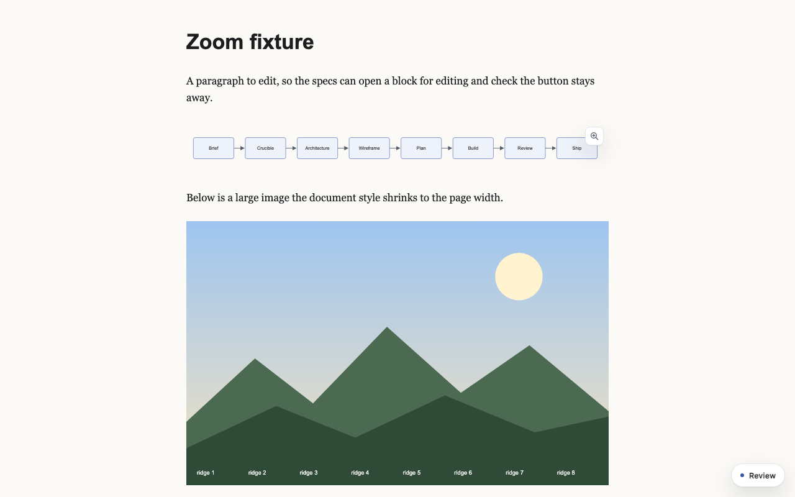
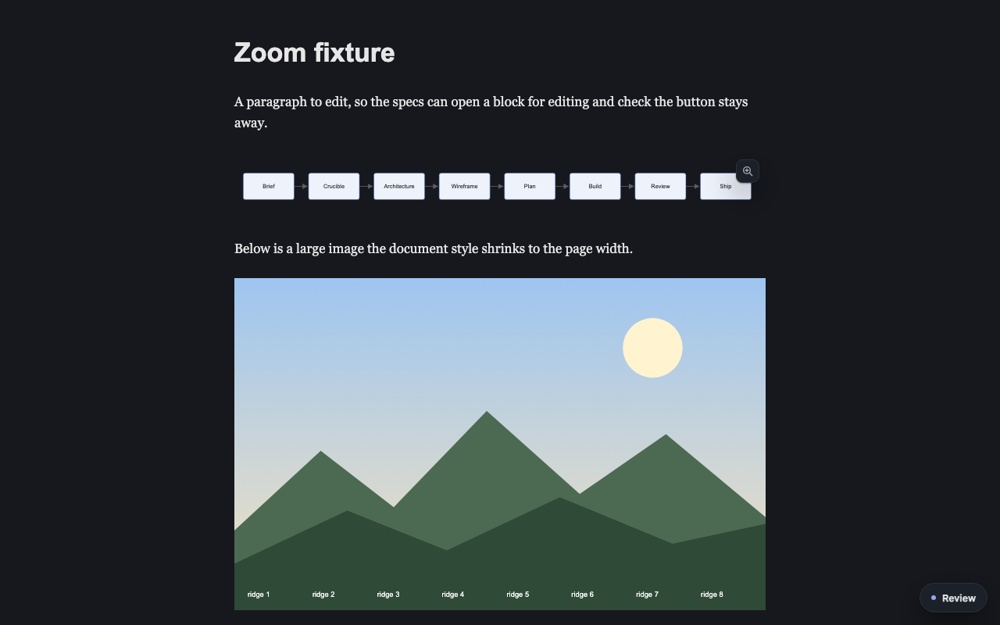
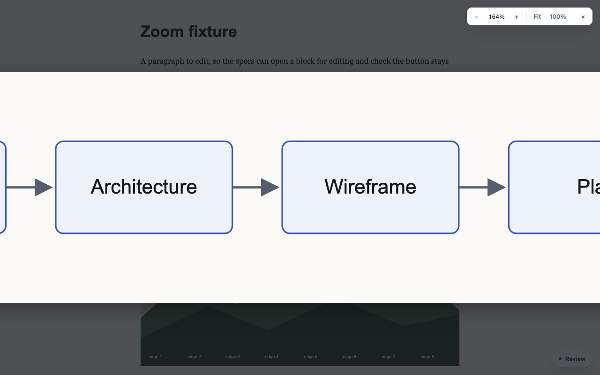
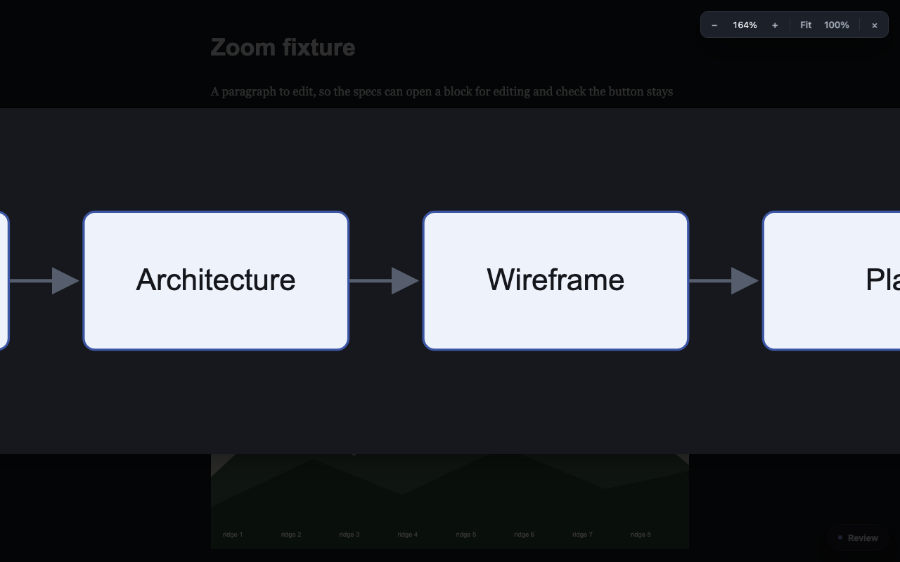

# Zoom into graphs and images

## Problem

Big graphs are hard to read on a reviewed page. The document style shrinks every Mermaid diagram to the page width (`main .mermaid svg { max-width: 100% }` in `vendor/stclair-doc-style/lahe-markdown.css`), so a wide diagram's labels end up tiny. Large images are shrunk the same way. Nothing in LAHE lets the reviewer enlarge one and look around it.

## Decided

- **How it opens:** a small magnifier button appears in the corner when you hover a graph or image. Clicking the image itself is left to the page, because on app pages an image is often a link or button, and in pick mode a click on a picture starts a comment.
- **Where it works:** every page with the review layer on it.
- **What gets the button:** every graph drawn as SVG (all Mermaid included), and any image shown smaller than its real size or larger than about 300 pixels on screen. Small icons and logos get none.

## Requirements

1. **Hover button.** Hovering a qualifying graph or image shows a magnifier button at its top right corner. It fades out shortly after the pointer leaves both the target and the button. Keyboard: the button can be focused and pressed.
2. **Which targets.** An outermost `<svg>` (not one nested inside another svg) at least about 120 pixels on its shorter side, and an `` that is shown smaller than its natural size or is at least about 300 pixels on its longer side. Nothing inside the layer's own chrome, nothing hidden, nothing under about 40 pixels.
3. **The viewer.** The button opens a full-screen view on a dimmed background, fitted to the window with a margin.
4. **Zoom.** The scroll wheel and trackpad pinch zoom toward the pointer. Zoom is limited to a sensible range (for example 10% to 2000%). Plus and minus keys zoom too.
5. **Pan.** Dragging moves the view. Arrow keys move it too.
6. **Controls.** Zoom in, zoom out, fit to window, actual size (100%), and close, in a small bar in a corner. The current zoom level shows as a percentage.
7. **Close.** Esc, the close button, or a click on the dimmed area (not a drag that ends there) closes the viewer. Focus goes back to where it was.
8. **Sharp graphs.** An SVG is shown as a copy of the vector, so it stays sharp at any zoom. An image is shown from its own `src` (its `currentSrc` when it has one), at full resolution.
9. **Leaves the page alone.** Nothing is written into the page's own DOM. The button and the viewer live in the layer's own chrome. The page's click handlers, links and pick mode behave exactly as before. While the viewer is open, the page under it does not scroll.
10. **Stays out of the way.** No button while a block is being edited, while comment pick mode is active, or while presenting.
11. **Light and dark.** The button and viewer use the layer's own theme tokens, so they read correctly on light and dark pages.

## Approach

One new layer module, `src/layer/zoom.js`, with no outside code. The builder chooses where it sits in the manifest's load order and how it is booted, following `docs/diagrams/module_map.md` and `src/shared/manifest.js` (a frozen file: the orchestrator approves the one-line entry). The builder reads `src/layer/overlay.js` for how the layer draws its own chrome in a shadow root and themes it, `src/layer/comments.js` around pick mode (`outermostSvg`) for how a click target is resolved, and `src/layer/index.js` for boot and the presenting state.

The SVG copy must not carry the page's ids into the viewer in a way that breaks the original (Mermaid styles by id). Use the layer's own shadow root, which keeps ids apart, and copy the styles an SVG needs (Mermaid puts a `<style>` inside the svg).

## Tasks

1. Builder: write the browser spec first (`test/browser/zoom_viewer.spec.js`) plus a fixture page with a wide Mermaid-like SVG, a large image, a small icon, an image inside a link, and a nested svg.
2. Builder: build `src/layer/zoom.js`, its manifest entry and boot wiring.
3. Builder: run `npm run gate:unit` and the one spec file. Never the whole browser suite.
4. Builder: screenshots of the hover button and the open viewer, light and dark, from the passing test run, saved in this folder.
5. Orchestrator: code review on the diff, rebuild `dist/`, `npm run gate`, PR.

| Behavior | Proof |
|---|---|
| Hovering a wide SVG shows the button; a small icon gets none | spec |
| An image in a link: the button opens the viewer, a click on the image still follows the link | spec |
| Wheel zooms toward the pointer (the point under it stays put) | spec |
| Drag pans; fit and 100% set the expected scale | spec |
| Esc, close and a backdrop click close it; a drag ending on the backdrop does not | spec |
| The viewer's SVG is a vector copy; the page's original is untouched (same markup before and after) | spec |
| No button in edit mode, in pick mode, or while presenting | spec |
| Nested svg gets no button of its own | spec |
| The page is not written to (no mutation in the page DOM from hover or viewer) | spec |

## Acceptance

Every row passes in Chromium, and `npm run gate` passes on the merged head. Screenshots, light and dark, are in this folder. No analytics and no flag: this is a reviewer convenience with nothing to measure.

## Built

The feature is one new layer module, `src/layer/zoom.js`. It loads after `editing.js` and before `replay.js`. `index.js` boots it right after the editing surface and passes it one "blocked" check that covers editing, pick mode and presenting. The button and the viewer sit in their own closed shadow root inside the library's one surface. The viewer is stacked one level above the rail, so it covers the rail and its pill.

Where the build reads the spec a certain way:

- **Wide graphs.** A wide left-to-right Mermaid chart shrunk to the page width is often under 120 pixels tall. The decided rule says "all Mermaid included", so an svg also qualifies when it is shown smaller than its own viewBox, or when Mermaid drew it. It still needs at least 40 pixels on each side.
- **Keyboard.** When focus lands on a page element that holds exactly one qualifying picture, such as a link around an image, the button shows. Tab moves focus to the button, and Shift-Tab goes back. Inside the viewer, Tab cycles through the toolbar.
- **Keys in the viewer.** Plus and minus zoom, 0 fits, 1 shows actual size, and the arrow keys pan the way a map does. Esc closes. Keys the viewer uses do not reach the page.
- **Background.** A transparent graph is drawn on the background color it had on the page.

Proof: `test/browser/zoom_viewer.spec.js` covers each row of the table above. `test/unit/zoom.test.js` covers the size rules and the zoom arithmetic. The screenshots below come from that spec's screenshot test (`LAHE_ZOOM_SHOTS=1`), and the run that produced them also passed every other test in the file.

Hover button on a wide Mermaid-style graph, light and dark:

The open viewer zoomed to 164%, light and dark:

