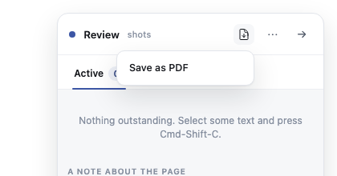
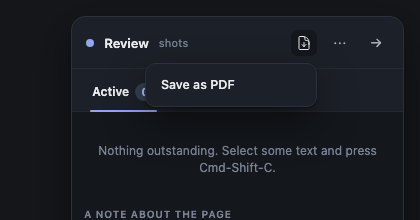
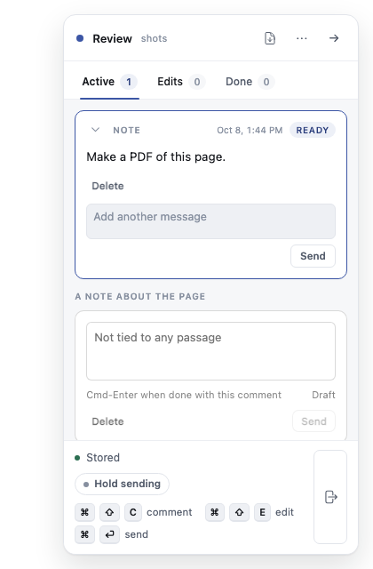
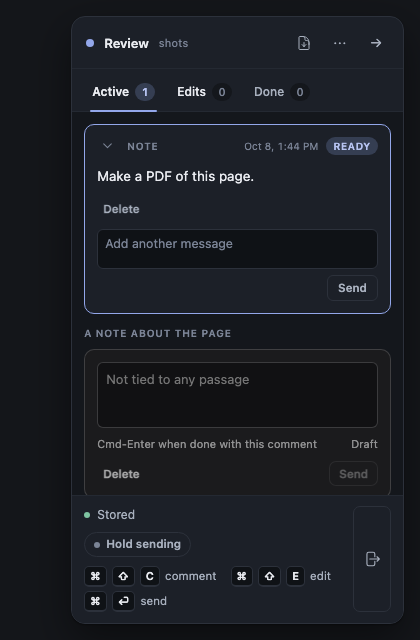

# PDF button: progress

**Status:** built and tested. The code review and the full gate run next, then the PR.

## What it looks like

The button sits in the rail's top bar, between the Document style button and the ⋯ menu. Clicking it opens a tray with one item.

Choosing "Save as PDF" sends the note at once. It lands as a ready card in the Active tab, and the note box below it is left alone.

The screenshots come from the same build that passed `test/browser/pdf_button.spec.js` (4 passed).

## Checks

- `test/browser/pdf_button.spec.js`: 4 passed. It covers the tray, Esc and click-outside, a ready note sent once, the note box left alone, and a read-only window.
- `npm run gate:unit`: 2469 passed, 0 failed.
- Leftover helpers: 1 before the test runs and 1 after (the real helper), so no leaks.

## To delete at cleanup

- `test/browser/tmp_pdf_shots.spec.js` in this worktree: the screenshot script. It is not committed.
- `docs/features/20261008.01_pdf_button/00_decision_pdf_button.md` in the main checkout: an uncommitted copy. The committed one is on this branch.
- The `node_modules` symlink in this worktree. It is not committed.
