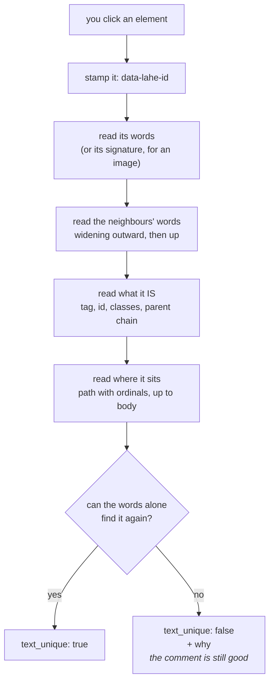
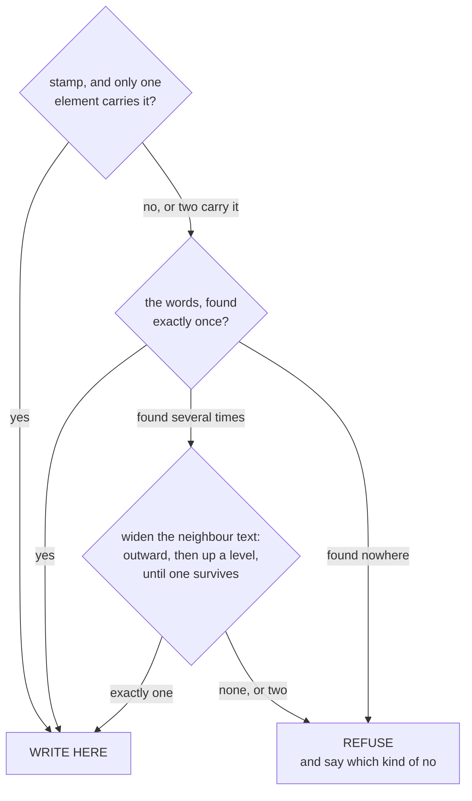
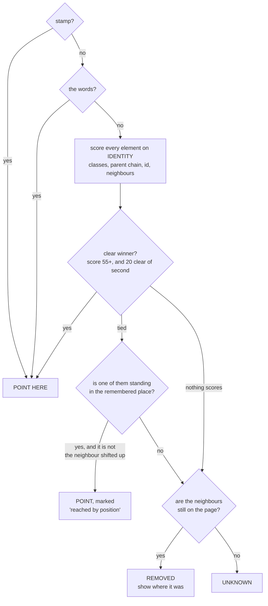

# How a Live Agentic HTML Editor (Lahe) Identifies the Correct DOM Elements for Editing, aka Fingerprinting

**Status: living document.**

Agentic editing means that what you edit in your browser does **not** make direct
edits to the file on disk. An agent must take the DOM element that you
highlighted, and find that same element in the source, then make the edit in the
source and refresh your page. For the editor to be a quality-of-life tool, it needs to satisfy
additional requirements like undo, and showing you where in the document edits
were made, which bring additional complexities to bear.

---

## Key Use Cases

### 1. Identify the correct element to be edited

Find the correct text in the source. You want to make an edit by hand, or you've
given rewrite steering for a paragraph. Find that paragraph and edit it.

<div style="border:1px dashed rgba(17,17,17,0.22);border-radius:10px;padding:10px 14px 14px;margin:12px 0;background:rgba(17,17,17,0.015)">
<div style="font:11px/1 ui-sans-serif,system-ui,-apple-system,sans-serif;letter-spacing:.06em;text-transform:uppercase;color:rgba(17,17,17,0.42);margin-bottom:10px">Example</div>

<div style="border:1px solid rgba(17,17,17,0.10);border-radius:6px;padding:18px 22px;background:#fff;font:15px/1.65 ui-sans-serif,system-ui,-apple-system,sans-serif;color:#111">
Runners come back too fast after a layoff, and <span style="background-color:rgba(60,86,165,0.26)">the third week is where it shows</span>. Most plans are written for the athlete who does not miss a session, which is nobody.
</div>

<div style="width:288px;display:flex;flex-direction:column;gap:8px;padding:12px;border-radius:10px;border:1px solid rgba(17,17,17,0.12);background:#ffffff;box-shadow:0 8px 28px rgba(17,17,17,0.16),0 1px 2px rgba(17,17,17,0.08);font:13px/1.5 ui-sans-serif,system-ui,-apple-system,sans-serif;color:#111111;margin:-10px 0 0 34px;position:relative;z-index:1">
  <div style="height:10px;margin:-4px -4px 0 -4px;border-radius:6px;background-image:radial-gradient(rgba(17,17,17,0.28) 1px,transparent 1px);background-size:5px 5px;background-position:center;background-repeat:repeat-x"></div>
  <p style="margin:0;padding-left:8px;border-left:2px solid rgba(60,86,165,0.75);color:rgba(17,17,17,0.62);font-size:12px">the third week is where it shows</p>
  <div style="width:100%;box-sizing:border-box;min-height:66px;border:1px solid rgba(17,17,17,0.16);border-radius:6px;padding:7px 8px;font:inherit;color:inherit;background:#fff">Say which week plainly. And cut the second sentence down, it is doing two jobs.</div>
  <div style="display:flex;align-items:center;justify-content:space-between;gap:8px;color:rgba(17,17,17,0.5);font-size:11px">
    <span>Cmd-Enter when done with this comment</span>
    <span>Draft</span>
  </div>
  <div style="display:flex;align-items:center;justify-content:space-between;gap:8px">
    <button style="font:inherit;font-size:11.5px;font-weight:550;color:rgba(17,17,17,0.62);border:1px solid transparent;border-radius:7px;padding:3px 5px;background:none">Delete</button>
    <button style="font:inherit;font-size:11.5px;font-weight:550;color:rgba(17,17,17,0.62);border:1px solid rgba(17,17,17,0.12);border-radius:7px;padding:3px 9px;background:#fff">Send</button>
  </div>
</div>

</div>

This is the simplest case, and while text matching sounds easy, there can be
matching text elsewhere on the page, so we need to use other methods for
identifying the element.

### 2. Show where edits were made

Trust but verify, right? After steering an agent to make an update, you'll move
on while it works. Later you want to see what it wrote, so you use the review
panel and click on the card that shows the edit, and it scrolls the page to where
it made those changes.

Because the document has now been changed according to your request, the
fingerprint that was taken before the edit may no longer be accurate.

<div style="border:1px dashed rgba(17,17,17,0.22);border-radius:10px;padding:10px 14px 14px;margin:12px 0;background:rgba(17,17,17,0.015)">
<div style="font:11px/1 ui-sans-serif,system-ui,-apple-system,sans-serif;letter-spacing:.06em;text-transform:uppercase;color:rgba(17,17,17,0.42);margin-bottom:10px">Example: the card, and the passage it points to</div>
<div style="display:flex;gap:16px;align-items:flex-start;flex-wrap:wrap">

<div style="flex:1 1 300px;min-width:280px;border:1px solid rgba(17,17,17,0.10);border-radius:6px;padding:18px 20px;background:#fff;font:15px/1.65 ui-sans-serif,system-ui,-apple-system,sans-serif;color:#111">
Runners come back too fast after a layoff, and <span style="background-color:rgba(60,86,165,0.15)">week three is where the wheels come off</span>. Most plans are written for the athlete who never misses a session.
</div>

<div style="flex:0 0 320px;max-width:320px;display:flex;flex-direction:column;background:#fff;color:#15171c;border:1px solid #e2e5eb;border-radius:14px;box-shadow:0 1px 2px rgba(18,20,26,.06),0 14px 34px rgba(18,20,26,.13);font:13px/1.5 ui-sans-serif,system-ui,-apple-system,sans-serif;overflow:hidden">
  <div style="display:flex;align-items:center;gap:10px;padding:13px 14px 12px;border-bottom:1px solid #eceef2"><span style="width:8px;height:8px;border-radius:50%;background:#3c56a5;flex:none"></span><span style="font-weight:600">Review</span></div>
  <div style="display:flex;gap:2px;padding:0 10px;border-bottom:1px solid #eceef2">
    <span style="position:relative;padding:6px 10px 10px;font-size:12px;font-weight:500;color:#565e6d;display:flex;align-items:center;gap:6px">Active <span style="font-variant-numeric:tabular-nums;font-size:11px;color:#868f9f;background:#f6f7f9;border-radius:999px;padding:1px 6px;min-width:20px;text-align:center">0</span></span>
    <span style="position:relative;padding:6px 10px 10px;font-size:12px;font-weight:600;color:#15171c;display:flex;align-items:center;gap:6px;box-shadow:inset 0 -2px 0 #3c56a5">Done <span style="font-variant-numeric:tabular-nums;font-size:11px;color:#2c3f7d;background:rgba(60,86,165,.09);border-radius:999px;padding:1px 6px;min-width:20px;text-align:center">1</span></span>
    <span style="position:relative;padding:6px 10px 10px;font-size:12px;font-weight:500;color:#565e6d;display:flex;align-items:center;gap:6px">Edits <span style="font-variant-numeric:tabular-nums;font-size:11px;color:#868f9f;background:#f6f7f9;border-radius:999px;padding:1px 6px;min-width:20px;text-align:center">0</span></span>
  </div>
  <div style="margin:10px;background:#fff;border:1px solid #e2e5eb;border-radius:10px;padding:11px 12px 12px;display:flex;flex-direction:column;gap:8px;box-shadow:0 1px 1px rgba(18,20,26,.03)">
    <div style="display:flex;justify-content:space-between;align-items:center">
      <span style="font-size:10px;font-weight:600;letter-spacing:.06em;text-transform:uppercase;padding:2px 7px;border-radius:999px;color:#2c6f52;background:transparent;border:1px solid currentColor">handled</span>
      <span style="font-size:11px;color:#868f9f">11:04</span>
    </div>
    <div style="font-size:12px;color:#565e6d;border-left:2px solid #e2e5eb;padding-left:9px">the third week is where it shows</div>
    <div style="font-size:13.5px;line-height:1.5;color:#15171c">Say which week plainly. And cut the second sentence down, it is doing two jobs.</div>
    <div style="border-radius:8px;padding:8px 10px;background:#f6f7f9;font-size:12.5px">
      <div style="display:flex;align-items:baseline;justify-content:space-between;gap:8px;margin-bottom:3px;color:#868f9f;font-size:11px"><span>claude</span><span>1 file</span></div>
      Named the week and cut the trailing clause.
    </div>
  </div>
</div>

</div>
</div>

Clicking that card scrolls the page to the highlighted sentence on the left. Note
what the card still quotes: <b>the third week is where it shows</b>, the words as
they were when the comment was made. The page now says <b>week three is where the
wheels come off</b>. Not one word is shared, and the card still has to find it.


### 3. Undo an edit that has already been applied

The reviewer takes back a change the agent made. The passage has to be found
again, put back to what it said, and the agent has to be told to take the change
out of the source so the next rebuild does not bring it back.

An undo is the easiest of these to get right and the worst to get wrong: it
writes, so it needs certainty, and it targets a passage that by definition has
already been changed once.

### 4. Survive the edits queued ahead of it

The reviewer works faster than the agent applies. Four comments are made against
the page as it stands, and then they are applied one at a time, so the second
edit lands on a page the first edit already changed.

If the first edit deletes a paragraph, everything below it shifts, and every
reference taken before that moment now points one place too far down. Nothing
announced it. The references still work, right up until a later edit takes away
the words that were holding them together.

## A document that makes it hard

The 2026-08-26 review of the lessons queue. 73 cards, one per lesson file, each
rendered from the same template. Here are two of them as the reviewer saw them:

<div style="border:1px solid #d8dbe0;border-radius:8px;padding:14px 16px;margin:10px 0;font-family:system-ui,sans-serif">
  <div style="font-size:12px;letter-spacing:.04em;color:#7a8290;text-transform:uppercase">rails</div>
  <div style="font-weight:600;margin:4px 0 6px">a-data-migration-does-not-run-on-a-brand-new-database.md</div>
  <div style="font-size:13.5px;color:#3d4450;line-height:1.5">A migration that has always been in the schema never runs again, so a fix written inside one is a fix that only exists on machines that already ran it.</div>
  <div style="margin-top:10px;font-size:13px"><b>Approve</b> / Deny / Discuss</div>
</div>

<div style="border:1px solid #d8dbe0;border-radius:8px;padding:14px 16px;margin:10px 0;font-family:system-ui,sans-serif">
  <div style="font-size:12px;letter-spacing:.04em;color:#7a8290;text-transform:uppercase">rails</div>
  <div style="font-weight:600;margin:4px 0 6px">a-partial-render-inside-a-loop-reloads-the-template.md</div>
  <div style="font-size:13.5px;color:#3d4450;line-height:1.5">Rendering a partial inside each iteration re-resolves the template every time, which is invisible until the collection is large.</div>
  <div style="margin-top:10px;font-size:13px"><b>Approve</b> / Deny / Discuss</div>
</div>

The reviewer clicked **Approve** on the first card and typed "yes".

Everything the tool would normally use to tell those two apart is identical:

| Signal | Card 1 | Card 40 |
| --- | --- | --- |
| the word clicked | `Approve` | `Approve` |
| the words either side | `/ Deny / Discuss` | `/ Deny / Discuss` |
| tag and classes | `span.decide` | `span.decide` |
| parent chain | `div.card__decide` in `article.card` | the same |
| nearest heading | `rails (15)` | `rails (15)` |
| position | `...>article:1>div:3>span:1` | `...>article:40>div:3>span:1` |

Only two things differ: the position, which lies as soon as a card is added or
removed, and the filename, which is one level up inside the card and was not
being read.

What happened: the anchor could not be minted, the item reached the agent
stamped lost, and the agent resolved it by counting span ordinals and then asked
the reviewer to confirm. It guessed right. It said it would not want to do that
73 times.

Two things came out of that case, both now fixed and both in the cases at the
bottom: context widening climbs to the filename instead of stopping at the first
row of siblings (case 19 and the 73-card test), and minting no longer refuses
when it cannot guarantee re-finding something later.

## What each case looks like

The same paragraph through every state, rendered as the reviewer sees it. The
wash is the tool's own comment highlight, `rgba(60, 86, 165, 0.15)`.

### 1. The comment is made

<div style="border:1px solid #d8dbe0;border-radius:8px;padding:14px 18px;margin:8px 0;font-family:system-ui,sans-serif;font-size:14px;line-height:1.6;color:#1f2430">
Runners come back too fast after a layoff, and <span style="background-color:rgba(60,86,165,0.15)">the third week is where it shows</span>. The plan has to survive the week nobody plans for.
</div>

Captured: the words, the words either side, `p.lede` inside `section.intro`,
the path, and a stamp written onto the element.

### 2. The agent rewords it

<div style="border:1px solid #d8dbe0;border-radius:8px;padding:14px 18px;margin:8px 0;font-family:system-ui,sans-serif;font-size:14px;line-height:1.6;color:#1f2430">
Runners come back too fast after a layoff, and <span style="background-color:rgba(60,86,165,0.15)">week three is when it surfaces</span>. The plan has to survive the week nobody plans for.
</div>

Every word the anchor was made of is gone. **The write refuses**, correctly:
these are not the same words and an edit may not land on a maybe. **The
highlight stays**, because the element's identity never depended on the words.

### 3. The agent deletes it

<div style="border:1px solid #d8dbe0;border-radius:8px;padding:14px 18px;margin:8px 0;font-family:system-ui,sans-serif;font-size:14px;line-height:1.6;color:#1f2430">
Runners come back too fast after a layoff. <span style="border-left:3px solid rgba(60,86,165,0.45);padding-left:8px;color:#7a8290;font-style:italic">your comment was here</span> The plan has to survive the week nobody plans for.
</div>

Nothing claims to be the passage, including the sentence that closed the gap.
What is shown is the surviving neighbour, which is a different claim: not "here
is your passage" but "your passage was here".

### 4. Two rows that cannot be told apart

<div style="border:1px solid #d8dbe0;border-radius:8px;padding:14px 18px;margin:8px 0;font-family:system-ui,sans-serif;font-size:14px;line-height:1.6;color:#1f2430">
<div style="padding:6px 0;border-bottom:1px solid #eceef1">Weekly check-in &nbsp;&nbsp; <span style="background-color:rgba(60,86,165,0.26);padding:1px 4px">Approve</span> / Deny</div>
<div style="padding:6px 0">Weekly check-in &nbsp;&nbsp; Approve / Deny</div>
</div>

The reviewer marked the first. The two rows then swap. **The write refuses.**
The highlight goes to whichever row is now standing in the remembered place,
which is the wrong one, and the card says it got there by position rather than
by recognising anything.

### 5. The page is rebuilt and nothing moved

<div style="border:1px solid #d8dbe0;border-radius:8px;padding:14px 18px;margin:8px 0;font-family:system-ui,sans-serif;font-size:14px;line-height:1.6;color:#1f2430">
Runners come back too fast after a layoff, and <span style="background-color:rgba(60,86,165,0.15)">the third week is where it shows</span>. The plan has to survive the week nobody plans for.
</div>

The ordinary case, and the one that has to stay cheap: the words are found once,
nothing else is consulted, and the write lands.

---

## Two jobs, and they need opposite temperaments

Everything here follows from one distinction. Getting it wrong in either
direction is what breaks the tool.

| | **Write** | **Point** |
| --- | --- | --- |
| What it does | changes your document | draws a highlight, scrolls the page |
| Cost of being wrong | a destroyed passage | a mark in the wrong place |
| Can it be undone | not always | it is already nothing |
| So the rule is | **be certain or do nothing** | **best honest answer** |

A write that lands on the wrong paragraph edits text nobody asked about. A
highlight on the wrong paragraph is visibly wrong and you ignore it.

So the same question, "which element is this", gets two different answers on
purpose. **This is the single most important thing in this document.**

---

## What is captured when you click

The reviewer clicks; the element is right there in our hands. Everything below is
recorded at that instant, and **mint never fails**. It used to refuse when it
could not guarantee re-finding the element later, which threw away the comment at
the moment it was made. Being hard to find later is a fact about the future.



### The six signals, and what each is worth

| Signal | Example | Survives a reword? | Survives a rebuild? |
| --- | --- | --- | --- |
| **stamp** `data-lahe-id` | `e7f2a91c` | yes | only if the agent wrote it to source |
| **text** | `Say which week this is about.` | no | yes |
| **signature** (no text) | `img\|src=logo.png\|alt=Logo` | n/a | yes |
| **neighbour text** | before: `The third week...` | yes | yes |
| **identity** | `p.para__body` inside `section.para` | usually | usually |
| **place** | `body>main:1>section:3>p:1` | yes | no, if anything moved |

The stamp is the only one that is **true by construction**. Every other row is a
guess that the element still looks like what it looked like.

---

## Finding it again: the write ladder

Strict. Stops at the first rung that gives a unique answer. Falls off the bottom
into an honest refusal.



**Position is not on this ladder at all.** It corroborates and it never decides.
The reason is one line: when two identical rows swap places, the row now standing
where the original stood *is the other row*. Position there is not weak evidence,
it is evidence pointing hard at the wrong element.

---

## Finding it again: the point ladder

Best effort, because being wrong is cheap here.



### Why the margin matters more than the weights

Identity is scored, and the numbers order candidates rather than measuring
probability:

```
data-review-region  100     an author's own name for the region
element id           90
classes              40     Jaccard overlap, so 1-of-1 beats 1-of-9
parent chain         30     tag + classes per level, how many still agree
neighbour before     15
neighbour after      15
nearest heading      10
tag                   5     stops a span and a div being interchangeable
--------------------------------------------------------------
floor                55     below this, no answer
margin               20     the winner must beat second place by this
```

Two candidates at 71 and 70 produce **no answer**. That is the swapped-rows case
wearing a number, and tuning the weights is not how this is made correct.

Position is scored separately (`path` 20, `minted path` 12, `ordinal` 5) and is
compared only when identity has already tied.

---

## The queued-edits problem

The one that is genuinely ours. You leave four comments. The agent applies them
one at a time. **The second edit lands on a page the first edit already changed.**

```mermaid
sequenceDiagram
  participant R as You
  participant L as The layer
  participant A as The agent

  R->>L: comment on paragraphs 1,2,3,4
  Note over L: four references minted<br/>against the page as it is now
  A->>A: edit 1 deletes paragraph 1
  Note over L: everything below shifts up.<br/>2,3,4 still bind on their WORDS,<br/>but every stored path is now wrong
  L->>L: re-find each by stamp,<br/>re-record path + fingerprint
  A->>A: edit 2 rewords paragraph 2
  Note over L: its words are gone too.<br/>The refreshed place is right;<br/>the minted one was not
```

Two answers, and they compose:

1. **Bookkeeping, not matching.** A queue entry carries a stamp. No deletion or
   swap landing ahead of it can move an id. This is how collaborative editors
   solve the same problem (Yjs gives every insert a permanent id; ProseMirror
   maps stored positions through each applied step).
2. **Re-snapshot while you still can.** After each edit lands, re-record where
   everything is, for everything still findable. A region whose words the *next*
   edit destroys keeps the snapshot from just before that edit, which is the most
   recent true thing anyone knows about it.

The timing is the whole point: the fresh position is knowable only while the text
still matches. After that there is nothing left to ask.

---

## The stamp, and why it took an amendment

`data-lahe-id` is written onto the live element the moment you touch it. The
layer owns the browser DOM, so this costs nothing at click time. The agent writes
the same attribute into the **source** when it edits that element, and that is
what makes it survive a rebuild.

D9 originally considered a generated marker and rejected it, correctly, because a
marker written only into the browser dies on the rebuild, and the rebuild is the
moment it was needed. Measured: the library calls `location.reload()` when the
target's mtime changes. **That rejection still stands for a browser-only marker.**

What defeats it is the source half. The source is what the rebuild is built
*from*, so a stamp that reaches it is reproduced rather than erased.

Three rules keep it inside D9 rather than beside it:

1. A stamp places a write **only when it is unique** in the document. Two
   elements carrying one stamp is a copy-paste, ambiguous exactly like two
   identical rows, and it fails the same way.
2. A stamp is **never content**. `cleanMarkup` strips it from `before_html` and
   `after_html` like every tool attribute (R33), because that markup is a
   comparison key and an id we invented is not part of what makes two passages
   the same passage. It reaches an agent as its own field.
3. **Nothing depends on it existing.** No stamp, a page we cannot write to, a
   rebuild that dropped it: all fall through to text, then identity, then an
   honest refusal.

---

## The one thing you can do that beats all of it

If a page repeats a control 73 times, **nothing in this document can tell those
73 apart**, and no amount of cleverness will. The information is not in the DOM.
It is in the data behind it, and only the page knows that.

One line in the template fixes it permanently:

```python
f'<article data-review-region="{lesson.filename}">'
```

`data-review-region` is read but never written by this tool. It survives every
rebuild because it lives upstream of the build, and it scores decisively.

---

## What still does not work

| | Why |
| --- | --- |
| Telling truly identical elements apart, for a write | undecidable without the page's help |
| Generated class names | a hashed CSS-module class gets the full 40 points; five other tools built a "does this look generated?" check and we have none |
| A curly quote replacing a straight one | the normalizer folds whitespace and invisibles, deliberately not typography, because folding it would let a write discard your punctuation fix |
| Looped generated output | **deferred on purpose.** 73 cards, one card in the source: there is nothing there to fingerprint or stamp |
| Any of the pointing ladder, in the product | **built and proven, wired to nothing** |
| The agent is told WHERE the element sits | the record knows (fingerprint chain, path), review.json does not say it. See the L8 case below |

### The L8 case: the record knew, the agent was never told (2026-09-09)

Ken clicked a whole blog block on a tearsheet that shows the same block six
ways, one per treatment, each inside `<section class="tcase t6" id="t6">`. The
click landed on `<div class="wrap">`, a div with no id, whose text is identical
in all six. The agent asked which treatment he meant.

The record had the answer three ways over:

- `region.ref.path` was `body>main:1>section:6>div:3>section:1>div:1`, the sixth
  section.
- `region.ref.fingerprint.chain` listed the ancestors with their classes:
  `section.sec-blog`, `div.state`, `section.tcase.t6`, `main`.
- `text_unique` was true and `ok` was true: the layer had found the element and
  could write to it.

None of that reaches the agent. review.json projects `subject` (the element's
own opening tag, `<div class="wrap">`, which said nothing), `context.heading`
(null: the block's own `<h2>Blog</h2>` is a child, not a sibling, and the
treatment's heading sits inside a sibling wrapper the sibling walk never
enters), and `region_label` (`div 42`, an ordinal). The path and the chain are
kept on the record for the layer's own re-find and never projected.

What to add, in order of how much it would have helped here:

1. A `where` line in review.json built from the chain: ancestor tag, id, and
   classes, innermost last, e.g. `main > section#t6.tcase > div.state >
   section.sec-blog > div.wrap`. The chain today keeps ancestor classes but not
   ancestor ids; keep ids too, since an id is the one thing a page author put
   there to be pointed at.
2. The heading walk should also look inside earlier siblings, not only at them.
   A heading wrapped in a `<div class="thead">` is the common case on built
   pages, and today it is invisible.
3. The agent's contract should say to read `where` before asking.

The other agent's answer within a minute was to stamp `data-treatment` and
`aria-label` on every wrapper in the page. That fixes this page. The projection
fix is what stops the next page from needing the same favor.

---

## The test cases

`test/unit/anchor_cases.test.js`. Every row is an assertion, not a wish.

### The document is edited

| # | The difficult document | What we do |
| --- | --- | --- |
| 1 | nothing changed | binds on text |
| 1b | the passage was **reworded** | write refuses; point finds it by identity |
| 8 | a framework wrapped it in a new div | non-event: the innermost element holding the text wins |
| 9 | the passage moved to the top of the page | binds on text; position never got a vote |
| 12 | two comments on the same element | both bind |

### The document is cut

| # | The difficult document | What we do |
| --- | --- | --- |
| 2 | the element was **deleted** | nothing claims to be it, including the paragraph that slid into its slot |
| 2b | ...and we show where it was | anchored to the surviving neighbour |
| 2c | the whole block went | says so, rather than reaching further |

### The document repeats itself

| # | The difficult document | What we do |
| --- | --- | --- |
| 5 | two paragraphs swap, each with its own words | each comment follows its words |
| 5b | two **indistinguishable** rows swap | write refuses; point takes the remembered place and **marks itself wrong-able** |
| 10 | the block was duplicated | refuses: two candidates with identical surroundings |
| 11 | a different page entirely | refuses, and the guess declines too |
| 14 | two images sharing one `src` | refuses, exactly as two identical rows do |

### Edits queue up behind each other

| # | The difficult document | What we do |
| --- | --- | --- |
| 3 | four comments, nothing applied yet | all bind |
| 4 | the first edit **deletes** a paragraph | the ones either side still bind; the deleted one reports lost |
| 19 | ...and then a later edit rewords a survivor | the refreshed place finds it; the minted one does not |
| 21 | ...and then you **undo** | the minted place is right again, which is why both are kept |
| 22 | three edits in sequence, then a reword **and** a restyle | still points at its own paragraph |

### Things with no words

| # | The difficult document | What we do |
| --- | --- | --- |
| 13 | an image, gallery reordered | binds on its `src`, not its position |
| 15 | a **curly apostrophe** replaced a straight one | write refuses (correct); the highlight still lands |

### What the card says

| # | | |
| --- | --- | --- |
| 16 | reworded | reads as **found** |
| 17 | deleted | reads as **removed**, with where |
| 18 | unrecognisable | reads as **unknown** |

### Not yet covered, and said out loud

| # | | |
| --- | --- | --- |
| 4b | `lost` reaching the agent in `review.json` | needs the projection, not just the engine |
| 6b | the rail actually using any of this | nothing is wired yet |
| (none) | a page whose class names are generated per build | no case exists |

### The graceful-failure net (S1 to S8)

The stamp is the top rung of the write ladder, so it is also the newest way to
be confidently wrong. Ken, 2026-09-11: "I would much rather have graceful
failures than quiet failures or destroying work." Every case below refuses the
write, says why in words the reviewer reads, and leaves the page alone. Each row
names the test that proves it, so this table and the gate cannot drift apart.

| # | The hazard | Proved by |
| --- | --- | --- |
| S1 | the same id on two elements | unit `anchor_cases.test.js`: "S1: two elements carry the same id, so nothing is written". Browser `graceful_failure.spec.js`: "S1: the same id on two elements writes to neither, and says which kind of no" |
| S2 | the id is over words that are not the reviewer's | unit `anchor_cases.test.js`: "S2: the id is on an element whose words are not the reviewer's, so nothing is written". Browser `graceful_failure.spec.js`: "S2: the id over somebody else's words writes nothing, even where the words still are" |
| S3 | a stale id: the id is gone and so are the words | unit `anchor_cases.test.js`: "S3: an id the page no longer has falls through to the words, not to a refusal" |
| S4 | no id, and the words are on the page twice | unit `anchor_cases.test.js`: "S4: no id on the page and the words twice over refuses, exactly as before". Browser `graceful_failure.spec.js`: "S4: no id and the words twice over refuses, exactly as it did before ids existed" |
| S5 | no id, the words once, and the tie-breakers disagree | unit `anchor_cases.test.js`: "S5: the words moved to a different tag under a different parent, and the write still lands" and "S5: the words twice over refuse, however loudly the tie-breakers point at one of them" |
| S6 | the reviewer is mid-edit in the block when the rebuild lands | browser `graceful_failure.spec.js`: "S6: a rebuild under an open edit waits, and then collides rather than overwriting" |
| S7 | the agent replied handled and the id never reached the source | unit `reverted_edit.test.js`: the seven tests beginning "S7:". Browser `graceful_failure.spec.js`: "S7: handled, and the id never reached the source: reopened once, and once only" |
| S8 | a probable place (the point ladder's guess) | unit `anchor_cases.test.js`: "S8: every shape that produces a guess produces a refusal from the write ladder" and "S8: a guess is not shaped like a verdict, so no caller can read one as the other" |

Plus the negative of the whole list: `anchor_cases.test.js`'s "S1/S2 negative: a
unique id over the right words writes, as it always did", and every case above
it in the file, unchanged.

Case 4b in the table above is closed by the same work. The browser stamped a
record lost and the agent never heard: replay's persist hook now posts the
record to the helper, so `review.json` carries the lost code and its sentence.
Each browser case asserts the projection as well as the card.

---

## Open questions, now decided

All four were answered by Ken in the 2026-09-11 review. Each keeps its
original wording, with the decision under it.

1. **How does a probable place announce itself?** Paint it like a certain match,
   paint it and say it is probable, or do not paint but let the card jump there.

   What a probable place is. You comment on a sentence. The agent rewrites that
   sentence the way you asked. The page rebuilds. Now your comment's words are
   not on the page any more, because the whole point was to change them. The
   comment still needs a home on the page, so you can see where it was and
   what it became. The engine looks for the paragraph that is most likely the
   same one: same position under the same parent, same neighbours either side,
   some of the same words left. It cannot be sure the way an exact text match
   is sure. That best candidate is the probable place. It is where the card
   jumps to and where a highlight would go, if we paint one.

   With the stamp (question 2), this case shrinks. The agent's rewrite is the
   first edit of that element, so the agent stamps it in the source at that
   moment, the rebuilt page carries the stamp, and the comment finds it with
   certainty. A probable place is then only the fallback: an agent that did
   not stamp, a rebuild that dropped the attribute, or looped output. The
   question is still worth deciding because the fallback has to look like
   something.

   What this is about. There are two ladders. The write ladder places an edit,
   and it refuses unless it finds exactly one candidate, because a wrong write
   destroys text. The point ladder only has to show you where a comment lives,
   and a wrong point costs a highlight in the wrong place, so it is allowed a
   best guess. Case 5b above is the picture: two identical rows swapped, the
   write refuses, and the point takes the remembered place. The question is
   what the page should DO with a guess it knows might be wrong.

   The three choices:

   - **Paint it like a certain match.** The highlight looks the same whether
     the engine was sure or guessing. Simplest, and dishonest: you cannot tell
     a guess from a find, so a wrong guess teaches you to distrust every
     highlight.
   - **Paint it and say it is probable.** The same highlight in a lighter or
     dashed treatment, and the card says "probably here". You still get taken
     to the spot, and you know to check. Costs one more highlight style and one
     more word on the card.
   - **Do not paint; let the card jump there.** No mark on the page at all. The
     card still knows the best place, so clicking it scrolls you there, but
     nothing on the page claims to be your comment. Honest, but the comment
     becomes invisible on the page until you go looking.

   **Decided (Ken, 2026-09-11): the stamp is the answer, and guessing is the
   fallback only.** Ken: "This is why we added data attributes. We gave the
   green light to writing them into the source because they are invisible and
   don't do anything. I do this all the time; this works currently." So the
   design is: a comment's element carries the stamp, the agent carries the
   stamp into the source with its rewrite, and the rebuilt page is found with
   certainty, not probability. The engine's best guess runs only when the
   stamp is missing, and when it does, it is painted in a visibly weaker
   treatment with the word "probable" on the card (the second choice above),
   so a guess is never dressed as a find.
2. **When does the agent stamp the source?** At first edit of an element, or a
   one-time pass at setup. First-edit is less cruft; setup means even the first
   comment binds to a stamp.

   **Decided (Ken, 2026-09-11): at first edit.** No one-time pass at setup.
   Only the elements that actually get edited carry a stamp. The first comment
   on an untouched element binds by text and signature, as it does today; the
   stamp arrives with the first edit and helps from then on.
3. **Do we stamp documents we do not own?** The "leftovers are inert" argument is
   easier for your own files than for someone else's page.

   **Decided (Ken, 2026-09-11): moot.** Everything has to be local for the tool
   to work at all: the source is on this machine and the agent edits it here.
   There is no "someone else's page" case to protect; if the agent can edit the
   file, it can stamp it.
4. **Should the reviewer be told at click time** that a comment cannot be placed?
   Mint knows immediately; today you find out from an agent, later.

   When a comment cannot be placed. "Placed" means the write ladder can find
   exactly one element for it later. At the moment you click, the engine mints
   the reference: it takes the element's text (or its signature, for something
   with no words), its tie-breakers, and its ring of surrounding text, and it
   searches the page for that combination right then. That search is the same
   one the agent's edit will run later. So the mint already knows, at click
   time, whether the combination is unique on the page. The cases where it is
   not:

   - two or more elements with identical text and identical surroundings (the
     two indistinguishable rows, the duplicated block, two images sharing one
     src);
   - an element with no words and nothing identifying about it (a bare canvas,
     an icon with no label, no src, no alt);
   - a region whose text disappears into a larger identical region (a line that
     also appears inside a copy of its own section).

   How we know at click time: the mint returns `ok: false` with a failure code
   (`ANCHOR_AMBIGUOUS`, or the no-signature case) the instant it runs. The
   record is stamped lost immediately. Today that stamp travels to the agent,
   and the agent tells you, minutes later, that it could not tell which one you
   meant.

   What telling you at click time would look like: the comment box still opens
   (your words are never refused), but the card says, before you type, "This
   spot is one of N identical ones. The agent will not be able to tell them
   apart." The fix is yours and it is cheap at that moment: point at the
   containing element instead, or select a longer run that includes something
   distinctive. Waiting until the agent says it costs a round trip and means
   you are no longer looking at the spot.

   **Decided (Ken, 2026-09-11): this question mostly dissolves, because the
   stamp is the answer to it.** Ken: "There should be nothing on the page that
   we cannot identify. That's why we've made all these many, many different
   ways of getting there." With the stamp, an element that text and signature
   cannot tell apart from its twins is still identifiable: it carries an id
   nothing else carries. So the click-time warning above is not the design.
   The design is that the click always places.

   What closes the last gap. The stamp is written into the browser at click
   time and reaches the source only when the agent first edits that element
   (question 2). So the first edit on one of N identical elements happens
   before any stamp is in the source, and the agent has to know WHICH twin to
   stamp. The record carries that: the element's ordinal among its identical
   siblings under the same parent, and the path to it. A page built once from
   its source keeps the source's order (looped output is the deferred case),
   so "the third identical row" on the page is the third identical row in the
   source. The agent stamps that one, and from then on the stamp alone finds
   it. D9's rule that position never places a write is about the browser's
   own write ladder, which still refuses; the ordinal here is information
   handed to the agent, who is editing the source with the reviewer's words
   in front of them.

   What is left of the click-time message: only the deferred case, output
   generated in a loop from one source element, where there is nothing in the
   source to stamp. There, and only there, the card should say at click time
   that the comment lands on the template, not the instance.
