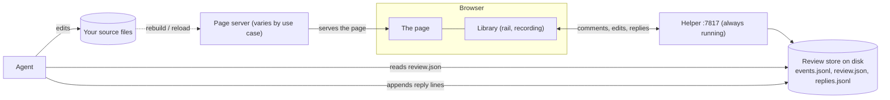
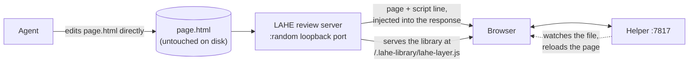
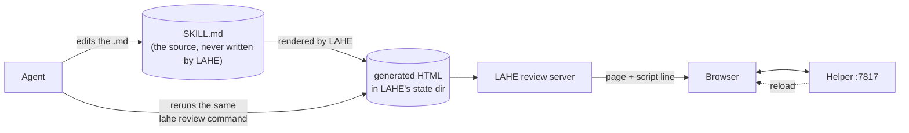
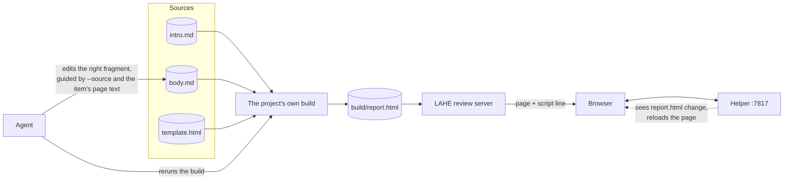
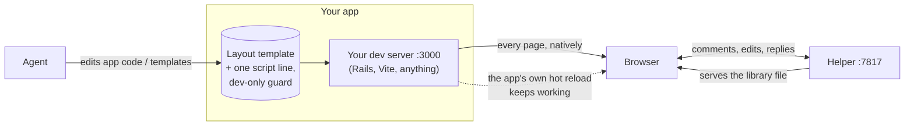
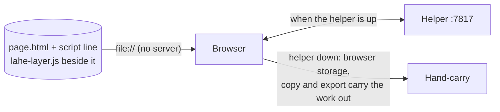

# How LAHE gets into a page: the serving architectures

When a person reviews a document in their browser and their agent acts on
the feedback, three questions decide the whole setup:

- what is actually running?
- who serves the page?
- how does the review layer get into it?

The answer changes by use case. This doc walks each one with a diagram. It is
written for someone who has never thought about the problem before. For the
agent-facing operating rules (what to run, when to reply), see `AGENTS.md`;
this doc is the map underneath those rules.

## The three moving pieces

Every setup has the same three pieces. Only the third one changes.

1. **The library.** One JavaScript file (`lahe-layer.js`). Once it is in the
   page, it draws the review rail, records comments and edits, and talks to
   the helper. It is the whole browser side of the tool.
2. **The helper.** One local Node process (`lahe serve`, usually started for
   you). It listens on a fixed loopback port (7817 by default) and owns the
   review store on disk:
   - the event log
   - `review.json`, what the agent reads
   - the reply files, where the agent answers

   It runs in every use case, no exceptions.
3. **The page server.** Whatever answers the browser's request for the page
   itself. This is the piece that varies, and it is the whole difference
   between the use cases below:
   - LAHE's own small static server (the preferred path for documents)
   - your app's own dev server (Rails, Vite, whatever you already run)
   - no server at all (the `file://` fallback)



Two facts worth holding onto before the cases:

- **The library never writes the reviewed file.** An edit in the browser
  changes the page the reviewer sees and mints a record. The agent applies
  the change to source. That is what lets one design work on a static doc and
  on a Rails page whose "source" is a template three directories away.
- **The script line is the whole installation.** The library enters a page
  through one `<script>` tag. Its four attributes carry:
  - where the library is
  - the review id
  - the per-review token
  - the helper's URL

  Every use case is really a different answer to "how does that one line get
  into the page".

## Use case 1: one HTML file that is the document

A one-pager, a presentation, a mockup, three logo options on a page. The HTML
file is the source: editing it is editing the document.

```sh
lahe review path/to/page.html
```

LAHE starts a small read-only static server rooted at the page's own folder.
It picks a free loopback port and prints one URL. The reviewer opens that URL
and nothing else.



What makes this the preferred path:

- **Nothing is written into your folder.** The script line goes into the HTTP
  response, not into the file, and the library is served from the review
  server's own route. So no review id, no token, and no copy of the library
  land next to your page. This matters because the folder is usually a git
  checkout: before this design, `git add -A` committed both, and a deployed
  copy brought the review rail up for every visitor to the live site.
- **The page reloads itself.** The helper watches the file. When the agent's
  edit lands, the reviewer's page reloads and their outstanding comments and
  edits are re-applied on top. Nobody tells anybody to refresh.
- **The server belongs to the agent session.** `lahe session close <id>`
  stops it. It is read-only and loopback-only.

One trap: the server is rooted at the page's own folder. An image beside the
page loads; an image referenced as `../assets/x.png` is above the root and
404s. Opened from disk the same page looks fine, because `file://` has no
root to escape. Load the served URL yourself before handing it over, and if
assets live above the page, move them under it or move the page.

## Use case 2: one Markdown file

A spec, a skill, a plan, a draft. The `.md` file is the document.

```sh
lahe review path/to/SKILL.md
```

Same shape as use case 1, with one extra step in front: LAHE renders the
Markdown to HTML itself and serves that generated page. The rendering:

- handles CommonMark and GFM
- draws mermaid diagrams as local SVG
- applies a neutral reading layout

The generated HTML lives in LAHE's own state directory, owned by the agent
session, never beside your source.



The loop for the agent:

1. Edit the `.md`.
2. Rerun the same `lahe review` command. It reuses the session and review
   and rebuilds the page.
3. Confirm the rendered page shows the change.
4. Reply.

Do not hand-convert Markdown to HTML or start a separate server; the
renderer exists so that never happens.

Relative images and local links work: they are served from the source folder,
and a link to another local `.md` opens as another rendered page, marked
read-only. Links stay source-true on disk; the renderer translates them for
the browser at build time.

## Use case 3: a document built from several sources

This is the composed case: a build step produces the HTML the person
actually reads. For example:

- a fully rendered prompt assembled from several `.md` fragments
- a Pandoc report with citations and templates

The rule: **the build is part of the deliverable, so LAHE never bypasses it.**
You run the project's real build, then review the output, and you tell the
review where the sources live:

```sh
npm run build-docs   # or make, or pandoc, or your render script
lahe review path/to/build/report.html --source path/to/build-entrypoint
```



The serving is identical to use case 1:

- LAHE's review server serves the built file
- the script line rides in the response
- the helper watches the built file and reloads the page when a rebuild lands

What changes is where edits go:

- **Edits go to the sources, never the built HTML.** An edit to the output is
  erased by the next build. `--source` is a navigation hint pointing at the
  build entrypoint (the manifest, top-level file, or build script that
  reveals the input set); each review item's captured page text is what
  locates the exact fragment.
- **A reply is not `handled` until the build has rerun** and the change is
  visible in the built page. That is the hard rule in `AGENTS.md`, and this
  architecture is why: the reviewer is looking at build output, so a source
  edit alone changes nothing they can see.

Use cases 2 and 3 look similar, and picking between them is a real decision.
Direct Markdown review is for one file that is the whole document. The
moment several files, includes, or filters compose the visible page, the
project's build wins, and use case 3 is yours.

## Use case 4: an app running on its own dev server

Your Rails app (or any dev server) is already serving pages at
`http://localhost:3000`. Here LAHE serves no pages at all. The app's server
and LAHE's helper run side by side, each doing its own job:

- the app's server serves every page, exactly as it always did
- the helper stores the review and serves the library file

So to answer the natural question directly: yes, there is a second server
alongside your dev server, and it is the same helper that runs in every other
use case. What does not run here is LAHE's page server; your app already is
one.

```sh
lahe review path/to/project --origin http://localhost:3000
```

This edits nothing. It registers the origin, mints the review and token, and
prints one script line for you (or your agent) to paste into the app's
layout:



How the pieces resolve in this mode:

- **The script line goes in the layout**, so every page the reviewer walks
  carries the rail. One review spans the whole walk; records carry the page
  they were made on, and `review.json` groups by page.
- **The library loads from the helper's URL.** The line's `src` points at the
  helper, so your app does not need to serve the library. The line also
  names a fallback path (`/lahe-layer.js`) that loads when the helper is
  down. Copy the built library into your app's `public/` if you want that
  fallback, or skip it.
- **Browse mode is fully native.** Links navigate, forms submit, your app's
  JavaScript sees every event. The library does not fight the framework, and
  a hot-reloading stack keeps hot-reloading; the two reload mechanisms are
  designed not to fight.
- **Editing the app is just editing the app.** The agent changes templates
  and code the way it always does; the dev server rebuilds; the library
  re-applies the reviewer's outstanding work over the new page and flags real
  collisions instead of clobbering anything.

### The guard is on you

The printed snippet includes a comment that warns you to guard it. A comment
is not a guard. The line carries a per-review token, and a script line that
ships to production brings the review rail up for every visitor. Wrap it in the
framework's real development-only conditional, and delete it when the review
is over. Nobody else will.

### Rails specifically

Rails is the first named integration (it is what Ken reviews on), and the
wiring is:

- Paste the line into `app/views/layouts/application.html.erb`, where the
  layout's scripts go, inside a real guard:

  ```erb
  <% if Rails.env.development? %>
    <script src="http://127.0.0.1:7817/..." data-lahe-review="..." ...></script>
  <% end %>
  ```

- **Turbo is handled.** The library honors and uses Turbo's own hooks: a
  region the reviewer is actively editing is marked so Turbo skips it, and
  the library re-applies committed records after Turbo repaints the page.
- **Restart if your app reads config at boot.** Rails reads the environment
  and initializers once at startup. If your project routes the review values
  through an env file or an initializer instead of pasting the literal line,
  the server must restart before the page carries them. This exact step cost
  three separate agents a blank page in the Steady Thread repo before it was
  written down.
- **A strict development CSP** can refuse the line's inline `onerror`. The
  only cost is the fallback load for when the helper is down; the primary
  library load still works.

### Any other framework

Nothing in the protocol is Rails-shaped. Any server that can put one line
into a shared layout works the same way:

- Django: the base template, inside ``
- Next.js / Vite / anything with an HTML shell: the shell, behind a
  `NODE_ENV === "development"` check
- static site generators in dev mode: the layout partial

The three things a framework must let you do:

1. put one script line into the pages under review, in development only
2. keep serving its pages itself (LAHE asks nothing of the page server)
3. optionally serve one static file (the fallback library copy)

That is the whole integration surface. What actually varies per project is
not the framework but the local conventions:

- how the server is started and restarted
- where the review values go

That is what the setup file at the end of this doc exists for.

## The fallback: opening the file straight from disk

`file://` works. Double-click the HTML file and the rail comes up, even with
the helper down:

- everything is kept in browser storage
- copy and export carry the feedback out by hand

With the helper up, `file://` joins the normal loop: a page opened from disk
sends a `null` origin, and the review registers it.

It is the fallback, not the preferred path, because it is the one mode that
writes into your folder:

- the script line goes into the HTML file itself
- a copy of the library lands beside the page (the `src` on the line points
  at the helper; the copy is the offline fallback)



Consequences that make it second choice:

- Both files sit in what is usually a git checkout, waiting to be committed.
- A rebuild that overwrites the file strips the line and takes the rail with
  it. The helper heals the file when it is running, but the served path has
  nothing to heal in the first place.
- Cleanup is a real step: `lahe add path/to/page.html --remove` takes the
  line and the sibling copy back out.

When it is genuinely right: a machine where a server cannot run, or the
assets trap above (resources that live above the page's folder resolve on
`file://` and 404 on the served path).

## So what are the architectures, in total?

Four, and every review is one of them:

| Shape | Page served by | Written into your folder | Where edits go |
| --- | --- | --- | --- |
| Static HTML doc | LAHE review server | nothing | the HTML file |
| Markdown doc | LAHE review server (LAHE renders first) | nothing | the `.md` source |
| Built document | LAHE review server (you run the build) | nothing | the source fragments, then rebuild |
| App in dev | your own dev server | one pasted line in a layout | the app's code |

Plus the `file://` fallback, which is the first shape with no server and two
files written to disk.

In every one of the four, the helper runs alongside on port 7817, the agent
reads `review.json` and appends reply lines, and the review store on disk is
the single source of truth. The only things that ever change are who serves
the page and how the script line gets into it.

Variations that are not separate architectures:

- **Several pages, one review.** Run `lahe review` again with the same
  `--session <id>`. Each page shows only its own items; `review.json` and
  `lahe status` show them all.
- **A distinct deliverable gets its own review** in the same session, for the
  same reason two documents do not share a comment thread.
- **Your own static server** (`--origin` pointing at something you run,
  serving plain files) behaves like the app-in-dev row: the origin is
  registered, the line is yours to place, the server is yours to run.

## The per-project setup file

This one is proposed, not built. The board row (`docs/BULLETIN.md`,
LAHE-project-setup-file, 2026-08-25) describes a `.lahe-setup.md` at a
project's root. The first agent that works out how to wire LAHE into a repo
writes it. Every agent after that reads it.

The motivating story: three cold agents each independently rediscovered the
same non-obvious Steady Thread step (restart the server after writing the
review values, because the env file is read once at boot) by getting an empty
page first. The knowledge died with each agent, because there was nowhere for
it to live.

What it would hold, per project:

- how a server is started and restarted here (a worktree script, not
  `rails s`, in Steady Thread's case)
- where this project chose to put the review id and token
- what needs restarting after they are written
- the gotchas an agent already paid for once

The proposed rule for agents: before wiring LAHE into an app, look for
`.lahe-setup.md` at that repo's root; follow it if it exists; write it if you
work the setup out yourself. Machine-level setup stays out of it, so one
project's instructions never leak into another's review. The board row has
the proposed AGENTS.md wording and a stub template idea.
